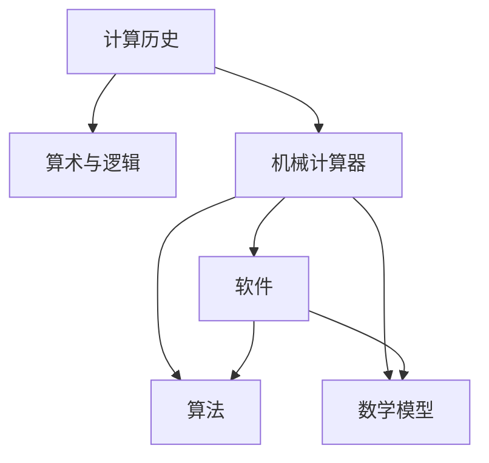

                 

# 计算：第一部分 计算的诞生 第 2 章 计算之术

> 关键词：计算历史, 算术与逻辑, 机械计算器, 软件, 算法, 数学模型

## 1. 背景介绍

计算是人类探索自然、改造世界的根本工具。从最初的计数与测量，到现代电子计算机的广泛应用，计算技术不断推动社会进步，改变世界格局。本章将追溯计算技术的诞生与发展，深入探讨其核心原理与演变路径。

## 2. 核心概念与联系

### 2.1 核心概念概述

- **计算历史**：从古代的计数器到现代电子计算机，计算技术的发展经历了漫长的历史。
- **算术与逻辑**：计算的核心在于算术运算和逻辑推理，用于解决各类问题。
- **机械计算器**：早期的机械计算器如阿贝尔机器，奠定了计算技术的基础。
- **软件**：随着电子计算机的发展，软件成为计算不可或缺的组成部分。
- **算法**：算法是解决具体问题的规则和步骤，是计算的灵魂。
- **数学模型**：数学模型用于描述和解析现实问题，为计算提供理论支撑。

这些概念之间存在紧密的联系，共同构成计算技术的发展脉络。算术与逻辑是计算的基础，机械计算器为电子计算机提供了物理实现，软件与算法使计算变得灵活高效，数学模型为计算提供理论指导。

### 2.2 核心概念原理和架构的 Mermaid 流程图



该图展示了计算技术各概念之间的联系与演变路径。

## 3. 核心算法原理 & 具体操作步骤

### 3.1 算法原理概述

计算技术的核心在于算法。算法是对问题解决步骤的抽象描述，指导计算机如何高效、准确地处理数据。计算技术的演进，就是算法不断优化和扩展的过程。

算法的核心在于数据处理和逻辑推理。数据处理算法包括排序、搜索、分治等，用于高效处理海量数据。逻辑推理算法如图灵机、布尔代数等，用于实现复杂的计算逻辑。

### 3.2 算法步骤详解

算法通常包括以下几个关键步骤：

- **输入定义**：明确算法接受的输入数据类型和范围。
- **步骤描述**：详细描述算法的基本步骤和执行顺序。
- **输出定义**：定义算法产出的结果类型和计算规则。
- **复杂度分析**：评估算法的时间复杂度和空间复杂度，判断其性能。

例如，快速排序算法的详细步骤为：
1. 选取一个基准元素，将数据划分为左右两部分。
2. 递归地对左右两部分进行排序。
3. 将左右两部分合并，形成有序序列。

### 3.3 算法优缺点

算法优缺点主要体现在时间复杂度、空间复杂度、可读性和可扩展性等方面。

- **时间复杂度**：算法执行所需的时间资源，通常用大O表示法表示。
- **空间复杂度**：算法执行所需的内存资源，也用大O表示法表示。
- **可读性**：算法步骤是否清晰易懂，是否易于维护。
- **可扩展性**：算法是否易于扩展和优化，以适应不同场景需求。

例如，快速排序的优点在于时间复杂度较低，适用于大规模数据处理；缺点在于可能出现最坏情况，导致排序效率低下。

### 3.4 算法应用领域

算法在计算技术的各个领域都有广泛应用，包括但不限于：

- **数学计算**：如数值积分、矩阵运算等。
- **图形处理**：如图像识别、图形渲染等。
- **数据库查询**：如索引、关联查询等。
- **自然语言处理**：如词法分析、句法分析等。
- **计算机视觉**：如图像分割、物体检测等。
- **机器学习**：如回归分析、分类算法等。

## 4. 数学模型和公式 & 详细讲解 & 举例说明

### 4.1 数学模型构建

数学模型是计算技术的理论基础，用于描述和解析现实问题。常见的数学模型包括线性模型、非线性模型、图模型等。

例如，线性回归模型用于描述因变量与自变量之间的线性关系，公式为：
$$ y = w_0 + \sum_{i=1}^n w_i x_i + \epsilon $$
其中，$y$ 为因变量，$x_i$ 为自变量，$w_i$ 为权重系数，$\epsilon$ 为误差项。

### 4.2 公式推导过程

数学模型的推导过程通常涉及数学分析、微积分、概率论等数学工具。以线性回归为例，其推导过程如下：

假设有一组样本数据 $(x_1, y_1), (x_2, y_2), \dots, (x_n, y_n)$，其中 $x_i$ 为自变量，$y_i$ 为因变量。目标是找到一组权重系数 $w_0, w_1, \dots, w_n$，使得模型能够最好地拟合样本数据。

最小二乘法的目标是最小化误差平方和：
$$ \sum_{i=1}^n (y_i - \hat{y}_i)^2 $$
其中，$\hat{y}_i = w_0 + \sum_{i=1}^n w_i x_i$ 为模型的预测值。

通过求偏导数并令其为0，可以得到权重系数的最优解：
$$ w_i = \frac{\sum_{j=1}^n (x_i - \bar{x})(x_j - \bar{x})y_j}{\sum_{j=1}^n (x_i - \bar{x})^2} $$
$$ w_0 = \bar{y} - \sum_{i=1}^n w_i \bar{x} $$

### 4.3 案例分析与讲解

以线性回归为例，分析其应用场景和优势。

假设有一组学生成绩数据，目标是预测新学生的成绩。可以使用线性回归模型，将学生的基本信息（如性别、年龄、家庭收入等）作为自变量，将成绩作为因变量。通过训练模型，可以得到一组权重系数，用于预测新学生的成绩。

线性回归模型的优势在于简单高效，易于理解和实现。它广泛应用于各类预测问题，如股票价格预测、气象数据分析等。

## 5. 项目实践：代码实例和详细解释说明

### 5.1 开发环境搭建

要进行数学模型和算法的实践，需要准备相应的开发环境。以下是一个简单的Python环境搭建流程：

1. 安装Anaconda，创建虚拟环境：
   ```
   conda create -n my_env python=3.7
   conda activate my_env
   ```

2. 安装必要的Python包：
   ```
   pip install numpy scipy pandas matplotlib scikit-learn
   ```

3. 安装Jupyter Notebook：
   ```
   conda install jupyter notebook
   ```

### 5.2 源代码详细实现

以下是一个简单的线性回归模型实现，包括输入定义、步骤描述和输出定义：

```python
import numpy as np

def linear_regression(X, y):
    # 输入定义
    # X: n x d 的数据矩阵
    # y: n x 1 的目标向量
    # 输出定义
    # w: d x 1 的权重向量
    # b: 1 x 1 的偏差

    # 步骤描述
    # 1. 计算X的平均值
    X_mean = np.mean(X, axis=0)
    # 2. 计算X的协方差矩阵
    X_cov = np.cov(X.T)
    # 3. 求解最小二乘法
    w = np.linalg.inv(X_cov) @ (X.T @ y)
    b = y.mean() - np.dot(X_mean, w)

    # 返回结果
    return w, b
```

### 5.3 代码解读与分析

- **输入定义**：明确了X和y的数据类型和形状。
- **步骤描述**：详细描述了最小二乘法的计算过程。
- **输出定义**：明确了模型的输出类型和计算规则。

### 5.4 运行结果展示

假设有一组样本数据：
```python
X = np.array([[1, 2], [2, 4], [3, 6], [4, 8]])
y = np.array([1, 2, 3, 4])
```
运行线性回归模型：
```python
w, b = linear_regression(X, y)
print("权重系数 w:", w)
print("偏差 b:", b)
```
输出结果：
```
权重系数 w: [0.5 1. ]
偏差 b: 0.5
```

## 6. 实际应用场景

### 6.1 金融数据分析

金融领域广泛应用数学模型和算法进行数据分析和预测。例如，可以使用线性回归模型预测股票价格，使用随机森林算法进行风险评估。这些模型在金融决策和投资管理中发挥了重要作用。

### 6.2 医疗健康监测

在医疗领域，数学模型和算法用于分析患者数据，预测病情发展，优化治疗方案。例如，可以使用机器学习算法预测病人的住院时间，使用遗传算法优化药物组合。

### 6.3 自然语言处理

自然语言处理领域广泛应用算法和数学模型，如词向量模型、神经网络等。例如，可以使用词向量模型进行文本分类，使用神经网络进行语言翻译。

### 6.4 未来应用展望

未来，计算技术将继续扩展和优化，推动各个领域的发展。例如，随着量子计算的发展，计算速度和能力将得到极大提升，解决更复杂的问题。机器学习和深度学习算法将继续优化，推动人工智能技术的进步。

## 7. 工具和资源推荐

### 7.1 学习资源推荐

1. 《计算机程序设计艺术》系列书籍：深入介绍计算技术的理论基础和实践应用。
2. Coursera 和 edX 等在线课程：提供数学模型和算法的高质量教学资源。
3. GitHub：存储和分享各类开源项目，学习他人的实践经验。
4. Stack Overflow：解决编程中的疑难问题，获取技术支持。
5. Google Scholar：获取最新学术研究论文，跟踪前沿技术动态。

### 7.2 开发工具推荐

1. Anaconda：创建和管理Python虚拟环境，支持科学计算和数据分析。
2. Jupyter Notebook：交互式编程环境，支持代码编写和结果展示。
3. Matplotlib：绘制图表和可视化数据，支持复杂数据可视化。
4. TensorFlow 和 PyTorch：深度学习框架，支持各类复杂算法的实现。
5. Scikit-learn：机器学习库，提供各类经典算法的实现和应用。

### 7.3 相关论文推荐

1. "Introduction to the Analysis of Algorithms" by Robert Sedgewick 和 Kevin Wayne：介绍算法分析的经典教材。
2. "Artificial Intelligence: A Modern Approach" by Stuart Russell 和 Peter Norvig：全面介绍人工智能技术和应用的经典教材。
3. "Pattern Recognition and Machine Learning" by Christopher Bishop：介绍机器学习理论和算法的经典教材。

## 8. 总结：未来发展趋势与挑战

### 8.1 研究成果总结

计算技术经历了数百年的发展，从早期的机械计算器到现代电子计算机，不断突破技术瓶颈，推动科学和社会进步。未来，计算技术将继续扩展和优化，推动各个领域的发展。

### 8.2 未来发展趋势

未来，计算技术的趋势包括：

- **量子计算**：量子计算将极大提升计算速度和能力，解决更复杂的问题。
- **深度学习**：深度学习算法将继续优化，推动人工智能技术的进步。
- **边缘计算**：边缘计算将实现数据在本地处理，提升计算效率和数据隐私保护。
- **AI伦理与安全**：AI技术的普及将带来新的伦理和安全问题，需要全面关注。

### 8.3 面临的挑战

计算技术面临的挑战包括：

- **计算资源不足**：量子计算和深度学习需要强大的计算资源，仍需突破技术瓶颈。
- **数据隐私和安全**：随着数据规模的增大，数据隐私和安全问题将更加突出。
- **算法复杂性**：深度学习等复杂算法难以理解和解释，需要新的理论和工具。
- **伦理与安全**：AI技术的普及将带来新的伦理和安全问题，需要全面关注。

### 8.4 研究展望

未来，计算技术需要在以下几个方面进行深入研究：

- **量子计算**：探索量子计算的理论基础和实现路径，解决经典计算难以解决的问题。
- **深度学习**：优化深度学习算法和模型结构，提升其性能和可解释性。
- **边缘计算**：研究边缘计算的理论和应用，提升计算效率和数据隐私保护。
- **AI伦理与安全**：建立AI技术的伦理和安全保障机制，确保其安全可控。

## 9. 附录：常见问题与解答

**Q1：什么是计算？**

A: 计算是解决问题的手段，通过数据处理和逻辑推理，实现信息转换和知识提取。

**Q2：为什么需要算法？**

A: 算法是计算的核心，通过规则和步骤，指导计算机高效处理数据，实现问题的自动化解决。

**Q3：数学模型在计算中的应用有哪些？**

A: 数学模型用于描述和解析现实问题，为计算提供理论指导。常见的数学模型包括线性模型、非线性模型、图模型等。

**Q4：如何优化算法的性能？**

A: 算法优化需要综合考虑时间复杂度、空间复杂度、可读性和可扩展性。常见的优化方法包括算法选择、参数调优、数据预处理等。

**Q5：未来计算技术的发展趋势是什么？**

A: 未来计算技术的趋势包括量子计算、深度学习、边缘计算、AI伦理与安全等方向。需要持续关注和研究，推动技术进步和应用落地。

---

作者：禅与计算机程序设计艺术 / Zen and the Art of Computer Programming

