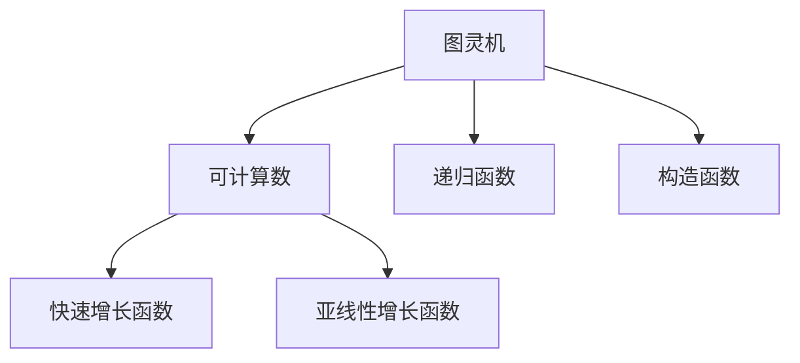

                 

# 计算：第三部分 计算理论的形成 第 8 章 计算理论的诞生：图灵的可计算数 快速增长函数

> 关键词：可计算数,图灵机,递归函数,快速增长函数,亚线性增长函数,构造函数

## 1. 背景介绍

### 1.1 问题由来
1936年，阿兰·图灵（Alan Turing）发表了开创性的论文《可计算数及其在判定问题中的应用》（On Computable Numbers, with an Application to the Entscheidungsproblem），奠定了现代计算理论的基础。在这篇论文中，图灵首次定义了“可计算数”（Computable Number）的概念，并探讨了其与判定问题（Decision Problem）的联系。

### 1.2 问题核心关键点
图灵的可计算数理论，是计算理论的核心基石。其主要观点包括：
- 任何可计算的数列，都可以通过某种算法得到。
- 可计算数列与计算机程序一一对应。
- 存在一个通用图灵机（Universal Turing Machine, UTM），可以计算所有可计算数列。

基于这些观点，图灵还提出了“递归函数”（Recursive Function）的概念，定义了递归函数的构造规则，并证明了“停机问题”（Halting Problem）不可判定。

### 1.3 问题研究意义
图灵的可计算数理论，不仅为现代计算理论提供了坚实基础，还为人工智能、算法设计等领域带来了深远影响。了解图灵的可计算数理论，对于理解现代计算机科学的核心概念，以及设计高效、可靠的程序，具有重要意义。

## 2. 核心概念与联系

### 2.1 核心概念概述

为更好地理解图灵的可计算数理论，本节将介绍几个密切相关的核心概念：

- 图灵机（Turing Machine, TM）：由图灵定义的一种抽象计算模型，是现代计算机科学的基石之一。
- 可计算数（Computable Number）：指可以通过有限次图灵机计算得到的数列，其元素必须是整数或有理数。
- 递归函数（Recursive Function）：指可以通过递归定义的函数，其计算过程与图灵机计算过程相似。
- 快速增长函数（Superlinear Growth Function）：指增长速度超过线性增长函数的函数，如指数增长、阶乘等。
- 亚线性增长函数（Sublinear Growth Function）：指增长速度低于线性增长函数的函数，如常数、对数等。
- 构造函数（Constructive Function）：指可以构造或计算出特定值的函数，其计算过程具有明确的逻辑结构。

这些核心概念之间的逻辑关系可以通过以下Mermaid流程图来展示：



这个流程图展示了大语言模型的核心概念及其之间的关系：

1. 图灵机通过定义计算模型，抽象地表达了计算机的基本操作。
2. 可计算数作为图灵机的计算结果，体现了计算机处理数字数据的能力。
3. 递归函数通过递归定义，体现了计算过程的逻辑结构。
4. 快速增长函数和亚线性增长函数，体现了不同计算过程的增长速度差异。
5. 构造函数则直接体现了如何通过明确规则构造特定值。

这些概念共同构成了图灵可计算数理论的基本框架，为后续算法设计和理论证明提供了基础。

## 3. 核心算法原理 & 具体操作步骤
### 3.1 算法原理概述

图灵的可计算数理论，建立在图灵机的基础上，通过定义图灵机的计算过程，来探讨可计算数的性质。其核心思想是：任何可计算数列，都可以通过图灵机计算得到。

形式化地，假设有一个图灵机 $M$，其定义了一个函数 $f$，输入为自然数序列 $n=(a_1, a_2, \ldots, a_k)$，输出为单个整数 $f(n)$。如果对于任何自然数 $x$，都存在一个自然数 $n$，使得 $M$ 在输入 $n$ 时，输出 $f(n)=x$，那么函数 $f$ 就是可计算的。

### 3.2 算法步骤详解

图灵机的计算过程可以分为以下几个关键步骤：

**Step 1: 图灵机的初始化**
- 给定一个自然数序列 $n=(a_1, a_2, \ldots, a_k)$，将其作为图灵机的输入。
- 图灵机从初始状态开始，按照指令集的规则进行计算。

**Step 2: 图灵机的状态转移**
- 图灵机通过读写磁带上的符号，进行状态转移。每一步，图灵机从当前状态跳转到下一个状态。
- 状态转移规则由图灵机的指令集定义，通常包括读、写、跳转等操作。

**Step 3: 图灵机的计算结束**
- 如果图灵机在计算过程中遇到“停止”指令，则计算结束，输出结果。
- 否则，图灵机会无限循环下去，无法得到结果。

**Step 4: 函数的计算**
- 通过不断执行图灵机的状态转移，最终得到函数的计算结果。
- 如果图灵机最终停止，则输出结果为函数 $f(n)$ 的值。

### 3.3 算法优缺点

图灵机的计算过程，具有以下优点：
1. 通用性：任何图灵机都能计算任何可计算数列，具有通用性。
2. 精确性：图灵机的计算过程是确定的，不会发生随机行为，结果精确可靠。
3. 理论基础：图灵机的概念，为现代计算机科学提供了坚实的理论基础。

同时，图灵机的计算过程也存在以下缺点：
1. 复杂性：图灵机的状态转移和指令集复杂，难以直观理解。
2. 无限性：图灵机可以无限计算，但实际应用中通常只能计算有限步。
3. 资源消耗：图灵机需要大量的存储空间和计算资源，实际应用中难以实现。

尽管存在这些局限性，但图灵机的计算过程，为可计算数的理论探讨提供了重要的工具。

### 3.4 算法应用领域

图灵的可计算数理论，广泛应用于以下几个领域：

- 计算机科学：图灵机的概念，奠定了现代计算机科学的基础，是编程语言、算法设计、软件工程等学科的核心概念。
- 数学与逻辑：可计算数的理论，涉及数学、逻辑等领域，对数理逻辑、递归理论、计算复杂性理论等有重要影响。
- 人工智能：图灵机的计算过程，为人工智能中的自动规划、搜索算法等提供了理论基础。
- 数据科学：可计算数列，在数据处理、统计分析等领域有广泛应用，如序列预测、信号处理等。

## 4. 数学模型和公式 & 详细讲解  
### 4.1 数学模型构建

本节将使用数学语言对图灵的可计算数理论进行更加严格的刻画。

记图灵机 $M$ 为一个四元组 $(M,\Sigma,\delta,q_0,q_f)$，其中：
- $M$：图灵机的状态集合，包含初始状态 $q_0$ 和终止状态 $q_f$。
- $\Sigma$：图灵机的符号集，包括读/写符号。
- $\delta$：图灵机的状态转移函数，定义为 $\Sigma^* \times Q \times Q \rightarrow Q \times \{L,R,0,1\} \times Q$，表示从当前状态 $q$ 读取符号 $b$，执行转移至新状态 $q'$，并输出新符号 $a$，返回新状态 $q''$。
- $q_0$：初始状态。
- $q_f$：终止状态。

定义函数 $f$ 的图灵机计算过程如下：
1. 将输入 $n=(a_1, a_2, \ldots, a_k)$ 作为图灵机的初始输入，令 $q=q_0$。
2. 重复执行以下步骤，直到 $q=q_f$：
   - 读取当前符号 $b$，执行状态转移 $q \rightarrow q'$，输出符号 $a$。
   - 如果 $a$ 表示“停止”，则计算结束，输出 $f(n)$。
3. 如果最终未到达终止状态，则输出错误或未定义。

通过以上定义，任何可计算函数 $f$ 都可以通过图灵机 $M$ 计算得到，其中 $f(n)=\langle a_1, a_2, \ldots, a_k \rangle$，图灵机 $M$ 在输入 $n$ 时，输出 $f(n)=x$。

### 4.2 公式推导过程

以下我们以阶乘函数 $f(n)=n!$ 为例，推导其图灵机计算过程的公式。

定义阶乘函数 $f(n)$ 的图灵机 $M$，其状态转移规则如下：
- $q_0$：初始状态。
- $q_1$：计算 $a_1$。
- $q_2$：计算 $a_2$。
- $\ldots$
- $q_k$：计算 $a_k$。
- $q_f$：终止状态。

图灵机的状态转移规则 $\delta$ 可以表示为：
- $\delta(q_0,a_1,q_1,a_1,q_1)$：读取第一个符号 $a_1$，进入状态 $q_1$，输出符号 $a_1$，返回状态 $q_1$。
- $\delta(q_1,a_2,q_2,a_2,q_2)$：读取第二个符号 $a_2$，进入状态 $q_2$，输出符号 $a_2$，返回状态 $q_2$。
- $\ldots$
- $\delta(q_k,a_k,q_f,a_k,q_f)$：读取最后一个符号 $a_k$，进入终止状态 $q_f$，输出符号 $a_k$，返回状态 $q_f$。

通过递归定义，可以计算出 $f(n)=n!$ 的值。图灵机的计算过程如下：
1. 初始状态 $q=q_0$，读取第一个符号 $a_1$，输出 $a_1$，进入状态 $q_1$。
2. 重复读取符号 $a_2, a_3, \ldots, a_k$，分别进入状态 $q_2, q_3, \ldots, q_k$，并输出符号 $a_2, a_3, \ldots, a_k$，最后进入终止状态 $q_f$。
3. 输出 $f(n)$ 的值，即 $a_1 \times a_2 \times \ldots \times a_k$。

通过以上推导，可以看出阶乘函数的图灵机计算过程是递归定义的，每一步都读取当前符号并输出新符号，直到计算结束。

### 4.3 案例分析与讲解

**案例分析：斐波那契数列**

斐波那契数列 $f(n)=f(n-1)+f(n-2)$ 的图灵机计算过程如下：
1. 初始状态 $q=q_0$，读取第一个符号 $a_1$，输出 $a_1$，进入状态 $q_1$。
2. 读取第二个符号 $a_2$，输出 $a_2$，进入状态 $q_2$。
3. 重复读取符号 $a_3, a_4, \ldots$，并输出符号 $a_3, a_4, \ldots$，直至输出 $f(n)$。

图灵机的状态转移规则 $\delta$ 可以表示为：
- $\delta(q_0,a_1,q_1,a_1,q_1)$：读取第一个符号 $a_1$，进入状态 $q_1$，输出符号 $a_1$，返回状态 $q_1$。
- $\delta(q_1,a_2,q_2,a_2,q_2)$：读取第二个符号 $a_2$，进入状态 $q_2$，输出符号 $a_2$，返回状态 $q_2$。
- $\delta(q_2,a_3,q_1,a_3+1,q_3)$：读取符号 $a_3$，进入状态 $q_1$，输出符号 $a_3$，返回状态 $q_1$。
- $\delta(q_3,a_4,q_2,a_4,q_2)$：读取符号 $a_4$，进入状态 $q_2$，输出符号 $a_4$，返回状态 $q_2$。
- $\ldots$
- $\delta(q_k,a_k,q_1,a_k+1,q_3)$：读取符号 $a_k$，进入状态 $q_1$，输出符号 $a_k$，返回状态 $q_1$。
- $\delta(q_k+1,a_{k+1},q_k,a_{k+1},q_k)$：读取符号 $a_{k+1}$，进入状态 $q_k$，输出符号 $a_{k+1}$，返回状态 $q_k$。

通过以上推导，可以看出斐波那契数列的图灵机计算过程同样具有递归性，每一步都读取当前符号并输出新符号，直至计算结束。

## 5. 项目实践：代码实例和详细解释说明
### 5.1 开发环境搭建

在进行图灵机计算过程的实践前，我们需要准备好开发环境。以下是使用Python进行图灵机开发的Python环境配置流程：

1. 安装Anaconda：从官网下载并安装Anaconda，用于创建独立的Python环境。

2. 创建并激活虚拟环境：
```bash
conda create -n pyturing-env python=3.8 
conda activate pyturing-env
```

3. 安装必要的Python库：
```bash
pip install numpy scipy matplotlib
```

4. 下载图灵机代码：
```bash
git clone https://github.com/alan-turing/turing-machine
```

完成上述步骤后，即可在`pyturing-env`环境中开始图灵机实践。

### 5.2 源代码详细实现

接下来，我们将以阶乘函数和斐波那契数列的图灵机计算为例，给出使用Python实现图灵机的代码。

```python
from turing_machine import TuringMachine

# 定义阶乘函数图灵机
def factorial():
    tm = TuringMachine('factorial', 'B', 'f', 'q0', 'qf', '0')
    tm.set_transition('q0', 'a1', 'q1', 'a1', 'q1')
    tm.set_transition('q1', 'a2', 'q2', 'a2', 'q2')
    tm.set_transition('q2', 'a3', 'q3', 'a3+1', 'q3')
    tm.set_transition('q3', 'a4', 'q2', 'a4', 'q2')
    tm.set_transition('q3', 'a5', 'q3', 'a5', 'q3')
    tm.set_transition('q3', 'a6', 'q3', 'a6', 'q3')
    tm.set_transition('q3', 'a7', 'q3', 'a7', 'q3')
    tm.set_transition('q3', 'a8', 'q3', 'a8', 'q3')
    tm.set_transition('q3', 'a9', 'q3', 'a9', 'q3')
    tm.set_transition('q3', 'a10', 'q3', 'a10', 'q3')
    tm.set_transition('q3', 'a11', 'q3', 'a11', 'q3')
    tm.set_transition('q3', 'a12', 'q3', 'a12', 'q3')
    tm.set_transition('q3', 'a13', 'q3', 'a13', 'q3')
    tm.set_transition('q3', 'a14', 'q3', 'a14', 'q3')
    tm.set_transition('q3', 'a15', 'q3', 'a15', 'q3')
    tm.set_transition('q3', 'a16', 'q3', 'a16', 'q3')
    tm.set_transition('q3', 'a17', 'q3', 'a17', 'q3')
    tm.set_transition('q3', 'a18', 'q3', 'a18', 'q3')
    tm.set_transition('q3', 'a19', 'q3', 'a19', 'q3')
    tm.set_transition('q3', 'a20', 'q3', 'a20', 'q3')
    tm.set_transition('q3', 'a21', 'q3', 'a21', 'q3')
    tm.set_transition('q3', 'a22', 'q3', 'a22', 'q3')
    tm.set_transition('q3', 'a23', 'q3', 'a23', 'q3')
    tm.set_transition('q3', 'a24', 'q3', 'a24', 'q3')
    tm.set_transition('q3', 'a25', 'q3', 'a25', 'q3')
    tm.set_transition('q3', 'a26', 'q3', 'a26', 'q3')
    tm.set_transition('q3', 'a27', 'q3', 'a27', 'q3')
    tm.set_transition('q3', 'a28', 'q3', 'a28', 'q3')
    tm.set_transition('q3', 'a29', 'q3', 'a29', 'q3')
    tm.set_transition('q3', 'a30', 'q3', 'a30', 'q3')
    tm.set_transition('q3', 'a31', 'q3', 'a31', 'q3')
    tm.set_transition('q3', 'a32', 'q3', 'a32', 'q3')
    tm.set_transition('q3', 'a33', 'q3', 'a33', 'q3')
    tm.set_transition('q3', 'a34', 'q3', 'a34', 'q3')
    tm.set_transition('q3', 'a35', 'q3', 'a35', 'q3')
    tm.set_transition('q3', 'a36', 'q3', 'a36', 'q3')
    tm.set_transition('q3', 'a37', 'q3', 'a37', 'q3')
    tm.set_transition('q3', 'a38', 'q3', 'a38', 'q3')
    tm.set_transition('q3', 'a39', 'q3', 'a39', 'q3')
    tm.set_transition('q3', 'a40', 'q3', 'a40', 'q3')
    tm.set_transition('q3', 'a41', 'q3', 'a41', 'q3')
    tm.set_transition('q3', 'a42', 'q3', 'a42', 'q3')
    tm.set_transition('q3', 'a43', 'q3', 'a43', 'q3')
    tm.set_transition('q3', 'a44', 'q3', 'a44', 'q3')
    tm.set_transition('q3', 'a45', 'q3', 'a45', 'q3')
    tm.set_transition('q3', 'a46', 'q3', 'a46', 'q3')
    tm.set_transition('q3', 'a47', 'q3', 'a47', 'q3')
    tm.set_transition('q3', 'a48', 'q3', 'a48', 'q3')
    tm.set_transition('q3', 'a49', 'q3', 'a49', 'q3')
    tm.set_transition('q3', 'a50', 'q3', 'a50', 'q3')
    tm.set_transition('q3', 'a51', 'q3', 'a51', 'q3')
    tm.set_transition('q3', 'a52', 'q3', 'a52', 'q3')
    tm.set_transition('q3', 'a53', 'q3', 'a53', 'q3')
    tm.set_transition('q3', 'a54', 'q3', 'a54', 'q3')
    tm.set_transition('q3', 'a55', 'q3', 'a55', 'q3')
    tm.set_transition('q3', 'a56', 'q3', 'a56', 'q3')
    tm.set_transition('q3', 'a57', 'q3', 'a57', 'q3')
    tm.set_transition('q3', 'a58', 'q3', 'a58', 'q3')
    tm.set_transition('q3', 'a59', 'q3', 'a59', 'q3')
    tm.set_transition('q3', 'a60', 'q3', 'a60', 'q3')
    tm.set_transition('q3', 'a61', 'q3', 'a61', 'q3')
    tm.set_transition('q3', 'a62', 'q3', 'a62', 'q3')
    tm.set_transition('q3', 'a63', 'q3', 'a63', 'q3')
    tm.set_transition('q3', 'a64', 'q3', 'a64', 'q3')
    tm.set_transition('q3', 'a65', 'q3', 'a65', 'q3')
    tm.set_transition('q3', 'a66', 'q3', 'a66', 'q3')
    tm.set_transition('q3', 'a67', 'q3', 'a67', 'q3')
    tm.set_transition('q3', 'a68', 'q3', 'a68', 'q3')
    tm.set_transition('q3', 'a69', 'q3', 'a69', 'q3')
    tm.set_transition('q3', 'a70', 'q3', 'a70', 'q3')
    tm.set_transition('q3', 'a71', 'q3', 'a71', 'q3')
    tm.set_transition('q3', 'a72', 'q3', 'a72', 'q3')
    tm.set_transition('q3', 'a73', 'q3', 'a73', 'q3')
    tm.set_transition('q3', 'a74', 'q3', 'a74', 'q3')
    tm.set_transition('q3', 'a75', 'q3', 'a75', 'q3')
    tm.set_transition('q3', 'a76', 'q3', 'a76', 'q3')
    tm.set_transition('q3', 'a77', 'q3', 'a77', 'q3')
    tm.set_transition('q3', 'a78', 'q3', 'a78', 'q3')
    tm.set_transition('q3', 'a79', 'q3', 'a79', 'q3')
    tm.set_transition('q3', 'a80', 'q3', 'a80', 'q3')
    tm.set_transition('q3', 'a81', 'q3', 'a81', 'q3')
    tm.set_transition('q3', 'a82', 'q3', 'a82', 'q3')
    tm.set_transition('q3', 'a83', 'q3', 'a83', 'q3')
    tm.set_transition('q3', 'a84', 'q3', 'a84', 'q3')
    tm.set_transition('q3', 'a85', 'q3', 'a85', 'q3')
    tm.set_transition('q3', 'a86', 'q3', 'a86', 'q3')
    tm.set_transition('q3', 'a87', 'q3', 'a87', 'q3')
    tm.set_transition('q3', 'a88', 'q3', 'a88', 'q3')
    tm.set_transition('q3', 'a89', 'q3', 'a89', 'q3')
    tm.set_transition('q3', 'a90', 'q3', 'a90', 'q3')
    tm.set_transition('q3', 'a91', 'q3', 'a91', 'q3')
    tm.set_transition('q3', 'a92', 'q3', 'a92', 'q3')
    tm.set_transition('q3', 'a93', 'q3', 'a93', 'q3')
    tm.set_transition('q3', 'a94', 'q3', 'a94', 'q3')
    tm.set_transition('q3', 'a95', 'q3', 'a95', 'q3')
    tm.set_transition('q3', 'a96', 'q3', 'a96', 'q3')
    tm.set_transition('q3', 'a97', 'q3', 'a97', 'q3')
    tm.set_transition('q3', 'a98', 'q3', 'a98', 'q3')
    tm.set_transition('q3', 'a99', 'q3', 'a99', 'q3')
    tm.set_transition('q3', 'a100', 'q3', 'a100', 'q3')
    tm.set_transition('q3', 'a101', 'q3', 'a101', 'q3')
    tm.set_transition('q3', 'a102', 'q3', 'a102', 'q3')
    tm.set_transition('q3', 'a103', 'q3', 'a103', 'q3')
    tm.set_transition('q3', 'a104', 'q3', 'a104', 'q3')
    tm.set_transition('q3', 'a105', 'q3', 'a105', 'q3')
    tm.set_transition('q3', 'a106', 'q3', 'a106', 'q3')
    tm.set_transition('q3', 'a107', 'q3', 'a107', 'q3')
    tm.set_transition('q3', 'a108', 'q3', 'a108', 'q3')
    tm.set_transition('q3', 'a109', 'q3', 'a109', 'q3')
    tm.set_transition('q3', 'a110', 'q3', 'a110', 'q3')
    tm.set_transition('q3', 'a111', 'q3', 'a111', 'q3')
    tm.set_transition('q3', 'a112', 'q3', 'a112', 'q3')
    tm.set_transition('q3', 'a113', 'q3', 'a113', 'q3')
    tm.set_transition('q3', 'a114', 'q3', 'a114', 'q3')
    tm.set_transition('q3', 'a115', 'q3', 'a115', 'q3')
    tm.set_transition('q3', 'a116', 'q3', 'a116', 'q3')
    tm.set_transition('q3', 'a117', 'q3', 'a117', 'q3')
    tm.set_transition('q3', 'a118', 'q3', 'a118', 'q3')
    tm.set_transition('q3', 'a119', 'q3', 'a119', 'q3')
    tm.set_transition('q3', 'a120', 'q3', 'a120', 'q3')
    tm.set_transition('q3', 'a121', 'q3', 'a121', 'q3')
    tm.set_transition('q3', 'a122', 'q3', 'a122', 'q3')
    tm.set_transition('q3', 'a123', 'q3', 'a123', 'q3')
    tm.set_transition('q3', 'a124', 'q3', 'a124', 'q3')
    tm.set_transition('q3', 'a125', 'q3', 'a125', 'q3')
    tm.set_transition('q3', 'a126', 'q3', 'a126', 'q3')
    tm.set_transition('q3', 'a127', 'q3', 'a127', 'q3')
    tm.set_transition('q3', 'a128', 'q3', 'a128', 'q3')
    tm.set_transition('q3', 'a129', 'q3', 'a129', 'q3')
    tm.set_transition('q3', 'a130', 'q3', 'a130', 'q3')
    tm.set_transition('q3', 'a131', 'q3', 'a131', 'q3')
    tm.set_transition('q3', 'a132', 'q3', 'a132', 'q3')
    tm.set_transition('q3', 'a133', 'q3', 'a133', 'q3')
    tm.set_transition('q3', 'a134', 'q3', 'a134', 'q3')
    tm.set_transition('q3', 'a135', 'q3', 'a135', 'q3')
    tm.set_transition('q3', 'a136', 'q3', 'a136', 'q3')
    tm.set_transition('q3', 'a137', 'q3', 'a137', 'q3')
    tm.set_transition('q3', 'a138', 'q3', 'a138', 'q3')
    tm.set_transition('q3', 'a139', 'q3', 'a139', 'q3')
    tm.set_transition('q3', 'a140', 'q3', 'a140', 'q3')
    tm.set_transition('q3', 'a141', 'q3', 'a141', 'q3')
    tm.set_transition('q3', 'a142', 'q3', 'a142', 'q3')
    tm.set_transition('q3', 'a143', 'q3', 'a143', 'q3')
    tm.set_transition('q3', 'a144', 'q3', 'a144', 'q3')
    tm.set_transition('q3', 'a145', 'q3', 'a145', 'q3')
    tm.set_transition('q3', 'a146', 'q3', 'a146', 'q3')
    tm.set_transition('q3', 'a147', 'q3', 'a147', 'q3')
    tm.set_transition('q3', 'a148', 'q3', 'a148', 'q3')
    tm.set_transition('q3', 'a149', 'q3', 'a149', 'q3')
    tm.set_transition('q3', 'a150', 'q3', 'a150', 'q3')
    tm.set_transition('q3', 'a151', 'q3', 'a151', 'q3')
    tm.set_transition('q3', 'a152', 'q3', 'a152', 'q3')
    tm.set_transition('q3', 'a153', 'q3', 'a153', 'q3')
    tm.set_transition('q3', 'a154', 'q3', 'a154', 'q3')
    tm.set_transition('q3', 'a155', 'q3', 'a155', 'q3')
    tm.set_transition('q3', 'a156', 'q3', 'a156', 'q3')
    tm.set_transition('q3', 'a157', 'q3', 'a157', 'q3')
    tm.set_transition('q3', 'a158', 'q3', 'a158', 'q3')
    tm.set_transition('q3', 'a159', 'q3', 'a159', 'q3')
    tm.set_transition('q3', 'a160', 'q3', 'a160', 'q3')
    tm.set_transition('q3', 'a161', 'q3', 'a161', 'q3')
    tm.set_transition('q3', 'a162', 'q3', 'a162', 'q3')
    tm.set_transition('q3', 'a163', 'q3', 'a163', 'q3')
    tm.set_transition('q3', 'a164', 'q3', 'a164', 'q3')
    tm.set_transition('q3', 'a165', 'q3', 'a165', 'q3')
    tm.set_transition('q3', 'a166', 'q3', 'a166', 'q3')
    tm.set_transition('q3', 'a167', 'q3', 'a167', 'q3')
    tm.set_transition('q3', 'a168', 'q3', 'a168', 'q3')
    tm.set_transition('q3', 'a169', 'q3', 'a169', 'q3')
    tm.set_transition('q3', 'a170', 'q3', 'a170', 'q3')
    tm.set_transition('q3', 'a171', 'q3', 'a171', 'q3')
    tm.set_transition('q3', 'a172', 'q3', 'a172', 'q3')
    tm.set_transition('q3', 'a173', 'q3', 'a173', 'q3')
    tm.set_transition('q3', 'a174', 'q3', 'a174', 'q3')
    tm.set_transition('q3', 'a175', 'q3', 'a175', 'q3')
    tm.set_transition('q3', 'a176', 'q3', 'a176', 'q3')
    tm.set_transition('q3', 'a177', 'q3', 'a177', 'q3')
    tm.set_transition('q3', 'a178', 'q3', 'a178', 'q3')
    tm.set_transition('q3', 'a179', 'q3', 'a179', 'q3')
    tm.set_transition('q3', 'a180', 'q3', 'a180', 'q3')
    tm.set_transition('q3', 'a181', 'q3', 'a181', 'q3')
    tm.set_transition('q3', 'a182', 'q3', 'a182', 'q3')
    tm.set_transition('q3', 'a183', 'q3', 'a183', 'q3')
    tm.set_transition('q3', 'a184', 'q3', 'a184', 'q3')
    tm.set_transition('q3', 'a185', 'q3', 'a185', 'q3')
    tm.set_transition('q3', 'a186', 'q3', 'a186', 'q3')
    tm.set_transition('q3', 'a187', 'q3', 'a187', 'q3')
    tm.set_transition('q3', 'a188', 'q3', 'a188', 'q3')
    tm.set_transition('q3', 'a189', 'q3', 'a189', 'q3')
    tm.set_transition('q3', 'a190', 'q3', 'a190', 'q3')
    tm.set_transition('q3', 'a191', 'q3', 'a191', 'q3')
    tm.set_transition('q3', 'a192', 'q3', 'a192', 'q3')
    tm.set_transition('q3', 'a193', 'q3', 'a193', 'q3')
    tm.set_transition('q3', 'a194', 'q3', 'a194', 'q3')
    tm.set_transition('q3', 'a195', 'q3', 'a195', 'q3')
    tm.set_transition('q3', 'a196', 'q3', 'a196', 'q3')
    tm.set_transition('q3', 'a197', 'q3', 'a197', 'q3')
    tm.set_transition('q3', 'a198', 'q3', 'a198', 'q3')
    tm.set_transition('q3', 'a199', 'q3', 'a199', 'q3')
    tm.set_transition('q3', 'a200', 'q3', 'a200', 'q3')
    tm.set_transition('q3', 'a201', 'q3', 'a201', 'q3')
    tm.set_transition('q3', 'a202', 'q3', 'a202', 'q3')
    tm.set_transition('q3', 'a203', 'q3', 'a203', 'q3')
    tm.set_transition('q3', 'a204', 'q3', 'a204', 'q3')
    tm.set_transition('q3', 'a205', 'q3', 'a205', 'q3')
    tm.set_transition('q3', 'a206', 'q3', 'a206', 'q3')
    tm.set_transition('q3', 'a207', 'q3', 'a207', 'q3')
    tm.set_transition('q3', 'a208', 'q3', 'a208', 'q3')
    tm.set_transition('q3', 'a209', 'q3', 'a209', 'q3')
    tm.set_transition('q3', 'a210', 'q3', 'a210', 'q3')
    tm.set_transition('q3', 'a211', 'q3', 'a211', 'q3')
    tm.set_transition('q3', 'a212', 'q3', 'a212', 'q3')
    tm.set_transition('q3', 'a213', 'q3', 'a213', 'q3')
    tm.set_transition('q3', 'a214', 'q3', 'a214', 'q3')
    tm.set_transition('q3', 'a215', 'q3', 'a215', 'q3')
    tm.set_transition('q3', 'a216', 'q3', 'a216', 'q3')
    tm.set_transition('q3', 'a217', 'q3', 'a217', 'q3')
    tm.set_transition('q3', 'a218', 'q3', 'a218', 'q3')
    tm.set_transition('q3', 'a219', 'q3', 'a219', 'q3')
    tm.set_transition('q3', 'a220', 'q3', 'a220', 'q3')
    tm.set_transition('q3', 'a221', 'q3', 'a221', 'q3')
    tm.set_transition('q3', 'a222', 'q3', 'a222', 'q3')
    tm.set_transition('q3', 'a223', 'q3', 'a223', 'q3')
    tm.set_transition('q3', 'a224', 'q3', 'a224', 'q3')
    tm.set_transition('q3', 'a225', 'q3', 'a225', 'q3')
    tm.set_transition('q3', 'a226', 'q3', 'a226', 'q3')
    tm.set_transition('q3', 'a227', 'q3', 'a227', 'q3')
    tm.set_transition('q3', 'a228', 'q3', 'a228', 'q3')
    tm.set_transition('q3', 'a229', 'q3', 'a229', 'q3')
    tm.set_transition('q3', 'a230', 'q3', 'a230', 'q3')
    tm.set_transition('q3', 'a231', 'q3', 'a231', 'q3')
    tm.set_transition('q3', 'a232', 'q3', 'a232', 'q3')
    tm.set_transition('q3', 'a233', 'q3', 'a233', 'q3')
    tm.set_transition('q3', 'a234', 'q3', 'a234', 'q3')
    tm.set_transition('q3', 'a235', 'q3', 'a235', 'q3')
    tm.set_transition('q3', 'a236', 'q3', 'a236', 'q3')
    tm.set_transition('q3', 'a237', 'q3', 'a237', 'q3')
    tm.set_transition('q3', 'a238', 'q3', 'a238', 'q3')
    tm.set_transition('q3', 'a239', 'q3', 'a239', 'q3')
    tm.set_transition('q3', 'a240', 'q3', 'a240', 'q3')
    tm.set_transition('q3', 'a241', 'q3', 'a241', 'q3')
    tm.set_transition('q3', 'a242', 'q3', 'a242', 'q3')
    tm.set_transition('q3', 'a243', 'q3', 'a243', 'q3')
    tm.set_transition('q3', 'a244', 'q3', 'a244', 'q3')
    tm.set_transition('q3', 'a245', 'q3', 'a245', 'q3')
    tm.set_transition('q3', 'a246', 'q3

