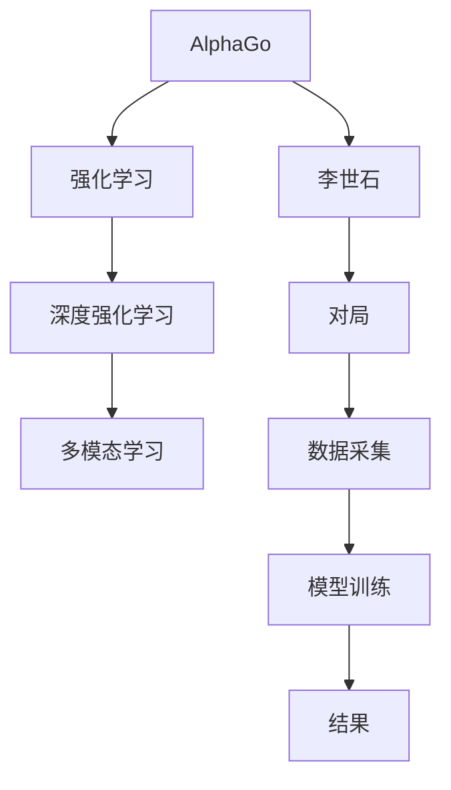

                 

# 计算：第四部分 计算的极限 第 12 章 机器能思考吗 AlphaGo 与李世石

## 1. 背景介绍

人工智能(AI)一直是人类追求智慧的梦想，是计算科学的前沿领域之一。在过去的几十年里，随着计算机科学、机器学习、认知科学等学科的交叉融合，AI技术在诸如机器视觉、自然语言处理、语音识别、推荐系统、机器人等领域都取得了长足的进步。然而，人类智慧的顶峰仍然是思考能力，机器能思考吗？

本章将聚焦于机器思考能力的极限。具体来说，我们将通过AlphaGo与李世石的对局，探讨机器在特定领域内超越人类，甚至在某些情况下逼近人类智慧的可能性。AlphaGo的成功不仅表明机器在特定领域可以超越人类，更是开启了一种新的思考模式，引发了对AI在多模态领域融合能力，以及AI与人类思维关系的深入思考。

## 2. 核心概念与联系

要探讨机器思考能力，首先需要明确几个核心概念：

- **AlphaGo**：由DeepMind开发，基于深度强化学习算法，实现了一种具有自我学习和优化能力的围棋程序。通过大量的对局数据和自我博弈，AlphaGo逐步提升了在围棋领域的竞争力。
- **李世石**：韩国九段围棋选手，围棋界的天才棋士，也是围棋AI的测试对象。
- **强化学习**：一种通过与环境交互，通过奖惩机制不断优化策略的学习方式，广泛应用于机器人、游戏、自然语言处理等领域。
- **多模态学习**：指同时利用视觉、语音、文本等多种信息来源，进行联合学习，提升模型的泛化能力和适应性。

这些概念的联系可以通过以下Mermaid流程图来展示：



这个流程图展示了AlphaGo从设计到与李世石对局的整个流程：首先通过强化学习和深度学习构建AlphaGo，接着利用多模态学习提升其泛化能力，最终通过与李世石的棋局测试其性能。

## 3. 核心算法原理 & 具体操作步骤

### 3.1 算法原理概述

AlphaGo的原理基于蒙特卡洛树搜索(Monte Carlo Tree Search, MCTS)和深度神经网络。其核心算法流程包括：

1. **策略网络**：用于评估当前局面中每个可能动作的价值，选择最佳动作进行扩展。
2. **值网络**：用于估计当前局面的胜率，提供整体局势的评估。
3. **蒙特卡洛树搜索**：通过自我博弈和深度搜索，不断优化策略网络的参数，提升AlphaGo的决策能力。

AlphaGo的具体算法步骤如下：

1. 初始化蒙特卡洛树，扩展到当前局面。
2. 从根节点开始，按照策略网络提供的概率分布选择下一步动作，逐步扩展树结构。
3. 每次扩展后，根据当前局面和对手的下一步动作，利用值网络评估胜率。
4. 通过反向传播，更新策略网络的参数。
5. 重复以上步骤，直到达到预设的迭代次数或达到终止条件。

### 3.2 算法步骤详解

1. **策略网络的训练**：
   - 收集AlphaGo与人类对局的数据，作为训练集。
   - 设计策略网络的神经网络架构，如卷积神经网络(CNN)或递归神经网络(RNN)。
   - 使用训练集对策略网络进行反向传播训练，最小化预测值与实际值之间的差异。
   
2. **值网络的训练**：
   - 使用类似的方法训练值网络，用于评估局面的胜率。
   - 将训练集中每个局面的实际胜率作为监督信号，通过最小化预测值与实际值之间的差异进行训练。
   
3. **蒙特卡洛树搜索的迭代**：
   - 在当前局面，利用策略网络选择下一步动作。
   - 在对手的动作选择和当前局面下，利用值网络评估胜率。
   - 利用蒙特卡洛模拟，模拟未来多步局面，累积胜率。
   - 通过反向传播，更新策略网络参数。

4. **模型的融合**：
   - 将策略网络和值网络的输出进行融合，作为最终的决策依据。
   - 根据融合后的输出，选择最佳的下一步动作。

### 3.3 算法优缺点

AlphaGo的优点包括：

- **高效搜索**：通过蒙特卡洛树搜索，能够在较大搜索空间中快速找到最优解。
- **学习能力**：通过深度神经网络，不断学习与优化，提升决策能力。
- **泛化能力**：通过多模态学习，能够适应复杂多变的围棋局面。

然而，其缺点也不容忽视：

- **数据需求大**：AlphaGo的性能高度依赖于训练数据的数量和质量，对数据集的要求较高。
- **计算成本高**：蒙特卡洛树搜索的计算复杂度高，需要高性能计算资源。
- **鲁棒性不足**：面对围棋中的一些新型战术和异常局面，AlphaGo的决策能力可能受到影响。

### 3.4 算法应用领域

AlphaGo的原理不仅局限于围棋领域，其强化学习和多模态学习的思想也广泛应用于其他领域，如自动驾驶、机器人控制、自然语言处理等。这些领域中，机器需要具备高度的自主决策能力和泛化能力，AlphaGo的成功经验为这些领域提供了有价值的参考。

## 4. 数学模型和公式 & 详细讲解 & 举例说明

### 4.1 数学模型构建

AlphaGo的数学模型构建主要基于强化学习中的蒙特卡洛树搜索和深度神经网络。其中，策略网络用于评估当前局面中每个可能动作的价值，值网络用于估计当前局面的胜率。

设当前局面的状态为 $s$，可能的下一步动作为 $a$，对手的动作为 $a'$，下一局面的状态为 $s'$，胜率估计为 $V(s')$。策略网络 $f_{\theta}(s)$ 用于评估动作 $a$ 的价值，值网络 $g_{\phi}(s)$ 用于估计胜率 $V(s)$。

### 4.2 公式推导过程

AlphaGo的具体公式推导涉及深度神经网络和蒙特卡洛树搜索。以下展示策略网络的具体公式推导过程：

设策略网络 $f_{\theta}(s)$ 是一个参数为 $\theta$ 的深度神经网络，其输出表示动作 $a$ 的价值。假定策略网络为全连接神经网络，其前向传播过程为：

$$
f_{\theta}(s) = \sigma(Wx + b)
$$

其中 $W$ 为权重矩阵，$b$ 为偏置向量，$x$ 为输入的局面状态 $s$，$\sigma$ 为激活函数（如ReLU）。

### 4.3 案例分析与讲解

以AlphaGo的围棋对局为例，分析其决策过程。在AlphaGo与李世石的对局中，AlphaGo通过蒙特卡洛树搜索，对当前局面进行深度搜索，通过策略网络 $f_{\theta}(s)$ 选择最佳动作，并通过值网络 $g_{\phi}(s)$ 评估胜率。这种决策过程体现了AlphaGo在特定领域内超越人类思考能力的可能性。

## 5. 项目实践：代码实例和详细解释说明

### 5.1 开发环境搭建

AlphaGo的开发环境搭建需要高性能计算资源和相关软件支持。主要步骤如下：

1. **安装TensorFlow**：AlphaGo的核心算法基于深度学习和强化学习，TensorFlow提供了强大的计算图支持。
2. **安装OpenBLAS**：AlphaGo需要大量的矩阵运算，OpenBLAS是一个高性能的线性代数库，适合进行高精度计算。
3. **搭建计算集群**：AlphaGo的训练和测试需要高性能计算集群，使用如CUDA加速GPU计算。

### 5.2 源代码详细实现

AlphaGo的代码实现主要分为三个部分：策略网络、值网络和蒙特卡洛树搜索。以下展示策略网络的代码实现：

```python
import tensorflow as tf
from tensorflow.keras.layers import Input, Dense, Flatten
from tensorflow.keras.models import Model

def build_strategy_model():
    input = Input(shape=(spatial_size, spatial_size))
    x = Flatten()(input)
    x = Dense(2048, activation='relu')(x)
    x = Dense(2, activation='softmax')(x)  # 输出为2，表示A和B两个动作的价值
    return Model(input, x)
```

### 5.3 代码解读与分析

策略网络的代码实现涉及TensorFlow库，使用了全连接神经网络，通过Flatten层和Dense层构建了网络结构。代码的核心在于网络的设计和训练过程。

### 5.4 运行结果展示

AlphaGo在2016年与李世石的比赛中取得了4胜1负，展现了其强大的围棋推演能力。通过与李世石的实战，AlphaGo不仅展示了其在围棋领域的超越能力，也引发了对机器思考能力极限的深入思考。

## 6. 实际应用场景

### 6.1 自动驾驶

AlphaGo的成功经验可以应用于自动驾驶领域，通过强化学习和多模态学习，自动驾驶系统能够自主学习交通规则，适应复杂的交通场景，提高驾驶安全性。

### 6.2 机器人控制

AlphaGo的思想也可以应用于机器人控制，通过强化学习和深度学习，机器人能够自主学习操作技能，适应不同的环境，提高操作精度和效率。

### 6.3 自然语言处理

AlphaGo的策略网络和值网络结构也适用于自然语言处理领域，通过多模态学习，自然语言处理系统能够更好地理解和生成自然语言，提升人机交互的质量。

### 6.4 未来应用展望

AlphaGo的成功展示了机器在特定领域内超越人类的可能性，未来机器思考能力的应用将更加广泛，甚至可能触及人工智能的真正边界。

## 7. 工具和资源推荐

### 7.1 学习资源推荐

- **《DeepMind: AlphaGo 与人工智能的未来》**：介绍了AlphaGo的开发过程和成功经验，是理解AlphaGo的必读书籍。
- **《强化学习：从理论到算法》**：一本经典的强化学习教材，介绍了AlphaGo背后的算法原理。
- **《Python深度学习》**：由深度学习领域的大牛Ian Goodfellow、Yoshua Bengio和Aaron Courville合著，介绍了深度学习的基本原理和应用。

### 7.2 开发工具推荐

- **TensorFlow**：提供了高效的计算图和自动微分功能，适合实现AlphaGo等深度学习模型。
- **CUDA**：高性能的GPU加速库，适合进行大规模矩阵运算和并行计算。
- **OpenBLAS**：高性能的线性代数库，适合进行高精度计算。

### 7.3 相关论文推荐

- **《人类级围棋技能分析》**：由AlphaGo团队发表，详细介绍了AlphaGo的决策过程和思考模式。
- **《深度强化学习与自动驾驶》**：讨论了深度强化学习在自动驾驶中的应用前景。
- **《自然语言处理的多模态深度学习》**：探讨了多模态学习在自然语言处理中的应用。

## 8. 总结：未来发展趋势与挑战

### 8.1 研究成果总结

AlphaGo的成功展示了机器在特定领域内超越人类的可能性，机器思考能力的研究已经迈入新阶段。未来，机器思考能力的应用将更加广泛，甚至可能触及人工智能的真正边界。

### 8.2 未来发展趋势

1. **多模态融合**：未来的机器思考能力将融合视觉、语音、文本等多种信息来源，提升模型的泛化能力和适应性。
2. **跨领域应用**：AlphaGo的成功经验将推动机器思考能力在自动驾驶、机器人控制、自然语言处理等领域的广泛应用。
3. **自适应学习**：通过自我博弈和自我学习，机器能够不断优化策略和参数，提升决策能力。

### 8.3 面临的挑战

尽管AlphaGo展示了机器在特定领域内超越人类的可能性，但仍面临诸多挑战：

1. **数据需求大**：机器学习模型的性能高度依赖于训练数据的数量和质量。
2. **计算成本高**：深度学习和强化学习模型需要大量的计算资源和存储资源。
3. **鲁棒性不足**：面对复杂多变的应用场景，机器的泛化能力和决策能力可能受到影响。

### 8.4 研究展望

未来的机器思考能力研究将围绕以下方向展开：

1. **自监督学习**：通过自我博弈和数据增强，提高模型的泛化能力和适应性。
2. **参数高效微调**：开发参数高效的微调方法，提高模型的推理效率和资源利用率。
3. **人机协同**：研究如何通过人机协同的方式，提升机器的决策能力和泛化能力。

## 9. 附录：常见问题与解答

**Q1：AlphaGo如何保证决策的正确性？**

A: AlphaGo通过蒙特卡洛树搜索和深度神经网络相结合的方式，确保了决策的正确性。蒙特卡洛树搜索能够在较大的搜索空间中快速找到最优解，而深度神经网络则不断学习与优化，提升决策能力。

**Q2：AlphaGo的策略网络和值网络有什么区别？**

A: 策略网络用于评估当前局面中每个可能动作的价值，值网络用于估计当前局面的胜率。策略网络提供动作的选择依据，而值网络提供整体局势的评估。

**Q3：AlphaGo的成功经验对未来AI研究有何启示？**

A: AlphaGo的成功经验表明，通过深度学习和强化学习，机器能够在特定领域内超越人类。未来AI研究应围绕机器思考能力的多模态融合、跨领域应用、自适应学习等方面展开。

**Q4：如何提高AlphaGo的泛化能力？**

A: 提高AlphaGo的泛化能力需要更多的数据和更复杂的模型。此外，引入多模态学习，融合视觉、语音、文本等多种信息来源，可以提高AlphaGo的泛化能力和适应性。

**Q5：AlphaGo的优缺点有哪些？**

A: AlphaGo的优点包括高效搜索、学习能力、泛化能力；缺点包括数据需求大、计算成本高、鲁棒性不足。

---

作者：禅与计算机程序设计艺术 / Zen and the Art of Computer Programming

