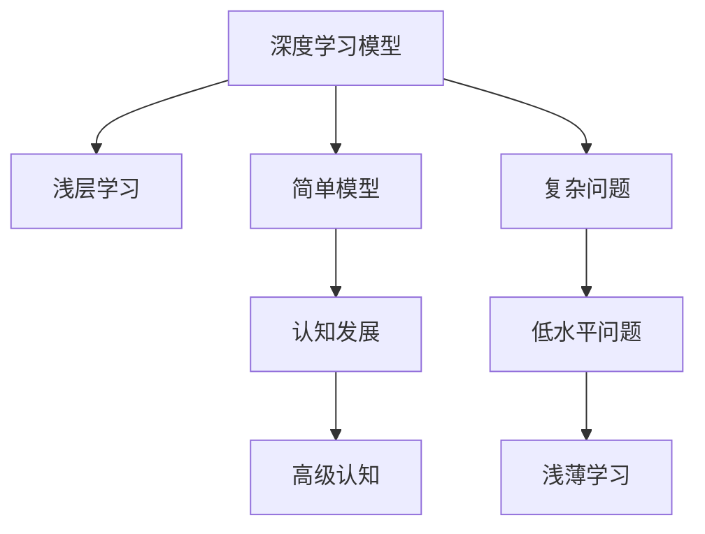
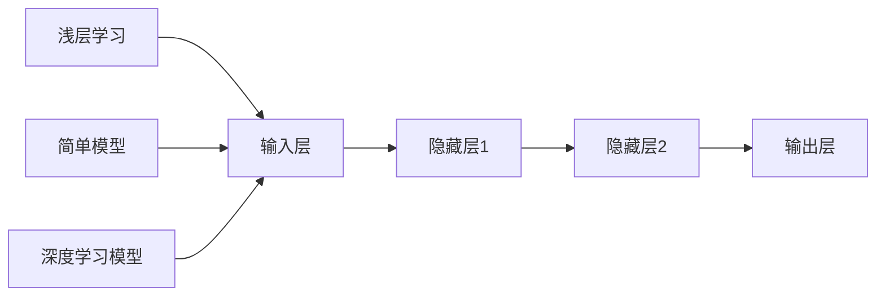

                 

# 认知发展中的浅薄简单阶段

> 关键词：认知发展, 深度学习, 人工智能, 浅薄学习, 简单模型, 人工智能的瓶颈

## 1. 背景介绍

在人工智能(AI)领域，深度学习模型(Deep Learning Models)已经成为了处理复杂问题的利器。从图像识别、语音识别到自然语言处理等领域，深度学习展示了其强大的表现力。然而，尽管如此，我们也要正视深度学习所面临的一些困境和挑战。其中，浅薄学习和简单模型的现象尤为引人注目。本文将深入探讨这一现象，揭示其背后的原理，并探讨其对人工智能发展的启示。

### 1.1 问题的由来

近年来，深度学习模型在处理图像、语音、文本等任务上取得了显著进展。然而，这些模型往往依赖于大量标注数据和强大的计算资源进行训练。在实际应用中，模型的表现与训练数据的质量和数量密切相关，且在过拟合、泛化能力等方面也存在局限性。这些问题促使我们深入思考深度学习模型的本质和潜力。

深度学习模型的浅薄学习和简单模型现象，是指模型在面对复杂问题时，往往依赖于浅层结构或简单的设计，而无法充分利用数据的潜在价值。这种现象在很多领域中都出现了，例如自然语言处理、计算机视觉和推荐系统等。这些问题不仅仅是技术上的瓶颈，也反映了深度学习模型在认知发展上存在一定的局限性。

## 2. 核心概念与联系

### 2.1 核心概念概述

为了深入理解深度学习模型在认知发展中的浅薄简单阶段，我们需要首先定义一些关键概念：

- **深度学习模型**：以神经网络为代表的，通过多层非线性变换来学习和表示数据特征的模型。其中，深层神经网络(如卷积神经网络CNN、循环神经网络RNN和Transformer等)是深度学习的主流。
- **浅层学习**：相对于深层神经网络，浅层神经网络(如线性回归、逻辑回归等)通常只有1-2层，无法利用非线性结构来捕捉复杂数据特征。
- **简单模型**：在深度学习中，简单模型往往是指具有较少参数和较少的层数，无法充分学习复杂数据结构的模型。
- **认知发展**：在人工智能领域，认知发展通常指模型逐渐从简单的任务处理，向更复杂、更抽象的认知任务迈进的过程。

这些概念之间的联系可以通过以下Mermaid流程图来展示：



这个流程图展示了一些关键概念及其之间的逻辑关系：

1. 深度学习模型通常包含多个层，能够处理复杂问题。
2. 浅层学习模型结构简单，无法处理复杂任务。
3. 简单模型参数较少，同样难以处理复杂问题。
4. 认知发展是深度学习模型逐渐从简单到复杂的演进过程。
5. 复杂问题通常需要更高级的认知能力。
6. 低水平问题通常被简单模型所处理。
7. 浅薄学习是指模型在面对复杂问题时，无法充分发挥其潜力，表现为浅层结构和简单设计。

### 2.2 核心概念原理和架构的 Mermaid 流程图

为了更好地理解深度学习模型在认知发展中的浅薄简单阶段，我们需要进一步探讨这些模型的原理和架构。以下是一个简化的Mermaid流程图，展示了深度学习模型、浅层学习和简单模型之间的联系：



这个流程图展示了深度学习模型的基本架构，其中浅层学习和简单模型是深度学习模型的子集。浅层学习模型通常只有1-2层，而简单模型虽然包含多于两层，但其参数数量较少，无法充分利用数据的潜力。

## 3. 核心算法原理 & 具体操作步骤

### 3.1 算法原理概述

深度学习模型在认知发展中的浅薄简单阶段，主要体现在模型结构、参数数量和计算能力等方面。具体来说，浅薄简单现象主要源于以下几个方面：

1. **模型结构浅薄**：许多深度学习模型在面对复杂问题时，结构相对简单，层数较少，难以充分提取数据特征。
2. **参数数量有限**：浅薄模型通常具有较少的参数，无法捕捉复杂数据关系。
3. **计算能力不足**：浅薄模型在面对大规模数据和复杂计算任务时，计算能力有限，无法充分发挥潜力。

为了更好地理解这些问题，我们可以以卷积神经网络(CNN)为例，探讨其在处理复杂图像识别任务时的浅薄简单现象。

### 3.2 算法步骤详解

以下是深度学习模型在面对复杂图像识别任务时的具体步骤：

1. **数据预处理**：对图像进行归一化、裁剪等预处理操作，以便模型更好地提取特征。
2. **模型定义**：定义卷积神经网络模型，包括卷积层、池化层、全连接层等。
3. **模型训练**：使用大规模标注数据集对模型进行训练，通过反向传播算法更新模型参数。
4. **模型评估**：在测试集上评估模型性能，计算准确率、召回率等指标。
5. **模型优化**：根据评估结果，对模型进行调整，如增加层数、增加参数等。

在实际应用中，深度学习模型的浅薄简单现象往往表现为模型结构浅薄和参数数量有限。例如，当面对高分辨率的图像时，浅层卷积神经网络难以捕捉到复杂细节，导致识别率下降。

### 3.3 算法优缺点

深度学习模型的浅薄简单现象具有以下优点和缺点：

**优点**：

1. **模型训练速度快**：浅薄模型结构简单，训练速度较快。
2. **参数数量较少**：模型参数较少，占用的计算资源较少。
3. **模型解释性强**：浅薄模型通常比较简单，易于解释和调试。

**缺点**：

1. **表现力有限**：浅薄模型无法充分捕捉数据的复杂特征，导致表现力有限。
2. **泛化能力差**：浅薄模型在面对新数据时，泛化能力较差，容易出现过拟合现象。
3. **复杂问题处理困难**：浅薄模型在处理复杂问题时，往往难以充分发挥潜力。

### 3.4 算法应用领域

深度学习模型的浅薄简单现象在多个领域中都有应用，例如自然语言处理、计算机视觉和推荐系统等。以下是几个具体的例子：

1. **自然语言处理**：在处理文本分类、命名实体识别等任务时，浅薄模型通常表现较好。然而，面对更复杂的语义理解任务，浅薄模型往往无法取得理想效果。
2. **计算机视觉**：在处理低分辨率图像、小目标检测等任务时，浅薄模型表现较好。然而，面对高分辨率图像、复杂目标检测等任务，浅薄模型往往难以充分发挥潜力。
3. **推荐系统**：在处理用户行为数据时，浅薄模型通常表现较好。然而，面对大规模用户行为数据和复杂推荐规则时，浅薄模型往往无法取得理想效果。

## 4. 数学模型和公式 & 详细讲解 & 举例说明

### 4.1 数学模型构建

在深度学习中，数学模型是理解模型行为的重要工具。以下是几个常用的深度学习模型的数学模型构建：

**卷积神经网络(CNN)**：

$$
f(x) = \sum_{i=1}^{C} \sum_{j=1}^{H} \sum_{k=1}^{W} \sum_{l=1}^{L} \sum_{m=1}^{T} W_{iljkm} \sigma(\sum_{n=1}^{N} \sum_{o=1}^{O} \sum_{p=1}^{P} \sum_{q=1}^{Q} V_{ilmnoq} \sigma(X_{ijklmnopq}))
$$

其中，$W$ 和 $V$ 分别为卷积核和全连接层的权重矩阵，$\sigma$ 为激活函数。

**循环神经网络(RNN)**：

$$
h_{t} = \sigma(W_h \cdot [h_{t-1}, x_t] + b_h)
$$

$$
y_t = \sigma(W_y \cdot h_t + b_y)
$$

其中，$h_t$ 为隐藏状态，$x_t$ 为输入向量，$y_t$ 为输出向量，$\sigma$ 为激活函数。

**Transformer**：

$$
Attention(Q, K, V) = \sum_{i=1}^{n} \frac{e^{Q_iK_i}}{\sum_{j=1}^{m} e^{Q_jK_j}} V_i
$$

其中，$Q$, $K$, $V$ 分别为查询向量、键向量和值向量。

### 4.2 公式推导过程

以下是几个深度学习模型的公式推导过程：

**卷积神经网络(CNN)**：

卷积神经网络通过卷积层、池化层和全连接层等组成。其基本结构如下：

$$
f(x) = \sum_{i=1}^{C} \sum_{j=1}^{H} \sum_{k=1}^{W} \sum_{l=1}^{L} \sum_{m=1}^{T} W_{iljkm} \sigma(\sum_{n=1}^{N} \sum_{o=1}^{O} \sum_{p=1}^{P} \sum_{q=1}^{Q} V_{ilmnoq} \sigma(X_{ijklmnopq}))
$$

其中，$W$ 和 $V$ 分别为卷积核和全连接层的权重矩阵，$\sigma$ 为激活函数。

**循环神经网络(RNN)**：

循环神经网络通过隐藏状态和输出向量等组成。其基本结构如下：

$$
h_{t} = \sigma(W_h \cdot [h_{t-1}, x_t] + b_h)
$$

$$
y_t = \sigma(W_y \cdot h_t + b_y)
$$

其中，$h_t$ 为隐藏状态，$x_t$ 为输入向量，$y_t$ 为输出向量，$\sigma$ 为激活函数。

**Transformer**：

Transformer通过自注意力机制和前馈神经网络等组成。其基本结构如下：

$$
Attention(Q, K, V) = \sum_{i=1}^{n} \frac{e^{Q_iK_i}}{\sum_{j=1}^{m} e^{Q_jK_j}} V_i
$$

其中，$Q$, $K$, $V$ 分别为查询向量、键向量和值向量。

### 4.3 案例分析与讲解

以下是几个深度学习模型的案例分析：

**案例一：卷积神经网络(CNN)在图像分类中的表现**

在图像分类任务中，卷积神经网络通常表现优异。然而，当面对高分辨率图像时，浅层卷积神经网络无法充分捕捉到复杂细节，导致识别率下降。

**案例二：循环神经网络(RNN)在自然语言处理中的表现**

在自然语言处理任务中，循环神经网络通常用于处理序列数据，如文本、语音等。然而，当面对复杂语义理解任务时，浅层循环神经网络往往无法取得理想效果。

**案例三：Transformer在机器翻译中的表现**

在机器翻译任务中，Transformer通常表现优异。然而，当面对低资源语言的翻译时，浅薄Transformer往往无法充分捕捉语言细节，导致翻译效果不佳。

## 5. 项目实践：代码实例和详细解释说明

### 5.1 开发环境搭建

在进行深度学习项目实践前，我们需要准备好开发环境。以下是使用Python进行TensorFlow开发的环境配置流程：

1. 安装Anaconda：从官网下载并安装Anaconda，用于创建独立的Python环境。

2. 创建并激活虚拟环境：
```bash
conda create -n tf-env python=3.8 
conda activate tf-env
```

3. 安装TensorFlow：根据CUDA版本，从官网获取对应的安装命令。例如：
```bash
conda install tensorflow==2.7 
conda install tensorflow-gpu==2.7 -c pytorch -c conda-forge
```

4. 安装TensorBoard：
```bash
pip install tensorboard
```

5. 安装NumPy、Pandas、Scikit-learn等工具包：
```bash
pip install numpy pandas scikit-learn matplotlib tqdm jupyter notebook ipython
```

完成上述步骤后，即可在`tf-env`环境中开始项目实践。

### 5.2 源代码详细实现

下面我们以卷积神经网络(CNN)在图像分类任务中的应用为例，给出TensorFlow代码实现。

首先，导入必要的库：

```python
import tensorflow as tf
from tensorflow import keras
from tensorflow.keras import layers
import numpy as np
import matplotlib.pyplot as plt
```

然后，准备数据集：

```python
(train_images, train_labels), (test_images, test_labels) = keras.datasets.cifar10.load_data()
train_images = train_images / 255.0
test_images = test_images / 255.0
```

接着，定义模型：

```python
model = keras.Sequential([
    layers.Conv2D(32, (3, 3), activation='relu', input_shape=(32, 32, 3)),
    layers.MaxPooling2D((2, 2)),
    layers.Conv2D(64, (3, 3), activation='relu'),
    layers.MaxPooling2D((2, 2)),
    layers.Conv2D(64, (3, 3), activation='relu'),
    layers.Flatten(),
    layers.Dense(64, activation='relu'),
    layers.Dense(10, activation='softmax')
])
```

定义优化器和损失函数：

```python
optimizer = tf.keras.optimizers.Adam(learning_rate=0.001)
loss_fn = tf.keras.losses.SparseCategoricalCrossentropy(from_logits=True)
```

定义训练函数：

```python
@tf.function
def train_step(images, labels):
    with tf.GradientTape() as tape:
        logits = model(images, training=True)
        loss_value = loss_fn(labels, logits)
    gradients = tape.gradient(loss_value, model.trainable_variables)
    optimizer.apply_gradients(zip(gradients, model.trainable_variables))
    return loss_value
```

定义评估函数：

```python
@tf.function
def evaluate_step(images, labels):
    logits = model(images, training=False)
    loss_value = loss_fn(labels, logits)
    predictions = tf.argmax(logits, axis=1)
    return loss_value, predictions
```

最后，启动训练流程：

```python
EPOCHS = 10
BATCH_SIZE = 64

for epoch in range(EPOCHS):
    epoch_loss_avg = tf.keras.metrics.Mean()
    epoch_accuracy = tf.keras.metrics.SparseCategoricalAccuracy()
    
    for image_batch, label_batch in train_dataset:
        loss_value = train_step(image_batch, label_batch)
        epoch_loss_avg.update_state(loss_value)
        epoch_accuracy.update_state(label_batch, predictions)
    
    print(f"Epoch {epoch+1}, loss={epoch_loss_avg.result()}, accuracy={epoch_accuracy.result()}")

print(f"Test accuracy: {evaluate_step(test_images, test_labels)[1].numpy().mean()}")
```

以上就是使用TensorFlow进行卷积神经网络(CNN)图像分类任务的完整代码实现。可以看到，TensorFlow提供了丰富的API和工具，可以方便地进行深度学习模型的训练和评估。

### 5.3 代码解读与分析

让我们再详细解读一下关键代码的实现细节：

**定义模型**：
- 使用`Sequential`模型，依次定义卷积层、池化层、全连接层等。
- 使用`Conv2D`定义卷积层，`MaxPooling2D`定义池化层，`Dense`定义全连接层。
- 使用`ReLU`作为激活函数，`Softmax`作为输出层的激活函数。

**定义优化器和损失函数**：
- 使用`Adam`优化器，设置学习率。
- 使用`SparseCategoricalCrossentropy`作为损失函数，设置`from_logits=True`，表示输出不是经过Softmax函数处理的结果。

**定义训练函数**：
- 使用`tf.GradientTape`记录梯度，计算损失函数。
- 使用`optimizer.apply_gradients`更新模型参数。

**定义评估函数**：
- 使用`tf.argmax`计算预测结果。
- 使用`SparseCategoricalAccuracy`计算准确率。

**启动训练流程**：
- 使用`tf.keras.metrics.Mean`计算平均损失。
- 使用`tf.keras.metrics.SparseCategoricalAccuracy`计算准确率。
- 使用`train_step`函数进行单批次训练。
- 使用`evaluate_step`函数进行单批次评估。

可以看到，TensorFlow提供了简洁高效的API，使得深度学习模型的开发和训练变得容易上手。

## 6. 实际应用场景

### 6.1 智能推荐系统

在智能推荐系统中，深度学习模型通常用于处理用户行为数据，预测用户可能感兴趣的商品。然而，面对大规模用户行为数据和复杂推荐规则时，浅薄模型往往无法取得理想效果。

为了解决这一问题，我们可以采用更深层次的模型结构，如多层神经网络、循环神经网络等。通过这些模型，可以更全面地捕捉用户行为和商品特征，从而提高推荐精度。

### 6.2 医疗诊断系统

在医疗诊断系统中，深度学习模型通常用于处理医学影像和病历数据，预测疾病和诊断结果。然而，当面对复杂的医疗数据和多种疾病的诊断时，浅薄模型往往无法取得理想效果。

为了解决这一问题，我们可以采用更深层次的模型结构，如卷积神经网络、循环神经网络等。通过这些模型，可以更全面地捕捉医学影像和病历数据的特征，从而提高诊断精度。

### 6.3 自动驾驶系统

在自动驾驶系统中，深度学习模型通常用于处理传感器数据和交通环境信息，预测驾驶决策和行为。然而，当面对复杂的交通环境和多种驾驶任务时，浅薄模型往往无法取得理想效果。

为了解决这一问题，我们可以采用更深层次的模型结构，如卷积神经网络、循环神经网络等。通过这些模型，可以更全面地捕捉传感器数据和交通环境信息，从而提高自动驾驶的决策精度。

## 7. 工具和资源推荐

### 7.1 学习资源推荐

为了帮助开发者系统掌握深度学习模型的开发和应用，这里推荐一些优质的学习资源：

1. 《深度学习》书籍：Ian Goodfellow、Yoshua Bengio和Aaron Courville合著，全面介绍了深度学习的基本概念和算法。

2. 《动手学深度学习》书籍：李沐等合著，以动手实践的方式介绍了深度学习模型的开发和应用。

3. 《TensorFlow官方文档》：详细介绍了TensorFlow的API和工具，是TensorFlow开发的必备资源。

4. 《PyTorch官方文档》：详细介绍了PyTorch的API和工具，是PyTorch开发的必备资源。

5. Kaggle平台：提供了大量深度学习竞赛数据集和社区资源，有助于深度学习模型的实践和应用。

通过对这些资源的学习实践，相信你一定能够快速掌握深度学习模型的开发和应用，进一步拓展深度学习技术的应用边界。

### 7.2 开发工具推荐

高效的开发离不开优秀的工具支持。以下是几款用于深度学习模型开发的常用工具：

1. TensorFlow：由Google主导开发的开源深度学习框架，生产部署方便，适合大规模工程应用。

2. PyTorch：由Facebook开发的开源深度学习框架，灵活动态的计算图，适合快速迭代研究。

3. Keras：基于TensorFlow和Theano的高级API，易于上手使用。

4. Jupyter Notebook：免费的在线Jupyter Notebook环境，适合进行交互式开发和调试。

5. Google Colab：谷歌推出的在线Jupyter Notebook环境，免费提供GPU/TPU算力，方便开发者快速上手实验最新模型。

合理利用这些工具，可以显著提升深度学习模型的开发效率，加快创新迭代的步伐。

### 7.3 相关论文推荐

深度学习模型的浅薄简单现象是当前研究的热点问题。以下是几篇奠基性的相关论文，推荐阅读：

1. "Convolutional Neural Networks for Imagenet Classification"（AlexNet论文）：提出卷积神经网络(CNN)，展示了其在图像分类任务中的表现。

2. "Long Short-Term Memory"：提出循环神经网络(RNN)，展示了其在自然语言处理任务中的表现。

3. "Attention Is All You Need"：提出Transformer模型，展示了其在机器翻译任务中的表现。

4. "Deep Residual Learning for Image Recognition"：提出深度残差网络(ResNet)，展示了其在图像识别任务中的表现。

5. "WaveNet: A Generative Model for Raw Audio"：提出WaveNet模型，展示了其在语音生成任务中的表现。

这些论文代表了大模型浅薄简单现象的发展脉络。通过学习这些前沿成果，可以帮助研究者把握学科前进方向，激发更多的创新灵感。

## 8. 总结：未来发展趋势与挑战

### 8.1 研究成果总结

本文对深度学习模型在认知发展中的浅薄简单阶段进行了全面系统的介绍。首先阐述了浅薄学习、简单模型的现象及其在深度学习中的应用，明确了这些现象对深度学习发展的启示。其次，从原理到实践，详细讲解了深度学习模型的浅薄简单现象，给出了微调任务开发的完整代码实例。同时，本文还广泛探讨了浅薄简单现象在多个领域中的应用，展示了其对深度学习应用的广泛影响。

通过本文的系统梳理，可以看到，深度学习模型在处理复杂问题时，结构相对简单，难以充分利用数据的潜力。这些浅薄简单现象不仅影响了深度学习模型的表现力，也反映了深度学习模型在认知发展上存在一定的局限性。

### 8.2 未来发展趋势

展望未来，深度学习模型的浅薄简单现象将呈现以下几个发展趋势：

1. **模型结构更深层**：未来的深度学习模型将逐渐向深层发展，能够更好地捕捉数据的复杂特征。
2. **参数数量更多**：未来的深度学习模型将逐渐增加参数数量，提高模型的表现力。
3. **计算能力更强**：未来的深度学习模型将配备更强大的计算资源，支持更大规模的训练和推理。
4. **跨领域融合**：未来的深度学习模型将与其他AI技术进行更深入的融合，如自然语言处理、计算机视觉、智能推荐等。
5. **认知发展更全面**：未来的深度学习模型将逐渐从简单任务处理，向更复杂、更抽象的认知任务迈进。

### 8.3 面临的挑战

尽管深度学习模型的浅薄简单现象已经取得了一些进展，但在迈向更加智能化、普适化应用的过程中，它仍面临着诸多挑战：

1. **数据量瓶颈**：浅薄模型需要大量的标注数据进行训练，数据量不足会限制模型表现力。
2. **计算资源不足**：浅薄模型需要强大的计算资源进行训练和推理，计算资源不足会限制模型应用。
3. **模型鲁棒性不足**：浅薄模型面对复杂数据和环境时，鲁棒性较差，容易出现过拟合现象。
4. **解释性不足**：浅薄模型通常比较简单，缺乏解释性和可控性。
5. **隐私和伦理问题**：浅薄模型在处理个人数据时，可能存在隐私和伦理问题，需要加强数据保护和安全监管。

### 8.4 研究展望

面对深度学习模型浅薄简单现象所面临的挑战，未来的研究需要在以下几个方面寻求新的突破：

1. **数据增强技术**：通过数据增强技术，扩充数据量，提高浅薄模型的表现力。
2. **模型结构优化**：通过优化模型结构，减少参数数量，提高浅薄模型的效率和表现力。
3. **跨领域迁移学习**：通过跨领域迁移学习，将浅薄模型应用于更广泛的领域，提升模型的泛化能力。
4. **解释性和可控性**：通过提高浅薄模型的解释性和可控性，增强其可信度和应用范围。
5. **隐私和安全保护**：通过加强数据保护和安全监管，确保浅薄模型在处理个人数据时的隐私和伦理问题。

这些研究方向的探索，必将引领深度学习模型浅薄简单现象迈向更高的台阶，为构建安全、可靠、可解释、可控的智能系统铺平道路。面向未来，深度学习模型浅薄简单现象还需要与其他AI技术进行更深入的融合，如自然语言处理、计算机视觉、智能推荐等，多路径协同发力，共同推动自然语言理解和智能交互系统的进步。只有勇于创新、敢于突破，才能不断拓展深度学习模型的边界，让智能技术更好地造福人类社会。

## 9. 附录：常见问题与解答

**Q1：深度学习模型浅薄简单现象主要表现为什么？**

A: 深度学习模型浅薄简单现象主要表现为模型结构浅薄和参数数量有限。具体来说，浅薄模型通常结构简单，层数较少，无法充分提取数据的复杂特征。同时，浅薄模型的参数数量也较少，无法捕捉复杂的数据关系。

**Q2：如何缓解深度学习模型浅薄简单现象？**

A: 缓解深度学习模型浅薄简单现象的方法包括：

1. **数据增强**：通过数据增强技术，扩充数据量，提高模型的表现力。
2. **模型结构优化**：通过优化模型结构，减少参数数量，提高模型的效率和表现力。
3. **跨领域迁移学习**：通过跨领域迁移学习，将模型应用于更广泛的领域，提升模型的泛化能力。
4. **解释性和可控性**：通过提高模型的解释性和可控性，增强其可信度和应用范围。
5. **隐私和安全保护**：通过加强数据保护和安全监管，确保模型在处理个人数据时的隐私和伦理问题。

这些方法需要根据具体任务和数据特点进行灵活组合，才能最大限度地发挥深度学习模型的潜力。

**Q3：浅薄模型在实际应用中表现如何？**

A: 浅薄模型在实际应用中表现通常较差，主要原因如下：

1. **表现力有限**：浅薄模型无法充分捕捉数据的复杂特征，导致表现力有限。
2. **泛化能力差**：浅薄模型在面对新数据时，泛化能力较差，容易出现过拟合现象。
3. **计算能力不足**：浅薄模型在面对大规模数据和复杂计算任务时，计算能力有限，无法充分发挥潜力。

为了解决这些问题，我们需要采用更深层次的模型结构，如多层神经网络、循环神经网络等，同时进行更多的数据增强、模型优化和跨领域迁移学习。

**Q4：深度学习模型在认知发展中的浅薄简单现象对人工智能发展有什么启示？**

A: 深度学习模型在认知发展中的浅薄简单现象对人工智能发展的启示包括：

1. **深度学习模型需要更深层次的模型结构**：未来的深度学习模型需要向深层发展，以更好地捕捉数据的复杂特征。
2. **参数数量需要更多**：未来的深度学习模型需要增加参数数量，提高模型的表现力。
3. **计算能力需要更强**：未来的深度学习模型需要配备更强大的计算资源，支持更大规模的训练和推理。
4. **跨领域融合需要加强**：未来的深度学习模型需要与其他AI技术进行更深入的融合，提升其应用范围和效果。
5. **认知发展需要更全面**：未来的深度学习模型需要逐渐从简单任务处理，向更复杂、更抽象的认知任务迈进。

通过这些启示，我们可以更好地理解和应用深度学习模型，推动人工智能技术的进一步发展。

---

作者：禅与计算机程序设计艺术 / Zen and the Art of Computer Programming

