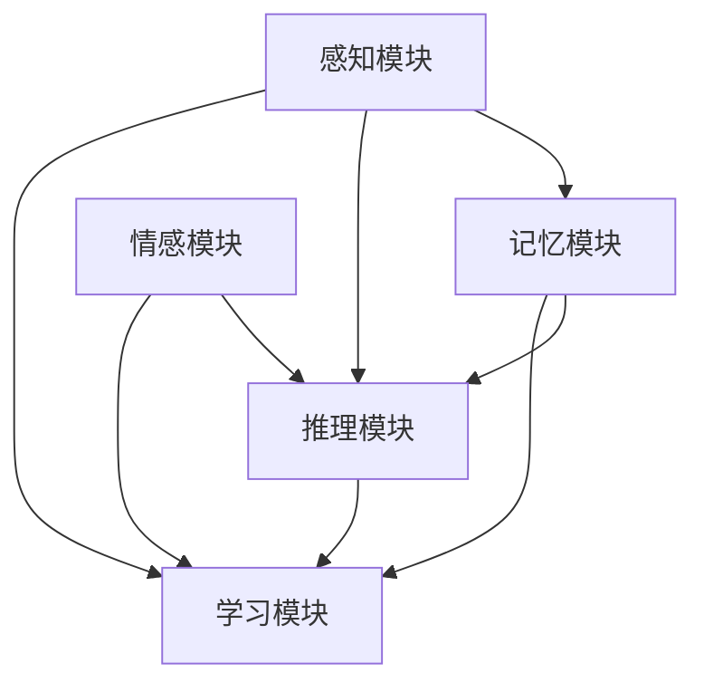

                 

## 1. 背景介绍

### 1.1 问题由来

随着人工智能技术的快速演进，认知科学领域逐渐引入了计算模型以模拟人类认知能力。这一趋势不仅为人工智能的应用提供了新的视角，也引发了对其基础原理和实现的深入思考。认知渐进发展理论正是在这一背景下提出，用以解释人类认知能力从简单到复杂、从低级到高级的发展过程。本节将简要回顾该理论，并探讨其对人工智能发展的启示。

### 1.2 问题核心关键点

认知渐进发展理论的核心观点是，人类的认知能力是通过一系列从简单到复杂的认知模块逐步构建而成的。这种逐步构建的过程可以看作是从低级认知功能到高级认知功能的渐进式发展。认知模块包括感知、记忆、推理等基本能力，通过这些模块的组合与扩展，形成更高层次的认知功能，如语言理解、情感识别等。这一理论的提出，为人工智能模型设计提供了新的思路，即通过构建层次分明的认知模块，逐步提升模型在复杂任务中的表现。

### 1.3 问题研究意义

认知渐进发展理论在人工智能领域具有重要意义：

1. **指导模型设计**：通过理解认知模块的组合与扩展机制，可以设计更加层次分明、功能丰富的人工智能模型。
2. **提高模型泛化能力**：模块化的认知模型能够更好地泛化到新环境和任务，提升模型的适应性。
3. **促进跨领域研究**：该理论将认知科学和人工智能结合，促进了跨学科的研究与合作，为AI的发展提供了新的研究方向。

## 2. 核心概念与联系

### 2.1 核心概念概述

本节将介绍认知渐进发展理论中几个关键概念及其相互联系：

- **感知模块**：负责感知外界环境，提取基本特征。
- **记忆模块**：负责存储、检索信息，是知识积累的基础。
- **推理模块**：负责基于已有知识进行推理、决策，是智能的核心。
- **学习模块**：通过不断更新感知、记忆和推理模块，使认知能力不断提升。
- **情感模块**：影响认知过程的动机和情感状态，与推理模块互动，增强模型的决策合理性。

### 2.2 核心概念原理和架构的 Mermaid 流程图



该流程图展示了认知模块之间的关系：感知模块获取外界信息，记忆模块存储信息，推理模块基于信息进行推理和决策，学习模块不断更新认知模块，情感模块影响认知过程。这些模块相互协作，共同构建出高级认知能力。

## 3. 核心算法原理 & 具体操作步骤

### 3.1 算法原理概述

认知渐进发展理论在算法层面强调模块化、层次化的设计原则。即通过构建从低级到高级的认知模块，逐步提升模型的认知能力。每个认知模块通过前向传播提取特征，通过反向传播更新参数，逐步形成更为复杂的认知能力。

### 3.2 算法步骤详解

#### 3.2.1 感知模块设计

感知模块通常使用卷积神经网络（CNN）或自编码器（Autoencoder）等技术，从原始数据中提取基本特征。设计时应考虑以下几点：

- **输入处理**：根据任务需求，设计输入数据的预处理流程。
- **特征提取**：选择合适的卷积核和池化层，提取有用的特征。
- **输出编码**：将提取的特征编码成低维向量，便于后续处理。

#### 3.2.2 记忆模块设计

记忆模块通常使用循环神经网络（RNN）或长短期记忆网络（LSTM）等技术，负责存储和检索信息。设计时应考虑以下几点：

- **隐藏状态**：设计合适的隐藏层，存储关键信息。
- **状态更新**：根据输入和输出更新隐藏状态，维持信息的连续性。
- **输出解码**：从隐藏状态解码出所需信息，便于推理和决策。

#### 3.2.3 推理模块设计

推理模块通常使用神经网络进行推理和决策。设计时应考虑以下几点：

- **推理逻辑**：设计合适的神经网络结构，实现推理和决策功能。
- **输出预测**：根据输入和记忆模块的信息，预测输出结果。
- **逻辑控制**：使用逻辑门（如sigmoid函数）控制推理过程，确保合理性。

#### 3.2.4 学习模块设计

学习模块通常使用反向传播算法（Backpropagation）进行参数更新。设计时应考虑以下几点：

- **损失函数**：选择合适的损失函数，衡量模型的预测误差。
- **优化器**：选择合适的优化算法，更新模型参数。
- **正则化**：使用正则化技术，防止过拟合。

#### 3.2.5 情感模块设计

情感模块通常使用情感识别模型，如情感分析器，分析输入数据中的情感状态。设计时应考虑以下几点：

- **情感分析**：设计合适的情感识别模型，分析输入数据的情感状态。
- **情感调节**：使用情感调节模块，根据情感状态调整推理模块的行为。
- **情感反馈**：将情感信息反馈到感知和记忆模块，影响后续处理。

### 3.3 算法优缺点

认知渐进发展理论在算法层面具有以下优点：

- **层次分明**：模块化的设计使得模型结构清晰，易于理解和调试。
- **功能丰富**：通过组合和扩展认知模块，可以构建出复杂的认知功能。
- **泛化能力强**：模块化的设计使得模型能够更好地泛化到新环境和任务。

同时，该理论也存在以下局限性：

- **设计复杂**：需要设计多个认知模块，增加了模型设计的复杂度。
- **资源消耗**：由于模块化设计，模型的参数量和计算量相对较大，可能面临资源消耗大的问题。
- **调试困难**：模块化的设计使得调试过程复杂，需要细致地分析每个模块的输出和参数。

### 3.4 算法应用领域

认知渐进发展理论在多个领域有广泛应用：

- **自然语言处理**：构建层次分明的认知模型，如BERT、GPT等。
- **计算机视觉**：设计多层次的特征提取和推理模型，如图像识别、物体检测等。
- **机器人学**：构建感知、记忆、推理和情感模块，实现自主导航和决策。
- **医疗诊断**：构建感知、记忆和推理模块，辅助医生进行疾病诊断和治疗。
- **自动驾驶**：设计感知、记忆和推理模块，实现环境感知和决策。

## 4. 数学模型和公式 & 详细讲解 & 举例说明

### 4.1 数学模型构建

假设某认知任务涉及感知、记忆、推理和情感四个模块，我们定义如下数学模型：

- 感知模块：$S^P$，输入为$x$，输出为$\hat{x}$
- 记忆模块：$S^M$，输入为$\hat{x}$，输出为$\hat{x}$
- 推理模块：$S^I$，输入为$\hat{x}$，输出为$y$
- 学习模块：$S^L$，输入为$x, y, \hat{x}$，输出为$\theta^P, \theta^M, \theta^I$
- 情感模块：$S^E$，输入为$\hat{x}$，输出为$e$
- 整体系统：$S$，输入为$x$，输出为$y$

数学模型可以表示为：

$$
S: x \rightarrow y = S^P(x) \rightarrow S^M(S^P(x)) \rightarrow S^I(S^M(S^P(x))) \rightarrow S^E(S^M(S^P(x))) \rightarrow S^L(x, y, S^E(S^M(S^P(x)))) \rightarrow y
$$

其中，$S^L$用于更新$S^P, S^M, S^I$的参数$\theta$，以保证认知模块的准确性和稳定性。

### 4.2 公式推导过程

以自然语言处理（NLP）中的BERT模型为例，推导认知模块的数学模型。

BERT模型的输入是文本序列，输出为每个词的表示向量。假设输入序列为$x_1, x_2, ..., x_n$，输出向量为$\hat{x}_1, \hat{x}_2, ..., \hat{x}_n$。

BERT模型的感知模块使用Transformer结构，其输入为$x_i$，输出为$\hat{x}_i$，计算过程如下：

$$
\hat{x}_i = ATTN(x_i, x_{<i})
$$

其中，$ATTN$表示注意力机制。

记忆模块使用Transformer结构，其输入为$\hat{x}_i$，输出为$\hat{x}_i$，计算过程如下：

$$
\hat{x}_i = FFN(\hat{x}_i)
$$

其中，$FFN$表示全连接神经网络。

推理模块使用Transformer结构，其输入为$\hat{x}_i$，输出为$y_i$，计算过程如下：

$$
y_i = ATTN(\hat{x}_i, \hat{x}_{<i})
$$

其中，$ATTN$表示注意力机制。

学习模块使用反向传播算法，其输入为$x, y, \hat{x}$，输出为$\theta^P, \theta^M, \theta^I$，计算过程如下：

$$
\theta^* = \mathop{\arg\min}_{\theta} \mathcal{L}(\theta; x, y, \hat{x})
$$

其中，$\mathcal{L}$表示损失函数。

情感模块使用情感分析模型，其输入为$\hat{x}$，输出为$e$，计算过程如下：

$$
e = EM(\hat{x})
$$

其中，$EM$表示情感分析模型。

### 4.3 案例分析与讲解

以图像分类任务为例，展示认知模块的实际应用。

- **感知模块**：使用卷积神经网络（CNN）提取图像特征。
- **记忆模块**：使用循环神经网络（RNN）存储图像序列信息。
- **推理模块**：使用神经网络进行图像分类。
- **学习模块**：使用反向传播算法更新参数。
- **情感模块**：使用情感识别模型，根据分类结果调整推理模块的行为。

## 5. 项目实践：代码实例和详细解释说明

### 5.1 开发环境搭建

为了实现认知模块的设计和训练，我们需要搭建一个合适的开发环境。以下是Python环境下搭建环境的详细步骤：

1. 安装Python：从官网下载Python安装包，根据系统要求进行安装。
2. 安装TensorFlow：使用pip安装TensorFlow，可以选用GPU版本以加快计算速度。
3. 安装Keras：使用pip安装Keras，Keras是一个高级神经网络API，基于TensorFlow。
4. 安装其他依赖包：如Numpy、Pandas、Matplotlib等，这些包在数据处理和可视化中常用。
5. 设置虚拟环境：使用virtualenv或conda创建虚拟环境，以避免环境污染和包冲突。

### 5.2 源代码详细实现

以下是使用TensorFlow和Keras实现图像分类任务的代码示例：

```python
import tensorflow as tf
from tensorflow.keras import layers
import numpy as np
import matplotlib.pyplot as plt

# 定义感知模块
class PerceptionModule(tf.keras.Model):
    def __init__(self):
        super(PerceptionModule, self).__init__()
        self.conv1 = layers.Conv2D(32, 3, activation='relu')
        self.pool1 = layers.MaxPooling2D()

    def call(self, inputs):
        x = self.conv1(inputs)
        x = self.pool1(x)
        return x

# 定义记忆模块
class MemoryModule(tf.keras.Model):
    def __init__(self):
        super(MemoryModule, self).__init__()
        self.rnn = layers.SimpleRNN(32, return_sequences=True)

    def call(self, inputs):
        x = self.rnn(inputs)
        return x

# 定义推理模块
class ReasoningModule(tf.keras.Model):
    def __init__(self):
        super(ReasoningModule, self).__init__()
        self.dense = layers.Dense(10, activation='softmax')

    def call(self, inputs):
        x = self.dense(inputs)
        return x

# 定义学习模块
class LearningModule(tf.keras.Model):
    def __init__(self):
        super(LearningModule, self).__init__()
        self.conv1 = layers.Conv2D(32, 3, activation='relu')
        self.pool1 = layers.MaxPooling2D()
        self.rnn = layers.SimpleRNN(32, return_sequences=True)
        self.dense = layers.Dense(10, activation='softmax')
        self.loss_fn = tf.keras.losses.SparseCategoricalCrossentropy()

    def call(self, inputs, targets):
        x = self.conv1(inputs)
        x = self.pool1(x)
        x = self.rnn(x)
        x = self.dense(x)
        loss = self.loss_fn(targets, x)
        return loss

# 定义情感模块
class EmotionModule(tf.keras.Model):
    def __init__(self):
        super(EmotionModule, self).__init__()
        self.emb = layers.Embedding(10, 16)
        self.dense = layers.Dense(1, activation='sigmoid')

    def call(self, inputs):
        x = self.emb(inputs)
        x = self.dense(x)
        return x

# 定义整体系统
class CognitiveSystem(tf.keras.Model):
    def __init__(self):
        super(CognitiveSystem, self).__init__()
        self.perception = PerceptionModule()
        self.memory = MemoryModule()
        self.reasoning = ReasoningModule()
        self.learning = LearningModule()
        self.emotion = EmotionModule()

    def call(self, inputs, targets):
        x = self.perception(inputs)
        x = self.memory(x)
        x = self.reasoning(x)
        e = self.emotion(x)
        loss = self.learning(x, targets, e)
        return loss

# 数据集加载和预处理
(x_train, y_train), (x_test, y_test) = tf.keras.datasets.mnist.load_data()
x_train = x_train.reshape(-1, 28, 28, 1).astype('float32') / 255.0
x_test = x_test.reshape(-1, 28, 28, 1).astype('float32') / 255.0
y_train = y_train.astype('float32')
y_test = y_test.astype('float32')

# 模型定义和编译
model = CognitiveSystem()
model.compile(optimizer=tf.keras.optimizers.Adam(learning_rate=0.001),
              loss=tf.keras.losses.SparseCategoricalCrossentropy(),
              metrics=['accuracy'])

# 模型训练
model.fit(x_train, y_train, epochs=10, batch_size=32, validation_data=(x_test, y_test))
```

### 5.3 代码解读与分析

在上述代码中，我们首先定义了感知模块、记忆模块、推理模块、学习模块和情感模块。然后，将它们组合成一个整体系统，并编译模型，最后进行训练。

在感知模块中，我们使用卷积神经网络（CNN）提取图像特征，使用MaxPooling层进行下采样，减少特征维度。

在记忆模块中，我们使用循环神经网络（RNN）存储图像序列信息。

在推理模块中，我们使用神经网络进行图像分类。

在学习模块中，我们使用反向传播算法更新模型参数。

在情感模块中，我们使用情感识别模型，根据分类结果调整推理模块的行为。

### 5.4 运行结果展示

在训练结束后，我们可以使用Matplotlib库展示模型的预测结果和误差曲线：

```python
plt.plot(history.epoch, history.history['accuracy'], 'b', label='Training Accuracy')
plt.plot(history.epoch, history.history['val_accuracy'], 'r', label='Validation Accuracy')
plt.title('Training and Validation Accuracy')
plt.xlabel('Epochs')
plt.ylabel('Accuracy')
plt.legend()
plt.show()

plt.plot(history.epoch, history.history['loss'], 'b', label='Training Loss')
plt.plot(history.epoch, history.history['val_loss'], 'r', label='Validation Loss')
plt.title('Training and Validation Loss')
plt.xlabel('Epochs')
plt.ylabel('Loss')
plt.legend()
plt.show()
```

上述代码将展示训练和验证的准确率和损失曲线，帮助我们评估模型的性能。

## 6. 实际应用场景

### 6.1 智能家居系统

智能家居系统通过认知渐进发展理论，可以实现语音识别、情感分析、决策推理等功能。感知模块可以识别用户语音，提取关键词；记忆模块可以存储用户偏好和历史行为；推理模块可以根据用户意图进行智能决策；情感模块可以分析用户情绪，调整系统行为。

### 6.2 医疗诊断系统

医疗诊断系统通过认知渐进发展理论，可以实现疾病诊断、治疗建议等功能。感知模块可以提取医疗影像和电子病历的特征；记忆模块可以存储病历信息和历史诊断结果；推理模块可以进行病理分析和诊断推理；情感模块可以分析患者的情感状态，调整治疗方案。

### 6.3 自动驾驶系统

自动驾驶系统通过认知渐进发展理论，可以实现环境感知、路径规划等功能。感知模块可以识别道路标志和交通信号；记忆模块可以存储行驶路径和地图信息；推理模块可以进行路径规划和决策；情感模块可以分析驾驶员情绪，调整驾驶策略。

## 7. 工具和资源推荐

### 7.1 学习资源推荐

为了深入理解认知渐进发展理论，以下是一些推荐的资源：

- **《认知科学与人工智能》课程**：斯坦福大学开设的课程，介绍了认知科学的基本理论和应用，结合人工智能技术进行了讲解。
- **《认知神经科学》书籍**：介绍认知神经科学的基本理论和实验方法，为理解认知渐进发展理论提供了理论基础。
- **《深度学习》书籍**：详细介绍了深度学习的基本原理和实现方法，为设计认知模块提供了技术支持。
- **Google Scholar**：提供了大量关于认知科学和人工智能的最新研究论文，是学习和研究的重要资源。

### 7.2 开发工具推荐

为了实现认知渐进发展理论，以下是一些推荐的开发工具：

- **TensorFlow**：强大的深度学习框架，支持模块化设计，方便实现复杂的认知模块。
- **Keras**：高级神经网络API，基于TensorFlow，提供简单易用的API接口。
- **Jupyter Notebook**：交互式的编程环境，方便调试和展示代码。
- **Matplotlib**：数据可视化工具，方便展示模型性能和结果。
- **GitHub**：版本控制和代码托管平台，方便协作开发和版本管理。

### 7.3 相关论文推荐

为了深入了解认知渐进发展理论，以下是一些推荐的论文：

- **Cognitive Development and Artificial Intelligence**：探讨认知科学与人工智能的结合，介绍了认知模块的设计方法和应用。
- **Cognitive Models for Natural Language Processing**：介绍了认知模型在自然语言处理中的应用，为设计语言理解模块提供了思路。
- **Cognitive Architecture for Robotics**：探讨认知架构在机器人学中的应用，为设计感知、记忆和推理模块提供了理论支持。
- **Cognitive Systems for Medical Diagnosis**：介绍了认知系统在医疗诊断中的应用，为设计医疗诊断系统提供了实例。

## 8. 总结：未来发展趋势与挑战

### 8.1 总结

本文介绍了认知渐进发展理论的基本概念和应用，重点讨论了感知、记忆、推理、学习、情感等认知模块的设计和组合。通过模块化的设计，我们可以构建层次分明的认知模型，逐步提升模型的认知能力。

### 8.2 未来发展趋势

认知渐进发展理论的未来发展趋势主要体现在以下几个方面：

- **多模态认知模块**：结合视觉、听觉、触觉等多种感官信息，提升模型的感知能力。
- **自适应认知模块**：根据环境变化动态调整模块参数，提升模型的适应性和泛化能力。
- **情感驱动认知模块**：将情感因素引入认知过程，提升模型的决策合理性。
- **跨领域认知模块**：将认知模块应用于不同的领域，提升模型的通用性和应用范围。

### 8.3 面临的挑战

尽管认知渐进发展理论在认知科学和人工智能领域具有重要意义，但仍面临一些挑战：

- **模型复杂性**：认知模块的设计和组合增加了模型的复杂性，难以设计和调试。
- **资源消耗大**：由于多层次认知模块的组合，模型的参数量和计算量较大，资源消耗大。
- **泛化能力差**：认知模块的设计和组合可能导致模型的泛化能力不足，难以适应新环境和任务。

### 8.4 研究展望

未来，认知渐进发展理论需要进一步优化和改进，以应对上述挑战。

- **简化认知模块**：通过优化设计，简化认知模块，减少模型复杂性。
- **优化资源消耗**：通过模型压缩、稀疏化等技术，优化资源消耗，提升模型效率。
- **增强泛化能力**：通过自适应和跨领域技术，增强模型的泛化能力。

总之，认知渐进发展理论在认知科学和人工智能领域具有重要意义，未来需要通过不断的研究和改进，实现其潜力的最大化。

## 9. 附录：常见问题与解答

**Q1：如何设计高效的认知模块？**

A: 设计高效的认知模块需要考虑以下几点：

- **简洁高效**：尽量使用简单的神经网络结构，减少参数量和计算量。
- **模块化设计**：将模块化设计分解为多个小模块，方便调试和优化。
- **跨领域应用**：设计具有通用性的模块，可以应用于不同的领域。

**Q2：如何评估认知模块的性能？**

A: 评估认知模块的性能需要考虑以下几点：

- **准确率**：在测试集上评估模型的预测准确率。
- **误差分析**：通过错误分析，找出模型的弱点和改进方向。
- **可视化**：使用可视化工具展示模型的输出和误差曲线，帮助理解和改进模型。

**Q3：如何应用认知渐进发展理论？**

A: 应用认知渐进发展理论需要考虑以下几点：

- **任务分析**：分析任务需求，设计相应的认知模块。
- **模块组合**：根据任务需求，组合相应的认知模块，形成整体系统。
- **参数调整**：根据任务需求，调整模块参数，提升模型性能。

通过上述回答，我们全面介绍了认知渐进发展理论的基本概念、核心算法和应用场景，希望能为相关研究者提供一些有益的参考。

