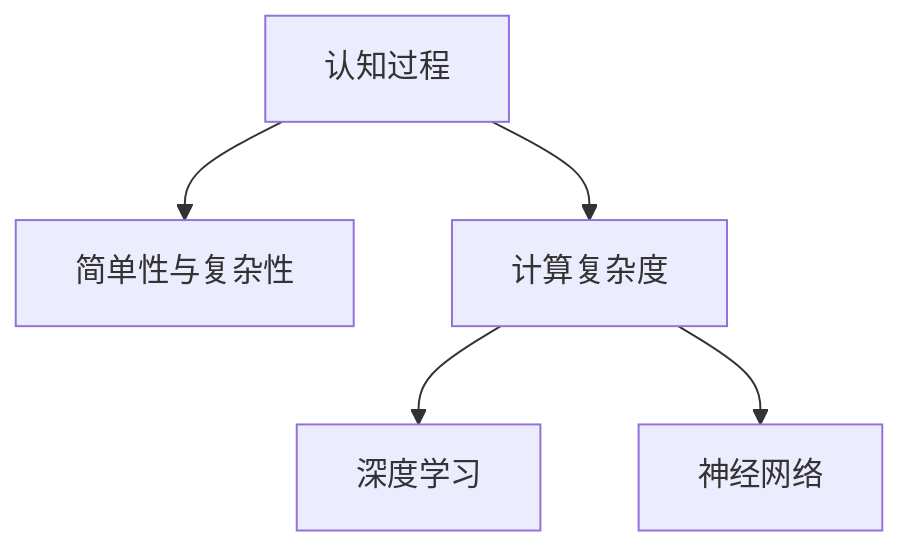

                 

# 认知过程中的简单与复杂性变化

> 关键词：认知过程, 简单与复杂性, 人工智能, 计算复杂度, 深度学习, 神经网络

## 1. 背景介绍

认知过程是指人类如何获取、处理和应用信息以进行推理、判断、决策等活动的过程。这一过程在历史上一直是一个备受关注的话题，尤其是随着人工智能和深度学习技术的发展，理解这一过程变得更加重要。在人工智能研究中，模拟认知过程已经成为一项关键任务。

### 1.1 问题由来

随着计算能力的提升，人们开始探索如何通过计算模型来模拟人类认知过程。这个过程涉及对复杂性、简单性和计算资源的关系进行研究，以更好地设计和优化计算模型。人工智能和深度学习的发展为这一探索提供了新的工具和方法，但也带来了新的挑战和问题。

### 1.2 问题核心关键点

认知过程的模拟需要在简单性和复杂性之间找到平衡。简单性有利于减少计算资源的消耗和提高模型的可解释性，而复杂性则能够更好地捕捉现实世界中的复杂性和多样性。如何在保持模型有效性的同时，合理地利用计算资源，是一个重要的研究课题。

## 2. 核心概念与联系

### 2.1 核心概念概述

- **认知过程**：指人类如何获取、处理和应用信息以进行推理、判断、决策等活动的过程。
- **简单性与复杂性**：指模型和过程的抽象程度，简单性通常意味着更高的计算效率和可解释性，复杂性则能更好地反映现实世界的复杂性。
- **计算复杂度**：指解决问题的计算需求，包括时间和空间资源的消耗。
- **深度学习**：一种通过多层神经网络进行复杂模式识别的机器学习技术。
- **神经网络**：一种模拟人类神经系统结构的人工智能模型，通常用于深度学习中。

这些概念之间的联系可以通过以下Mermaid流程图来展示：



这个流程图展示了认知过程、简单性与复杂性、计算复杂度、深度学习和神经网络之间的关系：

1. 认知过程通过简单的或复杂的模型进行模拟。
2. 计算复杂度决定了模型所能处理的信息复杂性。
3. 深度学习和神经网络提供了实现这些模型的工具。

## 3. 核心算法原理 & 具体操作步骤

### 3.1 算法原理概述

在认知过程中，简单性与复杂性之间的关系可以通过计算复杂度的概念来理解和描述。计算复杂度是衡量问题求解难度的重要指标，它与问题的规模和求解算法有关。在深度学习和神经网络中，通过调整模型的复杂性，可以在计算资源和问题求解的准确性之间找到平衡。

### 3.2 算法步骤详解

#### 步骤1：选择模型复杂度

根据任务需求和计算资源，选择适当的模型复杂度。例如，对于简单任务，可以使用线性模型；而对于复杂任务，则需要使用多层神经网络。

#### 步骤2：训练模型

使用训练数据对模型进行训练。这一步包括正向传播和反向传播，以更新模型参数。在训练过程中，需要注意过拟合和欠拟合问题。

#### 步骤3：评估模型

使用测试数据对模型进行评估，检查其性能是否满足需求。常用的评估指标包括准确率、召回率、F1分数等。

#### 步骤4：优化模型

根据评估结果，对模型进行调整和优化。优化方法包括参数调整、正则化、数据增强等。

### 3.3 算法优缺点

深度学习模型具有以下优点：

- **学习能力**：能够从大量数据中学习复杂模式，适用于多种类型的问题。
- **适应性强**：可以通过调整模型结构和参数来适应不同的任务。

但其缺点也很明显：

- **计算需求高**：需要大量计算资源，特别是在模型复杂度高的情况下。
- **可解释性差**：模型决策过程复杂，难以解释。
- **过拟合风险高**：当训练数据不足或模型复杂度过高时，容易出现过拟合现象。

### 3.4 算法应用领域

深度学习模型在多个领域得到了广泛应用，包括但不限于：

- **计算机视觉**：如图像分类、目标检测、图像分割等。
- **自然语言处理**：如文本分类、情感分析、机器翻译等。
- **语音识别**：如自动语音识别、语音合成等。
- **医疗健康**：如疾病诊断、基因分析等。

## 4. 数学模型和公式 & 详细讲解 & 举例说明

### 4.1 数学模型构建

在深度学习中，常用的模型包括全连接神经网络、卷积神经网络（CNN）、循环神经网络（RNN）和变分自编码器（VAE）等。这里以一个简单的全连接神经网络为例，展示其数学模型的构建过程。

### 4.2 公式推导过程

#### 定义变量

- $x$：输入向量，维度为 $d$。
- $w$：权重矩阵，维度为 $d \times h$，其中 $h$ 为隐层神经元个数。
- $b$：偏置向量，维度为 $h$。
- $y$：输出向量，维度为 $k$，其中 $k$ 为输出类别数。

#### 前向传播

输入 $x$ 经过线性变换后得到隐层特征 $h$，计算公式为：

$$
h = \sigma(xw + b)
$$

其中 $\sigma$ 为激活函数，如 ReLU 或 sigmoid 等。

#### 损失函数

常用的损失函数包括交叉熵损失、均方误差损失等。以交叉熵损失为例，其计算公式为：

$$
L = -\frac{1}{N} \sum_{i=1}^N \sum_{j=1}^k y_{ij} \log \hat{y}_{ij}
$$

其中 $y_{ij}$ 为真实标签，$\hat{y}_{ij}$ 为模型预测的概率。

#### 反向传播

通过反向传播算法，计算每个参数的梯度，并根据梯度更新参数。反向传播的计算公式如下：

$$
\frac{\partial L}{\partial w} = \frac{1}{N} \sum_{i=1}^N (h - y) x^T
$$

$$
\frac{\partial L}{\partial b} = \frac{1}{N} \sum_{i=1}^N (h - y)
$$

### 4.3 案例分析与讲解

以手写数字识别为例，展示一个简单的深度学习模型在实际中的应用。手写数字识别是计算机视觉中的一个典型任务，通常使用 MNIST 数据集进行训练和测试。

#### 数据准备

- 加载 MNIST 数据集。
- 对数据进行预处理，如归一化、标准化等。

#### 模型构建

- 定义输入层和输出层，隐层神经元个数为 100。
- 定义激活函数为 ReLU。
- 定义损失函数为交叉熵损失。

#### 训练模型

- 使用随机梯度下降算法（SGD）进行模型训练。
- 设置学习率为 $0.01$，训练轮数为 $10000$。

#### 评估模型

- 使用测试集对模型进行评估。
- 计算模型在测试集上的准确率。

## 5. 项目实践：代码实例和详细解释说明

### 5.1 开发环境搭建

#### 环境准备

- 安装 Python 3.7 及以上版本。
- 安装 NumPy、SciPy、Matplotlib、TensorFlow 等库。

#### 环境配置

```bash
pip install numpy scipy matplotlib tensorflow
```

### 5.2 源代码详细实现

#### 数据加载

```python
import numpy as np
import matplotlib.pyplot as plt
import tensorflow as tf

# 加载 MNIST 数据集
mnist = tf.keras.datasets.mnist
(x_train, y_train), (x_test, y_test) = mnist.load_data()
```

#### 模型构建

```python
class SimpleNet(tf.keras.Model):
    def __init__(self, num_classes):
        super(SimpleNet, self).__init__()
        self.flatten = tf.keras.layers.Flatten()
        self.dense1 = tf.keras.layers.Dense(128, activation='relu')
        self.dense2 = tf.keras.layers.Dense(num_classes, activation='softmax')

    def call(self, inputs):
        x = self.flatten(inputs)
        x = self.dense1(x)
        return self.dense2(x)
```

#### 训练模型

```python
# 定义模型
model = SimpleNet(num_classes=10)

# 定义损失函数
loss_fn = tf.keras.losses.SparseCategoricalCrossentropy(from_logits=True)

# 定义优化器
optimizer = tf.keras.optimizers.Adam()

# 定义评估指标
accuracy = tf.keras.metrics.SparseCategoricalAccuracy('accuracy')

# 训练模型
@tf.function
def train_step(images, labels):
    with tf.GradientTape() as tape:
        logits = model(images, training=True)
        loss = loss_fn(labels, logits)
    grads = tape.gradient(loss, model.trainable_variables)
    optimizer.apply_gradients(zip(grads, model.trainable_variables))
    accuracy.update_state(labels, logits)
    return loss

@tf.function
def train_epoch(images, labels):
    loss_total = 0
    accuracy_total = 0
    for image, label in tf.data.Dataset.from_tensor_slices((images, labels)).batch(32):
        loss = train_step(image, label)
        loss_total += loss
        accuracy_total += accuracy.result()
        accuracy.reset_states()
    return loss_total / len(images), accuracy_total / len(images)

# 训练模型
epochs = 10000
batch_size = 32
for epoch in range(epochs):
    train_loss, train_accuracy = train_epoch(x_train, y_train)
    print(f"Epoch {epoch+1}, train loss: {train_loss:.3f}, train accuracy: {train_accuracy:.3f}")

# 评估模型
test_loss, test_accuracy = train_epoch(x_test, y_test)
print(f"Test loss: {test_loss:.3f}, test accuracy: {test_accuracy:.3f}")
```

### 5.3 代码解读与分析

#### 数据预处理

```python
x_train, x_test = x_train / 255.0, x_test / 255.0
```

对图像数据进行归一化处理，确保模型能够更好地处理数据。

#### 模型构建

```python
class SimpleNet(tf.keras.Model):
    def __init__(self, num_classes):
        super(SimpleNet, self).__init__()
        self.flatten = tf.keras.layers.Flatten()
        self.dense1 = tf.keras.layers.Dense(128, activation='relu')
        self.dense2 = tf.keras.layers.Dense(num_classes, activation='softmax')
```

定义了一个简单的全连接神经网络，包含一个输入层、一个隐层和一个输出层。

#### 训练模型

```python
@tf.function
def train_step(images, labels):
    with tf.GradientTape() as tape:
        logits = model(images, training=True)
        loss = loss_fn(labels, logits)
    grads = tape.gradient(loss, model.trainable_variables)
    optimizer.apply_gradients(zip(grads, model.trainable_variables))
    accuracy.update_state(labels, logits)
    return loss

@tf.function
def train_epoch(images, labels):
    loss_total = 0
    accuracy_total = 0
    for image, label in tf.data.Dataset.from_tensor_slices((images, labels)).batch(32):
        loss = train_step(image, label)
        loss_total += loss
        accuracy_total += accuracy.result()
        accuracy.reset_states()
    return loss_total / len(images), accuracy_total / len(images)

# 训练模型
epochs = 10000
batch_size = 32
for epoch in range(epochs):
    train_loss, train_accuracy = train_epoch(x_train, y_train)
    print(f"Epoch {epoch+1}, train loss: {train_loss:.3f}, train accuracy: {train_accuracy:.3f}")

# 评估模型
test_loss, test_accuracy = train_epoch(x_test, y_test)
print(f"Test loss: {test_loss:.3f}, test accuracy: {test_accuracy:.3f}")
```

使用 TensorFlow 实现了一个简单的深度学习模型，包含训练、评估和优化过程。

## 6. 实际应用场景

### 6.1 智能客服系统

智能客服系统通过深度学习模型来处理用户提问，并提供合适的答案。该系统通常使用问答对进行训练，能够理解自然语言输入，并生成回答。

### 6.2 金融舆情监测

金融舆情监测系统通过深度学习模型来分析金融市场的新闻和社交媒体数据，预测市场走势。该系统能够实时监测舆情，及时发现异常情况，帮助金融机构规避风险。

### 6.3 个性化推荐系统

个性化推荐系统通过深度学习模型来分析用户的浏览、点击、购买等行为数据，为用户推荐合适的商品或服务。该系统能够根据用户的历史行为，生成个性化推荐列表。

### 6.4 未来应用展望

随着深度学习技术的不断发展，未来深度学习模型将在更多领域得到应用，如医疗健康、教育、交通等。这些领域的认知过程复杂多样，深度学习模型将发挥重要作用。

## 7. 工具和资源推荐

### 7.1 学习资源推荐

#### 在线课程

- Coursera 的《深度学习专项课程》：由 Andrew Ng 教授主讲，涵盖深度学习的基本概念和应用。
- Udacity 的《深度学习纳米学位》：涵盖深度学习模型的设计和应用，适合进阶学习。

#### 书籍

- 《深度学习》（Ian Goodfellow 著）：深入讲解深度学习的基本原理和应用。
- 《动手学深度学习》（李沐 著）：使用 Python 和 PyTorch 实现深度学习模型的实践指南。

### 7.2 开发工具推荐

#### 框架

- TensorFlow：Google 开发的深度学习框架，支持 CPU、GPU 和 TPU 等多种计算平台。
- PyTorch：Facebook 开发的深度学习框架，以其动态计算图和易用性著称。

#### 可视化工具

- TensorBoard：TensorFlow 的可视化工具，可以实时监测模型训练状态和性能。
- VisualDL：百度开发的深度学习可视化工具，支持 TensorFlow、Keras 等多种框架。

### 7.3 相关论文推荐

#### 经典论文

- 《深度学习》（Goodfellow et al., 2016）：深度学习领域的经典教材，详细讲解深度学习的理论基础和应用。
- 《大规模神经网络训练的优化方法》（Sutskever et al., 2013）：介绍了大规模神经网络训练的方法，包括数据增强、正则化等技术。

## 8. 总结：未来发展趋势与挑战

### 8.1 总结

本文对认知过程中简单性与复杂性变化的研究进行了系统阐述。首先介绍了认知过程的基本概念和背景，明确了简单性与复杂性之间的关系。其次，通过深度学习模型，详细讲解了简单性与复杂性在计算复杂度中的体现和应用。最后，介绍了深度学习模型在实际应用中的典型场景，展示了其在人工智能领域的重要性。

### 8.2 未来发展趋势

未来深度学习模型将在更多领域得到应用，推动人工智能技术的普及和发展。

#### 技术进步

- **算法优化**：深度学习算法将继续优化，提升模型的效率和性能。
- **模型压缩**：通过模型压缩技术，减小模型规模，提高计算效率。
- **跨领域应用**：深度学习模型将进一步扩展到更多领域，如医疗、教育、交通等。

#### 应用创新

- **智能系统**：深度学习模型将与自然语言处理、计算机视觉等技术结合，构建智能系统，提升用户体验。
- **个性化服务**：通过深度学习模型，为用户提供更加个性化的服务，如智能推荐、智能客服等。

### 8.3 面临的挑战

尽管深度学习技术取得了显著进展，但在实际应用中仍面临诸多挑战。

#### 技术挑战

- **模型复杂度**：深度学习模型的复杂度难以控制，容易过拟合。
- **计算资源需求**：深度学习模型需要大量计算资源，资源瓶颈成为制约因素。
- **数据质量和多样性**：深度学习模型依赖大量高质量的数据，数据质量和多样性对模型性能有很大影响。

#### 应用挑战

- **模型可解释性**：深度学习模型通常难以解释，影响其在实际应用中的可信度。
- **伦理和社会问题**：深度学习模型可能带来伦理和社会问题，如隐私泄露、歧视等。
- **跨领域应用难度**：不同领域的数据和问题具有不同特点，跨领域应用难度较大。

### 8.4 研究展望

未来深度学习模型需要在技术、应用和社会多个方面进行深入研究，解决现有的挑战，拓展其应用范围。

#### 技术研究

- **模型压缩**：研究更有效的模型压缩方法，减小模型规模，提高计算效率。
- **可解释性**：研究模型可解释性方法，提高模型的可信度。
- **跨领域应用**：研究跨领域应用的方法，推动深度学习模型在更多领域的应用。

#### 应用研究

- **智能系统**：研究智能系统的构建方法，提升用户体验。
- **个性化服务**：研究个性化服务的实现方法，提升服务质量。
- **社会影响**：研究深度学习模型对社会的影响，确保其健康发展。

总之，深度学习模型在认知过程中简单性与复杂性变化的研究具有重要的理论和实践意义，需要在技术、应用和社会等多个方面进行深入研究，推动深度学习技术的持续发展和应用。

## 9. 附录：常见问题与解答

### Q1: 深度学习模型是否适用于所有认知过程？

A: 深度学习模型在处理复杂认知过程时效果显著，但对于一些简单的认知过程，可能存在冗余和过拟合的问题。需要根据具体任务选择合适的模型复杂度。

### Q2: 如何选择模型复杂度？

A: 选择模型复杂度时，需要考虑任务的需求和计算资源的限制。对于简单任务，可以使用线性模型或决策树；对于复杂任务，需要使用深度学习模型。

### Q3: 如何避免过拟合？

A: 避免过拟合的方法包括数据增强、正则化、dropout 等技术。可以通过调整模型结构和训练参数，优化模型的泛化能力。

### Q4: 如何提高深度学习模型的可解释性？

A: 提高深度学习模型的可解释性可以通过模型压缩、特征可视化等方法，增加模型的透明度和可信度。

### Q5: 深度学习模型如何应用于金融领域？

A: 深度学习模型可以应用于金融领域，如股票预测、信用评估等。通过分析历史数据，模型能够学习市场规律，提供决策支持。

---

作者：禅与计算机程序设计艺术 / Zen and the Art of Computer Programming

