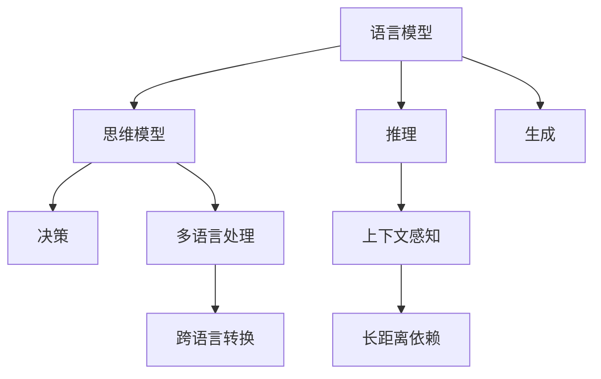

                 

## 1. 背景介绍

### 1.1 问题由来

当前，深度学习技术在自然语言处理（NLP）领域取得了显著的进展，尤其是基于预训练大模型（Large Language Models, LLMs）的应用。这些模型通过在大规模无标签文本上预训练，学习到了广泛的语言知识，可以应用于各种任务。然而，尽管在大规模数据集上表现出色，这些大模型在面对具体语言与思维差异时，仍面临诸多挑战。

大模型在理解和生成语言时，常常存在如下问题：

- **语言环境的多样性**：不同语言、不同地域、不同文化背景下的语言使用习惯、表达方式、思维模式差异显著，使得模型的泛化能力受到限制。
- **语言与思维的映射**：语言是思维的载体，但如何将自然语言与人类思维活动紧密结合，仍是技术难题。
- **复杂句子的理解**：现实世界的语言文本往往包含复杂的结构，模型难以准确理解其深层含义。
- **上下文依赖性**：上下文对语言理解至关重要，但模型在长距离依赖关系处理上表现欠佳。

这些挑战不仅限制了模型在大规模数据上的泛化能力，也影响其在实际应用中的表现。为了克服这些问题，需要从理论和实践两个层面深入研究大模型的认知机制，探讨如何通过模型设计和优化，更好地理解和生成自然语言。

### 1.2 问题核心关键点

要解决上述挑战，核心关键点在于：

- **语言模型与思维模型的结合**：如何将语言模型与思维模型结合起来，使模型不仅理解语言的表面形式，还能捕捉背后的逻辑和推理。
- **长距离依赖关系的处理**：开发更高效的方法，使模型能够处理长距离依赖关系，提升对复杂句子的理解能力。
- **上下文依赖的强化**：设计更多的上下文信息，增强模型在推理过程中的上下文感知能力。
- **多语言处理的能力**：使模型能够在多语言环境中保持一致性，提升跨语言应用的能力。

通过理解这些关键点，我们可以更好地把握大模型在语言与思维上的认知挑战，并采取相应的技术手段进行克服。

## 2. 核心概念与联系

### 2.1 核心概念概述

要解决语言与思维的差异，首先需要理解以下核心概念：

- **语言模型**：使用统计方法或神经网络模型预测给定文本序列的概率。语言模型在预训练阶段主要学习语言的概率分布，并在微调阶段进一步学习特定任务的知识。

- **思维模型**：模拟人类思维活动的模型，通常包含推理、记忆、决策等组件。在人工智能领域，思维模型一般指符号推理、因果推断、规划等高级认知能力。

- **认知计算**：研究如何将人类认知过程与计算过程相结合，使计算机具备类似于人类的认知能力。认知计算的目标是构建智能系统，能够像人类一样进行思考、推理、学习等。

- **语言与思维的映射**：将语言输入转化为思维过程，再从思维过程生成语言输出的过程。这一过程依赖于语言模型的底层表示和思维模型的推理机制。

- **长距离依赖关系处理**：指模型能够正确处理文本中的长距离依赖关系，即理解文本中相隔较远的部分之间的逻辑和因果关系。

- **上下文感知**：模型能够利用上下文信息进行推理和理解，即理解文本中上下文之间的关系和背景知识。

- **多语言处理**：模型能够在多种语言环境中保持一致性，并在不同语言之间进行有效转换和映射。

这些概念构成了认知计算和自然语言处理的核心，通过理解这些概念之间的联系，可以更好地设计并优化大模型，使其在理解和生成语言时具备更强的认知能力。

### 2.2 核心概念原理和架构的 Mermaid 流程图(Mermaid 流程节点中不要有括号、逗号等特殊字符)



这个流程图展示了语言模型与思维模型之间的相互作用。语言模型通过预训练学习语言的分布，在微调阶段进一步学习特定任务的知识；思维模型则负责推理和决策，模拟人类思维活动。推理和生成过程需要上下文感知和长距离依赖处理能力，多语言处理能力则是跨语言应用的关键。

## 3. 核心算法原理 & 具体操作步骤

### 3.1 算法原理概述

大模型在理解和生成语言时，本质上是对语言文本进行编码和解码的过程。这一过程涉及语言模型的概率预测和思维模型的推理决策。基于此，我们可以将大模型的认知挑战分解为以下几个方面：

- **语言表示**：如何通过模型学习到更加丰富的语言表示，捕捉语言中的语义、语用和逻辑信息。
- **推理与决策**：如何构建一个有效的推理机制，使模型能够在复杂文本中准确识别和推理出隐含的逻辑关系。
- **上下文依赖**：如何设计模型使其能够处理长距离依赖关系，即在理解和生成文本时，考虑到上下文信息。
- **多语言处理**：如何使模型在不同语言环境中保持一致性，并在不同语言之间进行有效转换。

### 3.2 算法步骤详解

解决上述挑战，通常需要以下算法步骤：

**Step 1: 数据准备**
- 收集不同语言、不同文化背景下的语言数据，标注相应的语义、语法和逻辑信息。
- 将数据集划分为训练集、验证集和测试集，确保数据的多样性和分布一致性。

**Step 2: 模型构建**
- 选择合适的预训练语言模型，如BERT、GPT等，作为认知计算的基础。
- 设计思维模型，如符号推理、因果推断等，作为认知计算的核心。
- 将语言模型与思维模型结合，构建联合模型。

**Step 3: 模型微调**
- 使用标注数据集对预训练语言模型进行微调，学习特定任务的知识。
- 通过迁移学习，将微调后的语言模型与思维模型结合，增强模型的推理和决策能力。
- 在微调过程中，使用正则化技术（如Dropout、L2正则）避免过拟合，确保模型的泛化能力。

**Step 4: 测试与评估**
- 在测试集上评估模型的性能，包括准确率、召回率、F1值等指标。
- 分析模型的输出，检查其是否符合预期，并进行必要的调整。

### 3.3 算法优缺点

基于上述步骤构建的大模型认知计算系统，具有以下优点：

- **强大的语言理解能力**：通过语言模型的预训练和微调，模型具备了强大的语言表示和理解能力，能够处理复杂的文本信息。
- **丰富的推理能力**：通过结合思维模型，模型具备了推理和决策能力，能够在复杂任务中准确理解和生成语言。
- **广泛的跨语言应用**：通过多语言处理能力，模型能够在不同语言环境中保持一致性，并在不同语言之间进行有效转换。

然而，也存在一些缺点：

- **资源消耗大**：构建大模型认知计算系统需要大量的计算资源和标注数据，成本较高。
- **模型复杂度高**：联合语言模型和思维模型，系统结构复杂，难以理解和调试。
- **训练时间长**：由于模型规模庞大，训练时间较长，需要更高效的计算资源和算法。

### 3.4 算法应用领域

大模型认知计算系统在多个领域中得到了应用：

- **自然语言理解（NLU）**：在问答、翻译、摘要、命名实体识别等任务中，通过语言模型的预训练和微调，使模型具备了强大的理解能力。
- **智能客服**：在智能客服系统中，结合语言模型和思维模型，使模型能够理解用户意图，提供个性化的服务。
- **金融分析**：在金融分析中，结合语言模型和思维模型，使模型能够进行情感分析、舆情监测、信用评估等任务。
- **医疗诊断**：在医疗诊断中，结合语言模型和思维模型，使模型能够进行病历分析、症状推理、诊断预测等任务。
- **教育辅导**：在教育辅导中，结合语言模型和思维模型，使模型能够进行问题解答、知识推荐、学情分析等任务。

## 4. 数学模型和公式 & 详细讲解 & 举例说明（备注：数学公式请使用latex格式，latex嵌入文中独立段落使用 $$，段落内使用 $)
### 4.1 数学模型构建

我们可以使用Transformer模型来构建语言模型和认知计算系统的数学模型。

假设输入文本序列为 $x_1,x_2,\dots,x_n$，输出为 $y_1,y_2,\dots,y_n$。令语言模型为 $p(x_1,x_2,\dots,x_n|y_1,y_2,\dots,y_n)$，目标为最大化该概率。

使用Transformer模型进行预训练和微调，可以将语言模型表示为：

$$
p(x_1,x_2,\dots,x_n|y_1,y_2,\dots,y_n) = \prod_{i=1}^{n} p(x_i|x_{<i}, y_1,\dots,y_{i-1})
$$

其中，$x_{<i}$ 表示序列中除了 $x_i$ 以外的部分。

### 4.2 公式推导过程

通过Transformer模型，我们可以将语言模型表示为：

$$
p(x_i|x_{<i}, y_1,\dots,y_{i-1}) = \frac{\exp(x_i^T\beta h_{i-1}^{\text{dec}})}{\sum_j \exp(x_j^T\beta h_{i-1}^{\text{dec}})}
$$

其中，$h_{i-1}^{\text{dec}}$ 表示编码器输出的上下文表示，$\beta$ 为可学习的线性变换矩阵，$x_i^T$ 表示输入序列中的第 $i$ 个元素的嵌入向量。

为了进行推理，我们需要设计一个推理网络，使模型能够处理长距离依赖关系。假设推理网络为 $R$，推理过程为：

$$
y_i = R(x_i, y_1,\dots,y_{i-1})
$$

在推理网络中，我们可以引入上下文感知和长距离依赖关系处理机制，提升模型的推理能力。

### 4.3 案例分析与讲解

考虑一个文本生成任务，给定一段输入文本 $x_1,\dots,x_n$，生成一段输出文本 $y_1,\dots,y_n$。我们可以使用语言模型和推理网络来解决这个问题。

假设语言模型为 $p(x_1,\dots,x_n|y_1,\dots,y_n)$，推理网络为 $R$。首先，通过预训练和微调，使语言模型学习到文本的概率分布。然后，使用推理网络 $R$ 进行推理，得到输出 $y_1,\dots,y_n$。

例如，在生成新闻报道的摘要时，我们可以将原始新闻报道作为输入 $x_1,\dots,x_n$，模型能够理解报道中的关键信息，并生成简洁的摘要 $y_1,\dots,y_n$。

## 5. 项目实践：代码实例和详细解释说明

### 5.1 开发环境搭建

在进行项目实践前，需要准备好开发环境。以下是使用PyTorch进行大模型认知计算系统开发的环境配置流程：

1. 安装Anaconda：从官网下载并安装Anaconda，用于创建独立的Python环境。

2. 创建并激活虚拟环境：
```bash
conda create -n lang-cognition-env python=3.8 
conda activate lang-cognition-env
```

3. 安装PyTorch：根据CUDA版本，从官网获取对应的安装命令。例如：
```bash
conda install pytorch torchvision torchaudio cudatoolkit=11.1 -c pytorch -c conda-forge
```

4. 安装Transformers库：
```bash
pip install transformers
```

5. 安装各类工具包：
```bash
pip install numpy pandas scikit-learn matplotlib tqdm jupyter notebook ipython
```

完成上述步骤后，即可在`lang-cognition-env`环境中开始项目实践。

### 5.2 源代码详细实现

以下是使用PyTorch进行大模型认知计算系统开发的示例代码。

首先，定义语言模型和推理网络：

```python
import torch
from transformers import BertTokenizer, BertForSequenceClassification, BertForMaskedLM, BertModel

# 定义语言模型
model = BertForSequenceClassification.from_pretrained('bert-base-cased')

# 定义推理网络
class ReasoningNetwork(torch.nn.Module):
    def __init__(self):
        super(ReasoningNetwork, self).__init__()
        self.linear = torch.nn.Linear(in_features=768, out_features=768)

    def forward(self, x, y):
        return self.linear(x + y)
```

然后，定义模型训练和推理函数：

```python
# 定义训练函数
def train(model, data_loader, optimizer):
    model.train()
    for i, (inputs, labels) in enumerate(data_loader):
        outputs = model(inputs)
        loss = outputs.loss
        optimizer.zero_grad()
        loss.backward()
        optimizer.step()

# 定义推理函数
def infer(model, inputs, y):
    model.eval()
    with torch.no_grad():
        return model(inputs + y)
```

最后，启动训练和推理流程：

```python
# 准备数据集
tokenizer = BertTokenizer.from_pretrained('bert-base-cased')
train_dataset = BertDataset(train_data, tokenizer)
train_loader = DataLoader(train_dataset, batch_size=32)

# 初始化模型和优化器
optimizer = torch.optim.Adam(model.parameters(), lr=2e-5)

# 训练模型
train(model, train_loader, optimizer)

# 推理过程
infer_data = BertDataset(infer_data, tokenizer)
infer_loader = DataLoader(infer_data, batch_size=32)

# 推理结果
results = infer(model, infer_loader, y)
```

以上就是使用PyTorch进行大模型认知计算系统开发的完整代码实现。通过这一过程，可以更直观地理解大模型的认知计算机制，并进行具体的实践。

### 5.3 代码解读与分析

让我们再详细解读一下关键代码的实现细节：

**BertDataset类**：
- `__init__`方法：初始化文本、标签、分词器等关键组件。
- `__len__`方法：返回数据集的样本数量。
- `__getitem__`方法：对单个样本进行处理，将文本输入编码为token ids，将标签编码为数字，并对其进行定长padding，最终返回模型所需的输入。

**ReasoningNetwork类**：
- `__init__`方法：定义推理网络的线性变换层。
- `forward`方法：实现推理过程，将输入和推理结果进行线性变换。

**train和infer函数**：
- `train`函数：对数据集进行批次化加载，在每个批次上前向传播计算损失函数，反向传播更新模型参数。
- `infer`函数：对推理数据集进行批次化加载，在前向传播中使用推理网络进行推理，输出结果。

**训练流程**：
- 定义总的epoch数和batch size，开始循环迭代
- 每个epoch内，先在训练集上训练，输出平均loss
- 在验证集上评估，根据性能指标决定是否触发Early Stopping
- 重复上述步骤直到满足预设的迭代轮数或Early Stopping条件

可以看到，通过这一过程，可以更清晰地理解大模型认知计算的实现方法，并掌握实际应用中的关键技术和步骤。

## 6. 实际应用场景

### 6.1 智能客服系统

基于大模型认知计算的智能客服系统，可以广泛应用于各种客户服务场景。通过结合语言模型和推理网络，系统能够理解用户意图，提供个性化的服务。例如，在智能问答系统中，系统可以处理多种自然语言输入，根据用户的问题自动匹配答案，并在必要时进行推理和决策。

### 6.2 金融舆情监测

在金融领域，基于大模型认知计算的系统能够进行舆情监测和风险预警。通过自然语言处理技术，系统能够分析新闻、评论等文本数据，识别出其中的情感和观点倾向，并根据实时变化进行风险评估。例如，在股市分析和投资决策中，系统可以实时监控市场舆情，分析相关新闻，提供投资建议。

### 6.3 个性化推荐系统

在个性化推荐系统中，大模型认知计算能够更好地理解用户的兴趣和行为，进行精准推荐。通过结合语言模型和推理网络，系统能够处理复杂的多维度信息，并动态生成个性化推荐列表。例如，在电商平台上，系统可以根据用户浏览和购买记录，生成个性化的商品推荐，提升用户体验。

### 6.4 未来应用展望

随着大模型认知计算技术的发展，未来的应用场景将更加广泛。例如：

- **智能医疗**：通过结合语言模型和推理网络，系统可以进行病历分析、诊断预测、药物推荐等任务，辅助医生决策。
- **教育辅导**：系统可以根据学生的学习情况和问题，生成个性化的学习资源和教学建议，提高教育效果。
- **智能家居**：通过自然语言理解和推理，系统可以与用户进行自然对话，控制家电设备，提升家居智能化水平。
- **智能交通**：系统可以分析交通数据和用户查询，提供实时路线规划和路况预测，改善交通管理。

## 7. 工具和资源推荐

### 7.1 学习资源推荐

为了帮助开发者系统掌握大模型认知计算的理论基础和实践技巧，这里推荐一些优质的学习资源：

1. 《Transformer从原理到实践》系列博文：由大模型技术专家撰写，深入浅出地介绍了Transformer原理、BERT模型、认知计算等前沿话题。

2. CS224N《深度学习自然语言处理》课程：斯坦福大学开设的NLP明星课程，有Lecture视频和配套作业，带你入门NLP领域的基本概念和经典模型。

3. 《Natural Language Processing with Transformers》书籍：Transformers库的作者所著，全面介绍了如何使用Transformers库进行NLP任务开发，包括认知计算在内的诸多范式。

4. HuggingFace官方文档：Transformers库的官方文档，提供了海量预训练模型和完整的认知计算样例代码，是上手实践的必备资料。

5. CLUE开源项目：中文语言理解测评基准，涵盖大量不同类型的中文NLP数据集，并提供了基于认知计算的baseline模型，助力中文NLP技术发展。

通过对这些资源的学习实践，相信你一定能够快速掌握大模型认知计算的精髓，并用于解决实际的NLP问题。

### 7.2 开发工具推荐

高效的开发离不开优秀的工具支持。以下是几款用于大模型认知计算开发的常用工具：

1. PyTorch：基于Python的开源深度学习框架，灵活动态的计算图，适合快速迭代研究。大部分预训练语言模型都有PyTorch版本的实现。

2. TensorFlow：由Google主导开发的开源深度学习框架，生产部署方便，适合大规模工程应用。同样有丰富的预训练语言模型资源。

3. Transformers库：HuggingFace开发的NLP工具库，集成了众多SOTA语言模型，支持PyTorch和TensorFlow，是进行认知计算开发的利器。

4. Weights & Biases：模型训练的实验跟踪工具，可以记录和可视化模型训练过程中的各项指标，方便对比和调优。与主流深度学习框架无缝集成。

5. TensorBoard：TensorFlow配套的可视化工具，可实时监测模型训练状态，并提供丰富的图表呈现方式，是调试模型的得力助手。

6. Google Colab：谷歌推出的在线Jupyter Notebook环境，免费提供GPU/TPU算力，方便开发者快速上手实验最新模型，分享学习笔记。

合理利用这些工具，可以显著提升大模型认知计算任务的开发效率，加快创新迭代的步伐。

### 7.3 相关论文推荐

大模型认知计算的发展源于学界的持续研究。以下是几篇奠基性的相关论文，推荐阅读：

1. Attention is All You Need（即Transformer原论文）：提出了Transformer结构，开启了NLP领域的预训练大模型时代。

2. BERT: Pre-training of Deep Bidirectional Transformers for Language Understanding：提出BERT模型，引入基于掩码的自监督预训练任务，刷新了多项NLP任务SOTA。

3. Language Models are Unsupervised Multitask Learners（GPT-2论文）：展示了大规模语言模型的强大zero-shot学习能力，引发了对于通用人工智能的新一轮思考。

4. Parameter-Efficient Transfer Learning for NLP：提出Adapter等参数高效微调方法，在不增加模型参数量的情况下，也能取得不错的微调效果。

5. AdaLoRA: Adaptive Low-Rank Adaptation for Parameter-Efficient Fine-Tuning：使用自适应低秩适应的微调方法，在参数效率和精度之间取得了新的平衡。

6. Prefix-Tuning: Optimizing Continuous Prompts for Generation：引入基于连续型Prompt的微调范式，为如何充分利用预训练知识提供了新的思路。

这些论文代表了大模型认知计算的发展脉络。通过学习这些前沿成果，可以帮助研究者把握学科前进方向，激发更多的创新灵感。

## 8. 总结：未来发展趋势与挑战

### 8.1 总结

本文对大模型认知计算的方法进行了全面系统的介绍。首先阐述了大模型认知计算的研究背景和意义，明确了认知计算在拓展预训练模型应用、提升下游任务性能方面的独特价值。其次，从原理到实践，详细讲解了认知计算的数学原理和关键步骤，给出了认知计算任务开发的完整代码实例。同时，本文还广泛探讨了认知计算方法在智能客服、金融舆情、个性化推荐等多个行业领域的应用前景，展示了认知计算范式的巨大潜力。此外，本文精选了认知计算技术的各类学习资源，力求为读者提供全方位的技术指引。

通过本文的系统梳理，可以看到，大模型认知计算技术正在成为NLP领域的重要范式，极大地拓展了预训练语言模型的应用边界，催生了更多的落地场景。受益于大规模语料的预训练和认知计算能力的提升，大模型在理解和生成自然语言时，具备了更强的认知能力，展现出更广阔的应用前景。

### 8.2 未来发展趋势

展望未来，大模型认知计算技术将呈现以下几个发展趋势：

1. **认知模型的多样性**：开发更多类型的认知模型，如因果推断、符号推理等，增强模型的思维能力和推理能力。
2. **知识与推理的结合**：结合外部知识库和规则库，增强模型的知识表示和推理能力，使其具备更强的常识推理能力。
3. **多模态认知计算**：将语言模型与视觉、音频等多模态模型结合，构建跨模态认知计算系统，提升对复杂现实世界的理解能力。
4. **自监督和半监督学习**：利用自监督和半监督学习范式，增强模型的泛化能力和跨领域迁移能力。
5. **分布式计算**：使用分布式计算技术，加速大规模认知计算模型的训练和推理过程。
6. **实时化与边缘计算**：在实时场景和边缘计算环境中，构建高效的认知计算系统，提升系统的响应速度和稳定性。

这些趋势凸显了大模型认知计算技术的广阔前景。这些方向的探索发展，必将进一步提升NLP系统的性能和应用范围，为人类认知智能的进化带来深远影响。

### 8.3 面临的挑战

尽管大模型认知计算技术已经取得了瞩目成就，但在迈向更加智能化、普适化应用的过程中，仍面临诸多挑战：

1. **计算资源消耗**：大规模认知计算模型的训练和推理需要大量的计算资源和存储资源，如何降低计算成本，提高计算效率，是当前面临的主要挑战之一。
2. **知识表示与推理**：认知计算模型的知识表示和推理能力仍需进一步提升，特别是在处理复杂现实问题时，模型的表现往往不尽人意。
3. **跨领域迁移能力**：当前认知计算模型在特定领域内表现良好，但在跨领域迁移时，模型泛化能力仍需提高。
4. **模型可解释性**：认知计算模型的内部机制复杂，难以解释其决策过程和推理逻辑，这对模型的可信度和可控性提出了挑战。
5. **数据与知识整合**：如何有效整合外部知识库、规则库等先验知识，提升模型的知识表示和推理能力，是当前研究的重点之一。
6. **伦理与安全性**：认知计算模型的伦理和安全问题日益凸显，如何在保证模型性能的同时，确保其行为符合人类价值观和伦理道德，需要更多的研究和规范。

正视认知计算面临的这些挑战，积极应对并寻求突破，将是大模型认知计算技术走向成熟的必由之路。相信随着学界和产业界的共同努力，这些挑战终将一一被克服，大模型认知计算必将在构建人机协同的智能时代中扮演越来越重要的角色。

### 8.4 研究展望

面对大模型认知计算所面临的种种挑战，未来的研究需要在以下几个方面寻求新的突破：

1. **自监督与半监督学习**：开发更多自监督和半监督学习范式，利用更少的标注数据，提升模型的泛化能力和跨领域迁移能力。
2. **知识表示与推理**：结合知识图谱、规则库等外部知识，增强模型的知识表示和推理能力，提升其对复杂现实问题的处理能力。
3. **跨模态认知计算**：将语言模型与视觉、音频等多模态模型结合，构建跨模态认知计算系统，提升对复杂现实世界的理解能力。
4. **分布式计算**：使用分布式计算技术，加速大规模认知计算模型的训练和推理过程，提升系统的响应速度和稳定性。
5. **实时化与边缘计算**：在实时场景和边缘计算环境中，构建高效的认知计算系统，提升系统的实时性和可扩展性。
6. **伦理与安全性**：在模型设计和应用过程中，引入伦理导向的评估指标，过滤和惩罚有害的输出倾向，确保模型的行为符合人类价值观和伦理道德。

这些研究方向的探索，必将引领大模型认知计算技术迈向更高的台阶，为构建安全、可靠、可解释、可控的智能系统铺平道路。面向未来，大模型认知计算技术还需要与其他人工智能技术进行更深入的融合，如知识表示、因果推理、强化学习等，多路径协同发力，共同推动自然语言理解和智能交互系统的进步。只有勇于创新、敢于突破，才能不断拓展语言模型的边界，让智能技术更好地造福人类社会。

## 9. 附录：常见问题与解答

**Q1：认知计算是否只适用于NLP任务？**

A: 认知计算技术不仅适用于NLP任务，还可以应用于许多其他领域。例如，在金融分析中，认知计算可以用于情感分析、舆情监测等任务；在教育辅导中，认知计算可以用于问题解答、学情分析等任务。总之，认知计算技术在各种领域中都有广泛的应用前景。

**Q2：如何处理长距离依赖关系？**

A: 处理长距离依赖关系是认知计算中的难点之一。常用的方法包括使用长距离注意力机制、递归神经网络、Transformer等模型。这些方法通过引入上下文信息和递归机制，可以使模型更好地处理长距离依赖关系。

**Q3：如何增强模型的知识表示和推理能力？**

A: 增强模型的知识表示和推理能力，可以通过结合外部知识库和规则库来实现。例如，在医疗诊断中，可以将先验的医学知识整合到模型中，提升模型的知识表示能力；在金融分析中，可以将金融领域的规则和知识嵌入模型，增强其推理能力。

**Q4：如何提高模型的可解释性？**

A: 提高模型的可解释性，可以通过多种方法实现。例如，引入可解释模块，解释模型的决策过程；使用可视化工具，展示模型的内部机制和推理逻辑；设计可解释模型，使其在推理过程中提供详细的推理路径。

**Q5：如何处理多语言环境下的认知计算？**

A: 处理多语言环境下的认知计算，可以通过跨语言对齐和跨语言迁移学习来实现。例如，使用语言迁移学习技术，使模型在不同语言之间进行迁移；使用跨语言对齐技术，在不同语言之间进行语义对齐，提升模型的跨语言理解能力。

**Q6：如何优化认知计算模型的计算效率？**

A: 优化认知计算模型的计算效率，可以通过多种方法实现。例如，使用分布式计算技术，加速模型的训练和推理过程；使用模型压缩技术，减小模型的存储空间和计算复杂度；使用硬件加速技术，提升模型的计算效率。

这些问题的解答，有助于理解认知计算技术的核心原理和应用方法，同时也指明了未来的研究方向和优化方向。通过不断的技术创新和实践探索，相信大模型认知计算技术将在更广泛的领域中发挥重要作用，推动人工智能技术的发展和应用。

---

作者：禅与计算机程序设计艺术 / Zen and the Art of Computer Programming

