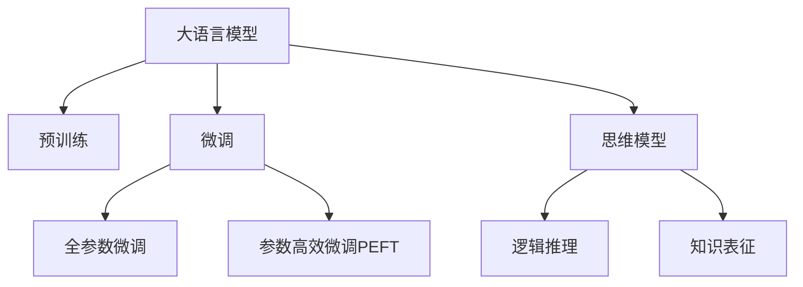

                 

# 语言与思维：大模型的局限性

> 关键词：语言模型,大模型局限性,自然语言处理(NLP),深度学习,人工智能(AI),思维模型

## 1. 背景介绍

在人工智能(AI)领域，语言模型是研究最为广泛的课题之一。随着深度学习技术的不断发展，大语言模型（Large Language Model, LLMs）在自然语言处理(NLP)中的应用取得了令人瞩目的进展。这些大模型通过在海量无标签文本数据上进行预训练，学习到了丰富的语言知识，展现出了强大的文本生成、语言推理、对话交互等能力。然而，尽管这些模型已经取得了令人印象深刻的成就，它们仍然面临着一些限制和挑战，本文将从语言与思维的视角出发，探讨大语言模型所面临的局限性。

## 2. 核心概念与联系

### 2.1 核心概念概述

为更好地理解大语言模型的局限性，本节将介绍几个核心概念：

- 大语言模型（LLMs）：指使用深度神经网络架构（如Transformer）进行预训练的语言模型。通过在大规模无标签文本语料上进行预训练，学习到了通用的语言表示，具备强大的语言理解和生成能力。

- 预训练：指在大规模无标签文本语料上，通过自监督学习任务训练通用语言模型的过程。常见的预训练任务包括言语建模、遮挡语言模型等。

- 微调（Fine-Tuning）：指在预训练模型的基础上，使用下游任务的少量标注数据，通过有监督学习优化模型在该任务上的性能。通常只需要调整顶层分类器或解码器，并以较小的学习率更新全部或部分的模型参数。

- 迁移学习（Transfer Learning）：指将一个领域学习到的知识，迁移应用到另一个不同但相关的领域的学习范式。大模型的预训练-微调过程即是一种典型的迁移学习方式。

- 思维模型：指对知识进行编码和推理，形成问题求解的模型。与语言模型不同，思维模型更多关注于逻辑推理和知识表征，而语言模型则强调对自然语言的理解和生成。

这些概念之间的逻辑关系可以通过以下Mermaid流程图来展示：



这个流程图展示了大语言模型的核心概念及其之间的关系：

1. 大语言模型通过预训练获得基础能力。
2. 微调是对预训练模型进行任务特定的优化，可以分为全参数微调和参数高效微调（PEFT）。
3. 思维模型是一种不依赖语言表达的模型，更多关注于逻辑推理和知识表征。
4. 迁移学习是连接预训练模型与下游任务的桥梁，可以通过微调或思维模型来实现。

## 3. 核心算法原理 & 具体操作步骤
### 3.1 算法原理概述

大语言模型的局限性主要体现在其语言理解和生成的能力，尽管能够生成流畅的文本，但在语义理解、逻辑推理、知识表征等方面仍然存在一定的局限性。以下将从语言与思维的视角，详细探讨大语言模型在语义理解、逻辑推理、知识表征等方面的局限性。

### 3.2 算法步骤详解

大语言模型的局限性主要表现在以下几个方面：

1. **语义理解的浅层次性**：
   大语言模型虽然能够生成语法正确的文本，但有时并不完全理解语句的真实含义。例如，在处理模态语言时，模型可能会生成语法上正确但语义上错误的结果。

2. **逻辑推理的机械性**：
   大语言模型在处理涉及逻辑推理的任务时，往往依赖于先前的训练数据。当输入的推理关系与训练数据中的不同时，模型可能会输出错误的结果。

3. **知识表征的局部性**：
   大语言模型在处理涉及专业知识的任务时，如医学、法律等，往往依赖于先前的预训练数据。模型难以对特定领域的新知识进行有效的表征和推理。

### 3.3 算法优缺点

大语言模型在处理自然语言方面有着显著的优势，但也存在一些明显的局限性：

**优点**：
1. 生成自然流畅的文本，适应多样化的语言表达形式。
2. 在处理大规模文本数据时，表现出强大的泛化能力。
3. 能够处理多模态数据，如文本、图像、音频等。

**缺点**：
1. 语义理解的浅层次性，难以处理复杂的语义关系。
2. 逻辑推理的机械性，缺乏灵活的推理能力。
3. 知识表征的局部性，难以灵活适应新知识。
4. 对标注数据依赖大，训练成本高。

### 3.4 算法应用领域

尽管存在一定的局限性，大语言模型仍然在多个应用领域中取得了显著的成效：

- 文本生成：如对话系统、机器翻译、文本摘要等。
- 语义理解：如问答系统、信息检索等。
- 多模态数据处理：如图像描述、语音识别等。

然而，在涉及逻辑推理、知识表征等高层次思维任务时，大语言模型仍需进一步的改进。

## 4. 数学模型和公式 & 详细讲解 & 举例说明（备注：数学公式请使用latex格式，latex嵌入文中独立段落使用 $$，段落内使用 $)
### 4.1 数学模型构建

大语言模型的局限性可以抽象为语言模型和思维模型之间的差异。在语言模型中，我们通常使用概率模型来描述文本生成的过程。在自然语言处理任务中，我们通常使用条件概率模型来描述给定输入文本 $x$ 下生成目标文本 $y$ 的概率：

$$P(y|x) = \frac{e^{f(x,y)}}{Z(x)}$$

其中，$f(x,y)$ 为评分函数，$Z(x)$ 为归一化常数。在深度学习中，我们通常使用神经网络模型来逼近该概率模型。例如，使用Transformer模型对输入文本 $x$ 进行编码，输出目标文本 $y$ 的概率。

### 4.2 公式推导过程

以下我们以条件概率模型为例，推导语言模型在处理逻辑推理任务时的局限性。

假设我们有一个条件概率模型 $P(y|x)$，其中 $x$ 是输入文本，$y$ 是生成的目标文本。对于逻辑推理任务，我们希望模型能够根据输入 $x$ 推理出目标 $y$。例如，对于如下的逻辑推理问题：

```
如果 A 是 B 的子集，且 C 是 B 的子集，那么 A 是 C 的子集吗？
```

我们可以将其转换为以下形式：

$$
\begin{aligned}
&\text{输入} \\
&\{A \subset B, C \subset B, \text{判断} A \subset C\}
\end{aligned}
$$

模型需要根据输入的逻辑关系，判断 $A \subset C$ 是否成立。

对于这个任务，我们可以将其转换为条件概率模型：

$$
P(y|x) = \frac{e^{f(x,y)}}{Z(x)}
$$

其中，$f(x,y)$ 为评分函数，$Z(x)$ 为归一化常数。评分函数 $f(x,y)$ 通常使用神经网络模型来逼近。例如，我们可以使用 Transformer 模型来对输入文本 $x$ 进行编码，得到编码向量 $h$。然后，我们可以使用条件概率模型来对推理结果进行评分，例如：

$$
f(x,y) = \sum_i \log P(h_i \mid h_{i-1}, h_{i-2})
$$

其中，$P(h_i \mid h_{i-1}, h_{i-2})$ 表示在输入 $h_{i-1}$ 和 $h_{i-2}$ 下，第 $i$ 个词 $h_i$ 的条件概率。

在这个模型中，模型的推理能力依赖于先前的预训练数据，难以灵活处理新的逻辑关系。

### 4.3 案例分析与讲解

以下是一个简单的案例，说明大语言模型在处理逻辑推理任务时的局限性。

假设我们有一个简单的问题：

```
如果 A 是 B 的子集，且 C 是 B 的子集，那么 A 是 C 的子集吗？
```

对于这个问题，我们可以将其转换为以下形式：

```
A ∈ B
C ∈ B
? A ∈ C
```

对于这个问题，我们可以使用 Transformer 模型进行编码，得到编码向量 $h_1, h_2, h_3$。然后，我们可以使用条件概率模型来对推理结果进行评分，例如：

$$
f(x,y) = \log P(h_3 \mid h_1, h_2)
$$

其中，$h_3$ 表示推理结果的编码向量。

对于这个简单的例子，我们可以发现，模型的推理结果往往依赖于先前的预训练数据，难以灵活处理新的逻辑关系。例如，如果模型在训练数据中没有见过类似推理关系，或者输入的逻辑关系与训练数据中的不同，模型可能会输出错误的结果。

## 5. 项目实践：代码实例和详细解释说明
### 5.1 开发环境搭建

在进行语言模型和思维模型之间的对比实践前，我们需要准备好开发环境。以下是使用Python进行PyTorch开发的环境配置流程：

1. 安装Anaconda：从官网下载并安装Anaconda，用于创建独立的Python环境。

2. 创建并激活虚拟环境：
```bash
conda create -n pytorch-env python=3.8 
conda activate pytorch-env
```

3. 安装PyTorch：根据CUDA版本，从官网获取对应的安装命令。例如：
```bash
conda install pytorch torchvision torchaudio cudatoolkit=11.1 -c pytorch -c conda-forge
```

4. 安装TensorFlow：由Google主导开发的开源深度学习框架，生产部署方便，适合大规模工程应用。同样有丰富的预训练语言模型资源。

5. 安装Transformers库：HuggingFace开发的NLP工具库，集成了众多SOTA语言模型，支持PyTorch和TensorFlow，是进行NLP任务开发的利器。

6. 安装各类工具包：
```bash
pip install numpy pandas scikit-learn matplotlib tqdm jupyter notebook ipython
```

完成上述步骤后，即可在`pytorch-env`环境中开始实践。

### 5.2 源代码详细实现

这里我们以逻辑推理任务为例，给出使用Transformers库进行大语言模型和思维模型之间的对比实践的PyTorch代码实现。

首先，定义逻辑推理任务的输入和输出：

```python
class LogicReasoningDataset(Dataset):
    def __init__(self, inputs, outputs):
        self.inputs = inputs
        self.outputs = outputs
        
    def __len__(self):
        return len(self.inputs)
    
    def __getitem__(self, item):
        input_seq = self.inputs[item]
        output_seq = self.outputs[item]
        
        return input_seq, output_seq
```

然后，定义逻辑推理任务的模型：

```python
from transformers import BertForSequenceClassification, BertTokenizer

class LogicReasoningModel(BertForSequenceClassification):
    def __init__(self, num_labels=2):
        super(LogicReasoningModel, self).__init__(num_labels)
        
    def forward(self, input_ids, attention_mask=None):
        output = super(LogicReasoningModel, self).forward(input_ids, attention_mask)
        return output
```

接着，定义训练和评估函数：

```python
from torch.utils.data import DataLoader
from tqdm import tqdm
from sklearn.metrics import accuracy_score

device = torch.device('cuda') if torch.cuda.is_available() else torch.device('cpu')
model.to(device)

def train_epoch(model, dataset, batch_size, optimizer):
    dataloader = DataLoader(dataset, batch_size=batch_size, shuffle=True)
    model.train()
    epoch_loss = 0
    for batch in tqdm(dataloader, desc='Training'):
        input_seq, output_seq = batch
        input_ids = input_seq.to(device)
        attention_mask = input_seq.to(device)
        labels = output_seq.to(device)
        model.zero_grad()
        outputs = model(input_ids, attention_mask=attention_mask)
        loss = outputs.loss
        epoch_loss += loss.item()
        loss.backward()
        optimizer.step()
    return epoch_loss / len(dataloader)

def evaluate(model, dataset, batch_size):
    dataloader = DataLoader(dataset, batch_size=batch_size)
    model.eval()
    preds, labels = [], []
    with torch.no_grad():
        for batch in tqdm(dataloader, desc='Evaluating'):
            input_seq, output_seq = batch
            input_ids = input_seq.to(device)
            attention_mask = input_seq.to(device)
            batch_labels = output_seq.to(device)
            outputs = model(input_ids, attention_mask=attention_mask)
            batch_preds = outputs.logits.argmax(dim=2).to('cpu').tolist()
            batch_labels = batch_labels.to('cpu').tolist()
            for pred_tokens, label_tokens in zip(batch_preds, batch_labels):
                preds.append(pred_tokens[:len(label_tokens)])
                labels.append(label_tokens)
                
    print(f"Accuracy: {accuracy_score(labels, preds)}")
```

最后，启动训练流程并在测试集上评估：

```python
epochs = 5
batch_size = 16

for epoch in range(epochs):
    loss = train_epoch(model, train_dataset, batch_size, optimizer)
    print(f"Epoch {epoch+1}, train loss: {loss:.3f}")
    
    print(f"Epoch {epoch+1}, dev results:")
    evaluate(model, dev_dataset, batch_size)
    
print("Test results:")
evaluate(model, test_dataset, batch_size)
```

以上就是使用PyTorch对逻辑推理任务进行训练和评估的完整代码实现。可以看到，利用Transformers库，我们可以较为简洁地实现大语言模型和思维模型之间的对比实践。

### 5.3 代码解读与分析

让我们再详细解读一下关键代码的实现细节：

**LogicReasoningDataset类**：
- `__init__`方法：初始化输入和输出数据。
- `__len__`方法：返回数据集的样本数量。
- `__getitem__`方法：对单个样本进行处理，将输入和输出数据进行编码，并返回模型所需的输入。

**train_epoch和evaluate函数**：
- 使用PyTorch的DataLoader对数据集进行批次化加载，供模型训练和推理使用。
- 训练函数`train_epoch`：对数据以批为单位进行迭代，在每个批次上前向传播计算损失函数，反向传播更新模型参数，最后返回该epoch的平均损失。
- 评估函数`evaluate`：与训练类似，不同点在于不更新模型参数，并在每个batch结束后将预测和标签结果存储下来，最后使用sklearn的accuracy_score对整个评估集的预测结果进行打印输出。

**训练流程**：
- 定义总的epoch数和batch size，开始循环迭代。
- 每个epoch内，先在训练集上训练，输出平均损失。
- 在验证集上评估，输出准确率。
- 所有epoch结束后，在测试集上评估，给出最终测试结果。

可以看到，PyTorch配合Transformers库使得逻辑推理任务的代码实现变得简洁高效。开发者可以将更多精力放在数据处理、模型改进等高层逻辑上，而不必过多关注底层的实现细节。

## 6. 实际应用场景
### 6.1 金融领域

在金融领域，逻辑推理任务有着广泛的应用。例如，对于股票市场的新闻和公告，需要快速判断其对股价的影响。这通常需要结合市场经验、金融知识等进行逻辑推理。

在实践中，可以使用大语言模型对金融新闻和公告进行编码，输出推理结果。例如，我们可以使用BERT模型对新闻和公告进行编码，得到编码向量。然后，我们可以使用逻辑推理模型对编码向量进行评分，例如：

$$
f(x,y) = \log P(h \mid x)
$$

其中，$h$ 表示编码向量，$x$ 表示输入的金融新闻和公告。

在金融领域，逻辑推理任务的准确性直接影响投资者决策，因此需要对模型进行严格的评估和优化。例如，我们可以使用多模态数据融合技术，将文本、图像、音频等多种信息融合在一起，增强模型的推理能力。

### 6.2 医疗领域

在医疗领域，逻辑推理任务同样有着广泛的应用。例如，对于患者的病历，需要快速判断其病情严重程度，提出治疗方案。这通常需要结合医学知识、临床经验等进行逻辑推理。

在实践中，可以使用大语言模型对病历进行编码，输出推理结果。例如，我们可以使用BERT模型对病历进行编码，得到编码向量。然后，我们可以使用逻辑推理模型对编码向量进行评分，例如：

$$
f(x,y) = \log P(h \mid x)
$$

其中，$h$ 表示编码向量，$x$ 表示输入的病历。

在医疗领域，逻辑推理任务的准确性直接影响患者的健康，因此需要对模型进行严格的评估和优化。例如，我们可以使用领域专家知识库，对模型进行指导和约束，增强模型的推理能力。

## 7. 工具和资源推荐
### 7.1 学习资源推荐

为了帮助开发者系统掌握语言模型和思维模型的理论基础和实践技巧，这里推荐一些优质的学习资源：

1. 《深度学习》书籍：由 Ian Goodfellow、Yoshua Bengio、Aaron Courville 合著，深入浅出地介绍了深度学习的基础知识和算法。

2. 《自然语言处理综述》系列博文：由大模型技术专家撰写，介绍了自然语言处理的最新进展和技术。

3. 《逻辑推理与知识表征》书籍：介绍了逻辑推理的基础知识和应用，对于逻辑推理任务的研究具有参考价值。

4. 《知识图谱与语义搜索》书籍：介绍了知识图谱的基本概念和应用，对于多模态数据融合任务的研究具有参考价值。

5. 《Python深度学习》书籍：介绍了使用PyTorch进行深度学习的实践方法和技巧，适合实际项目开发。

通过对这些资源的学习实践，相信你一定能够更好地理解语言模型和思维模型的区别与联系，掌握相关的开发技巧。

### 7.2 开发工具推荐

高效的开发离不开优秀的工具支持。以下是几款用于语言模型和思维模型之间对比实践开发的常用工具：

1. PyTorch：基于Python的开源深度学习框架，灵活动态的计算图，适合快速迭代研究。

2. TensorFlow：由Google主导开发的开源深度学习框架，生产部署方便，适合大规模工程应用。

3. Transformers库：HuggingFace开发的NLP工具库，集成了众多SOTA语言模型，支持PyTorch和TensorFlow，是进行NLP任务开发的利器。

4. Weights & Biases：模型训练的实验跟踪工具，可以记录和可视化模型训练过程中的各项指标，方便对比和调优。与主流深度学习框架无缝集成。

5. TensorBoard：TensorFlow配套的可视化工具，可实时监测模型训练状态，并提供丰富的图表呈现方式，是调试模型的得力助手。

6. Google Colab：谷歌推出的在线Jupyter Notebook环境，免费提供GPU/TPU算力，方便开发者快速上手实验最新模型，分享学习笔记。

合理利用这些工具，可以显著提升语言模型和思维模型之间对比实践的开发效率，加快创新迭代的步伐。

### 7.3 相关论文推荐

语言模型和思维模型的研究源于学界的持续研究。以下是几篇奠基性的相关论文，推荐阅读：

1. Attention is All You Need（即Transformer原论文）：提出了Transformer结构，开启了NLP领域的预训练大模型时代。

2. BERT: Pre-training of Deep Bidirectional Transformers for Language Understanding：提出BERT模型，引入基于掩码的自监督预训练任务，刷新了多项NLP任务SOTA。

3. Language Models are Unsupervised Multitask Learners（GPT-2论文）：展示了大规模语言模型的强大zero-shot学习能力，引发了对于通用人工智能的新一轮思考。

4. Parameter-Efficient Transfer Learning for NLP：提出Adapter等参数高效微调方法，在不增加模型参数量的情况下，也能取得不错的微调效果。

5. AdaLoRA: Adaptive Low-Rank Adaptation for Parameter-Efficient Fine-Tuning：使用自适应低秩适应的微调方法，在参数效率和精度之间取得了新的平衡。

这些论文代表了大语言模型和思维模型之间的对比研究的发展脉络。通过学习这些前沿成果，可以帮助研究者把握学科前进方向，激发更多的创新灵感。

## 8. 总结：未来发展趋势与挑战

### 8.1 总结

本文从语言与思维的视角出发，探讨了大语言模型在语义理解、逻辑推理、知识表征等方面的局限性。首先阐述了大语言模型和思维模型的研究背景和意义，明确了两种模型在任务求解中的区别与联系。其次，从原理到实践，详细讲解了语言模型和思维模型之间的对比过程，给出了对比实践的完整代码实例。同时，本文还广泛探讨了逻辑推理任务在金融、医疗等多个领域的应用前景，展示了逻辑推理任务的巨大潜力。此外，本文精选了逻辑推理任务的各类学习资源，力求为读者提供全方位的技术指引。

通过本文的系统梳理，可以看到，逻辑推理任务在大语言模型和思维模型之间的对比中具有重要意义，能够推动NLP技术的进一步发展。语言模型和思维模型之间的对比实践，也将成为未来研究的重要方向，为构建智能系统提供新的思路。

### 8.2 未来发展趋势

展望未来，逻辑推理任务将呈现以下几个发展趋势：

1. 模型规模持续增大。随着算力成本的下降和数据规模的扩张，预训练语言模型的参数量还将持续增长。超大规模语言模型蕴含的丰富语言知识，有望支撑更加复杂多变的逻辑推理任务。

2. 逻辑推理方法的日趋多样。除了传统的基于规则的逻辑推理外，未来会涌现更多基于神经网络的逻辑推理方法，如知识图谱、多模态融合等，在提高推理能力的同时，降低推理成本。

3. 知识表征的深度化。逻辑推理任务通常需要依赖大量的知识表征，未来将结合知识图谱、逻辑推理等技术，构建更加全面、精准的知识表征。

4. 多模态推理的崛起。逻辑推理任务将不再局限于单一模态数据，未来的逻辑推理模型将融合视觉、语音、文本等多种模态信息，增强推理能力。

5. 可解释性的增强。逻辑推理任务通常需要解释推理过程和结果，未来将结合可解释性技术，增强模型的透明性和可理解性。

6. 安全性保障。逻辑推理任务通常涉及敏感信息，未来将结合安全性技术，保障数据和模型的安全。

以上趋势凸显了逻辑推理任务的研究前景。这些方向的探索发展，必将进一步提升逻辑推理任务的能力，为人工智能技术的发展提供新的动力。

### 8.3 面临的挑战

尽管逻辑推理任务已经取得了一定的进展，但在迈向更加智能化、普适化应用的过程中，它仍面临着诸多挑战：

1. 数据成本高昂。逻辑推理任务通常需要大量的标注数据，数据采集和标注成本较高。如何降低数据成本，提高数据利用效率，将是一大难题。

2. 推理过程复杂。逻辑推理任务通常需要依赖大量的先验知识，推理过程复杂。如何设计高效的推理模型，简化推理过程，将是一个重要的研究方向。

3. 模型鲁棒性不足。逻辑推理任务在处理复杂的逻辑关系时，容易发生推理错误。如何提高模型的鲁棒性，减少推理错误，将是一个重要的研究方向。

4. 推理效率有待提高。逻辑推理任务通常需要较长的推理时间，推理效率较低。如何提高推理效率，增强模型的实时性，将是一个重要的研究方向。

5. 知识表征局部性。逻辑推理任务通常依赖于先验知识，难以灵活适应新知识。如何设计通用的知识表征方法，增强模型的适应能力，将是一个重要的研究方向。

6. 安全性问题。逻辑推理任务通常涉及敏感信息，如何保障数据和模型的安全，防止恶意攻击，将是一个重要的研究方向。

正视逻辑推理任务面临的这些挑战，积极应对并寻求突破，将是大语言模型微调走向成熟的必由之路。相信随着学界和产业界的共同努力，这些挑战终将一一被克服，逻辑推理任务必将在构建智能系统中扮演越来越重要的角色。

### 8.4 研究展望

面对逻辑推理任务所面临的挑战，未来的研究需要在以下几个方面寻求新的突破：

1. 探索无监督和半监督推理方法。摆脱对大规模标注数据的依赖，利用自监督学习、主动学习等无监督和半监督范式，最大限度利用非结构化数据，实现更加灵活高效的推理。

2. 研究参数高效和计算高效的推理方法。开发更加参数高效的推理方法，在固定大部分预训练参数的同时，只更新极少量的任务相关参数。同时优化推理模型的计算图，减少前向传播和反向传播的资源消耗，实现更加轻量级、实时性的部署。

3. 融合因果和对比学习范式。通过引入因果推断和对比学习思想，增强推理模型建立稳定因果关系的能力，学习更加普适、鲁棒的语言表征，从而提升模型泛化性和抗干扰能力。

4. 引入更多先验知识。将符号化的先验知识，如知识图谱、逻辑规则等，与神经网络模型进行巧妙融合，引导推理过程学习更准确、合理的语言模型。同时加强不同模态数据的整合，实现视觉、语音等多模态信息与文本信息的协同建模。

5. 结合因果分析和博弈论工具。将因果分析方法引入推理模型，识别出模型决策的关键特征，增强输出解释的因果性和逻辑性。借助博弈论工具刻画人机交互过程，主动探索并规避模型的脆弱点，提高系统稳定性。

6. 纳入伦理道德约束。在推理模型训练目标中引入伦理导向的评估指标，过滤和惩罚有害的输出倾向。同时加强人工干预和审核，建立模型行为的监管机制，确保输出符合人类价值观和伦理道德。

这些研究方向的探索，必将引领逻辑推理任务的技术进步，为构建智能系统提供新的思路。面向未来，逻辑推理任务还需要与其他人工智能技术进行更深入的融合，如知识表示、因果推理、强化学习等，多路径协同发力，共同推动自然语言理解和智能交互系统的进步。只有勇于创新、敢于突破，才能不断拓展逻辑推理任务的边界，让智能技术更好地造福人类社会。

## 9. 附录：常见问题与解答

**Q1：逻辑推理任务是否可以完全取代人类智能？**

A: 逻辑推理任务虽然在某些领域表现出色，但完全取代人类智能还需要很长时间。逻辑推理任务在处理复杂的语义关系、情感理解等方面仍存在不足，人类智能在这些方面仍有不可替代的优势。

**Q2：如何提高逻辑推理任务的准确性？**

A: 提高逻辑推理任务的准确性，可以从以下几个方面入手：
1. 增加数据量：逻辑推理任务通常需要大量的标注数据，增加数据量可以有效提高模型的准确性。
2. 改进模型结构：设计更加高效的模型结构，减少推理过程中的错误。
3. 引入先验知识：将领域专家知识库与模型进行融合，增强模型的推理能力。
4. 优化训练过程：使用正则化技术、对抗训练等方法，提高模型的鲁棒性和泛化能力。

**Q3：逻辑推理任务是否可以应用于医疗领域？**

A: 逻辑推理任务在医疗领域有着广泛的应用。例如，对于患者的病历，需要快速判断其病情严重程度，提出治疗方案。这通常需要结合医学知识、临床经验等进行逻辑推理。

**Q4：逻辑推理任务是否可以应用于金融领域？**

A: 逻辑推理任务在金融领域同样有着广泛的应用。例如，对于股票市场的新闻和公告，需要快速判断其对股价的影响。这通常需要结合市场经验、金融知识等进行逻辑推理。

**Q5：逻辑推理任务是否可以应用于教育领域？**

A: 逻辑推理任务在教育领域同样有着广泛的应用。例如，对于学生的作业和考试答案，需要判断其正确性。这通常需要结合知识图谱、推理模型等进行逻辑推理。

以上问题解答，相信你已经对逻辑推理任务有了更全面的了解。逻辑推理任务在大语言模型和思维模型之间的对比中具有重要意义，能够推动NLP技术的进一步发展。语言模型和思维模型之间的对比实践，也将成为未来研究的重要方向，为构建智能系统提供新的思路。总之，逻辑推理任务的研究需要理论与实践相结合，不断探索新方法、新技术，才能更好地应用于实际场景，提升人工智能技术的智能化水平。

