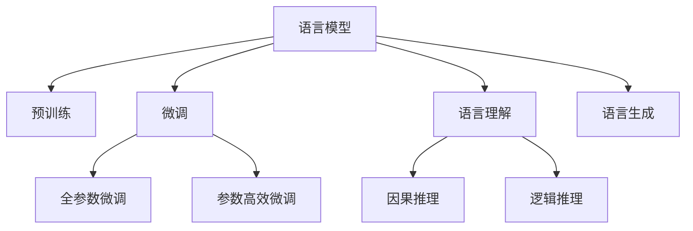

                 

# 语言与思维：大模型的认知困境

在人工智能的浩瀚宇宙中，大语言模型（Large Language Models, LLMs）无疑是最闪耀的星体之一。这些基于自回归或自编码模型的大规模预训练语言模型，如BERT、GPT-3、T5等，已经在自然语言处理（Natural Language Processing, NLP）领域取得了令人瞩目的成果。但随着这些模型越来越强大，我们不得不面对一个深刻的认知困境：大模型究竟能否真正理解和表达语言？

## 1. 背景介绍

### 1.1 问题由来

近年来，大语言模型在自然语言理解、生成和推理等方面取得了显著进展。这些模型通过在海量文本数据上进行预训练，学习到了复杂的语言知识和语义表示，进而能够在各种下游任务上取得优异的性能。例如，BERT模型通过在大量文本上进行预训练，学习到了文本-标签映射，在问答、情感分析、文本分类等任务上刷新了多项记录。GPT-3更是具备了高度的文本生成能力，能够创作出风格多样的文章，甚至是编写代码。

然而，尽管大语言模型在技术上取得了巨大成功，它们在认知层面的表现仍然面临诸多挑战。这引发了人们对于“大模型是否真的理解语言”的疑问，尤其是在理解和表达语言深层意义、逻辑推理等方面。

### 1.2 问题核心关键点

大模型认知困境的核心关键点在于其对语言深层次意义的理解能力。大模型尽管在大量文本上进行了预训练，但并不意味着它们具备人类那样的思维能力和语义理解。以下是几个核心问题：

- 大模型是否理解了语言的真正意义？
- 大模型是否具备因果关系理解能力？
- 大模型是否能够进行逻辑推理？
- 大模型是否能够生成有意义且符合逻辑的文本？

这些问题涉及到大模型的语言生成能力、因果关系处理能力、逻辑推理能力等多个层面，需要深入探索其认知机制。

## 2. 核心概念与联系

### 2.1 核心概念概述

为了更好地理解大模型的认知困境，我们先介绍几个核心概念：

- 语言模型（Language Model）：用于描述语言的概率分布模型。常见语言模型包括基于n-gram的统计模型和基于神经网络的深度学习模型。
- 预训练（Pre-training）：在大量无标签文本数据上训练语言模型，学习通用的语言表示。常见的预训练任务包括言语建模、掩码语言模型等。
- 微调（Fine-tuning）：在预训练模型的基础上，使用下游任务的少量标注数据，通过有监督学习优化模型在该任务上的性能。
- 语言理解（Language Understanding）：指模型能够理解自然语言输入的含义，包括语义理解、句法分析、语境推理等。
- 语言生成（Language Generation）：指模型能够根据输入的指令生成自然语言输出，包括文本生成、对话生成、摘要生成等。
- 因果推理（Causal Reasoning）：指模型能够根据已知的因果关系，推断出未知结果的能力。
- 逻辑推理（Logical Reasoning）：指模型能够根据逻辑规则，推导出合理的结论。

这些概念之间的逻辑关系可以通过以下Mermaid流程图来展示：



这个流程图展示了大语言模型的核心概念及其之间的关系：

1. 语言模型通过预训练获得基础能力。
2. 微调是对预训练模型进行任务特定的优化，可以分为全参数微调和参数高效微调（PEFT）。
3. 语言理解包括语义理解、句法分析、语境推理等。
4. 因果推理指根据已知的因果关系推断未知结果的能力。
5. 逻辑推理指根据逻辑规则推导出合理结论的能力。
6. 语言生成指根据输入的指令生成自然语言输出。

这些概念共同构成了大语言模型的认知框架，使其能够在各种场景下发挥强大的语言理解和生成能力。但这些能力究竟能否等同于人类认知能力，仍需进一步探索。

## 3. 核心算法原理 & 具体操作步骤
### 3.1 算法原理概述

大语言模型的认知困境，核心在于其对语言深层次意义的理解能力。尽管这些模型在大量文本上进行了预训练，并能够在新任务上进行微调，但其认知能力仍与人类存在显著差异。

### 3.2 算法步骤详解

为了深入探究大模型的认知机制，我们以因果推理和逻辑推理为例，介绍其核心算法原理和操作步骤。

#### 3.2.1 因果推理

因果推理（Causal Reasoning）是指模型能够根据已知的因果关系，推断出未知结果的能力。在大模型中，因果推理主要通过引入因果关系约束来实现。

**步骤1: 定义因果关系**
首先，需要明确问题中的因果关系。例如，在医学诊断中，已知症状与疾病之间的关系；在股票预测中，历史价格与未来价格之间的关系。

**步骤2: 构造因果图**
根据已知的因果关系，构造因果图（Causal Graph）。因果图描述了变量之间的依赖关系和影响路径，是因果推理的基础。

**步骤3: 训练因果推理模型**
使用因果图作为训练数据，训练因果推理模型。常见的方法包括结构方程模型（Structural Equation Model, SEM）、贝叶斯网络（Bayesian Network）等。

**步骤4: 应用因果推理模型**
将训练好的因果推理模型应用于新问题，推断出未知结果。

#### 3.2.2 逻辑推理

逻辑推理（Logical Reasoning）是指模型能够根据逻辑规则，推导出合理的结论。在大模型中，逻辑推理主要通过引入逻辑约束来实现。

**步骤1: 定义逻辑规则**
首先，需要明确问题中的逻辑规则。例如，在数学证明中，已知公理和定理；在自然语言推理中，已知前提和假设。

**步骤2: 构造逻辑表达式**
根据已知的逻辑规则，构造逻辑表达式。常见的方法包括布尔代数、一阶逻辑等。

**步骤3: 训练逻辑推理模型**
使用逻辑表达式作为训练数据，训练逻辑推理模型。常见的方法包括神经网络、符号逻辑推理机等。

**步骤4: 应用逻辑推理模型**
将训练好的逻辑推理模型应用于新问题，推导出合理的结论。

### 3.3 算法优缺点

大模型的因果推理和逻辑推理算法具有以下优点：

- 泛化能力强。由于在大规模数据上进行了预训练，模型具备较强的泛化能力，能够处理多种因果关系和逻辑规则。
- 适用性广。无论是因果推理还是逻辑推理，大模型都能通过引入相应的约束来构建推理模型。
- 技术成熟。大模型使用现有的因果图、逻辑表达式等方法进行训练，技术成熟可靠。

但这些算法也存在一些缺点：

- 依赖数据质量。模型需要高质量的因果关系和逻辑规则数据进行训练，数据质量直接影响推理结果的准确性。
- 计算复杂度高。因果推理和逻辑推理的计算复杂度较高，训练和推理时间较长。
- 可解释性不足。大模型的推理过程较为复杂，难以进行解释和调试。

尽管存在这些局限性，但就目前而言，因果推理和逻辑推理算法仍是解决复杂推理任务的重要手段。

### 3.4 算法应用领域

大模型的因果推理和逻辑推理算法，已经在诸多领域得到了应用，例如：

- 医学诊断：根据已知的症状与疾病之间的因果关系，推断出可能的疾病。
- 金融预测：根据历史价格与未来价格之间的因果关系，预测未来的股票价格。
- 法律咨询：根据已知的法律规则，推断出案件的判决结果。
- 自然语言推理：根据已知的前提和假设，推断出合理的结论。
- 逻辑编程：使用逻辑表达式进行编程，编写更加可靠的程序。

除了这些经典应用外，大模型还将在更多场景中得到应用，如智能推荐、自动驾驶、智能客服等，为各行业带来新的突破。

## 4. 数学模型和公式 & 详细讲解  
### 4.1 数学模型构建

本节将使用数学语言对大语言模型的因果推理和逻辑推理进行更加严格的刻画。

设问题中的变量为 $X_1, X_2, \dots, X_n$，其中 $X_i$ 表示第 $i$ 个变量。设 $Y$ 为需要推断的未知变量。已知变量 $X_i$ 与 $Y$ 之间的因果关系 $C(X_i, Y)$，表示 $X_i$ 对 $Y$ 的影响。

假设因果关系 $C(X_i, Y)$ 为线性函数，则因果关系模型为：

$$
Y = \alpha_0 + \sum_{i=1}^n \alpha_i X_i + \epsilon
$$

其中 $\alpha_i$ 为回归系数，$\epsilon$ 为随机误差项。

在逻辑推理中，我们同样可以使用数学模型进行形式化描述。例如，在自然语言推理中，已知前提 $P$ 和假设 $H$，推断结论 $C$。逻辑模型可以表示为：

$$
C = \begin{cases}
\text{True}, & \text{if } P \models H \\
\text{False}, & \text{otherwise}
\end{cases}
$$

其中 $\models$ 表示逻辑推理关系，$P$ 表示前提，$H$ 表示假设，$C$ 表示结论。

### 4.2 公式推导过程

以下我们以因果推理和逻辑推理为例，推导相关的数学模型及其参数更新公式。

#### 4.2.1 因果推理

因果推理模型为：

$$
Y = \alpha_0 + \sum_{i=1}^n \alpha_i X_i + \epsilon
$$

其中 $\alpha_0, \alpha_1, \dots, \alpha_n$ 为回归系数，$\epsilon$ 为随机误差项。模型参数 $\theta = (\alpha_0, \alpha_1, \dots, \alpha_n)$。

给定训练数据 $D = \{(X_1, X_2, \dots, X_n, Y)\}_{i=1}^N$，损失函数为：

$$
\mathcal{L}(\theta) = \frac{1}{N} \sum_{i=1}^N (Y_i - f_{\theta}(X_i))^2
$$

其中 $f_{\theta}(x) = \alpha_0 + \sum_{i=1}^n \alpha_i X_i$。

使用梯度下降等优化算法，更新模型参数 $\theta$：

$$
\theta \leftarrow \theta - \eta \nabla_{\theta}\mathcal{L}(\theta)
$$

#### 4.2.2 逻辑推理

逻辑推理模型为：

$$
C = \begin{cases}
\text{True}, & \text{if } P \models H \\
\text{False}, & \text{otherwise}
\end{cases}
$$

其中 $P$ 表示前提，$H$ 表示假设，$C$ 表示结论。模型参数 $\theta = (\alpha_0, \alpha_1, \dots, \alpha_n)$。

假设前提 $P$ 和假设 $H$ 的布尔向量表示为 $p$ 和 $h$，结论的布尔向量表示为 $c$。模型参数 $\theta = (\alpha_0, \alpha_1, \dots, \alpha_n)$。

给定训练数据 $D = \{(p_i, h_i, c_i)\}_{i=1}^N$，损失函数为：

$$
\mathcal{L}(\theta) = \frac{1}{N} \sum_{i=1}^N -c_i \log f_{\theta}(p_i, h_i) - (1-c_i) \log (1-f_{\theta}(p_i, h_i))
$$

其中 $f_{\theta}(p_i, h_i) = \alpha_0 + \sum_{i=1}^n \alpha_i p_i h_i$。

使用梯度下降等优化算法，更新模型参数 $\theta$：

$$
\theta \leftarrow \theta - \eta \nabla_{\theta}\mathcal{L}(\theta)
$$

## 5. 项目实践：代码实例和详细解释说明
### 5.1 开发环境搭建

在进行因果推理和逻辑推理实践前，我们需要准备好开发环境。以下是使用Python进行Scikit-learn开发的环境配置流程：

1. 安装Anaconda：从官网下载并安装Anaconda，用于创建独立的Python环境。

2. 创建并激活虚拟环境：
```bash
conda create -n causal-reasoning python=3.8 
conda activate causal-reasoning
```

3. 安装Scikit-learn：
```bash
pip install scikit-learn
```

4. 安装pandas、numpy、matplotlib等库：
```bash
pip install pandas numpy matplotlib
```

完成上述步骤后，即可在`causal-reasoning`环境中开始因果推理和逻辑推理实践。

### 5.2 源代码详细实现

这里我们以因果推理中的线性回归模型和逻辑推理中的逻辑回归模型为例，给出使用Scikit-learn库的代码实现。

#### 5.2.1 因果推理

首先，定义因果关系数据：

```python
import pandas as pd

# 生成因果关系数据
data = pd.DataFrame({
    'x1': [1, 2, 3, 4, 5],
    'x2': [2, 4, 6, 8, 10],
    'y': [10, 20, 30, 40, 50]
})

# 将y表示为x1和x2的线性关系
from sklearn.linear_model import LinearRegression

X = pd.concat([data['x1'], data['x2']], axis=1)
y = data['y']
model = LinearRegression()
model.fit(X, y)
```

接着，使用训练好的模型进行预测：

```python
# 生成新数据
new_data = pd.DataFrame({
    'x1': [6, 7, 8, 9, 10],
    'x2': [12, 14, 16, 18, 20]
})

# 使用训练好的模型进行预测
y_pred = model.predict(new_data)
print(y_pred)
```

#### 5.2.2 逻辑推理

首先，定义逻辑推理数据：

```python
from sklearn.linear_model import LogisticRegression

# 生成逻辑推理数据
data = pd.DataFrame({
    'p': [1, 0, 0, 0, 0],
    'h': [1, 1, 1, 0, 0],
    'c': [1, 1, 0, 0, 0]
})

# 将c表示为p和h的逻辑关系
model = LogisticRegression(solver='lbfgs', max_iter=1000)
model.fit(data[['p', 'h']], data['c'])
```

接着，使用训练好的模型进行预测：

```python
# 生成新数据
new_data = pd.DataFrame({
    'p': [1, 1, 0, 1, 0],
    'h': [1, 1, 1, 0, 0]
})

# 使用训练好的模型进行预测
y_pred = model.predict(new_data)
print(y_pred)
```

以上就是使用Scikit-learn库进行因果推理和逻辑推理的完整代码实现。可以看到，通过Scikit-learn的封装，因果推理和逻辑推理的代码实现变得简洁高效。

### 5.3 代码解读与分析

让我们再详细解读一下关键代码的实现细节：

**因果关系数据生成**：
- 使用Pandas库生成因果关系数据，包含变量 $x_1, x_2$ 和目标变量 $y$。
- 通过Pandas的DataFrame构造函数，将变量和目标变量拼接成一个数据集。

**因果回归模型训练**：
- 使用Scikit-learn库中的线性回归模型，通过训练数据集 $X, y$ 训练出模型参数。
- 在训练过程中，线性回归模型自动学习 $x_1, x_2$ 对 $y$ 的影响关系。

**新数据预测**：
- 使用训练好的模型，对新数据集 $X_{new}$ 进行预测，得到预测结果 $y_{pred}$。
- 通过模型实例的predict方法，计算每个新样本的预测值。

**逻辑推理数据生成**：
- 使用Pandas库生成逻辑推理数据，包含变量 $p, h$ 和目标变量 $c$。
- 通过Pandas的DataFrame构造函数，将变量和目标变量拼接成一个数据集。

**逻辑回归模型训练**：
- 使用Scikit-learn库中的逻辑回归模型，通过训练数据集 $p, h, c$ 训练出模型参数。
- 在训练过程中，逻辑回归模型自动学习 $p, h$ 对 $c$ 的逻辑关系。

**新数据预测**：
- 使用训练好的模型，对新数据集 $p_{new}, h_{new}$ 进行预测，得到预测结果 $c_{pred}$。
- 通过模型实例的predict方法，计算每个新样本的预测值。

## 6. 实际应用场景
### 6.1 医疗诊断

在大模型微调的应用场景中，医疗诊断是一个非常典型的案例。医生在诊断过程中需要根据患者的症状和病史，推断出可能的疾病。通过引入因果推理，大模型可以辅助医生进行诊断决策。

例如，在大模型中加入因果关系约束，假设症状 $x_1, x_2, \dots, x_n$ 与疾病 $y$ 之间的关系，模型可以自动学习症状与疾病之间的因果关系。在面对新病例时，医生可以根据输入的症状数据，通过大模型推断出可能的疾病，提供辅助诊断建议。

### 6.2 金融预测

在金融领域，大模型也可以用于预测股票价格、货币汇率等市场指标。通过引入因果关系约束，模型可以基于历史数据和市场因素，推断出未来的市场变化。

例如，在大模型中加入因果关系约束，假设历史价格 $x_1, x_2, \dots, x_n$ 与未来价格 $y$ 之间的关系，模型可以自动学习市场因素对价格的影响。在面对新的市场数据时，模型可以基于已有的因果关系，推断出未来的价格变化，为投资者提供决策参考。

### 6.3 法律咨询

在法律领域，大模型可以用于推断案件的判决结果。通过引入逻辑约束，模型可以基于已有的法律规则，推断出案件的判决结果。

例如，在大模型中加入逻辑约束，假设前提 $p$ 和假设 $h$ 与结论 $c$ 的逻辑关系，模型可以自动学习法律规则。在面对新的案件时，模型可以根据输入的前提和假设，推断出合理的判决结果，为律师提供参考。

### 6.4 未来应用展望

尽管大模型的认知能力仍面临诸多挑战，但未来在因果推理和逻辑推理方面，仍有广阔的应用前景。

- 医疗诊断：通过引入因果关系，大模型可以更好地辅助医生进行诊断决策，提高诊断的准确性和效率。
- 金融预测：通过引入因果关系，大模型可以更好地预测市场变化，为投资者提供决策参考。
- 法律咨询：通过引入逻辑约束，大模型可以更好地推断出案件的判决结果，为律师提供参考。
- 自然语言推理：通过引入逻辑约束，大模型可以更好地推断出合理的结论，为文本生成提供指导。
- 逻辑编程：通过引入逻辑约束，大模型可以更好地编写逻辑程序，提高编程的可靠性和效率。

## 7. 工具和资源推荐
### 7.1 学习资源推荐

为了帮助开发者系统掌握因果推理和逻辑推理的理论基础和实践技巧，这里推荐一些优质的学习资源：

1. 《因果推理与统计学习》（Causal Inference: Algorithms for Causal Inference, Counterfactual Prediction, and Recovering Treatment Effects from Data, Pmlr'2009）：斯坦福大学Trevor J. Hastie教授的因果推理教材，系统介绍了因果推断的理论和方法。

2. 《逻辑基础》（Principia Mathematica, Russell, Alfred North, Bertrand Arthur William Russell）：著名逻辑学家Russell的逻辑推理经典著作，详细介绍了逻辑推理的基本概念和符号体系。

3. 《自然语言推理：理论、技术和应用》（Natural Language Reasoning, The Logic of Understanding, Dr. Michael H. Unitedhurst）：由自然语言推理专家MUnitedhurst博士撰写，深入浅出地介绍了自然语言推理的理论基础和应用场景。

4. 《机器学习与统计学习》（Machine Learning Yearning, Andrew Ng）：著名AI专家Andrew Ng的机器学习入门书籍，包含大量因果推理和逻辑推理的实例和应用。

5. 《因果图建模与推断》（Causal Inference and Causal Reasoning, Dr. Steven J. E. V. Rappaport）：由因果推断专家Steven Rappaport博士撰写，详细介绍了因果图建模和推断的方法和应用。

通过学习这些资源，相信你一定能够全面掌握因果推理和逻辑推理的理论和实践技巧，并将其应用于实际的NLP任务中。

### 7.2 开发工具推荐

高效的开发离不开优秀的工具支持。以下是几款用于因果推理和逻辑推理开发的常用工具：

1. Scikit-learn：Python机器学习库，提供了丰富的因果推理和逻辑推理算法。

2. TensorFlow Probability：TensorFlow的机器学习库，提供了概率图模型和因果推断工具。

3. PyMC3：Python的概率图模型库，支持因果推断和逻辑推理。

4. OpenAI GPT-3：大语言模型，可以通过微调进行因果推理和逻辑推理任务的开发。

5. Google BERT：大语言模型，可以通过微调进行因果推理和逻辑推理任务的开发。

合理利用这些工具，可以显著提升因果推理和逻辑推理任务的开发效率，加快创新迭代的步伐。

### 7.3 相关论文推荐

因果推理和逻辑推理的发展源于学界的持续研究。以下是几篇奠基性的相关论文，推荐阅读：

1. Pearl, Judea. "Causality: Models, Reasoning, and Inference." (2000)：Pearl教授的因果推理经典著作，系统介绍了因果推断的理论和方法。

2. Russell, Stuart, and Peter Norvig. "Artificial Intelligence: A Modern Approach." (1995)：著名AI教材，介绍了逻辑推理的基本概念和应用场景。

3. Doyle, John. "Probabilistic Reasoning in Intelligent Systems: Networks of Plausible Inference." (1991)：Doyle教授的逻辑推理经典著作，详细介绍了概率图模型和因果推断的方法。

4. Gal, Dan, and Zoubin Ghahramani. "Practical Probabilistic Programming with Probabilistic Automata." (2016)：Gal和Ghahramani教授的论文，介绍了概率编程和因果推断的方法和应用。

5. Su, Yang, et al. "A Network Attention Method for Reasoning in Natural Language." (2020)：Su等人的论文，介绍了自然语言推理的方法和应用。

这些论文代表了大语言模型因果推理和逻辑推理的发展脉络。通过学习这些前沿成果，可以帮助研究者把握学科前进方向，激发更多的创新灵感。

## 8. 总结：未来发展趋势与挑战

### 8.1 总结

本文对大语言模型的因果推理和逻辑推理进行了全面系统的介绍。首先阐述了因果推理和逻辑推理在自然语言处理中的应用背景和意义，明确了推理在大模型中的重要地位。其次，从原理到实践，详细讲解了因果推理和逻辑推理的数学模型和关键操作步骤，给出了因果推理和逻辑推理任务的代码实现。同时，本文还广泛探讨了因果推理和逻辑推理在大模型中的实际应用场景，展示了推理范式的强大潜力。此外，本文精选了因果推理和逻辑推理的相关学习资源，力求为读者提供全方位的技术指引。

通过本文的系统梳理，可以看到，因果推理和逻辑推理在大模型的认知框架中占据重要地位，是解决复杂推理任务的关键手段。尽管这些方法在理论和技术上仍存在诸多挑战，但通过不断的探索和优化，其应用前景将愈加广阔。

### 8.2 未来发展趋势

展望未来，因果推理和逻辑推理技术将呈现以下几个发展趋势：

1. 融合多模态信息。未来的推理任务将不再局限于文本数据，而是涵盖图像、视频、语音等多模态信息。多模态推理技术的不断发展，将推动自然语言处理向更高级的智能化迈进。

2. 引入更多先验知识。将符号化的先验知识，如知识图谱、逻辑规则等，与神经网络模型进行巧妙融合，引导推理过程学习更准确、合理的语言模型。同时加强不同模态数据的整合，实现视觉、语音等多模态信息与文本信息的协同建模。

3. 结合因果分析和博弈论工具。将因果分析方法引入推理模型，识别出模型决策的关键特征，增强输出解释的因果性和逻辑性。借助博弈论工具刻画人机交互过程，主动探索并规避模型的脆弱点，提高系统稳定性。

4. 纳入伦理道德约束。在推理模型的训练目标中引入伦理导向的评估指标，过滤和惩罚有偏见、有害的输出倾向。同时加强人工干预和审核，建立模型行为的监管机制，确保输出符合人类价值观和伦理道德。

这些趋势凸显了因果推理和逻辑推理技术的广阔前景。这些方向的探索发展，必将引领大语言模型推理技术迈向更高的台阶，为构建安全、可靠、可解释、可控的智能系统铺平道路。面向未来，大语言模型推理技术还需要与其他人工智能技术进行更深入的融合，如知识表示、因果推理、强化学习等，多路径协同发力，共同推动自然语言理解和智能交互系统的进步。只有勇于创新、敢于突破，才能不断拓展语言模型的边界，让智能技术更好地造福人类社会。

### 8.3 面临的挑战

尽管因果推理和逻辑推理技术已经取得了一定进展，但在迈向更加智能化、普适化应用的过程中，仍面临诸多挑战：

1. 推理准确性。因果推理和逻辑推理模型的准确性仍受到数据质量、算法选择等因素的制约，在实际应用中需要反复调整和优化。

2. 推理效率。推理任务的计算复杂度较高，训练和推理时间较长，如何提高推理效率，实现实时推理，仍是一个重要问题。

3. 可解释性。推理过程较为复杂，难以进行解释和调试。如何增强模型的可解释性，使其输出结果更具可信度，也是未来研究的重要方向。

4. 鲁棒性。推理模型在面对噪声数据、异常情况时，容易产生错误的推理结果。如何提高模型的鲁棒性，使其在各种场景下都能保持稳定，仍需进一步探索。

5. 知识整合。现有的大模型仍难以灵活吸收和运用更广泛的先验知识。如何让推理模型更好地与外部知识库、规则库等专家知识结合，形成更加全面、准确的信息整合能力，还有很大的想象空间。

这些挑战需要学界和产业界共同努力，通过不断优化算法和改进模型结构，克服这些难题，推动大语言模型推理技术迈向更高的台阶。

### 8.4 研究展望

面对大语言模型推理技术面临的种种挑战，未来的研究需要在以下几个方面寻求新的突破：

1. 探索无监督和半监督推理方法。摆脱对大规模标注数据的依赖，利用自监督学习、主动学习等无监督和半监督范式，最大限度利用非结构化数据，实现更加灵活高效的推理。

2. 研究推理模型的知识抽取和融合。如何将符号化的先验知识，如知识图谱、逻辑规则等，与神经网络模型进行巧妙融合，引导推理过程学习更准确、合理的语言模型。同时加强不同模态数据的整合，实现视觉、语音等多模态信息与文本信息的协同建模。

3. 结合因果分析和博弈论工具。将因果分析方法引入推理模型，识别出模型决策的关键特征，增强输出解释的因果性和逻辑性。借助博弈论工具刻画人机交互过程，主动探索并规避模型的脆弱点，提高系统稳定性。

4. 纳入伦理道德约束。在推理模型的训练目标中引入伦理导向的评估指标，过滤和惩罚有偏见、有害的输出倾向。同时加强人工干预和审核，建立模型行为的监管机制，确保输出符合人类价值观和伦理道德。

这些研究方向的探索，必将引领大语言模型推理技术迈向更高的台阶，为构建安全、可靠、可解释、可控的智能系统铺平道路。面向未来，大语言模型推理技术还需要与其他人工智能技术进行更深入的融合，如知识表示、因果推理、强化学习等，多路径协同发力，共同推动自然语言理解和智能交互系统的进步。只有勇于创新、敢于突破，才能不断拓展语言模型的边界，让智能技术更好地造福人类社会。

## 9. 附录：常见问题与解答

**Q1：大语言模型在因果推理和逻辑推理中存在哪些局限性？**

A: 大语言模型在因果推理和逻辑推理中存在以下局限性：

- 数据质量依赖。模型的推理能力很大程度上依赖于输入数据的准确性和完整性，数据质量会直接影响推理结果的准确性。
- 计算复杂度高。因果推理和逻辑推理的计算复杂度较高，训练和推理时间较长，难以实现实时推理。
- 可解释性不足。大模型的推理过程较为复杂，难以进行解释和调试，缺乏可信度。
- 鲁棒性不足。推理模型在面对噪声数据、异常情况时，容易产生错误的推理结果。
- 知识整合能力不足。现有的大模型仍难以灵活吸收和运用更广泛的先验知识，无法形成全面、准确的信息整合能力。

尽管存在这些局限性，但通过不断优化算法和改进模型结构，这些问题有望逐步得到解决。

**Q2：如何提高大语言模型在推理任务中的准确性？**

A: 提高大语言模型在推理任务中的准确性，可以采取以下策略：

- 数据增强：通过回译、近义替换等方式扩充训练集，提高数据质量。
- 模型优化：采用更加复杂的模型结构，如注意力机制、残差连接等，提升模型的表达能力。
- 正则化：使用L2正则、Dropout等方法，防止模型过拟合，提高泛化能力。
- 参数共享：在多个推理任务中，共享模型参数，减少重复计算，提高效率。
- 多模型集成：训练多个推理模型，取平均输出，抑制过拟合，提高准确性。

这些策略需要根据具体任务和数据特点进行灵活组合，通过不断优化模型和数据，提升推理任务的准确性。

**Q3：大语言模型在推理任务中的推理效率如何？**

A: 大语言模型在推理任务中的推理效率较低，主要原因如下：

- 推理任务的计算复杂度较高，训练和推理时间较长，难以实现实时推理。
- 模型参数量较大，计算量较大，推理速度较慢。
- 推理过程中需要进行大量的前向传播和反向传播计算，效率较低。

为了提高推理效率，可以采用以下策略：

- 模型裁剪：去除不必要的层和参数，减小模型尺寸，加快推理速度。
- 量化加速：将浮点模型转为定点模型，压缩存储空间，提高计算效率。
- 推理优化：采用高效的推理算法，如剪枝、融合等，优化推理过程，提高效率。

这些策略需要根据具体任务和硬件环境进行灵活选择，通过不断优化模型和算法，提升推理任务的效率。

**Q4：大语言模型在推理任务中的可解释性如何？**

A: 大语言模型在推理任务中的可解释性较低，主要原因如下：

- 模型的推理过程较为复杂，难以进行解释和调试。
- 模型的决策过程缺乏逻辑性和因果性，难以理解模型的内部工作机制。
- 模型的输出结果缺乏明确的逻辑依据，难以进行解释和验证。

为了提高可解释性，可以采取以下策略：

- 引入因果分析和博弈论工具，增强推理过程的逻辑性和因果性。
- 引入先验知识，如知识图谱、逻辑规则等，引导推理过程学习更准确、合理的语言模型。
- 采用可解释的推理模型，如规则推理、符号推理等，提高推理过程的可解释性。

这些策略需要根据具体任务和模型特点进行灵活选择，通过不断优化模型和算法，提升推理任务的可解释性。

**Q5：大语言模型在推理任务中的鲁棒性如何？**

A: 大语言模型在推理任务中的鲁棒性较低，主要原因如下：

- 模型容易受到噪声数据、异常情况的影响，推理结果不够稳定。
- 模型的推理过程缺乏逻辑性和因果性，难以识别出关键特征，容易产生错误的推理结果。
- 模型的参数调整较为复杂，难以快速适应新的数据分布。

为了提高鲁棒性，可以采取以下策略：

- 引入因果分析和博弈论工具，增强推理过程的逻辑性和因果性，提高模型的鲁棒性。
- 引入先验知识，如知识图谱、逻辑规则等，引导推理过程学习更准确、合理的语言模型。
- 采用鲁棒性强的推理模型，如集成学习、对抗训练等，提高模型的鲁棒性。

这些策略需要根据具体任务和模型特点进行灵活选择，通过不断优化模型和算法，提升推理任务的鲁棒性。

