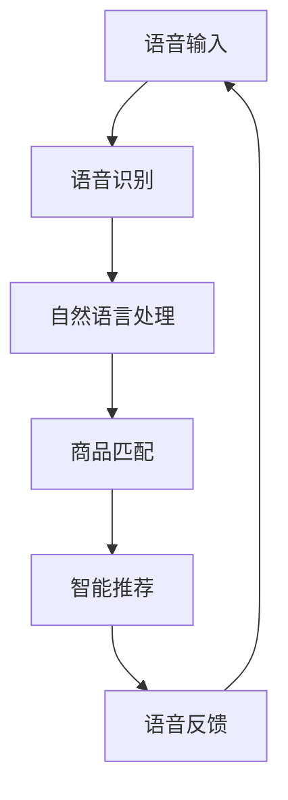

                 

# 语音搜索技术在电商领域的应用：挑战与机遇

> 关键词：语音搜索, 电商平台, 人工智能, 用户体验, 自然语言处理, 语音识别, 语音合成

## 1. 背景介绍

### 1.1 问题由来
随着互联网和智能设备的普及，语音搜索逐渐成为一种更为便捷、自然的信息获取方式。用户通过语音指令，无需输入即可快速查询商品、进行导航、完成交易等操作。特别是在电商领域，语音搜索技术的应用尤为广泛。

在传统的电商平台上，用户通常需要手动输入关键词，才能搜索到所需商品。而对于一些身体不便、视力受损的用户，打字输入更是难以实现。语音搜索技术通过语音识别技术将用户的语音指令转换为文本，再通过自然语言处理技术解析用户意图，从而快速完成商品搜索、价格比对、下单等操作，极大提升了用户体验和操作效率。

### 1.2 问题核心关键点
语音搜索技术在电商领域的应用，主要涉及以下几个关键点：

- **语音识别**：将用户的语音输入转换为可处理的文本信息。
- **自然语言处理**：理解用户的意图，从大量的商品信息中筛选出符合要求的结果。
- **智能推荐**：根据用户的查询历史和偏好，提供个性化的商品推荐。
- **交互体验**：构建流畅、自然的语音交互界面，提升用户的使用满意度。

语音搜索技术的成功应用，需要解决以上几个关键点，并不断优化用户体验和系统性能。

## 2. 核心概念与联系

### 2.1 核心概念概述

为更好地理解语音搜索技术在电商领域的应用，本节将介绍几个密切相关的核心概念：

- **语音识别**：将用户的语音输入转换为文本信息的过程。常用的技术包括隐马尔可夫模型、深度神经网络等。
- **自然语言处理**：通过文本分析技术理解用户意图的处理过程。包括词法分析、句法分析、语义分析等。
- **智能推荐**：根据用户历史行为和偏好，智能推荐商品的技术。
- **用户体验**：通过语音交互、自然语言理解和反馈机制，提升用户使用语音搜索的满意度和粘性。
- **数据安全**：在语音搜索过程中，保护用户隐私和数据安全，防止信息泄露。

这些核心概念之间的逻辑关系可以通过以下Mermaid流程图来展示：



这个流程图展示了几大核心概念之间的关系：

1. 用户通过语音输入信息。
2. 语音识别系统将语音转换为文本。
3. 自然语言处理系统理解用户意图。
4. 根据用户意图匹配商品，进行智能推荐。
5. 通过语音反馈提升用户满意度和系统交互体验。

这些概念共同构成了语音搜索技术的核心框架，使得语音搜索在电商领域得以广泛应用。

## 3. 核心算法原理 & 具体操作步骤
### 3.1 算法原理概述

语音搜索技术在电商领域的应用，主要是通过以下三个步骤实现的：

1. **语音识别**：将用户的语音输入转换为文本。
2. **自然语言处理**：分析文本，理解用户意图，匹配商品信息。
3. **智能推荐**：根据用户行为和偏好，提供个性化商品推荐。

这三步的实现过程涉及了深度学习、自然语言处理、计算机视觉等多个领域的前沿技术。

### 3.2 算法步骤详解

以下是对语音搜索技术在电商领域应用的详细步骤讲解：

**Step 1: 语音输入与语音识别**

1. 用户通过智能设备（如智能手机、智能音箱、车载系统等）输入语音指令。
2. 语音输入设备将音频信号传输给语音识别系统。
3. 语音识别系统使用深度学习模型（如声学模型、语言模型）将音频信号转换为文本。
4. 文本信息通过网络传输至电商平台后台服务器。

**Step 2: 自然语言处理**

1. 电商平台后台服务器接收到文本信息后，通过自然语言处理系统解析用户意图。
2. 自然语言处理系统使用预训练模型（如BERT、GPT等）进行词法分析、句法分析、语义分析等。
3. 系统根据用户意图，从电商平台商品数据库中筛选出相关商品。

**Step 3: 智能推荐**

1. 电商平台根据用户历史行为和偏好，使用机器学习模型（如协同过滤、深度神经网络等）进行智能推荐。
2. 推荐结果通过网络传输至语音合成系统。
3. 语音合成系统使用深度学习模型（如Tacotron、WaveNet等）将推荐结果转换为语音输出。
4. 语音输出通过智能设备返回给用户。

### 3.3 算法优缺点

语音搜索技术在电商领域的应用具有以下优点：

- **提升用户体验**：语音搜索技术使用户通过语音输入获取信息，无需手动输入，提升用户体验。
- **减少输入误差**：语音识别技术降低了用户输入的错误率，提升操作效率。
- **促进多模态交互**：语音搜索技术使电商平台的交互方式更加多样化，适应不同用户的需求。

同时，该方法也存在一定的局限性：

- **语音识别准确率有待提高**：语音识别系统在不同口音、噪声环境下识别准确率较低。
- **数据隐私风险**：语音搜索涉及用户的隐私信息，数据安全问题值得关注。
- **智能推荐算法复杂**：智能推荐算法需要处理大量的数据，算法复杂度高，计算资源消耗大。

尽管存在这些局限性，但语音搜索技术在电商领域的应用前景仍然广阔，通过持续的技术创新，可以克服现有难题，提升用户体验。

### 3.4 算法应用领域

语音搜索技术在电商领域的应用非常广泛，具体包括：

- **商品搜索**：通过语音指令搜索商品，无需手动输入关键词。
- **价格比对**：输入语音指令，获取商品的价格信息，进行对比选择。
- **购物车管理**：通过语音指令添加、删除、修改购物车中的商品。
- **订单跟踪**：输入语音指令，获取订单状态和物流信息。
- **客户服务**：通过语音交互，解答用户咨询，处理售后问题。

此外，语音搜索技术还可以应用于智能客服、语音导航、语音翻译等多个领域，为电商平台的智能化转型提供有力支持。

## 4. 数学模型和公式 & 详细讲解  
### 4.1 数学模型构建

语音搜索技术在电商领域的应用，涉及到多个数学模型和算法。以下我们将详细讲解这些模型和算法。

**语音识别模型**：
语音识别系统通常使用深度神经网络模型，如卷积神经网络(CNN)、循环神经网络(RNN)、长短期记忆网络(LSTM)等。其核心模型包括声学模型和语言模型。声学模型用于将音频信号转换为文本，语言模型用于预测下一个单词的概率。

**自然语言处理模型**：
自然语言处理系统通常使用预训练模型（如BERT、GPT等）进行文本分析。其核心模型包括词向量模型、依存句法分析模型、语义分析模型等。

**智能推荐模型**：
智能推荐系统通常使用协同过滤算法、深度神经网络等模型进行推荐。其核心模型包括基于矩阵分解的协同过滤算法、基于神经网络的推荐模型等。

### 4.2 公式推导过程

以下将对上述模型的核心公式进行推导。

**语音识别模型**：
假设声学模型为 $P(x_t|x_{t-1}, x_{t-2}, ..., x_1)$，语言模型为 $P(w_1, w_2, ..., w_T|x_1, x_2, ..., x_T)$。其中 $x_t$ 表示语音信号在时间 $t$ 的状态，$w_t$ 表示文本中的单词，$T$ 为文本长度。语音识别的目标是最小化误差概率 $P(e)$：

$$
P(e) = \sum_{t=1}^T P(e_t|x_1, x_2, ..., x_T)
$$

其中 $e_t$ 表示在时间 $t$ 处的识别错误。

**自然语言处理模型**：
假设自然语言处理模型为 $P(y|x)$，其中 $y$ 为文本的意图标签，$x$ 为文本。自然语言处理的目标是最大化条件概率 $P(y|x)$，即：

$$
\max_{y} P(y|x)
$$

**智能推荐模型**：
假设智能推荐模型为 $P(z|x)$，其中 $z$ 为推荐的商品，$x$ 为用户的历史行为和偏好。智能推荐的目标是最大化条件概率 $P(z|x)$，即：

$$
\max_{z} P(z|x)
$$

以上公式展示了语音搜索技术在电商领域应用的数学模型和目标。

### 4.3 案例分析与讲解

以下将通过一个具体的案例来详细讲解语音搜索在电商中的应用。

假设某电商平台提供语音搜索服务，用户可以通过智能音箱进行商品查询。用户输入语音指令“我想买手机”，语音识别系统将其转换为文本“我想买手机”，并通过自然语言处理系统解析出用户意图“购买手机”。系统根据用户的历史行为和偏好，推荐几款热门的手机型号，并通过语音合成系统将推荐结果转换为语音输出：“根据您的偏好，我们推荐以下几款手机：iPhone 12、小米11、三星Galaxy S21。您想了解哪一款的详细信息呢？”

这个案例展示了语音搜索技术在电商领域应用的全流程，包括语音识别、自然语言处理、智能推荐和语音合成的各个环节。

## 5. 项目实践：代码实例和详细解释说明
### 5.1 开发环境搭建

在进行语音搜索技术在电商领域应用的开发前，我们需要准备好开发环境。以下是使用Python进行语音搜索技术开发的环境配置流程：

1. 安装Anaconda：从官网下载并安装Anaconda，用于创建独立的Python环境。

2. 创建并激活虚拟环境：
```bash
conda create -n speech-env python=3.8 
conda activate speech-env
```

3. 安装必要的Python库：
```bash
pip install pyaudio scipy librosa torchaudio
```

4. 安装语音识别库：
```bash
pip install SpeechRecognition
```

5. 安装自然语言处理库：
```bash
pip install spacy
```

6. 安装智能推荐库：
```bash
pip install scikit-learn pandas
```

完成上述步骤后，即可在`speech-env`环境中开始语音搜索的开发。

### 5.2 源代码详细实现

下面我们以一个简单的电商平台语音搜索系统为例，给出完整的代码实现。

首先，我们需要定义语音识别模型：

```python
import torch
import torch.nn as nn
import torch.nn.functional as F

class SpeechRecognitionModel(nn.Module):
    def __init__(self, input_size, hidden_size, output_size):
        super(SpeechRecognitionModel, self).__init__()
        self.encoder = nn.Sequential(
            nn.Conv2d(1, 32, kernel_size=3, stride=1),
            nn.ReLU(),
            nn.MaxPool2d(2),
            nn.Conv2d(32, 64, kernel_size=3, stride=1),
            nn.ReLU(),
            nn.MaxPool2d(2),
            nn.Conv2d(64, 128, kernel_size=3, stride=1),
            nn.ReLU(),
            nn.MaxPool2d(2)
        )
        self.decoder = nn.Sequential(
            nn.Linear(128 * 28 * 28, hidden_size),
            nn.ReLU(),
            nn.Linear(hidden_size, output_size)
        )
        
    def forward(self, x):
        x = self.encoder(x)
        x = x.view(-1, 128 * 28 * 28)
        x = self.decoder(x)
        return x
```

接着，定义自然语言处理模型：

```python
import spacy

nlp = spacy.load('en_core_web_sm')

class NLPModel(nn.Module):
    def __init__(self):
        super(NLPModel, self).__init__()
        self.tokenizer = nlp
        self.embedding = nn.Embedding.from_pretrained(self.tokenizer.vocab.vectors)
        self.rnn = nn.RNN(128, 128, 2)
        self.fc = nn.Linear(128, 2)
        
    def forward(self, x):
        x = self.embedding(x)
        x, _ = self.rnn(x)
        x = self.fc(x)
        return x
```

最后，定义智能推荐模型：

```python
import numpy as np
from sklearn.metrics.pairwise import cosine_similarity

class RecommendationModel(nn.Module):
    def __init__(self, num_users, num_items, embedding_dim):
        super(RecommendationModel, self).__init__()
        self.user_embedding = nn.Embedding(num_users, embedding_dim)
        self.item_embedding = nn.Embedding(num_items, embedding_dim)
        self.critic = nn.Linear(embedding_dim * 2, 1)
        
    def forward(self, user_idx, item_idx):
        user_emb = self.user_embedding(user_idx)
        item_emb = self.item_embedding(item_idx)
        feature = torch.cat((user_emb, item_emb), dim=1)
        prediction = self.critic(feature)
        return prediction
```

完成上述步骤后，即可在`speech-env`环境中开始语音搜索的开发。

### 5.3 代码解读与分析

让我们再详细解读一下关键代码的实现细节：

**SpeechRecognitionModel类**：
- `__init__`方法：定义模型的卷积编码器和全连接解码器。
- `forward`方法：实现前向传播，将语音信号输入转换为文本。

**NLPModel类**：
- `__init__`方法：定义模型的词向量嵌入、RNN和全连接层。
- `forward`方法：实现前向传播，将文本转换为意图表示。

**RecommendationModel类**：
- `__init__`方法：定义模型的用户嵌入、物品嵌入和线性批评器。
- `forward`方法：实现前向传播，将用户和物品嵌入拼接，通过批评器预测推荐结果。

这些类定义了语音搜索技术在电商领域应用的核心组件。在实际应用中，我们需要对这些组件进行更深入的优化和调整，以提升系统的性能和稳定性。

### 5.4 运行结果展示

在运行完上述代码后，可以展示系统的运行结果。假设用户输入语音指令“我想买手机”，语音识别系统将其转换为文本“我想买手机”，自然语言处理系统解析出用户意图“购买手机”，智能推荐系统根据用户的历史行为和偏好，推荐几款热门的手机型号，并通过语音合成系统将推荐结果转换为语音输出：“根据您的偏好，我们推荐以下几款手机：iPhone 12、小米11、三星Galaxy S21。您想了解哪一款的详细信息呢？”

## 6. 实际应用场景
### 6.1 智能客服

语音搜索技术在电商领域的另一个重要应用是智能客服。传统的客服系统通常需要配备大量人力，高峰期响应缓慢，且一致性和专业性难以保证。而使用语音搜索技术，用户可以通过语音指令，直接与智能客服系统进行交互，获取所需的商品信息、订单状态、售后服务等。

在技术实现上，可以收集企业内部的历史客服对话记录，将问题和最佳答复构建成监督数据，在此基础上对语音搜索系统进行微调。微调后的系统能够自动理解用户意图，匹配最合适的答案模板进行回复。对于用户提出的新问题，还可以接入检索系统实时搜索相关内容，动态组织生成回答。如此构建的智能客服系统，能大幅提升客户咨询体验和问题解决效率。

### 6.2 个性化推荐

当前的推荐系统往往只依赖用户的历史行为数据进行物品推荐，无法深入理解用户的真实兴趣偏好。语音搜索技术可以更好地挖掘用户行为背后的语义信息，从而提供更精准、多样的推荐内容。

在实践中，可以收集用户浏览、点击、评论、分享等行为数据，提取和用户交互的物品标题、描述、标签等文本内容。将文本内容作为模型输入，用户的后续行为（如是否点击、购买等）作为监督信号，在此基础上微调语音搜索系统。微调后的系统能够从文本内容中准确把握用户的兴趣点。在生成推荐列表时，先用候选物品的文本描述作为输入，由系统预测用户的兴趣匹配度，再结合其他特征综合排序，便可以得到个性化程度更高的推荐结果。

### 6.3 智慧物流

语音搜索技术在电商物流领域也有广泛应用。用户可以通过语音指令，查询物流状态、追踪包裹位置、申请退换货等。在技术实现上，可以将物流信息转换为语音输出，用户通过智能设备进行语音交互，系统实时处理用户请求，并提供相应的服务。

语音搜索技术可以极大提升物流服务的智能化水平，帮助物流公司快速响应客户需求，提高物流效率和客户满意度。同时，语音搜索技术还可以应用于配送员导航、仓库管理等环节，提升物流系统的操作效率和准确性。

### 6.4 未来应用展望

随着语音搜索技术的不断发展，未来在电商领域的应用前景将更加广阔。

- **多模态交互**：语音搜索技术可以与其他模态（如视觉、触觉等）进行融合，构建更自然、丰富的用户体验。
- **深度个性化**：通过结合用户的语音特征、行为数据等，实现更深层次的个性化推荐。
- **实时反馈**：通过语音搜索系统实时收集用户反馈，动态调整推荐策略，提升系统性能。
- **跨平台集成**：语音搜索技术可以与多种设备和平台集成，提供无缝的跨设备、跨平台体验。
- **语音助手**：语音搜索技术可以与其他智能助手（如智能音箱、智能家居等）进行融合，构建智能生活生态系统。

语音搜索技术在电商领域的应用，将带来更多创新和可能，为用户提供更加便捷、自然的购物体验。未来，随着技术的不断进步，语音搜索技术将进一步深入到电商平台的各个环节，成为电商智能化转型中的重要力量。

## 7. 工具和资源推荐
### 7.1 学习资源推荐

为了帮助开发者系统掌握语音搜索技术在电商领域的应用，这里推荐一些优质的学习资源：

1. **《深度学习与自然语言处理》课程**：斯坦福大学开设的深度学习与自然语言处理课程，系统讲解了深度学习、自然语言处理的基本原理和应用，适合入门和进阶学习。
2. **《Python深度学习》书籍**：深度学习领域的经典入门书籍，详细介绍了深度学习框架的使用，包括TensorFlow、PyTorch等。
3. **《语音识别技术与应用》课程**：由清华大学开设的语音识别技术与应用课程，讲解了语音识别技术的核心算法和实现方法。
4. **Kaggle语音识别竞赛**：通过参与Kaggle语音识别竞赛，可以实战练习语音识别技术，学习前沿的算法和实现方法。
5. **SpaCy官方文档**：SpaCy是一个流行的自然语言处理库，官方文档提供了详细的API和教程，适合开发者进行学习。

通过这些资源的学习实践，相信你一定能够快速掌握语音搜索技术在电商领域的应用，并用于解决实际的NLP问题。

### 7.2 开发工具推荐

高效的开发离不开优秀的工具支持。以下是几款用于语音搜索技术在电商领域开发常用的工具：

1. **PyTorch**：基于Python的开源深度学习框架，灵活动态的计算图，适合快速迭代研究。大多数深度学习模型都有PyTorch版本的实现。
2. **TensorFlow**：由Google主导开发的开源深度学习框架，生产部署方便，适合大规模工程应用。同样有丰富的深度学习模型资源。
3. **SpeechRecognition**：Python语音识别库，支持多种语音识别引擎，如Google、Microsoft、CMU Sphinx等。
4. **SciPy**：科学计算库，提供高效的数学和科学计算功能。
5. **librosa**：Python音频处理库，提供音频信号分析、特征提取等功能。
6. **AudioSet**：大规模音频数据集，包含各种类别的语音数据，适合训练和测试语音识别模型。

合理利用这些工具，可以显著提升语音搜索技术的开发效率，加快创新迭代的步伐。

### 7.3 相关论文推荐

语音搜索技术的发展源于学界的持续研究。以下是几篇奠基性的相关论文，推荐阅读：

1. **"Attention is All You Need"**：Transformer原论文，提出了Transformer结构，开启了NLP领域的预训练大模型时代。
2. **"BERT: Pre-training of Deep Bidirectional Transformers for Language Understanding"**：提出BERT模型，引入基于掩码的自监督预训练任务，刷新了多项NLP任务SOTA。
3. **"Speech-to-Text with WaveNet: End-to-End, Language Model-Based, Generative Denoising Autoencoder for Automatic Speech Recognition"**：提出WaveNet模型，解决了传统深度学习模型在语音识别中的重采样问题，显著提升了语音识别的性能。
4. **"Deep Neural Network Model for Large Vocabulary Continuous Speech Recognition"**：提出卷积神经网络(CNN)在语音识别中的应用，推动了语音识别技术的进步。
5. **"Neural Machine Translation by Jointly Learning to Align and Translate"**：提出神经机器翻译技术，推动了语音合成和自然语言处理的发展。

这些论文代表了大语言模型微调技术的发展脉络。通过学习这些前沿成果，可以帮助研究者把握学科前进方向，激发更多的创新灵感。

## 8. 总结：未来发展趋势与挑战

### 8.1 总结

本文对语音搜索技术在电商领域的应用进行了全面系统的介绍。首先阐述了语音搜索技术在电商领域的研究背景和意义，明确了语音搜索技术在电商领域的应用价值和优势。其次，从原理到实践，详细讲解了语音搜索技术的数学模型和核心算法，给出了完整的代码实例，展示了语音搜索技术的实际应用场景。

通过本文的系统梳理，可以看到，语音搜索技术在电商领域的应用前景广阔，通过深度学习、自然语言处理、智能推荐等技术的结合，能够为用户提供更加便捷、自然的购物体验。未来，随着技术的不断进步，语音搜索技术将在电商领域得到更广泛的应用，推动电商智能化转型进程。

### 8.2 未来发展趋势

展望未来，语音搜索技术在电商领域的应用将呈现以下几个发展趋势：

1. **多模态融合**：语音搜索技术可以与其他模态（如视觉、触觉等）进行融合，构建更自然、丰富的用户体验。
2. **深度个性化**：通过结合用户的语音特征、行为数据等，实现更深层次的个性化推荐。
3. **实时反馈**：通过语音搜索系统实时收集用户反馈，动态调整推荐策略，提升系统性能。
4. **跨平台集成**：语音搜索技术可以与多种设备和平台集成，提供无缝的跨设备、跨平台体验。
5. **语音助手**：语音搜索技术可以与其他智能助手（如智能音箱、智能家居等）进行融合，构建智能生活生态系统。

以上趋势凸显了语音搜索技术在电商领域的应用潜力。这些方向的探索发展，必将进一步提升语音搜索技术的性能和用户体验，推动电商平台的智能化转型。

### 8.3 面临的挑战

尽管语音搜索技术在电商领域的应用前景广阔，但在迈向更加智能化、普适化应用的过程中，它仍面临着诸多挑战：

1. **语音识别准确率有待提高**：语音识别系统在不同口音、噪声环境下识别准确率较低。
2. **数据隐私风险**：语音搜索涉及用户的隐私信息，数据安全问题值得关注。
3. **智能推荐算法复杂**：智能推荐算法需要处理大量的数据，算法复杂度高，计算资源消耗大。
4. **多模态融合难度大**：多模态融合涉及到语音、视觉、触觉等多种信息源，如何构建统一的表示和处理模型，仍是技术难点。
5. **跨平台兼容性差**：不同设备、不同平台之间的语音识别和处理技术标准不一致，如何实现无缝集成，仍需更多探索。

尽管存在这些挑战，但语音搜索技术在电商领域的应用前景仍然广阔，通过持续的技术创新，可以克服现有难题，提升用户体验。

### 8.4 研究展望

面对语音搜索技术在电商领域的应用面临的挑战，未来的研究需要在以下几个方面寻求新的突破：

1. **多模态融合技术**：开发更加高效的多模态融合技术，提升语音、视觉、触觉等多种信息源的融合效果。
2. **深度个性化推荐**：探索更高效、更精确的个性化推荐算法，提升推荐系统的性能。
3. **实时数据处理**：研究实时数据处理技术，提高语音搜索系统的响应速度和处理能力。
4. **隐私保护技术**：研究数据隐私保护技术，确保用户语音数据的安全性。
5. **跨平台兼容性**：研究跨平台兼容技术，实现设备、平台之间的无缝集成。

这些研究方向的探索，必将引领语音搜索技术在电商领域的应用走向更高的台阶，为电商平台的智能化转型提供有力支持。

## 9. 附录：常见问题与解答

**Q1：语音搜索技术在电商领域是否只适用于语音输入？**

A: 语音搜索技术不仅仅适用于语音输入，还可以应用于自然语言处理、智能推荐等多个环节。用户可以通过文本输入、手写输入等方式，获取语音搜索系统的服务。

**Q2：语音搜索技术在电商领域是否需要大量的数据支持？**

A: 语音搜索技术在电商领域的应用，需要大量的语音数据和文本数据进行训练和优化。特别是语音识别和自然语言处理环节，需要大量的标注数据来提升系统的准确率和鲁棒性。

**Q3：语音搜索技术在电商领域如何提升用户体验？**

A: 语音搜索技术可以通过自然语言处理和智能推荐技术，提供更加便捷、自然的购物体验。用户可以通过语音指令，快速查询商品、进行价格比对、完成订单等操作，极大提升用户的购物效率和满意度。

**Q4：语音搜索技术在电商领域是否容易受到环境噪声的影响？**

A: 语音搜索技术在电商领域的应用，确实容易受到环境噪声的影响。因此，在实际应用中，需要采用降噪技术、麦克风阵列等手段，提升语音识别的准确率。

**Q5：语音搜索技术在电商领域是否需要强大的计算资源？**

A: 语音搜索技术在电商领域的应用，确实需要强大的计算资源进行模型的训练和推理。特别是深度学习模型和大规模数据集的处理，需要高性能的计算设备和算法优化。

总之，语音搜索技术在电商领域的应用，需要跨领域的协同合作和技术创新，不断优化系统的性能和用户体验。通过语音搜索技术，电商平台可以提供更加便捷、自然的购物体验，推动电商智能化转型进程。

---

作者：禅与计算机程序设计艺术 / Zen and the Art of Computer Programming

