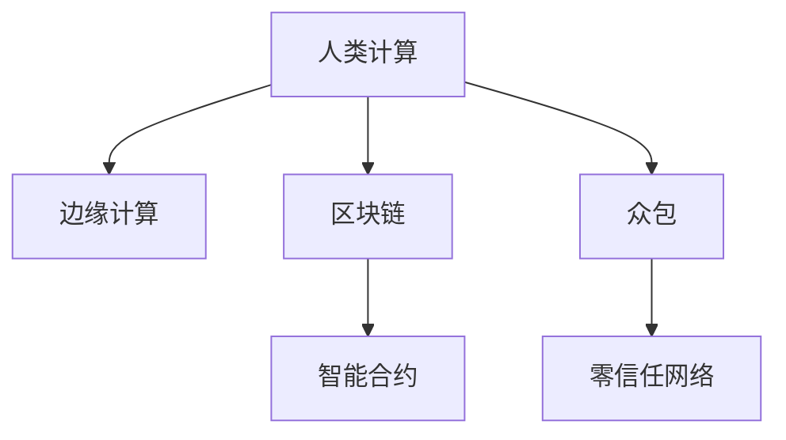

                 

## 1. 背景介绍

### 1.1 问题由来

在当今数字化时代，计算能力的发展已经远远超出了个人电脑和数据中心的范畴。随着边缘计算和物联网设备的普及，越来越多的计算资源被分散到个人设备中，形成一个去中心化的计算网络。这种趋势不仅降低了计算成本，还为个体提供了强大的计算能力，使得个人也能够参与到复杂的计算任务中来。

### 1.2 问题核心关键点

这一变化带来了一个全新的问题：如何在去中心化的计算网络中，有效地整合个人计算资源，以实现更加高效、灵活的计算能力。解决这一问题需要重新思考计算资源的组织和管理方式，以及如何在个体之间实现数据的共享和协作。

### 1.3 问题研究意义

研究人类计算的社会价值，对于构建更加平等、开放、可持续的数字社会具有重要意义：

1. **促进公平分配**：通过利用边缘计算和人类计算，能够将计算资源从少数大型企业分散到更广泛的社会成员中，缩小数字鸿沟。
2. **增强社区协作**：去中心化的计算网络提供了新的协作平台，使得个人和社区能够更容易地共享信息和资源。
3. **推动可持续发展**：边缘计算减少了数据传输距离，降低了能源消耗，对环境保护具有积极作用。
4. **促进创新发展**：分布式计算资源池使得创新不再仅限于大型企业，每个人都可能成为创新的推动者。
5. **保障数据隐私**：在去中心化的计算环境中，数据可以在本地存储和处理，减少了数据泄露的风险。

## 2. 核心概念与联系

### 2.1 核心概念概述

为了更好地理解人类计算的社会价值，本节将介绍几个关键概念及其之间的关系：

- **人类计算(Human Computing)**：指利用人类的智慧和计算资源进行计算任务的范式，特别是在边缘设备和移动设备上的应用。
- **边缘计算(Edge Computing)**：指将数据和计算资源分散到靠近数据源的本地设备上进行处理，以减少延迟和带宽需求。
- **区块链(Blockchain)**：一种分布式账本技术，通过去中心化的方式记录和验证交易数据，保障数据的安全和透明。
- **智能合约(Smart Contracts)**：通过区块链技术，自动执行预设条件的合约条款，增强协作和信任。
- **众包(Crowdsourcing)**：指将计算任务分解为多个子任务，通过在线平台分配给广大的参与者进行解决，以充分利用人类的智慧和计算资源。
- **零信任网络(Zero Trust Network)**：一种基于身份和行为验证的网络安全策略，确保在任何情况下，网络都是安全的。

这些概念之间的逻辑关系可以通过以下Mermaid流程图来展示：



这个流程图展示了人类计算中几个关键概念之间的关系：

1. 人类计算通过利用边缘计算，将计算资源从集中式数据中心分散到本地设备上。
2. 区块链技术提供了去中心化的数据记录和验证机制，增强了数据的安全性和透明性。
3. 智能合约通过自动执行合约条款，降低了协作成本和信任风险。
4. 众包通过在线平台将计算任务分解给大众参与者，充分利用了人类的智慧和计算资源。
5. 零信任网络通过身份和行为验证，保障了网络的安全性。

这些概念共同构成了人类计算的社会价值框架，为构建更加公平、开放、可持续的数字社会提供了技术基础。

## 3. 核心算法原理 & 具体操作步骤
### 3.1 算法原理概述

人类计算的核心算法原理，可以概括为以下几个方面：

- **分布式算法**：通过将计算任务分解为多个子任务，分配给不同的参与者并行处理，以提高计算效率和资源利用率。
- **激励机制**：通过适当的激励措施，鼓励更多的个人参与计算任务，形成良性循环。
- **信任机制**：利用区块链和智能合约等技术，建立参与者之间的信任关系，保障协作和数据安全。
- **数据隐私保护**：在计算过程中，采用加密和匿名化等技术，保护个人数据隐私。

### 3.2 算法步骤详解

基于人类计算的核心算法原理，下面详细介绍其实施步骤：

1. **任务分解**：将复杂的计算任务分解为多个子任务，并定义每个子任务的具体要求和奖励机制。
2. **参与者招募**：通过在线平台招募具有相关技能和兴趣的个人参与者。
3. **任务分配**：根据每个参与者的计算能力和可用时间，动态分配计算任务。
4. **任务执行**：参与者根据任务要求，利用本地设备进行计算，并将结果上传至平台。
5. **任务验证**：通过区块链和智能合约等技术，对计算结果进行验证和审计，确保其正确性和安全性。
6. **激励发放**：根据任务执行情况和质量，发放相应的激励，激励参与者持续参与。

### 3.3 算法优缺点

人类计算在提升计算效率和资源利用率方面具有显著优势，但也存在一些挑战：

**优点**：
1. **资源共享**：充分利用了全球范围内的计算资源，实现了资源的最大化利用。
2. **成本降低**：减少了对集中式数据中心和宽带资源的依赖，降低了计算成本。
3. **灵活性**：个体能够随时加入和退出计算任务，增强了系统的灵活性。
4. **创新推动**：吸引了更多的创新人才参与，推动了新的技术和应用的诞生。

**缺点**：
1. **数据隐私**：由于数据在本地设备上存储和处理，如何保护数据隐私成为一大挑战。
2. **安全风险**：去中心化的计算环境容易受到攻击，需要建立完善的安全机制。
3. **计算质量**：参与者的计算能力参差不齐，如何保证计算结果的准确性和一致性需要进一步研究。
4. **激励机制**：需要设计合理的激励机制，确保参与者的积极性和公平性。

### 3.4 算法应用领域

人类计算技术已经在多个领域得到了广泛应用，例如：

- **科学计算**：利用人类计算进行大型科学计算，如蛋白质折叠、气候模拟等。
- **数据分析**：通过众包平台进行大数据分析，如社交网络情感分析、金融数据挖掘等。
- **软件开发**：通过众包平台进行软件开发和测试，如开源软件贡献、Bug修复等。
- **人工智能**：利用人类计算进行深度学习和机器学习的训练和优化。
- **医疗健康**：通过众包平台进行健康数据的收集和分析，如疾病预测、基因组学研究等。
- **环境保护**：利用人类计算进行环境监测和数据分析，如地球气候变化研究、海洋生态保护等。

## 4. 数学模型和公式 & 详细讲解 & 举例说明
### 4.1 数学模型构建

人类计算的数学模型，可以基于分布式算法和激励机制进行构建。以下是一个简化版的数学模型，用于描述一个简单的众包平台。

假设有一个计算任务 $T$，需要 $N$ 个参与者 $p_1, p_2, \ldots, p_N$ 共同完成。每个参与者的计算能力和收益函数分别为 $C_{i}$ 和 $R_{i}$。平台通过智能合约自动分配任务，并通过区块链记录计算结果和收益。设 $\epsilon$ 为参与者计算误差的上界，$L$ 为任务的最终目标值。

定义：
- $C_i$：第 $i$ 个参与者的计算能力。
- $R_i$：第 $i$ 个参与者的收益函数。
- $\epsilon$：参与者计算误差的上界。
- $L$：任务最终目标值。
- $r_i$：第 $i$ 个参与者从平台获得的收益。
- $s_i$：第 $i$ 个参与者的贡献度，满足 $s_i \propto \frac{1}{\epsilon_i}$，其中 $\epsilon_i$ 为第 $i$ 个参与者的计算误差。
- $W$：平台初始预算。

目标：最大化平台收益，即最大化 $\sum_{i=1}^{N} R_i$。

### 4.2 公式推导过程

基于上述定义，我们可以建立如下优化模型：

$$
\max_{\{C_i, R_i\}} \sum_{i=1}^{N} R_i \\
\text{s.t.} \quad \sum_{i=1}^{N} C_i = L \\
\quad C_i \in [0, C_{\max}]
$$

其中，$C_{\max}$ 为每个参与者的最大计算能力。

通过求解上述优化模型，可以得到最优的计算分配方案和收益分配方案。

### 4.3 案例分析与讲解

以一个简单的众包平台为例，分析人类计算的应用场景。假设平台需要计算 $L=1000$ 个数据的平均值，每个参与者的计算能力为 $C_i \in [0, 10]$，收益函数为 $R_i = 0.1 \times C_i$。设参与者 $p_1$ 的计算误差为 $\epsilon_1 = 0.1$，参与者 $p_2$ 的计算误差为 $\epsilon_2 = 0.2$。

首先，平台根据计算能力分配任务：

$$
C_1 = 0.5 \times 1000 = 500 \\
C_2 = 0.5 \times 1000 = 500
$$

然后，平台根据收益函数计算收益：

$$
R_1 = 0.1 \times 500 = 50 \\
R_2 = 0.1 \times 500 = 50
$$

平台向参与者 $p_1$ 和 $p_2$ 支付收益，并通过智能合约记录计算结果和收益。

## 5. 项目实践：代码实例和详细解释说明
### 5.1 开发环境搭建

在进行人类计算的实践前，我们需要准备好开发环境。以下是使用Python进行Flask开发的环境配置流程：

1. 安装Flask框架：
```bash
pip install flask
```

2. 创建Flask应用：
```python
from flask import Flask, request, jsonify

app = Flask(__name__)

@app.route('/task', methods=['POST'])
def process_task():
    task = request.json['task']
    participants = request.json['participants']
    
    # 对任务进行分解和分配
    result = distribute_task(task, participants)
    
    # 将结果返回给平台
    return jsonify(result)
    
if __name__ == '__main__':
    app.run()
```

3. 编写分布式算法和激励机制的代码：
```python
import random

def distribute_task(task, participants):
    # 将任务分解为多个子任务
    sub_tasks = divide_task(task)
    
    # 根据参与者的计算能力和收益函数，动态分配子任务
    results = []
    for sub_task in sub_tasks:
        best_participant = select_participant(sub_task, participants)
        result = participant_compute(sub_task, best_participant)
        results.append(result)
    
    # 返回计算结果
    return results

def divide_task(task):
    # 将任务分解为多个子任务
    num_sub_tasks = 10
    sub_tasks = []
    for i in range(num_sub_tasks):
        start = i * (task / num_sub_tasks)
        end = (i + 1) * (task / num_sub_tasks)
        sub_tasks.append([start, end])
    return sub_tasks

def select_participant(sub_task, participants):
    # 根据参与者的计算能力和收益函数，动态选择参与者
    best_participant = None
    best_cost = float('inf')
    for participant in participants:
        cost = participant['capacity'] * (sub_task[1] - sub_task[0])
        if cost < best_cost:
            best_cost = cost
            best_participant = participant
    return best_participant

def participant_compute(sub_task, participant):
    # 参与者利用本地设备进行计算
    result = participant['capacity'] * (sub_task[1] - sub_task[0])
    return result
```

完成上述步骤后，即可在本地运行Flask应用，开始接收任务和处理结果。

### 5.2 源代码详细实现

下面我们以一个简单的众包平台为例，给出使用Flask实现人类计算的Python代码实现。

首先，定义任务分解和参与者选择的函数：

```python
import random

def distribute_task(task, participants):
    # 将任务分解为多个子任务
    num_sub_tasks = 10
    sub_tasks = []
    for i in range(num_sub_tasks):
        start = i * (task / num_sub_tasks)
        end = (i + 1) * (task / num_sub_tasks)
        sub_tasks.append([start, end])
    return sub_tasks

def select_participant(sub_task, participants):
    # 根据参与者的计算能力和收益函数，动态选择参与者
    best_participant = None
    best_cost = float('inf')
    for participant in participants:
        cost = participant['capacity'] * (sub_task[1] - sub_task[0])
        if cost < best_cost:
            best_cost = cost
            best_participant = participant
    return best_participant
```

然后，定义计算函数：

```python
def participant_compute(sub_task, participant):
    # 参与者利用本地设备进行计算
    result = participant['capacity'] * (sub_task[1] - sub_task[0])
    return result
```

接着，定义任务处理函数：

```python
from flask import Flask, request, jsonify

app = Flask(__name__)

@app.route('/task', methods=['POST'])
def process_task():
    task = request.json['task']
    participants = request.json['participants']
    
    # 对任务进行分解和分配
    sub_tasks = distribute_task(task, participants)
    
    # 分配任务给参与者
    results = []
    for sub_task in sub_tasks:
        best_participant = select_participant(sub_task, participants)
        result = participant_compute(sub_task, best_participant)
        results.append(result)
    
    # 返回计算结果
    return jsonify(results)
    
if __name__ == '__main__':
    app.run()
```

最后，启动Flask应用，开始接收任务和处理结果：

```bash
python app.py
```

这只是一个简单的代码示例，实际的众包平台可能还需要考虑更多的细节，如参与者身份验证、任务状态更新、收益分配等。

### 5.3 代码解读与分析

让我们再详细解读一下关键代码的实现细节：

**Flask应用**：
- `process_task` 函数：接收任务和参与者信息，调用 `distribute_task` 和 `participant_compute` 函数进行任务分解和计算。
- `app.run()` 函数：启动 Flask 应用，监听 `/task` 路由，接收 POST 请求。

**任务分解函数**：
- `distribute_task` 函数：将大任务分解为多个子任务，并返回一个任务列表。

**参与者选择函数**：
- `select_participant` 函数：根据参与者的计算能力和收益函数，选择最佳参与者，并返回该参与者的信息。

**计算函数**：
- `participant_compute` 函数：参与者利用本地设备进行计算，并返回计算结果。

**任务处理函数**：
- `process_task` 函数：接收任务和参与者信息，调用任务分解和参与者选择函数，最终返回所有计算结果。

可以看到，通过 Flask 和 Python，可以较为简洁地实现一个简单的众包平台，处理计算任务。当然，实际的开发还需要考虑更多的细节和优化。

## 6. 实际应用场景
### 6.1 智能电网

人类计算在智能电网中的应用，可以帮助解决能源分布不均的问题，实现能源的高效利用。通过将大量的分布式能源设备和用户终端连接起来，形成一个去中心化的计算网络，可以实现实时能源监测、需求预测和优化控制等功能。

具体而言，可以收集智能电表和传感器数据，利用人类计算对能源需求进行预测和优化，避免能源浪费和系统过载。同时，还可以利用人类计算对能源价格进行动态调整，提高能源系统的经济性。

### 6.2 数字城市

人类计算在数字城市中的应用，可以提升城市管理和服务效率。通过将城市中的传感器、摄像头、交通信号灯等设备连接起来，形成一个去中心化的计算网络，可以实现实时数据分析和决策支持。

具体而言，可以收集交通流量、环境监测数据等，利用人类计算进行数据分析和预测，优化交通信号灯和公共交通系统，减少交通拥堵。同时，还可以利用人类计算进行垃圾分类和资源回收的智能管理，提高城市环境质量。

### 6.3 灾害预测

人类计算在灾害预测中的应用，可以帮助提升灾害预警和应对能力。通过将分布式传感器设备和志愿者终端连接起来，形成一个去中心化的计算网络，可以实现实时数据收集和处理，快速响应自然灾害。

具体而言，可以收集地震、洪水、火灾等灾害数据，利用人类计算进行数据分析和预测，提前预警灾害风险。同时，还可以利用人类计算进行灾害救援和物资调度的智能优化，提高救援效率。

### 6.4 未来应用展望

随着人类计算技术的不断进步，其在更多领域的应用前景将更加广阔。以下是几个未来可能的发展方向：

1. **工业自动化**：利用人类计算进行工业数据分析和优化，提高生产效率和产品质量。
2. **金融科技**：利用人类计算进行金融数据分析和风险预测，提高金融服务的智能水平。
3. **医疗健康**：利用人类计算进行健康数据分析和疾病预测，提高医疗服务的智能化水平。
4. **教育培训**：利用人类计算进行教育数据分析和个性化推荐，提高教育服务的精准性和个性化水平。
5. **环境保护**：利用人类计算进行环境数据分析和预测，提高环境保护的科学性和有效性。

## 7. 工具和资源推荐
### 7.1 学习资源推荐

为了帮助开发者系统掌握人类计算的理论基础和实践技巧，这里推荐一些优质的学习资源：

1. **《人类计算：分布式智能的基础》**：介绍了人类计算的基本概念、技术和应用，是研究人类计算的重要参考书。
2. **Coursera上的“分布式计算”课程**：斯坦福大学提供的分布式计算课程，涵盖分布式算法和系统设计，适合深入学习。
3. **Kaggle上的众包平台开发比赛**：通过实际比赛，学习人类计算平台的设计和优化。
4. **HackerRank上的众包任务**：通过实际任务，练习人类计算平台的应用和优化。
5. **GitHub上的开源项目**：查找和参与人类计算相关开源项目，学习实际应用案例和优化方法。

通过对这些资源的学习实践，相信你一定能够快速掌握人类计算的精髓，并用于解决实际的计算问题。

### 7.2 开发工具推荐

高效的开发离不开优秀的工具支持。以下是几款用于人类计算开发的常用工具：

1. **Flask**：一个轻量级的Python Web框架，适合快速搭建人类计算平台。
2. **Python**：强大的编程语言，具有丰富的库和工具，适合开发人类计算应用。
3. **Kubernetes**：一个开源的容器编排系统，适合部署和管理大规模的分布式应用。
4. **TensorFlow**：一个强大的机器学习框架，适合处理大规模数据分析和优化。
5. **Ethereum**：一个去中心化的区块链平台，适合构建智能合约和信任机制。
6. **IPFS**：一个分布式文件存储系统，适合存储和管理人类计算平台的数据。

合理利用这些工具，可以显著提升人类计算的开发效率，加快创新迭代的步伐。

### 7.3 相关论文推荐

人类计算的研究源于学界的持续研究。以下是几篇奠基性的相关论文，推荐阅读：

1. **《Human Computing: Smart Computing in Smartphones》**：介绍了人类计算在智能手机上的应用。
2. **《Edge Computing: A survey》**：全面介绍了边缘计算的发展历程和应用前景。
3. **《Blockchain: What Blockchain is》**：介绍了区块链的基本概念、技术和应用。
4. **《Smart Contracts: Smart Contracts in the Ethereum Platform》**：介绍了智能合约的基本概念、技术和应用。
5. **《Crowdsourcing for Automation and Innovation》**：探讨了众包在自动化和创新中的应用。
6. **《Zero Trust Architecture》**：介绍了零信任架构的基本概念、技术和应用。

这些论文代表了大语言模型微调技术的发展脉络。通过学习这些前沿成果，可以帮助研究者把握学科前进方向，激发更多的创新灵感。

## 8. 总结：未来发展趋势与挑战
### 8.1 研究成果总结

本文对人类计算的社会价值进行了全面系统的介绍。首先阐述了人类计算的背景和意义，明确了人类计算在提升计算效率、资源利用率和协作能力方面的独特价值。其次，从原理到实践，详细讲解了人类计算的数学模型和算法实现，给出了人类计算任务开发的完整代码实例。同时，本文还广泛探讨了人类计算在智能电网、数字城市、灾害预测等诸多领域的应用前景，展示了人类计算技术的广阔前景。

通过本文的系统梳理，可以看到，人类计算技术正在成为新兴的计算范式，极大地拓展了计算资源的应用边界，催生了更多的落地场景。受益于边缘计算和众包平台的发展，个体能够更灵活地参与到复杂的计算任务中，为数字社会的公平、开放、可持续发展提供了新的技术路径。未来，伴随人类计算技术的不断演进，将进一步推动数字社会的创新和发展。

### 8.2 未来发展趋势

展望未来，人类计算技术将呈现以下几个发展趋势：

1. **去中心化程度提升**：去中心化的计算网络将更加普及，个体和社区的计算能力将得到进一步提升。
2. **计算资源多样化**：除传统计算设备外，传感器、相机、无人机等多样化的设备将进一步融入人类计算网络。
3. **协作和信任机制完善**：区块链和智能合约等技术将进一步成熟，保障协作和信任的安全性。
4. **计算任务智能化**：计算任务将更加智能化和自动化，依赖机器学习和人工智能技术进行任务分解和分配。
5. **计算环境普适性增强**：计算设备将更加普适和灵活，支持更多用户和更多场景。
6. **计算应用多元化**：人类计算技术将进一步拓展到更多行业和领域，推动各行各业的数字化转型。

以上趋势凸显了人类计算技术的广阔前景。这些方向的探索发展，必将进一步提升计算资源的利用效率，推动数字社会的创新和发展。

### 8.3 面临的挑战

尽管人类计算技术已经取得了瞩目成就，但在迈向更加智能化、普适化应用的过程中，它仍面临着诸多挑战：

1. **数据隐私和安全**：如何保护参与者的数据隐私，防止数据泄露和滥用，需要进一步研究。
2. **计算质量保证**：如何保证参与者的计算结果准确性和一致性，需要进一步优化算法和机制。
3. **激励机制设计**：如何设计合理的激励机制，确保参与者的积极性和公平性，需要进一步探索。
4. **技术实现难度**：如何实现高效的分布式计算和协作机制，需要进一步改进技术。
5. **协作成本控制**：如何降低协作成本，提高计算效率和资源利用率，需要进一步优化协作模式。

正视人类计算面临的这些挑战，积极应对并寻求突破，将使人类计算技术走向成熟，为构建更加公平、开放、可持续的数字社会提供新的技术路径。

### 8.4 研究展望

面对人类计算所面临的挑战，未来的研究需要在以下几个方面寻求新的突破：

1. **数据隐私保护**：开发更加安全的数据加密和匿名化技术，保障参与者的数据隐私。
2. **计算结果验证**：引入机器学习和大数据分析技术，对计算结果进行验证和校准，提高结果的准确性和一致性。
3. **激励机制优化**：设计更加公平和高效的激励机制，激发参与者的积极性和创造力。
4. **协作模式创新**：探索更加灵活和高效的协作模式，如基于区块链的去中心化协作、基于AI的任务分配等。
5. **技术平台集成**：将人类计算技术与其他技术平台进行集成，如工业自动化、金融科技、医疗健康等，实现多技术协同创新。

这些研究方向的探索，必将引领人类计算技术迈向更高的台阶，为构建更加公平、开放、可持续的数字社会铺平道路。面向未来，人类计算技术还需要与其他人工智能技术进行更深入的融合，如知识表示、因果推理、强化学习等，多路径协同发力，共同推动人类计算技术的进步。只有勇于创新、敢于突破，才能不断拓展计算资源的边界，让智能技术更好地造福人类社会。

## 9. 附录：常见问题与解答

**Q1：人类计算在实际应用中存在哪些风险？**

A: 人类计算在实际应用中存在以下风险：
1. **数据隐私泄露**：参与者的数据可能被泄露或滥用，需要采取数据加密和匿名化等措施保护数据隐私。
2. **计算结果错误**：参与者的计算能力参差不齐，可能导致计算结果错误，需要引入机器学习和数据分析技术验证结果。
3. **激励机制失效**：参与者的激励机制设计不合理，可能导致参与度下降，需要设计更加公平和高效的激励机制。
4. **协作信任问题**：参与者之间的协作和信任机制不完善，可能导致数据共享和协作效果不佳，需要建立完善的协作和信任机制。

**Q2：人类计算如何在边缘设备上进行部署？**

A: 人类计算在边缘设备上进行部署，需要考虑以下几个方面：
1. **边缘计算平台**：使用Flask、Kubernetes等技术搭建边缘计算平台，支持多种边缘设备的接入和计算任务的管理。
2. **分布式算法**：设计高效的分布式算法，将计算任务分解为多个子任务，并动态分配给不同的参与者。
3. **区块链和智能合约**：利用区块链和智能合约技术，建立参与者之间的信任关系，保障数据安全和协作效果。
4. **数据加密和匿名化**：对参与者的数据进行加密和匿名化处理，保护数据隐私。
5. **分布式存储**：使用IPFS等分布式存储技术，保障数据的安全性和可访问性。

**Q3：如何选择合适的激励机制？**

A: 选择合适的激励机制，需要考虑以下几个因素：
1. **公平性**：激励机制应确保参与者的公平性，避免激励分配不均。
2. **可操作性**：激励机制应易于设计和实施，确保参与者的积极性和响应性。
3. **多样性**：激励机制应多样化，涵盖物质奖励和精神奖励，满足不同参与者的需求。
4. **透明度**：激励机制应透明公开，确保参与者了解激励规则和收益分配过程。

通过选择合适的激励机制，可以激励更多的参与者积极参与计算任务，提高计算效率和资源利用率。

作者：禅与计算机程序设计艺术 / Zen and the Art of Computer Programming

