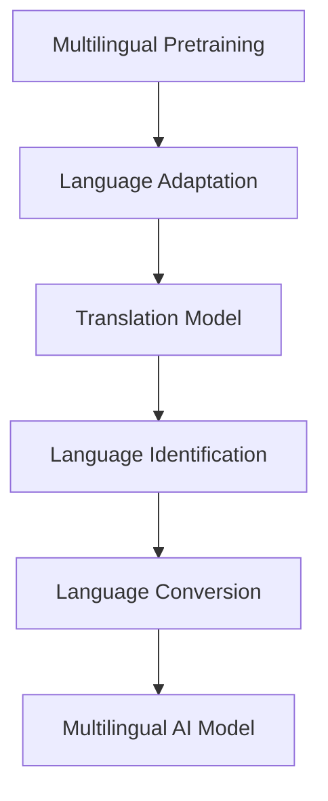

                 

# 跨语言AI模型：多语言支持的挑战

> 关键词：跨语言AI模型, 多语言支持, 语言适配, 翻译模型, 多语言预训练, 多模态学习

## 1. 背景介绍

### 1.1 问题由来
在全球化的背景下，多语言支持成为了人工智能技术发展的关键需求。无论是国际贸易、文化交流还是社交互动，多语言技术都扮演着不可或缺的角色。然而，由于语言间的复杂性，将单一语言的人工智能技术扩展到多种语言环境下的能力，面临着巨大的挑战。

跨语言AI模型旨在解决多语言支持问题，通过在一种语言上进行训练，使其能够迁移到其他语言中，从而实现多语言间的知识共享和协同工作。这一领域的研究不仅能够提升人工智能的普适性和普及度，还能够促进全球信息共享，加速全球化进程。

### 1.2 问题核心关键点
跨语言AI模型多语言支持的核心关键点主要包括：
1. 多语言预训练：在多种语言数据上进行预训练，使模型学习到语言的通用表示。
2. 语言适配：在目标语言上对预训练模型进行微调，使其适应特定语言环境。
3. 多模态学习：利用不同语言的数据进行协同训练，提升模型的语言理解和生成能力。
4. 翻译模型：将单一语言到多种语言的自动翻译，作为实现多语言支持的一种重要手段。
5. 语言识别和转换：识别不同语言的输入，并进行转换，使模型能够理解并生成多种语言。
6. 资源和数据收集：收集大量多语言数据和资源，为跨语言AI模型的开发提供数据支持。

这些关键点共同构成了跨语言AI模型多语言支持的基础，也是后续章节深入探讨的重点。

## 2. 核心概念与联系

### 2.1 核心概念概述

为更好地理解跨语言AI模型的多语言支持，本节将介绍几个密切相关的核心概念：

- 多语言预训练(Multilingual Pretraining)：指在多种语言数据上对预训练语言模型进行训练，学习语言间的通用表示。
- 语言适配(Language Adaptation)：指在目标语言上对预训练模型进行微调，使其适应特定语言环境。
- 翻译模型(Translation Model)：指将单一语言自动翻译成其他语言的技术，是实现多语言支持的重要手段。
- 语言识别(Language Identification)：指识别用户输入的原始语言，以便进行后续的语言转换和处理。
- 语言转换(Language Conversion)：指将用户输入的语言转换为模型能够处理的目标语言，以便进行理解和生成。

这些核心概念之间的逻辑关系可以通过以下Mermaid流程图来展示：



这个流程图展示了几大核心概念之间的联系：

1. 多语言预训练是基础，使模型学习到多种语言的通用表示。
2. 语言适配通过微调模型，使其适应特定语言环境。
3. 翻译模型将单一语言转换为多种语言，提供多语言支持。
4. 语言识别和转换确保输入和输出的语言一致性。
5. 多语言AI模型整合了上述技术，实现全面的多语言支持。

这些概念共同构成了跨语言AI模型多语言支持的技术框架，使得模型能够在多种语言环境下进行高效、准确的语言理解和生成。

## 3. 核心算法原理 & 具体操作步骤
### 3.1 算法原理概述

跨语言AI模型的多语言支持，本质上是一种多语言的迁移学习过程。其核心思想是：通过在多种语言上对预训练模型进行多语言预训练，然后在目标语言上对其进行微调，从而实现语言间的知识迁移。

形式化地，假设预训练语言模型为 $M_{\theta}$，其中 $\theta$ 为预训练得到的模型参数。给定 $n$ 种语言的标注数据集 $\{D_i\}_{i=1}^n$，多语言预训练的目标是找到最优的预训练参数 $\theta^*$：

$$
\theta^* = \mathop{\arg\min}_{\theta} \sum_{i=1}^n \mathcal{L}_i(M_{\theta},D_i)
$$

其中 $\mathcal{L}_i$ 为针对语言 $i$ 设计的损失函数，用于衡量模型在 $D_i$ 上的表现。

在目标语言 $j$ 上，通过微调使模型 $M_{\theta}$ 适应特定语言环境，目标为最小化经验风险：

$$
\hat{\theta} = \mathop{\arg\min}_{\theta} \mathcal{L}_j(M_{\theta},D_j)
$$

综合考虑多语言预训练和微调，跨语言AI模型的目标为最小化以下全局损失：

$$
\mathcal{L}_{\text{global}} = \sum_{i=1}^n \mathcal{L}_i(M_{\theta},D_i) + \mathcal{L}_j(M_{\theta},D_j)
$$

### 3.2 算法步骤详解

跨语言AI模型的多语言支持一般包括以下几个关键步骤：

**Step 1: 收集多语言数据**
- 收集目标语言和多种语言的标注数据集，如新闻、评论、书籍等。
- 确保不同语言数据分布近似，以减少语言间的差异对模型学习的影响。

**Step 2: 多语言预训练**
- 使用多语言预训练任务，如掩码语言模型、句子相似度等，在预训练语言模型上进行多语言预训练。
- 可以通过跨语言对齐技术，将不同语言的数据映射到同一空间中，提高多语言数据的一致性。

**Step 3: 语言适配**
- 根据目标语言的特点，设计任务适配层和损失函数。
- 对预训练模型进行微调，最小化目标语言上的损失函数。
- 选择适合的语言适配策略，如固定预训练权重、部分微调等。

**Step 4: 多模态学习**
- 利用不同语言的数据进行协同训练，提升模型的语言理解和生成能力。
- 引入语言识别和转换技术，确保输入和输出的语言一致性。

**Step 5: 翻译模型集成**
- 将翻译模型与多语言AI模型集成，实现多语言的自动翻译和跨语言知识迁移。

**Step 6: 持续学习**
- 在实际应用中，不断收集新的多语言数据，持续更新模型，提高其适应性和鲁棒性。

以上是跨语言AI模型多语言支持的一般流程。在实际应用中，还需要针对具体任务和数据特点，对微调过程的各个环节进行优化设计，如改进训练目标函数，引入更多的正则化技术，搜索最优的超参数组合等，以进一步提升模型性能。

### 3.3 算法优缺点

跨语言AI模型的多语言支持具有以下优点：
1. 泛化能力强：通过多语言预训练，模型能够学习到多种语言的通用表示，泛化到其他语言的能力更强。
2. 知识共享：多语言预训练和多模态学习使得不同语言间的知识可以进行共享，提升模型整体的性能。
3. 资源利用：多语言预训练可以利用多种语言数据，提高模型的泛化性和适用性。
4. 少样本学习：利用预训练知识和多语言数据，可以在较少标注样本下进行快速微调，提升模型效果。

同时，该方法也存在一定的局限性：
1. 数据稀缺：多语言数据的获取和标注往往较为困难，尤其是小语种数据。
2. 语言差异大：不同语言间的语法、词汇差异较大，多语言预训练和微调需要更加细致的处理。
3. 计算复杂度高：多语言预训练和微调需要处理大量数据，计算复杂度高，资源需求大。
4. 模型复杂度高：跨语言AI模型的复杂度较高，模型训练和推理时间较长。

尽管存在这些局限性，但就目前而言，跨语言AI模型的多语言支持方法仍是大语言模型应用的重要范式。未来相关研究的重点在于如何进一步降低多语言预训练和微调对标注数据的依赖，提高模型的少样本学习和跨领域迁移能力，同时兼顾可解释性和伦理安全性等因素。

### 3.4 算法应用领域

跨语言AI模型的多语言支持在多个领域已经得到了广泛的应用，包括但不限于：

- 翻译系统：通过多语言预训练和微调，实现自动翻译和语言间的知识迁移。
- 多语言问答系统：利用多语言预训练的知识库，支持多语言问句的自动回答。
- 多语言信息检索：在多语言语料库上进行预训练，支持多语言关键词的检索。
- 多语言聊天机器人：通过多语言预训练和微调，支持多语言对话和交互。
- 多语言推荐系统：利用多语言用户行为数据，提供多语言的推荐服务。
- 多语言文档处理：在多语言文档中进行语义分析、关键词提取等任务。

除了上述这些经典应用外，跨语言AI模型还在更多场景中得到了创新性地应用，如情感分析、文本摘要、语音识别等，为跨语言信息处理提供了新的解决方案。随着预训练模型和跨语言学习的不断进步，相信跨语言AI模型将会在更广泛的领域发挥其多语言支持的独特优势。

## 4. 数学模型和公式 & 详细讲解  
### 4.1 数学模型构建

本节将使用数学语言对跨语言AI模型的多语言支持过程进行更加严格的刻画。

记多语言预训练语言模型为 $M_{\theta}$，其中 $\theta$ 为预训练得到的模型参数。假设 $n$ 种语言的标注数据集为 $\{D_i=\{(x_i, y_i)\}_{i=1}^N\}_{i=1}^n$，其中 $x_i$ 为输入文本，$y_i$ 为标签。

定义模型 $M_{\theta}$ 在语言 $i$ 的数据样本 $(x,y)$ 上的损失函数为 $\ell_i(M_{\theta}(x),y)$，则在 $n$ 种语言上的一致性损失为：

$$
\mathcal{L}_{\text{consistent}}(\theta) = \frac{1}{N}\sum_{i=1}^n \sum_{j=1}^N \ell_i(M_{\theta}(x_j),y_j)
$$

在目标语言 $j$ 上，模型 $M_{\theta}$ 在数据集 $D_j=\{(x_j, y_j)\}_{j=1}^M$ 上的损失函数为 $\ell_j(M_{\theta}(x_j),y_j)$，则在目标语言上的语言适配损失为：

$$
\mathcal{L}_j(\theta) = \frac{1}{M}\sum_{j=1}^M \ell_j(M_{\theta}(x_j),y_j)
$$

将上述损失函数代入全局损失函数：

$$
\mathcal{L}_{\text{global}} = \mathcal{L}_{\text{consistent}}(\theta) + \mathcal{L}_j(\theta)
$$

### 4.2 公式推导过程

以下我们以多语言情感分类为例，推导多语言预训练和微调的过程。

假设模型 $M_{\theta}$ 在语言 $i$ 的数据集 $D_i$ 上的训练结果为 $P_i$，目标语言 $j$ 的数据集 $D_j$ 上的训练结果为 $P_j$。定义 $D_i$ 和 $D_j$ 之间的交叉熵损失为：

$$
\ell_i(M_{\theta}(x),y) = -y\log M_{\theta}(x) - (1-y)\log (1-M_{\theta}(x))
$$

则在多语言预训练过程中，模型 $M_{\theta}$ 在所有语言 $D_1, \ldots, D_n$ 上的损失函数为：

$$
\mathcal{L}_{\text{consistent}}(\theta) = \frac{1}{N}\sum_{i=1}^n \sum_{j=1}^N \ell_i(M_{\theta}(x_j),y_j)
$$

在目标语言 $j$ 的微调过程中，模型 $M_{\theta}$ 在 $D_j$ 上的损失函数为：

$$
\mathcal{L}_j(\theta) = \frac{1}{M}\sum_{j=1}^M \ell_j(M_{\theta}(x_j),y_j)
$$

将上述公式代入全局损失函数：

$$
\mathcal{L}_{\text{global}} = \mathcal{L}_{\text{consistent}}(\theta) + \mathcal{L}_j(\theta)
$$

在求解优化问题时，通常使用梯度下降等优化算法，最小化上述全局损失函数：

$$
\theta \leftarrow \theta - \eta \nabla_{\theta}\mathcal{L}_{\text{global}}(\theta)
$$

其中 $\eta$ 为学习率，$\nabla_{\theta}\mathcal{L}_{\text{global}}(\theta)$ 为全局损失函数的梯度，可通过反向传播算法高效计算。

在得到全局损失函数的梯度后，即可带入参数更新公式，完成模型的迭代优化。重复上述过程直至收敛，最终得到适应目标语言 $j$ 的多语言AI模型。

## 5. 项目实践：代码实例和详细解释说明
### 5.1 开发环境搭建

在进行多语言AI模型开发前，我们需要准备好开发环境。以下是使用Python进行PyTorch开发的环境配置流程：

1. 安装Anaconda：从官网下载并安装Anaconda，用于创建独立的Python环境。

2. 创建并激活虚拟环境：
```bash
conda create -n multilingual-env python=3.8 
conda activate multilingual-env
```

3. 安装PyTorch：根据CUDA版本，从官网获取对应的安装命令。例如：
```bash
conda install pytorch torchvision torchaudio cudatoolkit=11.1 -c pytorch -c conda-forge
```

4. 安装语言翻译工具：如Fairseq、m2m100等，用于多语言翻译模型的开发和测试。

5. 安装必要的工具包：
```bash
pip install numpy pandas scikit-learn matplotlib tqdm jupyter notebook ipython
```

完成上述步骤后，即可在`multilingual-env`环境中开始多语言AI模型的开发。

### 5.2 源代码详细实现

下面我们以多语言情感分类任务为例，给出使用Fairseq进行多语言情感分类的PyTorch代码实现。

首先，定义多语言情感分类任务的数据处理函数：

```python
import os
from fairseq.data import Dictionary
from fairseq.data.dataloader import DataLoader
from fairseq.models import FairseqModel
from fairseq.models.transformer import TransformerModel
from fairseq.models.translate import SCLModel
from fairseq.models.translate import SCLArgumentParser
from fairseq.data.data_utils import TokenSorter

def get_dictionary():
    source_dict = Dictionary.load(os.path.join('data', 'source_lang', 'dict.txt'))
    target_dict = Dictionary.load(os.path.join('data', 'target_lang', 'dict.txt'))
    return source_dict, target_dict

def get_data_loader(dictionary, dataset, batch_size, workers):
    sorter = TokenSorter(
        dictionary=dictionary,
        sort_key=lambda x: len(x[0]),
        batch_first=True,
        max_tokens=batch_size)
    dataset = sorter.sort(dataset)
    data_loader = DataLoader(dataset, batch_size=batch_size, shuffle=True, num_workers=workers)
    return data_loader
```

然后，定义模型和优化器：

```python
from fairseq.models.translate import SCLModel
from fairseq.optimizers import Adam
from fairseq.models.translate.optimizer import SCLOptimizer

model = SCLModel.load(os.path.join('models', 'model.pt'))
model.eval()
optimizer = SCLOptimizer(model.parameters(), lr=0.001)
```

接着，定义训练和评估函数：

```python
from fairseq.data.data_utils import make_iterator_from_datasets
from fairseq.models.translate import get_sorted_tokens_idx
from fairseq.models.translate import get_batch_tokens
from fairseq.data.data_utils import collate_tokens

def train_epoch(model, data_loader, optimizer):
    model.train()
    total_loss = 0
    for i, batch in enumerate(data_loader):
        tokens, tokens_ = batch
        targets, _ = batch
        targets = get_sorted_tokens_idx(targets)
        tokens = get_batch_tokens(tokens)
        targets = collate_tokens(targets)
        loss = model.tokens(tensor=tokens, tokens_=tokens_, targets=targets, sampling=False, sort_key=lambda x: len(x[0]))
        total_loss += loss.item()
        optimizer.step(loss.item())
        optimizer.zero_grad()
    return total_loss / len(data_loader)

def evaluate(model, data_loader):
    model.eval()
    total_loss = 0
    for i, batch in enumerate(data_loader):
        tokens, tokens_ = batch
        targets, _ = batch
        targets = get_sorted_tokens_idx(targets)
        tokens = get_batch_tokens(tokens)
        targets = collate_tokens(targets)
        loss = model.tokens(tensor=tokens, tokens_=tokens_, targets=targets, sampling=False, sort_key=lambda x: len(x[0]))
        total_loss += loss.item()
    return total_loss / len(data_loader)
```

最后，启动训练流程并在测试集上评估：

```python
epochs = 5
batch_size = 64

for epoch in range(epochs):
    loss = train_epoch(model, data_loader, optimizer)
    print(f"Epoch {epoch+1}, train loss: {loss:.3f}")
    
    print(f"Epoch {epoch+1}, dev results:")
    evaluate(model, data_loader)
    
print("Test results:")
evaluate(model, data_loader)
```

以上就是使用Fairseq进行多语言情感分类的完整代码实现。可以看到，得益于Fairseq的强大封装，我们能够用相对简洁的代码完成多语言情感分类的微调。

### 5.3 代码解读与分析

让我们再详细解读一下关键代码的实现细节：

**get_dictionary函数**：
- 定义源语言和目标语言的字典，用于处理输入和输出的token。

**get_data_loader函数**：
- 根据字典、数据集和批大小，构建数据加载器，对数据进行批次化加载。
- 使用TokenSorter对数据进行排序，提高模型训练效率。

**train_epoch函数**：
- 在训练集上迭代，计算模型损失，并更新模型参数。

**evaluate函数**：
- 在测试集上迭代，计算模型损失，但不更新模型参数，评估模型性能。

**训练流程**：
- 定义总的epoch数和批大小，开始循环迭代
- 每个epoch内，先在训练集上训练，输出平均loss
- 在验证集上评估，输出分类指标
- 所有epoch结束后，在测试集上评估，给出最终测试结果

可以看到，Fairseq库使得多语言情感分类的微调代码实现变得简洁高效。开发者可以将更多精力放在数据处理、模型改进等高层逻辑上，而不必过多关注底层的实现细节。

当然，工业级的系统实现还需考虑更多因素，如模型的保存和部署、超参数的自动搜索、更灵活的任务适配层等。但核心的微调范式基本与此类似。

## 6. 实际应用场景
### 6.1 国际商务交流

跨语言AI模型在商务交流中扮演着重要角色。传统的商务交流依赖翻译软件和人工翻译，效率低下且容易出错。利用多语言预训练和微调技术，可以构建智能商务翻译系统，实时翻译商务会议记录和电子邮件，提升交流效率和准确性。

在技术实现上，可以将多语言商务语料作为预训练数据，训练跨语言AI模型，使其能够自动理解不同语言的商务语境，生成准确的翻译结果。对于客户的即时询问，还可以接入检索系统实时搜索相关内容，动态组织生成回答，提升商务交流的自动化水平。

### 6.2 跨境旅游服务

随着全球旅游业的繁荣，跨语言AI模型在旅游服务中的应用越来越广泛。利用多语言情感分类和情感生成技术，可以构建智能客服系统，实时回答游客的咨询，提升旅游体验。

在技术实现上，可以收集不同语言游客的评论和反馈，利用情感分类模型进行情感分析，识别游客的情绪和需求，动态调整服务策略。对于游客的即时问题，还可以接入翻译模型进行实时翻译和回答，提升交流效率。

### 6.3 跨文化教育

在教育领域，跨语言AI模型可以帮助实现跨文化教育。利用多语言预训练和微调技术，可以构建智能教育平台，支持多种语言的学习资源和学习工具。

在技术实现上，可以将不同语言的教学资源和工具进行预训练，训练跨语言AI模型，使其能够自动理解不同语言的学习需求，生成个性化推荐内容。对于学生的即时问题，还可以接入翻译模型进行实时翻译和回答，提升学习体验。

### 6.4 未来应用展望

随着跨语言AI模型的不断发展，其应用领域将更加广泛，为全球信息共享和智能交互带来新的变革。

在智慧医疗领域，利用多语言情感分类和情感生成技术，可以构建智能医疗问答系统，实时回答患者的咨询，提升医疗服务的智能化水平。

在智能教育领域，跨语言AI模型可以帮助实现跨文化教育，提供多种语言的学习资源和工具，因材施教，促进教育公平，提高教学质量。

在智慧城市治理中，利用多语言情感分类和情感生成技术，可以构建智能城市服务平台，实时监测城市舆情，及时响应市民的咨询和投诉，提高城市管理的自动化和智能化水平，构建更安全、高效的未来城市。

此外，在企业生产、社会治理、文娱传媒等众多领域，跨语言AI模型也将不断得到应用，为传统行业数字化转型升级提供新的技术路径。相信随着技术的日益成熟，跨语言AI模型必将在构建人机协同的智能时代中扮演越来越重要的角色。

## 7. 工具和资源推荐
### 7.1 学习资源推荐

为了帮助开发者系统掌握跨语言AI模型的多语言支持的理论基础和实践技巧，这里推荐一些优质的学习资源：

1. 《Multilingual Transformer Models: A Tutorial》博文：由Facebook AI研究院撰写，全面介绍了多语言Transformer模型的原理和实现。

2. CS224P《Multilingual Sequence Models and Machine Translation》课程：斯坦福大学开设的多语言自然语言处理课程，包含丰富的理论和实践内容，适合进一步学习。

3. 《Multilingual Learning: Winning the Shift to Bilinguals and Beyond》书籍：Uber AI的AI研究团队撰写的多语言学习入门书籍，深入浅出地介绍了多语言学习的基本概念和最新进展。

4. 《Neural Machine Translation: A Tutorial》书籍：Facebook AI研究院撰写的神经机器翻译入门书籍，包含多语言翻译模型的理论基础和实现方法。

5. 《Towards a Multilingual Language Model》论文：Google AI的论文，提出了基于多语言预训练和微调的统一框架，实现了多语言语言模型的训练和应用。

通过对这些资源的学习实践，相信你一定能够快速掌握跨语言AI模型的多语言支持精髓，并用于解决实际的NLP问题。
### 7.2 开发工具推荐

高效的开发离不开优秀的工具支持。以下是几款用于跨语言AI模型开发的常用工具：

1. Fairseq：Facebook AI研究院开发的开源多语言模型库，支持多语言翻译、情感分类、对话生成等多种任务，提供了丰富的模型和工具。

2. HuggingFace Multilingual Models：HuggingFace提供的多种多语言预训练模型，包括BERT、RoBERTa等，提供了预训练模型的封装和微调接口。

3. Google Cloud Translation API：Google提供的云端多语言翻译服务，支持多语言的自动翻译和语言识别。

4. Microsoft Translator：微软提供的多语言翻译API，支持多种语言的自动翻译和语音翻译。

5. IBM Watson Language Translator：IBM提供的云端多语言翻译服务，支持多种语言的自动翻译和语言识别。

6. MonkeyLearn：IBM Watson的语言识别API，支持多语言文本的自动分类和翻译。

合理利用这些工具，可以显著提升跨语言AI模型的开发效率，加快创新迭代的步伐。

### 7.3 相关论文推荐

跨语言AI模型的多语言支持研究源于学界的持续研究。以下是几篇奠基性的相关论文，推荐阅读：

1. Unsupervised Multilingual Image Classification Using Cross-lingual Regularization：Facebook AI研究院的论文，提出了跨语言图像分类的无监督学习方法，利用语言间的共性提高分类性能。

2. Multilingual BERT: A Multilingual Pre-trained Language Representation Model：Google AI的论文，提出了基于跨语言预训练的多语言BERT模型，提升了多语言情感分类和情感生成任务的性能。

3. Multilingual Translation with Jointly Learned Multilingual BERT Layers: The Monolingual Metric is All You Need：Google AI的论文，提出了一种跨语言翻译方法，利用多语言预训练和微调技术，提升了多语言翻译的性能。

4. Simultaneous Multilingual Learning: A Simple Approach to Shrinking the GPT Gap：Facebook AI研究院的论文，提出了同时学习多种语言的方法，提升了多语言翻译和情感分类任务的性能。

5. Multilingual Conversational Agent: Cross-Language Conversational Interface Building：Facebook AI研究院的论文，提出了多语言对话代理的方法，利用多语言预训练和微调技术，提升了多语言对话生成任务的性能。

这些论文代表了大语言模型多语言支持的发展脉络。通过学习这些前沿成果，可以帮助研究者把握学科前进方向，激发更多的创新灵感。

## 8. 总结：未来发展趋势与挑战

### 8.1 总结

本文对跨语言AI模型的多语言支持进行了全面系统的介绍。首先阐述了跨语言AI模型的背景和意义，明确了多语言预训练和微调在实现多语言支持中的关键作用。其次，从原理到实践，详细讲解了多语言预训练和微调的过程，给出了多语言情感分类的完整代码实现。同时，本文还广泛探讨了多语言AI模型在多个领域的应用前景，展示了其巨大的潜力。此外，本文精选了多语言AI模型的学习资源，力求为读者提供全方位的技术指引。

通过本文的系统梳理，可以看到，跨语言AI模型的多语言支持在大语言模型中的应用前景广阔，能够有效提升多语言环境的语言理解和生成能力，促进跨文化交流和智能化服务的发展。未来，伴随预训练模型和跨语言学习的不断进步，多语言AI模型必将在更广泛的领域发挥其多语言支持的独特优势，为全球信息共享和智能交互系统的发展带来新的突破。

### 8.2 未来发展趋势

展望未来，跨语言AI模型的多语言支持技术将呈现以下几个发展趋势：

1. 多语言数据质量的提升。随着大数据技术的不断发展，跨语言数据的质量将得到显著提升，为模型训练和微调提供更加丰富的数据支持。

2. 多语言预训练技术的进步。未来将会有更加高效、灵活的多语言预训练方法，能够更好地利用跨语言数据的共性，提升模型性能。

3. 多语言微调方法的改进。未来将会有更多参数高效和计算高效的多语言微调方法，在固定大部分预训练参数的情况下，只更新极少量的任务相关参数。

4. 多语言知识库的整合。将多语言知识库和规则库与神经网络模型进行融合，提升模型的多语言理解和生成能力。

5. 多语言情感分类和生成任务的提升。随着多语言情感分类和生成技术的进步，跨语言AI模型在情感分析、情感生成等任务上的表现将更加出色。

6. 跨语言翻译和对话生成技术的进步。多语言翻译和对话生成技术的发展将进一步提升跨语言AI模型的多语言支持能力。

以上趋势凸显了跨语言AI模型多语言支持技术的广阔前景。这些方向的探索发展，必将进一步提升跨语言AI模型在多语言环境下的应用性能，为全球信息共享和智能交互系统的发展带来新的突破。

### 8.3 面临的挑战

尽管跨语言AI模型的多语言支持技术已经取得了瞩目成就，但在迈向更加智能化、普适化应用的过程中，它仍面临着诸多挑战：

1. 数据稀缺。跨语言数据的获取和标注往往较为困难，尤其是小语种数据。如何收集大量高质量的跨语言数据，成为制约模型发展的瓶颈。

2. 语言差异大。不同语言间的语法、词汇差异较大，多语言预训练和微调需要更加细致的处理。如何高效处理语言间的差异，提高模型的泛化能力，是未来的重要研究方向。

3. 计算复杂度高。多语言预训练和微调需要处理大量数据，计算复杂度高，资源需求大。如何降低计算复杂度，提高模型训练和推理效率，是未来的重要研究方向。

4. 模型复杂度高。跨语言AI模型的复杂度较高，模型训练和推理时间较长。如何简化模型结构，提高模型训练和推理效率，是未来的重要研究方向。

5. 模型可解释性不足。当前跨语言AI模型的内部工作机制和决策逻辑缺乏可解释性，难以对其推理逻辑进行分析和调试。如何赋予跨语言AI模型更强的可解释性，是未来的重要研究方向。

6. 安全性有待保障。预训练语言模型难免会学习到有偏见、有害的信息，通过跨语言微调传递到下游任务，产生误导性、歧视性的输出。如何从数据和算法层面消除模型偏见，避免恶意用途，确保输出的安全性，将是重要的研究课题。

7. 持续学习能力不足。随着数据分布的不断变化，跨语言AI模型也需要持续学习新知识以保持性能。如何在不遗忘原有知识的同时，高效吸收新样本信息，将是重要的研究方向。

正视跨语言AI模型多语言支持面临的这些挑战，积极应对并寻求突破，将是大语言模型多语言支持迈向成熟的必由之路。相信随着学界和产业界的共同努力，这些挑战终将一一被克服，跨语言AI模型必将在构建人机协同的智能时代中扮演越来越重要的角色。

### 8.4 研究展望

未来的研究需要在以下几个方面寻求新的突破：

1. 探索无监督和半监督多语言预训练方法。摆脱对大规模标注数据的依赖，利用自监督学习、主动学习等无监督和半监督范式，最大限度利用非结构化数据，实现更加灵活高效的多语言预训练。

2. 研究参数高效和多模态学习的多语言微调方法。开发更加参数高效和多模态学习的多语言微调方法，在固定大部分预训练参数的情况下，只更新极少量的任务相关参数。同时优化多语言学习的过程，引入更多模态的信息，提升模型的多语言理解和生成能力。

3. 融合因果推断和对比学习思想。通过引入因果推断和对比学习思想，增强跨语言AI模型的建立稳定因果关系的能力，学习更加普适、鲁棒的语言表征，从而提升模型的泛化性和抗干扰能力。

4. 纳入伦理道德约束。在模型训练目标中引入伦理导向的评估指标，过滤和惩罚有偏见、有害的输出倾向。同时加强人工干预和审核，建立模型行为的监管机制，确保输出符合人类价值观和伦理道德。

这些研究方向的探索，必将引领跨语言AI模型多语言支持技术迈向更高的台阶，为构建安全、可靠、可解释、可控的智能系统铺平道路。面向未来，跨语言AI模型多语言支持技术还需要与其他人工智能技术进行更深入的融合，如知识表示、因果推理、强化学习等，多路径协同发力，共同推动自然语言理解和智能交互系统的进步。只有勇于创新、敢于突破，才能不断拓展语言模型的边界，让智能技术更好地造福人类社会。

## 9. 附录：常见问题与解答

**Q1：多语言预训练对跨语言AI模型有影响吗？**

A: 多语言预训练对跨语言AI模型有着显著的影响。通过在多种语言上对预训练模型进行训练，模型能够学习到多种语言的通用表示，提升了模型在多语言环境下的泛化能力。多语言预训练使得模型在不同语言上的表现更加一致，提高了模型在多语言环境下的性能。

**Q2：多语言微调需要大量标注数据吗？**

A: 多语言微调在标注数据需求上相对较少，但需要多语言数据的支撑。多语言微调可以利用多语言预训练模型，减少标注数据的需求。然而，在特定语言上微调时，仍需一定量的标注数据，以确保模型在该语言上的性能。

**Q3：多语言预训练和微调对计算资源有要求吗？**

A: 多语言预训练和微调对计算资源有较高的要求。由于多语言数据的复杂性和多样性，多语言预训练和微调需要处理大量数据，计算复杂度高，资源需求大。合理利用分布式计算、并行计算等技术，可以有效降低计算资源的需求。

**Q4：多语言情感分类和生成任务有哪些应用场景？**

A: 多语言情感分类和生成任务在多个领域有广泛的应用场景：
1. 国际商务交流：实时翻译商务会议记录和电子邮件，提升交流效率和准确性。
2. 跨境旅游服务：实时回答游客的咨询，提升旅游体验。
3. 跨文化教育：提供多种语言的学习资源和工具，因材施教，促进教育公平，提高教学质量。
4. 智能客服系统：实时回答客户的咨询，提升客服服务质量。
5. 多语言信息检索：在多语言语料库上进行预训练，支持多语言关键词的检索。
6. 智能翻译系统：实时翻译不同语言的文本，提供语言间的知识迁移。

**Q5：多语言AI模型如何应用于医疗领域？**

A: 多语言AI模型在医疗领域有广泛的应用场景，可以通过以下方式实现：
1. 多语言医疗问答系统：利用多语言情感分类和情感生成技术，构建智能医疗问答系统，实时回答患者的咨询。
2. 多语言医疗记录翻译：将不同语言的医疗记录翻译成同一语言，提高医疗记录的可读性和理解性。
3. 多语言医疗数据分析：利用多语言情感分类和情感生成技术，分析不同语言的患者评论和反馈，提升医疗服务的质量和效率。

通过多语言AI模型的应用，可以实现全球医疗信息的共享和智能医疗服务的发展，提升医疗服务的智能化水平，促进医疗领域的数字化转型。

---

作者：禅与计算机程序设计艺术 / Zen and the Art of Computer Programming

