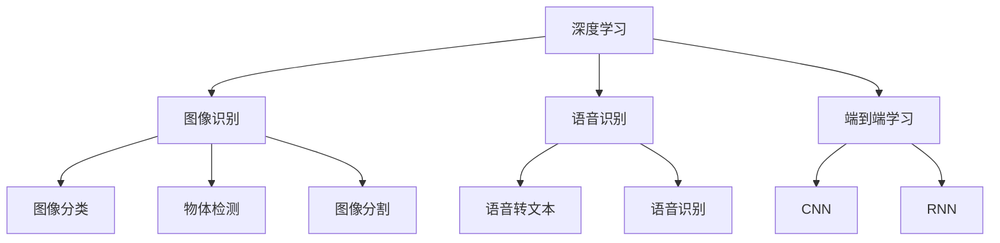

                 

# 软件 2.0 的应用领域：图像识别、语音识别

> 关键词：
- 深度学习, 图像识别, 语音识别, 神经网络, 特征提取, 迁移学习, 自监督学习, 端到端学习, 计算机视觉, 自然语言处理

## 1. 背景介绍

### 1.1 问题由来

软件 2.0 是指以数据为中心、以智能模型为驱动的新一代软件开发范式。在图像识别和语音识别这两个领域，软件 2.0 技术已经展示出强大的应用潜力。图像识别技术通过深度学习算法，能够自动分析和理解图像内容，广泛应用于医疗影像分析、自动驾驶、安防监控等领域。语音识别技术则利用神经网络模型，实现对人类语音的自动化理解和转换，广泛应用于智能助理、语音搜索、语音翻译等场景。

### 1.2 问题核心关键点

图像识别和语音识别之所以能够取得成功，很大程度上得益于深度学习技术和神经网络模型的发展。以下是这两大领域成功背后的几个关键因素：

- **深度学习架构**：卷积神经网络(CNN)和循环神经网络(RNN)等深度学习架构，能够自动提取输入数据中的高层次特征，用于图像分类和语音识别。
- **自监督学习**：利用未标注数据进行预训练，使得模型能够学习到通用的特征表示，提升模型泛化能力。
- **迁移学习**：通过在大规模数据集上预训练模型，然后在特定任务上进行微调，提高模型在特定任务上的表现。
- **端到端学习**：结合不同神经网络模块，实现从输入到输出的端到端学习，提升模型性能。

### 1.3 问题研究意义

研究图像识别和语音识别的软件 2.0 技术，对于推动人工智能技术在实际应用中的落地，具有重要意义：

1. **提高生产效率**：图像识别和语音识别技术可以自动化处理大量繁琐的任务，减少人工工作量，提高生产效率。
2. **提升决策质量**：通过自动化的图像和语音分析，辅助决策者进行更准确的判断，提升决策质量。
3. **拓展应用场景**：软件 2.0 技术能够跨越传统软件开发的界限，将智能化应用拓展到更多的领域和行业。
4. **促进产业升级**：推动传统行业向智能化、自动化转型，提高竞争力和市场份额。
5. **催生新技术**：图像识别和语音识别技术的不断进步，催生了更多前沿技术，如增强现实、智能客服等。

## 2. 核心概念与联系

### 2.1 核心概念概述

- **深度学习(Deep Learning)**：一种基于神经网络的机器学习方法，能够处理大规模数据集，自动提取高层次特征，用于分类、回归、生成等多种任务。
- **图像识别(Computer Vision)**：利用深度学习算法，自动识别和理解图像内容，包括分类、检测、分割等多种任务。
- **语音识别(Automatic Speech Recognition, ASR)**：利用神经网络模型，自动将人类语音转换为文本，广泛应用于智能助理、语音搜索等场景。
- **卷积神经网络(Convolutional Neural Network, CNN)**：一种专门处理图像数据的深度学习架构，通过卷积操作提取局部特征。
- **循环神经网络(Recurrent Neural Network, RNN)**：一种处理序列数据的深度学习架构，能够处理变长输入序列，广泛应用于语音识别、文本生成等任务。
- **迁移学习(Transfer Learning)**：利用在大规模数据集上预训练的模型，然后在特定任务上进行微调，提高模型在特定任务上的表现。

这些核心概念之间的逻辑关系可以通过以下Mermaid流程图来展示：



这个流程图展示了几大核心概念的相互关系：

1. 深度学习是图像识别和语音识别的基础。
2. 卷积神经网络和循环神经网络是深度学习中的主要架构。
3. 图像识别和语音识别分别涉及图像分类、物体检测、图像分割和语音转文本、语音识别等多个子任务。
4. 端到端学习能够结合不同神经网络模块，实现从输入到输出的高效学习。

## 3. 核心算法原理 & 具体操作步骤
### 3.1 算法原理概述

图像识别和语音识别的软件 2.0 技术，本质上是一种基于深度学习的自动特征提取和模式识别方法。其核心思想是通过神经网络模型自动学习输入数据的特征表示，然后在特征空间中寻找特定的模式，用于分类、识别等任务。

以图像分类任务为例，输入是一张图像 $x$，模型通过卷积神经网络提取图像的特征表示 $z$，然后通过分类器 $f$ 对特征表示 $z$ 进行分类，得到图像的类别标签 $y$。整体流程可以表示为：

$$
y = f(z) = \text{Softmax}(W_2 h + b_2) \quad \text{where} \quad h = \mathcal{N}(W_1 x + b_1)
$$

其中 $W_1$ 和 $b_1$ 为卷积层和池化层的参数，$W_2$ 和 $b_2$ 为全连接层的参数，$\mathcal{N}$ 为非线性激活函数，如ReLU。

### 3.2 算法步骤详解

图像识别和语音识别的软件 2.0 技术，一般包括以下几个关键步骤：

**Step 1: 数据准备**
- 收集标注好的图像或语音数据集，划分为训练集、验证集和测试集。
- 对图像数据进行预处理，如调整大小、裁剪、归一化等。
- 对语音数据进行特征提取，如MFCC、Mel Spectrogram等。

**Step 2: 模型构建**
- 选择合适的深度学习架构，如CNN、RNN等，构建图像或语音识别模型。
- 在模型中引入激活函数、池化层、卷积层等组件，用于特征提取和模型抽象。
- 设计损失函数和优化算法，如交叉熵损失、AdamW等，用于模型训练。

**Step 3: 模型训练**
- 使用训练集对模型进行有监督训练，最小化损失函数。
- 周期性在验证集上评估模型性能，避免过拟合。
- 根据评估结果调整模型参数，如学习率、批大小等。

**Step 4: 模型评估与测试**
- 在测试集上评估模型性能，如准确率、召回率、F1-score等。
- 分析模型输出与真实标签之间的差异，找出错误原因。
- 根据评估结果进行必要的调整，如重新训练、微调等。

### 3.3 算法优缺点

图像识别和语音识别的软件 2.0 技术，具有以下优点：
1. 准确率高。深度学习算法能够自动学习特征表示，提升模型在特定任务上的表现。
2. 适用范围广。可以应用于多种图像和语音识别任务，如分类、检测、分割、转文本等。
3. 数据依赖少。自监督学习和迁移学习使得模型能够利用少量标注数据进行训练。
4. 可扩展性强。结合端到端学习和多任务学习，模型可以拓展到更多应用场景。

同时，这些技术也存在一些缺点：
1. 计算资源需求高。深度学习模型参数量大，需要高性能的计算资源进行训练和推理。
2. 模型复杂度高。神经网络结构复杂，难以理解和调试。
3. 数据质量和多样性要求高。模型性能依赖于数据质量和多样性，需要高质量、多样化的数据集。
4. 泛化能力不足。模型在训练集上过拟合，在测试集上泛化能力可能不足。

### 3.4 算法应用领域

图像识别和语音识别技术已经广泛应用于多个领域，以下是一些典型的应用场景：

- **医疗影像分析**：利用图像识别技术对医学影像进行自动分析，如肿瘤检测、病变分析等。
- **自动驾驶**：通过图像识别技术，自动识别道路、车辆、行人等，用于辅助自动驾驶系统。
- **安防监控**：利用图像识别技术，对视频流进行实时监控和异常检测，提高安防效率。
- **智能助理**：结合语音识别和自然语言处理技术，构建智能助理系统，如Siri、Alexa等。
- **语音搜索**：通过语音识别技术，将语音转换为文本，进行搜索和信息检索。
- **语音翻译**：利用语音识别技术将语音转换为文本，再进行翻译，实现多语言交流。

## 4. 数学模型和公式 & 详细讲解 & 举例说明
### 4.1 数学模型构建

这里以图像分类任务为例，详细讲解深度学习模型的一般构建流程。

**输入层**：输入图像 $x$，通常为3通道的RGB图像，尺寸为 $h \times w$。

**卷积层**：通过卷积操作提取图像的局部特征，卷积核大小为 $k \times k$，步长为 $s$，激活函数为 $\mathcal{N}$。

$$
h_1 = \mathcal{N}(W_1 x + b_1) \quad \text{where} \quad W_1 = \{w_{i,j} \in \mathbb{R}^k \} \quad b_1 = \{b_{i,j} \in \mathbb{R} \}
$$

**池化层**：通过池化操作减小特征图尺寸，保留关键特征。

$$
h_2 = \mathcal{N}(W_2 h_1 + b_2) \quad \text{where} \quad W_2 = \{w_{i,j} \in \mathbb{R}^k \} \quad b_2 = \{b_{i,j} \in \mathbb{R} \}
$$

**全连接层**：通过全连接操作将特征图转化为分类器的输入。

$$
h_3 = \mathcal{N}(W_3 h_2 + b_3) \quad \text{where} \quad W_3 = \{w_{i,j} \in \mathbb{R}^m \} \quad b_3 = \{b_{i,j} \in \mathbb{R} \}
$$

**分类器**：通过Softmax函数对分类器的输出进行归一化，得到每个类别的概率分布。

$$
\hat{y} = \text{Softmax}(W_4 h_3 + b_4) \quad \text{where} \quad W_4 = \{w_{i,j} \in \mathbb{R}^c \} \quad b_4 = \{b_{i,j} \in \mathbb{R} \}
$$

### 4.2 公式推导过程

以图像分类任务为例，推导交叉熵损失函数的推导过程。

假设模型在输入图像 $x$ 上的输出为 $\hat{y}$，表示图像属于每个类别的概率分布。真实标签 $y$ 为类别标签的一热编码形式。交叉熵损失函数定义为：

$$
\ell(y, \hat{y}) = -\sum_{i=1}^c y_i \log \hat{y}_i
$$

其中 $c$ 为类别数，$y_i$ 和 $\hat{y}_i$ 分别为第 $i$ 个类别的真实标签和模型预测概率。

在训练过程中，模型需要最小化交叉熵损失函数，因此定义优化目标函数为：

$$
\mathcal{L}(\theta) = \frac{1}{N} \sum_{i=1}^N \ell(y_i, \hat{y}_i)
$$

其中 $N$ 为训练样本数。

### 4.3 案例分析与讲解

以医疗影像分析中的肺部结节检测为例，详细讲解图像识别技术的实际应用。

假设给定一张肺部CT图像 $x$，目标是检测出其中的结节。首先，对图像进行预处理，如归一化和裁剪。然后，通过卷积神经网络提取图像的特征表示 $z$，设计分类器 $f$ 对特征表示 $z$ 进行分类，得到结节存在与否的标签 $y$。

具体来说，可以使用以下代码实现肺部结节检测的图像识别模型：

```python
import torch
import torch.nn as nn
import torch.optim as optim

class Net(nn.Module):
    def __init__(self):
        super(Net, self).__init__()
        self.conv1 = nn.Conv2d(3, 32, 3, 1, 1)
        self.pool = nn.MaxPool2d(2, 2)
        self.conv2 = nn.Conv2d(32, 64, 3, 1, 1)
        self.fc1 = nn.Linear(64 * 14 * 14, 128)
        self.fc2 = nn.Linear(128, 1)
        self.dropout = nn.Dropout(0.2)
        
    def forward(self, x):
        x = self.pool(F.relu(self.conv1(x)))
        x = self.pool(F.relu(self.conv2(x)))
        x = x.view(-1, 64 * 14 * 14)
        x = F.relu(self.fc1(x))
        x = self.dropout(x)
        x = self.fc2(x)
        x = torch.sigmoid(x)
        return x

# 定义损失函数和优化器
criterion = nn.BCELoss()
optimizer = optim.Adam(model.parameters(), lr=0.001)

# 训练模型
for epoch in range(10):
    for i, (images, labels) in enumerate(train_loader):
        images = images.view(-1, 3, 224, 224)
        optimizer.zero_grad()
        outputs = model(images)
        loss = criterion(outputs, labels)
        loss.backward()
        optimizer.step()
```

## 5. 项目实践：代码实例和详细解释说明
### 5.1 开发环境搭建

在进行图像识别和语音识别的软件开发实践前，我们需要准备好开发环境。以下是使用Python进行TensorFlow和Keras开发的环境配置流程：

1. 安装Anaconda：从官网下载并安装Anaconda，用于创建独立的Python环境。

2. 创建并激活虚拟环境：
```bash
conda create -n tf-env python=3.8 
conda activate tf-env
```

3. 安装TensorFlow：根据CUDA版本，从官网获取对应的安装命令。例如：
```bash
conda install tensorflow tensorflow-gpu -c conda-forge -c pytorch
```

4. 安装Keras：
```bash
pip install keras
```

5. 安装各类工具包：
```bash
pip install numpy pandas scikit-learn matplotlib tqdm jupyter notebook ipython
```

完成上述步骤后，即可在`tf-env`环境中开始软件开发实践。

### 5.2 源代码详细实现

这里以Keras中的图像分类为例，给出基于深度学习的图像识别模型实现。

```python
from keras.datasets import cifar10
from keras.models import Sequential
from keras.layers import Dense, Conv2D, MaxPooling2D, Flatten

# 加载数据集
(x_train, y_train), (x_test, y_test) = cifar10.load_data()

# 数据预处理
x_train = x_train / 255.0
x_test = x_test / 255.0

# 定义模型
model = Sequential()
model.add(Conv2D(32, (3, 3), activation='relu', input_shape=(32, 32, 3)))
model.add(MaxPooling2D((2, 2)))
model.add(Conv2D(64, (3, 3), activation='relu'))
model.add(MaxPooling2D((2, 2)))
model.add(Conv2D(64, (3, 3), activation='relu'))
model.add(Flatten())
model.add(Dense(64, activation='relu'))
model.add(Dense(10, activation='softmax'))

# 编译模型
model.compile(optimizer='adam', loss='categorical_crossentropy', metrics=['accuracy'])

# 训练模型
model.fit(x_train, y_train, epochs=10, batch_size=64, validation_data=(x_test, y_test))
```

以上代码实现了一个简单的卷积神经网络模型，用于CIFAR-10数据集上的图像分类任务。可以看到，Keras库通过简单的API调用，便能够构建、编译和训练深度学习模型，大大简化了模型开发的复杂度。

### 5.3 代码解读与分析

让我们再详细解读一下关键代码的实现细节：

**模型定义**：
- `Sequential`类：Keras中用于构建顺序模型的类，通过堆叠层来实现多层的神经网络。
- `Conv2D`层：卷积层，用于提取图像的局部特征。
- `MaxPooling2D`层：池化层，用于减小特征图尺寸，保留关键特征。
- `Dense`层：全连接层，用于将特征图转换为分类器的输入。
- `Softmax`层：分类器，用于输出每个类别的概率分布。

**数据预处理**：
- 对输入数据进行归一化处理，使得像素值在0到1之间。
- 将数据集分为训练集和测试集。

**模型训练**：
- 通过`fit`方法进行模型训练，设置训练轮数、批大小等参数。
- 在每个epoch结束时，评估模型在验证集上的表现，避免过拟合。

**模型评估**：
- 通过`evaluate`方法评估模型在测试集上的表现，输出模型的准确率。

可以看到，Keras库的简洁易用性，使得图像识别模型的开发变得轻松快捷。开发者可以将更多精力放在模型改进和调优上，而不必过多关注底层的实现细节。

当然，工业级的系统实现还需考虑更多因素，如模型裁剪、量化加速、服务化封装等。但核心的模型构建流程基本与此类似。

## 6. 实际应用场景
### 6.1 智能医疗

在智能医疗领域，图像识别技术能够辅助医生进行疾病诊断和治疗。例如，通过图像分类技术对医学影像进行自动分析，检测出病变区域，辅助医生进行疾病诊断。此外，图像分割技术可以自动将病变区域与正常组织分割开，用于治疗规划和手术导航。

**案例分析**：基于深度学习的肺结节检测系统。该系统通过图像分类技术，自动检测出肺部CT影像中的结节，辅助医生进行疾病诊断和治疗。具体实现步骤如下：

1. 收集大量带标注的肺结节CT影像数据集。
2. 对影像数据进行预处理，如归一化和裁剪。
3. 使用卷积神经网络构建影像分类模型，对肺部结节进行检测。
4. 在测试集上评估模型性能，调整模型参数。
5. 将模型部署到临床系统中，辅助医生进行疾病诊断和治疗。

### 6.2 智能安防

在智能安防领域，图像识别技术可以用于视频监控和异常检测。通过实时分析监控视频，自动识别出异常行为，如闯入、火灾等，提高安防效率。

**案例分析**：基于深度学习的安防监控系统。该系统通过图像检测技术，自动识别出监控视频中的异常行为，如闯入、火灾等，提高安防效率。具体实现步骤如下：

1. 收集大量带标注的监控视频数据集。
2. 对视频数据进行预处理，如帧提取和裁剪。
3. 使用卷积神经网络构建行为检测模型，对监控视频进行实时分析。
4. 在测试集上评估模型性能，调整模型参数。
5. 将模型部署到安防监控系统中，实现实时异常检测和告警。

### 6.3 智能助理

在智能助理领域，语音识别技术可以实现自然语言理解和人机交互。通过语音识别技术，将人类语音转换为文本，再进行自然语言处理，实现智能问答和语音控制等功能。

**案例分析**：基于深度学习的智能助理系统。该系统通过语音识别技术，将用户语音转换为文本，再进行自然语言处理，实现智能问答和语音控制等功能。具体实现步骤如下：

1. 收集大量带标注的语音数据集。
2. 对语音数据进行特征提取，如MFCC、Mel Spectrogram等。
3. 使用循环神经网络构建语音识别模型，对语音进行自动转换。
4. 在测试集上评估模型性能，调整模型参数。
5. 将模型部署到智能助理系统中，实现自然语言理解和交互。

## 7. 工具和资源推荐
### 7.1 学习资源推荐

为了帮助开发者系统掌握图像识别和语音识别的软件 2.0技术，这里推荐一些优质的学习资源：

1. **《深度学习》** 书籍：Ian Goodfellow、Yoshua Bengio和Aaron Courville著，深入浅出地介绍了深度学习的基本原理和算法。
2. **《计算机视觉：模型、学习和推理》** 书籍：Simon J.D. Prince著，全面介绍了计算机视觉中的各种模型和算法。
3. **《语音信号处理》** 书籍：Robert C. Larsen著，介绍了语音信号处理中的各种技术和应用。
4. **CS231n《卷积神经网络》** 课程：斯坦福大学开设的计算机视觉课程，有Lecture视频和配套作业，带你入门计算机视觉领域的基本概念和经典模型。
5. **CS224n《自然语言处理》** 课程：斯坦福大学开设的自然语言处理课程，有Lecture视频和配套作业，带你入门NLP领域的基本概念和经典模型。
6. **Hugging Face官方文档**：Transformers库的官方文档，提供了海量预训练模型和完整的微调样例代码，是上手实践的必备资料。

通过对这些资源的学习实践，相信你一定能够快速掌握图像识别和语音识别的软件 2.0技术，并用于解决实际的NLP问题。

### 7.2 开发工具推荐

高效的开发离不开优秀的工具支持。以下是几款用于图像识别和语音识别软件开发常用的工具：

1. **TensorFlow**：由Google主导开发的深度学习框架，适合大规模工程应用。
2. **Keras**：基于TensorFlow的高级API，适合快速原型开发和模型调优。
3. **PyTorch**：由Facebook主导开发的深度学习框架，适合快速迭代研究。
4. **OpenCV**：开源计算机视觉库，提供丰富的图像处理和分析功能。
5. **librosa**：开源音频处理库，提供丰富的音频信号处理和分析功能。
6. **PaddlePaddle**：由百度主导开发的深度学习框架，适合大规模工程应用。

合理利用这些工具，可以显著提升图像识别和语音识别软件的开发效率，加快创新迭代的步伐。

### 7.3 相关论文推荐

图像识别和语音识别的软件 2.0技术已经取得了丰硕的研究成果，以下是几篇奠基性的相关论文，推荐阅读：

1. **ImageNet Large Scale Visual Recognition Challenge**：由Alex Krizhevsky等提出的图像识别基准，推动了深度学习在图像识别领域的快速发展。
2. **AlexNet: One Million Training Examples for Large Scale Image Recognition**：Krizhevsky等提出的图像识别模型，引入了卷积神经网络，取得了当时的最好结果。
3. **Deep Speech 2: End-to-End Speech Recognition in English and Mandarin**：Google团队提出的语音识别模型，基于深度学习实现了端到端的语音转文本。
4. **WaveNet: A Generative Model for Raw Audio**：Google团队提出的语音生成模型，实现了高质量的自然语言语音生成。
5. **Attention is All You Need**：Google团队提出的Transformer模型，引入了自注意力机制，提升了深度学习的模型效率和性能。

这些论文代表了大语言模型微调技术的发展脉络。通过学习这些前沿成果，可以帮助研究者把握学科前进方向，激发更多的创新灵感。

## 8. 总结：未来发展趋势与挑战

### 8.1 总结

本文对图像识别和语音识别的软件 2.0技术进行了全面系统的介绍。首先阐述了这些技术的研究背景和意义，明确了深度学习和大模型在实际应用中的重要作用。其次，从原理到实践，详细讲解了深度学习模型的一般构建流程，给出了模型开发的完整代码实例。同时，本文还广泛探讨了图像识别和语音识别技术在多个领域的应用前景，展示了其广阔的应用潜力。

通过本文的系统梳理，可以看到，深度学习和大模型在图像识别和语音识别领域已经取得了显著的进展，深刻影响了人类社会的各个方面。未来，随着技术的不断进步，这些技术将会在更多领域发挥更大的作用，带来更深远的影响。

### 8.2 未来发展趋势

展望未来，图像识别和语音识别的软件 2.0技术将呈现以下几个发展趋势：

1. **模型规模持续增大**：随着算力成本的下降和数据规模的扩张，深度学习模型的参数量还将持续增长，超大模型将成为新常态。
2. **迁移学习和自监督学习**：利用迁移学习和自监督学习技术，提升模型在特定任务上的性能。
3. **端到端学习**：结合不同神经网络模块，实现从输入到输出的端到端学习，提升模型性能。
4. **数据质量和多样性要求提高**：模型性能依赖于数据质量和多样性，需要高质量、多样化的数据集。
5. **鲁棒性和泛化能力提升**：通过对抗训练、正则化等技术，提升模型的鲁棒性和泛化能力。
6. **计算资源需求降低**：通过模型压缩、量化加速等技术，降低计算资源需求，提高模型部署效率。

### 8.3 面临的挑战

尽管图像识别和语音识别的软件 2.0技术已经取得了丰硕的成果，但在迈向更加智能化、普适化应用的过程中，仍然面临诸多挑战：

1. **标注数据依赖**：高质量标注数据的获取成本高、难度大，限制了深度学习模型的性能。
2. **模型鲁棒性不足**：模型在训练集上过拟合，在测试集上泛化能力不足。
3. **计算资源需求高**：深度学习模型参数量大，需要高性能的计算资源进行训练和推理。
4. **模型可解释性差**：深度学习模型的决策过程难以解释，缺乏可解释性和可审计性。
5. **安全性问题**：深度学习模型容易学习到有害信息和偏见，可能对社会产生负面影响。

### 8.4 研究展望

面向未来，图像识别和语音识别的软件 2.0技术需要在以下几个方向寻求新的突破：

1. **无监督和半监督学习**：摆脱对大规模标注数据的依赖，利用自监督学习、主动学习等无监督和半监督范式，最大限度利用非结构化数据，实现更加灵活高效的模型开发。
2. **参数高效和计算高效**：开发更加参数高效的模型，在固定大部分预训练参数的同时，只更新极少量的任务相关参数。同时优化模型计算图，减少前向传播和反向传播的资源消耗，实现更加轻量级、实时性的部署。
3. **因果分析和博弈论工具**：将因果分析方法引入深度学习模型，识别出模型决策的关键特征，增强输出解释的因果性和逻辑性。借助博弈论工具刻画人机交互过程，主动探索并规避模型的脆弱点，提高系统稳定性。
4. **融合多模态数据**：将视觉、语音等多模态信息与文本信息进行协同建模，提升深度学习模型的泛化能力和应用范围。
5. **引入伦理道德约束**：在模型训练目标中引入伦理导向的评估指标，过滤和惩罚有害的输出倾向，确保模型的输出符合人类价值观和伦理道德。

这些研究方向将推动图像识别和语音识别的软件 2.0技术向更加智能化、普适化应用迈进，为构建安全、可靠、可解释、可控的智能系统铺平道路。

## 9. 附录：常见问题与解答

**Q1：深度学习模型的参数量为什么会这么大？**

A: 深度学习模型通过多层神经网络结构，能够自动学习输入数据的特征表示。模型参数量越大，表示能力越强，可以自动学习更复杂的特征，提升模型性能。然而，参数量大的模型也带来了计算资源和存储空间的需求，需要在实际应用中加以优化。

**Q2：如何提升深度学习模型的鲁棒性和泛化能力？**

A: 可以通过对抗训练、正则化等技术，提升模型的鲁棒性和泛化能力。具体来说，可以在训练过程中加入对抗样本，增强模型的鲁棒性；使用L2正则、Dropout等技术，避免过拟合，提升模型的泛化能力。

**Q3：如何在实际应用中优化深度学习模型的计算资源需求？**

A: 可以通过模型压缩、量化加速等技术，降低计算资源需求，提高模型部署效率。例如，使用模型剪枝技术，去除不必要的层和参数；将浮点模型转为定点模型，压缩存储空间，提高计算效率。

**Q4：如何提高深度学习模型的可解释性和可审计性？**

A: 可以通过引入可解释性模型和可视化工具，增强模型的可解释性和可审计性。例如，使用LIME、SHAP等工具，对模型的决策过程进行可视化分析，帮助理解模型的内部工作机制。

**Q5：如何避免深度学习模型的安全问题？**

A: 可以在模型训练目标中引入伦理导向的评估指标，过滤和惩罚有害的输出倾向，确保模型的输出符合人类价值观和伦理道德。此外，还可以通过人工干预和审核，加强模型的安全性。

总之，图像识别和语音识别的软件 2.0技术在多个领域展示了强大的应用潜力，未来将进一步推动人工智能技术在实际应用中的落地。然而，技术发展的同时，也需要关注其带来的挑战和风险，推动技术向更加智能化、普适化应用迈进。

