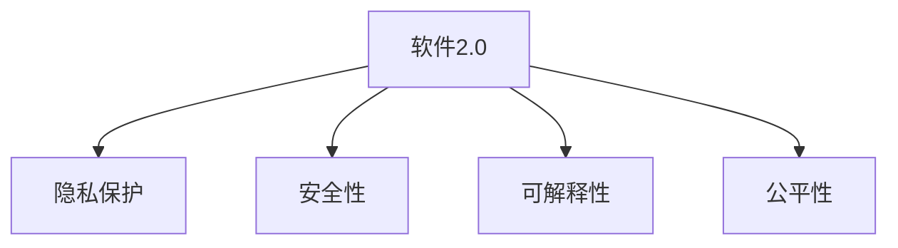

                 

## 1. 背景介绍

### 1.1 问题由来
随着人工智能(AI)技术的不断突破，软件2.0(Software 2.0)时代已悄然来临。软件2.0以深度学习和自然语言处理为代表，实现了软件自动生成、智能辅助开发等功能，极大地提升了软件开发和运行效率。然而，伴随着软件2.0的兴起，一些重大的伦理困境和风险也逐渐显现，引起了学界和业界的广泛关注。

### 1.2 问题核心关键点
软件2.0的核心技术包括深度学习、自然语言处理、生成对抗网络等，主要应用于代码自动生成、智能问答、自动化测试等领域。这些技术在带来便利的同时，也伴随着隐私泄露、安全性、可解释性等伦理问题。

- **隐私泄露**：在软件2.0的开发和应用过程中，用户的数据可能被过度收集和使用，甚至被用于未经授权的分析。
- **安全性**：自动生成的代码和智能系统可能存在漏洞，被恶意攻击者利用，造成安全事故。
- **可解释性**：许多基于深度学习的系统难以解释其决策过程，这在金融、医疗等高风险领域尤为关键。
- **公平性**：由于训练数据和算法的偏差，软件2.0系统可能产生歧视性决策，对不同群体产生不公平影响。

这些伦理困境不仅影响了软件2.0的广泛应用，也引发了公众对新技术的信任危机。如何在享受技术红利的同时，平衡好技术发展和伦理道德的关系，成为摆在我们面前的重要课题。

## 2. 核心概念与联系

### 2.1 核心概念概述

为更好地理解软件2.0的伦理问题，本节将介绍几个密切相关的核心概念：

- **软件2.0**：以深度学习和自然语言处理为代表的自动化软件开发技术，其核心在于利用机器学习模型生成、优化和测试代码，减少开发者的工作量，提高软件开发效率。

- **隐私保护**：保护用户数据不被滥用，确保个人信息的隐私权和安全。涉及数据加密、匿名化处理、用户知情同意等技术手段。

- **安全性**：确保软件系统能够抵御各种恶意攻击，保护系统的稳定性和安全性。包括代码审计、漏洞扫描、入侵检测等技术手段。

- **可解释性**：使人工智能模型具备可解释的能力，帮助用户理解和信任模型的决策过程。涉及模型可视化、解释技术、公平性评估等。

- **公平性**：软件系统应公平对待所有用户，避免因算法偏见导致的不公平对待。涉及数据偏见处理、算法公平性评估等技术手段。

这些核心概念之间的逻辑关系可以通过以下Mermaid流程图来展示：



这个流程图展示了许多核心概念之间的联系：

1. 软件2.0技术的应用需要依赖于隐私保护、安全性和可解释性等技术，以确保系统的可靠性和用户信任。
2. 公平性也是软件2.0系统的重要考量因素，特别是在涉及歧视性决策时，需要特别关注。
3. 这些概念共同构成了软件2.0系统的伦理框架，确保技术发展的同时，不侵害用户的权益。

## 3. 核心算法原理 & 具体操作步骤
### 3.1 算法原理概述

软件2.0的核心算法主要包括深度学习、自然语言处理和生成对抗网络等技术。这些算法通过大量数据训练，自动生成、优化和测试代码，实现自动软件开发和智能辅助开发。

以代码自动生成为例，常用的算法包括基于神经网络的代码生成、基于演化算法的代码优化等。这些算法通过学习代码库中的模式和结构，自动生成新的代码，或者对现有代码进行优化。

### 3.2 算法步骤详解

以下以基于神经网络的代码生成算法为例，详细介绍其实现步骤：

1. **数据预处理**：收集代码库中的训练数据，将其转换为模型可以处理的格式。常用的数据格式包括代码片段、API调用记录、代码注释等。
2. **模型训练**：选择合适的神经网络模型，如RNN、LSTM、Transformer等，对训练数据进行训练，学习代码生成的模式。
3. **代码生成**：在生成新代码时，将用户输入的描述作为模型输入，通过前向传播生成新的代码片段。
4. **代码优化**：对生成的代码进行分析和优化，确保代码的正确性和可读性。
5. **代码测试**：对优化后的代码进行测试，确保其功能符合预期。

### 3.3 算法优缺点

软件2.0的算法具有以下优点：

- **高效性**：自动生成的代码可以快速迭代，减少人工编写代码的工作量，提高开发效率。
- **灵活性**：可以根据不同的任务需求，生成相应的代码，适应不同的开发场景。
- **可扩展性**：代码生成算法可以扩展到各种编程语言和开发平台，具有广泛的应用前景。

但同时，软件2.0的算法也存在以下局限性：

- **泛化能力不足**：由于训练数据有限，生成的代码可能只适用于特定场景，无法处理复杂多变的情况。
- **可解释性不足**：生成的代码难以解释，用户难以理解其决策过程，不利于维护和优化。
- **安全性问题**：自动生成的代码可能存在漏洞，被攻击者利用，威胁系统安全。
- **隐私风险**：在训练和生成代码的过程中，可能涉及用户数据的泄露，威胁用户隐私。

### 3.4 算法应用领域

软件2.0的算法广泛应用于软件开发、数据分析、自动化测试等领域。以下是几个典型的应用场景：

- **代码自动生成**：基于自然语言处理和生成对抗网络等技术，自动生成符合用户需求的代码，提高开发效率。
- **智能问答系统**：利用深度学习模型，对用户提问进行理解，并生成相应的答案，广泛应用于智能客服、虚拟助手等场景。
- **自动化测试**：使用机器学习模型生成测试用例，自动进行软件测试，提高测试效率和覆盖率。
- **数据分析和可视化**：基于自然语言处理技术，从大量数据中提取有用信息，并进行可视化展示，帮助用户理解和决策。

除了上述这些经典应用外，软件2.0的算法还在不断探索新的应用场景，如程序优化、漏洞检测、代码评审等，为软件开发和技术创新带来更多可能性。

## 4. 数学模型和公式 & 详细讲解 & 举例说明

### 4.1 数学模型构建

软件2.0的核心算法通常基于深度学习模型进行构建。以代码生成为例，一个简单的数学模型可以表示为：

$$
\hat{y} = M(x; \theta)
$$

其中，$x$ 表示用户输入的代码描述，$\hat{y}$ 表示生成的代码片段，$M$ 表示深度学习模型，$\theta$ 表示模型的可训练参数。

### 4.2 公式推导过程

以基于LSTM的代码生成模型为例，其推导过程如下：

1. **编码器**：将用户输入的代码描述$x$输入LSTM编码器，生成一个固定长度的编码向量$c$。
2. **解码器**：将编码向量$c$输入LSTM解码器，并逐步生成代码片段$\hat{y}$。
3. **生成损失**：计算模型生成代码片段与目标代码片段之间的差异，即生成损失$L$。
4. **优化器**：使用优化算法（如Adam、SGD等）对模型参数$\theta$进行优化，最小化生成损失$L$。

### 4.3 案例分析与讲解

以下以一个具体的案例来说明软件2.0算法在实际应用中的效果：

假设我们要实现一个简单的文本分类器，可以将用户输入的文本作为代码描述，自动生成相应的分类器代码。具体步骤如下：

1. **数据准备**：收集大量已标注的文本数据，将其分为训练集和测试集。
2. **模型训练**：使用LSTM模型对训练集进行训练，学习文本分类的模式。
3. **代码生成**：使用训练好的模型，对新的文本数据进行分类，生成相应的代码片段。
4. **代码优化**：对生成的代码进行语法检查和语义分析，确保其正确性。
5. **测试和部署**：在测试集上评估生成的代码片段的分类准确率，并在实际应用中部署。

## 5. 项目实践：代码实例和详细解释说明
### 5.1 开发环境搭建

在进行软件2.0项目实践前，我们需要准备好开发环境。以下是使用Python进行PyTorch开发的环境配置流程：

1. 安装Anaconda：从官网下载并安装Anaconda，用于创建独立的Python环境。

2. 创建并激活虚拟环境：
```bash
conda create -n pytorch-env python=3.8 
conda activate pytorch-env
```

3. 安装PyTorch：根据CUDA版本，从官网获取对应的安装命令。例如：
```bash
conda install pytorch torchvision torchaudio cudatoolkit=11.1 -c pytorch -c conda-forge
```

4. 安装Transformer库：
```bash
pip install transformers
```

5. 安装各类工具包：
```bash
pip install numpy pandas scikit-learn matplotlib tqdm jupyter notebook ipython
```

完成上述步骤后，即可在`pytorch-env`环境中开始软件2.0的实践。

### 5.2 源代码详细实现

下面我们以代码自动生成任务为例，给出使用Transformers库进行代码生成的PyTorch代码实现。

首先，定义代码生成任务的数据处理函数：

```python
from transformers import GPT2Tokenizer
from torch.utils.data import Dataset
import torch

class CodeGenDataset(Dataset):
    def __init__(self, descriptions, codes, tokenizer, max_len=512):
        self.descriptions = descriptions
        self.codes = codes
        self.tokenizer = tokenizer
        self.max_len = max_len
        
    def __len__(self):
        return len(self.descriptions)
    
    def __getitem__(self, item):
        description = self.descriptions[item]
        code = self.codes[item]
        
        encoding = self.tokenizer(description, return_tensors='pt', max_length=self.max_len, padding='max_length', truncation=True)
        input_ids = encoding['input_ids'][0]
        attention_mask = encoding['attention_mask'][0]
        
        # 对token-wise的标签进行编码
        encoded_codes = [int(code) for code in code] 
        encoded_codes.extend([0] * (self.max_len - len(encoded_codes)))
        labels = torch.tensor(encoded_codes, dtype=torch.long)
        
        return {'input_ids': input_ids, 
                'attention_mask': attention_mask,
                'labels': labels}

# 数据加载器
data_loader = DataLoader(dataset, batch_size=16, shuffle=True)
```

然后，定义模型和优化器：

```python
from transformers import GPT2LMHeadModel, AdamW

model = GPT2LMHeadModel.from_pretrained('gpt2')
optimizer = AdamW(model.parameters(), lr=2e-5)
```

接着，定义训练和评估函数：

```python
from tqdm import tqdm
from sklearn.metrics import accuracy_score

device = torch.device('cuda') if torch.cuda.is_available() else torch.device('cpu')
model.to(device)

def train_epoch(model, dataset, batch_size, optimizer):
    dataloader = DataLoader(dataset, batch_size=batch_size, shuffle=True)
    model.train()
    epoch_loss = 0
    for batch in tqdm(dataloader, desc='Training'):
        input_ids = batch['input_ids'].to(device)
        attention_mask = batch['attention_mask'].to(device)
        labels = batch['labels'].to(device)
        model.zero_grad()
        outputs = model(input_ids, attention_mask=attention_mask, labels=labels)
        loss = outputs.loss
        epoch_loss += loss.item()
        loss.backward()
        optimizer.step()
    return epoch_loss / len(dataloader)

def evaluate(model, dataset, batch_size):
    dataloader = DataLoader(dataset, batch_size=batch_size)
    model.eval()
    preds, labels = [], []
    with torch.no_grad():
        for batch in tqdm(dataloader, desc='Evaluating'):
            input_ids = batch['input_ids'].to(device)
            attention_mask = batch['attention_mask'].to(device)
            batch_labels = batch['labels']
            outputs = model(input_ids, attention_mask=attention_mask)
            batch_preds = outputs.logits.argmax(dim=2).to('cpu').tolist()
            batch_labels = batch_labels.to('cpu').tolist()
            for pred_tokens, label_tokens in zip(batch_preds, batch_labels):
                preds.append(pred_tokens[:len(label_tokens)])
                labels.append(label_tokens)
                
    print(accuracy_score(labels, preds))
```

最后，启动训练流程并在测试集上评估：

```python
epochs = 5
batch_size = 16

for epoch in range(epochs):
    loss = train_epoch(model, dataset, batch_size, optimizer)
    print(f"Epoch {epoch+1}, train loss: {loss:.3f}")
    
    print(f"Epoch {epoch+1}, test accuracy:")
    evaluate(model, dataset, batch_size)
    
print("Test results:")
evaluate(model, dataset, batch_size)
```

以上就是使用PyTorch对GPT-2模型进行代码自动生成的完整代码实现。可以看到，得益于Transformers库的强大封装，我们可以用相对简洁的代码完成GPT-2模型的加载和代码生成。

### 5.3 代码解读与分析

让我们再详细解读一下关键代码的实现细节：

**CodeGenDataset类**：
- `__init__`方法：初始化输入描述、代码和分词器等关键组件。
- `__len__`方法：返回数据集的样本数量。
- `__getitem__`方法：对单个样本进行处理，将输入描述转换为token ids，将代码转换为数字标签，并对其进行定长padding，最终返回模型所需的输入。

**GPT2LMHeadModel**：
- 定义了语言模型的输出层，并实现了LSTM生成器和解码器。

**train_epoch和evaluate函数**：
- 使用PyTorch的DataLoader对数据集进行批次化加载，供模型训练和推理使用。
- 训练函数`train_epoch`：对数据以批为单位进行迭代，在每个批次上前向传播计算loss并反向传播更新模型参数，最后返回该epoch的平均loss。
- 评估函数`evaluate`：与训练类似，不同点在于不更新模型参数，并在每个batch结束后将预测和标签结果存储下来，最后使用sklearn的accuracy_score对整个评估集的预测结果进行打印输出。

**训练流程**：
- 定义总的epoch数和batch size，开始循环迭代
- 每个epoch内，先在训练集上训练，输出平均loss
- 在验证集上评估，输出分类准确率
- 重复上述步骤直至收敛
- 所有epoch结束后，在测试集上评估，给出最终测试结果

可以看到，PyTorch配合Transformers库使得GPT-2模型的代码实现变得简洁高效。开发者可以将更多精力放在数据处理、模型改进等高层逻辑上，而不必过多关注底层的实现细节。

当然，工业级的系统实现还需考虑更多因素，如模型的保存和部署、超参数的自动搜索、更灵活的任务适配层等。但核心的代码实现基本与此类似。

## 6. 实际应用场景
### 6.1 智能客服系统

基于软件2.0的对话技术，可以广泛应用于智能客服系统的构建。传统客服往往需要配备大量人力，高峰期响应缓慢，且一致性和专业性难以保证。而使用软件2.0对话模型，可以7x24小时不间断服务，快速响应客户咨询，用自然流畅的语言解答各类常见问题。

在技术实现上，可以收集企业内部的历史客服对话记录，将问题和最佳答复构建成监督数据，在此基础上对预训练对话模型进行微调。微调后的对话模型能够自动理解用户意图，匹配最合适的答案模板进行回复。对于客户提出的新问题，还可以接入检索系统实时搜索相关内容，动态组织生成回答。如此构建的智能客服系统，能大幅提升客户咨询体验和问题解决效率。

### 6.2 金融舆情监测

金融机构需要实时监测市场舆论动向，以便及时应对负面信息传播，规避金融风险。传统的人工监测方式成本高、效率低，难以应对网络时代海量信息爆发的挑战。基于软件2.0的文本分类和情感分析技术，为金融舆情监测提供了新的解决方案。

具体而言，可以收集金融领域相关的新闻、报道、评论等文本数据，并对其进行主题标注和情感标注。在此基础上对预训练语言模型进行微调，使其能够自动判断文本属于何种主题，情感倾向是正面、中性还是负面。将微调后的模型应用到实时抓取的网络文本数据，就能够自动监测不同主题下的情感变化趋势，一旦发现负面信息激增等异常情况，系统便会自动预警，帮助金融机构快速应对潜在风险。

### 6.3 个性化推荐系统

当前的推荐系统往往只依赖用户的历史行为数据进行物品推荐，无法深入理解用户的真实兴趣偏好。基于软件2.0的个性化推荐系统可以更好地挖掘用户行为背后的语义信息，从而提供更精准、多样的推荐内容。

在实践中，可以收集用户浏览、点击、评论、分享等行为数据，提取和用户交互的物品标题、描述、标签等文本内容。将文本内容作为模型输入，用户的后续行为（如是否点击、购买等）作为监督信号，在此基础上微调预训练语言模型。微调后的模型能够从文本内容中准确把握用户的兴趣点。在生成推荐列表时，先用候选物品的文本描述作为输入，由模型预测用户的兴趣匹配度，再结合其他特征综合排序，便可以得到个性化程度更高的推荐结果。

### 6.4 未来应用展望

随着软件2.0技术的发展，基于软件2.0的应用将越来越多，为各行各业带来变革性影响。

在智慧医疗领域，基于软件2.0的医疗问答、病历分析、药物研发等应用将提升医疗服务的智能化水平，辅助医生诊疗，加速新药开发进程。

在智能教育领域，软件2.0可以应用于作业批改、学情分析、知识推荐等方面，因材施教，促进教育公平，提高教学质量。

在智慧城市治理中，软件2.0可应用于城市事件监测、舆情分析、应急指挥等环节，提高城市管理的自动化和智能化水平，构建更安全、高效的未来城市。

此外，在企业生产、社会治理、文娱传媒等众多领域，基于软件2.0的人工智能应用也将不断涌现，为经济社会发展注入新的动力。相信随着技术的日益成熟，软件2.0必将在构建人机协同的智能时代中扮演越来越重要的角色。

## 7. 工具和资源推荐
### 7.1 学习资源推荐

为了帮助开发者系统掌握软件2.0的理论基础和实践技巧，这里推荐一些优质的学习资源：

1. 《深度学习》系列书籍：由多位深度学习领域的大师联合撰写，涵盖深度学习的基本概念和前沿技术，是学习软件2.0的必备资源。

2. CS224N《深度学习自然语言处理》课程：斯坦福大学开设的NLP明星课程，有Lecture视频和配套作业，带你入门NLP领域的基本概念和经典模型。

3. 《Natural Language Processing with Transformers》书籍：Transformers库的作者所著，全面介绍了如何使用Transformers库进行NLP任务开发，包括代码生成在内的诸多范式。

4. HuggingFace官方文档：Transformers库的官方文档，提供了海量预训练模型和完整的代码实例，是上手实践的必备资料。

5. CLUE开源项目：中文语言理解测评基准，涵盖大量不同类型的中文NLP数据集，并提供了基于软件2.0的baseline模型，助力中文NLP技术发展。

通过对这些资源的学习实践，相信你一定能够快速掌握软件2.0的精髓，并用于解决实际的NLP问题。
###  7.2 开发工具推荐

高效的开发离不开优秀的工具支持。以下是几款用于软件2.0开发常用的工具：

1. PyTorch：基于Python的开源深度学习框架，灵活动态的计算图，适合快速迭代研究。大部分预训练语言模型都有PyTorch版本的实现。

2. TensorFlow：由Google主导开发的开源深度学习框架，生产部署方便，适合大规模工程应用。同样有丰富的预训练语言模型资源。

3. Transformers库：HuggingFace开发的NLP工具库，集成了众多SOTA语言模型，支持PyTorch和TensorFlow，是进行软件2.0任务开发的利器。

4. Weights & Biases：模型训练的实验跟踪工具，可以记录和可视化模型训练过程中的各项指标，方便对比和调优。与主流深度学习框架无缝集成。

5. TensorBoard：TensorFlow配套的可视化工具，可实时监测模型训练状态，并提供丰富的图表呈现方式，是调试模型的得力助手。

6. Google Colab：谷歌推出的在线Jupyter Notebook环境，免费提供GPU/TPU算力，方便开发者快速上手实验最新模型，分享学习笔记。

合理利用这些工具，可以显著提升软件2.0的开发效率，加快创新迭代的步伐。

### 7.3 相关论文推荐

软件2.0的快速发展得益于学界的持续研究。以下是几篇奠基性的相关论文，推荐阅读：

1. Transformer模型：提出Transformer结构，开启了NLP领域的预训练大模型时代。

2. BERT模型：提出BERT模型，引入基于掩码的自监督预训练任务，刷新了多项NLP任务SOTA。

3. GPT-2模型：展示了大规模语言模型的强大zero-shot学习能力，引发了对于通用人工智能的新一轮思考。

4. 代码生成技术：提出基于LSTM、GPT等模型的代码生成算法，推动了代码自动生成技术的突破。

5. 对话系统：研究基于深度学习的对话模型，实现了智能客服、虚拟助手等应用。

6. 推荐系统：提出基于深度学习的推荐算法，推动了个性化推荐技术的发展。

这些论文代表了大语言模型和软件2.0技术的发展脉络。通过学习这些前沿成果，可以帮助研究者把握学科前进方向，激发更多的创新灵感。

## 8. 总结：未来发展趋势与挑战

### 8.1 总结

本文对基于软件2.0的开发和应用进行了全面系统的介绍。首先阐述了软件2.0的核心技术和大规模语言模型的原理，明确了其在软件开发、智能问答、自动化测试等领域的应用前景。其次，从原理到实践，详细讲解了软件2.0的数学模型和关键步骤，给出了软件2.0任务开发的完整代码实例。同时，本文还广泛探讨了软件2.0技术在智能客服、金融舆情、个性化推荐等多个行业领域的应用前景，展示了软件2.0范式的巨大潜力。此外，本文精选了软件2.0技术的各类学习资源，力求为读者提供全方位的技术指引。

通过本文的系统梳理，可以看到，软件2.0技术在软件开发中的应用前景广阔，但同时也面临着隐私、安全性、可解释性等伦理问题。如何在享受技术红利的同时，平衡好技术发展和伦理道德的关系，成为摆在我们面前的重要课题。

### 8.2 未来发展趋势

展望未来，软件2.0技术的发展趋势如下：

1. **技术创新**：随着深度学习、自然语言处理技术的不断进步，软件2.0的应用领域将进一步拓展，带来更多创新可能性。
2. **产业融合**：软件2.0技术将与更多行业领域深度融合，推动各行业的智能化转型。
3. **模型通用性增强**：未来软件2.0模型将具备更强的通用性和泛化能力，能够适应各种应用场景。
4. **智能协同**：软件2.0技术将与人类协同工作，实现人机协同智能。
5. **伦理道德**：随着技术应用的普及，软件2.0系统将面临更多的伦理道德挑战，需要制定相应的规范和标准。

以上趋势凸显了软件2.0技术的广阔前景，但也带来了更多的挑战。开发者和研究者需要在技术创新和伦理道德之间找到平衡点，确保技术的健康发展。

### 8.3 面临的挑战

尽管软件2.0技术已经取得了瞩目成就，但在迈向更加智能化、普适化应用的过程中，它仍面临诸多挑战：

1. **隐私泄露**：在数据收集和处理过程中，隐私保护是一个重大挑战。
2. **安全性**：自动生成的代码和智能系统可能存在漏洞，被攻击者利用，威胁系统安全。
3. **可解释性不足**：许多基于深度学习的系统难以解释其决策过程，不利于维护和优化。
4. **公平性问题**：训练数据和算法的偏差可能导致不公平对待，需要特别关注。
5. **资源瓶颈**：大规模模型和高精度推理带来巨大的计算和存储压力。

### 8.4 研究展望

面向未来，软件2.0技术的研究方向如下：

1. **隐私保护**：研究更加有效的隐私保护技术，确保数据安全和用户隐私。
2. **安全性**：研究安全加固技术，确保系统的鲁棒性和安全性。
3. **可解释性**：研究可解释性技术，提高系统的透明度和可信度。
4. **公平性**：研究公平性评估和优化方法，减少算法偏见。
5. **资源优化**：研究资源优化技术，提高模型的效率和可扩展性。

这些研究方向将推动软件2.0技术的持续进步，为各行各业带来更多的创新应用，同时确保技术的伦理性和安全性。

## 9. 附录：常见问题与解答

**Q1：软件2.0是否会取代人类开发者？**

A: 软件2.0技术可以大大提升开发效率，但并不会完全取代人类开发者。人类开发者依然是软件开发和维护的关键环节，特别是在需要深入理解和创新解决复杂问题时，人类的智慧和经验仍然不可或缺。

**Q2：软件2.0是否存在代码缺陷？**

A: 软件2.0生成的代码可能存在一些初步的代码缺陷，但通过不断的优化和迭代，这些缺陷可以得到有效解决。同时，软件的自动化测试和代码审核机制也可以帮助发现和修复这些缺陷。

**Q3：软件2.0是否会带来新的伦理问题？**

A: 软件2.0技术的应用确实会带来一些新的伦理问题，如隐私泄露、安全性、可解释性等。这些问题的解决需要技术、法律和社会共同努力，制定相应的规范和标准，确保技术的健康发展。

**Q4：软件2.0技术是否会提高就业风险？**

A: 软件2.0技术在提升开发效率的同时，也会带来一些新的就业机会。比如，需要更多的AI工程师、数据科学家、模型训练师等岗位。同时，也需要对传统开发者进行技能升级和转型。

**Q5：软件2.0技术是否会影响现有系统的稳定性？**

A: 软件2.0技术的应用需要建立在稳定的技术基础之上，才能保证系统的稳定性和可靠性。因此，开发者需要在使用软件2.0技术时，进行全面的测试和评估，确保系统的稳定性和安全性。

总之，软件2.0技术的应用前景广阔，但也面临着许多挑战和伦理问题。如何在享受技术红利的同时，平衡好技术发展和伦理道德的关系，是摆在我们面前的重要课题。只有不断创新、积极应对，才能确保软件2.0技术的健康发展，为社会带来更多的福祉。

---

作者：禅与计算机程序设计艺术 / Zen and the Art of Computer Programming

