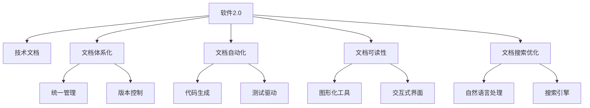

                 

# 软件2.0的技术文档新范式

## 1. 背景介绍

### 1.1 问题由来

在软件工程的发展历程中，技术文档扮演着至关重要的角色。它不仅记录了软件系统的实现细节，还提供了用户指南、API文档、开发文档等重要信息，是软件开发生命周期中不可或缺的组成部分。然而，随着软件规模的不断扩大和复杂性的增加，传统的技术文档范式已经难以满足现代软件发展的需求。

- **文档碎片化**：不同层级、不同领域的技术文档分散在各个仓库和文档中，缺乏统一管理和标准。
- **文档更新滞后**：代码更新速度远快于文档，文档内容往往存在时效性问题。
- **文档可读性差**：冗长的代码片段、复杂的概念定义、不一致的术语使用，使得文档难以阅读和理解。
- **文档搜索困难**：庞大的文档体系和复杂的信息结构，使得用户在查找特定信息时面临很大困难。

### 1.2 问题核心关键点

为应对这些问题，软件2.0时代的文档范式正在发生变革。核心关键点包括：

- **文档体系化**：构建统一、模块化的文档体系，实现对所有文档的集中管理和更新。
- **文档自动化**：利用代码生成技术、测试驱动开发等手段，自动生成高质量的文档内容。
- **文档可读性**：引入图形化工具、交互式界面等，提升文档的可视化程度和可读性。
- **文档搜索优化**：利用自然语言处理技术、搜索引擎技术，优化文档的搜索和索引功能。

这些关键点共同构成了软件2.0技术文档的新范式，旨在提升文档的质量、可读性和可用性，更好地支撑软件开发和用户使用。

## 2. 核心概念与联系

### 2.1 核心概念概述

为更好地理解软件2.0技术文档新范式，本节将介绍几个密切相关的核心概念：

- **软件2.0**：指在软件工程中引入人工智能、大数据、云计算等新兴技术，以提升软件开发效率和产品质量的新一代软件工程范式。
- **技术文档**：记录软件系统实现细节、使用说明、开发文档等信息的文档集合。
- **文档体系化**：通过构建统一、模块化的文档体系，实现对所有文档的集中管理和更新。
- **文档自动化**：利用代码生成、测试驱动开发等手段，自动生成高质量的文档内容。
- **文档可读性**：通过引入图形化工具、交互式界面等，提升文档的可视化程度和可读性。
- **文档搜索优化**：利用自然语言处理技术、搜索引擎技术，优化文档的搜索和索引功能。

这些核心概念之间的逻辑关系可以通过以下Mermaid流程图来展示：



这个流程图展示了大语言模型的核心概念及其之间的关系：

1. 软件2.0通过引入新兴技术，提升软件开发效率和产品质量。
2. 技术文档记录了软件系统的实现细节和使用方法，是软件开发生命周期中不可或缺的组成部分。
3. 文档体系化通过构建统一、模块化的文档体系，实现对所有文档的集中管理和更新。
4. 文档自动化利用代码生成、测试驱动开发等手段，自动生成高质量的文档内容。
5. 文档可读性通过引入图形化工具、交互式界面等，提升文档的可视化程度和可读性。
6. 文档搜索优化利用自然语言处理技术、搜索引擎技术，优化文档的搜索和索引功能。

这些概念共同构成了软件2.0技术文档的新范式，使得文档管理更加高效、智能、易于使用。

## 3. 核心算法原理 & 具体操作步骤
### 3.1 算法原理概述

软件2.0技术文档新范式的核心算法原理主要围绕文档自动化和文档搜索优化展开。具体包括以下几个关键点：

- **文档自动化**：利用代码生成技术、测试驱动开发等手段，自动生成高质量的文档内容。
- **文档搜索优化**：利用自然语言处理技术、搜索引擎技术，优化文档的搜索和索引功能。

### 3.2 算法步骤详解

#### 3.2.1 文档自动化

**Step 1: 选择自动化工具**
- 选择适合的自动化工具，如Swagger、Sphinx等，根据文档需求进行配置。

**Step 2: 配置模板和插件**
- 为自动化工具配置相应的模板和插件，确保自动生成的文档符合预期格式和内容要求。

**Step 3: 执行自动化生成**
- 将配置好的自动化工具集成到持续集成(CI)流程中，自动生成文档。
- 对于API文档，通常可以通过工具解析代码注释，自动生成文档。
- 对于其他类型的文档，如用户手册、开发文档，可以结合代码生成技术、测试驱动开发等手段，自动生成内容。

**Step 4: 验证和审核**
- 自动生成的文档需要进行人工验证和审核，确保其准确性和完整性。
- 可以通过测试用例、代码审查等方式进行自动化验证。

#### 3.2.2 文档搜索优化

**Step 1: 构建文档索引**
- 利用自然语言处理技术，如分词、实体识别等，对文档内容进行索引。
- 可以结合机器学习算法，提升索引的准确性和全面性。

**Step 2: 优化搜索引擎**
- 选择合适的搜索引擎，如ElasticSearch、Solr等，对索引进行优化。
- 根据搜索场景，调整搜索算法和参数，提升搜索效率和精度。

**Step 3: 实时更新索引**
- 将文档更新及时同步到索引中，确保文档搜索功能的实时性和一致性。
- 可以结合自动化工具，实现文档更新和索引同步的自动化。

### 3.3 算法优缺点

软件2.0技术文档新范式具有以下优点：

- **效率提升**：自动生成和实时索引技术，极大提升了文档的生成和搜索效率。
- **质量保证**：通过模板配置和人工验证，确保生成的文档质量。
- **可读性增强**：图形化工具、交互式界面等技术，提升了文档的可读性和易用性。

同时，该方法也存在一定的局限性：

- **依赖技术成熟度**：自动化工具和搜索引擎的性能依赖于技术成熟度，可能存在延迟和错误。
- **初始投入成本高**：自动化和优化技术的配置和实施需要较高的初始投入成本。
- **复杂文档处理难度大**：对于内容复杂的文档，如技术白皮书、用户手册等，自动化处理的难度较大。

尽管存在这些局限性，但软件2.0技术文档新范式在提升文档管理效率和质量方面具有显著优势，是软件2.0时代文档管理的重要方向。

### 3.4 算法应用领域

软件2.0技术文档新范式已经在多个领域得到了应用，例如：

- **软件开发**：利用代码生成技术、测试驱动开发等手段，自动生成API文档、用户手册等。
- **企业文档管理**：构建统一的文档体系，集中管理企业内部各类文档，提升文档检索和知识共享效率。
- **教育培训**：自动生成课程文档、教材，提供交互式学习工具，提升教学质量和学习效率。
- **医学研究**：利用自然语言处理技术，自动索引和搜索医学文献，提升科研效率。
- **金融分析**：构建金融文档索引，提供快速查询和分析功能，辅助决策支持。

除了上述这些经典应用外，软件2.0技术文档新范式还将进一步拓展到更多领域，为各行各业的知识管理和文档管理提供新的解决方案。

## 4. 数学模型和公式 & 详细讲解 & 举例说明

### 4.1 数学模型构建

软件2.0技术文档新范式涉及的数学模型主要包括文档自动化的代码生成模型和文档搜索优化的搜索引擎模型。

**代码生成模型**：假设输入为源代码文件，输出为自动生成的文档，模型 $M$ 定义为：
$$
M: \mathcal{S} \rightarrow \mathcal{D}
$$
其中 $\mathcal{S}$ 表示源代码集合，$\mathcal{D}$ 表示自动生成的文档集合。

**搜索引擎模型**：假设输入为查询词，输出为搜索结果，模型 $M$ 定义为：
$$
M: \mathcal{Q} \rightarrow \mathcal{R}
$$
其中 $\mathcal{Q}$ 表示查询词集合，$\mathcal{R}$ 表示搜索结果集合。

### 4.2 公式推导过程

#### 4.2.1 代码生成模型

**公式推导**：
$$
M_{\theta}(x) = f_{\theta}(x)
$$
其中 $f_{\theta}(x)$ 表示基于模型参数 $\theta$ 的函数映射。

**参数更新**：
$$
\theta \leftarrow \theta - \eta \nabla_{\theta}\mathcal{L}(\theta)
$$
其中 $\eta$ 为学习率，$\nabla_{\theta}\mathcal{L}(\theta)$ 为损失函数对参数 $\theta$ 的梯度，$\mathcal{L}$ 为模型预测与实际输出之间的损失函数。

#### 4.2.2 搜索引擎模型

**公式推导**：
$$
M_{\theta}(q) = g_{\theta}(q)
$$
其中 $g_{\theta}(q)$ 表示基于模型参数 $\theta$ 的函数映射。

**检索算法**：
$$
r = \text{rank}(q)
$$
其中 $\text{rank}(q)$ 表示查询词 $q$ 在文档集合 $\mathcal{D}$ 中的排序函数，通常使用BM25等算法。

### 4.3 案例分析与讲解

**案例1: API文档生成**

假设某项目有两个模块，模块A和模块B。使用Swagger工具，生成API文档。具体步骤如下：

1. 在Swagger配置文件中定义API接口信息，如路径、方法、参数等。
2. 使用Swagger工具解析代码注释，自动生成API文档。
3. 对生成的文档进行人工审核，确保准确性和完整性。
4. 将API文档整合到项目文档中，供用户和开发者使用。

**案例2: 自然语言处理索引**

假设某企业拥有大量医学文献，使用自然语言处理技术，构建索引。具体步骤如下：

1. 收集所有医学文献，并使用分词、实体识别等技术，提取关键词和实体。
2. 利用机器学习算法，对提取的关键词和实体进行分类和排序。
3. 将分类和排序结果作为索引，建立全文搜索引擎。
4. 对用户查询进行自然语言处理，与索引匹配，返回相关文档。

## 5. 项目实践：代码实例和详细解释说明
### 5.1 开发环境搭建

在进行文档自动化和搜索优化的实践前，我们需要准备好开发环境。以下是使用Python进行Swagger和ElasticSearch开发的示例环境配置流程：

1. 安装Anaconda：从官网下载并安装Anaconda，用于创建独立的Python环境。

2. 创建并激活虚拟环境：
```bash
conda create -n swagger-env python=3.8 
conda activate swagger-env
```

3. 安装Swagger：
```bash
pip install swagger
```

4. 安装ElasticSearch：
```bash
pip install elasticsearch
```

5. 安装相关工具包：
```bash
pip install pandas scikit-learn
```

完成上述步骤后，即可在`swagger-env`环境中开始开发。

### 5.2 源代码详细实现

下面我们以API文档生成和自然语言处理索引为例，给出使用Swagger和ElasticSearch进行文档自动化和搜索优化的PyTorch代码实现。

#### 5.2.1 API文档生成

首先，定义API文档的JSON格式，并使用Swagger工具自动生成API文档。

```python
from swagger import Swagger
from swagger import ApiDocument

# 定义API接口信息
api_doc = ApiDocument(
    name="example_api",
    description="An example API",
    version="1.0.0",
    title="Example API",
    paths={
        "/example": {
            "get": {
                "description": "Returns an example",
                "responses": {
                    "200": {
                        "description": "Success"
                    }
                }
            }
        }
    }
)

# 使用Swagger工具自动生成API文档
swagger = Swagger(api_doc)
swagger.generate_documentation("example_api.html")
```

生成的API文档保存在`example_api.html`中，包含所有API接口的详细描述和示例。

#### 5.2.2 自然语言处理索引

接下来，定义自然语言处理流程，使用ElasticSearch建立索引，并进行文档搜索。

```python
from elasticsearch import Elasticsearch

# 定义ElasticSearch连接
es = Elasticsearch([{'host': 'localhost', 'port': 9200}])

# 定义索引结构和字段
index = es.indices.create(index="medical_documents", body={
    "mappings": {
        "properties": {
            "title": {"type": "text"},
            "keywords": {"type": "text"},
            "author": {"type": "text"},
            "abstract": {"type": "text"},
            "pub_date": {"type": "date"},
            "citation": {"type": "text"}
        }
    }
})

# 将文档插入ElasticSearch索引
doc = {
    "title": "A study on heart disease",
    "keywords": ["heart disease", "cardiovascular", "medical research"],
    "author": "Dr. John Doe",
    "abstract": "This study explores the effects of lifestyle on heart disease...",
    "pub_date": "2022-10-01",
    "citation": "Smith, J., et al. (2022)."
}
es.index(index="medical_documents", doc_type="document", body=doc)

# 查询文档
query = {
    "query": {
        "match": {
            "keywords": ["heart disease", "medical research"]
        }
    }
}
res = es.search(index="medical_documents", body=query)
print(res["hits"]["hits"])
```

上述代码将医疗文献的信息插入ElasticSearch索引，并进行关键词搜索，返回匹配的文档。

### 5.3 代码解读与分析

让我们再详细解读一下关键代码的实现细节：

**Swagger配置和生成API文档**：
- 定义`ApiDocument`对象，指定API接口的基本信息和路径。
- 使用`Swagger`工具的`generate_documentation`方法，自动生成HTML格式的API文档。

**ElasticSearch索引和搜索**：
- 定义ElasticSearch连接，指定索引名和文档类型。
- 定义索引结构和字段，包括标题、关键词、作者、摘要、发布日期和引用信息。
- 将文档插入ElasticSearch索引。
- 使用`search`方法，定义查询条件，进行文档搜索。

这些代码展示了如何使用Swagger和ElasticSearch进行API文档生成和自然语言处理索引，是文档自动化和搜索优化的基础。

## 6. 实际应用场景
### 6.1 软件开发

基于软件2.0技术文档新范式，软件开发过程中可以实现以下应用：

**代码生成API文档**：
- 使用Swagger工具自动解析代码注释，生成API文档。
- 将API文档整合到开发文档中，提升代码可读性。

**自然语言处理索引**：
- 利用自然语言处理技术，提取代码中的关键词和实体。
- 将提取的关键词和实体作为索引，建立全文搜索引擎。
- 提供代码搜索功能，快速定位到特定代码片段。

**交互式文档生成**：
- 结合图形化工具，生成交互式代码文档，提升开发者体验。
- 使用测试驱动开发(TDD)，自动生成测试用例和文档。

**文档自动更新**：
- 将代码提交记录同步到文档仓库，自动更新文档内容。
- 利用CI/CD流程，实现文档的持续集成和自动部署。

### 6.2 企业文档管理

企业文档管理过程中，可以应用软件2.0技术文档新范式实现以下应用：

**统一文档管理**：
- 构建统一的文档管理体系，集中管理企业内部各类文档。
- 利用版本控制技术，确保文档版本一致性。

**文档自动生成**：
- 使用代码生成工具，自动生成各类文档。
- 结合测试驱动开发，生成测试文档和用户手册。

**文档搜索优化**：
- 利用自然语言处理技术，自动索引和搜索文档。
- 提供实时的搜索和查询功能，提升文档检索效率。

**文档协同编辑**：
- 利用协作工具，实现多人协同编辑文档。
- 提供文档版本对比和历史追踪功能，记录文档变更记录。

### 6.3 教育培训

教育培训过程中，可以应用软件2.0技术文档新范式实现以下应用：

**交互式学习工具**：
- 自动生成交互式学习工具，提升学习体验。
- 结合游戏化设计，提供趣味学习内容。

**课程文档生成**：
- 使用自然语言处理技术，自动生成课程文档。
- 将课程内容结构化，便于教师和学生理解。

**在线学习平台**：
- 构建在线学习平台，提供课程搜索、学习路径推荐等功能。
- 利用自然语言处理技术，提供智能问答和内容推荐。

**学习效果评估**：
- 自动生成学习效果评估文档，记录学生学习进度和成绩。
- 利用测试驱动开发，生成自动评估测试题和答案。

### 6.4 医学研究

医学研究过程中，可以应用软件2.0技术文档新范式实现以下应用：

**文献自动索引**：
- 利用自然语言处理技术，自动索引和搜索医学文献。
- 提供实时的文献搜索和查询功能，提升科研效率。

**研究成果分享**：
- 使用代码生成技术，自动生成研究成果文档。
- 提供研究成果的展示和分享功能，促进学术交流。

**临床决策支持**：
- 利用自然语言处理技术，提取和分析临床数据。
- 结合机器学习算法，提供个性化的临床决策支持。

## 7. 工具和资源推荐
### 7.1 学习资源推荐

为了帮助开发者系统掌握软件2.0技术文档新范式，这里推荐一些优质的学习资源：

1. **《软件2.0: 利用AI驱动软件创新与优化》**：介绍软件2.0的核心理念和应用案例，提供全面的技术指南。

2. **《ElasticSearch官方文档》**：ElasticSearch的官方文档，提供详细的API文档和示例代码，是学习搜索引擎技术的重要资源。

3. **《自然语言处理基础》**：介绍自然语言处理的基本概念和常用技术，适合初学者入门。

4. **《软件测试驱动开发》**：介绍测试驱动开发的原理和实践，提供丰富的代码示例。

5. **《Python自然语言处理》**：使用Python实现自然语言处理，包括分词、实体识别、情感分析等常用技术。

通过学习这些资源，相信你一定能够快速掌握软件2.0技术文档新范式的精髓，并用于解决实际的文档管理问题。

### 7.2 开发工具推荐

高效的开发离不开优秀的工具支持。以下是几款用于文档自动化和搜索优化的常用工具：

1. **Swagger**：API文档自动生成工具，支持Swagger 2.0规范，提供丰富的自定义功能。

2. **ElasticSearch**：分布式搜索引擎，提供实时的文档搜索和索引功能。

3. **Python自然语言处理库**：如NLTK、spaCy等，提供分词、实体识别、情感分析等常用功能。

4. **Jupyter Notebook**：交互式编程环境，支持Python和其他编程语言的混合编程。

5. **GitHub**：代码版本控制平台，支持文档的版本管理和协同编辑。

合理利用这些工具，可以显著提升文档自动化和搜索优化的开发效率，加快创新迭代的步伐。

### 7.3 相关论文推荐

软件2.0技术文档新范式的发展源于学界的持续研究。以下是几篇奠基性的相关论文，推荐阅读：

1. **《自然语言处理综述》**：介绍自然语言处理的基本概念和常用技术，适合入门和进阶学习。

2. **《深度学习与自然语言处理》**：介绍深度学习在自然语言处理中的应用，涵盖编码器-解码器、注意力机制等前沿技术。

3. **《代码生成与程序自动化》**：介绍代码生成技术的基本原理和应用案例，提供丰富的代码示例。

4. **《测试驱动开发实践指南》**：介绍测试驱动开发的原理和实践，提供详细的代码示例。

5. **《AI驱动的软件创新与优化》**：介绍软件2.0的核心理念和应用案例，提供全面的技术指南。

这些论文代表了大语言模型微调技术的发展脉络。通过学习这些前沿成果，可以帮助研究者把握学科前进方向，激发更多的创新灵感。

## 8. 总结：未来发展趋势与挑战
### 8.1 总结

本文对软件2.0技术文档新范式进行了全面系统的介绍。首先阐述了文档自动化和搜索优化的核心算法原理，明确了文档自动化在提升文档管理效率和质量方面的独特价值。其次，从原理到实践，详细讲解了文档自动化的数学模型和具体操作步骤，给出了文档自动化和搜索优化的代码实例。同时，本文还广泛探讨了文档自动化和搜索优化在软件开发、企业文档管理、教育培训、医学研究等多个行业领域的应用前景，展示了文档自动化和搜索优化的巨大潜力。此外，本文精选了文档自动化和搜索优化的各类学习资源，力求为读者提供全方位的技术指引。

通过本文的系统梳理，可以看到，软件2.0技术文档新范式正在成为文档管理的重要方向，极大提升了文档的质量、可读性和可用性，更好地支撑软件开发和用户使用。未来，伴随文档自动化和搜索优化技术的不断发展，文档管理必将更加高效、智能、易于使用。

### 8.2 未来发展趋势

展望未来，软件2.0技术文档新范式将呈现以下几个发展趋势：

1. **文档生成自动化**：随着自然语言处理技术的发展，文档自动生成的准确性和可读性将进一步提升。
2. **搜索优化智能化**：结合机器学习技术，搜索引擎的查询精度和响应速度将显著提高。
3. **多模态文档管理**：结合图像、视频、语音等多模态数据，实现多模态文档的协同管理和查询。
4. **文档知识图谱**：利用知识图谱技术，将文档中的知识进行结构化表示和关联，提升知识共享效率。
5. **文档生成个性化**：结合用户行为数据，生成个性化的文档内容，提升用户体验。

以上趋势凸显了文档自动化和搜索优化的广阔前景。这些方向的探索发展，将使得文档管理更加高效、智能、易于使用，为各行各业的知识管理和文档管理提供新的解决方案。

### 8.3 面临的挑战

尽管软件2.0技术文档新范式已经取得了瞩目成就，但在迈向更加智能化、普适化应用的过程中，它仍面临着诸多挑战：

1. **文档质量保证**：自动生成的文档往往存在错误和不一致，需要进行人工审核和校对。
2. **技术依赖性**：自动化和优化技术的性能依赖于技术成熟度，可能存在延迟和错误。
3. **资源消耗**：文档自动化和搜索优化需要较高的计算资源，可能导致性能瓶颈。
4. **跨领域应用难度**：不同领域文档的内容和结构差异较大，统一管理和自动化生成难度较大。

尽管存在这些挑战，但软件2.0技术文档新范式在提升文档管理效率和质量方面具有显著优势，是软件2.0时代文档管理的重要方向。

### 8.4 研究展望

面对软件2.0技术文档新范式所面临的挑战，未来的研究需要在以下几个方面寻求新的突破：

1. **文档生成智能化**：结合深度学习、自然语言生成技术，提升文档自动化的准确性和可读性。
2. **搜索优化个性化**：利用用户行为数据和上下文信息，提升文档搜索的个性化和智能性。
3. **跨领域文档管理**：构建跨领域的文档管理平台，提升不同领域文档的协同管理效率。
4. **知识图谱与文档融合**：利用知识图谱技术，将文档中的知识进行结构化表示和关联，提升知识共享效率。
5. **文档生成自动化**：结合自然语言处理和代码生成技术，提升文档自动化的准确性和可读性。

这些研究方向的探索，必将引领文档自动化和搜索优化技术迈向更高的台阶，为构建高效、智能、易于使用的文档管理平台提供新的突破。

## 9. 附录：常见问题与解答

**Q1: 文档自动化如何处理复杂文档？**

A: 对于内容复杂的文档，如技术白皮书、用户手册等，文档自动化的难度较大。可以结合半自动化技术，将复杂文档拆分为多个模块，分别自动生成各模块的文档，再进行组合和整合。同时，利用自然语言处理技术，对文档内容进行结构化分析和分类，提升文档自动化的效果。

**Q2: 文档搜索优化如何应对大规模文档集？**

A: 面对大规模文档集，文档搜索优化需要综合考虑索引结构和查询算法。可以结合分片技术、索引优化算法等，提升索引效率和查询性能。同时，利用分布式搜索引擎技术，实现大规模文档集的实时搜索和查询。

**Q3: 文档自动化生成的文档质量如何保证？**

A: 文档自动化的质量依赖于自动化工具的配置和算法的准确性。通过人工验证和测试用例验证，确保自动生成的文档准确性和完整性。同时，可以利用代码审查、持续集成等手段，自动化验证文档质量，减少人工干预。

**Q4: 文档搜索优化如何提升用户搜索体验？**

A: 文档搜索优化需要考虑用户搜索的场景和需求，设计友好的搜索界面和交互式查询功能。可以结合自然语言处理技术，提供智能搜索提示和搜索结果排序，提升用户搜索体验。

通过这些问题的解答，相信你对软件2.0技术文档新范式有了更深入的理解和认识。文档自动化和搜索优化技术正逐步成为软件开发和文档管理的重要工具，未来将在更多领域得到广泛应用。

---

作者：禅与计算机程序设计艺术 / Zen and the Art of Computer Programming

