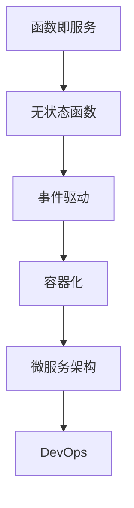

                 

# 软件2.0的无服务器计算架构

> 关键词：无服务器计算,函数即服务,FaaS,容器化,微服务架构,DevOps,云原生

## 1. 背景介绍

### 1.1 问题由来
在过去的数十年里，软件开发范式经历了从瀑布模型、敏捷开发到DevOps的演变。这一过程中，开发工具、方法论和基础设施都在持续进化，以适应软件开发的要求和挑战。但是，无论是经典的瀑布模型还是现代的DevOps，它们都基于服务器架构构建。服务器架构的特点是：软件运行在专用的服务器上，开发者需要对硬件和网络等基础设施进行管理和维护，以确保软件的稳定性和可扩展性。

然而，随着云计算、容器化、微服务架构等新兴技术的发展，软件部署和运行的方式正在发生革命性的变化。云计算服务提供商如AWS、Google Cloud和Microsoft Azure等，提供了一系列的云服务，使得开发者可以以更简单、更灵活的方式构建和部署软件。这些云服务中最具代表性的就是无服务器计算（Serverless Computing）。

无服务器计算也被称为函数即服务（Function as a Service, FaaS），是指开发者无需关心服务器和网络等基础设施，只需编写代码并上传至云平台，云平台会自动分配和释放计算资源，提供完整的软件生命周期管理服务，包括开发、测试、部署、运行和维护。这种基于云的无服务器计算架构，被认为代表了软件2.0的到来，彻底颠覆了传统的软件开发和运行方式。

### 1.2 问题核心关键点
无服务器计算架构之所以被视为软件2.0的标志，是因为它改变了软件开发和运维的生态，带来了以下几个关键点：

- **简化部署和管理**：开发者无需关注底层硬件和网络基础设施，只需专注于代码的编写和部署，大大降低了部署和管理复杂度。
- **弹性计算**：根据实际请求动态调整资源，避免资源浪费和过度分配，实现更高效的资源利用。
- **成本优化**：按需计费，减少固定成本，提升整体的成本效益。
- **快速迭代**：支持快速测试和迭代，加速软件交付和创新。
- **全球分布**：提供全球化的计算能力，支持跨地域、跨时区的软件应用。

这些关键点共同构成了无服务器计算的核心价值，为软件开发和运行带来了前所未有的优势和便利。

## 2. 核心概念与联系

### 2.1 核心概念概述

无服务器计算架构的核心概念包括：

- **函数即服务（FaaS）**：将应用程序拆分为独立的函数，每个函数独立运行，响应特定的HTTP请求。
- **无状态函数**：每个函数不保存状态信息，每次请求后自动销毁，保证函数间的独立性。
- **事件驱动**：通过事件触发函数执行，支持基于事件的架构。
- **容器化**：函数运行在容器中，隔离运行环境和资源，提升安全性和可移植性。
- **微服务架构**：将应用程序拆分为多个微服务，每个微服务运行独立的函数，实现服务之间的解耦和灵活组合。
- **DevOps**：持续集成（CI）和持续部署（CD），自动化测试和部署流程，提升开发效率和质量。

这些核心概念之间相互关联，共同构成了无服务器计算架构的理论基础和实践框架。

### 2.2 核心概念原理和架构的 Mermaid 流程图



这个流程图展示了无服务器计算架构的核心组件及其相互关系：

1. **函数即服务（FaaS）**：提供独立运行的函数，响应HTTP请求，是整个架构的入口。
2. **无状态函数**：每个函数独立运行，不保存状态信息，保证函数的轻量级和可扩展性。
3. **事件驱动**：基于事件触发函数执行，支持异步和并发处理。
4. **容器化**：函数运行在容器中，隔离运行环境和资源，提升安全性和可移植性。
5. **微服务架构**：将应用程序拆分为多个微服务，每个微服务运行独立的函数，实现服务之间的解耦和灵活组合。
6. **DevOps**：持续集成（CI）和持续部署（CD），自动化测试和部署流程，提升开发效率和质量。

这些组件共同构建了一个高效、灵活、可扩展的无服务器计算架构。

## 3. 核心算法原理 & 具体操作步骤

### 3.1 算法原理概述

无服务器计算架构的算法原理主要围绕函数即服务（FaaS）展开。FaaS通过将应用程序拆分为独立运行的函数，每个函数独立响应特定的HTTP请求，实现软件的高效运行和灵活部署。其核心思想是将传统服务器架构的复杂性剥离，简化开发和运维过程，提高系统的可扩展性和成本效益。

### 3.2 算法步骤详解

无服务器计算架构的实施步骤主要包括以下几个环节：

1. **拆分应用为函数**：将应用程序拆分为独立运行的函数，每个函数独立响应特定的HTTP请求。
2. **函数部署和执行**：将函数代码部署到云平台，云平台根据请求动态分配和释放计算资源，运行函数并返回响应。
3. **事件驱动架构**：通过事件触发函数执行，支持基于事件的架构，提升系统的异步和并发处理能力。
4. **容器化技术**：函数运行在容器中，隔离运行环境和资源，提升安全性和可移植性。
5. **微服务架构**：将应用程序拆分为多个微服务，每个微服务运行独立的函数，实现服务之间的解耦和灵活组合。
6. **DevOps实践**：采用持续集成（CI）和持续部署（CD），自动化测试和部署流程，提升开发效率和质量。

### 3.3 算法优缺点

无服务器计算架构的优点包括：

- **简化部署和管理**：无需关心底层硬件和网络基础设施，减少部署和管理复杂度。
- **弹性计算**：根据实际请求动态调整资源，避免资源浪费和过度分配，实现更高效的资源利用。
- **成本优化**：按需计费，减少固定成本，提升整体的成本效益。
- **快速迭代**：支持快速测试和迭代，加速软件交付和创新。
- **全球分布**：提供全球化的计算能力，支持跨地域、跨时区的软件应用。

但无服务器计算架构也存在一些缺点：

- **冷启动延迟**：由于函数在每次请求后才被创建，存在冷启动延迟问题，影响响应速度。
- **函数执行时长限制**：函数执行时间有限制，超过限制会自动终止，可能影响一些长时间运行的计算任务。
- **功能限制**：云平台提供的服务和工具有限，可能无法满足某些特殊需求。
- **开发者学习成本**：需要掌握新的开发和运维工具，学习曲线较陡。

### 3.4 算法应用领域

无服务器计算架构已经在多个领域得到了广泛应用，包括：

- **Web应用**：通过函数即服务实现Web应用的无状态运行，提高响应速度和可扩展性。
- **API服务**：提供RESTful API服务，支持异步调用和并行处理。
- **事件驱动系统**：处理各种事件，如社交媒体消息、物联网数据等。
- **微服务架构**：支持微服务架构的构建和部署，实现服务的灵活组合和解耦。
- **实时数据处理**：处理实时数据流，支持流式计算和分析。
- **自动化测试和部署**：支持持续集成（CI）和持续部署（CD），自动化测试和部署流程，提升开发效率和质量。

## 4. 数学模型和公式 & 详细讲解

### 4.1 数学模型构建

无服务器计算架构的数学模型主要围绕函数即服务（FaaS）展开。FaaS的数学模型可以表示为：

$$
F(x) = \begin{cases}
f_1(x) & \text{如果请求参数为 } x_1 \\
f_2(x) & \text{如果请求参数为 } x_2 \\
\cdots \\
f_n(x) & \text{如果请求参数为 } x_n
\end{cases}
$$

其中，$x_i$ 表示请求参数，$f_i(x)$ 表示对应的函数，$n$ 表示函数的数量。这个模型展示了FaaS将应用程序拆分为独立函数的本质。

### 4.2 公式推导过程

函数即服务（FaaS）的公式推导过程如下：

1. **函数定义**：将应用程序拆分为独立运行的函数，每个函数独立响应特定的HTTP请求。
2. **事件驱动**：通过事件触发函数执行，支持基于事件的架构。
3. **容器化**：函数运行在容器中，隔离运行环境和资源，提升安全性和可移植性。
4. **微服务架构**：将应用程序拆分为多个微服务，每个微服务运行独立的函数，实现服务之间的解耦和灵活组合。
5. **DevOps实践**：采用持续集成（CI）和持续部署（CD），自动化测试和部署流程，提升开发效率和质量。

### 4.3 案例分析与讲解

假设我们有一个简单的Web应用，需要处理两种类型的请求：用户注册和用户登录。我们可以将这两种请求分别拆分为独立的函数，并部署到云平台。具体步骤如下：

1. **函数拆分**：将用户注册和用户登录的逻辑分别封装为两个函数。
2. **事件驱动**：根据HTTP请求的类型，触发对应的函数执行。
3. **容器化**：每个函数运行在独立的容器中，隔离运行环境和资源。
4. **微服务架构**：用户注册和用户登录的函数独立运行，相互解耦。
5. **DevOps实践**：采用持续集成（CI）和持续部署（CD），自动化测试和部署流程，提升开发效率和质量。

通过这些步骤，我们可以构建一个高效、灵活、可扩展的无服务器计算架构。

## 5. 项目实践：代码实例和详细解释说明

### 5.1 开发环境搭建

在进行无服务器计算架构的实践前，我们需要准备好开发环境。以下是使用Python和AWS Lambda进行无服务器计算实践的环境配置流程：

1. 安装AWS CLI：从官网下载并安装AWS CLI工具，用于管理AWS账户和服务。
2. 配置AWS CLI：配置AWS账户的访问密钥和区域信息，确保能够访问AWS Lambda服务。
3. 安装Python和必要的依赖包：安装Python和必要的依赖包，如Flask、Boto3等，用于构建和部署函数。
4. 创建虚拟环境：创建Python虚拟环境，确保Python版本的一致性。

### 5.2 源代码详细实现

下面是使用Python和AWS Lambda构建无服务器计算函数的示例代码：

```python
import boto3
import json
import logging

logger = logging.getLogger()
logger.setLevel(logging.INFO)

def lambda_handler(event, context):
    # 解析请求参数
    headers = event['headers']
    payload = event['body']
    method = event['httpMethod']
    
    # 根据请求方法调用对应的函数
    if method == 'POST':
        handle_post(headers, payload)
    elif method == 'GET':
        handle_get(headers, payload)
    else:
        return {
            'statusCode': 400,
            'body': json.dumps({'message': 'Invalid request method'})
        }

def handle_post(headers, payload):
    # 处理POST请求
    logger.info('Received POST request')
    # 处理请求逻辑
    return {
        'statusCode': 200,
        'body': json.dumps({'message': 'POST request received'})
    }

def handle_get(headers, payload):
    # 处理GET请求
    logger.info('Received GET request')
    # 处理请求逻辑
    return {
        'statusCode': 200,
        'body': json.dumps({'message': 'GET request received'})
    }
```

在上述代码中，我们定义了一个Lambda函数，用于处理HTTP请求。Lambda函数接收事件（event）和上下文（context）作为参数，解析HTTP请求方法、请求头和请求体，然后根据请求方法调用对应的函数进行处理。

### 5.3 代码解读与分析

让我们再详细解读一下关键代码的实现细节：

**lambda_handler函数**：
- 解析HTTP请求方法、请求头和请求体。
- 根据请求方法调用对应的函数进行处理。
- 返回HTTP响应，包含请求处理结果。

**handle_post函数**：
- 处理POST请求，记录日志。
- 处理请求逻辑。
- 返回HTTP响应，包含请求处理结果。

**handle_get函数**：
- 处理GET请求，记录日志。
- 处理请求逻辑。
- 返回HTTP响应，包含请求处理结果。

**Lambda函数**：
- 通过Boto3库配置AWS CLI，确保能够访问Lambda服务。
- 定义Lambda函数，处理HTTP请求，并返回响应。

可以看到，使用AWS Lambda进行无服务器计算的代码实现非常简洁高效，开发者可以专注于业务逻辑的编写，而不必关心底层硬件和网络基础设施。

### 5.4 运行结果展示

在AWS Lambda上部署上述代码后，可以通过API Gateway访问Lambda函数。例如，访问一个处理POST请求的Lambda函数，可以通过API Gateway的URL进行测试：

```
https://<function_name>.execute-api.<region>.amazonaws.com/function_name/post
```

其中，<function_name>为Lambda函数的名称，<region>为AWS区域信息。

## 6. 实际应用场景

### 6.1 无服务器计算在Web应用中的使用

无服务器计算在Web应用中广泛应用，通过函数即服务实现Web应用的无状态运行，提高响应速度和可扩展性。具体来说，可以通过无服务器计算架构构建高性能、高可用的Web应用，支持大量的并发请求，实现更高的业务扩展能力。

### 6.2 无服务器计算在API服务中的应用

无服务器计算在API服务中的应用也非常广泛，支持异步调用和并行处理。通过函数即服务，可以快速构建RESTful API服务，支持HTTP请求和响应，实现API的快速部署和迭代。

### 6.3 无服务器计算在事件驱动系统中的应用

无服务器计算在事件驱动系统中的应用，可以处理各种事件，如社交媒体消息、物联网数据等。通过事件触发函数执行，可以实时处理大量异构事件，提升系统的异步和并发处理能力。

### 6.4 未来应用展望

随着无服务器计算技术的不断成熟，未来将在更多领域得到应用，为软件开发和运行带来新的变革：

1. **云计算的普及**：无服务器计算将成为云计算的基础设施，支持各种云服务的应用，提升云服务的灵活性和可扩展性。
2. **微服务的普及**：无服务器计算支持微服务架构的构建和部署，实现服务的灵活组合和解耦，提升系统的可扩展性和可维护性。
3. **自动化测试和部署**：采用持续集成（CI）和持续部署（CD），自动化测试和部署流程，提升开发效率和质量。
4. **DevOps文化的普及**：无服务器计算支持DevOps文化的推广，实现开发、测试、部署、运维的一体化管理，提升整体的软件交付效率和质量。
5. **实时数据分析**：无服务器计算支持实时数据处理，支持流式计算和分析，提升大数据分析的实时性和准确性。

## 7. 工具和资源推荐

### 7.1 学习资源推荐

为了帮助开发者系统掌握无服务器计算的理论基础和实践技巧，这里推荐一些优质的学习资源：

1. AWS官方文档：AWS Lambda的官方文档，提供了详细的API参考、使用指南和最佳实践，是入门无服务器计算的重要资源。
2.《AWS Lambda实战》书籍：该书详细介绍了AWS Lambda的使用方法、最佳实践和实际案例，适合初学者和中级开发者参考。
3.《无服务器计算：设计、构建和部署》课程：Coursera平台上由AWS提供的无服务器计算课程，涵盖无服务器计算的基本概念、技术和实践，适合深度学习开发者。
4. 《Serverless Architectures with Microservices》书籍：该书介绍了微服务架构和无服务器计算的结合应用，适合有一定微服务开发经验的开发者参考。

通过对这些资源的学习实践，相信你一定能够快速掌握无服务器计算的精髓，并用于解决实际的开发问题。

### 7.2 开发工具推荐

高效的开发离不开优秀的工具支持。以下是几款用于无服务器计算开发的常用工具：

1. AWS CLI：AWS提供的命令行工具，用于管理AWS服务，包括AWS Lambda、API Gateway等。
2. Boto3：Python的AWS SDK，提供了对AWS服务的访问和操作，支持无服务器计算的开发和部署。
3. Postman：API测试和调试工具，支持HTTP请求和响应，适合测试和调试无服务器计算函数。
4. Swagger：API设计工具，支持API文档的生成和测试，适合设计和部署RESTful API服务。
5. Docker：容器化工具，支持无服务器计算函数的打包和部署，提升系统的可移植性和可扩展性。

合理利用这些工具，可以显著提升无服务器计算任务的开发效率，加快创新迭代的步伐。

### 7.3 相关论文推荐

无服务器计算技术的快速发展得益于学界的持续研究。以下是几篇奠基性的相关论文，推荐阅读：

1. 《Serverless Computing》论文：这篇文章提出了无服务器计算的概念，并探讨了其优缺点，成为无服务器计算的奠基性文献。
2. 《A Survey on Serverless Cloud Functions》论文：该论文综述了无服务器计算的最新进展和应用，适合研究者和开发者参考。
3. 《Serverless Computing: Concepts, Opportunities, and Challenges》论文：该论文深入探讨了无服务器计算的原理、应用和挑战，为未来研究提供了方向。
4. 《Microservices and Serverless Computing》论文：该论文探讨了微服务和无服务器计算的结合应用，适合研究者和开发者参考。
5. 《Serverless Edge Computing》论文：该论文探讨了无服务器计算在边缘计算中的应用，适合研究者和开发者参考。

这些论文代表了大规模计算架构的发展脉络，通过学习这些前沿成果，可以帮助研究者把握学科前进方向，激发更多的创新灵感。

## 8. 总结：未来发展趋势与挑战

### 8.1 总结

本文对无服务器计算架构进行了全面系统的介绍。首先阐述了无服务器计算的起源和发展，明确了其代表软件2.0的标志和核心价值。其次，从原理到实践，详细讲解了无服务器计算的数学模型和核心算法，给出了无服务器计算任务开发的完整代码实例。同时，本文还探讨了无服务器计算在Web应用、API服务、事件驱动系统等众多领域的应用前景，展示了其巨大的潜力。此外，本文精选了无服务器计算的相关学习资源，力求为读者提供全方位的技术指引。

通过本文的系统梳理，可以看到，无服务器计算架构正在成为云计算的重要组成部分，极大地简化了软件开发和运行的过程，提升了系统的可扩展性和成本效益。未来，伴随云计算和容器化技术的不断演进，无服务器计算将成为软件开发和运行的主流范式，彻底改变软件开发和运维的生态。

### 8.2 未来发展趋势

展望未来，无服务器计算架构将呈现以下几个发展趋势：

1. **云服务的普及**：无服务器计算将成为云计算基础设施的标准配置，支持各种云服务的应用，提升云服务的灵活性和可扩展性。
2. **微服务的普及**：无服务器计算支持微服务架构的构建和部署，实现服务的灵活组合和解耦，提升系统的可扩展性和可维护性。
3. **自动化测试和部署**：采用持续集成（CI）和持续部署（CD），自动化测试和部署流程，提升开发效率和质量。
4. **DevOps文化的普及**：无服务器计算支持DevOps文化的推广，实现开发、测试、部署、运维的一体化管理，提升整体的软件交付效率和质量。
5. **实时数据分析**：无服务器计算支持实时数据处理，支持流式计算和分析，提升大数据分析的实时性和准确性。

这些趋势凸显了无服务器计算架构的广泛应用前景和未来潜力。这些方向的探索发展，必将进一步提升无服务器计算的性能和应用范围，为软件开发和运行带来新的变革。

### 8.3 面临的挑战

尽管无服务器计算架构已经取得了显著成就，但在迈向更加智能化、普适化应用的过程中，它仍面临着诸多挑战：

1. **冷启动延迟**：由于函数在每次请求后才被创建，存在冷启动延迟问题，影响响应速度。
2. **函数执行时长限制**：函数执行时间有限制，超过限制会自动终止，可能影响一些长时间运行的计算任务。
3. **功能限制**：云平台提供的服务和工具有限，可能无法满足某些特殊需求。
4. **开发者学习成本**：需要掌握新的开发和运维工具，学习曲线较陡。

### 8.4 研究展望

面对无服务器计算架构所面临的挑战，未来的研究需要在以下几个方面寻求新的突破：

1. **优化冷启动性能**：通过优化函数的预加载和缓存，减少冷启动延迟，提升响应速度。
2. **扩展函数执行时长**：通过优化函数的执行路径和资源管理，提升函数的执行效率，支持长时间运行的计算任务。
3. **增强功能支持**：扩展云平台的服务和工具，支持更多的功能和需求，提升无服务器计算的灵活性和可扩展性。
4. **降低开发者学习成本**：提供更易用的开发工具和文档，降低开发者的学习门槛，提升无服务器计算的应用普及率。
5. **支持多种编程语言**：支持多种编程语言的函数编写和部署，提升开发者的使用体验和灵活性。

这些研究方向将推动无服务器计算架构向更加高效、灵活、普适的方向发展，实现更广泛的应用和普及。

## 9. 附录：常见问题与解答

**Q1：无服务器计算架构的冷启动延迟问题如何解决？**

A: 解决冷启动延迟问题的方法包括：
1. 预加载函数：通过预加载函数到内存中，减少每次请求的初始化时间。
2. 函数缓存：将函数的执行结果缓存到内存或本地磁盘中，下次请求直接返回缓存结果。
3. 异步函数：通过异步调用函数，降低请求的等待时间，提升响应速度。
4. 函数分组：将多个函数分组，每组函数共享预加载和缓存资源，降低冷启动延迟。

**Q2：无服务器计算架构的函数执行时长限制如何处理？**

A: 处理函数执行时长限制的方法包括：
1. 优化函数代码：通过优化代码逻辑和算法，减少函数的执行时间。
2. 函数分组：将长时间运行的函数分组，每组函数共享计算资源，避免资源浪费。
3. 函数延迟处理：将长时间运行的函数拆分为多个子函数，每个子函数独立执行，避免超时。
4. 调用外部服务：将长时间运行的计算任务调用外部服务处理，减少函数执行时间。

**Q3：无服务器计算架构的功能限制如何解决？**

A: 解决无服务器计算架构的功能限制的方法包括：
1. 使用第三方服务：使用云平台提供的第三方服务，支持更多的功能和需求。
2. 扩展云平台功能：通过扩展云平台的服务和工具，支持更多的功能和需求。
3. 自定义函数：通过自定义函数，扩展无服务器计算的功能，满足特定的需求。
4. 结合其他技术：结合其他技术，如微服务架构、容器化等，提升无服务器计算的灵活性和可扩展性。

**Q4：无服务器计算架构的开发者学习成本如何降低？**

A: 降低开发者学习成本的方法包括：
1. 提供易用的开发工具和文档：提供易用的开发工具和文档，降低开发者的学习门槛。
2. 提供培训和支持：提供培训和支持，帮助开发者快速掌握无服务器计算的使用方法。
3. 引入社区和生态系统：引入社区和生态系统，促进开发者之间的交流和合作，共同提升无服务器计算的普及率。
4. 提供实战案例：提供实战案例和示例代码，帮助开发者更好地理解和使用无服务器计算。

**Q5：无服务器计算架构如何支持多种编程语言？**

A: 支持多种编程语言的方法包括：
1. 使用云平台支持的编程语言：选择云平台支持的编程语言，如Python、Java、Node.js等。
2. 使用多语言运行时：使用多语言运行时，如AWS Lambda提供的多语言支持，支持多种编程语言的函数编写和部署。
3. 自定义运行时：通过自定义运行时，支持多种编程语言的函数编写和部署。
4. 使用容器化技术：使用容器化技术，支持多种编程语言的函数编写和部署，提升系统的可移植性和可扩展性。

通过这些方法的探索和应用，无服务器计算架构将变得更加高效、灵活和普适，为软件开发和运行带来新的变革。

