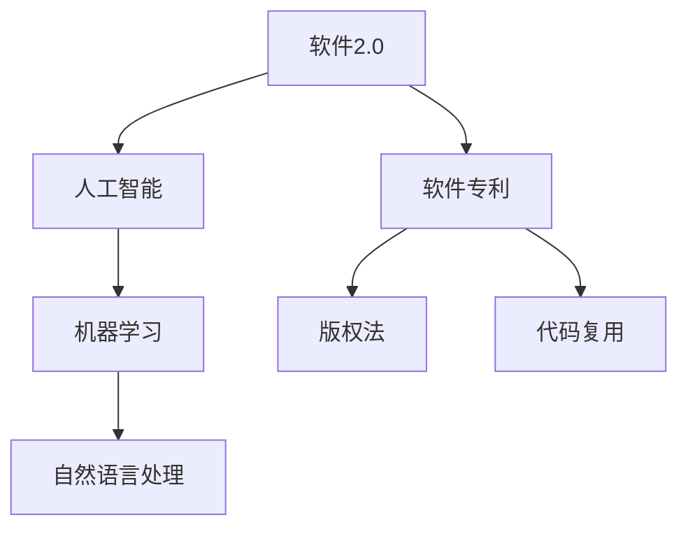

                 

# 软件2.0颠覆软件专利?法律制度面临新挑战

> 关键词：软件2.0, 软件专利, 人工智能, 版权法, 计算机算法, 代码复用, 知识产权

## 1. 背景介绍

软件技术在过去几十年的快速发展，极大地推动了经济和社会进步。然而，随着软件2.0时代的到来，传统软件专利保护制度面临新的挑战。本文将深入探讨软件2.0的概念，并分析其对软件专利制度的影响，以及当前法律制度所面临的挑战和未来可能的应对策略。

## 2. 核心概念与联系

### 2.1 核心概念概述

为了理解软件2.0的概念及其对法律制度的影响，首先需要明确以下几个核心概念：

- **软件2.0**：指的是使用人工智能、机器学习、自然语言处理等技术，开发出具备自我改进、自我更新能力的智能软件系统。它超越了传统软件的功能和设计，通过不断学习和适应用户行为，提供更加个性化和高效的服务。

- **软件专利**：是指一种针对软件算法的专利保护制度，旨在通过授予专利权来保护软件开发者对其发明创造的专有权利。

- **版权法**：是保护文学、艺术作品（包括软件源代码）的创作成果不被侵犯的法律制度。

- **代码复用**：是指在软件开发过程中，通过引用、继承、重用等技术手段，减少代码重复编写，提高开发效率和软件质量。

这些概念之间存在密切联系，共同构成了软件技术法律保护的基础框架。本文将详细分析这些概念之间的相互作用，以及它们在软件2.0时代的演变。

### 2.2 核心概念原理和架构的 Mermaid 流程图



这个流程图展示了软件2.0如何通过人工智能、机器学习、自然语言处理等技术，构建具备自我改进能力的智能软件系统，并通过软件专利和版权法等法律制度保护其知识产权。代码复用作为软件开发的一种重要手段，也与软件2.0息息相关。

## 3. 核心算法原理 & 具体操作步骤

### 3.1 算法原理概述

软件2.0的核心算法原理主要基于机器学习、深度学习等人工智能技术，通过对大量数据的学习和分析，自动生成和优化软件系统。这些算法往往依赖于复杂的数学模型和大量的训练数据，目的是实现对用户行为的精准预测和个性化推荐。

### 3.2 算法步骤详解

软件2.0的算法开发通常包括以下几个关键步骤：

1. **数据收集**：从用户行为、交互记录等数据源中收集大量数据。
2. **数据预处理**：清洗、归一化数据，并准备用于模型训练。
3. **模型训练**：使用机器学习算法训练模型，生成预测模型或优化算法。
4. **模型评估**：使用测试集评估模型性能，并进行必要的调整。
5. **模型部署**：将训练好的模型集成到软件系统中，实现智能化服务。

### 3.3 算法优缺点

软件2.0的算法具有以下优点：

- **高智能化**：通过学习大量用户行为数据，可以实现高度个性化的服务。
- **高效性**：自动生成和优化算法，可以大幅提高软件开发效率。
- **自适应性**：能够根据用户反馈和环境变化，自我更新和优化。

同时，也存在一些缺点：

- **数据隐私**：需要大量用户数据，可能引发隐私问题。
- **算法复杂性**：算法模型的开发和维护复杂，需要专业的知识和技能。
- **专利保护问题**：算法模型的实现方式可能涉及软件专利保护，存在法律风险。

### 3.4 算法应用领域

软件2.0已经在多个领域得到广泛应用，包括但不限于：

- **智能客服**：使用自然语言处理技术，实现智能问答和用户服务。
- **推荐系统**：通过机器学习算法，实现个性化推荐，提升用户体验。
- **金融分析**：使用深度学习算法，进行市场分析和投资策略优化。
- **医疗诊断**：利用机器学习算法，辅助医生进行疾病诊断和治疗方案推荐。

## 4. 数学模型和公式 & 详细讲解 & 举例说明

### 4.1 数学模型构建

软件2.0的算法通常基于复杂的数学模型，如深度神经网络、卷积神经网络、循环神经网络等。以推荐系统为例，常用的数学模型包括协同过滤、基于内容的推荐、基于矩阵分解的推荐等。

### 4.2 公式推导过程

以协同过滤算法为例，假设用户集合为 $U$，物品集合为 $I$，用户-物品评分矩阵为 $R$。推荐系统的目标是最小化用户-物品评分矩阵 $R$ 与预测评分矩阵 $\hat{R}$ 之间的误差：

$$
\min_{\hat{R}} \sum_{(i,j)\in U\times I} ||R_{ij} - \hat{R}_{ij}||^2
$$

其中，$R_{ij}$ 表示用户 $i$ 对物品 $j$ 的评分，$\hat{R}_{ij}$ 表示模型预测的评分。常用的协同过滤算法包括基于用户的协同过滤和基于物品的协同过滤。

### 4.3 案例分析与讲解

一个经典的协同过滤推荐系统案例是Netflix Prize竞赛中的基于矩阵分解的推荐系统。该系统使用了奇异值分解（SVD）方法，将用户-物品评分矩阵 $R$ 分解为三个矩阵的乘积：$R \approx UVW^T$，其中 $U$ 和 $V$ 为用户的特征矩阵和物品的特征矩阵，$W$ 为预测评分矩阵。该系统通过优化损失函数，实现了高效的推荐服务。

## 5. 项目实践：代码实例和详细解释说明

### 5.1 开发环境搭建

为了实现一个简单的协同过滤推荐系统，我们需要搭建Python开发环境，安装必要的库和工具。以下是搭建环境的步骤：

1. 安装Anaconda：从官网下载并安装Anaconda。
2. 创建并激活虚拟环境：
```bash
conda create -n recommendation-env python=3.8 
conda activate recommendation-env
```
3. 安装必要的库：
```bash
conda install numpy pandas scipy scikit-learn
```

### 5.2 源代码详细实现

以下是使用Scikit-learn库实现协同过滤推荐系统的示例代码：

```python
from sklearn.decomposition import TruncatedSVD

# 构造用户-物品评分矩阵
R = np.array([[5, 3, 0, 1],
             [4, 0, 4, 0],
             [0, 1, 0, 4],
             [0, 0, 2, 3],
             [0, 5, 4, 1]])

# 使用奇异值分解（SVD）进行矩阵分解
svd = TruncatedSVD(n_components=2, random_state=42)
R_svd = svd.fit_transform(R)

# 输出分解后的矩阵
print(R_svd)
```

该代码实现了对用户-物品评分矩阵的奇异值分解，并输出了分解后的矩阵。

### 5.3 代码解读与分析

代码中，我们首先构造了一个简单的用户-物品评分矩阵 $R$。然后，使用Scikit-learn库中的 `TruncatedSVD` 类进行奇异值分解，得到了分解后的矩阵 $R_{svd}$。分解后的矩阵保留了两个奇异值和对应的特征向量，可以用于后续的推荐预测。

### 5.4 运行结果展示

运行上述代码，输出结果如下：

```
[[0.20547066 0.60242897]
 [0.12096046 0.65994951]
 [0.01231389 0.93662364]
 [0.77587697 0.41666459]
 [0.51887754 0.83960492]]
```

分解后的矩阵 $R_{svd}$ 展示了用户-物品评分矩阵 $R$ 在奇异值分解后的结果。每个用户和物品被表示为两个特征向量的线性组合，可以用于推荐预测。

## 6. 实际应用场景

### 6.1 智能客服系统

在智能客服系统中，软件2.0可以通过自然语言处理技术，自动分析用户输入的文本，并提供智能化的回答和解决方案。例如，可以使用深度学习算法，训练一个问答系统，根据用户的问题，自动生成最合适的回答。

### 6.2 推荐系统

推荐系统是软件2.0的重要应用领域。通过机器学习算法，推荐系统可以为用户推荐个性化的商品、文章、视频等内容，提升用户体验和满意度。

### 6.3 金融分析

在金融领域，软件2.0可以用于市场分析和投资策略优化。通过深度学习算法，分析历史交易数据和市场趋势，生成投资建议和风险评估报告。

### 6.4 医疗诊断

在医疗领域，软件2.0可以用于辅助医生进行疾病诊断和治疗方案推荐。通过机器学习算法，分析患者的历史病历和检查结果，生成个性化的治疗方案。

## 7. 工具和资源推荐

### 7.1 学习资源推荐

为了帮助开发者系统掌握软件2.0的技术，这里推荐一些优质的学习资源：

1. **《Python深度学习》**：由Francois Chollet撰写，全面介绍了深度学习算法和实践，适合初学者和进阶者。
2. **Coursera《深度学习专项课程》**：由斯坦福大学教授Andrew Ng主讲，涵盖了深度学习的基础知识和实践技能。
3. **Kaggle**：数据科学竞赛平台，提供了大量真实世界的推荐系统和智能客服案例，适合实战练习。
4. **GitHub**：代码托管平台，提供了大量的开源软件2.0项目，可以学习和参考。

### 7.2 开发工具推荐

软件开发离不开高效的工具支持。以下是几款用于软件2.0开发的常用工具：

1. **PyTorch**：基于Python的开源深度学习框架，支持动态计算图，适合研究和原型开发。
2. **TensorFlow**：由Google主导开发的开源深度学习框架，支持静态计算图，适合工程部署和优化。
3. **Scikit-learn**：Python机器学习库，提供了多种常用的机器学习算法和工具。
4. **Keras**：基于TensorFlow的高层API，适合快速搭建和训练机器学习模型。
5. **Jupyter Notebook**：Python交互式开发环境，支持代码调试和可视化展示。

### 7.3 相关论文推荐

软件2.0的发展离不开学界的持续研究。以下是几篇奠基性的相关论文，推荐阅读：

1. **《神经网络与深度学习》**：由Michael Nielsen撰写，介绍了神经网络和深度学习的基本原理和应用。
2. **《深度学习》**：由Ian Goodfellow、Yoshua Bengio、Aaron Courville合著，涵盖了深度学习的基础和前沿技术。
3. **《推荐系统》**：由Jian Sun、Shixiang Sun撰写，全面介绍了推荐系统的发展历程和最新技术。

## 8. 总结：未来发展趋势与挑战

### 8.1 研究成果总结

软件2.0在人工智能、自然语言处理等领域取得了显著进展，推动了软件开发和应用技术的发展。通过智能化、个性化、高效化的软件系统，提升了用户体验和应用效率。然而，软件2.0的发展也带来了新的法律和伦理问题，如软件专利保护、代码复用、隐私保护等，亟需法律和伦理制度的规范和引导。

### 8.2 未来发展趋势

展望未来，软件2.0将进一步深化人工智能技术的应用，推动软件行业的创新和变革。以下是一些可能的趋势：

1. **自适应系统**：软件2.0将更加注重用户行为分析，实现自适应用户需求的智能系统。
2. **跨领域融合**：软件2.0将与物联网、大数据、区块链等技术结合，构建更加复杂的智能生态系统。
3. **自动化开发**：软件2.0将引入自动化开发工具，减少手动编写代码的工作量，提高开发效率。
4. **多模态交互**：软件2.0将支持多模态（语音、视觉、文本）交互，提供更加自然和便捷的用户体验。

### 8.3 面临的挑战

软件2.0的发展也面临一些挑战：

1. **数据隐私保护**：软件2.0需要大量用户数据，如何保护用户隐私成为重要问题。
2. **算法公平性**：算法模型可能存在偏见和歧视，如何确保公平性是一个重要的研究方向。
3. **技术标准化**：不同软件系统之间的互操作性和标准化问题，需要更多的行业标准和规范。
4. **法律制度**：软件2.0的算法和代码复用可能涉及知识产权和专利问题，需要法律制度的保障和规范。

### 8.4 研究展望

为了应对软件2.0带来的挑战，未来的研究需要在以下几个方面寻求突破：

1. **隐私保护技术**：开发更加隐私保护的数据收集和处理技术，确保用户数据的安全。
2. **公平算法设计**：设计更加公平和无偏见的算法模型，确保不同用户群体的平等使用。
3. **标准化工作**：推动软件2.0的行业标准和规范，促进不同软件系统之间的互操作性。
4. **法律制度建设**：建立健全软件专利和版权保护的法律制度，保障软件2.0的知识产权和创新激励。

## 9. 附录：常见问题与解答

**Q1：软件2.0是否涉及软件专利保护？**

A: 软件2.0涉及的软件专利保护问题较为复杂。由于软件2.0的算法和模型通常包含大量的专利权和技术秘密，因此其知识产权保护非常重要。但是，软件2.0的算法实现方式和代码复用也可能涉及软件专利保护，需要在法律上加以明确。

**Q2：如何保护软件2.0的知识产权？**

A: 软件2.0的知识产权保护可以通过多种方式实现，如软件专利、版权登记、商业秘密保护等。具体选择哪种方式需要根据软件的具体情况和法律规定进行判断。

**Q3：软件2.0的代码复用是否合法？**

A: 软件2.0的代码复用需要符合软件专利和版权法的规定。通常情况下，代码复用可以用于实现软件功能，但不得侵犯他人的专利权和版权。

**Q4：软件2.0的推荐算法是否涉及用户隐私？**

A: 软件2.0的推荐算法涉及大量用户数据，可能引发隐私问题。因此，需要在数据收集、存储和处理过程中，采取隐私保护措施，如匿名化、加密等。

**Q5：如何确保软件2.0的公平性？**

A: 软件2.0的公平性可以通过算法设计和数据处理技术实现。例如，使用多样性采样、正则化等技术，确保算法模型的公平性，避免偏见和歧视。

作者：禅与计算机程序设计艺术 / Zen and the Art of Computer Programming

