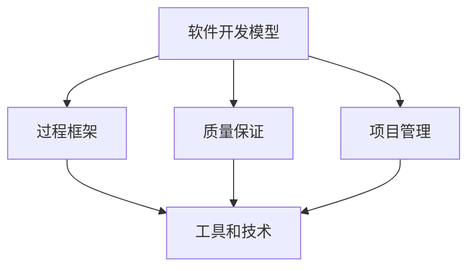

                 

# 软件工程的方法学体系介绍

## 1. 背景介绍

### 1.1 问题由来
软件工程作为一种系统化、规范化、工程化的软件开发方法，其发展已历经数十年的沧桑。从早期的瀑布模型到现在的敏捷开发、DevOps、微服务等新兴范式，软件工程不断演变，以适应新的技术挑战和市场需求。然而，在快速迭代的互联网时代，软件开发的复杂性和不确定性也在不断增加，对方法学的创新和优化提出了更高的要求。

### 1.2 问题核心关键点
软件工程方法学的核心关键点包括但不限于：

- 开发模型：描述软件开发过程的模型，如瀑布模型、迭代模型、增量模型等。
- 过程框架：提供一系列活动、角色和工件的标准化流程，如RUP（Rational Unified Process）。
- 质量保证：确保软件产品质量的一系列规范和标准，如CMMI（Capability Maturity Model Integration）。
- 项目管理：规划、执行、监控和控制项目资源、进度和成本的实践，如PMP（Project Management Professional）。
- 工具和技术：支持软件工程实践的各类工具和技术的集合，如版本控制系统、持续集成工具、自动化测试工具等。

这些关键点共同构成了软件工程的方法学体系，旨在提高软件开发效率、质量和安全，降低开发成本和风险。

### 1.3 问题研究意义
研究软件工程的方法学体系，对于提升软件开发质量、缩短开发周期、降低开发成本、提升软件可维护性和可扩展性，具有重要意义：

1. 提供标准化流程：使开发团队按照统一的标准和规范进行工作，提高软件项目的可预测性和一致性。
2. 提高开发效率：通过过程优化和自动化工具，减少手动工作量，加快开发速度。
3. 保障软件质量：通过严格的代码审查、测试和质量保证措施，提升软件产品的稳定性和可靠性。
4. 增强可维护性：通过模块化设计、代码注释和文档，提高软件的可维护性和可扩展性。
5. 支持敏捷开发：在快速变化的市场需求下，敏捷开发方法学提供了灵活、快速响应的开发框架。
6. 推动产业化应用：软件工程方法学的标准化和规范化，有助于软件产品的快速商业化。

## 2. 核心概念与联系

### 2.1 核心概念概述

为更好地理解软件工程的方法学体系，本节将介绍几个密切相关的核心概念：

- 软件开发模型：描述软件开发过程的模型，如瀑布模型、迭代模型、增量模型、敏捷开发模型等。
- 过程框架：提供一系列活动、角色和工件的标准化流程，如RUP、Scrum、XP（Extreme Programming）等。
- 质量保证：确保软件产品质量的一系列规范和标准，如CMMI、ISO 9126等。
- 项目管理：规划、执行、监控和控制项目资源、进度和成本的实践，如PMP、Scrum Master等。
- 工具和技术：支持软件工程实践的各类工具和技术的集合，如版本控制系统、持续集成工具、自动化测试工具等。

这些核心概念之间的逻辑关系可以通过以下Mermaid流程图来展示：



这个流程图展示了几类核心概念之间的相互关系：

1. 软件开发模型决定了项目开发的总体流程和结构。
2. 过程框架提供了具体的操作步骤和标准，指导开发团队执行开发任务。
3. 质量保证提供了软件质量的规范和标准，确保开发过程和结果的可靠性和可维护性。
4. 项目管理涉及项目的规划、执行和监控，确保项目按时按质完成。
5. 工具和技术提供了开发过程所需的各种支持手段，提高开发效率和质量。

## 3. 核心算法原理 & 具体操作步骤
### 3.1 算法原理概述

软件开发模型、过程框架、质量保证、项目管理、工具和技术等构成了软件工程方法学的核心要素。它们通过协同作用，共同支撑软件开发项目的成功实施。

### 3.2 算法步骤详解

软件开发模型的选择直接影响项目的流程和结构，以下以瀑布模型和敏捷开发模型为例，介绍不同模型下的具体步骤：

**瀑布模型步骤**：
1. 需求分析：与客户沟通，明确项目需求。
2. 设计：设计软件架构和模块结构。
3. 编码：按照设计文档进行编码实现。
4. 测试：对编码结果进行测试，发现并修复缺陷。
5. 维护：对软件进行持续维护和升级。

**敏捷开发模型步骤**：
1. 需求分析：与客户沟通，明确项目需求。
2. 迭代规划：制定迭代计划，划分为多个小的迭代周期。
3. 设计：对每个迭代进行设计，定义待完成的任务。
4. 编码：进行编码实现，并频繁进行代码审查。
5. 测试：对每个迭代进行测试，确保功能正确。
6. 发布：交付可用的软件版本。
7. 回顾与改进：对迭代过程进行回顾，总结经验教训，改进下一轮迭代。

### 3.3 算法优缺点

软件开发模型各有优缺点，主要如下：

- 瀑布模型优点：开发过程结构化、规范化，便于项目管理，交付结果相对稳定。
- 瀑布模型缺点：开发周期较长，变更难以灵活处理，难以应对需求变化。

- 敏捷开发模型优点：开发周期短，灵活应对需求变化，便于快速交付。
- 敏捷开发模型缺点：缺乏标准化流程，质量控制较难，依赖团队协作和自我管理。

### 3.4 算法应用领域

软件开发模型在各个应用领域都有广泛的应用，例如：

- 企业级软件开发：大型企业应用如ERP、CRM、BI等系统开发。
- 互联网应用开发：Web、移动应用、云服务等互联网项目开发。
- 嵌入式系统开发：嵌入式设备如物联网、工业控制、智能硬件等系统开发。
- 游戏开发：游戏引擎开发、3D渲染、用户界面设计等。
- 科学计算与模拟：高性能计算、科学数据分析、工程仿真等。

软件开发模型的选择应根据项目需求、规模、复杂度、团队协作方式等综合考虑。不同模型在不同领域的应用，展示了软件工程方法学体系的灵活性和适应性。

## 4. 数学模型和公式 & 详细讲解 & 举例说明

### 4.1 数学模型构建

软件开发模型的理论基础建立在数学模型之上，以描述开发过程和质量保证指标。

以瀑布模型为例，其核心指标包括：

- 缺陷密度：每千行代码中的缺陷数量。
- 缺陷修复率：新发现缺陷中修复的百分比。
- 开发周期：从需求分析到交付的周期时间。
- 项目成本：开发过程中的人力、物力、财力总和。

### 4.2 公式推导过程

缺陷密度公式：
$$ D = \frac{F}{L} $$
其中，$D$为缺陷密度，$F$为新发现的缺陷数量，$L$为代码行数。

缺陷修复率公式：
$$ C = \frac{R}{F} $$
其中，$C$为缺陷修复率，$R$为已修复的缺陷数量，$F$为总缺陷数量。

开发周期公式：
$$ T = \sum_{i=1}^{n} t_i $$
其中，$T$为总开发周期，$n$为迭代次数，$t_i$为第$i$次迭代的时间。

项目成本公式：
$$ C = \sum_{i=1}^{n} (p_i \cdot t_i) + c $$
其中，$C$为项目总成本，$p_i$为第$i$次迭代的人力成本，$t_i$为迭代时间，$c$为固定成本。

### 4.3 案例分析与讲解

某大型企业项目，使用瀑布模型进行软件开发。项目总预算为100万美元，开发周期为6个月，人力成本为每月20万美元。项目最终交付，缺陷密度为10个/千行代码，修复率为80%。

根据公式计算，实际缺陷数量为：
$$ F = \frac{D \cdot L}{10} = \frac{10 \cdot 1000}{10} = 1000 $$
实际修复缺陷数量为：
$$ R = C \cdot F \cdot \frac{1}{1 - D} = 20 \cdot 6 \cdot 12 \cdot \frac{1}{1 - 0.1} = 2880 $$

计算实际修复缺陷率为：
$$ C = \frac{R}{F} = \frac{2880}{1000} = 2.88 $$

计算项目总成本：
$$ C = 20 \cdot 6 \cdot 12 + 100 = 288 + 100 = 388 $$
项目实际超出预算28万美元。

通过这些公式，可以清楚地了解项目成本和质量指标的实际表现，便于项目管理团队进行优化和改进。

## 5. 项目实践：代码实例和详细解释说明
### 5.1 开发环境搭建

在进行软件开发模型实践前，我们需要准备好开发环境。以下是使用Python进行敏捷开发实践的环境配置流程：

1. 安装Python：从官网下载并安装Python，建议安装最新版本。
2. 安装Pip：执行命令`python -m ensurepip --default-pip`安装pip，用于安装第三方库。
3. 安装敏捷开发工具：如JIRA、Confluence、Bitbucket等，建议使用官方推荐的版本。

完成上述步骤后，即可在本地搭建起敏捷开发环境。

### 5.2 源代码详细实现

这里我们以敏捷开发中常用的Scrum框架为例，给出Scrum项目管理的Python代码实现。

首先，定义Scrum冲刺任务：

```python
class SprintTask:
    def __init__(self, id, name, description, owner, start_date, end_date):
        self.id = id
        self.name = name
        self.description = description
        self.owner = owner
        self.start_date = start_date
        self.end_date = end_date
        self.completed = False

    def complete(self):
        self.completed = True
        print(f"Task {self.id} completed on {self.end_date}")
```

然后，定义Scrum冲刺：

```python
class Sprint:
    def __init__(self, id, name, start_date, end_date):
        self.id = id
        self.name = name
        self.start_date = start_date
        self.end_date = end_date
        self.tasks = []
        self.completed = False

    def add_task(self, task):
        self.tasks.append(task)

    def complete(self):
        self.completed = True
        print(f"Sprint {self.id} completed on {self.end_date}")
```

接着，定义Scrum团队：

```python
class ScrumTeam:
    def __init__(self, name):
        self.name = name
        self.sprints = []
        self.current_sprint = None

    def add_sprint(self, sprint):
        self.sprints.append(sprint)

    def start_sprint(self, sprint):
        self.current_sprint = sprint
        sprint.start_date = datetime.date.today()
        print(f"Team {self.name} started sprint {sprint.id}")
```

最后，启动Scrum团队：

```python
team = ScrumTeam("Agile Development Team")
sprint = Sprint(1, "Sprint 1", datetime.date(2022, 1, 1), datetime.date(2022, 1, 31))
team.add_sprint(sprint)
team.start_sprint(sprint)
```

以上就是使用Python实现Scrum敏捷开发框架的完整代码。可以看到，通过定义冲刺任务、冲刺和团队，我们可以灵活管理敏捷项目，快速响应客户需求，提高开发效率。

### 5.3 代码解读与分析

让我们再详细解读一下关键代码的实现细节：

**SprintTask类**：
- `__init__`方法：初始化任务的基本信息。
- `complete`方法：标记任务完成，输出完成信息。

**Sprint类**：
- `__init__`方法：初始化冲刺的基本信息。
- `add_task`方法：将任务添加到冲刺中。
- `complete`方法：标记冲刺完成，输出完成信息。

**ScrumTeam类**：
- `__init__`方法：初始化团队信息。
- `add_sprint`方法：将冲刺添加到团队中。
- `start_sprint`方法：启动当前冲刺，设置开始日期，输出启动信息。

在实际使用中，可以根据项目需求和团队协作方式，灵活调整代码中的数据结构和处理方法。敏捷开发框架的代码实现，充分展示了软件开发模型的标准化和规范化，以及通过工具和技术提高开发效率的能力。

## 6. 实际应用场景
### 6.1 软件项目管理

敏捷开发模型在软件项目管理中的应用非常广泛。敏捷项目管理注重团队协作、持续交付和客户满意度，通过迭代和反馈循环，快速响应市场变化，提升开发效率和质量。

在技术实现上，敏捷项目管理主要通过Scrum、Kanban、XP等框架，辅助开发团队制定计划、追踪进度、管理任务，以实现项目的高效管理和交付。敏捷项目管理工具如JIRA、Confluence、Trello等，为团队协作和信息共享提供了强大的支持，使项目管理和跟踪变得更加直观和透明。

### 6.2 持续集成与持续部署

持续集成与持续部署（CI/CD）是敏捷开发的重要组成部分，旨在通过自动化测试和部署，提升软件交付速度和质量。

具体实践包括：
1. 代码提交自动化测试，确保代码质量。
2. 自动化构建和部署，快速交付软件更新。
3. 集成CI/CD工具如Jenkins、GitLab CI/CD、CircleCI等，实现自动化流水线管理。

在持续集成与持续部署中，敏捷开发模型通过快速迭代和持续反馈，确保软件系统的高可用性和稳定性。CI/CD工具的引入，进一步提高了开发效率和交付质量，减少了手动工作量，降低了出错风险。

### 6.3 DevOps和容器化

DevOps（Development and Operations）强调开发与运维的协同工作，通过自动化工具和流程，提升软件系统的构建、测试、部署、监控等各个环节的效率。

容器化技术如Docker、Kubernetes，为DevOps实践提供了强大的技术支持，通过统一的标准和规范，提升了跨平台和跨团队协作的灵活性。

DevOps和容器化技术的引入，使软件开发过程更加自动化、标准化和高效化，有助于构建更稳定、可靠和可扩展的软件系统。

### 6.4 未来应用展望

随着软件开发模型的不断发展，敏捷开发、CI/CD、DevOps、容器化等新兴范式在各行各业得到了广泛应用，推动了软件技术的快速迭代和产业化进程。

在智慧城市治理中，敏捷开发和持续集成技术使得城市管理系统的快速迭代和持续优化成为可能，提升了城市管理的自动化和智能化水平。

在智能制造领域，敏捷开发和DevOps技术推动了工业4.0的进程，提升了制造业的数字化、网络化和智能化水平。

在互联网应用开发中，敏捷开发和持续集成技术提升了产品交付速度和质量，满足了快速变化的客户需求。

未来，软件开发模型的应用还将不断拓展，进一步推动各行各业的数字化转型和智能化升级。

## 7. 工具和资源推荐
### 7.1 学习资源推荐

为了帮助开发者系统掌握软件开发模型的理论基础和实践技巧，这里推荐一些优质的学习资源：

1. 《软件工程：一种实践方法》（Rational Software Development, Inc.）：系统介绍了软件开发模型的理论基础和实践方法。
2. 《敏捷软件开发：原则、模式与实践》（Robert C. Martin）：详细讲解了敏捷开发的基本原则和实践。
3. 《持续集成：构建、测试、部署自动化》（Fleming Conrath）：介绍了持续集成和持续部署的核心思想和实践方法。
4. 《DevOps：持续交付和架构优化》（Jez Humble、David Farley）：探讨了DevOps在软件交付中的作用和实践。
5. 《容器化实践》（Docker官方文档）：详细介绍了Docker和Kubernetes等容器化技术的实践方法和最佳实践。

通过对这些资源的学习实践，相信你一定能够快速掌握软件开发模型的精髓，并用于解决实际的开发问题。

### 7.2 开发工具推荐

高效的开发离不开优秀的工具支持。以下是几款用于软件开发模型开发的常用工具：

1. JIRA：敏捷项目管理工具，支持Scrum、Kanban、XP等敏捷框架，提供任务管理、进度追踪、协作交流等功能。
2. Confluence：文档协作工具，支持敏捷文档管理和版本控制，提供团队协作和知识共享的平台。
3. Bitbucket：代码托管平台，支持Git和SVN等版本控制系统，提供代码审查、问题跟踪、代码统计等功能。
4. Jenkins：持续集成工具，支持多种CI/CD插件，支持自动化构建、测试、部署和监控。
5. GitLab CI/CD：开源持续集成工具，提供强大的自动化测试和部署功能，支持CI/CD流水线管理。
6. CircleCI：持续集成工具，提供高效的自动化测试和部署功能，支持多种编程语言和框架。
7. Docker：容器化技术，提供轻量级、可移植的开发环境，支持自动化构建、部署和监控。
8. Kubernetes：容器编排工具，支持多节点的自动化集群管理和容器编排，提供强大的可扩展性和高可用性。

合理利用这些工具，可以显著提升软件开发模型的开发效率，加快创新迭代的步伐。

### 7.3 相关论文推荐

软件开发模型的发展源于学界的持续研究。以下是几篇奠基性的相关论文，推荐阅读：

1. The Unified Process（Rational Software Development, Inc.）：提出了统一过程，结合了瀑布模型和敏捷开发模型，提供了全面的开发流程和实践方法。
2. Agile Software Development: Principles, Patterns, and Practices（Robert C. Martin）：详细介绍了敏捷开发的基本原则和实践方法，被广泛认为是敏捷开发理论的奠基之作。
3. Continuous Integration/Continuous Deployment: Foundations of Software Delivery: Strategies, Patterns, and Tools（Fleming Conrath）：探讨了持续集成和持续部署的核心思想和实践方法，强调了自动化和快速交付的重要性。
4. The DevOps Handbook（Jez Humble、David Farley）：总结了DevOps在软件开发和运维中的应用实践，提供了系统化的DevOps实施指南。
5. Docker: The Definitive Guide（Docker官方文档）：详细介绍了Docker容器化技术的实践方法和最佳实践，提供了Docker的安装、配置和使用指南。
6. Kubernetes: Up and Running（Heathern-Paul aggregate）：介绍了Kubernetes容器编排技术的实践方法和最佳实践，提供了Kubernetes的安装、配置和使用指南。

这些论文代表了大规模开发模型和微调技术的进展脉络。通过学习这些前沿成果，可以帮助研究者把握学科前进方向，激发更多的创新灵感。

## 8. 总结：未来发展趋势与挑战

### 8.1 总结

本文对软件开发模型的方法学体系进行了全面系统的介绍。首先阐述了软件开发模型的研究背景和意义，明确了软件开发模型对提升软件开发质量、缩短开发周期、降低开发成本、提升软件可维护性和可扩展性的重要价值。其次，从原理到实践，详细讲解了软件开发模型的核心要素，包括开发模型、过程框架、质量保证、项目管理、工具和技术等，并给出了详细的代码实例。同时，本文还广泛探讨了软件开发模型在敏捷开发、持续集成、DevOps、容器化等领域的广泛应用前景。

通过本文的系统梳理，可以看到，软件开发模型的研究和发展在快速变化的市场需求和技术挑战中，始终保持着活跃和创新。未来，软件开发模型的理论和实践将不断进步，为构建高质量、高可靠性的软件系统提供有力支持。

### 8.2 未来发展趋势

展望未来，软件开发模型的发展趋势主要体现在以下几个方面：

1. 敏捷开发的主流化：敏捷开发已经成为软件开发的主流范式，未来将进一步细化和优化，如Scrum、Kanban、XP等敏捷框架将得到更广泛的应用。
2. DevOps的普及化：DevOps将贯穿软件开发的全生命周期，通过自动化工具和流程，提升软件系统的构建、测试、部署、监控等环节的效率和质量。
3. 容器化的全面化：容器化技术将广泛应用于软件开发、运维和部署的各个环节，推动微服务的广泛应用和微服务架构的成熟。
4. 持续集成和持续部署的深度化：持续集成和持续部署将成为软件开发的重要实践，通过自动化测试和部署，提升软件交付速度和质量。
5. 微服务的普及化：微服务架构将取代传统的单体架构，成为未来软件开发的主流模式，提升系统的可维护性和可扩展性。
6. 自动化工具的智能化：自动化工具将进一步智能化，通过机器学习、AI等技术，提升软件开发和运维的效率和质量。
7. 软件测试的全面化：软件测试将贯穿软件开发的全生命周期，通过自动化测试、性能测试、安全测试等，确保软件系统的质量和可靠性。

这些趋势凸显了软件开发模型在快速变化的市场需求和技术挑战中的重要地位，必将推动软件技术不断进步，提升软件开发质量和效率。

### 8.3 面临的挑战

尽管软件开发模型已经取得了瞩目成就，但在迈向更加智能化、普适化应用的过程中，它仍面临着诸多挑战：

1. 敏捷开发的不一致性：敏捷开发依赖团队协作和自我管理，但在不同团队和项目中，敏捷开发的实践方式和工具选择往往不一致，导致质量控制和标准难以统一。
2. DevOps的复杂性：DevOps涉及开发、测试、运维等多个环节，如何实现高效协作和自动化，仍是DevOps实践中的一大难题。
3. 容器化的资源限制：容器化技术虽然提升了开发和部署效率，但需要一定的硬件资源支持，对资源有限的团队和个人来说，可能存在一定的成本门槛。
4. 持续集成的规模化：持续集成需要处理大量的代码和测试数据，如何在保证质量的同时，提高效率，仍是持续集成实践中的一大挑战。
5. 微服务的复杂性：微服务架构虽然提升了系统的可维护性和可扩展性，但也带来了复杂性管理和系统集成的问题。
6. 自动化工具的局限性：自动化工具虽然提升了开发效率，但在处理复杂问题、高并发场景时，仍存在一定的局限性。
7. 测试的全面性：软件测试需要覆盖各个环节，但在测试方法、测试工具和测试标准上，仍存在一定的差异和不足。

面对这些挑战，软件开发模型的未来发展需要在方法学、工具、实践等方面进行持续创新和优化，以应对不断变化的市场和技术需求。

### 8.4 研究展望

面对软件开发模型的未来发展，需要在以下几个方面进行深入研究和探索：

1. 敏捷开发的标准化：进一步细化和标准化敏捷开发实践，推动敏捷开发在各行业中的广泛应用。
2. DevOps的深度整合：通过自动化工具和流程，实现DevOps在软件开发和运维中的深度整合，提升软件系统的构建、测试、部署、监控等环节的效率和质量。
3. 容器化的优化：进一步优化容器化技术的性能和灵活性，降低资源成本，推动容器化在各行业中的普及应用。
4. 持续集成的优化：优化持续集成工具和流程，提升持续集成的效率和质量，支持大规模、高并发的软件构建和部署。
5. 微服务的优化：优化微服务架构的设计和实现，提升系统的可维护性和可扩展性，解决微服务的复杂性和系统集成问题。
6. 自动化工具的智能化：进一步智能化自动化工具，通过机器学习、AI等技术，提升软件开发和运维的效率和质量。
7. 测试的全面化：推动软件测试的全面化，通过自动化测试、性能测试、安全测试等，确保软件系统的质量和可靠性。

这些研究方向的探索，必将引领软件开发模型的未来发展，为构建高质量、高可靠性的软件系统提供有力支持。相信随着学界和产业界的共同努力，软件开发模型必将不断进步，推动软件技术在各行各业中的广泛应用和深入发展。

## 9. 附录：常见问题与解答

**Q1：软件开发模型有哪些种类？**

A: 软件开发模型主要包括瀑布模型、敏捷开发模型、增量模型、迭代模型等。瀑布模型适用于需求明确、规模较小的项目，敏捷开发模型适用于需求变化频繁、规模较大的项目，增量模型和迭代模型则综合了瀑布模型和敏捷开发的优点，适用于需求变化不确定的项目。

**Q2：软件开发模型的核心要素有哪些？**

A: 软件开发模型的核心要素包括开发模型、过程框架、质量保证、项目管理、工具和技术等。开发模型决定开发流程和结构，过程框架提供详细步骤和标准，质量保证确保软件质量，项目管理规划和控制项目资源，工具和技术提供开发支持。

**Q3：软件开发模型在实际应用中需要注意哪些问题？**

A: 软件开发模型在实际应用中需要注意以下问题：
1. 团队协作：确保团队成员对开发模型和过程框架有充分的理解和认同，建立良好的沟通和协作机制。
2. 质量控制：定期进行代码审查、测试和质量保证，确保软件质量。
3. 持续改进：根据项目反馈和市场变化，持续优化开发模型和过程框架。
4. 工具选择：选择合适的工具和插件，提高开发效率和质量。
5. 用户参与：与客户和用户保持紧密沟通，确保软件符合用户需求。

通过关注这些问题，可以更好地应用软件开发模型，提升软件开发和交付的质量和效率。

**Q4：敏捷开发的优势和劣势是什么？**

A: 敏捷开发的优势主要体现在以下几个方面：
1. 快速响应：敏捷开发通过快速迭代和持续反馈，能够快速响应市场需求和客户反馈，提升开发效率。
2. 灵活性高：敏捷开发允许项目在需求变化时进行灵活调整，适应性强。
3. 团队协作：敏捷开发依赖团队协作和自我管理，提高团队协作效率和创新能力。

敏捷开发的劣势主要体现在以下几个方面：
1. 不一致性：不同团队和项目的敏捷开发实践方式和工具选择可能不一致，导致质量控制和标准难以统一。
2. 成本较高：敏捷开发需要频繁的沟通和协作，可能增加项目成本和复杂度。
3. 风险高：敏捷开发对团队和项目管理的依赖较高，风险控制较难。

## 总结

本文对软件开发模型的原理、核心要素、具体操作步骤和应用场景进行了全面系统的介绍。通过深入分析和探讨，揭示了软件开发模型的重要性和未来发展趋势，提出了敏捷开发、持续集成、DevOps、容器化等新兴范式在实际应用中的关键问题和解决方案。相信通过本文的学习和实践，读者能够更好地掌握软件开发模型的理论基础和实践技巧，为实际项目开发提供有力支持。

作者：禅与计算机程序设计艺术 / Zen and the Art of Computer Programming

