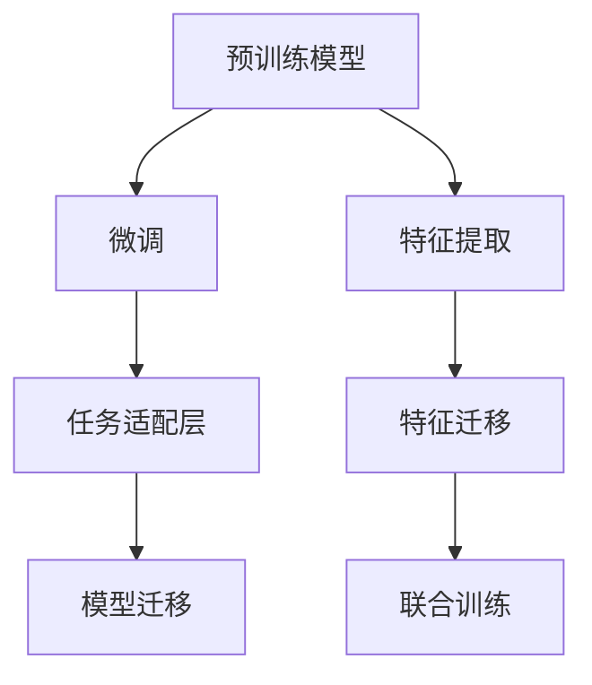

                 

# 迁移学习：提高AI模型效率的有效途径

## 1. 背景介绍

### 1.1 问题由来

迁移学习（Transfer Learning）是指利用在一个任务上学到的知识，在另一个相关的任务中进行应用的机器学习技术。这一方法广泛应用于各类人工智能应用中，如计算机视觉、自然语言处理、语音识别等。其核心思想是通过已学习到的知识，在数据量较小的情况下，快速提升模型在新任务上的表现。

随着深度学习技术的不断发展，各种预训练模型（Pre-trained Models）如BERT、GPT等在自然语言处理（NLP）领域取得了突破性的成果。然而，尽管这些模型在某些特定任务上表现优异，但从头训练一个大模型往往需要大量的数据和计算资源，且训练周期较长，这在实际应用中是不现实的。迁移学习提供了一种更高效的方法，使得模型可以在小规模数据上快速适应新的任务。

### 1.2 问题核心关键点

迁移学习的主流范式包括模型迁移、特征迁移和联合训练等。其中，模型迁移和特征迁移是针对模型和特征分别进行的迁移学习，而联合训练则是在同一模型上进行训练，从而共享不同任务之间的知识。下面，我们重点介绍模型迁移和特征迁移两种常用方法。

1. **模型迁移（Model Transfer）**：
   - **方法**：将在大规模数据集上预训练好的模型，作为新任务的基础模型。通过微调（Fine-tuning）该模型的部分参数，使其能够在新任务上进行学习。
   - **优点**：节省了大量训练时间，减少了对数据量的依赖。
   - **缺点**：迁移后的模型可能存在数据不匹配、任务不相关等问题，需要仔细选择合适的预训练模型。

2. **特征迁移（Feature Transfer）**：
   - **方法**：在新任务中使用预训练模型的中间特征表示作为输入，使用自己的任务适配层进行微调。
   - **优点**：保留了预训练模型对大语义的理解，不需要从头开始学习。
   - **缺点**：对数据分布的匹配要求较高，需要精心设计任务适配层。

迁移学习已经成为机器学习领域中不可或缺的一部分，特别是在资源有限或数据难以获取的情况下，迁移学习能够显著提高模型的效率和效果。

### 1.3 问题研究意义

迁移学习不仅在学术界得到了广泛研究，在工业界也得到了广泛应用。其主要意义在于：

1. **提升模型效率**：通过迁移学习，模型可以在短时间内适应新任务，减少了从头训练所需的时间和资源。
2. **降低训练成本**：不需要从头开始训练模型，降低了对大量标注数据和计算资源的依赖。
3. **促进知识共享**：通过迁移学习，不同任务之间的知识得以共享，促进了知识的传播和应用。
4. **提高模型泛化能力**：迁移学习帮助模型在未见过的数据上表现更好，提升了模型的泛化能力。
5. **加速创新**：迁移学习为快速开发和部署新应用提供了可能，加速了人工智能技术的产业化进程。

## 2. 核心概念与联系

### 2.1 核心概念概述

为了更好地理解迁移学习的方法，我们首先介绍几个关键的概念：

- **预训练模型（Pre-trained Models）**：通过在大规模数据集上进行无监督学习，学习到丰富的语言或图像知识，作为迁移学习的基础。
- **微调（Fine-tuning）**：在预训练模型的基础上，通过小规模数据集进行有监督学习，优化模型在新任务上的性能。
- **任务适配层（Task-specific Layer）**：针对具体任务设计的网络层，用于调整预训练模型输出的特征表示。
- **特征提取（Feature Extraction）**：利用预训练模型提取特征表示，再通过任务适配层进行微调。
- **联合训练（Joint Training）**：在同一模型上进行训练，共享不同任务之间的知识。

这些概念之间的联系可以通过以下Mermaid流程图来展示：



这个流程图展示了迁移学习的核心概念及其关系：

1. 预训练模型通过在大规模数据集上学习通用特征，作为迁移学习的基础。
2. 微调通过小规模数据集进一步优化模型，使其适应新任务。
3. 特征提取利用预训练模型提取特征表示，通过任务适配层进行微调。
4. 模型迁移将预训练模型作为新任务的基础模型，通过微调进一步优化。
5. 联合训练在同一模型上进行训练，共享不同任务之间的知识。

## 3. 核心算法原理 & 具体操作步骤

### 3.1 算法原理概述

迁移学习的核心原理是通过已有知识来提升模型在新任务上的表现。其基本流程如下：

1. **预训练阶段**：在大型数据集上训练预训练模型，学习通用的语言或图像表示。
2. **迁移阶段**：在目标任务的数据集上，使用预训练模型作为初始化参数，进行微调。
3. **任务适配**：根据目标任务的需求，设计任务适配层，进一步调整模型参数。

### 3.2 算法步骤详解

以下是迁移学习的一般步骤：

1. **准备预训练模型和数据集**：
   - 选择适合的预训练模型，如BERT、GPT等。
   - 准备目标任务的数据集，并进行预处理，如分词、归一化等。

2. **微调参数**：
   - 冻结预训练模型的部分层，只微调顶层参数。
   - 设置微调超参数，如学习率、批大小、迭代轮数等。
   - 选择优化算法，如Adam、SGD等。

3. **设计任务适配层**：
   - 根据目标任务的类型，设计合适的任务适配层。
   - 对于分类任务，使用全连接层进行输出。
   - 对于生成任务，使用解码器进行预测。

4. **执行微调**：
   - 使用训练集数据进行微调。
   - 周期性在验证集上评估模型性能。
   - 根据评估结果调整学习率、批大小等超参数。

5. **测试和部署**：
   - 在测试集上评估微调后模型的性能。
   - 使用微调后的模型进行推理预测。
   - 定期更新模型，以适应数据分布的变化。

### 3.3 算法优缺点

迁移学习的优点包括：

1. **高效**：通过迁移学习，模型可以在小规模数据集上进行微调，大大节省了训练时间和计算资源。
2. **鲁棒性**：预训练模型已经学习到通用的特征表示，能够很好地适应各种不同的任务。
3. **泛化能力**：预训练模型已经在大量数据上进行了训练，具有较强的泛化能力，能够在未见过的数据上表现良好。

迁移学习的缺点包括：

1. **依赖预训练数据**：预训练模型的性能很大程度上取决于其预训练数据的质量和多样性。
2. **可能过拟合**：尽管微调的参数较少，但在小规模数据集上仍有可能出现过拟合的问题。
3. **数据不匹配**：预训练模型在不同任务上的适应性可能有限，需要进行仔细选择。

### 3.4 算法应用领域

迁移学习在多个领域都有广泛应用，例如：

1. **计算机视觉**：利用在大规模图像数据上预训练的模型，在目标任务上进行微调，如目标检测、图像分类等。
2. **自然语言处理**：利用在大规模文本数据上预训练的模型，在目标任务上进行微调，如文本分类、情感分析、机器翻译等。
3. **语音识别**：利用在大规模语音数据上预训练的模型，在目标任务上进行微调，如语音识别、情感分析等。
4. **推荐系统**：利用在大规模用户行为数据上预训练的模型，在目标任务上进行微调，如个性化推荐、用户画像等。

## 4. 数学模型和公式 & 详细讲解

### 4.1 数学模型构建

迁移学习的数学模型可以表示为：

$$
\theta^* = \mathop{\arg\min}_{\theta} \mathcal{L}(\theta, D_t)
$$

其中，$\theta$ 为模型的参数，$D_t$ 为目标任务的训练数据集，$\mathcal{L}$ 为目标任务的损失函数。目标任务的损失函数通常为交叉熵损失、均方误差损失等。

### 4.2 公式推导过程

以分类任务为例，假设目标任务为二分类，则目标任务的损失函数为：

$$
\ell(\hat{y}, y) = -(y\log \hat{y} + (1-y)\log (1-\hat{y}))
$$

其中，$\hat{y}$ 为模型的预测概率，$y$ 为真实标签。

假设预训练模型的输出为 $M(x)$，则目标任务的损失函数可以表示为：

$$
\mathcal{L}(\theta, D_t) = -\frac{1}{N}\sum_{i=1}^N \ell(M(x_i), y_i)
$$

在微调过程中，通常使用Adam、SGD等优化算法进行参数更新，其公式为：

$$
\theta \leftarrow \theta - \eta \nabla_{\theta}\mathcal{L}(\theta, D_t)
$$

其中，$\eta$ 为学习率，$\nabla_{\theta}\mathcal{L}(\theta, D_t)$ 为目标任务的损失函数对模型参数的梯度。

### 4.3 案例分析与讲解

以文本分类任务为例，假设我们使用了BERT模型作为预训练模型，并在目标任务上进行微调。具体步骤如下：

1. **准备数据集**：准备文本分类任务的数据集，并进行预处理，如分词、转换为向量表示。
2. **冻结预训练模型参数**：冻结BERT模型的前若干层，只微调顶层参数。
3. **设计任务适配层**：设计全连接层，输出二维向量，用于进行分类。
4. **执行微调**：在训练集上使用微调后的模型进行训练，周期性在验证集上评估模型性能。
5. **测试和部署**：在测试集上评估微调后模型的性能，并进行推理预测。

## 5. 项目实践：代码实例和详细解释说明

### 5.1 开发环境搭建

在进行迁移学习项目实践前，我们需要准备好开发环境。以下是使用Python进行TensorFlow开发的环境配置流程：

1. 安装Anaconda：从官网下载并安装Anaconda，用于创建独立的Python环境。
2. 创建并激活虚拟环境：
   ```bash
   conda create -n tf-env python=3.8 
   conda activate tf-env
   ```
3. 安装TensorFlow：根据CUDA版本，从官网获取对应的安装命令。例如：
   ```bash
   conda install tensorflow-gpu=2.7
   ```

4. 安装各类工具包：
   ```bash
   pip install numpy pandas scikit-learn matplotlib tqdm jupyter notebook ipython
   ```

完成上述步骤后，即可在`tf-env`环境中开始迁移学习实践。

### 5.2 源代码详细实现

下面我们以文本分类任务为例，给出使用TensorFlow对BERT模型进行迁移学习的PyTorch代码实现。

首先，定义文本分类的数据处理函数：

```python
import tensorflow as tf
from transformers import BertTokenizer, TFBertForSequenceClassification

class TextClassificationDataset(tf.data.Dataset):
    def __init__(self, texts, labels, tokenizer, max_len=128):
        self.texts = texts
        self.labels = labels
        self.tokenizer = tokenizer
        self.max_len = max_len
        
    def __len__(self):
        return len(self.texts)
    
    def __getitem__(self, item):
        text = self.texts[item]
        label = self.labels[item]
        
        encoding = self.tokenizer(text, truncation=True, max_length=self.max_len, return_tensors='tf')
        input_ids = encoding['input_ids']
        attention_mask = encoding['attention_mask']
        return {
            'input_ids': input_ids,
            'attention_mask': attention_mask,
            'labels': label
        }
```

然后，定义模型和优化器：

```python
model = TFBertForSequenceClassification.from_pretrained('bert-base-cased', num_labels=2)

optimizer = tf.keras.optimizers.AdamW(learning_rate=2e-5, epsilon=1e-08, clipnorm=1.0)
```

接着，定义训练和评估函数：

```python
def train_step(inputs, labels):
    with tf.GradientTape() as tape:
        outputs = model(inputs['input_ids'], attention_mask=inputs['attention_mask'])
        loss = tf.keras.losses.SparseCategoricalCrossentropy(from_logits=True)(labels, outputs.logits)
    grads = tape.gradient(loss, model.trainable_variables)
    optimizer.apply_gradients(zip(grads, model.trainable_variables))

def evaluate(model, dataset):
    correct_predictions = 0
    total_predictions = 0
    for batch in dataset:
        inputs = batch
        outputs = model(inputs['input_ids'], attention_mask=inputs['attention_mask'])
        predictions = tf.argmax(outputs.logits, axis=1)
        labels = inputs['labels']
        correct_predictions += tf.reduce_sum(tf.cast(tf.equal(predictions, labels), dtype=tf.int32))
        total_predictions += inputs['labels'].shape[0]
    return correct_predictions.numpy() / total_predictions.numpy()

# 训练过程
epochs = 5
batch_size = 16

for epoch in range(epochs):
    total_loss = 0
    total_correct = 0
    for batch in dataset:
        train_step(batch, batch['labels'])
        total_loss += loss.numpy()
        total_correct += correct_predictions.numpy()
    print(f'Epoch {epoch+1}, train loss: {total_loss / len(dataset)}, train acc: {total_correct / len(dataset) / batch_size}')

    dev_correct = evaluate(model, dev_dataset)
    print(f'Epoch {epoch+1}, dev acc: {dev_correct}')

# 测试过程
test_correct = evaluate(model, test_dataset)
print(f'Test acc: {test_correct}')
```

以上就是使用TensorFlow对BERT进行文本分类任务迁移学习的完整代码实现。可以看到，借助TensorFlow和Transformer库，迁移学习的实现变得简单高效。

### 5.3 代码解读与分析

让我们再详细解读一下关键代码的实现细节：

**TextClassificationDataset类**：
- `__init__`方法：初始化文本、标签、分词器等关键组件。
- `__len__`方法：返回数据集的样本数量。
- `__getitem__`方法：对单个样本进行处理，将文本输入转换为向量表示，并返回模型所需的输入。

**模型和优化器**：
- 使用TFBertForSequenceClassification加载预训练的BERT模型，并设定输出类别数。
- 使用AdamW优化器，并设置学习率、epsilon、clipnorm等超参数。

**训练和评估函数**：
- `train_step`函数：进行前向传播计算损失，反向传播计算梯度，并使用优化器更新模型参数。
- `evaluate`函数：对模型进行评估，计算预测准确率。

**训练过程**：
- 循环迭代epochs，在每个epoch内，循环迭代数据集。
- 在每个batch上，调用`train_step`函数进行训练，并记录损失和准确率。
- 在每个epoch结束后，在验证集上评估模型性能。

**测试过程**：
- 在测试集上调用`evaluate`函数，计算最终评估指标。

通过以上代码，可以看到，TensorFlow和Transformer库的结合使得迁移学习的代码实现变得简洁高效。开发者可以更加专注于数据处理和模型改进等高层逻辑。

当然，工业级的系统实现还需考虑更多因素，如模型的保存和部署、超参数的自动搜索、更灵活的任务适配层等。但核心的迁移学习范式基本与此类似。

## 6. 实际应用场景

### 6.1 智能客服系统

迁移学习在智能客服系统中得到了广泛应用。传统的客服系统依赖人工客服，存在响应时间长、服务质量不稳定等问题。迁移学习技术可以将预训练的聊天模型微调为新场景的客服模型，使其能够快速理解用户意图，提供个性化服务，显著提升客户体验和问题解决效率。

在技术实现上，可以收集企业内部的客服对话记录，将其标注为问题-回答对，并在此基础上对预训练模型进行微调。微调后的模型能够自动理解用户意图，匹配最合适的答案模板进行回复。对于新问题，还可以接入检索系统实时搜索相关内容，动态组织生成回答。

### 6.2 金融舆情监测

金融领域对实时舆情监测的需求极高，需要快速响应市场动态，规避金融风险。迁移学习技术可以应用于金融舆情监测中，通过微调预训练模型，使其能够自动判断文本属于何种主题，情感倾向是正面、中性还是负面。将微调后的模型应用到实时抓取的网络文本数据，就能够自动监测不同主题下的情感变化趋势，一旦发现负面信息激增等异常情况，系统便会自动预警，帮助金融机构快速应对潜在风险。

### 6.3 个性化推荐系统

现有的推荐系统往往只依赖用户的历史行为数据进行物品推荐，无法深入理解用户的真实兴趣偏好。迁移学习技术可以应用于个性化推荐系统中，通过微调预训练模型，使其能够从文本内容中准确把握用户的兴趣点。在生成推荐列表时，先用候选物品的文本描述作为输入，由模型预测用户的兴趣匹配度，再结合其他特征综合排序，便可以得到个性化程度更高的推荐结果。

### 6.4 未来应用展望

随着迁移学习技术的发展，未来将在更多领域得到应用，为各行各业带来变革性影响。

在智慧医疗领域，基于迁移学习技术构建的诊断系统，可以通过微调预训练模型，学习医学知识，辅助医生诊疗，加速新药开发进程。

在智能教育领域，迁移学习技术可以应用于作业批改、学情分析、知识推荐等方面，因材施教，促进教育公平，提高教学质量。

在智慧城市治理中，迁移学习技术可以应用于城市事件监测、舆情分析、应急指挥等环节，提高城市管理的自动化和智能化水平，构建更安全、高效的未来城市。

此外，在企业生产、社会治理、文娱传媒等众多领域，迁移学习技术也将不断涌现，为经济社会发展注入新的动力。相信随着技术的日益成熟，迁移学习技术将成为人工智能落地应用的重要范式，推动人工智能技术在更广阔的应用领域大放异彩。

## 7. 工具和资源推荐

### 7.1 学习资源推荐

为了帮助开发者系统掌握迁移学习理论基础和实践技巧，这里推荐一些优质的学习资源：

1. **《Deep Learning with Python》**：由François Chollet所写，详细介绍了深度学习的基本原理和TensorFlow的用法。
2. **CS231n《Convolutional Neural Networks for Visual Recognition》**：斯坦福大学开设的计算机视觉课程，内容全面且深入，涵盖了图像分类、目标检测、图像分割等任务。
3. **《Hands-On Machine Learning with Scikit-Learn and TensorFlow》**：O'Reilly出版的书籍，介绍了Scikit-Learn和TensorFlow的用法，通过多个实例演示了迁移学习的应用。
4. **Kaggle平台**：提供丰富的数据集和竞赛项目，是学习和实践迁移学习技术的绝佳平台。
5. **Transformers官方文档**：提供了丰富的预训练模型和迁移学习样例，是实践迁移学习的重要资源。

通过对这些资源的学习实践，相信你一定能够快速掌握迁移学习精髓，并用于解决实际的机器学习问题。

### 7.2 开发工具推荐

高效的开发离不开优秀的工具支持。以下是几款用于迁移学习开发的常用工具：

1. **TensorFlow**：由Google主导开发的深度学习框架，生产部署方便，适合大规模工程应用。
2. **PyTorch**：基于Python的开源深度学习框架，灵活且易于扩展，适用于研究和实验。
3. **Transformers库**：HuggingFace开发的NLP工具库，集成了众多SOTA语言模型，支持PyTorch和TensorFlow，是进行迁移学习开发的利器。
4. **Weights & Biases**：模型训练的实验跟踪工具，可以记录和可视化模型训练过程中的各项指标，方便对比和调优。
5. **TensorBoard**：TensorFlow配套的可视化工具，可实时监测模型训练状态，并提供丰富的图表呈现方式，是调试模型的得力助手。
6. **Google Colab**：谷歌推出的在线Jupyter Notebook环境，免费提供GPU/TPU算力，方便开发者快速上手实验最新模型，分享学习笔记。

合理利用这些工具，可以显著提升迁移学习任务的开发效率，加快创新迭代的步伐。

### 7.3 相关论文推荐

迁移学习在机器学习领域的研究历史悠久，以下是几篇奠基性的相关论文，推荐阅读：

1. **Transfer Learning via Adaptive Feature Extraction**：提出了特征迁移的思想，通过在预训练模型的中间层进行微调，实现迁移学习。
2. **Pre-Trained Word Embeddings**：提出了Word2Vec和GloVe等预训练词向量模型，为自然语言处理任务提供了良好的特征表示。
3. **Fine-tune your network: Improve the feature representation**：介绍了微调的原理和步骤，是迁移学习的重要参考资料。
4. **ImageNet Classification with Deep Convolutional Neural Networks**：提出了在大规模数据集上进行预训练的方法，为深度学习提供了重要的思路。
5. **ImageNet Large Scale Visual Recognition Challenge**：介绍了ImageNet数据集和预训练模型的实验，为图像识别任务提供了基准数据和模型。

这些论文代表了大迁移学习技术的发展脉络。通过学习这些前沿成果，可以帮助研究者把握学科前进方向，激发更多的创新灵感。

## 8. 总结：未来发展趋势与挑战

### 8.1 总结

本文对迁移学习的基本原理、算法步骤和应用实践进行了全面系统的介绍。首先阐述了迁移学习的核心思想和研究意义，明确了迁移学习在模型优化、资源利用和应用推广方面的独特价值。其次，从原理到实践，详细讲解了迁移学习的数学原理和关键步骤，给出了迁移学习任务开发的完整代码实例。同时，本文还广泛探讨了迁移学习在智能客服、金融舆情、个性化推荐等多个行业领域的应用前景，展示了迁移学习的巨大潜力。此外，本文精选了迁移学习的各类学习资源，力求为读者提供全方位的技术指引。

通过本文的系统梳理，可以看到，迁移学习已经成为机器学习领域的重要范式，通过已有知识来提升模型在新任务上的表现，极大地提高了模型的效率和效果。未来，随着迁移学习技术的发展，将有更多领域受益于这一强大的技术手段。

### 8.2 未来发展趋势

展望未来，迁移学习技术将呈现以下几个发展趋势：

1. **迁移学习范式的多样化**：除了传统的迁移学习外，未来将涌现更多高效、灵活的迁移方法，如对抗迁移、跨模态迁移等。
2. **大规模预训练模型的应用**：随着计算资源的不断提升，大规模预训练模型将逐渐成为迁移学习的基础，提升模型的泛化能力和性能。
3. **迁移学习与其他AI技术结合**：迁移学习将与其他AI技术（如强化学习、多任务学习）结合，形成更加综合、高效的学习方法。
4. **迁移学习的自动化**：随着自动化机器学习（AutoML）技术的发展，迁移学习将逐渐自动化，降低人工调参的复杂度。
5. **迁移学习的伦理和社会责任**：随着迁移学习技术的广泛应用，伦理和社会责任问题将逐渐凸显，需要在模型设计和应用中加以考虑。

以上趋势凸显了迁移学习技术的广阔前景。这些方向的探索发展，必将进一步提升迁移学习的效率和效果，为构建安全、可靠、可解释、可控的智能系统铺平道路。面向未来，迁移学习技术还需要与其他人工智能技术进行更深入的融合，共同推动自然语言理解和智能交互系统的进步。只有勇于创新、敢于突破，才能不断拓展迁移学习的边界，让智能技术更好地造福人类社会。

### 8.3 面临的挑战

尽管迁移学习技术已经取得了瞩目成就，但在迈向更加智能化、普适化应用的过程中，它仍面临着诸多挑战：

1. **迁移学习的泛化能力**：尽管迁移学习能显著提升模型在新任务上的表现，但在一些特定领域，预训练模型和目标任务之间的匹配度可能有限，影响迁移效果。
2. **数据不匹配**：预训练模型在不同任务上的适应性可能有限，需要进行仔细选择，以确保数据匹配。
3. **迁移学习的自动化**：虽然迁移学习自动化水平在提高，但仍然需要人工干预和调参，增加了开发成本。
4. **迁移学习的公平性**：在迁移学习过程中，模型的偏见和歧视问题需要得到充分考虑，确保模型在各个领域中的公平性。
5. **迁移学习的应用场景**：迁移学习技术在特定场景中的应用效果需要进一步验证，特别是在隐私保护和安全性方面。

正视迁移学习面临的这些挑战，积极应对并寻求突破，将是大迁移学习技术走向成熟的必由之路。相信随着学界和产业界的共同努力，这些挑战终将一一被克服，迁移学习必将在构建安全、可靠、可解释、可控的智能系统铺平道路。

### 8.4 研究展望

面向未来，迁移学习技术需要在以下几个方向上寻求新的突破：

1. **跨模态迁移学习**：将视觉、语音、文本等多种模态的信息融合，提升模型的泛化能力和性能。
2. **自监督迁移学习**：利用未标记数据进行自监督学习，提升模型的数据处理能力和泛化能力。
3. **迁移学习与强化学习的结合**：将迁移学习和强化学习结合，提升模型的自主学习和适应能力。
4. **迁移学习的伦理和社会责任**：在迁移学习过程中，如何确保模型的公平性和透明性，提升模型的社会责任和伦理意识。
5. **迁移学习的自动化**：通过自动化机器学习（AutoML）技术，进一步提升迁移学习的自动化水平，降低人工干预的复杂度。

这些研究方向将推动迁移学习技术向更广阔的领域拓展，为人工智能技术的发展注入新的动力。通过不断创新、勇于突破，迁移学习技术必将引领人工智能技术迈向更高的台阶，为构建安全、可靠、可解释、可控的智能系统铺平道路。

## 9. 附录：常见问题与解答

**Q1：迁移学习与预训练的差异是什么？**

A: 预训练和迁移学习都是深度学习中的重要技术，但二者有所区别。预训练是指在大规模无标签数据上进行的自监督学习，旨在学习通用的特征表示。迁移学习则是在已有特征表示的基础上，针对特定任务进行微调，利用已有知识提升模型在新任务上的表现。

**Q2：如何选择适合的预训练模型？**

A: 选择适合的预训练模型需要考虑多个因素，包括任务类型、数据分布、计算资源等。一般而言，可以选择与目标任务相近的预训练模型，并进行微调。例如，对于文本分类任务，可以选择BERT或GPT等预训练模型。

**Q3：迁移学习是否适用于所有任务？**

A: 迁移学习在大多数任务上都适用，但需要根据具体任务特点进行调整。对于一些特定领域的任务，如医学、法律等，可能需要进行更多的定制化设计。

**Q4：迁移学习中的数据匹配问题如何解决？**

A: 数据匹配问题是迁移学习中常见的挑战。可以通过选择与目标任务相似的数据集进行微调，或对预训练模型进行微调，以提升模型对目标任务的适应性。

**Q5：迁移学习中如何进行超参数调优？**

A: 迁移学习中，超参数调优尤为重要。可以通过网格搜索、随机搜索、贝叶斯优化等方法，寻找最佳的超参数组合。同时，可以利用迁移学习的多任务学习能力，通过联合训练的方式优化超参数。

通过以上问答，可以更好地理解迁移学习的原理和应用，为未来的学习和实践提供指导。

---

作者：禅与计算机程序设计艺术 / Zen and the Art of Computer Programming

