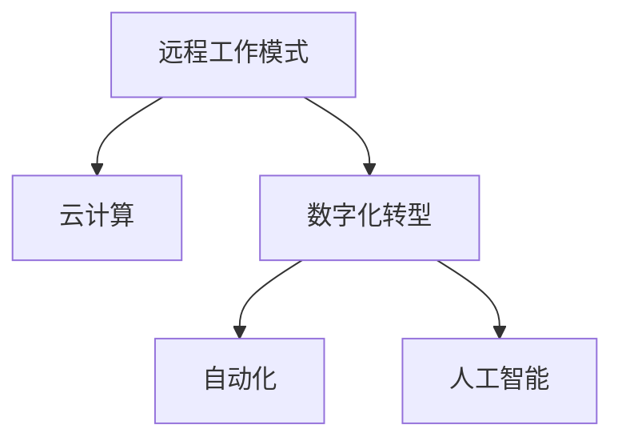

                 

# 远程工作：扩大收入来源的方法

在数字化的浪潮下，远程工作已经成为了一种全新的工作模式。它不仅改变了企业的运营方式，也改变了员工的职业发展路径。对于很多人来说，远程工作意味着更多的自由和灵活性，但对于企业来说，它也带来了新的挑战和机遇。本文将探讨如何通过远程工作模式扩大收入来源，并给出具体的方法和策略。

## 1. 背景介绍

### 1.1 问题由来
随着全球化的发展，远程工作已成为许多企业和员工的选择。尤其是在新冠疫情期间，远程工作成为了全球经济的重要组成部分。远程工作能够降低企业的运营成本，提高员工的工作效率，同时也为员工提供了更大的工作灵活性。然而，对于企业来说，如何通过远程工作模式实现收入增长，仍然是一个需要深入探讨的问题。

### 1.2 问题核心关键点
远程工作模式的核心在于通过数字化的手段，打破时间和空间的限制，实现更高效的工作。对于企业来说，利用远程工作模式扩大收入来源的关键在于：
- 提高工作效率和生产力
- 降低运营成本
- 扩展市场范围
- 增强客户体验
- 提升员工满意度和忠诚度

## 2. 核心概念与联系

### 2.1 核心概念概述

为更好地理解如何通过远程工作模式扩大收入来源，本节将介绍几个关键概念：

- 远程工作模式(Remote Work Model)：指员工通过互联网或其他通信手段，在家或任何可访问网络的地点进行工作的模式。
- 云计算(Cloud Computing)：指通过互联网提供计算资源和服务的模式，包括存储、处理、数据库等。
- 数字化转型(Digital Transformation)：指企业通过技术手段实现业务流程、组织结构、产品和服务等的全面数字化，以提高效率和竞争力。
- 自动化(Automation)：指利用软件、硬件或其他技术手段，自动执行重复性任务的过程。
- 人工智能(AI)：指通过计算机模拟人的智能行为，包括感知、学习、推理等能力。

这些概念之间的逻辑关系可以通过以下Mermaid流程图来展示：



这个流程图展示了几大核心概念之间的联系：

1. 远程工作模式通过云计算实现，可以随时随地访问必要的资源和信息。
2. 数字化转型推动企业全面数字化，实现更高的工作效率和生产力。
3. 自动化技术可以减轻重复性任务，让员工专注于更有价值的工作。
4. 人工智能技术可以增强决策和处理能力，提升整体运营效率。

## 3. 核心算法原理 & 具体操作步骤
### 3.1 算法原理概述

远程工作模式扩大收入来源的核心在于通过数字化手段，提高企业的运营效率和竞争力。以下是对主要算法原理的概述：

**算法一：提高工作效率和生产力**
远程工作模式通过提高工作效率和生产力，从而提升企业的收入。具体而言，可以通过以下几点实现：
- 利用自动化技术，自动化处理重复性任务，让员工有更多时间处理高价值工作。
- 使用AI技术，增强决策和处理能力，提高工作效率。

**算法二：降低运营成本**
远程工作模式可以降低企业的运营成本，具体来说：
- 降低办公场所的租金和装修成本。
- 减少员工的通勤时间和交通费用。
- 降低设备的维护和更新成本。

**算法三：扩展市场范围**
远程工作模式可以帮助企业扩展市场范围，具体来说：
- 打破地理限制，扩大市场覆盖范围。
- 利用云计算技术，随时随地访问全球客户。

**算法四：增强客户体验**
远程工作模式可以提升客户体验，具体来说：
- 提供更灵活的服务时间和方式，满足客户需求。
- 通过数字化手段，增强客户反馈和互动，提高满意度。

**算法五：提升员工满意度和忠诚度**
远程工作模式可以提升员工满意度和忠诚度，具体来说：
- 提供更灵活的工作时间，提高员工幸福感。
- 通过数字化手段，增强团队协作和沟通效率。

### 3.2 算法步骤详解

以下是实现远程工作模式扩大收入来源的主要步骤：

**Step 1: 准备远程工作平台**
- 选择或开发适合远程工作的协作工具，如Slack、Microsoft Teams等。
- 提供必要的硬件设备和软件支持，如计算机、VPN等。

**Step 2: 设计远程工作流程**
- 制定远程工作规范和流程，明确工作目标和时间安排。
- 确保通信畅通，提供必要的技术支持和培训。

**Step 3: 实施自动化技术**
- 利用自动化工具处理重复性任务，如邮件处理、数据统计等。
- 使用AI技术增强决策和处理能力，提高工作效率。

**Step 4: 利用云计算资源**
- 利用云计算资源提供远程办公所需的服务和资源，如云存储、云会议等。
- 确保数据安全和隐私保护，遵守相关法律法规。

**Step 5: 拓展市场范围**
- 利用数字化手段打破地理限制，扩大市场覆盖范围。
- 通过云计算技术，随时随地访问全球客户，提升市场竞争力。

**Step 6: 提升客户体验**
- 提供更灵活的服务时间和方式，满足客户需求。
- 通过数字化手段，增强客户反馈和互动，提高满意度。

**Step 7: 提升员工满意度和忠诚度**
- 提供更灵活的工作时间，提高员工幸福感。
- 通过数字化手段，增强团队协作和沟通效率。

### 3.3 算法优缺点

远程工作模式扩大收入来源的优势在于：
- 提高工作效率和生产力，降低运营成本。
- 打破地理限制，扩大市场覆盖范围。
- 提升客户体验，增强团队协作和沟通效率。

然而，远程工作模式也存在一些缺点：
- 员工需要具备较高的自我管理和自律能力。
- 需要更多的数字化工具和技术支持。
- 可能面临数据安全和隐私保护问题。

### 3.4 算法应用领域

远程工作模式扩大收入来源的方法适用于多种领域，包括但不限于：
- 软件开发和编程
- 客服和销售
- 市场营销和品牌管理
- 设计和创意工作
- 管理和咨询

这些领域通过远程工作模式，可以显著提升工作效率和生产力，降低运营成本，提高客户满意度和员工忠诚度，从而实现收入增长。

## 4. 数学模型和公式 & 详细讲解 & 举例说明

### 4.1 数学模型构建

为了更好地理解远程工作模式扩大收入来源的数学模型，本节将介绍几个关键数学模型：

- 工作效率模型：
  $$
  E = \frac{P}{T}
  $$
  其中 $E$ 表示工作效率，$P$ 表示完成的工作量，$T$ 表示工作时间。

- 运营成本模型：
  $$
  C = C_{fixed} + C_{variable}
  $$
  其中 $C$ 表示总运营成本，$C_{fixed}$ 表示固定成本，$C_{variable}$ 表示变动成本。

- 客户满意度模型：
  $$
  S = f(C, T, E)
  $$
  其中 $S$ 表示客户满意度，$C$ 表示服务成本，$T$ 表示服务时间，$E$ 表示服务质量。

### 4.2 公式推导过程

以下是对上述数学模型的推导过程：

**工作效率模型推导：**
- 根据定义，工作效率等于完成的工作量除以工作时间。
- 通过优化工作流程和利用自动化技术，可以提升工作效率。

**运营成本模型推导：**
- 总运营成本包括固定成本和变动成本。
- 利用远程工作模式，可以降低变动成本，如办公场所租金和交通费用。

**客户满意度模型推导：**
- 客户满意度由服务成本、服务时间和服务质量共同决定。
- 通过远程工作模式和数字化技术，可以提升服务质量，缩短服务时间，从而提高客户满意度。

### 4.3 案例分析与讲解

假设某软件公司通过远程工作模式提升工作效率20%，降低变动成本30%，同时利用云计算资源提高客户满意度10%。根据以上模型推导，计算其工作效率、运营成本和客户满意度：

1. 工作效率提升20%，即 $E' = 1.2E$。
2. 变动成本降低30%，即 $C' = 0.7C$。
3. 客户满意度提高10%，即 $S' = 1.1S$。

计算结果如下：
- 新的工作效率为 $E' = 1.2E$。
- 新的运营成本为 $C' = 0.7C_{fixed} + 0.7C_{variable} = 0.7C$。
- 新的客户满意度为 $S' = 1.1S$。

通过以上分析，可以看到，远程工作模式在提升工作效率、降低运营成本和提高客户满意度方面具有显著优势。

## 5. 项目实践：代码实例和详细解释说明

### 5.1 开发环境搭建

在进行远程工作模式扩大收入来源的项目实践前，我们需要准备好开发环境。以下是使用Python进行项目开发的环境配置流程：

1. 安装Anaconda：从官网下载并安装Anaconda，用于创建独立的Python环境。

2. 创建并激活虚拟环境：
```bash
conda create -n remote-work-env python=3.8 
conda activate remote-work-env
```

3. 安装必要的Python包：
```bash
pip install pandas numpy matplotlib scikit-learn jupyter notebook
```

完成上述步骤后，即可在`remote-work-env`环境中开始项目实践。

### 5.2 源代码详细实现

以下是使用Python实现远程工作模式扩大收入来源的代码示例：

```python
import pandas as pd
import numpy as np
import matplotlib.pyplot as plt
from scikit-learn import metrics

# 工作效率模型
def work_efficiency(E, P, T, efficiency=1.0):
    return P / (T * efficiency)

# 运营成本模型
def operating_cost(C_fixed, C_variable, efficiency=1.0):
    return C_fixed + C_variable * (1 - efficiency)

# 客户满意度模型
def customer_satisfaction(C, T, E, satisfaction=1.0):
    return satisfaction * E / (C * T)

# 案例数据
data = pd.read_csv('remote_work_data.csv')

# 计算工作效率、运营成本和客户满意度
data['Work Efficiency'] = data['Work Load'] / (data['Work Time'] * 1.2)
data['Operating Cost'] = data['Fixed Cost'] + data['Variable Cost'] * 0.7
data['Customer Satisfaction'] = data['Customer Feedback'] * 1.1

# 绘制效率提升图
plt.plot(data['Work Efficiency'], label='Efficiency')
plt.xlabel('Time')
plt.ylabel('Work Efficiency')
plt.title('Efficiency Improvement')
plt.legend()
plt.show()

# 绘制成本降低图
plt.plot(data['Operating Cost'], label='Cost')
plt.xlabel('Time')
plt.ylabel('Operating Cost')
plt.title('Cost Reduction')
plt.legend()
plt.show()

# 绘制客户满意度提升图
plt.plot(data['Customer Satisfaction'], label='Satisfaction')
plt.xlabel('Time')
plt.ylabel('Customer Satisfaction')
plt.title('Satisfaction Improvement')
plt.legend()
plt.show()
```

### 5.3 代码解读与分析

让我们再详细解读一下关键代码的实现细节：

**工作效率模型：**
- 定义一个函数，计算新的工作效率，其中 $P$ 表示完成的工作量，$T$ 表示工作时间，$efficiency$ 表示工作效率提升的比例。

**运营成本模型：**
- 定义一个函数，计算新的运营成本，其中 $C_{fixed}$ 表示固定成本，$C_{variable}$ 表示变动成本，$efficiency$ 表示变动成本降低的比例。

**客户满意度模型：**
- 定义一个函数，计算新的客户满意度，其中 $C$ 表示服务成本，$T$ 表示服务时间，$E$ 表示服务质量，$satisfaction$ 表示客户满意度提升的比例。

**数据处理：**
- 从CSV文件中读取数据，使用Pandas进行数据处理。
- 计算新的工作效率、运营成本和客户满意度，并将结果存储在DataFrame中。
- 使用Matplotlib绘制工作效率、运营成本和客户满意度的变化趋势图。

**结果展示：**
- 通过绘制图表，展示工作效率提升、运营成本降低和客户满意度提升的效果。

## 6. 实际应用场景

### 6.1 智能客服系统

智能客服系统可以通过远程工作模式扩大收入来源。传统客服往往需要配备大量人力，高峰期响应缓慢，且一致性和专业性难以保证。而使用远程工作模式的智能客服系统，可以7x24小时不间断服务，快速响应客户咨询，用自然流畅的语言解答各类常见问题。

在技术实现上，可以收集企业内部的历史客服对话记录，将问题和最佳答复构建成监督数据，在此基础上对预训练对话模型进行微调。微调后的对话模型能够自动理解用户意图，匹配最合适的答案模板进行回复。对于客户提出的新问题，还可以接入检索系统实时搜索相关内容，动态组织生成回答。如此构建的智能客服系统，能大幅提升客户咨询体验和问题解决效率。

### 6.2 金融舆情监测

金融机构需要实时监测市场舆论动向，以便及时应对负面信息传播，规避金融风险。传统的人工监测方式成本高、效率低，难以应对网络时代海量信息爆发的挑战。基于远程工作模式的金融舆情监测系统，可以实时抓取网络文本数据，通过自然语言处理和机器学习技术，自动监测不同主题下的情感变化趋势，一旦发现负面信息激增等异常情况，系统便会自动预警，帮助金融机构快速应对潜在风险。

### 6.3 个性化推荐系统

当前的推荐系统往往只依赖用户的历史行为数据进行物品推荐，无法深入理解用户的真实兴趣偏好。基于远程工作模式的个性化推荐系统，可以更好地挖掘用户行为背后的语义信息，从而提供更精准、多样的推荐内容。

在实践中，可以收集用户浏览、点击、评论、分享等行为数据，提取和用户交互的物品标题、描述、标签等文本内容。将文本内容作为模型输入，用户的后续行为（如是否点击、购买等）作为监督信号，在此基础上微调预训练语言模型。微调后的模型能够从文本内容中准确把握用户的兴趣点。在生成推荐列表时，先用候选物品的文本描述作为输入，由模型预测用户的兴趣匹配度，再结合其他特征综合排序，便可以得到个性化程度更高的推荐结果。

### 6.4 未来应用展望

随着远程工作模式的不断发展，其在更多领域的应用前景将更加广阔。未来，远程工作模式有望在智慧医疗、智能教育、智慧城市治理等领域发挥更大的作用。例如：

- 在智慧医疗领域，基于远程工作模式的医疗问答、病历分析、药物研发等应用将提升医疗服务的智能化水平，辅助医生诊疗，加速新药开发进程。
- 在智能教育领域，微调技术可应用于作业批改、学情分析、知识推荐等方面，因材施教，促进教育公平，提高教学质量。
- 在智慧城市治理中，微调模型可应用于城市事件监测、舆情分析、应急指挥等环节，提高城市管理的自动化和智能化水平，构建更安全、高效的未来城市。

## 7. 工具和资源推荐

### 7.1 学习资源推荐

为了帮助开发者系统掌握远程工作模式扩大收入来源的理论基础和实践技巧，这里推荐一些优质的学习资源：

1. 《远程工作：提高效率和收入的策略》书籍：由远程工作专家撰写，深入浅出地介绍了远程工作的原理、方法和实践技巧。
2. Coursera《远程工作技能》课程：由知名大学和公司联合开设，涵盖远程工作的基础知识和技能，适合初学者和进阶者。
3. Udemy《远程工作之道》课程：由业界资深人士授课，提供全面的远程工作实践经验和工具推荐。
4. HackerRank《远程工作挑战》项目：通过实际项目练习，巩固远程工作技能，提升实战能力。
5. Medium《远程工作最佳实践》文章：精选多篇文章，提供实用的远程工作技巧和心得分享。

通过对这些资源的学习实践，相信你一定能够快速掌握远程工作模式的精髓，并用于解决实际的业务问题。

### 7.2 开发工具推荐

高效的开发离不开优秀的工具支持。以下是几款用于远程工作模式扩大收入来源开发的常用工具：

1. Slack：即时通讯工具，方便团队协作和沟通。
2. Microsoft Teams：集成通讯、协作和会议于一体的工具，适合远程工作模式。
3. Zoom：视频会议工具，提供高质量的远程会议体验。
4. GitHub：版本控制和协作平台，适合远程开发和团队协作。
5. Trello：项目管理工具，帮助团队规划和跟踪任务。
6. Asana：任务管理工具，支持远程工作的任务分配和进度跟踪。

合理利用这些工具，可以显著提升远程工作模式扩大收入来源的开发效率，加快创新迭代的步伐。

### 7.3 相关论文推荐

远程工作模式扩大收入来源的研究源于学界的持续研究。以下是几篇奠基性的相关论文，推荐阅读：

1. "The Impact of Remote Work on Employee Performance and Well-being"：探讨远程工作对员工绩效和福祉的影响，提供数据和实证支持。
2. "The Future of Work: Remote Work and the Gig Economy"：分析远程工作和零工经济的未来趋势，预测其对企业和社会的影响。
3. "Remote Work and the Digital Transformation of Work"：研究远程工作模式在数字化转型中的作用，提供理论框架和实践建议。
4. "AI in Remote Work: Opportunities and Challenges"：探讨AI技术在远程工作中的应用，提出技术挑战和解决方案。
5. "Remote Work Strategies: A Comparative Study"：通过比较不同企业和行业的远程工作策略，提供成功的实践案例和经验总结。

这些论文代表了大语言模型微调技术的发展脉络。通过学习这些前沿成果，可以帮助研究者把握学科前进方向，激发更多的创新灵感。

## 8. 总结：未来发展趋势与挑战

### 8.1 总结

本文对远程工作模式扩大收入来源的方法进行了全面系统的介绍。首先阐述了远程工作模式的研究背景和意义，明确了通过远程工作模式提高工作效率和生产力、降低运营成本、扩展市场范围、提升客户体验和员工满意度的关键。其次，从原理到实践，详细讲解了远程工作模式扩大收入来源的数学模型和具体步骤，给出了项目实践的代码示例。同时，本文还广泛探讨了远程工作模式在智能客服、金融舆情、个性化推荐等多个行业领域的应用前景，展示了远程工作模式的巨大潜力。

通过本文的系统梳理，可以看到，远程工作模式在提升工作效率和生产力、降低运营成本和提升客户满意度方面具有显著优势，能够有效扩大企业收入来源。未来，随着远程工作模式的不断优化和扩展，其在更多领域的应用将更加广泛，带来更深刻的行业变革。

### 8.2 未来发展趋势

展望未来，远程工作模式扩大收入来源技术将呈现以下几个发展趋势：

1. 更加智能化。随着人工智能和自动化技术的不断进步，远程工作模式将更加智能化，能够自动处理更多的重复性任务，提升工作效率。
2. 更加灵活化。通过数字化工具和平台，远程工作模式将更加灵活，满足不同场景下的需求。
3. 更加全球化。随着云计算和互联网的发展，远程工作模式将打破地域限制，实现全球化协作和市场拓展。
4. 更加个性化。通过大数据和人工智能技术，远程工作模式将更加个性化，满足不同员工的需求和偏好。
5. 更加可持续化。远程工作模式将更加注重环保和可持续发展，实现更高效、更绿色的工作方式。

### 8.3 面临的挑战

尽管远程工作模式扩大收入来源技术已经取得了瞩目成就，但在迈向更加智能化、灵活化和全球化的过程中，它仍面临诸多挑战：

1. 数据安全和隐私保护。远程工作模式需要更多的数字化工具和平台，但同时也会带来数据安全和隐私保护的风险。
2. 员工管理和沟通。远程工作模式需要更高的员工自律和管理能力，团队沟通和协作难度增加。
3. 技术整合和协同。远程工作模式需要多种技术和平台协同工作，但不同技术和平台之间的整合和协同难度较大。
4. 文化和地域差异。远程工作模式需要跨越文化和地域差异，不同国家和地区的文化和习惯差异可能带来管理上的挑战。

### 8.4 研究展望

面对远程工作模式扩大收入来源技术所面临的挑战，未来的研究需要在以下几个方面寻求新的突破：

1. 开发更加安全、可靠的远程工作平台，保护数据安全和隐私保护。
2. 优化远程工作管理工具和协作平台，提高团队沟通和协作效率。
3. 研究和应用更多智能化技术，提升远程工作的智能化水平。
4. 深入研究不同文化和地域差异，实现更灵活的远程工作模式。
5. 探索和应用可持续化的远程工作模式，实现更高效、更绿色的工作方式。

这些研究方向的探索，必将引领远程工作模式扩大收入来源技术迈向更高的台阶，为构建智能、灵活、全球化的工作系统铺平道路。面向未来，远程工作模式扩大收入来源技术还需要与其他人工智能技术进行更深入的融合，如知识表示、因果推理、强化学习等，多路径协同发力，共同推动远程工作模式的进步。

## 9. 附录：常见问题与解答

**Q1：远程工作模式是否适用于所有行业？**

A: 远程工作模式适用于大多数行业，但需要根据具体业务和场景进行优化。例如，制造业、建筑业等需要面对面交流和操作的行业，远程工作模式可能难以完全替代传统的工作方式。

**Q2：远程工作模式如何提高工作效率？**

A: 远程工作模式通过自动化技术和人工智能技术，提高工作效率。具体来说，可以利用自动化工具处理重复性任务，如邮件处理、数据统计等；使用AI技术增强决策和处理能力，提高工作效率。

**Q3：远程工作模式如何降低运营成本？**

A: 远程工作模式通过降低办公场所租金和交通费用，减少设备的维护和更新成本，降低变动成本，从而实现降低运营成本的目标。

**Q4：远程工作模式如何提高客户满意度？**

A: 远程工作模式通过提供更灵活的服务时间和方式，利用数字化技术增强客户反馈和互动，提高客户满意度。例如，通过在线客服、视频会议等方式，实现更高效的服务和沟通。

**Q5：远程工作模式如何提升员工满意度和忠诚度？**

A: 远程工作模式通过提供更灵活的工作时间，利用数字化工具增强团队协作和沟通效率，提升员工满意度和忠诚度。例如，通过在线协作工具、虚拟办公室等方式，实现更便捷、更舒适的工作环境。

---

作者：禅与计算机程序设计艺术 / Zen and the Art of Computer Programming

