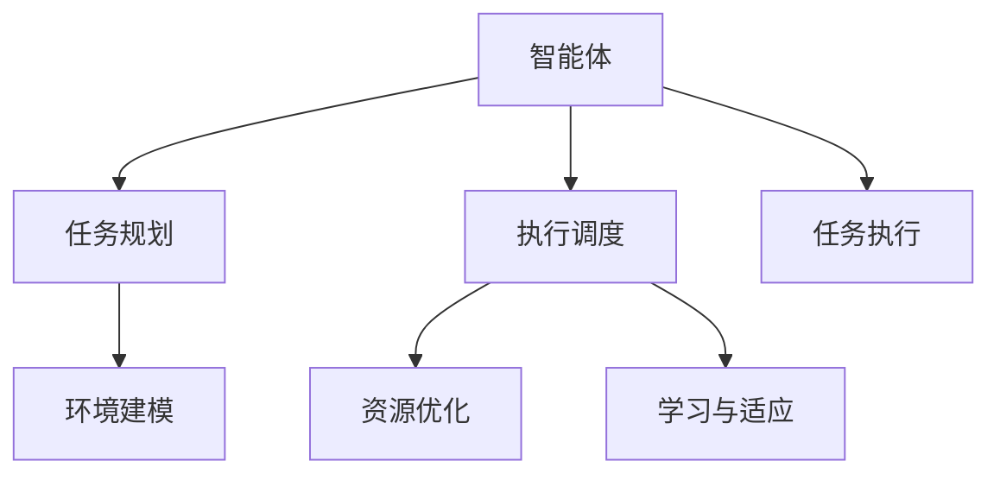

                 

## 1. 背景介绍

在人工智能领域，智能体（Agent）是指能够在复杂环境中通过规划、决策、执行实现特定目标的软件实体。随着人工智能技术的飞速发展，智能体在智能交通、工业控制、人机交互、智能推荐等领域得到了广泛应用。然而，智能体执行任务的效果受多方面因素影响，如环境复杂度、数据完备度、计算资源等。为了在有限的资源条件下，最大化智能体的任务执行效率，需要对智能体的任务规划和执行进行深入研究和优化。

### 1.1 问题由来

智能体执行任务时，需要根据环境信息规划行动策略，然后通过执行模块实现策略。然而，环境信息是动态变化的，智能体需要不断学习、适应并调整策略，才能有效地完成任务。特别是在资源受限的环境中，智能体如何在保证任务完成度的同时，提高执行效率是一个亟需解决的问题。传统的基于经验的方法无法适应复杂多变的任务环境，新的规划与执行策略亟待开发。

### 1.2 问题核心关键点

智能体任务规划与执行的核心在于：
1. **动态环境建模**：构建准确、高效的环境模型，准确预测环境变化，减少规划误差。
2. **任务分解与调度**：将复杂任务分解为子任务，并合理调度执行顺序，提高执行效率。
3. **资源优化**：在资源有限的情况下，合理分配计算资源，保证执行速度。
4. **学习与适应**：通过学习与适应，不断提高策略优化能力和鲁棒性。

本文聚焦于通过规划提升智能体任务执行效率的研究，探讨了从任务规划到执行的完整流程，提出了若干关键的优化策略。

## 2. 核心概念与联系

### 2.1 核心概念概述

为更好地理解智能体任务规划与执行，本节将介绍几个密切相关的核心概念：

- **智能体（Agent）**：能够在复杂环境中通过规划、决策、执行实现特定目标的软件实体。智能体可以是机器人、无人机、虚拟助手等。
- **任务规划（Task Planning）**：智能体在执行任务前的策略规划过程，通常包括目标设定、状态评估、路径规划等。
- **执行调度（Execution Scheduling）**：智能体在执行过程中对任务子任务的调度，包括并行执行、串行执行、任务重排等。
- **任务执行（Task Execution）**：智能体在执行过程中对策略的具体执行，通常需要依赖执行器完成具体的操作。
- **环境建模（Environment Modeling）**：通过构建环境模型，预测环境变化，减少策略规划误差。
- **资源优化（Resource Optimization）**：在资源受限条件下，合理分配计算资源，保证执行速度。
- **学习与适应（Learning and Adaptation）**：通过学习和适应，提高策略优化能力和鲁棒性。

这些核心概念之间的逻辑关系可以通过以下Mermaid流程图来展示：



这个流程图展示了几组关键概念之间的联系：

1. 智能体通过任务规划确定策略，并通过执行调度进行任务子任务执行。
2. 环境建模和资源优化辅助任务规划和执行调度，提高任务执行效率。
3. 学习与适应进一步优化任务规划和执行调度，提高策略鲁棒性。

## 3. 核心算法原理 & 具体操作步骤

### 3.1 算法原理概述

智能体任务规划与执行的核心在于构建准确的环境模型，合理地分解任务并调度执行，以及高效地利用计算资源。其基本算法流程包括：

1. **任务建模与表示**：通过构建环境模型，定义任务目标、状态空间和行动空间。
2. **策略规划**：利用策略规划算法，如A*、RRT等，在环境模型上寻找最优或次优策略。
3. **执行调度**：在执行过程中，通过动态任务调度算法，如基于模型的动态规划、蒙特卡洛树搜索等，优化执行效率。
4. **资源分配**：在资源受限的情况下，通过资源优化算法，如多目标优化、动态资源分配等，合理分配计算资源。
5. **学习与适应**：通过学习算法，如强化学习、迁移学习等，不断优化策略，提高执行效率和鲁棒性。

### 3.2 算法步骤详解

**Step 1: 任务建模与表示**
- 定义任务的目标和状态空间。例如，对于导航任务，目标是将智能体从起点运送到终点，状态空间包括智能体当前位置、速度、方向等。
- 定义智能体的行动空间。例如，对于导航任务，行动空间包括向前、向后、左转、右转等。
- 构建环境模型。例如，可以使用地图、传感器数据、历史轨迹等构建环境模型。

**Step 2: 策略规划**
- 选择适当的策略规划算法，如A*、RRT、DPRT等。
- 在环境模型上，利用算法搜索最优或次优路径。
- 生成路径，计算代价函数，选择最优路径。

**Step 3: 执行调度**
- 在执行过程中，实时监测环境变化。
- 根据实时环境变化，动态调整执行计划。
- 利用动态规划、蒙特卡洛树搜索等算法，优化执行效率。

**Step 4: 资源分配**
- 根据任务需求，定义资源类型和数量。例如，计算资源、通信资源等。
- 利用多目标优化等算法，分配计算资源。
- 动态调整资源分配策略，优化资源使用效率。

**Step 5: 学习与适应**
- 通过学习算法，如强化学习、迁移学习等，不断优化策略。
- 利用历史数据和实时反馈，更新策略模型。
- 提高策略的鲁棒性和泛化能力。

### 3.3 算法优缺点

智能体任务规划与执行算法具有以下优点：
1. 动态环境适应性强。算法能够实时监测环境变化，动态调整策略。
2. 执行效率高。算法通过合理调度执行，优化资源分配，提高执行速度。
3. 鲁棒性强。算法能够通过学习与适应，不断优化策略，提高鲁棒性。

同时，该算法也存在一些局限性：
1. 需要构建准确的环境模型。模型的准确性直接影响策略规划和执行效果。
2. 计算复杂度高。算法通常需要大量计算资源，特别是在复杂环境中。
3. 策略优化难度大。策略优化需要大量实验和调参，找到最优策略较为困难。

尽管存在这些局限性，但就目前而言，智能体任务规划与执行算法仍是大规模智能体应用的主流范式。未来相关研究的重点在于如何进一步提高算法效率，降低计算复杂度，优化策略规划和执行调度。

### 3.4 算法应用领域

智能体任务规划与执行算法在众多领域中得到了广泛应用，例如：

- 智能交通：自动驾驶汽车、智能交通灯等。通过规划路径和调度执行，实现安全和高效驾驶。
- 工业控制：机器人自动化生产线、智能仓库等。通过规划路径和调度执行，提高生产效率。
- 人机交互：虚拟助手、智能家居等。通过规划路径和调度执行，提供更自然、智能的交互体验。
- 智能推荐：电商、广告推荐系统等。通过规划路径和调度执行，实现个性化推荐。

除了上述这些经典应用外，智能体任务规划与执行算法还被创新性地应用于更多场景中，如无人机导航、游戏AI、金融投资等，为各行各业带来了新的技术突破。

## 4. 数学模型和公式 & 详细讲解

### 4.1 数学模型构建

本节将使用数学语言对智能体任务规划与执行的算法流程进行更加严格的刻画。

假设智能体在环境中的状态为 $s$，行动为 $a$，环境模型的状态转移概率为 $p(s'|s,a)$，环境奖励为 $r(s,a,s')$。智能体的目标是在有限的计算资源 $c$ 下，从初始状态 $s_0$ 到达目标状态 $s_T$，最大化累计奖励 $J$。

定义策略 $\pi(s)$ 为智能体在状态 $s$ 下采取行动 $a$ 的概率，策略规划的目标是在给定环境模型和计算资源的约束下，求解最优策略 $\pi^*$。具体而言，策略规划问题可以表述为：

$$
\begin{aligned}
\max_{\pi} & J = \sum_{s_0}^{} \pi(s_0) \sum_{t=0}^{T-1} r(s_t, a_t, s_{t+1}) + \gamma^T V^\pi(s_T) \\
\text{s.t.} & c^t \leq \sum_{s_0}^{} \pi(s_0) \sum_{t=0}^{T-1} c^t p(s_{t+1}|s_t,a_t)
\end{aligned}
$$

其中，$T$ 表示时间步数，$V^\pi(s)$ 表示策略 $\pi$ 下状态 $s$ 的价值函数，$\gamma$ 为折扣因子。

### 4.2 公式推导过程

以下我们以A*算法为例，推导其核心公式及推导过程。

A*算法是一种基于启发式搜索的策略规划算法。假设环境模型中存在障碍物，智能体需要在障碍物之间找到最短路径。A*算法的核心在于利用启发式函数 $h(s)$ 估计状态 $s$ 到目标状态 $s_T$ 的代价，从而优化搜索顺序，提高算法效率。

启发式函数 $h(s)$ 通常为状态 $s$ 到目标状态 $s_T$ 的欧式距离或曼哈顿距离，即：

$$
h(s) = \sqrt{(s - s_T)^2}
$$

A*算法的搜索过程如下：

1. 初始化开放列表 $G$ 和关闭列表 $H$。开放列表存储待扩展的状态，关闭列表存储已扩展的状态。
2. 将起始状态 $s_0$ 加入开放列表 $G$，并计算 $g(s_0) = h(s_0)$。
3. 在开放列表 $G$ 中，选择 $g(s) + h(s)$ 最小的状态 $s$ 进行扩展。
4. 对于 $s$ 的邻居状态 $s'$，计算 $g(s')$ 和 $f(s') = g(s') + h(s')$，并加入开放列表 $G$ 中。
5. 重复步骤3和4，直至找到目标状态 $s_T$ 或开放列表 $G$ 为空。

A*算法的代价函数 $f(s)$ 为：

$$
f(s) = g(s) + h(s)
$$

其中，$g(s)$ 为从起始状态 $s_0$ 到状态 $s$ 的最小代价，通常为状态之间的欧氏距离或曼哈顿距离。

### 4.3 案例分析与讲解

以智能交通中的自动驾驶为例，我们分析A*算法在该场景中的应用。

假设智能体为自动驾驶汽车，环境模型为道路地图，目标为到达终点。智能体在每一步可以选择不同的行动，如加速、减速、左转、右转等。A*算法在规划路径时，可以实时监测道路状况，通过启发式函数估计到达目标的最小代价。

在具体实现中，智能体可以构建道路地图的邻接表，利用Dijkstra算法计算状态之间的代价。同时，A*算法可以利用实时传感器数据，动态调整启发式函数，优化路径规划。

例如，智能体可以利用摄像头实时监测道路上的障碍物，通过机器视觉算法识别出障碍物的位置和大小。然后，通过启发式函数 $h(s)$ 计算当前状态 $s$ 到目标状态 $s_T$ 的最小代价，从而选择最优路径。

## 5. 项目实践：代码实例和详细解释说明

### 5.1 开发环境搭建

在进行智能体任务规划与执行实践前，我们需要准备好开发环境。以下是使用Python进行开发的环境配置流程：

1. 安装Anaconda：从官网下载并安装Anaconda，用于创建独立的Python环境。

2. 创建并激活虚拟环境：
```bash
conda create -n agent-env python=3.8 
conda activate agent-env
```

3. 安装相关库：
```bash
pip install numpy scipy pyro gym gymnasium
```

4. 配置环境变量：
```bash
export PYTHONPATH=$PYTHONPATH:$CONDA_PREFIX/lib/python3.8/site-packages
```

完成上述步骤后，即可在`agent-env`环境中开始智能体任务规划与执行的实践。

### 5.2 源代码详细实现

下面以A*算法为例，给出使用Python进行智能体任务规划与执行的代码实现。

```python
import numpy as np
import gymnasium as gym
from gymnasium.envs.classic_control.pendulum import PendulumEnv

def a_star(env, start_state, goal_state, max_iter=10000):
    open_list = {start_state}
    closed_list = set()
    g_scores = {start_state: 0}
    f_scores = {start_state: np.linalg.norm(start_state - goal_state)}
    parent = {start_state: None}
    
    for _ in range(max_iter):
        current_state = min(f_scores, key=f_scores.get)
        if current_state == goal_state:
            return f_scores[goal_state]
        
        open_list.remove(current_state)
        closed_list.add(current_state)
        neighbors = env.get_neighbors(current_state)
        for neighbor in neighbors:
            if neighbor in closed_list:
                continue
            g_score = g_scores[current_state] + np.linalg.norm(neighbor - current_state)
            if neighbor not in g_scores or g_score < g_scores[neighbor]:
                g_scores[neighbor] = g_score
                f_score = g_score + np.linalg.norm(neighbor - goal_state)
                f_scores[neighbor] = f_score
                parent[neighbor] = current_state
        
        if current_state not in f_scores:
            break
        
    return -1
```

在上述代码中，我们定义了一个`a_star`函数，用于在Pendulum环上规划最短路径。该函数接受环境、起始状态、目标状态和最大迭代次数作为参数，返回到达目标状态的最小代价。

### 5.3 代码解读与分析

让我们再详细解读一下关键代码的实现细节：

**PendulumEnv类**：
- 定义了环境类，用于模拟Pendulum环的动态行为，并提供获取邻居状态的方法。

**a_star函数**：
- 初始化开放列表、关闭列表、g分数、f分数和父节点字典。
- 在每一步迭代中，选择$f$分数最小的状态进行扩展。
- 计算当前状态的邻居状态，并更新$g$分数、$f$分数和父节点字典。
- 如果找到了目标状态，则返回$f$分数；否则返回-1，表示未找到路径。

在实际应用中，我们可以通过PendulumEnv类模拟多维空间中的任务，并利用a_star函数进行路径规划。例如，对于智能体在复杂环境中的路径规划，我们可以利用PendulumEnv类构建高维空间，并通过a_star函数进行路径规划。

## 6. 实际应用场景

### 6.1 智能交通

智能体任务规划与执行技术在智能交通中得到了广泛应用，特别是在自动驾驶领域。自动驾驶汽车需要实时监测道路状况，通过路径规划算法生成最优路径，并在执行过程中进行实时调度，保证行车安全。

在具体实现中，自动驾驶汽车可以利用摄像头、雷达等传感器获取实时道路信息，利用A*算法等路径规划算法计算最优路径，并利用执行调度算法进行实时路径更新和调度。例如，智能体可以利用GPS和地图信息，规划从起点到终点的最优路径，并利用动态规划算法，实时调整行驶速度和转向角度，保证行车安全。

### 6.2 工业控制

智能体任务规划与执行技术在工业控制中同样具有重要应用。机器人自动化生产线需要高效地完成任务调度和管理，以提高生产效率。

在具体实现中，机器人可以利用A*算法等路径规划算法，规划从工作站到加工区的最优路径，并利用执行调度算法进行实时调度。例如，智能体可以利用机器视觉算法，实时监测工件的位置和状态，通过路径规划算法计算最优路径，并在执行过程中进行实时调度，保证生产效率和质量。

### 6.3 人机交互

智能体任务规划与执行技术在人机交互中也具有重要应用，特别是在智能家居和虚拟助手领域。智能体需要实时响应用户的交互请求，并通过路径规划算法生成最优路径。

在具体实现中，智能体可以利用A*算法等路径规划算法，规划从当前位置到用户请求位置的路径，并利用执行调度算法进行实时调度。例如，智能体可以利用语音识别算法，实时监测用户的语音指令，通过路径规划算法计算最优路径，并在执行过程中进行实时调度，提供更自然、智能的交互体验。

### 6.4 未来应用展望

随着智能体任务规划与执行技术的不断发展，未来的应用场景将会更加广泛。以下是一些未来可能的应用方向：

- **无人机导航**：无人机需要实时监测环境变化，通过路径规划算法生成最优路径，并在执行过程中进行实时调度，保证飞行安全。

- **游戏AI**：游戏AI需要实时监测游戏环境变化，通过路径规划算法生成最优路径，并在执行过程中进行实时调度，保证游戏表现。

- **金融投资**：智能体需要实时监测市场变化，通过路径规划算法生成最优投资策略，并在执行过程中进行实时调度，优化投资收益。

- **可穿戴设备**：可穿戴设备需要实时响应用户的交互请求，通过路径规划算法生成最优路径，并在执行过程中进行实时调度，提供更智能的交互体验。

## 7. 工具和资源推荐

### 7.1 学习资源推荐

为了帮助开发者系统掌握智能体任务规划与执行的理论基础和实践技巧，这里推荐一些优质的学习资源：

1. 《机器人学习》（LearntoRobotics, J.J. Lagoudis）：全面介绍了机器人学习的基础理论和算法。
2. 《强化学习》（Reinforcement Learning, S. Russell & P. Norvig）：介绍了强化学习的理论和算法，是学习智能体规划与执行的重要参考书籍。
3. 《动态规划与最优化》（Dynamic Programming and Optimization, L.R. Foulds & S. Leland）：介绍了动态规划算法和优化问题，是学习智能体规划与执行的基础。
4. 《计算智能体》（Computational Agents, N.F. Smith）：介绍了计算智能体的概念和实现方法，是学习智能体规划与执行的重要参考书籍。
5. 《A*算法》（A* Search, R.W. Floyd）：介绍了A*算法的原理和实现方法，是学习智能体规划与执行的重要参考书籍。

通过这些资源的学习实践，相信你一定能够快速掌握智能体任务规划与执行的精髓，并用于解决实际的智能体规划与执行问题。

### 7.2 开发工具推荐

高效的开发离不开优秀的工具支持。以下是几款用于智能体任务规划与执行开发的常用工具：

1. PyTorch：基于Python的开源深度学习框架，灵活动态的计算图，适合快速迭代研究。

2. TensorFlow：由Google主导开发的开源深度学习框架，生产部署方便，适合大规模工程应用。

3. OpenAI Gym：用于训练智能体和测试智能体学习算法的Python框架。提供了丰富的环境库和评估指标，是学习智能体规划与执行的重要工具。

4. Pendulum：用于模拟Pendulum环的Python环境库，是学习智能体规划与执行的重要工具。

5. Gurobi或CPLEX：用于线性规划和整数规划的商业优化工具，适合解决复杂的智能体资源优化问题。

合理利用这些工具，可以显著提升智能体任务规划与执行任务的开发效率，加快创新迭代的步伐。

### 7.3 相关论文推荐

智能体任务规划与执行技术的发展源于学界的持续研究。以下是几篇奠基性的相关论文，推荐阅读：

1. A*: A Theory of Heuristic Searching（H.A. Hart, N.J. Simon, M.L. Bringsjord）：提出了A*算法，奠定了智能体规划与执行算法的基础。

2. Reinforcement Learning: An Introduction（R.S. Sutton, A. Barto）：介绍了强化学习算法，是学习智能体规划与执行的重要参考书籍。

3. Planning Algorithms（A.J. Kaelbling, M.L. Littman, A.R. Moore）：介绍了多种智能体规划算法，是学习智能体规划与执行的重要参考书籍。

4. Multi-agent systems（J. Herbst, M. Dez稿一authr）：介绍了多智能体系统的规划与执行算法，是学习智能体规划与执行的重要参考书籍。

5. Robot Motion Planning with Dynamic Obstacles（S. Thrun, D. Fox, T. Burg）：介绍了动态环境中的智能体规划算法，是学习智能体规划与执行的重要参考书籍。

这些论文代表了大规模智能体规划与执行技术的发展脉络。通过学习这些前沿成果，可以帮助研究者把握学科前进方向，激发更多的创新灵感。

## 8. 总结：未来发展趋势与挑战

### 8.1 总结

本文对智能体任务规划与执行方法进行了全面系统的介绍。首先阐述了智能体在执行任务时面临的问题和挑战，明确了任务规划和执行的关键步骤。其次，从原理到实践，详细讲解了智能体任务规划与执行的数学模型和算法流程，给出了任务规划与执行的完整代码实例。同时，本文还广泛探讨了任务规划与执行在智能交通、工业控制、人机交互等多个领域的应用前景，展示了任务规划与执行技术的巨大潜力。

通过本文的系统梳理，可以看到，智能体任务规划与执行技术正在成为智能体应用的重要范式，极大地拓展了智能体的应用边界，催生了更多的落地场景。受益于大规模智能体规划与执行技术的不断发展，智能体将能够更好地适应复杂多变的任务环境，提高执行效率和鲁棒性，为各行各业带来新的技术突破。

### 8.2 未来发展趋势

展望未来，智能体任务规划与执行技术将呈现以下几个发展趋势：

1. **动态环境建模与感知**：随着传感器技术和机器视觉技术的发展，智能体将能够实时监测环境变化，构建更准确的环境模型。例如，智能体可以利用激光雷达、深度相机等传感器获取实时环境信息，通过机器视觉算法进行环境建模和感知。

2. **深度强化学习**：深度强化学习将为智能体任务规划与执行带来新的突破。深度神经网络将与强化学习结合，提高策略优化能力和鲁棒性。例如，智能体可以利用深度神经网络优化A*算法，提高路径规划的准确性和效率。

3. **多智能体协作**：多智能体协作将为智能体任务规划与执行带来新的应用场景。智能体将通过通信和协作，优化资源分配和任务调度。例如，智能体可以利用通信协议进行信息共享，通过协作优化路径规划和执行。

4. **自适应学习**：自适应学习将使智能体能够更好地适应环境变化。智能体将通过自适应学习，不断调整策略和参数，提高执行效率和鲁棒性。例如，智能体可以利用在线学习算法，实时调整路径规划和执行策略。

5. **多模态融合**：多模态融合将为智能体任务规划与执行带来新的突破。智能体将结合视觉、听觉、触觉等多种模态信息，进行更全面、精准的环境建模和任务规划。例如，智能体可以利用多模态传感器获取环境信息，通过融合算法进行更全面、精准的路径规划。

6. **资源优化**：资源优化将使智能体能够更好地利用计算资源。智能体将通过资源优化算法，合理分配计算资源，提高执行效率。例如，智能体可以利用动态资源分配算法，实时调整计算资源分配，优化执行效率。

这些趋势凸显了智能体任务规划与执行技术的广阔前景。这些方向的探索发展，必将进一步提升智能体的执行效率和鲁棒性，为各行各业带来新的技术突破。

### 8.3 面临的挑战

尽管智能体任务规划与执行技术已经取得了瞩目成就，但在迈向更加智能化、普适化应用的过程中，它仍面临着诸多挑战：

1. **环境模型构建**：构建准确、高效的环境模型是智能体任务规划与执行的前提。环境模型的构建需要大量传感器数据和机器视觉技术，成本较高。如何构建高效、准确的环境模型，仍是重要研究方向。

2. **策略优化**：智能体的策略优化需要大量实验和调参，找到最优策略较为困难。如何在高维空间中进行策略优化，提高策略优化效率，是亟待解决的问题。

3. **执行效率**：智能体在执行过程中需要实时监测环境变化，进行动态调度，计算复杂度较高。如何在资源受限的情况下，提高执行效率，是重要的优化方向。

4. **安全性和鲁棒性**：智能体需要具备一定的安全性和鲁棒性，避免因环境变化或传感器故障等原因导致执行失败。如何在复杂环境下保证智能体的安全性和鲁棒性，是重要的研究方向。

5. **实时性**：智能体需要在实时环境中进行任务规划与执行，对算法的实时性要求较高。如何在资源受限的情况下，提高算法的实时性，是重要的优化方向。

6. **可解释性**：智能体需要具备一定的可解释性，便于开发者调试和优化。如何提高智能体的可解释性，是重要的研究方向。

这些挑战需要多方面的努力才能解决，需要学界和产业界的共同努力，不断推进技术创新，才能使智能体更好地适应复杂多变的任务环境，提高执行效率和鲁棒性。

### 8.4 研究展望

面对智能体任务规划与执行所面临的挑战，未来的研究需要在以下几个方面寻求新的突破：

1. **深度学习与强化学习的融合**：深度学习与强化学习的融合将为智能体任务规划与执行带来新的突破。深度神经网络将与强化学习结合，提高策略优化能力和鲁棒性。例如，智能体可以利用深度神经网络优化A*算法，提高路径规划的准确性和效率。

2. **多模态融合**：多模态融合将为智能体任务规划与执行带来新的突破。智能体将结合视觉、听觉、触觉等多种模态信息，进行更全面、精准的环境建模和任务规划。例如，智能体可以利用多模态传感器获取环境信息，通过融合算法进行更全面、精准的路径规划。

3. **自适应学习**：自适应学习将使智能体能够更好地适应环境变化。智能体将通过自适应学习，不断调整策略和参数，提高执行效率和鲁棒性。例如，智能体可以利用在线学习算法，实时调整路径规划和执行策略。

4. **资源优化**：资源优化将使智能体能够更好地利用计算资源。智能体将通过资源优化算法，合理分配计算资源，提高执行效率。例如，智能体可以利用动态资源分配算法，实时调整计算资源分配，优化执行效率。

5. **多智能体协作**：多智能体协作将为智能体任务规划与执行带来新的应用场景。智能体将通过通信和协作，优化资源分配和任务调度。例如，智能体可以利用通信协议进行信息共享，通过协作优化路径规划和执行。

6. **动态环境建模与感知**：随着传感器技术和机器视觉技术的发展，智能体将能够实时监测环境变化，构建更准确的环境模型。例如，智能体可以利用激光雷达、深度相机等传感器获取实时环境信息，通过机器视觉算法进行环境建模和感知。

这些研究方向将推动智能体任务规划与执行技术迈向更高的台阶，为各行各业带来新的技术突破。面向未来，智能体任务规划与执行技术还需要与其他人工智能技术进行更深入的融合，如知识表示、因果推理、强化学习等，多路径协同发力，共同推动智能体系统的进步。只有勇于创新、敢于突破，才能不断拓展智能体的边界，让智能体技术更好地造福人类社会。

## 9. 附录：常见问题与解答

**Q1：智能体任务规划与执行的主要算法有哪些？**

A: 智能体任务规划与执行的主要算法包括：
1. 动态规划算法（Dynamic Programming, DP）：适用于求解最优化问题。
2. A*算法：基于启发式搜索的路径规划算法。
3. 广度优先搜索算法（Breadth-First Search, BFS）：适用于求解最短路径问题。
4. 深度优先搜索算法（Depth-First Search, DFS）：适用于求解连通性问题。
5. 随机优先搜索算法（Stochastic Priority Search, SPS）：适用于求解随机环境下的路径规划问题。

**Q2：智能体任务规划与执行的主要难点有哪些？**

A: 智能体任务规划与执行的主要难点包括：
1. 环境模型构建：构建准确、高效的环境模型是智能体任务规划与执行的前提。
2. 策略优化：智能体的策略优化需要大量实验和调参，找到最优策略较为困难。
3. 执行效率：智能体在执行过程中需要实时监测环境变化，进行动态调度，计算复杂度较高。
4. 安全性和鲁棒性：智能体需要具备一定的安全性和鲁棒性，避免因环境变化或传感器故障等原因导致执行失败。
5. 实时性：智能体需要在实时环境中进行任务规划与执行，对算法的实时性要求较高。
6. 可解释性：智能体需要具备一定的可解释性，便于开发者调试和优化。

**Q3：智能体任务规划与执行的应用场景有哪些？**

A: 智能体任务规划与执行的应用场景包括：
1. 自动驾驶：自动驾驶汽车需要在复杂道路环境中规划最优路径。
2. 机器人自动化生产线：机器人需要在生产环境中进行最优路径规划。
3. 人机交互：虚拟助手需要在多模态环境中进行最优路径规划。
4. 无人机导航：无人机需要在复杂环境中进行最优路径规划。
5. 游戏AI：游戏AI需要在游戏环境中进行最优路径规划。
6. 金融投资：智能体需要在复杂市场环境中进行最优投资策略规划。

**Q4：如何提高智能体任务规划与执行的执行效率？**

A: 提高智能体任务规划与执行的执行效率可以通过以下方法：
1. 优化算法：选择高效的算法进行任务规划和执行，如动态规划、A*算法等。
2. 资源优化：合理分配计算资源，优化资源使用效率，如动态资源分配算法。
3. 多智能体协作：通过通信和协作，优化资源分配和任务调度。
4. 实时感知：利用传感器和机器视觉技术，实时监测环境变化，提高决策准确性。

**Q5：智能体任务规划与执行在哪些方面需要进一步研究？**

A: 智能体任务规划与执行在以下方面需要进一步研究：
1. 深度学习与强化学习的融合：提高策略优化能力和鲁棒性。
2. 多模态融合：结合视觉、听觉、触觉等多种模态信息，进行更全面、精准的环境建模和任务规划。
3. 自适应学习：通过自适应学习，不断调整策略和参数，提高执行效率和鲁棒性。
4. 资源优化：合理分配计算资源，提高执行效率。
5. 多智能体协作：通过通信和协作，优化资源分配和任务调度。
6. 动态环境建模与感知：实时监测环境变化，构建更准确的环境模型。

这些研究方向的探索发展，必将进一步提升智能体的执行效率和鲁棒性，为各行各业带来新的技术突破。

---

作者：禅与计算机程序设计艺术 / Zen and the Art of Computer Programming

