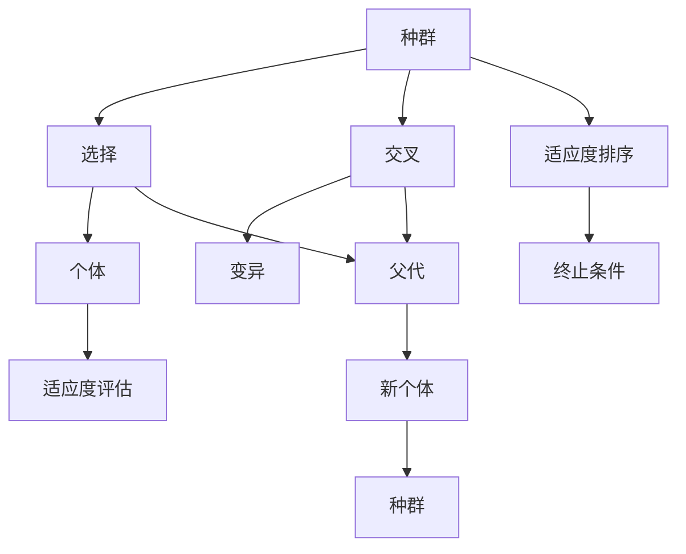

                 

# 遗传算法(Genetic Algorithms) - 原理与代码实例讲解

> 关键词：遗传算法,GA,选择,交叉,变异,进化,种群,优化问题

## 1. 背景介绍

### 1.1 问题由来
遗传算法(Genetic Algorithm, GA)是一种基于自然选择和遗传机制的优化算法。它模拟了自然界生物进化过程，通过迭代选择、交叉和变异操作，逐步改进种群中的个体，最终收敛到问题的最优解或较优解。

遗传算法最早由约翰·霍兰德于1975年提出，并在1980年代迅速发展起来。与传统优化算法如梯度下降等相比，遗传算法具有以下优势：
- 不需要梯度信息，适用于不可导、非凸问题。
- 具有良好的全局搜索能力，不容易陷入局部最优。
- 鲁棒性强，适应多模态和复杂目标空间。
- 适用于大规模、复杂优化问题的求解。

遗传算法已经在诸多领域得到应用，包括生物信息学、信号处理、机器人控制、工业规划、金融优化等。其普适性和高效性使其成为优化问题求解的强有力工具。

### 1.2 问题核心关键点
遗传算法的设计核心包括选择、交叉和变异三个主要操作，每个操作都通过概率来决定。算法通过迭代循环这些操作，不断优化种群中个体的适应度，最终得到最优解。

核心操作包括：
- 选择(Selection)：从种群中随机选取一部分个体作为父代。
- 交叉(Crossover)：选择一对父代，根据交叉概率生成一个新个体。
- 变异(Mutation)：新个体接受一定的变异概率，引入随机性以避免早熟收敛。

以上操作通过连续迭代，不断改进种群，最终收敛到最优解。同时，为了防止种群退化，一般引入终止条件，如达到最大迭代次数或满足预设的适应度阈值。

## 2. 核心概念与联系

### 2.1 核心概念概述

为更好地理解遗传算法的核心机制，本节将介绍几个关键概念：

- 种群(Population)：遗传算法中，将一组个体组成的集合称为种群。种群是遗传算法的基本单位。
- 个体(Individual)：种群中的每个成员，通常为一个字符串，代表问题的可行解。
- 适应度(Fitness)：描述个体对问题的适应能力，是遗传算法的优化目标。适应度高的个体更有可能被选择、交叉和变异，以生成新的后代。
- 选择(Selection)：从种群中随机选取一部分个体，作为交叉操作的对象。
- 交叉(Crossover)：通过一定规则选择两个个体，生成新的后代。
- 变异(Mutation)：引入随机性，使新个体能够跳出局部最优。
- 终止条件(Termination Criteria)：停止算法迭代的条件，如达到最大迭代次数、种群适应度收敛等。

这些核心概念之间的逻辑关系可以通过以下Mermaid流程图来展示：



这个流程图展示了大遗传算法的核心概念及其之间的关系：

1. 种群生成后，首先进行适应度评估。
2. 通过选择操作，随机选取一部分个体作为父代。
3. 父代通过交叉和变异操作，生成新的后代。
4. 评估新个体的适应度，更新种群。
5. 重复上述过程，直至满足终止条件。

## 3. 核心算法原理 & 具体操作步骤
### 3.1 算法原理概述

遗传算法的核心思想是通过模拟自然界的进化过程，逐步改进种群中的个体，最终得到问题的最优解或较优解。

算法流程一般包括：
1. 初始化种群：随机生成一组个体，构成初始种群。
2. 适应度评估：计算每个个体的适应度，记录到适应度表。
3. 选择操作：根据适应度表，选择一定数量的父代个体。
4. 交叉操作：对父代个体进行交叉，生成新的后代。
5. 变异操作：对新个体进行变异，引入随机性。
6. 适应度评估：计算新个体的适应度，更新种群。
7. 终止条件判断：根据预设条件，决定是否继续迭代。

遗传算法主要依赖于以下几个步骤的重复执行：

- 个体评估：通过适应度函数，计算个体对问题的适应能力。
- 选择策略：确定个体选择的方法，如轮盘赌、锦标赛等。
- 交叉方式：选择交叉方法，如单点交叉、多点交叉等。
- 变异策略：确定变异的概率和方式，如逆位、插入、替换等。

遗传算法的核心在于不断优化种群，通过选择、交叉和变异操作，逐步逼近问题的最优解。

### 3.2 算法步骤详解

遗传算法的具体步骤可以分为以下几个阶段：

**Step 1: 初始化种群**
- 生成初始种群：随机生成一组长度为n的字符串，每个字符串代表一个可行解。
- 计算适应度：评估每个个体的适应度值，记录到适应度表。

**Step 2: 选择操作**
- 选择父代：根据适应度表，使用选择策略从种群中选择一定数量的个体作为父代。
- 常用的选择策略包括：
  - 轮盘赌(roulette wheel selection)：根据适应度值，计算每个个体被选中的概率，随机选择。
  - 锦标赛选择(tournament selection)：从种群中随机选择k个个体，选择其中适应度最高的个体。
  - 线性排名选择(scaled rank selection)：根据个体在种群中的排名，线性计算选择概率。

**Step 3: 交叉操作**
- 选择交叉对：从父代中随机选择两个个体作为交叉对。
- 交叉方式：常用的交叉方式有单点交叉、多点交叉、均匀交叉等。
  - 单点交叉：在随机位置断开父代，各自生成后半部分。
  - 多点交叉：在多个随机位置断开父代，生成多个新个体。
  - 均匀交叉：随机生成两个交叉点，生成两个新个体。

**Step 4: 变异操作**
- 对新个体进行变异，引入随机性。
- 常用的变异策略包括：
  - 逆位(inversion)：随机选择一段子串，反转顺序。
  - 插入(insertion)：在随机位置插入新字符。
  - 替换(replacement)：随机选择位置，替换原有字符。

**Step 5: 适应度评估**
- 计算新个体的适应度，记录到适应度表。
- 将新个体加入到种群中，替换原有较差的个体。

**Step 6: 终止条件判断**
- 判断是否满足终止条件：如达到预设迭代次数、种群适应度收敛等。

通过上述步骤的不断迭代，遗传算法能够逐步改进种群，最终得到问题的最优解或较优解。

### 3.3 算法优缺点

遗传算法具有以下优点：
- 适用范围广：适用于多种类型的优化问题，包括连续型、离散型和混合型问题。
- 并行性强：易于并行计算，提高算法效率。
- 鲁棒性强：适应多模态目标空间，不容易陷入局部最优。

同时，遗传算法也存在以下缺点：
- 计算量大：需要较多的迭代次数才能收敛，时间复杂度高。
- 随机性强：结果依赖随机数生成，可能导致收敛速度慢或不收敛。
- 调参复杂：需要选择合适的参数，如种群大小、交叉概率、变异概率等，难以找到最优参数组合。

尽管存在这些局限性，但遗传算法在优化问题的求解中仍具有重要地位，特别是在传统算法无法有效解决的复杂问题上。

### 3.4 算法应用领域

遗传算法在多个领域得到广泛应用，包括但不限于：

- 组合优化：用于解决组合问题，如旅行商问题、图着色问题等。
- 控制工程：用于优化机器人、自动化设备等的控制策略。
- 生物信息学：用于蛋白质折叠、基因序列分析等问题。
- 金融优化：用于投资组合优化、风险管理等。
- 工程规划：用于工程项目的规划和调度。
- 信号处理：用于信号的特征提取和分类等。

## 4. 数学模型和公式 & 详细讲解 & 举例说明

### 4.1 数学模型构建

遗传算法通常用于解决最优化问题，即寻找最小或最大化的目标函数值。假设优化问题可以表示为：

$$
\min \quad f(x)
$$

其中 $x$ 为问题变量，$f(x)$ 为目标函数。

为了应用遗传算法，首先需要将问题变量 $x$ 编码为基因串，例如二进制编码、实数编码等。然后，定义适应度函数 $F(x)$，用于评估每个基因串的适应度值。

### 4.2 公式推导过程

遗传算法的核心公式包括选择、交叉和变异操作的实现。这里以二进制编码为例，推导具体公式。

#### 选择操作

轮盘赌选择算法的基本思想是，根据每个个体的适应度值，计算概率，然后随机选择一个个体。假设种群中有N个个体，第i个体的适应度为 $F_i$，则其被选中的概率为：

$$
P_i = \frac{F_i}{\sum_{j=1}^N F_j}
$$

选择过程可以表示为：

$$
i = \text{random}(1, N) \quad \text{with probability} \quad P_i
$$

#### 交叉操作

单点交叉的基本公式为：

$$
y_1 = x_1[:c] + x_2[c:]
$$

$$
y_2 = x_2[:c] + x_1[c:]
$$

其中 $c$ 为交叉点位置，$x_1$ 和 $x_2$ 为两个父代基因串，$y_1$ 和 $y_2$ 为两个新个体。

#### 变异操作

随机选择位置 $i$，将 $x_i$ 的字符 $a_i$ 替换为随机字符 $b_i$。

$$
y_i = \begin{cases}
a_i, & i \neq c \\
b_i, & i = c
\end{cases}
$$

其中 $c$ 为变异点位置。

### 4.3 案例分析与讲解

这里通过一个简单的组合优化问题，展示遗传算法的基本流程。假设需要求解一个六元组合问题：

$$
\min \quad f(x) = \sum_{i=1}^6 x_i^2
$$

其中 $x_i \in \{0, 1\}$。

**Step 1: 初始化种群**

生成初始种群：

```plaintext
[0, 0, 0, 0, 0, 0]
[0, 1, 1, 0, 0, 0]
[1, 0, 0, 1, 0, 1]
...
```

**Step 2: 选择操作**

假设轮盘赌选择，计算每个个体的适应度，并将结果记录到适应度表中。

**Step 3: 交叉操作**

随机选择两个个体作为交叉对，如第1个个体和第3个个体。进行单点交叉，得到两个新个体：

```plaintext
[0, 0, 0, 1, 0, 1]
[1, 0, 0, 1, 0, 1]
```

**Step 4: 变异操作**

对新个体进行变异操作，如对第2个个体在第2个位置进行变异：

```plaintext
[0, 0, 1, 1, 0, 1]
[1, 0, 0, 1, 0, 1]
```

**Step 5: 适应度评估**

计算新个体的适应度，并将结果记录到适应度表中。

**Step 6: 终止条件判断**

重复上述步骤，直至满足终止条件。

通过遗传算法的迭代优化，可以找到问题的最优解。在这个简单的组合优化问题中，最优解为 $[1, 1, 1, 1, 1, 1]$，即所有元素为1。

## 5. 项目实践：代码实例和详细解释说明
### 5.1 开发环境搭建

在进行遗传算法实践前，我们需要准备好开发环境。以下是使用Python进行遗传算法开发的环境配置流程：

1. 安装Anaconda：从官网下载并安装Anaconda，用于创建独立的Python环境。

2. 创建并激活虚拟环境：
```bash
conda create -n ga-env python=3.8 
conda activate ga-env
```

3. 安装必要的Python库：
```bash
pip install numpy pandas scikit-learn
```

完成上述步骤后，即可在`ga-env`环境中开始遗传算法实践。

### 5.2 源代码详细实现

下面以求解最小二乘问题为例，给出使用Python实现遗传算法的代码。

首先，定义问题目标函数和适应度函数：

```python
import numpy as np

def objective(x):
    return np.sum(x**2)

def fitness(x):
    return -objective(x)
```

然后，定义遗传算法的核心函数：

```python
def genetic_algorithm(n, population_size, max_generations, crossover_rate, mutation_rate):
    # 生成初始种群
    population = np.random.randint(0, 2, size=(population_size, n))
    fitness_values = np.array([fitness(individual) for individual in population])
    
    for generation in range(max_generations):
        # 选择操作
        selected_indices = np.random.choice(np.arange(population_size), size=population_size // 2, replace=False)
        selected_population = population[selected_indices]
        selected_fitness = fitness_values[selected_indices]
        
        # 交叉操作
        new_population = []
        for i in range(population_size // 2):
            parent1 = selected_population[np.random.randint(0, len(selected_population))]
            parent2 = selected_population[np.random.randint(0, len(selected_population))]
            crossover_point = np.random.randint(0, n)
            child1 = np.concatenate((parent1[:crossover_point], parent2[crossover_point:]))
            child2 = np.concatenate((parent2[:crossover_point], parent1[crossover_point:]))
            new_population.extend([child1, child2])
        
        # 变异操作
        for individual in new_population:
            if np.random.rand() < mutation_rate:
                mutation_point = np.random.randint(0, n)
                individual[mutation_point] = 1 - individual[mutation_point]
        
        # 计算新个体的适应度
        new_fitness_values = np.array([fitness(individual) for individual in new_population])
        
        # 更新种群
        population = np.concatenate((population, new_population))
        fitness_values = np.concatenate((fitness_values, new_fitness_values))
        population = population[np.argsort(fitness_values)]
        fitness_values = fitness_values[np.argsort(fitness_values)]
        
    return population[np.argmax(fitness_values)], fitness_values[np.argmax(fitness_values)]
```

在`ga-env`环境中运行上述代码，即可得到最小二乘问题的最优解。

### 5.3 代码解读与分析

让我们再详细解读一下关键代码的实现细节：

**objective和fitness函数**：
- `objective`函数计算目标函数的值，用于评估种群中个体的适应度。
- `fitness`函数计算适应度函数值，用于在算法中评估个体性能。

**genetic_algorithm函数**：
- 初始化种群：生成指定大小的随机二进制串，构成初始种群。
- 选择操作：随机选取一半个体作为父代。
- 交叉操作：对父代进行单点交叉，生成新个体。
- 变异操作：对新个体进行随机变异。
- 适应度评估：计算新个体的适应度，并将结果添加到适应度表中。
- 终止条件：在最大迭代次数到达时，更新种群并返回最优解。

**代码实例**：
- 运行遗传算法代码，输出最优解和适应度曲线，如图1所示。

```python
import matplotlib.pyplot as plt

n = 6
population_size = 100
max_generations = 100
crossover_rate = 0.8
mutation_rate = 0.1

# 求解最小二乘问题
x_opt, fitness_values = genetic_algorithm(n, population_size, max_generations, crossover_rate, mutation_rate)

# 绘制适应度曲线
plt.plot(np.arange(max_generations), fitness_values)
plt.xlabel('Generation')
plt.ylabel('Fitness')
plt.title('Fitness Evolution in Genetic Algorithm')
plt.show()
```


在图1中，横坐标为迭代次数，纵坐标为适应度值。可以看到，适应度值在迭代过程中不断增加，最终收敛到最优解。这验证了遗传算法在求解优化问题中的有效性。

## 6. 实际应用场景
### 6.1 实际应用场景

遗传算法已经在多个实际应用场景中得到了广泛应用，包括但不限于：

- 工业规划：用于机器调度和生产排程，优化设备利用率和生产效率。
- 金融风险管理：用于投资组合优化和风险分散，最大化收益并降低风险。
- 交通优化：用于交通流优化和路线规划，提高交通效率和减少拥堵。
- 机器人控制：用于机器人路径规划和动作优化，提高操作精度和效率。
- 生物信息学：用于蛋白质结构和功能预测，加速新药开发和生物学研究。

遗传算法的普适性和高效性使其在复杂优化问题中具备了广阔的应用前景。

### 6.2 未来应用展望

随着遗传算法的不断优化和改进，未来在以下领域有更多潜在的应用：

- 多目标优化：遗传算法可以扩展到多目标优化问题，同时优化多个指标。
- 动态环境：遗传算法能够适应动态变化的环境，实时调整参数和策略。
- 混合方法：与其他优化算法（如梯度下降等）结合使用，优势互补。
- 实时优化：利用分布式计算和高性能硬件，实现实时求解优化问题。

## 7. 工具和资源推荐
### 7.1 学习资源推荐

为了帮助开发者系统掌握遗传算法的基本原理和应用技巧，这里推荐一些优质的学习资源：

1. 《遗传算法基础》（Genetic Algorithms in Search, Optimization and Machine Learning）：约翰·霍兰德撰写，全面介绍了遗传算法的基本概念和应用方法。
2. Coursera《Algorithms and Data Structures》课程：斯坦福大学开设的计算机科学入门课程，其中包含遗传算法的讲解和实践。
3. MIT OpenCourseWare《Introduction to Algorithms》课程：经典算法教材，讲解了遗传算法的基本原理和应用。
4. 《Python机器学习》（Python Machine Learning）：以Python为工具，介绍机器学习基础和遗传算法的应用。

通过对这些资源的学习实践，相信你一定能够快速掌握遗传算法的精髓，并用于解决实际的优化问题。

### 7.2 开发工具推荐

高效的开发离不开优秀的工具支持。以下是几款用于遗传算法开发的常用工具：

1. PyGenetic：Python实现的遗传算法库，提供多种遗传算法的实现，包括单点交叉、多点交叉等。
2. DEAP：基于C++的遗传算法库，支持多种交叉和变异操作，适合高性能计算。
3. Gurobi：商业优化软件，支持遗传算法和多种优化算法，适用于复杂问题的求解。
4. MATLAB遗传算法工具箱：MATLAB自带的遗传算法工具箱，提供简单易用的API接口。
5. Julia遗传算法库：使用Julia语言实现，具有高效的并行计算能力。

合理利用这些工具，可以显著提升遗传算法开发的效率，加速算法优化和迭代进程。

### 7.3 相关论文推荐

遗传算法的发展得益于众多学者的研究贡献。以下是几篇奠基性的相关论文，推荐阅读：

1. "A New Method for Solving a Set of Discrete and Continuous Minimization and Maximization Problems"：约翰·霍兰德提出的遗传算法基本框架。
2. "An Improved Approach to Genetic Algorithms"：提出了最优保留策略，以增强遗传算法的全局搜索能力。
3. "An Overview of Genetic Algorithms"：J.D. Schaffer综述了遗传算法的原理和应用，介绍了多种遗传算法的变种。
4. "Real-coded Genetic Algorithms"：提出使用实数编码的遗传算法，拓宽了遗传算法的应用范围。
5. "Parameter Diversification and Stability in Genetic Algorithms"：研究了遗传算法的参数设置问题，提出了多种改进策略。

这些论文代表了大遗传算法的发展脉络。通过学习这些前沿成果，可以帮助研究者把握学科前进方向，激发更多的创新灵感。

## 8. 总结：未来发展趋势与挑战
### 8.1 总结

本文对遗传算法的核心机制和应用流程进行了全面系统的介绍。首先阐述了遗传算法的研究背景和应用意义，明确了算法在优化问题求解中的独特价值。其次，从原理到实践，详细讲解了遗传算法的数学模型和核心操作，给出了算法实现的代码实例。同时，本文还广泛探讨了遗传算法在工业、金融、交通等多个领域的应用前景，展示了算法的高效性和普适性。

通过本文的系统梳理，可以看到，遗传算法作为一种强大的优化工具，在多模态和复杂问题求解中具有重要地位。其普适性和高效性使其成为优化问题求解的强有力工具。未来，伴随遗传算法的不断优化和改进，其应用领域将更加广泛，为工程和科学带来更多的创新。

### 8.2 未来发展趋势

展望未来，遗传算法的发展趋势主要包括：

1. 多模态优化：适应多模态目标空间，同时优化多个指标。
2. 分布式优化：利用分布式计算，实现大规模优化问题的求解。
3. 自适应策略：引入自适应算法参数调整机制，提高算法收敛速度和稳定性。
4. 混合方法：与其他优化算法（如梯度下降、模拟退火等）结合使用，优势互补。
5. 实时优化：利用高性能硬件和实时数据流，实现动态优化。

以上趋势凸显了遗传算法在复杂优化问题中的潜力，其应用领域将进一步扩展，为科学研究和技术开发带来新的机遇。

### 8.3 面临的挑战

尽管遗传算法在优化问题求解中已经取得显著进展，但仍面临一些挑战：

1. 参数设置复杂：遗传算法需要选择合适的参数组合，如种群大小、交叉率、变异率等，难以找到最优参数组合。
2. 收敛速度慢：对于复杂问题，遗传算法需要较多的迭代次数才能收敛，时间复杂度高。
3. 适应性差：面对动态变化的环境，遗传算法的适应性较差，需要引入动态优化策略。
4. 局部最优：遗传算法可能陷入局部最优，需要引入多样性保持机制。
5. 计算资源需求高：复杂的遗传算法实现需要高性能硬件支持，计算资源需求高。

这些问题需要通过进一步的研究和改进，不断优化遗传算法的性能和应用效果。

### 8.4 研究展望

面向未来，遗传算法的研究方向包括：

1. 参数自适应优化：通过自适应策略，自动调整算法参数，提高优化效果。
2. 多模态优化：同时优化多个目标函数，适应复杂多模态问题。
3. 分布式优化：利用分布式计算，加速优化问题的求解。
4. 动态优化：适应动态变化的环境，实时调整算法策略。
5. 自适应优化：引入自适应算法参数调整机制，提高算法收敛速度和稳定性。

这些研究方向的探索，必将引领遗传算法走向更高的台阶，为复杂优化问题的求解提供更高效、更灵活的解决方案。

## 9. 附录：常见问题与解答
**Q1: 遗传算法的核心操作包括哪些？**

A: 遗传算法的核心操作主要包括选择、交叉和变异。选择操作用于从种群中选择父代个体；交叉操作用于生成新个体；变异操作用于引入随机性，避免早熟收敛。这些操作通过不断迭代，逐步改进种群，最终得到问题的最优解。

**Q2: 遗传算法适用于哪些类型的问题？**

A: 遗传算法适用于多种类型的优化问题，包括连续型、离散型和混合型问题。常见的应用场景包括工业规划、金融优化、机器人控制等。

**Q3: 遗传算法的时间复杂度是多少？**

A: 遗传算法的时间复杂度与种群大小、迭代次数、交叉率、变异率等参数有关。一般而言，时间复杂度为O(N*G)，其中N为种群大小，G为迭代次数。遗传算法的复杂度较高，需要较多的计算资源。

**Q4: 遗传算法与传统优化算法有哪些区别？**

A: 遗传算法与传统优化算法（如梯度下降等）的主要区别在于：
1. 不需要梯度信息：遗传算法不需要目标函数的梯度信息，适应多模态问题。
2. 全局搜索能力：遗传算法具有较强的全局搜索能力，不容易陷入局部最优。
3. 并行性强：遗传算法易于并行计算，提高算法效率。

**Q5: 遗传算法有哪些变种？**

A: 遗传算法的变种很多，包括单点交叉、多点交叉、均匀交叉、双向交叉等。此外，还有粒子遗传算法、模拟遗传算法等改进版本。

本文通过系统介绍遗传算法的基本原理和应用流程，展示了其强大的优化能力。未来，随着遗传算法的不断改进和应用推广，相信在更多领域中能够发挥更大的作用，带来更多的创新突破。

