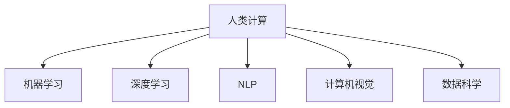

                 

# 释放人类潜力的无限可能：人类计算的最终目标

## 1. 背景介绍

### 1.1 问题由来
随着科技的飞速发展，人类社会逐步迈入了信息时代，计算能力已经成为了推动社会进步的核心动力。在人工智能（AI）的浪潮下，“人类计算”的概念应运而生，它结合了人类智慧与机器智能，旨在通过计算手段实现人类潜力的最大化释放。

人类计算不仅仅是技术上的创新，更是人类智慧与机器学习深度融合的产物。它涵盖了一个广泛的领域，包括但不限于机器学习、深度学习、自然语言处理、计算机视觉等。通过对大规模数据的高效处理和计算，人类计算可以解决传统计算难以解决的复杂问题，推动科学进步和社会发展。

### 1.2 问题核心关键点
人类计算的核心在于如何通过高效计算技术，将人类智慧与机器智能相结合，从而解决复杂的现实问题。其关键点包括：

1. **高效计算能力**：高效的计算能力是实现人类计算的基础，能够处理和分析海量数据，提取有价值的信息。
2. **人类智慧的融入**：通过人类的知识和智慧指导机器学习过程，提高计算模型的准确性和泛化能力。
3. **跨领域的应用**：将人类计算应用于医疗、教育、金融、能源等多个领域，解决现实问题，提升社会效率。

### 1.3 问题研究意义
研究人类计算的最终目标，对于推动科技进步、解决复杂问题、提升社会效率具有重要意义：

1. **科技进步**：人类计算能够加速科学研究，解决长期困扰科学家的难题，推动技术的突破。
2. **问题解决**：通过高效计算，人类计算能够处理复杂且庞大的数据集，为各种领域提供精准的解决方案。
3. **社会效率提升**：在医疗、教育、金融等关键领域，人类计算能够显著提高效率，促进社会的发展。

## 2. 核心概念与联系

### 2.1 核心概念概述

为更好地理解人类计算的目标和原理，本节将介绍几个核心概念：

1. **人类计算（Human Computing）**：一种将人类智慧与机器智能相结合的计算模式，旨在通过高效计算实现人类潜力的最大化释放。
2. **机器学习（Machine Learning）**：一种通过数据驱动的算法，使机器能够自动学习和改进，实现特定任务的能力。
3. **深度学习（Deep Learning）**：一种基于多层神经网络的学习范式，能够处理复杂的非线性关系。
4. **自然语言处理（Natural Language Processing, NLP）**：使机器能够理解、处理和生成人类语言的技术。
5. **计算机视觉（Computer Vision）**：使机器能够理解和解释视觉信息的技术。
6. **数据科学（Data Science）**：通过数据处理、分析和建模，提取有价值的信息和洞察。

这些概念之间的逻辑关系可以通过以下Mermaid流程图来展示：



这个流程图展示了一些关键概念之间的逻辑关系：

1. 人类计算利用机器学习和深度学习技术，通过高效计算处理数据。
2. 自然语言处理和计算机视觉是数据科学的重要组成部分，辅助机器学习模型的训练和应用。
3. 数据科学本身涉及数据的收集、清洗、分析和建模，是实现高效计算的基础。

## 3. 核心算法原理 & 具体操作步骤
### 3.1 算法原理概述

人类计算的核心在于高效地将人类智慧与机器智能相结合，通过计算手段实现复杂问题的解决。其核心算法包括：

- **数据处理与分析**：通过对大规模数据的高效处理和分析，提取有价值的信息。
- **模型训练与优化**：利用机器学习算法，训练和优化模型，提升其准确性和泛化能力。
- **智能推理与决策**：结合人类智慧，设计智能推理和决策系统，实现对复杂问题的精准处理。

### 3.2 算法步骤详解

人类计算的具体操作步骤如下：

1. **数据收集与预处理**：
   - 收集相关领域的数据，包括文本、图像、音频等。
   - 对数据进行清洗、去噪、归一化等预处理，确保数据的质量和一致性。

2. **特征工程与建模**：
   - 设计合适的特征提取方法，将原始数据转换为机器学习算法能够处理的形式。
   - 选择合适的机器学习算法，如神经网络、支持向量机等，构建模型。
   - 利用交叉验证等方法，对模型进行训练和调优，提升其性能。

3. **智能推理与决策**：
   - 结合领域专家的知识和经验，设计智能推理和决策系统。
   - 通过实际数据验证模型，不断调整和优化决策策略。
   - 利用人类智慧和机器智能的结合，解决复杂的现实问题。

### 3.3 算法优缺点

人类计算的算法具有以下优点：

1. **高效性**：通过高效计算，能够处理和分析海量数据，提取有价值的信息。
2. **灵活性**：结合领域专家的知识和经验，能够灵活调整和优化模型，适应复杂问题。
3. **可扩展性**：适用于多个领域，能够跨领域应用，解决现实问题。

同时，人类计算也存在一定的局限性：

1. **对数据依赖**：高质量、大规模的数据是实现高效计算的基础，但数据收集和预处理往往需要大量的时间和资源。
2. **模型复杂性**：深度学习等算法模型复杂，训练和优化需要大量的计算资源。
3. **解释性不足**：许多机器学习模型如深度学习模型是“黑盒”模型，难以解释其内部工作机制。

### 3.4 算法应用领域

人类计算的应用领域非常广泛，涵盖了科学、工程、医学、金融、教育等多个领域，具体包括：

- **科学研究**：通过数据科学和机器学习，解决长期困扰科学家的难题，推动科技的进步。
- **医疗健康**：利用数据科学和机器学习，分析患者数据，提供精准的医疗方案，提升医疗水平。
- **金融领域**：通过数据分析和智能推理，提升金融风险管理能力，优化投资决策。
- **教育培训**：利用机器学习和大数据，个性化推荐学习内容，提升教育效果。
- **智能制造**：通过计算机视觉和自然语言处理，优化生产流程，提高生产效率。
- **智能家居**：通过智能推理和决策系统，提升家居智能化水平，改善生活品质。

## 4. 数学模型和公式 & 详细讲解

### 4.1 数学模型构建

人类计算的数学模型通常包括数据模型和计算模型。数据模型用于描述数据的特征和分布，计算模型用于描述计算过程和优化方法。

数据模型的基本形式为：

$$
P(X) = \frac{1}{Z}\exp\left(\sum_{i=1}^n \theta_i \phi_i(X)\right)
$$

其中，$X$ 表示数据，$\theta_i$ 表示模型参数，$\phi_i$ 表示特征映射函数，$Z$ 为归一化因子。

计算模型通常使用梯度下降等优化算法，最小化损失函数：

$$
\min_{\theta} \mathcal{L}(\theta)
$$

其中，$\mathcal{L}$ 为损失函数，$\theta$ 为模型参数。

### 4.2 公式推导过程

以深度学习中的反向传播算法为例，其基本原理是通过链式法则，计算模型参数的梯度，实现模型优化。

设深度神经网络的结构为：

$$
y=f(x; \theta)
$$

其中，$f$ 为神经网络的前向传播过程，$\theta$ 为模型参数。

反向传播算法的步骤包括：

1. 前向传播：通过输入数据 $x$，计算模型输出 $y$。
2. 计算损失：计算输出 $y$ 与真实值 $y^*$ 之间的差异，得到损失函数 $\mathcal{L}$。
3. 反向传播：通过链式法则，计算模型参数 $\theta$ 的梯度 $\nabla_{\theta}\mathcal{L}$。
4. 参数更新：根据梯度 $\nabla_{\theta}\mathcal{L}$，使用优化算法更新模型参数 $\theta$。

具体公式推导过程如下：

设神经网络中第 $i$ 层的输出为 $a_i$，激活函数为 $f_i$，权重为 $w_i$，偏置为 $b_i$，则前向传播过程为：

$$
a_i = f_i(w_i a_{i-1} + b_i)
$$

假设损失函数为均方误差损失：

$$
\mathcal{L} = \frac{1}{2} \sum_{i=1}^n (y_i - y^*)^2
$$

对 $y$ 求偏导数：

$$
\frac{\partial \mathcal{L}}{\partial y} = (y - y^*)
$$

对 $a_i$ 求偏导数：

$$
\frac{\partial \mathcal{L}}{\partial a_i} = \frac{\partial \mathcal{L}}{\partial y} \frac{\partial y}{\partial a_i} = (y - y^*) \frac{\partial f_i}{\partial a_i}
$$

对 $w_i$ 求偏导数：

$$
\frac{\partial \mathcal{L}}{\partial w_i} = \frac{\partial \mathcal{L}}{\partial a_{i-1}} \frac{\partial a_i}{\partial w_i} = \frac{\partial \mathcal{L}}{\partial a_{i-1}} \frac{\partial f_i}{\partial w_i} \frac{\partial a_i}{\partial a_{i-1}}
$$

对 $b_i$ 求偏导数：

$$
\frac{\partial \mathcal{L}}{\partial b_i} = \frac{\partial \mathcal{L}}{\partial a_{i-1}} \frac{\partial a_i}{\partial b_i} = \frac{\partial \mathcal{L}}{\partial a_{i-1}} \frac{\partial f_i}{\partial b_i}
$$

通过反向传播算法，不断更新模型参数，直到损失函数收敛。

### 4.3 案例分析与讲解

以图像分类任务为例，展示人类计算的应用过程。

假设有一个图像分类问题，需要识别图片中的不同物体。首先，收集包含不同物体的图片数据集，进行数据清洗和预处理。然后，设计一个卷积神经网络（CNN）作为计算模型，使用反向传播算法进行训练。

具体步骤如下：

1. 构建卷积神经网络，定义网络结构。
2. 使用训练集数据，计算损失函数。
3. 通过反向传播算法，计算模型参数的梯度。
4. 使用优化算法（如Adam）更新模型参数。
5. 使用测试集数据验证模型效果，不断调整和优化模型。

最终，得到能够准确识别图片中的物体的分类模型，实现高效计算的应用。

## 5. 项目实践：代码实例和详细解释说明
### 5.1 开发环境搭建

在进行人类计算的实践时，需要一个良好的开发环境。以下是使用Python和PyTorch搭建开发环境的流程：

1. 安装Anaconda：从官网下载并安装Anaconda，用于创建独立的Python环境。
2. 创建并激活虚拟环境：
```bash
conda create -n pytorch-env python=3.8 
conda activate pytorch-env
```
3. 安装PyTorch：根据CUDA版本，从官网获取对应的安装命令。例如：
```bash
conda install pytorch torchvision torchaudio cudatoolkit=11.1 -c pytorch -c conda-forge
```
4. 安装TensorBoard：TensorFlow配套的可视化工具，可实时监测模型训练状态，并提供丰富的图表呈现方式。
5. 安装Weights & Biases：模型训练的实验跟踪工具，可以记录和可视化模型训练过程中的各项指标，方便对比和调优。

完成上述步骤后，即可在`pytorch-env`环境中开始人类计算的实践。

### 5.2 源代码详细实现

以下是使用PyTorch和TensorFlow实现图像分类任务的代码实现。

首先，定义数据处理函数：

```python
import numpy as np
import tensorflow as tf
from tensorflow.keras.preprocessing.image import ImageDataGenerator

def data_generator(train_data, val_data, batch_size=32, image_size=(224, 224)):
    train_datagen = ImageDataGenerator(rescale=1./255, validation_split=0.2)
    train_generator = train_datagen.flow_from_directory(train_data, target_size=image_size, batch_size=batch_size, class_mode='categorical', subset='training')
    val_generator = train_datagen.flow_from_directory(val_data, target_size=image_size, batch_size=batch_size, class_mode='categorical', subset='validation')
    return train_generator, val_generator
```

然后，定义模型和优化器：

```python
from tensorflow.keras.models import Sequential
from tensorflow.keras.layers import Conv2D, MaxPooling2D, Flatten, Dense, Dropout

model = Sequential()
model.add(Conv2D(32, (3, 3), activation='relu', input_shape=(224, 224, 3)))
model.add(MaxPooling2D((2, 2)))
model.add(Conv2D(64, (3, 3), activation='relu'))
model.add(MaxPooling2D((2, 2)))
model.add(Conv2D(128, (3, 3), activation='relu'))
model.add(MaxPooling2D((2, 2)))
model.add(Flatten())
model.add(Dense(128, activation='relu'))
model.add(Dropout(0.5))
model.add(Dense(10, activation='softmax'))

optimizer = tf.keras.optimizers.Adam(learning_rate=0.001)
```

接着，定义训练和评估函数：

```python
def train_epoch(model, train_generator, batch_size, optimizer):
    model.compile(optimizer=optimizer, loss='categorical_crossentropy', metrics=['accuracy'])
    model.fit(train_generator, epochs=10, batch_size=batch_size)
    
def evaluate(model, val_generator, batch_size):
    model.evaluate(val_generator, batch_size=batch_size)
```

最后，启动训练流程并在测试集上评估：

```python
train_data = 'train_data_directory'
val_data = 'val_data_directory'

train_generator, val_generator = data_generator(train_data, val_data)

train_epoch(model, train_generator, batch_size=32, optimizer=optimizer)
evaluate(model, val_generator, batch_size=32)
```

以上就是使用PyTorch和TensorFlow实现图像分类任务的具体代码实现。

### 5.3 代码解读与分析

让我们再详细解读一下关键代码的实现细节：

**data_generator函数**：
- 使用ImageDataGenerator对图片进行归一化、扩增等预处理，生成批次化数据。
- 定义训练集和验证集的生成器，返回训练集和验证集的生成器。

**模型定义**：
- 定义卷积神经网络的结构，包括卷积层、池化层、全连接层等。
- 使用Adam优化器进行模型优化。

**训练和评估函数**：
- 使用模型编译，定义优化器、损失函数和评估指标。
- 使用fit方法进行模型训练，验证集进行模型评估。

**训练流程**：
- 加载训练集和验证集数据。
- 定义训练集和验证集的生成器。
- 进行模型训练，并评估模型性能。

通过以上代码实现，我们可以高效地利用Python和PyTorch实现图像分类任务，展示了人类计算的实际应用。

## 6. 实际应用场景
### 6.1 科学研究

人类计算在科学研究中的应用极为广泛，特别是在生物医药、物理化学等领域。例如，在药物研发中，人类计算可以帮助研究人员快速筛选出潜在的药物候选分子，加速药物研发进程。

具体实现过程如下：

1. 收集药物分子数据，进行预处理。
2. 设计机器学习模型，使用反向传播算法进行训练。
3. 利用模型预测药物分子的生物活性，筛选出有潜力的药物分子。
4. 结合实验数据验证模型预测结果，不断优化模型。

通过高效计算，科学家可以在较短时间内完成大量的药物筛选工作，提高药物研发的效率和成功率。

### 6.2 医疗健康

在医疗健康领域，人类计算可以用于疾病诊断、药物推荐、患者监控等任务。例如，通过分析患者的电子健康记录（EHR），构建预测模型，实现早期疾病诊断。

具体实现过程如下：

1. 收集患者的EHR数据，进行预处理。
2. 设计机器学习模型，使用反向传播算法进行训练。
3. 利用模型预测患者的疾病风险，进行早期诊断。
4. 结合临床数据验证模型预测结果，不断优化模型。

通过高效计算，医生可以更加精准地进行疾病诊断和治疗，提高患者的治疗效果和生活质量。

### 6.3 金融领域

在金融领域，人类计算可以用于风险管理、投资决策、欺诈检测等任务。例如，通过分析金融市场数据，构建预测模型，实现风险评估和投资决策。

具体实现过程如下：

1. 收集金融市场数据，进行预处理。
2. 设计机器学习模型，使用反向传播算法进行训练。
3. 利用模型预测金融市场的波动情况，进行风险评估和投资决策。
4. 结合市场数据验证模型预测结果，不断优化模型。

通过高效计算，金融机构可以更加精准地进行风险管理和投资决策，提高投资收益和风险控制能力。

### 6.4 未来应用展望

随着人类计算技术的不断进步，未来其在各个领域的应用将更加广泛和深入。

1. **自动驾驶**：结合计算机视觉和自然语言处理技术，实现智能驾驶系统，提升交通安全性和驾驶体验。
2. **智能制造**：利用计算机视觉和机器学习技术，优化生产流程，提高生产效率和产品质量。
3. **智能家居**：结合自然语言处理和机器学习技术，实现智能家居系统，提升生活质量和便捷性。
4. **智慧城市**：利用数据科学和机器学习技术，实现城市管理智能化，提升城市管理效率和居民满意度。
5. **智慧医疗**：结合计算机视觉和自然语言处理技术，实现智能医疗系统，提升医疗水平和服务质量。

人类计算的广泛应用，将推动各行业的智能化进程，提升社会效率和生活质量，带来更多的创新和变革。

## 7. 工具和资源推荐
### 7.1 学习资源推荐

为了帮助开发者系统掌握人类计算的理论基础和实践技巧，这里推荐一些优质的学习资源：

1. 《深度学习》系列书籍：Ian Goodfellow等著，全面介绍了深度学习的基本概念和核心算法。
2. 《Python数据科学手册》：Jake VanderPlas著，涵盖数据处理、分析和建模的全面内容。
3. 《TensorFlow官方文档》：谷歌官方文档，提供TensorFlow的详细介绍和使用方法。
4. 《Keras官方文档》：Keras官方文档，提供Keras的详细介绍和使用方法。
5. 《PyTorch官方文档》：PyTorch官方文档，提供PyTorch的详细介绍和使用方法。
6. 《机器学习实战》：Peter Harrington著，通过实例详细介绍了机器学习算法的实现过程。

通过对这些资源的学习实践，相信你一定能够快速掌握人类计算的精髓，并用于解决实际的复杂问题。

### 7.2 开发工具推荐

高效的开发离不开优秀的工具支持。以下是几款用于人类计算开发的常用工具：

1. PyTorch：基于Python的开源深度学习框架，灵活动态的计算图，适合快速迭代研究。
2. TensorFlow：由Google主导开发的开源深度学习框架，生产部署方便，适合大规模工程应用。
3. Keras：高层次神经网络API，提供了丰富的预训练模型和便捷的API，易于使用。
4. Weights & Biases：模型训练的实验跟踪工具，可以记录和可视化模型训练过程中的各项指标，方便对比和调优。
5. TensorBoard：TensorFlow配套的可视化工具，可实时监测模型训练状态，并提供丰富的图表呈现方式。

合理利用这些工具，可以显著提升人类计算的开发效率，加快创新迭代的步伐。

### 7.3 相关论文推荐

人类计算的发展源于学界的持续研究。以下是几篇奠基性的相关论文，推荐阅读：

1. 《ImageNet Classification with Deep Convolutional Neural Networks》：AlexNet论文，介绍了深度卷积神经网络在图像分类中的应用。
2. 《Deep Residual Learning for Image Recognition》：ResNet论文，介绍了深度残差网络在图像分类中的应用。
3. 《Google's Neural Machine Translation System: Bridging the Gap between Human and Machine Translation》：Google翻译论文，介绍了神经机器翻译系统在机器翻译中的应用。
4. 《A Survey on Deep Learning Approaches for Predictive Analytics》：一篇综述性论文，介绍了深度学习在预测分析中的应用。
5. 《Deep Learning for Healthcare: A Review》：一篇综述性论文，介绍了深度学习在医疗健康中的应用。

这些论文代表了大规模数据处理和计算范式的发展脉络。通过学习这些前沿成果，可以帮助研究者把握学科前进方向，激发更多的创新灵感。

## 8. 总结：未来发展趋势与挑战

### 8.1 研究成果总结

本文对人类计算的最终目标和实现方法进行了全面系统的介绍。首先阐述了人类计算的研究背景和意义，明确了其高效计算的目标。其次，从原理到实践，详细讲解了人类计算的数学模型和关键步骤，给出了具体实现代码。同时，本文还广泛探讨了人类计算在各个领域的应用前景，展示了其广阔的应用空间。

通过本文的系统梳理，可以看到，人类计算是大规模数据处理和高效计算技术的融合产物，能够解决复杂的现实问题，推动各行业的智能化进程。未来，伴随着计算能力的不断提升和算法的不断优化，人类计算将迎来更多的突破和创新。

### 8.2 未来发展趋势

展望未来，人类计算的发展趋势包括：

1. **计算能力的提升**：随着计算能力的不断提升，人类计算将能够处理更大规模、更复杂的数据集，推动各领域的智能化进程。
2. **多模态融合**：结合视觉、听觉、触觉等多模态信息，实现更全面、更精准的智能计算。
3. **跨领域应用**：人类计算将应用于更多的领域，如自动驾驶、智能制造、智慧城市等，提升各行业的效率和质量。
4. **人机协同**：通过人机协同的方式，结合人类智慧和机器智能，实现更高效、更精准的计算。
5. **联邦学习**：在保证数据隐私和安全的前提下，通过联邦学习技术，实现多用户数据的协同计算。
6. **量子计算**：结合量子计算技术，实现更快、更高效的计算，推动计算能力的进一步突破。

以上趋势凸显了人类计算的广阔前景。这些方向的探索发展，必将进一步提升各行业的智能化水平，带来更多的创新和变革。

### 8.3 面临的挑战

尽管人类计算已经取得了显著进展，但在迈向更广阔应用的过程中，仍面临诸多挑战：

1. **计算资源瓶颈**：大规模数据处理和计算需要大量的计算资源，如何高效利用资源，降低计算成本，是当前的一个重要问题。
2. **模型复杂性**：深度学习等算法的复杂性较高，需要大量的计算资源和数据进行训练和优化，如何在保证精度的同时降低复杂性，是一个难题。
3. **数据隐私和安全**：在处理敏感数据时，如何保护数据隐私和安全，避免数据泄露和滥用，是必须面对的问题。
4. **伦理和法律问题**：人类计算的应用涉及伦理和法律问题，如何在技术应用中遵守伦理和法律规范，确保社会公平和公正，是一个重要的挑战。
5. **模型可解释性**：许多机器学习模型如深度学习模型是“黑盒”模型，难以解释其内部工作机制，如何在保证模型性能的同时提高可解释性，是一个需要解决的问题。

### 8.4 研究展望

面对人类计算所面临的挑战，未来的研究需要在以下几个方面寻求新的突破：

1. **高效计算技术**：开发更高效的计算算法和技术，提升计算能力和速度，降低计算成本。
2. **简化模型结构**：通过简化模型结构，降低计算复杂性，提升模型可解释性。
3. **跨领域应用**：结合不同领域的知识和技术，实现多领域协同计算，提升计算效果。
4. **隐私保护技术**：研究隐私保护技术，确保数据安全和隐私保护。
5. **法律和伦理规范**：制定和完善法律和伦理规范，确保技术应用的社会公平和公正。

这些研究方向的探索，必将引领人类计算技术迈向更高的台阶，为各行业的智能化进程提供新的动力。面向未来，人类计算需要与各领域的技术进行更深入的融合，共同推动智能社会的进步。

## 9. 附录：常见问题与解答

**Q1：人类计算是否只适用于科学研究？**

A: 人类计算不仅适用于科学研究，还可应用于医疗、金融、教育等多个领域。例如，在医疗领域，可以通过分析电子健康记录数据，构建疾病预测模型，实现早期诊断和治疗。

**Q2：人类计算需要大规模数据集吗？**

A: 是的，大规模数据集是实现高效计算的基础。高质量、大规模的数据集能够提供更丰富的特征和信息，提高模型的预测能力和泛化能力。

**Q3：人类计算的实现过程中，如何确保数据隐私和安全？**

A: 可以通过联邦学习、差分隐私等技术，在不泄露原始数据的情况下，进行高效计算。同时，制定严格的数据访问和存储规范，确保数据的安全性。

**Q4：人类计算的实现过程中，如何提高模型的可解释性？**

A: 可以使用可解释性模型，如决策树、线性回归等，提高模型的可解释性。同时，通过可视化技术，将模型的内部机制和推理过程呈现出来，便于理解和解释。

**Q5：人类计算的实现过程中，如何平衡计算效率和模型精度？**

A: 可以通过模型压缩、量化加速等技术，降低计算复杂性，提高计算效率。同时，在保证计算效率的同时，不断优化模型结构，提升模型精度。

通过以上常见问题的解答，我们可以更好地理解人类计算的应用场景、实现方法和未来发展趋势，为后续的研究和实践提供指导。

---

作者：禅与计算机程序设计艺术 / Zen and the Art of Computer Programming

