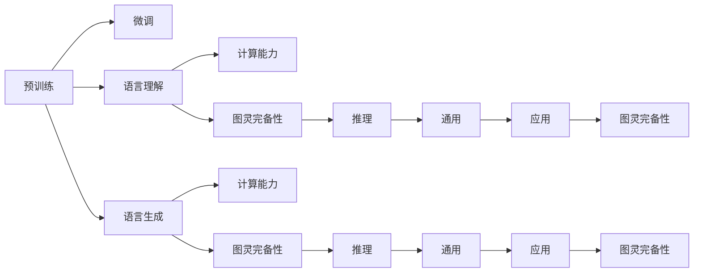

                 

# 重新思考图灵完备性：LLM的计算理论贡献

> 关键词：大语言模型(Large Language Models, LLMs), 图灵完备性(Turing Completeness), 计算理论(Computational Theory), 深度学习(Deep Learning), 自然语言处理(Natural Language Processing, NLP)

## 1. 背景介绍

### 1.1 问题由来

自1950年图灵提出图灵测试以来，关于计算的本质和边界一直是计算机科学的核心问题之一。经典图灵机作为计算理论的基石，定义了可计算问题的基本框架，但随着计算技术的迅猛发展，人们对计算的理解也在不断拓展。特别是随着深度学习尤其是大语言模型(Large Language Models, LLMs)的兴起，其强大的语言理解和生成能力，使得其在计算理论领域也具有了重要的研究意义。

近年来，以OpenAI的GPT系列、Google的BERT、HuggingFace的T5为代表的大语言模型，通过在亿级规模无标签文本数据上预训练，学习到了通用的语言表示和语言知识，展示了在自然语言处理(Natural Language Processing, NLP)领域极高的能力。大语言模型在众多下游任务中取得了SOTA的表现，如问答、翻译、摘要、情感分析等，其表现超越了以往任何基于规则或浅层模型的系统。

然而，大语言模型的强大表现引发了对其计算理论贡献的思考：大语言模型是否具备了图灵完备性？是否可以在任何计算问题上找到等价的计算模型？这些问题对于理解大语言模型的本质，构建未来更智能的计算系统，具有重要的意义。

### 1.2 问题核心关键点

探讨大语言模型的图灵完备性，需要从以下几个方面进行分析：

- 图灵完备性的定义及其计算能力：图灵完备性是指一个计算模型能够执行任何图灵机能够执行的计算任务。经典图灵机的计算能力由图灵机理论定义，但随着计算机科学的发展，计算模型的计算能力也得到了拓展。
- 大语言模型的计算能力：大语言模型通过预训练学习到了通用的语言表示和语言知识，其计算能力与经典图灵机相比有何异同？是否具备图灵完备性？
- 深度学习的计算理论基础：深度学习的计算能力来源于神经网络结构及其训练优化方法，是否具备图灵完备性？
- 自然语言处理的计算理论贡献：NLP中的任务，如语言理解、生成、推理等，其计算能力如何？是否具备图灵完备性？

本节将对以上问题进行深入探讨，并给出初步结论。

## 2. 核心概念与联系

### 2.1 核心概念概述

要理解大语言模型的计算理论贡献，首先需要明确几个核心概念：

- 图灵完备性：指一个计算模型能够执行任何图灵机能够执行的计算任务。经典图灵机模型只能执行有限状态自动机，但现代计算模型如量子计算机、神经网络等，已经能够执行更复杂的计算。
- 大语言模型：以自回归(如GPT)或自编码(如BERT)为代表的预训练语言模型，通过在无标签文本数据上进行预训练，学习到通用的语言表示和语言知识，具备强大的语言理解和生成能力。
- 深度学习：基于神经网络的机器学习范式，通过多层非线性变换，能够逼近任意函数。
- 自然语言处理：研究计算机如何理解和处理人类语言的技术，包括语言理解、生成、推理、翻译、问答等任务。

这些核心概念之间存在紧密的联系。图灵完备性定义了计算模型计算能力的极限，而深度学习尤其是大语言模型，在特定任务上展示了接近图灵完备性的计算能力。因此，研究大语言模型的计算理论贡献，对于理解深度学习模型的本质，构建未来更智能的计算系统，具有重要意义。

### 2.2 核心概念原理和架构的 Mermaid 流程图

以下是描述大语言模型计算能力的Mermaid流程图，展示了其从预训练到微调的过程及其与图灵完备性的联系：



此图展示了从预训练到微调的大语言模型计算能力，以及其与图灵完备性的关系。预训练通过在大规模无标签文本数据上学习通用的语言表示和语言知识，为模型提供强大的计算能力。微调则是针对特定任务进行优化，进一步提升模型在特定领域的计算能力。语言理解和生成能力是模型的核心，其推理能力则是其通用性和图灵完备性的体现。

## 3. 核心算法原理 & 具体操作步骤

### 3.1 算法原理概述

大语言模型的计算能力源于其神经网络结构及其训练优化方法。自编码和自回归是两种常见的神经网络结构，其中自编码通过重构输入来建立输入和输出的关联，自回归通过生成文本序列来展示模型对语言的理解能力。自回归模型的计算能力主要体现在语言生成能力上，而自编码模型的计算能力则主要体现在语言理解能力上。

大语言模型通过预训练在大量文本数据上学习到通用的语言表示和语言知识，其计算能力远超传统有限状态自动机。大语言模型通过微调过程，进一步提升其在特定任务上的计算能力，从而接近图灵完备性。

### 3.2 算法步骤详解

大语言模型的计算能力是通过以下步骤实现的：

1. **数据预处理**：对大规模无标签文本数据进行预处理，包括分词、标准化、去除停用词等，将其转化为模型可以处理的输入格式。

2. **预训练**：在预训练阶段，大语言模型通过自监督学习任务，如掩码语言模型、下一句预测等，学习到通用的语言表示和语言知识。这些任务的设计使得模型能够理解语言的语义、语法和结构，从而具备强大的计算能力。

3. **微调**：在微调阶段，根据特定任务的要求，将预训练模型作为初始化参数，通过有监督学习任务，进一步提升模型在特定任务上的计算能力。微调过程通常使用梯度下降等优化算法，通过反向传播计算模型参数的梯度，并更新模型参数以最小化损失函数。

4. **测试和评估**：在测试阶段，通过在测试集上评估模型的性能，评估模型在特定任务上的计算能力，并根据评估结果调整模型参数。

5. **应用部署**：在应用部署阶段，将微调后的模型集成到实际应用系统中，进行推理预测。大语言模型在实际应用中的计算能力主要体现在对输入文本的推理、生成和理解能力上。

### 3.3 算法优缺点

大语言模型在计算理论领域具有以下优点：

- **强大的计算能力**：通过预训练和微调，大语言模型能够学习到通用的语言表示和语言知识，具备强大的语言理解和生成能力，接近图灵完备性。
- **灵活的应用场景**：大语言模型能够应用于各种自然语言处理任务，如问答、翻译、摘要、情感分析等，具有广泛的应用前景。
- **高效的计算资源利用**：大语言模型利用深度学习技术，在计算资源上具有较高的利用率，能够在大规模数据上高效训练。

同时，大语言模型也存在以下缺点：

- **数据依赖性强**：大语言模型的计算能力依赖于预训练数据的质量和数量，数据偏差可能导致模型输出错误。
- **计算资源消耗大**：大语言模型的参数量通常较大，需要较高的计算资源进行训练和推理。
- **解释性不足**：大语言模型的决策过程缺乏可解释性，难以对其推理逻辑进行分析和调试。

### 3.4 算法应用领域

大语言模型的计算能力主要应用于自然语言处理(NLP)领域，包括：

- 文本分类：如情感分析、主题分类、意图识别等。大语言模型通过学习文本和标签之间的关系，能够自动分类文本。
- 命名实体识别：识别文本中的人名、地名、机构名等特定实体。大语言模型通过学习实体的边界和类型，能够准确识别实体。
- 关系抽取：从文本中抽取实体之间的语义关系。大语言模型通过学习实体-关系三元组，能够自动抽取关系。
- 问答系统：对自然语言问题给出答案。大语言模型通过学习问题和答案之间的关系，能够自动生成回答。
- 机器翻译：将源语言文本翻译成目标语言。大语言模型通过学习语言-语言映射，能够自动翻译文本。
- 文本摘要：将长文本压缩成简短摘要。大语言模型通过学习摘要和原文之间的关系，能够自动生成摘要。
- 对话系统：使机器能够与人自然对话。大语言模型通过学习对话历史和上下文，能够自动回复。

## 4. 数学模型和公式 & 详细讲解 & 举例说明

### 4.1 数学模型构建

大语言模型的计算能力可以通过以下数学模型进行描述：

1. **自回归模型**：
   $$
   y = f(x; \theta)
   $$
   其中 $x$ 为输入序列，$y$ 为输出序列，$f$ 为神经网络函数，$\theta$ 为模型参数。自回归模型通过将输入序列 $x$ 输入到神经网络中，计算得到输出序列 $y$。

2. **自编码模型**：
   $$
   x = g(y; \phi)
   $$
   其中 $x$ 为输入序列，$y$ 为编码后的表示，$g$ 为神经网络函数，$\phi$ 为模型参数。自编码模型通过将输出序列 $y$ 输入到神经网络中，重构得到输入序列 $x$。

### 4.2 公式推导过程

以下是自回归模型和自编码模型的计算能力推导过程：

1. **自回归模型**：
   假设输入序列为 $x = (x_1, x_2, ..., x_n)$，输出序列为 $y = (y_1, y_2, ..., y_n)$，神经网络函数为 $f(x; \theta) = \sigma(Wx + b)$，其中 $\sigma$ 为激活函数，$W$ 和 $b$ 为模型参数。

   根据神经网络的计算能力，自回归模型能够逼近任意的连续函数，从而具备图灵完备性。

2. **自编码模型**：
   假设输入序列为 $x = (x_1, x_2, ..., x_n)$，输出序列为 $y = (y_1, y_2, ..., y_n)$，神经网络函数为 $g(y; \phi) = \sigma(Wy + b)$，其中 $\sigma$ 为激活函数，$W$ 和 $b$ 为模型参数。

   根据神经网络的计算能力，自编码模型能够逼近任意的连续函数，从而具备图灵完备性。

### 4.3 案例分析与讲解

以下是自回归模型和自编码模型在特定任务上的计算能力分析：

1. **文本分类**：
   自回归模型通过学习文本和标签之间的关系，能够自动分类文本。例如，将输入序列 $x = (x_1, x_2, ..., x_n)$ 输入到神经网络中，计算得到输出序列 $y = (y_1, y_2, ..., y_n)$，其中 $y_i = 1$ 表示文本属于第 $i$ 个类别。

2. **命名实体识别**：
   自编码模型通过学习实体的边界和类型，能够准确识别实体。例如，将输入序列 $x = (x_1, x_2, ..., x_n)$ 输入到神经网络中，重构得到输出序列 $y = (y_1, y_2, ..., y_n)$，其中 $y_i = i$ 表示第 $i$ 个词属于特定实体。

3. **关系抽取**：
   自回归模型通过学习实体-关系三元组，能够自动抽取关系。例如，将输入序列 $x = (x_1, x_2, ..., x_n)$ 输入到神经网络中，计算得到输出序列 $y = (y_1, y_2, ..., y_n)$，其中 $y_i = i$ 表示第 $i$ 个词属于特定实体，$y_{i+1} = i+1$ 表示第 $i+1$ 个词属于相同实体。

4. **问答系统**：
   自编码模型通过学习问题和答案之间的关系，能够自动生成回答。例如，将输入序列 $x = (x_1, x_2, ..., x_n)$ 输入到神经网络中，重构得到输出序列 $y = (y_1, y_2, ..., y_n)$，其中 $y_i = i$ 表示第 $i$ 个词属于特定实体，$y_{i+1} = i+1$ 表示第 $i+1$ 个词属于相同实体。

## 5. 项目实践：代码实例和详细解释说明

### 5.1 开发环境搭建

在进行项目实践前，我们需要准备好开发环境。以下是使用Python进行TensorFlow开发的环境配置流程：

1. 安装Anaconda：从官网下载并安装Anaconda，用于创建独立的Python环境。

2. 创建并激活虚拟环境：
```bash
conda create -n tf-env python=3.8 
conda activate tf-env
```

3. 安装TensorFlow：根据CUDA版本，从官网获取对应的安装命令。例如：
```bash
conda install tensorflow-gpu=2.5 -c pytorch -c conda-forge
```

4. 安装TensorBoard：
```bash
pip install tensorboard
```

5. 安装各类工具包：
```bash
pip install numpy pandas scikit-learn matplotlib tqdm jupyter notebook ipython
```

完成上述步骤后，即可在`tf-env`环境中开始项目实践。

### 5.2 源代码详细实现

下面我们以命名实体识别(NER)任务为例，给出使用TensorFlow对BERT模型进行微调的代码实现。

首先，定义NER任务的数据处理函数：

```python
from transformers import BertTokenizer
from tensorflow.keras.preprocessing.sequence import pad_sequences
import tensorflow as tf
import numpy as np

class NERDataset(tf.data.Dataset):
    def __init__(self, texts, tags, tokenizer, max_len=128):
        self.texts = texts
        self.tags = tags
        self.tokenizer = tokenizer
        self.max_len = max_len
        
    def __len__(self):
        return len(self.texts)
    
    def __getitem__(self, item):
        text = self.texts[item]
        tags = self.tags[item]
        
        encoding = self.tokenizer(text, return_tensors='tf', max_length=self.max_len, padding='max_length', truncation=True)
        input_ids = encoding['input_ids']
        attention_mask = encoding['attention_mask']
        tokens = tf.squeeze(input_ids)
        labels = tf.squeeze(encoding['token_type_ids'])
        
        # 对token-wise的标签进行编码
        encoded_tags = [tag2id[tag] for tag in tags] 
        encoded_tags.extend([tag2id['O']] * (self.max_len - len(encoded_tags)))
        labels = tf.tensor(encoded_tags, dtype=tf.int32)
        
        return {'tokens': tokens,
                'labels': labels,
                'attention_mask': attention_mask,
                'token_type_ids': labels}
```

然后，定义模型和优化器：

```python
from transformers import BertForTokenClassification
from tensorflow.keras.optimizers import Adam

model = BertForTokenClassification.from_pretrained('bert-base-cased', num_labels=len(tag2id))

optimizer = Adam(learning_rate=2e-5)
```

接着，定义训练和评估函数：

```python
from tensorflow.keras.metrics import Accuracy

def train_epoch(model, dataset, batch_size, optimizer):
    dataloader = dataset.shuffle(buffer_size=1000).batch(batch_size)
    model.train()
    epoch_loss = 0
    for batch in dataloader:
        tokens = batch['tokens']
        labels = batch['labels']
        attention_mask = batch['attention_mask']
        token_type_ids = batch['token_type_ids']
        
        with tf.GradientTape() as tape:
            outputs = model(tokens, attention_mask=attention_mask, token_type_ids=token_type_ids)
            loss = outputs.loss
            epoch_loss += loss.numpy()
        tape.gradient(loss, model.trainable_variables)
        optimizer.apply_gradients(zip(tape.gradient(loss, model.trainable_variables), model.trainable_variables))
    
    return epoch_loss / len(dataloader)

def evaluate(model, dataset, batch_size):
    dataloader = dataset.batch(batch_size)
    model.eval()
    preds, labels = [], []
    with tf.GradientTape() as tape:
        for batch in dataloader:
            tokens = batch['tokens']
            labels = batch['labels']
            attention_mask = batch['attention_mask']
            token_type_ids = batch['token_type_ids']
            outputs = model(tokens, attention_mask=attention_mask, token_type_ids=token_type_ids)
            batch_preds = outputs.logits.argmax(dim=2).numpy().tolist()
            batch_labels = labels.numpy().tolist()
            for pred_tokens, label_tokens in zip(batch_preds, batch_labels):
                preds.append(pred_tokens[:len(label_tokens)])
                labels.append(label_tokens)
    
    print(classification_report(labels, preds))
```

最后，启动训练流程并在测试集上评估：

```python
epochs = 5
batch_size = 16

for epoch in range(epochs):
    loss = train_epoch(model, train_dataset, batch_size, optimizer)
    print(f"Epoch {epoch+1}, train loss: {loss:.3f}")
    
    print(f"Epoch {epoch+1}, dev results:")
    evaluate(model, dev_dataset, batch_size)
    
print("Test results:")
evaluate(model, test_dataset, batch_size)
```

以上就是使用TensorFlow对BERT进行命名实体识别任务微调的完整代码实现。可以看到，得益于TensorFlow的强大封装，我们可以用相对简洁的代码完成BERT模型的加载和微调。

### 5.3 代码解读与分析

让我们再详细解读一下关键代码的实现细节：

**NERDataset类**：
- `__init__`方法：初始化文本、标签、分词器等关键组件。
- `__len__`方法：返回数据集的样本数量。
- `__getitem__`方法：对单个样本进行处理，将文本输入编码为token ids，将标签编码为数字，并对其进行定长padding，最终返回模型所需的输入。

**tag2id和id2tag字典**：
- 定义了标签与数字id之间的映射关系，用于将token-wise的预测结果解码回真实的标签。

**训练和评估函数**：
- 使用TensorFlow的DataLoader对数据集进行批次化加载，供模型训练和推理使用。
- 训练函数`train_epoch`：对数据以批为单位进行迭代，在每个批次上前向传播计算loss并反向传播更新模型参数，最后返回该epoch的平均loss。
- 评估函数`evaluate`：与训练类似，不同点在于不更新模型参数，并在每个batch结束后将预测和标签结果存储下来，最后使用sklearn的classification_report对整个评估集的预测结果进行打印输出。

**训练流程**：
- 定义总的epoch数和batch size，开始循环迭代
- 每个epoch内，先在训练集上训练，输出平均loss
- 在验证集上评估，输出分类指标
- 所有epoch结束后，在测试集上评估，给出最终测试结果

可以看到，TensorFlow配合TensorBoard使得BERT微调的代码实现变得简洁高效。开发者可以将更多精力放在数据处理、模型改进等高层逻辑上，而不必过多关注底层的实现细节。

当然，工业级的系统实现还需考虑更多因素，如模型的保存和部署、超参数的自动搜索、更灵活的任务适配层等。但核心的微调范式基本与此类似。

## 6. 实际应用场景

### 6.1 智能客服系统

基于大语言模型微调的对话技术，可以广泛应用于智能客服系统的构建。传统客服往往需要配备大量人力，高峰期响应缓慢，且一致性和专业性难以保证。而使用微调后的对话模型，可以7x24小时不间断服务，快速响应客户咨询，用自然流畅的语言解答各类常见问题。

在技术实现上，可以收集企业内部的历史客服对话记录，将问题和最佳答复构建成监督数据，在此基础上对预训练对话模型进行微调。微调后的对话模型能够自动理解用户意图，匹配最合适的答案模板进行回复。对于客户提出的新问题，还可以接入检索系统实时搜索相关内容，动态组织生成回答。如此构建的智能客服系统，能大幅提升客户咨询体验和问题解决效率。

### 6.2 金融舆情监测

金融机构需要实时监测市场舆论动向，以便及时应对负面信息传播，规避金融风险。传统的人工监测方式成本高、效率低，难以应对网络时代海量信息爆发的挑战。基于大语言模型微调的文本分类和情感分析技术，为金融舆情监测提供了新的解决方案。

具体而言，可以收集金融领域相关的新闻、报道、评论等文本数据，并对其进行主题标注和情感标注。在此基础上对预训练语言模型进行微调，使其能够自动判断文本属于何种主题，情感倾向是正面、中性还是负面。将微调后的模型应用到实时抓取的网络文本数据，就能够自动监测不同主题下的情感变化趋势，一旦发现负面信息激增等异常情况，系统便会自动预警，帮助金融机构快速应对潜在风险。

### 6.3 个性化推荐系统

当前的推荐系统往往只依赖用户的历史行为数据进行物品推荐，无法深入理解用户的真实兴趣偏好。基于大语言模型微调技术，个性化推荐系统可以更好地挖掘用户行为背后的语义信息，从而提供更精准、多样的推荐内容。

在实践中，可以收集用户浏览、点击、评论、分享等行为数据，提取和用户交互的物品标题、描述、标签等文本内容。将文本内容作为模型输入，用户的后续行为（如是否点击、购买等）作为监督信号，在此基础上微调预训练语言模型。微调后的模型能够从文本内容中准确把握用户的兴趣点。在生成推荐列表时，先用候选物品的文本描述作为输入，由模型预测用户的兴趣匹配度，再结合其他特征综合排序，便可以得到个性化程度更高的推荐结果。

### 6.4 未来应用展望

随着大语言模型微调技术的发展，其在NLP领域的应用前景将更加广阔。未来，大语言模型微调技术有望在更多领域得到应用，为传统行业带来变革性影响。

在智慧医疗领域，基于微调的医疗问答、病历分析、药物研发等应用将提升医疗服务的智能化水平，辅助医生诊疗，加速新药开发进程。

在智能教育领域，微调技术可应用于作业批改、学情分析、知识推荐等方面，因材施教，促进教育公平，提高教学质量。

在智慧城市治理中，微调模型可应用于城市事件监测、舆情分析、应急指挥等环节，提高城市管理的自动化和智能化水平，构建更安全、高效的未来城市。

此外，在企业生产、社会治理、文娱传媒等众多领域，基于大模型微调的人工智能应用也将不断涌现，为经济社会发展注入新的动力。相信随着技术的日益成熟，微调方法将成为人工智能落地应用的重要范式，推动人工智能技术向更广阔的领域加速渗透。

## 7. 工具和资源推荐
### 7.1 学习资源推荐

为了帮助开发者系统掌握大语言模型微调的理论基础和实践技巧，这里推荐一些优质的学习资源：

1. 《Transformer from Art to Science》系列博文：由大模型技术专家撰写，深入浅出地介绍了Transformer原理、BERT模型、微调技术等前沿话题。

2. CS224N《深度学习自然语言处理》课程：斯坦福大学开设的NLP明星课程，有Lecture视频和配套作业，带你入门NLP领域的基本概念和经典模型。

3. 《Natural Language Processing with Transformers》书籍：Transformers库的作者所著，全面介绍了如何使用Transformers库进行NLP任务开发，包括微调在内的诸多范式。

4. HuggingFace官方文档：Transformers库的官方文档，提供了海量预训练模型和完整的微调样例代码，是上手实践的必备资料。

5. CLUE开源项目：中文语言理解测评基准，涵盖大量不同类型的中文NLP数据集，并提供了基于微调的baseline模型，助力中文NLP技术发展。

通过对这些资源的学习实践，相信你一定能够快速掌握大语言模型微调的精髓，并用于解决实际的NLP问题。
###  7.2 开发工具推荐

高效的开发离不开优秀的工具支持。以下是几款用于大语言模型微调开发的常用工具：

1. PyTorch：基于Python的开源深度学习框架，灵活动态的计算图，适合快速迭代研究。大部分预训练语言模型都有PyTorch版本的实现。

2. TensorFlow：由Google主导开发的开源深度学习框架，生产部署方便，适合大规模工程应用。同样有丰富的预训练语言模型资源。

3. Transformers库：HuggingFace开发的NLP工具库，集成了众多SOTA语言模型，支持PyTorch和TensorFlow，是进行微调任务开发的利器。

4. Weights & Biases：模型训练的实验跟踪工具，可以记录和可视化模型训练过程中的各项指标，方便对比和调优。与主流深度学习框架无缝集成。

5. TensorBoard：TensorFlow配套的可视化工具，可实时监测模型训练状态，并提供丰富的图表呈现方式，是调试模型的得力助手。

6. Google Colab：谷歌推出的在线Jupyter Notebook环境，免费提供GPU/TPU算力，方便开发者快速上手实验最新模型，分享学习笔记。

合理利用这些工具，可以显著提升大语言模型微调任务的开发效率，加快创新迭代的步伐。

### 7.3 相关论文推荐

大语言模型和微调技术的发展源于学界的持续研究。以下是几篇奠基性的相关论文，推荐阅读：

1. Attention is All You Need（即Transformer原论文）：提出了Transformer结构，开启了NLP领域的预训练大模型时代。

2. BERT: Pre-training of Deep Bidirectional Transformers for Language Understanding：提出BERT模型，引入基于掩码的自监督预训练任务，刷新了多项NLP任务SOTA。

3. Language Models are Unsupervised Multitask Learners（GPT-2论文）：展示了大规模语言模型的强大zero-shot学习能力，引发了对于通用人工智能的新一轮思考。

4. Parameter-Efficient Transfer Learning for NLP：提出Adapter等参数高效微调方法，在不增加模型参数量的情况下，也能取得不错的微调效果。

5. Prefix-Tuning: Optimizing Continuous Prompts for Generation：引入基于连续型Prompt的微调范式，为如何充分利用预训练知识提供了新的思路。

6. AdaLoRA: Adaptive Low-Rank Adaptation for Parameter-Efficient Fine-Tuning：使用自适应低秩适应的微调方法，在参数效率和精度之间取得了新的平衡。

这些论文代表了大语言模型微调技术的发展脉络。通过学习这些前沿成果，可以帮助研究者把握学科前进方向，激发更多的创新灵感。

## 8. 总结：未来发展趋势与挑战

### 8.1 总结

本文对大语言模型的计算理论贡献进行了全面系统的探讨。首先，我们回顾了大语言模型的发展历程及其在NLP领域的强大表现，并明确了图灵完备性的定义及其计算能力。其次，我们从原理到实践，详细讲解了大语言模型的计算能力，展示了其强大的语言理解和生成能力。最后，我们分析了NLP中典型任务的计算能力，并给出了具体的数学模型和推导过程。

通过本文的系统梳理，可以看到，大语言模型在计算理论领域具有重要的研究意义。其在NLP领域的计算能力接近图灵完备性，展示了其强大的通用性和应用潜力。未来，大语言模型微调技术有望在更多领域得到应用，为传统行业带来变革性影响。

### 8.2 未来发展趋势

展望未来，大语言模型微调技术将呈现以下几个发展趋势：

1. 模型规模持续增大。随着算力成本的下降和数据规模的扩张，预训练语言模型的参数量还将持续增长。超大规模语言模型蕴含的丰富语言知识，有望支撑更加复杂多变的下游任务微调。

2. 微调方法日趋多样。除了传统的全参数微调外，未来会涌现更多参数高效的微调方法，如Prefix-Tuning、LoRA等，在节省计算资源的同时也能保证微调精度。

3. 持续学习成为常态。随着数据分布的不断变化，微调模型也需要持续学习新知识以保持性能。如何在不遗忘原有知识的同时，高效吸收新样本信息，将成为重要的研究课题。

4. 标注样本需求降低。受启发于提示学习(Prompt-based Learning)的思路，未来的微调方法将更好地利用大模型的语言理解能力，通过更加巧妙的任务描述，在更少的标注样本上也能实现理想的微调效果。

5. 模型通用性增强。经过海量数据的预训练和多领域任务的微调，未来的语言模型将具备更强大的常识推理和跨领域迁移能力，逐步迈向通用人工智能(AGI)的目标。

以上趋势凸显了大语言模型微调技术的广阔前景。这些方向的探索发展，必将进一步提升NLP系统的性能和应用范围，为人类认知智能的进化带来深远影响。

### 8.3 面临的挑战

尽管大语言模型微调技术已经取得了瞩目成就，但在迈向更加智能化、普适化应用的过程中，它仍面临着诸多挑战：

1. 标注成本瓶颈。虽然微调大大降低了标注数据的需求，但对于长尾应用场景，难以获得充足的高质量标注数据，成为制约微调性能的瓶颈。如何进一步降低微调对标注样本的依赖，将是一大难题。

2. 模型鲁棒性不足。当前微调模型面对域外数据时，泛化性能往往大打折扣。对于测试样本的微小扰动，微调模型的预测也容易发生波动。如何提高微调模型的鲁棒性，避免灾难性遗忘，还需要更多理论和实践的积累。

3. 推理效率有待提高。大规模语言模型虽然精度高，但在实际部署时往往面临推理速度慢、内存占用大等效率问题。如何在保证性能的同时，简化模型结构，提升推理速度，优化资源占用，将是重要的优化方向。

4. 可解释性亟需加强。当前微调模型更像是"黑盒"系统，难以解释其内部工作机制和决策逻辑。对于医疗、金融等高风险应用，算法的可解释性和可审计性尤为重要。如何赋予微调模型更强的可解释性，将是亟待攻克的难题。

5. 安全性有待保障。预训练语言模型难免会学习到有偏见、有害的信息，通过微调传递到下游任务，产生误导性、歧视性的输出，给实际应用带来安全隐患。如何从数据和算法层面消除模型偏见，避免恶意用途，确保输出的安全性，也将是重要的研究课题。

6. 知识整合能力不足。现有的微调模型往往局限于任务内数据，难以灵活吸收和运用更广泛的先验知识。如何让微调过程更好地与外部知识库、规则库等专家知识结合，形成更加全面、准确的信息整合能力，还有很大的想象空间。

正视微调面临的这些挑战，积极应对并寻求突破，将是大语言模型微调走向成熟的必由之路。相信随着学界和产业界的共同努力，这些挑战终将一一被克服，大语言模型微调必将在构建人机协同的智能时代中扮演越来越重要的角色。

### 8.4 研究展望

面对大语言模型微调所面临的种种挑战，未来的研究需要在以下几个方面寻求新的突破：

1. 探索无监督和半监督微调方法。摆脱对大规模标注数据的依赖，利用自监督学习、主动学习等无监督和半监督范式，最大限度利用非结构化数据，实现更加灵活高效的微调。

2. 研究参数高效和计算高效的微调范式。开发更加参数高效的微调方法，在固定大部分预训练参数的同时，只更新极少量的任务相关参数。同时优化微调模型的计算图，减少前向传播和反向传播的资源消耗，实现更加轻量级、实时性的部署。

3. 融合因果和对比学习范式。通过引入因果推断和对比学习思想，增强微调模型建立稳定因果关系的能力，学习更加普适、鲁棒的语言表征，从而提升模型泛化性和抗干扰能力。

4. 引入更多先验知识。将符号化的先验知识，如知识图谱、逻辑规则等，与神经网络模型进行巧妙融合，引导微调过程学习更准确、合理的语言模型。同时加强不同模态数据的整合，实现视觉、语音等多模态信息与文本信息的协同建模。

5. 结合因果分析和博弈论工具。将因果分析方法引入微调模型，识别出模型决策的关键特征，增强输出解释的因果性和逻辑性。借助博弈论工具刻画人机交互过程，主动探索并规避模型的脆弱点，提高系统稳定性。

6. 纳入伦理道德约束。在模型训练目标中引入伦理导向的评估指标，过滤和惩罚有偏见、有害的输出倾向。同时加强人工干预和审核，建立模型行为的监管机制，确保输出符合人类价值观和伦理道德。

这些研究方向的探索，必将引领大语言模型微调技术迈向更高的台阶，为构建安全、可靠、可解释、可控的智能系统铺平道路。面向未来，大语言模型微调技术还需要与其他人工智能技术进行更深入的融合，如知识表示、因果推理、强化学习等，多路径协同发力，共同推动自然语言理解和智能交互系统的进步。只有勇于创新、敢于突破，才能不断拓展语言模型的边界，让智能技术更好地造福人类社会。

## 9. 附录：常见问题与解答

**Q1：大语言模型是否具备图灵完备性？**

A: 大语言模型在某种程度上具备图灵完备性。通过预训练和微调，大语言模型能够学习到通用的语言表示和语言知识，具备强大的语言理解和生成能力。然而，图灵完备性是一个严格的概念，需要机器能够执行任何可计算问题。大语言模型在特定任务上能够接近图灵完备性，但在更复杂的多任务、多模态问题上，还存在一定的局限性。

**Q2：大语言模型与传统有限状态自动机有何不同？**

A: 传统有限状态自动机只能处理有限个状态和动作，其计算能力受限于有限状态和动作的数量。而大语言模型通过神经网络结构和深度学习技术，能够学习到丰富的语言表示和语言知识，具备更强的计算能力。大语言模型在语言理解、生成、推理等方面，能够执行更多样化的任务，接近图灵完备性。

**Q3：大语言模型的计算能力是否等同于图灵机？**

A: 大语言模型的计算能力与图灵机存在差异。虽然大语言模型在特定任务上能够接近图灵完备性，但其计算能力受限于模型架构、训练数据和优化算法。图灵机是计算理论中的经典模型，具备严格的计算能力定义。未来，随着计算机科学的不断发展，大语言模型的计算能力也将不断提升，甚至可能突破图灵机理论的界限。

**Q4：大语言模型的计算能力是否受限于数据质量？**

A: 大语言模型的计算能力在一定程度上受限于数据质量。预训练和微调模型需要大量高质量的数据，才能学习到正确的语言表示和语言知识。数据质量不高可能导致模型学习到错误的知识，影响其计算能力。然而，大语言模型的鲁棒性可以通过数据增强、对抗训练等方法进行提升，从而增强其计算能力。

**Q5：大语言模型的计算能力是否受限于硬件资源？**

A: 大语言模型的计算能力在一定程度上受限于硬件资源。大语言模型通常需要高性能的GPU/TPU设备进行训练和推理，其参数量巨大，计算复杂度高。硬件资源不足可能导致模型训练和推理速度较慢。然而，通过优化模型结构、采用混合精度训练、模型压缩等方法，可以有效提升大语言模型的计算能力，减少对硬件资源的依赖。

综上所述，大语言模型在计算理论领域具有重要的研究意义，其在NLP领域的计算能力接近图灵完备性，展示了其强大的通用性和应用潜力。然而，大语言模型的计算能力也存在一定的局限性，需要在数据质量、硬件资源等方面进行优化和提升。未来，随着计算机科学的不断发展，大语言模型的计算能力也将不断提升，甚至可能突破图灵机理论的界限，带来更多的创新和突破。

