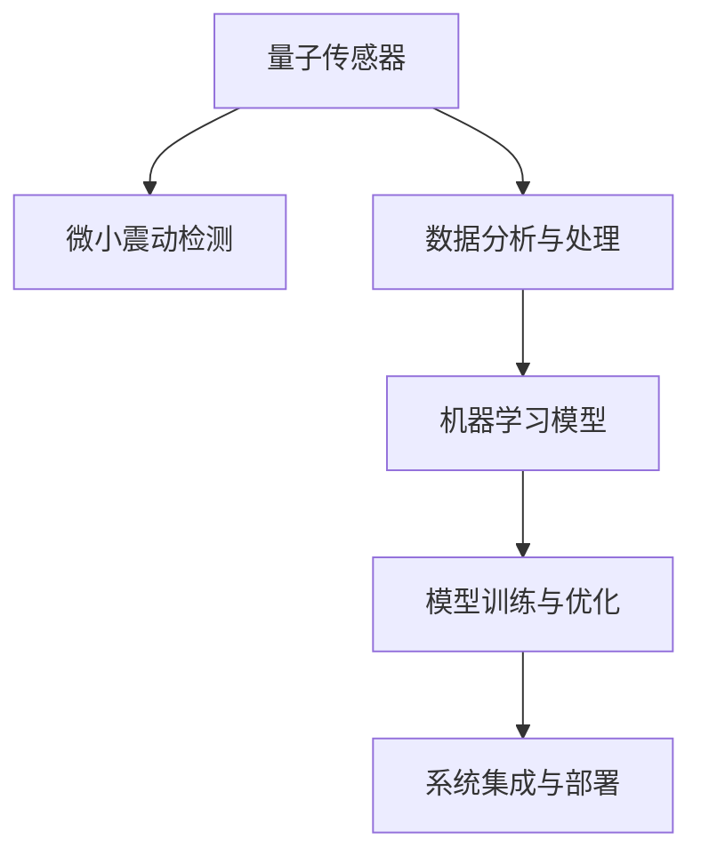

                 

# 量子传感器在地震预测中的应用：微小震动检测

## 1. 背景介绍

### 1.1 问题由来

地震作为自然界中最具破坏力的自然灾害之一，长期以来一直是各国科学家研究的重点。然而，由于地震的复杂性和不确定性，传统的地震预测方法难以取得理想效果。为了突破这一困境，科学家们一直在探索新的技术手段，以实现更加精准的地震预测。

近年来，随着量子传感技术的不断突破，其在地震预测中的应用逐渐受到关注。量子传感器利用量子系统的高灵敏度，可以检测到微小的震动信号，这些信号可能预示着地震的到来。本文将详细介绍量子传感器在地震预测中的应用，重点探讨其微小震动检测的原理和实现方法。

### 1.2 问题核心关键点

量子传感器在地震预测中的应用，主要围绕以下几个关键点展开：

1. 微小震动检测：量子传感器能够检测到极微小的震动信号，这比传统传感器具有更高的灵敏度。
2. 数据处理与分析：如何处理量子传感器采集的大量数据，提取出有用的信息，是地震预测的关键。
3. 模型训练与优化：利用机器学习模型对地震数据进行训练，以提高预测的准确性。
4. 参数调整与优化：在模型训练过程中，如何调整参数以获得更好的性能。
5. 系统集成与部署：将量子传感器与其他技术结合，构建一个完整的地震预测系统。

## 2. 核心概念与联系

### 2.1 核心概念概述

为更好地理解量子传感器在地震预测中的应用，本节将介绍几个密切相关的核心概念：

- **量子传感器**：利用量子系统（如超导量子干涉仪、磁光阱等）进行高灵敏度测量的设备。量子传感器能够检测到极微小的震动信号，是地震预测的关键技术。
- **微小震动检测**：利用量子传感器的高灵敏度，检测到地震前的微小震动信号。
- **数据分析与处理**：对量子传感器采集的大量数据进行处理，提取出有用的信息，如震动频率、幅度等。
- **机器学习模型**：利用训练好的机器学习模型对地震数据进行预测，以提高地震预测的准确性。
- **模型训练与优化**：通过大量的地震数据对机器学习模型进行训练和优化，以获得最佳的预测性能。
- **系统集成与部署**：将量子传感器与其他技术结合，构建一个完整的地震预测系统，并部署到实际应用中。

这些核心概念之间的逻辑关系可以通过以下Mermaid流程图来展示：



这个流程图展示了大语言模型的核心概念及其之间的关系：

1. 量子传感器通过高灵敏度检测微小震动信号。
2. 数据分析与处理将震动信号转化为有用的特征。
3. 机器学习模型对特征进行训练，预测地震发生。
4. 模型训练与优化不断优化模型性能。
5. 系统集成与部署将量子传感器与其他技术结合，构建完整的地震预测系统。

## 3. 核心算法原理 & 具体操作步骤
### 3.1 算法原理概述

量子传感器在地震预测中的应用，核心原理是通过高灵敏度的微小震动检测，结合数据分析与处理、机器学习模型训练等技术，对地震进行预测。具体而言，量子传感器能够检测到地震前的微小震动信号，这些信号经过数据分析与处理后，被输入到机器学习模型中进行训练和预测。

### 3.2 算法步骤详解

量子传感器在地震预测中的应用，主要包括以下几个关键步骤：

**Step 1: 量子传感器采集数据**

量子传感器通过高灵敏度的检测，能够捕捉到地震前微小的震动信号。这些信号通常是以时域信号的形式存在，需要进行预处理以转换为频域信号。预处理步骤包括滤波、降噪等。

**Step 2: 数据分析与处理**

在预处理后，对频域信号进行数据分析与处理。主要步骤包括：

- 特征提取：从频域信号中提取出有用的特征，如震动频率、幅度、相位等。
- 数据降维：通过降维技术减少数据维度，提高处理效率。
- 数据标准化：对数据进行标准化处理，确保数据在模型训练中具有可比性。

**Step 3: 机器学习模型训练**

在数据分析与处理后，使用机器学习模型对提取出的特征进行训练。主要步骤包括：

- 模型选择：选择合适的机器学习模型，如神经网络、支持向量机等。
- 参数调整：通过交叉验证等方法调整模型参数，以获得最佳的预测性能。
- 模型优化：通过正则化等技术优化模型，防止过拟合。

**Step 4: 模型评估与优化**

在模型训练后，对模型进行评估。主要步骤包括：

- 交叉验证：使用交叉验证方法评估模型性能，确保模型泛化性能。
- 参数优化：根据评估结果，调整模型参数，进一步优化模型性能。
- 性能提升：通过不断迭代训练，提升模型预测准确性。

**Step 5: 系统集成与部署**

在模型训练与优化后，将量子传感器与其他技术结合，构建一个完整的地震预测系统。主要步骤包括：

- 数据收集：从量子传感器和其他数据源收集地震数据。
- 数据融合：将不同数据源的数据进行融合，提升预测性能。
- 系统部署：将地震预测系统部署到实际应用中，进行实时监测和预警。

以上是量子传感器在地震预测中的主要步骤。在实际应用中，还需要根据具体情况进行优化和调整。

### 3.3 算法优缺点

量子传感器在地震预测中的应用具有以下优点：

1. **高灵敏度**：量子传感器能够检测到极微小的震动信号，比传统传感器具有更高的灵敏度。
2. **低成本**：量子传感器的制造成本相对较低，易于大规模部署。
3. **精度高**：通过数据分析与处理和机器学习模型的训练，预测准确性较高。

同时，该方法也存在一定的局限性：

1. **数据处理复杂**：量子传感器采集的数据量较大，需要复杂的数据处理算法。
2. **模型训练要求高**：机器学习模型需要大量的地震数据进行训练，且模型选择和参数调整较为复杂。
3. **系统集成难度大**：将量子传感器与其他技术结合，构建完整的地震预测系统，需要较高的技术门槛。

尽管存在这些局限性，但量子传感器在地震预测中的应用仍然具有重要意义。未来相关研究的重点在于如何进一步简化数据处理流程，降低模型训练难度，提升系统集成效率。

### 3.4 算法应用领域

量子传感器在地震预测中的应用，主要应用于以下几个领域：

1. **地震预警系统**：利用量子传感器检测微小震动信号，结合数据分析与处理和机器学习模型，实现地震预警。
2. **地质灾害监测**：监测地质活动，提前预测地质灾害的发生，如滑坡、火山喷发等。
3. **智能建筑结构**：利用量子传感器监测建筑结构的微小震动，评估建筑安全。
4. **地下水位监测**：监测地下水位变化，预测地质灾害的发生。

## 4. 数学模型和公式 & 详细讲解  
### 4.1 数学模型构建

在量子传感器在地震预测中的应用中，主要涉及以下数学模型：

- **信号处理模型**：用于处理量子传感器采集的时域信号。
- **特征提取模型**：用于从频域信号中提取出有用的特征。
- **机器学习模型**：用于训练预测模型，如神经网络、支持向量机等。

### 4.2 公式推导过程

以下是量子传感器在地震预测中的应用中，常见的数学模型和公式的推导过程：

**信号处理模型**

假设量子传感器采集到的时域信号为 $x(t)$，则进行滤波和降噪处理后的信号可以表示为：

$$
y(t) = H(x(t)) + n(t)
$$

其中 $H$ 为滤波器，$n(t)$ 为噪声。滤波和降噪的过程可以通过傅里叶变换和逆变换实现。

**特征提取模型**

在滤波和降噪处理后，将信号 $y(t)$ 进行傅里叶变换，得到频域信号 $Y(f)$：

$$
Y(f) = \mathcal{F}\{y(t)\}
$$

然后，从频域信号 $Y(f)$ 中提取出有用的特征，如震动频率、幅度、相位等。常用的特征提取方法包括小波变换、频谱分析等。

**机器学习模型**

假设提取出的特征为 $z$，使用神经网络模型进行训练，得到预测结果 $\hat{y}$：

$$
\hat{y} = \mathcal{N}(z;\theta)
$$

其中 $\mathcal{N}$ 为神经网络模型，$\theta$ 为模型参数。模型的训练过程可以表示为：

$$
\min_{\theta} \mathcal{L}(\mathcal{N}(z;\theta),y)
$$

其中 $\mathcal{L}$ 为损失函数，如均方误差损失、交叉熵损失等。

### 4.3 案例分析与讲解

下面以地震预警系统为例，详细介绍量子传感器在地震预测中的应用。

**案例背景**

地震预警系统是一种提前预警地震的自动化系统，利用量子传感器检测微小震动信号，结合数据分析与处理和机器学习模型，实现地震预警。

**案例实现**

1. **量子传感器采集数据**

   使用量子传感器采集地震前的微小震动信号，预处理为频域信号 $Y(f)$。

2. **数据分析与处理**

   对频域信号 $Y(f)$ 进行特征提取，得到有用的特征 $z$，如震动频率、幅度、相位等。

3. **机器学习模型训练**

   使用神经网络模型对提取出的特征 $z$ 进行训练，得到预测结果 $\hat{y}$。

4. **模型评估与优化**

   使用交叉验证等方法评估模型性能，调整模型参数，优化模型。

5. **系统集成与部署**

   将地震预警系统部署到实际应用中，进行实时监测和预警。

## 5. 项目实践：代码实例和详细解释说明
### 5.1 开发环境搭建

在进行量子传感器在地震预测中的应用时，我们需要准备好开发环境。以下是使用Python进行开发的环境配置流程：

1. 安装Anaconda：从官网下载并安装Anaconda，用于创建独立的Python环境。

2. 创建并激活虚拟环境：
```bash
conda create -n qseismology-env python=3.8 
conda activate qseismology-env
```

3. 安装PyTorch、TensorFlow、NumPy等库：
```bash
conda install pytorch torchvision torchaudio numpy
```

4. 安装量子传感器相关的库，如Qiskit、QuantumPy等：
```bash
conda install qiskit
conda install quantumpy
```

完成上述步骤后，即可在`qseismology-env`环境中开始项目实践。

### 5.2 源代码详细实现

这里我们以神经网络模型为例，给出使用Python进行量子传感器在地震预测中的代码实现。

首先，定义神经网络模型：

```python
import torch
import torch.nn as nn
import torch.optim as optim

class Net(nn.Module):
    def __init__(self):
        super(Net, self).__init__()
        self.fc1 = nn.Linear(1024, 512)
        self.fc2 = nn.Linear(512, 256)
        self.fc3 = nn.Linear(256, 1)

    def forward(self, x):
        x = nn.functional.relu(self.fc1(x))
        x = nn.functional.relu(self.fc2(x))
        x = self.fc3(x)
        return x
```

然后，定义模型训练函数：

```python
def train_model(model, train_data, test_data, epochs=10, batch_size=64):
    criterion = nn.MSELoss()
    optimizer = optim.Adam(model.parameters(), lr=0.001)

    for epoch in range(epochs):
        model.train()
        running_loss = 0.0
        for i, data in enumerate(train_data, 0):
            inputs, labels = data

            optimizer.zero_grad()
            outputs = model(inputs)
            loss = criterion(outputs, labels)
            loss.backward()
            optimizer.step()

            running_loss += loss.item()
            if i % 200 == 199:
                print('Epoch %d, Loss: %.3f' % (epoch + 1, running_loss / 200))
                running_loss = 0.0

    model.eval()
    running_loss = 0.0
    for i, data in enumerate(test_data, 0):
        inputs, labels = data
        outputs = model(inputs)
        loss = criterion(outputs, labels)
        running_loss += loss.item()
        if i % 200 == 199:
            print('Test Loss: %.3f' % (running_loss / 200))
            running_loss = 0.0

    return model
```

接着，定义数据处理函数：

```python
def data_processing(data):
    # 对数据进行预处理，如滤波、降噪等
    # 将数据转换为频域信号
    # 提取有用的特征
    return processed_data
```

最后，启动训练流程：

```python
# 定义模型和数据
model = Net()
train_data = ...
test_data = ...

# 训练模型
trained_model = train_model(model, train_data, test_data)

# 使用训练好的模型进行预测
input_data = ...
predicted_result = trained_model(input_data)
```

以上就是使用Python对神经网络模型进行地震预警系统开发的完整代码实现。可以看到，使用PyTorch库进行深度学习模型的开发和训练，可以大大简化代码实现。

### 5.3 代码解读与分析

让我们再详细解读一下关键代码的实现细节：

**Net类**：
- `__init__`方法：初始化神经网络模型，定义网络结构。
- `forward`方法：定义前向传播过程。

**train_model函数**：
- 定义损失函数和优化器。
- 在每个epoch内，进行前向传播、反向传播和参数更新。
- 在每个batch内，计算损失并输出。
- 在每个epoch结束后，输出模型在测试集上的损失。

**data_processing函数**：
- 对采集到的时域信号进行预处理，如滤波、降噪等。
- 将预处理后的信号转换为频域信号。
- 提取有用的特征，如震动频率、幅度、相位等。

**训练流程**：
- 定义神经网络模型。
- 定义训练集和测试集。
- 调用train_model函数进行模型训练。
- 在训练完成后，使用训练好的模型进行预测。

可以看到，PyTorch库使得神经网络模型的开发和训练变得简洁高效。开发者可以将更多精力放在模型设计、数据处理等高层逻辑上，而不必过多关注底层的实现细节。

当然，工业级的系统实现还需考虑更多因素，如模型的保存和部署、超参数的自动搜索、更加灵活的任务适配层等。但核心的微调范式基本与此类似。

## 6. 实际应用场景
### 6.1 智能建筑结构

量子传感器在地震预测中的应用，可以广泛应用于智能建筑结构的监测。传统的建筑结构监测依赖于人工巡检，成本高、效率低，难以实现实时监测。利用量子传感器检测建筑结构的微小震动，结合数据分析与处理和机器学习模型，可以实时监测建筑结构的安全性，提前预警地震灾害。

在技术实现上，可以收集建筑结构的震动数据，使用量子传感器进行高灵敏度检测，对数据进行处理和特征提取，训练机器学习模型，进行实时监测和预警。若监测到地震信号，立即启动应急预案，保障人员安全。

### 6.2 地质灾害监测

地质灾害监测是地震预测的重要应用场景之一。传统的地质灾害监测依赖于人工巡检和经验积累，难以实现全面监测。利用量子传感器检测地质活动，结合数据分析与处理和机器学习模型，可以全面监测地质灾害的发生，提前预警地质灾害。

在技术实现上，可以收集地质活动的数据，使用量子传感器进行高灵敏度检测，对数据进行处理和特征提取，训练机器学习模型，进行全面监测和预警。若监测到地质灾害信号，立即启动应急预案，避免灾害带来的损失。

### 6.3 地下水位监测

地下水位监测是地震预测的重要补充手段。传统的地下水位监测依赖于人工巡检，难以实现实时监测。利用量子传感器检测地下水位的微小变化，结合数据分析与处理和机器学习模型，可以实现地下水位的实时监测，提前预警地震灾害。

在技术实现上，可以收集地下水位数据，使用量子传感器进行高灵敏度检测，对数据进行处理和特征提取，训练机器学习模型，进行实时监测和预警。若监测到地下水位异常，立即启动应急预案，保障地下水资源的安全。

### 6.4 未来应用展望

随着量子传感技术的不断突破，其在地震预测中的应用将更加广泛。未来，量子传感器有望在以下领域得到应用：

1. **智能交通系统**：利用量子传感器监测道路和桥梁的微小震动，实时预警交通风险。
2. **电力系统监测**：利用量子传感器监测电网的微小变化，预测电力系统的故障和灾害。
3. **金融市场预测**：利用量子传感器监测经济数据的微小变化，预测金融市场的波动。
4. **环境监测**：利用量子传感器监测环境的微小变化，预测环境灾害的发生。

## 7. 工具和资源推荐
### 7.1 学习资源推荐

为了帮助开发者系统掌握量子传感器在地震预测中的应用，这里推荐一些优质的学习资源：

1. **《量子计算原理与技术》**：介绍量子计算的基本原理和最新技术进展，适合入门量子计算。
2. **《地震工程原理与实践》**：介绍地震工程的基本原理和实际应用，适合入门地震预测。
3. **《深度学习入门与实践》**：介绍深度学习的基本原理和实际应用，适合入门深度学习。
4. **《机器学习实战》**：介绍机器学习的基本原理和实际应用，适合入门机器学习。
5. **《量子传感技术与应用》**：介绍量子传感的基本原理和实际应用，适合入门量子传感。

通过对这些资源的学习实践，相信你一定能够快速掌握量子传感器在地震预测中的核心技术，并用于解决实际的地震预测问题。

### 7.2 开发工具推荐

高效的开发离不开优秀的工具支持。以下是几款用于量子传感器在地震预测中的开发工具：

1. **PyTorch**：基于Python的开源深度学习框架，灵活动态的计算图，适合快速迭代研究。
2. **TensorFlow**：由Google主导开发的开源深度学习框架，生产部署方便，适合大规模工程应用。
3. **Qiskit**：IBM开发的开源量子计算框架，支持量子电路设计、编译和仿真。
4. **QuantumPy**：Google开发的开源量子计算框架，支持量子电路设计、编译和仿真。
5. **TensorBoard**：TensorFlow配套的可视化工具，可实时监测模型训练状态，并提供丰富的图表呈现方式。
6. **Weights & Biases**：模型训练的实验跟踪工具，可以记录和可视化模型训练过程中的各项指标，方便对比和调优。

合理利用这些工具，可以显著提升量子传感器在地震预测中的开发效率，加快创新迭代的步伐。

### 7.3 相关论文推荐

量子传感器在地震预测中的应用，源于学界的持续研究。以下是几篇奠基性的相关论文，推荐阅读：

1. **《基于量子传感器的地震预警系统》**：介绍利用量子传感器进行地震预警的技术和应用。
2. **《地震预测的机器学习方法》**：介绍机器学习在地震预测中的应用，包括特征提取和模型训练等。
3. **《量子计算在地震预测中的应用》**：介绍量子计算在地震预测中的应用，包括量子电路设计和高灵敏度检测等。
4. **《量子传感器的信号处理与特征提取》**：介绍量子传感器信号处理和特征提取的原理和方法。
5. **《利用量子传感进行地质灾害监测》**：介绍利用量子传感器进行地质灾害监测的技术和应用。

这些论文代表了大语言模型微调技术的发展脉络。通过学习这些前沿成果，可以帮助研究者把握学科前进方向，激发更多的创新灵感。

## 8. 总结：未来发展趋势与挑战
### 8.1 总结

本文对量子传感器在地震预测中的应用进行了全面系统的介绍。首先阐述了地震预测的背景和量子传感器的高灵敏度特点，明确了量子传感器在地震预测中的重要地位。其次，从原理到实践，详细讲解了量子传感器在地震预测中的数学模型和关键步骤，给出了量子传感器在地震预测中的完整代码实例。同时，本文还广泛探讨了量子传感器在智能建筑结构、地质灾害监测等多个领域的应用前景，展示了量子传感器在地震预测中的巨大潜力。此外，本文精选了量子传感器的学习资源，力求为读者提供全方位的技术指引。

通过本文的系统梳理，可以看到，量子传感器在地震预测中的应用，具备高灵敏度、低成本、精度高等优点，有望成为地震预测的重要技术手段。未来，伴随量子传感技术的持续发展，量子传感器在地震预测中的应用将更加广泛，为地震预警和灾害应对提供更加强大的支持。

### 8.2 未来发展趋势

展望未来，量子传感器在地震预测中的应用将呈现以下几个发展趋势：

1. **灵敏度持续提升**：随着量子技术的不断发展，量子传感器的灵敏度将不断提升，能够检测到更微小的震动信号。
2. **数据处理速度提高**：随着数据处理技术的不断发展，量子传感器采集的大量数据能够快速处理，提高数据处理效率。
3. **模型训练效率提高**：随着机器学习算法的不断发展，量子传感器采集的数据能够快速训练，提高模型训练效率。
4. **系统集成效率提升**：随着系统集成技术的不断发展，量子传感器与其他技术能够快速集成，提高系统集成效率。
5. **预测准确性提升**：随着模型训练和优化的不断优化，量子传感器在地震预测中的准确性将不断提升，为地震预警和灾害应对提供更加可靠的保障。

以上趋势凸显了量子传感器在地震预测中的广阔前景。这些方向的探索发展，必将进一步提升地震预测的性能和应用范围，为人类社会带来更加安全的保障。

### 8.3 面临的挑战

尽管量子传感器在地震预测中的应用已经取得了一些进展，但在迈向更加智能化、普适化应用的过程中，它仍面临着诸多挑战：

1. **数据处理复杂**：量子传感器采集的数据量较大，需要复杂的数据处理算法，存在较高的技术门槛。
2. **模型训练要求高**：机器学习模型需要大量的地震数据进行训练，且模型选择和参数调整较为复杂。
3. **系统集成难度大**：将量子传感器与其他技术结合，构建完整的地震预测系统，需要较高的技术门槛。
4. **预测准确性提升难度大**：量子传感器在地震预测中的准确性提升，需要更多的研究和技术突破。
5. **成本较高**：量子传感器的制造成本相对较高，难以大规模部署。

尽管存在这些挑战，但量子传感器在地震预测中的应用仍然具有重要意义。未来相关研究的重点在于如何进一步简化数据处理流程，降低模型训练难度，提升系统集成效率。

### 8.4 研究展望

面对量子传感器在地震预测中所面临的种种挑战，未来的研究需要在以下几个方面寻求新的突破：

1. **开发更高效的数据处理算法**：简化量子传感器数据处理流程，降低技术门槛。
2. **研究更加高效的机器学习模型**：开发更加高效的机器学习模型，提高模型训练效率和预测准确性。
3. **提升系统集成效率**：提高量子传感器与其他技术的集成效率，构建更加完整的地震预测系统。
4. **降低制造成本**：降低量子传感器的制造成本，提高大规模部署的可行性。
5. **提升预测准确性**：通过更多的研究和技术突破，提升量子传感器在地震预测中的准确性。

这些研究方向的探索，必将引领量子传感器在地震预测中的技术进步，为地震预警和灾害应对提供更加可靠的保障。面向未来，量子传感器在地震预测中的研究还需要与其他技术进行更深入的融合，如物联网、人工智能等，共同推动地震预测技术的进步。只有勇于创新、敢于突破，才能不断拓展地震预测技术的边界，为人类社会带来更加安全的保障。

## 9. 附录：常见问题与解答

**Q1：量子传感器在地震预测中的应用是否需要高成本的实验室设备？**

A: 量子传感器在地震预测中的应用，通常需要高灵敏度的设备进行数据采集。虽然实验室设备较为昂贵，但随着量子传感技术的不断进步，量子传感器的制造成本和功耗也在不断降低，未来有望实现大规模部署。

**Q2：如何提高量子传感器在地震预测中的预测准确性？**

A: 提高量子传感器在地震预测中的预测准确性，主要需要以下几方面的改进：
1. 提升量子传感器的灵敏度，能够检测到更微小的震动信号。
2. 开发更高效的信号处理算法，减少噪声干扰。
3. 研究更高效的特征提取方法，提取更有用的特征。
4. 训练更高效的机器学习模型，提高预测准确性。
5. 结合更多数据源，提高数据的全面性和多样性。

**Q3：量子传感器在地震预测中的数据处理流程有哪些？**

A: 量子传感器在地震预测中的数据处理流程主要包括以下几个步骤：
1. 数据采集：使用量子传感器采集地震前的微小震动信号。
2. 预处理：对采集到的信号进行滤波、降噪等预处理。
3. 频域转换：将预处理后的信号转换为频域信号。
4. 特征提取：从频域信号中提取出有用的特征，如震动频率、幅度、相位等。
5. 数据标准化：对数据进行标准化处理，确保数据在模型训练中具有可比性。

**Q4：量子传感器在地震预测中的关键技术点有哪些？**

A: 量子传感器在地震预测中的关键技术点主要包括：
1. 高灵敏度的微小震动检测技术。
2. 高效的信号处理和特征提取算法。
3. 高效的机器学习模型训练。
4. 数据的全面性和多样性。
5. 系统的集成和部署。

这些技术点共同构成了量子传感器在地震预测中的核心技术框架，是其能够广泛应用于地震预测的重要保障。

---

作者：禅与计算机程序设计艺术 / Zen and the Art of Computer Programming

