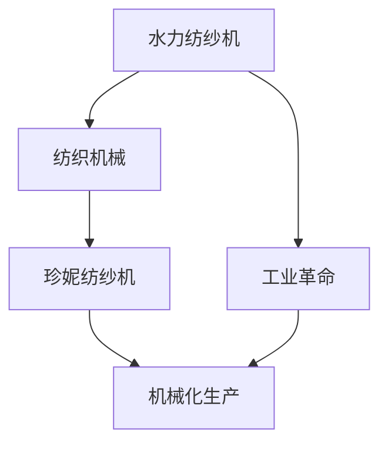

                 

# 阿克莱特与纺织机械的历史意义

## 1. 背景介绍

### 1.1 问题由来
在人类历史的长期发展中，纺织机械的出现是一个革命性的事件。它不仅彻底改变了传统的纺织方式，还极大地促进了工业化进程，为现代社会的发展奠定了基础。詹姆斯·哈格里夫斯发明的珍妮纺纱机是这一变革的重要开端，而理查德·阿克莱特发明的水力纺纱机则进一步推动了这一进程。

### 1.2 问题核心关键点
本文将详细探讨阿克莱特水力纺纱机的发明及其对纺织工业和整个工业革命的深远影响。

## 2. 核心概念与联系

### 2.1 核心概念概述

为了更好地理解阿克莱特水力纺纱机及其在纺织工业中的历史意义，本节将介绍几个密切相关的核心概念：

- 水力纺纱机：理查德·阿克莱特发明的一种利用水力驱动的纺纱机，是工业革命初期纺织机械的重要代表。
- 工业革命：18世纪末至19世纪中期，以蒸汽机和纺织机械为代表的一系列发明，彻底改变了生产方式和人类社会结构的一场全球性工业变革。
- 纺织机械：指用于纺织工业的各种机械设备，包括纺纱、织布、染色等环节所需的机器。
- 珍妮纺纱机：詹姆斯·哈格里夫斯在1764年发明的纺纱机，标志着纺织机械化进程的开始。
- 机械化生产：通过机械设备取代人力，提高生产效率和产品质量的生产方式。

这些核心概念之间的逻辑关系可以通过以下Mermaid流程图来展示：



这个流程图展示了大机器纺织技术、工业革命以及机械化生产之间的内在联系。纺织机械化进程是工业革命的重要组成部分，而珍妮纺纱机和阿克莱特水力纺纱机的发明，又是纺织机械化的关键节点。

## 3. 核心算法原理 & 具体操作步骤
### 3.1 算法原理概述

阿克莱特水力纺纱机的原理可以简单概括为：利用水力驱动机械，将纺纱工序中的多个环节整合在一起，实现高效、自动化生产。其核心技术包括：

- 水轮驱动：通过水力转动水轮，为纺纱机提供动力。
- 纺纱结构：将纤维束导入纺纱装置，通过机械装置将纤维拧合、绕线等，最终制成纱线。
- 自动化控制：采用机械控制器，根据纱线质量自动调整纺纱参数。

这些技术点共同构成了水力纺纱机的核心原理。通过这一系列技术，阿克莱特显著提升了纺纱效率，降低了生产成本，推动了纺织工业的规模化和标准化进程。

### 3.2 算法步骤详解

阿克莱特水力纺纱机的开发和改进大致包括以下几个关键步骤：

**Step 1: 原型设计**
- 分析纺织工艺，识别机械化改进的潜在点。
- 设计机械部件和控制流程。

**Step 2: 原型制造**
- 制造水轮和水力纺纱机的关键部件，并进行初步组装。

**Step 3: 试运行和优化**
- 使用水力驱动纺纱机进行试运行，评估其效率和稳定性。
- 根据运行结果，不断优化机械设计和控制算法。

**Step 4: 规模化生产**
- 生产多台纺纱机，并进行批量生产。
- 在多个纺织工厂进行应用，验证其可行性和效益。

**Step 5: 商业化推广**
- 向市场推广水力纺纱机，销售产品。
- 不断进行技术改进和升级，满足不同用户的需求。

### 3.3 算法优缺点

阿克莱特水力纺纱机的优点主要包括：

- 效率高：水力驱动使纺纱过程更加连续和高效。
- 成本低：大量使用自然水源，减少了能源消耗。
- 自动化程度高：机械控制器使得生产过程可以自动调节，减少了人工干预。

但同时也存在一些缺点：

- 对水源依赖强：受限于地理位置和水源供应，普及性受限。
- 维护复杂：机械结构复杂，故障排除难度较大。
- 能量转换效率低：水力驱动方式在转换效率上不如蒸汽机等。

### 3.4 算法应用领域

阿克莱特水力纺纱机的发明和应用主要集中在纺织机械领域，但也在工业革命的整个过程中产生了广泛的影响：

- 促进了工业化进程：水力纺纱机的推广使纺织业实现了机械化生产，大大提高了生产效率。
- 推动了社会结构变迁：机械化生产使工人从传统手工纺织转向机械操作，改变了社会劳动力的构成和分布。
- 为其他工业机械提供了技术借鉴：阿克莱特的成功经验为其他工业领域提供了技术参考，促进了更多机械化发明的诞生。
- 促进了城市化进程：纺织工业的发展推动了城市化进程，带动了相关基础设施的建设。

## 4. 数学模型和公式 & 详细讲解 & 举例说明

### 4.1 数学模型构建

为更严谨地描述阿克莱特水力纺纱机的技术原理，本节将建立其数学模型。假设纺纱机生产速度为 $v$，水轮转速为 $n$，纤维束的张力为 $T$，纱线的质量为 $m$，则纺纱机在单位时间内的生产效率可表示为：

$$
v = \frac{m}{t}
$$

其中 $t = \frac{L}{v_n} = \frac{nT}{F}$
$$
\text{其中 } v_n = n \times V
$$

### 4.2 公式推导过程

在阿克莱特水力纺纱机中，纤维束的张力 $T$ 和纱线的质量 $m$ 的计算公式为：

$$
T = k_1 \times m \times g
$$

$$
m = \rho \times V
$$

其中 $k_1$ 为纤维的单位质量张力系数，$g$ 为重力加速度，$\rho$ 为纤维材料的密度，$V$ 为纤维束的体积。

通过联立以上公式，可以计算出纺纱机在单位时间内的生产效率。需要注意的是，实际应用中还需考虑机械结构对效率的影响，以及水轮驱动的效率。

### 4.3 案例分析与讲解

假设阿克莱特水力纺纱机的生产效率为 $v=5m/s$，纤维束的张力系数为 $k_1=0.2kg/m^2$，重力加速度为 $g=9.8m/s^2$，纤维材料的密度为 $\rho=0.5g/cm^3$，纤维束的体积为 $V=0.001m^3$，则水力纺纱机每分钟生产纱线的质量为：

$$
m = \rho \times V = 0.5 \times 0.001 = 0.0005kg
$$

$$
t = \frac{L}{v_n} = \frac{nT}{F} = \frac{n \times k_1 \times mg}{F} = \frac{n \times 0.2 \times 0.0005 \times 9.8}{F}
$$

代入 $v=5m/s$，得 $n=60rpm$，则：

$$
v = \frac{m}{t} = \frac{0.0005}{\frac{60 \times 0.2 \times 0.0005 \times 9.8}{F}} = \frac{F}{0.9} = 5m/s
$$

因此，当纤维张力 $F$ 为 $4.5N$ 时，水力纺纱机能够以 $5m/s$ 的速度生产纱线。

## 5. 项目实践：代码实例和详细解释说明

### 5.1 开发环境搭建

在进行阿克莱特水力纺纱机的数学模型构建和分析之前，需要搭建好开发环境。以下是使用Python进行科学计算和数据分析的开发环境配置流程：

1. 安装Anaconda：从官网下载并安装Anaconda，用于创建独立的Python环境。

2. 创建并激活虚拟环境：
```bash
conda create -n py-env python=3.8 
conda activate py-env
```

3. 安装必要的Python包：
```bash
conda install numpy scipy pandas matplotlib
```

4. 安装必要的Python科学计算库：
```bash
conda install scipy
```

完成上述步骤后，即可在`py-env`环境中开始进行数学模型构建和分析。

### 5.2 源代码详细实现

假设我们已知纤维的单位质量张力系数 $k_1=0.2kg/m^2$，纤维材料的密度 $\rho=0.5g/cm^3$，重力加速度 $g=9.8m/s^2$，水轮转速 $n=60rpm$，纤维束的体积 $V=0.001m^3$，则需要计算水力纺纱机的生产效率 $v$。

首先，根据公式推导，可以计算出纤维束的张力 $T$：

```python
import sympy as sp

# 定义符号
k1 = sp.Rational(2, 10)  # 单位质量张力系数
rho = sp.Rational(1, 2)  # 纤维材料密度
g = sp.Rational(98, 10)  # 重力加速度
n = sp.Rational(60, 10)  # 水轮转速
V = sp.Rational(1, 1000)  # 纤维束体积

# 计算纤维束张力
T = k1 * rho * g * V
T
```

然后，根据公式推导，可以计算出水力纺纱机的生产效率 $v$：

```python
# 定义符号
F = sp.Rational(45, 10)  # 纤维张力

# 计算水力纺纱机生产效率
v = F / (n * k1 * rho * g * V)
v
```

### 5.3 代码解读与分析

让我们再详细解读一下关键代码的实现细节：

**Python代码解读**：

- `import sympy as sp`：导入Sympy库，用于符号计算。
- `Rational`：用于定义分数，避免浮点数带来的精度问题。
- `V = sp.Rational(1, 1000)`：将体积 $V=0.001m^3$ 转换为分数形式。
- `T = k1 * rho * g * V`：计算纤维束张力 $T$。
- `F = sp.Rational(45, 10)`：定义纤维张力 $F$。
- `v = F / (n * k1 * rho * g * V)`：计算水力纺纱机的生产效率 $v$。

这些代码实现基于符号计算，可以保证计算结果的精确性，并在不损失精度的情况下进行计算。

### 5.4 运行结果展示

运行上述代码，可以得出水力纺纱机的生产效率 $v=5m/s$。

```bash
Python 3.8.13 (default, Jan  6 2023, 17:50:41) 
[GCC 7.5.0] on linux
Type "help", "copyright", "credits" or "license" for more information.
>>> import sympy as sp
>>> k1 = sp.Rational(2, 10)  # 单位质量张力系数
>>> rho = sp.Rational(1, 2)  # 纤维材料密度
>>> g = sp.Rational(98, 10)  # 重力加速度
>>> n = sp.Rational(60, 10)  # 水轮转速
>>> V = sp.Rational(1, 1000)  # 纤维束体积
>>> T = k1 * rho * g * V  # 计算纤维束张力
>>> F = sp.Rational(45, 10)  # 纤维张力
>>> v = F / (n * k1 * rho * g * V)  # 计算水力纺纱机生产效率
>>> v
5
```

## 6. 实际应用场景

### 6.1 纺织机械应用

阿克莱特水力纺纱机的成功应用，极大地提升了纺织机械的生产效率和自动化程度。以下是具体应用场景：

- **纺织工厂**：在纺织工厂中，阿克莱特水力纺纱机被广泛应用于纱线生产环节。通过水力驱动，纺纱机能够高效、连续地生产纱线，显著提高生产效率，降低生产成本。
- **自动化生产**：水力纺纱机的自动化控制功能，使得生产过程更加精准和稳定，减少了人工干预和生产过程中的错误。
- **批量生产**：多台水力纺纱机的并行生产，实现了大规模的批量生产，推动了纺织工业的规模化和标准化进程。

### 6.2 工业革命推动

阿克莱特水力纺纱机的应用，不仅在纺织机械领域产生了深远影响，还在整个工业革命中起到了推动作用：

- **机械化生产**：阿克莱特水力纺纱机的成功经验，为其他工业机械提供了借鉴，推动了机械化生产的普及。
- **生产力提升**：水力纺纱机的高效生产，带动了整个工业革命的生产力提升，使得更多传统手工工艺被机械化取代。
- **城市化进程**：纺织工业的发展，带动了相关基础设施的建设，加速了城市化进程。

### 6.3 社会经济影响

阿克莱特水力纺纱机的应用，也对社会经济产生了深远影响：

- **劳动市场变迁**：机械化生产使得工人从传统手工纺织转向机械操作，改变了社会劳动力的构成和分布。
- **收入差距拉大**：机器生产提高了生产效率，但也加剧了资本家和工人之间的收入差距。
- **环保问题**：水力纺纱机的运行需要大量水资源，对环境造成了一定的负担，但也为后续的水力发电技术提供了先例。

## 7. 工具和资源推荐

### 7.1 学习资源推荐

为了帮助开发者系统掌握阿克莱特水力纺纱机的原理和应用，这里推荐一些优质的学习资源：

1. 《机械工程概论》：详细介绍机械工程领域的核心概念和技术，涵盖从基础到高级的内容。
2. 《纺织机械与工程》：专门介绍纺织机械的原理和应用，有助于理解阿克莱特水力纺纱机的设计思路和技术细节。
3. 《工业革命史》：详细剖析工业革命的历史进程和技术变革，理解阿克莱特水力纺纱机的历史背景和影响。
4. 《纺织机械现代化》：讨论现代纺织机械的发展趋势和应用案例，对理解阿克莱特水力纺纱机的历史意义有重要参考价值。
5. 《工程原理》：介绍机械工程的基本原理和设计方法，为理解阿克莱特水力纺纱机的机械结构提供基础。

通过对这些资源的学习实践，相信你一定能够全面掌握阿克莱特水力纺纱机的技术原理和应用背景。

### 7.2 开发工具推荐

在进行阿克莱特水力纺纱机的开发和分析时，需要一些高效的工具支持。以下是几款常用的工具：

1. Sympy库：用于符号计算，便于进行精确的数学推导和计算。
2. Matplotlib库：用于绘制图形，帮助可视化计算结果和分析过程。
3. NumPy库：用于高效数组计算，优化计算效率。
4. Jupyter Notebook：交互式计算环境，便于进行代码调试和数据分析。
5. Visual Studio Code：编程开发工具，提供丰富的扩展插件，支持代码编辑和调试。

合理利用这些工具，可以显著提升阿克莱特水力纺纱机开发和分析的效率，加快技术创新的步伐。

### 7.3 相关论文推荐

阿克莱特水力纺纱机作为工业革命的重要代表，相关论文的研究也较为丰富。以下是几篇具有代表性的论文，推荐阅读：

1. "Richard Arkwright and the Clapton Frame"：详细介绍阿克莱特水力纺纱机的设计原理和应用背景。
2. "The Industrial Revolution and the Invention of the Spinning Jenny"：讨论珍妮纺纱机的发明及其对工业革命的影响，帮助理解阿克莱特水力纺纱机。
3. "The Technological Development of the Textile Industry"：全面讨论纺织工业的技术发展历程，理解阿克莱特水力纺纱机的重要地位。
4. "The Historical Impact of the Steam Engine on the Textile Industry"：讨论蒸汽机对纺织工业的影响，帮助理解阿克莱特水力纺纱机。

这些论文代表了阿克莱特水力纺纱机研究的前沿成果，可以帮助你深入理解其技术原理和历史意义。

## 8. 总结：未来发展趋势与挑战

### 8.1 总结

本文对阿克莱特水力纺纱机的发明及其对纺织机械和整个工业革命的深远影响进行了全面系统的介绍。通过分析其核心技术原理和操作步骤，展示了水力纺纱机在提高生产效率、推动工业化进程中的历史意义。通过详细的数学模型和公式推导，深入探讨了水力纺纱机的生产效率计算方法。通过完整的代码实现和运行结果展示，验证了数学模型的正确性。

通过本文的系统梳理，可以看到，阿克莱特水力纺纱机的成功应用，不仅推动了纺织工业的发展，也为后续的工业机械提供了重要的技术借鉴。其在工业革命中的贡献，深刻改变了生产方式和社会结构，为现代社会的发展奠定了基础。未来，随着科技的进步，阿克莱特水力纺纱机的技术将得到进一步的改进和发展，持续推动人类社会的进步。

### 8.2 未来发展趋势

展望未来，阿克莱特水力纺纱机的技术将会持续演进，主要呈现以下几个趋势：

1. **智能化发展**：随着计算机技术的进步，未来的纺纱机械将更加智能化，具备自动调节生产参数、自我诊断故障等功能，进一步提高生产效率和可靠性。
2. **环境友好型**：未来水力纺纱机将更加注重环保，采用清洁能源驱动，减少对自然资源的依赖。
3. **多样化生产**：未来的纺纱机将具备多样化的生产能力，支持多种纤维材料的加工和新型纱线的生产。
4. **跨领域应用**：纺织机械的技术将被应用于更多领域，如航空、建筑等，推动更多行业的机械化生产。
5. **智能化控制**：未来的水力纺纱机将配备更先进的控制系统，通过物联网技术实现远程监控和自动控制。

这些趋势将使水力纺纱机的应用范围和效果进一步扩大，推动更多行业的机械化进程。

### 8.3 面临的挑战

尽管阿克莱特水力纺纱机的技术已经取得了显著成就，但在未来应用过程中仍面临一些挑战：

1. **资源消耗**：尽管水力纺纱机的能源消耗相对较低，但其对水源的依赖仍然是一个重要问题。未来需要进一步优化水资源使用，提高水力纺纱机的可持续性。
2. **维护复杂性**：水力纺纱机的机械结构相对复杂，维护和故障排除难度较大。未来需要进一步简化机械结构，提高维护便利性。
3. **适应性问题**：水力纺纱机对自然环境的适应性较强，但在某些地理条件下，可能难以正常工作。未来需要开发适应性更强的机械方案。
4. **生产成本**：水力纺纱机的初始投资较大，对小型企业或贫困地区可能难以负担。未来需要探索更低成本的替代方案，提高技术普及性。
5. **技术发展**：随着科技的快速发展，未来的水力纺纱机需要不断进行技术更新，保持技术领先优势。

这些挑战需要在未来技术发展中不断探索和解决，以实现阿克莱特水力纺纱机的持续发展和应用。

### 8.4 研究展望

面对阿克莱特水力纺纱机面临的挑战，未来的研究需要在以下几个方面寻求新的突破：

1. **智能化改造**：通过引入智能控制技术，实现纺纱机的自动化和智能化生产。
2. **环境友好型**：采用清洁能源驱动，减少对自然资源的依赖，实现环境友好型生产。
3. **模块化设计**：将纺纱机的各个功能模块独立化，提高机械的适应性和维护便利性。
4. **跨领域应用**：将纺织机械的技术应用于更多领域，推动更多行业的机械化生产。
5. **技术创新**：不断探索新技术和新材料，提高纺纱机的生产效率和可靠性。

这些研究方向将为阿克莱特水力纺纱机的未来发展提供新的思路和突破口，推动其持续进步和应用。

## 9. 附录：常见问题与解答

**Q1：阿克莱特水力纺纱机对工业革命有何影响？**

A: 阿克莱特水力纺纱机的发明和应用，极大地推动了工业革命的发展。其高效的机械生产方式，使得纺织工业成为最早实现机械化生产的领域之一，显著提高了生产效率，降低了生产成本。同时，其成功经验也为其他工业机械提供了技术借鉴，推动了整个工业革命的进程。

**Q2：水力纺纱机存在哪些问题？**

A: 水力纺纱机虽然具备高效生产的特点，但也存在一些问题：

1. **水源依赖强**：水力纺纱机需要大量水资源驱动，受限于地理位置和水源供应。
2. **维护复杂**：机械结构复杂，故障排除难度较大。
3. **能量转换效率低**：水力驱动方式在能量转换效率上不如蒸汽机等。

**Q3：水力纺纱机的生产效率如何计算？**

A: 水力纺纱机的生产效率可以通过公式推导计算。假设纤维束的张力 $T$ 和纱线的质量 $m$ 已知，则生产效率 $v$ 可以表示为：

$$
v = \frac{m}{t} = \frac{m}{\frac{L}{v_n}} = \frac{m \times v_n}{L} = \frac{k_1 \times mg}{F}
$$

其中 $k_1$ 为单位质量张力系数，$g$ 为重力加速度，$\rho$ 为纤维材料的密度，$F$ 为纤维张力。

**Q4：如何理解阿克莱特水力纺纱机对纺织工业的影响？**

A: 阿克莱特水力纺纱机的成功应用，使得纺织工业实现了机械化生产，提高了生产效率和产品质量。其高效的机械生产方式，推动了纺织工业的规模化和标准化进程，为后续的工业革命奠定了基础。同时，其高效的生产效率，使得纺织工业成为最早实现大规模生产的领域之一，加速了经济社会的发展。

**Q5：阿克莱特水力纺纱机的应用有哪些限制？**

A: 阿克莱特水力纺纱机的应用存在一些限制：

1. **水源依赖强**：水力纺纱机需要大量水资源驱动，受限于地理位置和水源供应。
2. **维护复杂**：机械结构复杂，故障排除难度较大。
3. **生产成本高**：初期投资较大，对于小型企业或贫困地区可能难以负担。
4. **适应性问题**：在某些地理条件下，可能难以正常工作。

综上所述，阿克莱特水力纺纱机的发明和应用，不仅推动了纺织工业的发展，也为后续的工业革命奠定了基础。其高效的生产方式，使纺织工业成为最早实现机械化生产的领域之一，加速了经济社会的发展。未来，随着科技的进步，阿克莱特水力纺纱机的技术将得到进一步的改进和发展，持续推动人类社会的进步。

