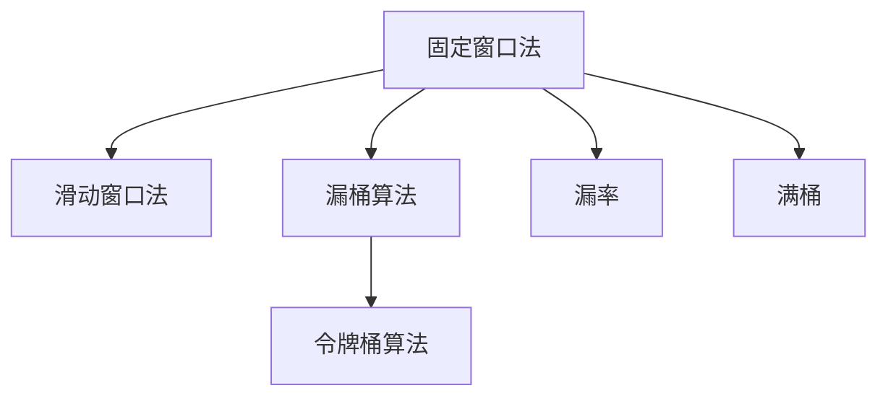

                 

## 1. 背景介绍

在网络世界的竞技场上，各种安全威胁如影随形，其中分布式拒绝服务攻击（DDoS）是一种常见的、极具破坏力的攻击手段。DDoS攻击通过大量恶意流量过载服务器，使得服务无法正常响应合法用户请求，给企业业务运营带来严重风险。限流（Rate Limiting）技术作为DDoS防护的基石，成为保障网络安全、提升系统稳定性的重要手段。

### 1.1 问题由来
网络攻击者通过控制大量僵尸网络，发起高强度的攻击流量，导致目标服务器带宽耗尽，响应时间急剧延长，甚至直接宕机，无法提供正常服务。特别是在诸如电子商务、金融、云服务等关键领域，DDoS攻击可能造成严重的经济损失和信誉损害。

为应对DDoS攻击，传统方式依赖硬件设备，如防火墙、负载均衡器等，但这些设备部署复杂、维护困难，且难以应对复杂的攻击场景。而现代软件限流技术，通过在应用程序层面的流量控制，能够实时响应流量变化，提供更加灵活、高效的防护手段。

### 1.2 问题核心关键点
限流技术通过控制单位时间内的请求数量，防止系统被恶意流量淹没。核心要点包括：

- 定义限流窗口：确定统计和限流的时间窗口。
- 统计流量数据：根据设定窗口统计请求次数。
- 判断是否限流：超过阈值即触发限流，防止请求泛滥。
- 返回响应：向用户返回限流错误码，保证用户体验。

具体实现中，限流算法常采用固定窗口法、滑动窗口法和漏桶算法等。

## 2. 核心概念与联系

### 2.1 核心概念概述

为更好地理解限流技术，本节将介绍几个关键概念：

- 固定窗口法：统计指定时间窗口内的请求次数，达到上限即限流。
- 滑动窗口法：采用多个时间窗口，动态调整窗口大小，适应不同负载情况。
- 漏桶算法：使用固定容量桶子模拟流量控制，确保速率恒定。
- 令牌桶算法：漏桶算法的一种变形，通过令牌来实现对流量速率的限制。
- 漏率与满桶：漏桶中的漏出速率和桶子满容量，是漏桶算法的基础参数。

这些概念之间的逻辑关系可以通过以下Mermaid流程图来展示：



这个流程图展示了几类限流算法的核心概念及其之间的关系：

- 固定窗口法和滑动窗口法基于不同的时间窗口统计请求，是流量控制的两种基本方法。
- 漏桶算法和令牌桶算法是漏桶算法的一种变形，通过动态调整桶子容量和漏出速率，实现更灵活的流量控制。
- 漏率和满桶是漏桶算法的重要参数，影响限流的精准度和策略。

## 3. 核心算法原理 & 具体操作步骤

### 3.1 算法原理概述

限流算法旨在通过控制请求速率，防止系统被恶意流量淹没。其核心思想是：在有限的时间内，确保请求速率不超过设定的阈值，避免系统过载。

具体而言，限流算法会在指定的时间窗口内统计请求次数，当统计值超过预设阈值时，触发限流，拒绝后续请求。限流策略通常基于时间窗口的固定或滑动机制，或采用漏桶、令牌桶等动态调整的算法，以适应不同流量模式。

### 3.2 算法步骤详解

#### 3.2.1 固定窗口法

1. **初始化**：设定限流窗口大小 $T$，初始化令牌桶 $T$。
2. **令牌生成**：每秒生成一个令牌放入令牌桶中，令牌数量为 $T$。
3. **请求处理**：每个请求消耗一个令牌，若桶为空则拒绝请求。
4. **令牌回收**：令牌桶中令牌数溢出时，令牌自动回流入桶，恢复令牌数。
5. **统计周期**：每个统计周期 $T$，重新生成令牌，初始化令牌桶。

#### 3.2.2 滑动窗口法

1. **初始化**：设定限流窗口大小 $T$，初始化令牌桶 $T$。
2. **令牌生成**：每秒生成一个令牌放入令牌桶中，令牌数量为 $T$。
3. **请求处理**：每个请求消耗一个令牌，若桶为空则拒绝请求。
4. **令牌回收**：令牌桶中令牌数溢出时，令牌自动回流入桶，恢复令牌数。
5. **统计周期**：每 $t$ 时间周期，重新生成令牌，调整令牌桶大小。

#### 3.2.3 漏桶算法

1. **初始化**：设定漏桶容量 $C$，初始化桶中令牌数为 $C$。
2. **请求处理**：每个请求消耗一个令牌，若桶为空则拒绝请求。
3. **令牌漏出**：每秒漏出一个令牌，漏出速率 $\lambda$。
4. **令牌恢复**：当令牌数为零时，请求被拒绝，否则令牌数减一。
5. **桶状态更新**：漏桶容量 $C$ 保持固定，令牌数不超过 $C$。

#### 3.2.4 令牌桶算法

1. **初始化**：设定令牌桶容量 $C$，初始化桶中令牌数为 $C$。
2. **请求处理**：每个请求消耗一个令牌，若桶为空则拒绝请求。
3. **令牌生成**：每秒生成一个令牌放入令牌桶中，令牌数量为 $T$。
4. **令牌回收**：令牌桶中令牌数溢出时，令牌自动回流入桶，恢复令牌数。
5. **桶状态更新**：令牌桶容量 $C$ 保持固定，令牌数不超过 $C$。

### 3.3 算法优缺点

限流算法具有以下优点：

1. **简单高效**：实现原理直观，易于理解和实现。
2. **灵活调整**：通过调整时间窗口大小、令牌生成速率、漏率等参数，可灵活适应不同流量模式。
3. **透明性好**：限流过程不改变原有系统结构，对系统透明，易于集成和部署。

同时，该算法也存在一定的局限性：

1. **无法应对突发流量**：固定窗口法对突发的流量峰值响应较慢，可能导致系统瞬间过载。
2. **精度有限**：固定窗口法统计精度受窗口大小影响，可能无法准确反映流量变化。
3. **复杂度较高**：滑动窗口法涉及多个时间窗口的维护，实现复杂度较高。
4. **系统负载不均**：漏桶算法和令牌桶算法可能因漏桶容量和令牌生成速率不匹配，导致系统负载不均。

### 3.4 算法应用领域

限流技术广泛应用于各类网络服务，包括：

1. **Web 服务器**：通过控制 HTTP 请求速率，防止网站被恶意流量淹没。
2. **API 接口**：限制 API 调用频率，避免超负荷请求。
3. **游戏服务器**：控制玩家游戏行为，防止玩家恶意刷榜或攻击。
4. **云服务**：防止云平台被 DDoS 攻击流量冲击，确保服务稳定。
5. **社交网络**：限制用户访问速率，防止恶意刷帖或恶意注册。

此外，限流技术在防止恶意流量攻击、保护用户隐私等方面也有重要应用。

## 4. 数学模型和公式 & 详细讲解 & 举例说明

### 4.1 数学模型构建

设 $n_t$ 表示 $t$ 时刻的请求数量，$C$ 表示限流窗口大小，$T$ 表示令牌生成速率，$\lambda$ 表示漏率，$t$ 表示当前时间。

令牌桶算法的状态转移方程为：

$$
n_t = 
\begin{cases} 
\min(\text{令牌数} - 1, C) + 1, & \text{令牌数} \geq 1 \\
\max(\text{令牌数} - 1, 0), & \text{令牌数} < 1 \\
\end{cases}
$$

令牌生成和漏出过程可用以下公式表示：

$$
\text{令牌数}_{t+1} = \max(\text{令牌数}_t - 1, 0) + \max(0, T - \lambda)
$$

其中 $\lambda$ 表示每秒漏出的令牌数。

### 4.2 公式推导过程

令牌桶算法的数学推导主要基于令牌生成和漏出机制，考虑时间和令牌数的动态变化。

令牌生成过程可以表示为：

$$
\text{令牌数}_t = \begin{cases} 
\text{令牌数}_{t-1} - 1, & \text{令牌数}_{t-1} > 0 \\
C, & \text{令牌数}_{t-1} = 0 \\
\end{cases}
$$

漏出过程可以表示为：

$$
\text{令牌数}_t = \begin{cases} 
\text{令牌数}_{t-1} - 1, & \text{令牌数}_{t-1} > 0 \\
\text{令牌数}_{t-1}, & \text{令牌数}_{t-1} \leq 0 \\
\end{cases}
$$

结合上述两个过程，可以得到令牌桶算法的状态转移方程：

$$
n_t = 
\begin{cases} 
\min(\text{令牌数}_t - 1, C) + 1, & \text{令牌数}_t \geq 1 \\
\max(\text{令牌数}_t - 1, 0), & \text{令牌数}_t < 1 \\
\end{cases}
$$

令牌生成和漏出过程可用以下公式表示：

$$
\text{令牌数}_{t+1} = \max(\text{令牌数}_t - 1, 0) + \max(0, T - \lambda)
$$

其中 $\lambda$ 表示每秒漏出的令牌数。

### 4.3 案例分析与讲解

#### 4.3.1 案例一：Web 服务器限流

假设一个 Web 服务器设定限流窗口大小为 100 秒，令牌生成速率为 1 个令牌/秒。每个请求消耗一个令牌，漏出速率为 0.1 个令牌/秒。

首先计算 $t=100$ 秒时的令牌数：

$$
\text{令牌数}_{100} = \max(\text{令牌数}_{99} - 1, 0) + \max(0, 1 - 0.1) = 1 + 0.9 = 1.9
$$

当 $t=101$ 秒时，令牌数变为：

$$
\text{令牌数}_{101} = \max(\text{令牌数}_{100} - 1, 0) + \max(0, 1 - 0.1) = 0.9 + 0.9 = 1.8
$$

当 $t=102$ 秒时，令牌数变为：

$$
\text{令牌数}_{102} = \max(\text{令牌数}_{101} - 1, 0) + \max(0, 1 - 0.1) = 0.8 + 0.9 = 1.7
$$

以此类推，直到令牌数小于 0 时，令牌数恒定为 0。此时服务器将拒绝所有请求，进入限流状态。

#### 4.3.2 案例二：游戏服务器限流

假设一个游戏服务器设定令牌桶容量为 100，令牌生成速率为 1 个令牌/秒。每个玩家每秒最多可以生成 5 个请求，漏出速率为 0.1 个令牌/秒。

首先计算 $t=100$ 秒时的令牌数：

$$
\text{令牌数}_{100} = \max(\text{令牌数}_{99} - 1, 0) + \max(0, 1 - 0.1) = 1 + 0.9 = 1.9
$$

当 $t=101$ 秒时，令牌数变为：

$$
\text{令牌数}_{101} = \max(\text{令牌数}_{100} - 1, 0) + \max(0, 1 - 0.1) = 0.9 + 0.9 = 1.8
$$

当 $t=102$ 秒时，令牌数变为：

$$
\text{令牌数}_{102} = \max(\text{令牌数}_{101} - 1, 0) + \max(0, 1 - 0.1) = 0.8 + 0.9 = 1.7
$$

以此类推，直到令牌数小于 0 时，令牌数恒定为 0。此时服务器将拒绝所有请求，进入限流状态。

## 5. 项目实践：代码实例和详细解释说明

### 5.1 开发环境搭建

在进行限流实践前，我们需要准备好开发环境。以下是使用Python进行 Flask 开发的环境配置流程：

1. 安装Anaconda：从官网下载并安装Anaconda，用于创建独立的Python环境。

2. 创建并激活虚拟环境：
```bash
conda create -n rate-limiting python=3.8 
conda activate rate-limiting
```

3. 安装Flask：
```bash
pip install flask
```

4. 安装Flask-Limiter：
```bash
pip install flask-limiter
```

完成上述步骤后，即可在`rate-limiting`环境中开始限流实践。

### 5.2 源代码详细实现

这里我们以 Flask 应用为例，给出限流的PyTorch代码实现。

首先，定义限流器：

```python
from flask_limiter import Limiter
from flask_limiter.util import get_remote_address
from flask import Flask

app = Flask(__name__)

limiter = Limiter(app, key_func=get_remote_address)
```

然后，配置限流策略：

```python
limiter.limit('100/day', '127.0.0.1')  # 每天最多100次请求，指定IP地址
```

接着，定义路由处理函数：

```python
@app.route('/')
def hello():
    limiter.limit('5/minute')  # 每分钟最多5次请求
    return 'Hello, World!'
```

最后，启动 Flask 应用：

```python
if __name__ == '__main__':
    app.run()
```

### 5.3 代码解读与分析

这里我们详细解读一下关键代码的实现细节：

- `Limiter`类：使用Flask-Limiter库，实现限流功能。
- `key_func`方法：指定限流器的 key 函数，用于识别不同客户端。
- `limit`方法：配置限流规则，指定 IP 地址、时间窗口、请求次数等。
- `route`装饰器：定义路由处理函数，在函数内部调用 `limiter.limit` 设置路由限流规则。
- `app.run`：启动 Flask 应用，进入 HTTP 监听模式。

通过 Flask 的灵活路由处理，我们可以在路由级别上灵活配置限流策略，实现不同场景下的流量控制。

## 6. 实际应用场景

### 6.1 Web 服务器限流

在 Web 服务器中，限流是防止恶意爬虫和 DDoS 攻击的重要手段。例如，电商网站在促销期间，为了防止恶意刷单行为，可以设置限流规则，控制每个 IP 地址的请求次数，避免系统过载。

#### 6.1.1 应用流程
1. **配置限流器**：在服务器上部署限流器，配置 IP 地址、时间窗口、请求次数等参数。
2. **部署应用**：将 Flask 应用部署到服务器，监听 HTTP 请求。
3. **处理请求**：每个请求进入 Flask 应用，限流器根据规则判断是否限流，限制请求次数。

#### 6.1.2 效果分析
1. **防止爬虫攻击**：通过限制每个 IP 地址的请求次数，防止恶意爬虫频繁访问服务器，导致资源耗尽。
2. **提升服务稳定性**：在促销高峰期，通过限流规则防止流量过载，保证系统稳定性。
3. **实现用户控制**：对不同用户或不同地域用户设置不同的限流规则，实现更精细化的流量控制。

### 6.2 API 接口限流

在 API 接口服务中，限流可以有效控制调用频率，防止系统被恶意调用压垮。例如，社交媒体平台的接口，每天只能被特定 IP 的客户端调用有限次数。

#### 6.2.1 应用流程
1. **配置限流器**：在 API 服务器上部署限流器，配置 API 接口、IP 地址、请求次数等参数。
2. **部署应用**：将 Flask 应用部署到服务器，监听 HTTP 请求。
3. **处理请求**：每个请求进入 Flask 应用，限流器根据规则判断是否限流，限制请求次数。

#### 6.2.2 效果分析
1. **保护 API 接口**：通过限制每个 IP 地址的请求次数，保护 API 接口不被恶意调用压垮。
2. **提升服务稳定性**：在高并发情况下，通过限流规则防止流量过载，保证 API 服务稳定性。
3. **实现用户控制**：对不同用户或不同地域用户设置不同的限流规则，实现更精细化的流量控制。

### 6.3 游戏服务器限流

在游戏服务器中，限流可以有效控制玩家行为，防止恶意刷榜或攻击。例如，一个游戏服务器可以限制每个玩家每秒最多只能生成 5 个请求。

#### 6.3.1 应用流程
1. **配置限流器**：在游戏服务器上部署限流器，配置玩家 IP 地址、时间窗口、请求次数等参数。
2. **部署应用**：将 Flask 应用部署到服务器，监听 HTTP 请求。
3. **处理请求**：每个请求进入 Flask 应用，限流器根据规则判断是否限流，限制请求次数。

#### 6.3.2 效果分析
1. **防止恶意刷榜**：通过限制每个玩家每秒的请求次数，防止玩家恶意刷榜，保持游戏公平性。
2. **提升游戏体验**：在高并发情况下，通过限流规则防止玩家流量过载，保证游戏体验。
3. **实现用户控制**：对不同玩家或不同地域玩家设置不同的限流规则，实现更精细化的流量控制。

## 7. 工具和资源推荐

### 7.1 学习资源推荐

为了帮助开发者系统掌握限流技术的理论基础和实践技巧，这里推荐一些优质的学习资源：

1. 《网络安全技术与实践》系列博文：由网络安全专家撰写，深入浅出地介绍了网络安全的基本概念和防护技术，涵盖限流技术在内。

2. CS226《网络安全》课程：斯坦福大学开设的网络安全课程，有Lecture视频和配套作业，带你入门网络安全领域的基本概念和经典技术。

3. 《Web 安全攻防》书籍：全面介绍了 Web 安全攻防的基本原理和实践方法，包括限流技术在内的多种防护手段。

4. OWASP 网站：开放式 Web 应用安全项目，提供了丰富的 Web 安全资源，包括限流技术在内的多种防护技术。

5. SANS Institute：网络安全培训和认证机构，提供权威的网络安全培训课程和认证考试，涵盖限流技术在内的多种防护技术。

通过对这些资源的学习实践，相信你一定能够快速掌握限流的精髓，并用于解决实际的流量控制问题。

### 7.2 开发工具推荐

高效的开发离不开优秀的工具支持。以下是几款用于限流开发的常用工具：

1. Flask：基于 Python 的轻量级 Web 框架，灵活的路由处理，便于配置限流规则。

2. Django：基于 Python 的全栈 Web 框架，提供了更多的内置工具和功能，方便实现限流功能。

3. NGINX：高性能的 Web 服务器和反向代理服务器，支持限流、负载均衡等功能，适合部署到生产环境。

4. Redis：高可用、高性能的内存数据库，常用于存储限流器的状态信息。

5. Elastic Stack：分布式日志和监控系统，实时采集和分析流量数据，辅助限流决策。

6. Prometheus：开源的监控系统，提供实时监控和报警功能，帮助限流系统监控流量变化。

合理利用这些工具，可以显著提升限流任务的开发效率，加快创新迭代的步伐。

### 7.3 相关论文推荐

限流技术的发展源于学界的持续研究。以下是几篇奠基性的相关论文，推荐阅读：

1. "Rate Limiting" by Michael Skitterman：详细介绍了限流技术的原理和实现方法，是限流领域的经典论文。

2. "A Survey of Rate-Limiting Techniques for DDoS Defense" by Wu et al：综述了限流技术在 DDoS 防护中的应用，讨论了各种限流算法的优缺点。

3. "Design and Implementation of a Rate Limiting System" by Guo et al：介绍了限流系统的设计和实现过程，涵盖了限流器的关键组件和技术。

4. "Rate-Limiting Techniques for Large-Scale Service-Oriented Architectures" by Sabo et al：讨论了限流技术在大型服务架构中的应用，提出了多种限流算法的改进方法。

5. "Rate Limiting: Techniques, Evaluation, and Recommendations" by Porter et al：综述了限流技术的各种实现方法和评价指标，提出了限流技术的未来发展方向。

这些论文代表了大语言模型微调技术的发展脉络。通过学习这些前沿成果，可以帮助研究者把握学科前进方向，激发更多的创新灵感。

## 8. 总结：未来发展趋势与挑战

### 8.1 总结

本文对限流技术进行了全面系统的介绍。首先阐述了限流技术在应对 DDoS 攻击、系统过载等方面的重要意义，明确了限流在保障网络安全、提升系统稳定性方面的独特价值。其次，从原理到实践，详细讲解了限流的数学模型和关键步骤，给出了限流任务开发的完整代码实例。同时，本文还广泛探讨了限流技术在 Web 服务器、API 接口、游戏服务器等多个领域的应用前景，展示了限流范式的广泛适用性。

通过本文的系统梳理，可以看到，限流技术在应对网络攻击、保护系统安全方面发挥了至关重要的作用。随着网络流量的不断增长和攻击手段的不断演变，限流技术也在不断发展和优化，成为保障网络安全的重要技术手段。未来，伴随技术创新和实践经验的不断积累，限流技术必将在保障网络安全、提升系统稳定方面发挥更大作用。

### 8.2 未来发展趋势

展望未来，限流技术将呈现以下几个发展趋势：

1. **智能化**：通过引入机器学习算法，实现流量预测和动态调整，适应不断变化的流量模式。

2. **分布式**：在分布式系统中，通过多个限流器的协同工作，实现更大规模的流量控制。

3. **自动化**：通过自动化部署和运维工具，减少人工干预，提高限流系统的可扩展性和可靠性。

4. **跨平台**：在多平台环境中，通过统一的限流策略，实现流量控制的无缝集成。

5. **开源化**：开源限流解决方案，提高社区贡献和协同创新，降低企业使用成本。

6. **跨领域**：限流技术将不断拓展应用场景，应用于物联网、区块链、边缘计算等领域，解决跨领域的流量控制问题。

以上趋势凸显了限流技术的广阔前景。这些方向的探索发展，必将进一步提升限流系统的精度和效率，保障网络安全，提升系统稳定性。

### 8.3 面临的挑战

尽管限流技术已经取得了诸多进展，但在迈向更加智能化、自动化的过程中，仍面临诸多挑战：

1. **精度和延迟**：限流算法需要实时响应流量变化，对精度和延迟要求较高，传统限流算法可能难以满足。

2. **分布式一致性**：在分布式系统中，多个限流器之间的数据一致性和协同工作是一个难题，需要解决数据同步和冲突问题。

3. **系统复杂度**：在复杂网络环境中，限流系统的设计和实现变得复杂，需要考虑各种网络拓扑和流量模式。

4. **资源消耗**：限流器需要持续监测和记录流量数据，可能对系统资源消耗较大，需要优化系统设计。

5. **算法优化**：需要进一步研究和优化限流算法，如引入更先进的机器学习算法，提升限流的准确性和实时性。

6. **伦理和安全**：限流技术需要关注其对用户隐私和公平性的影响，避免歧视性限流，确保系统的公平性和透明度。

这些挑战凸显了限流技术在进一步发展和应用中仍需解决的问题。唯有从数据、算法、系统架构等多个维度进行全面优化，才能更好地应对网络安全威胁，保障系统稳定性。

### 8.4 研究展望

面对限流技术面临的诸多挑战，未来的研究需要在以下几个方面寻求新的突破：

1. **智能化算法**：引入机器学习和深度学习算法，提升限流的预测能力和适应性。

2. **分布式限流**：研究分布式限流算法，实现多个限流器的协同工作，提高限流系统的可扩展性和可靠性。

3. **自动化部署**：开发自动化部署和运维工具，减少人工干预，提高限流系统的可扩展性和可靠性。

4. **跨平台集成**：研究跨平台的限流技术，实现流量控制的无缝集成。

5. **开源生态**：推广开源限流解决方案，提高社区贡献和协同创新，降低企业使用成本。

6. **跨领域应用**：将限流技术应用到更多领域，解决跨领域的流量控制问题，拓展限流技术的应用边界。

这些研究方向将引领限流技术迈向更高的台阶，为构建安全、可靠、自动化的限流系统铺平道路。面向未来，限流技术还需要与其他安全技术进行更深入的融合，如入侵检测、网络隔离、身份认证等，多路径协同发力，共同保障网络安全。只有勇于创新、敢于突破，才能不断拓展限流技术的边界，让安全技术更好地服务于社会。

## 9. 附录：常见问题与解答

**Q1：限流和负载均衡有何区别？**

A: 限流和负载均衡都是网络流量控制的手段，但它们的主要目的不同。限流的主要目的是防止系统过载，保护系统稳定性，而负载均衡的主要目的是合理分配流量，提高系统的并发处理能力。限流主要针对单个请求进行控制，而负载均衡则针对多个请求的分配进行控制。

**Q2：限流算法如何选择？**

A: 限流算法的选择需要根据具体的业务场景和需求进行，常见算法包括固定窗口法、滑动窗口法、漏桶算法和令牌桶算法。固定窗口法简单易实现，适用于稳定流量场景；滑动窗口法适用于动态流量场景，但实现复杂度较高；漏桶算法和令牌桶算法适用于动态流量和突发流量场景，但需要调整漏出速率和桶容量。

**Q3：限流器如何实现高可用性？**

A: 限流器的实现可以采用多个实例协同工作的模式，确保限流器的高可用性。在多个限流器之间，通过心跳机制、数据同步等手段，保证状态的一致性。同时，限流器还可以部署在多台服务器上，提高系统的冗余性和可靠性。

**Q4：限流器如何避免资源浪费？**

A: 限流器需要合理配置桶容量和漏出速率，避免因桶容量过大或漏出速率过慢导致的资源浪费。桶容量应根据实际情况进行调整，确保既能有效限制流量，又能避免资源浪费。漏出速率应根据流量变化动态调整，确保限流策略的适应性。

**Q5：限流器如何保证公平性？**

A: 限流器可以引入基于IP地址、用户身份等特征的差异化限流策略，确保不同用户或不同地域用户之间的公平性。同时，限流器还可以设置不同的阈值和规则，对不同用户或不同地域用户进行差异化处理，实现更精细化的流量控制。

通过本文的系统梳理，可以看到，限流技术在应对网络攻击、保护系统安全方面发挥了至关重要的作用。随着网络流量的不断增长和攻击手段的不断演变，限流技术也在不断发展和优化，成为保障网络安全的重要技术手段。未来，伴随技术创新和实践经验的不断积累，限流技术必将在保障网络安全、提升系统稳定方面发挥更大作用。

