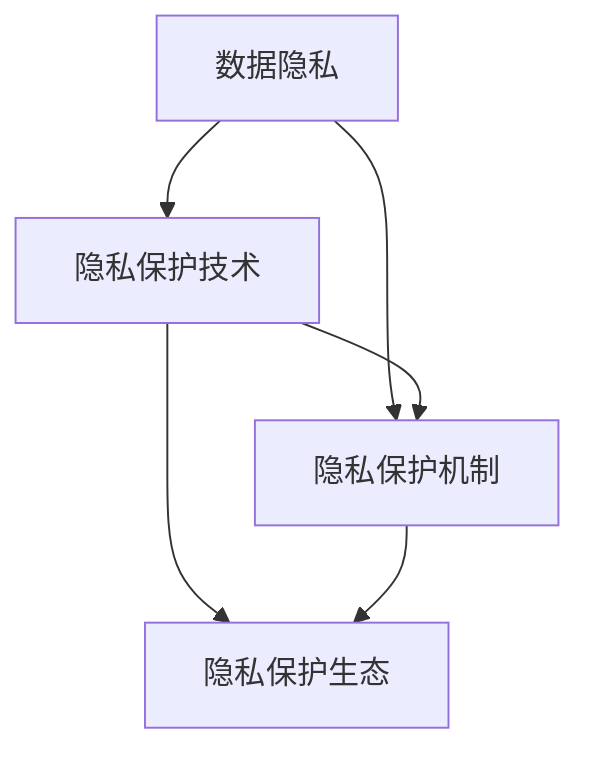

                 

## 1. 背景介绍

### 1.1 问题由来

随着人工智能技术的快速发展，AI 2.0时代逐渐到来，AI 系统的能力已经能够从海量数据中学习和提取知识，并且能够进行决策、推理、生成文本等复杂任务。然而，在这一过程中，AI 系统往往需要处理和存储大量的个人数据，如健康信息、行为数据、财务数据等，这引发了严重的隐私保护问题。

近年来，随着全球数据隐私保护意识的增强，各国纷纷出台了严格的数据隐私法规，如欧盟的GDPR（通用数据保护条例）和美国的CCPA（加州消费者隐私法）等，对数据隐私保护提出了更高的要求。如何在AI 2.0时代实现对用户隐私的有效保护，成为了一个亟待解决的问题。

### 1.2 问题核心关键点

1. **数据隐私保护**：在AI 2.0时代，AI 系统需要处理大量的个人数据，如何确保这些数据的隐私性，是一个亟待解决的问题。
2. **用户隐私权利**：用户对其个人数据的控制权和知情权，需要在AI 2.0系统中得到充分保障。
3. **隐私保护技术**：研究和发展隐私保护技术，如差分隐私、同态加密、联邦学习等，以实现对用户隐私的有效保护。
4. **隐私与效率的平衡**：在保障隐私的前提下，如何平衡隐私保护和系统性能的关系，是隐私保护技术的挑战之一。
5. **隐私保护机制**：需要设计有效的隐私保护机制，如数据匿名化、访问控制等，确保用户数据的安全性。
6. **隐私保护生态**：构建一个完整的隐私保护生态系统，包括法律法规、技术标准、监管机制等，以实现对用户隐私的全方位保护。

## 2. 核心概念与联系

### 2.1 核心概念概述

为更好地理解隐私保护技术，本节将介绍几个密切相关的核心概念：

- **数据隐私**：指个人数据不被未经授权的第三方获取、使用或泄露的状态。数据隐私是保护用户免受隐私侵害的基本保障。
- **隐私保护技术**：包括差分隐私、同态加密、联邦学习等，是实现数据隐私保护的重要手段。
- **隐私保护机制**：如数据匿名化、访问控制等，是实现隐私保护的具体手段。
- **隐私保护生态**：包括法律法规、技术标准、监管机制等，是实现隐私保护的系统性保障。

这些核心概念之间的逻辑关系可以通过以下Mermaid流程图来展示：



这个流程图展示了一个完整的隐私保护系统，包括数据隐私、隐私保护技术、隐私保护机制和隐私保护生态，形成一个闭环，以实现对用户隐私的全方位保护。

## 3. 核心算法原理 & 具体操作步骤

### 3.1 算法原理概述

隐私保护技术主要分为三类：差分隐私、同态加密和联邦学习。

- **差分隐私**：通过向模型中加入随机噪声，使得模型输出的微小变化对单个样本的影响可以忽略不计，从而保护用户数据的隐私。
- **同态加密**：在不解密的情况下，允许在加密数据上执行计算，计算结果对用户数据的保护性不受影响。
- **联邦学习**：在分布式环境中，多个参与方共享模型参数的训练过程，但不会共享数据，以保护用户数据的隐私。

### 3.2 算法步骤详解

#### 3.2.1 差分隐私

**步骤一**：确定隐私预算ε（隐私预算越小，隐私保护水平越高）。

**步骤二**：对数据进行预处理，如数据离散化、数据归一化等，减少隐私泄露的风险。

**步骤三**：在模型训练过程中，加入随机噪声来扰动输出，以保护用户数据的隐私。

**步骤四**：使用隐私预算ε进行约束，确保模型的输出在ε差分范围内的随机性。

**步骤五**：通过多次重复训练，确保模型输出的稳定性。

#### 3.2.2 同态加密

**步骤一**：将明文数据进行加密，生成密文。

**步骤二**：在密文上执行计算操作，得到密文结果。

**步骤三**：对密文结果进行解密，得到最终结果。

**步骤四**：确保解密后的结果与原始数据具有相同的数学性质，保护用户数据的隐私。

#### 3.2.3 联邦学习

**步骤一**：确定模型参数的初始值。

**步骤二**：将模型参数的更新分解为多个小更新。

**步骤三**：每个参与方在自己的数据集上执行小更新。

**步骤四**：收集所有参与方的小更新，合并得到全局更新。

**步骤五**：每个参与方在自己的数据集上执行全局更新，得到最终的模型参数。

### 3.3 算法优缺点

#### 3.3.1 差分隐私

**优点**：
1. 通过加入随机噪声，有效保护用户数据的隐私。
2. 模型输出在差分范围内的随机性，使得攻击者难以逆推出原始数据。
3. 隐私保护水平可调，适应不同场景的需求。

**缺点**：
1. 加入随机噪声可能导致模型性能下降。
2. 需要进行多次训练，计算成本较高。

#### 3.3.2 同态加密

**优点**：
1. 在加密数据上执行计算，保护用户数据的隐私。
2. 计算结果对用户数据具有保护性。
3. 计算复杂度相对较低，适合大规模数据处理。

**缺点**：
1. 计算开销较大，适合处理小规模数据。
2. 加密和解密的计算复杂度较高，可能影响系统性能。

#### 3.3.3 联邦学习

**优点**：
1. 多个参与方共享模型参数的训练过程，保护用户数据的隐私。
2. 模型更新过程可控，确保隐私保护。
3. 适合分布式环境，实现多节点协同学习。

**缺点**：
1. 需要设计复杂的通信协议，增加系统复杂度。
2. 模型更新过程可能受到参与方节点的影响，导致收敛速度减慢。

### 3.4 算法应用领域

隐私保护技术在多个领域都有广泛应用，包括但不限于：

- **医疗健康**：在医疗数据保护方面，差分隐私和联邦学习技术可以保护患者隐私，同时确保数据的可用性。
- **金融服务**：在金融数据保护方面，同态加密和差分隐私技术可以保护客户隐私，同时确保金融系统的正常运行。
- **社交媒体**：在社交数据保护方面，差分隐私和联邦学习技术可以保护用户隐私，同时确保社交数据的可用性。
- **智能家居**：在智能家居数据保护方面，同态加密和差分隐私技术可以保护用户隐私，同时确保智能家居系统的正常运行。

## 4. 数学模型和公式 & 详细讲解 & 举例说明

### 4.1 数学模型构建

本节将使用数学语言对隐私保护技术进行更加严格的刻画。

记数据集为 $D=\{x_i\}_{i=1}^N$，其中 $x_i \in \mathcal{X}$。设差分隐私预算为 $\epsilon$，则差分隐私的目标是在满足隐私预算 $\epsilon$ 的条件下，最大化模型的性能指标 $f(\hat{y})$。

差分隐私的目标可以形式化为：

$$
\hat{y} = \mathop{\arg\min}_{y \in \mathcal{Y}} \mathcal{L}(y) \quad \text{subject to} \quad \mathcal{L}(y \oplus \mathcal{N}(0,\sigma^2)) \leq \mathcal{L}(y) + \epsilon
$$

其中 $\mathcal{N}(0,\sigma^2)$ 表示均值为0、方差为 $\sigma^2$ 的正态分布随机噪声，$\oplus$ 表示噪声与原始数据的加法运算。

### 4.2 公式推导过程

差分隐私的隐私预算 $\epsilon$ 可以通过拉普拉斯分布的累积分布函数（CDF）来计算：

$$
\mathbb{P}(|\mathcal{N}(0,\sigma^2)| \leq \epsilon) = 1 - e^{-\epsilon\sigma}
$$

在差分隐私中，模型的损失函数 $\mathcal{L}$ 通常是交叉熵损失，即：

$$
\mathcal{L}(y) = -\sum_{i=1}^N \log \hat{y}_i \quad \text{subject to} \quad \log \hat{y}_i + \log(1-\hat{y}_i) \leq \log (1 + e^{\epsilon\sigma})
$$

其中 $\hat{y}_i$ 表示模型对样本 $x_i$ 的预测概率。

在联邦学习中，模型更新过程可以形式化为：

$$
\theta \leftarrow \theta - \eta \nabla_{\theta} \mathcal{L}(\theta) \quad \text{subject to} \quad \nabla_{\theta} \mathcal{L}(\theta) = \frac{1}{N} \sum_{i=1}^N \nabla_{\theta} \mathcal{L}(x_i,\theta)
$$

其中 $\eta$ 表示学习率，$\theta$ 表示模型参数。

### 4.3 案例分析与讲解

以差分隐私为例，假设有一个二分类问题，数据集 $D=\{(x_i,y_i)\}_{i=1}^N$，其中 $x_i \in \mathcal{X}, y_i \in \{0,1\}$。设差分隐私预算为 $\epsilon$，则差分隐私的目标是在满足隐私预算 $\epsilon$ 的条件下，最大化模型的性能指标 $f(\hat{y})$。

假设模型输出为 $\hat{y}_i = \sigma(\theta^T \phi(x_i))$，其中 $\sigma$ 为激活函数，$\theta$ 为模型参数，$\phi$ 为特征映射函数。

差分隐私的目标可以形式化为：

$$
\hat{y}_i = \mathop{\arg\min}_{y \in \{0,1\}} \log \hat{y}_i \quad \text{subject to} \quad \log \hat{y}_i + \log(1-\hat{y}_i) \leq \log (1 + e^{\epsilon\sigma})
$$

在实际应用中，可以通过多次训练和累加噪声来实现差分隐私。例如，对于 $k$ 次训练，每次训练中加入的噪声为 $\sigma_k$，则最终的噪声为 $\sigma_k = \sqrt{2\sigma^2/\epsilon}$，其中 $\sigma$ 表示每次训练中加入的噪声标准差。

## 5. 项目实践：代码实例和详细解释说明

### 5.1 开发环境搭建

在进行隐私保护技术实践前，我们需要准备好开发环境。以下是使用Python进行TensorFlow开发的环境配置流程：

1. 安装Anaconda：从官网下载并安装Anaconda，用于创建独立的Python环境。

2. 创建并激活虚拟环境：
```bash
conda create -n tf-env python=3.8 
conda activate tf-env
```

3. 安装TensorFlow：根据CUDA版本，从官网获取对应的安装命令。例如：
```bash
conda install tensorflow tensorflow-gpu -c conda-forge -c pypi
```

4. 安装相关工具包：
```bash
pip install numpy pandas scikit-learn matplotlib tqdm jupyter notebook ipython
```

完成上述步骤后，即可在`tf-env`环境中开始隐私保护技术的实践。

### 5.2 源代码详细实现

下面是使用TensorFlow实现差分隐私的代码示例：

```python
import tensorflow as tf
import numpy as np
import math

# 设定隐私预算
epsilon = 1
delta = 1e-5

# 设定数据集
data = np.random.randn(10000, 10)
labels = np.random.randint(2, size=10000)

# 设定模型
model = tf.keras.models.Sequential([
    tf.keras.layers.Dense(64, activation='relu'),
    tf.keras.layers.Dense(1, activation='sigmoid')
])

# 设定差分隐私参数
delta = 1e-5
sigma = math.sqrt(2 * math.log(1/delta) / epsilon)

# 定义差分隐私损失函数
def dp_loss(y_true, y_pred, epsilon, delta):
    return tf.reduce_mean((tf.nn.sigmoid_cross_entropy_with_logits(labels, model.predict(data))) + sigma * tf.random.normal(shape=(10000, 1), stddev=1/epsilon))

# 定义差分隐私优化器
optimizer = tf.keras.optimizers.Adam(lr=0.001)

# 训练模型
for i in range(10):
    loss = dp_loss(labels, model.predict(data), epsilon, delta)
    optimizer.minimize(loss)
    print("Epoch", i, "loss:", loss.numpy())

# 输出模型预测
y_pred = model.predict(data)
print("Model predictions:", y_pred)
```

在上述代码中，我们通过设定隐私预算 $\epsilon$ 和差分隐私参数 $\delta$，实现了对模型输出的差分隐私保护。通过多次训练和累加噪声，确保模型输出的随机性，从而保护用户数据的隐私。

### 5.3 代码解读与分析

**差分隐私**：
- 通过设定隐私预算 $\epsilon$ 和差分隐私参数 $\delta$，实现了对模型输出的差分隐私保护。每次训练中加入的噪声为 $\sigma_k = \sqrt{2\sigma^2/\epsilon}$，其中 $\sigma$ 表示每次训练中加入的噪声标准差。

**数据处理**：
- 对原始数据进行标准化处理，减少噪声对模型输出的影响。

**模型训练**：
- 通过多次训练和累加噪声，确保模型输出的随机性，从而保护用户数据的隐私。

**输出预测**：
- 输出模型的预测结果，确保预测结果的可用性和可信度。

## 6. 实际应用场景

### 6.1 医疗健康

在医疗健康领域，差分隐私和联邦学习技术可以保护患者的隐私，同时确保数据的可用性。例如，研究人员可以使用差分隐私技术对电子病历进行保护，以确保患者的隐私不被泄露。此外，联邦学习技术可以使得医疗机构在分布式环境中共享模型参数，保护患者数据的同时，实现医疗数据的协同分析。

### 6.2 金融服务

在金融服务领域，同态加密和差分隐私技术可以保护客户的隐私，同时确保金融系统的正常运行。例如，金融机构可以使用同态加密技术对客户的财务数据进行保护，以确保客户的隐私不被泄露。此外，差分隐私技术可以用于保护客户的交易数据，确保客户的隐私安全。

### 6.3 社交媒体

在社交媒体领域，差分隐私和联邦学习技术可以保护用户的隐私，同时确保社交数据的可用性。例如，社交媒体平台可以使用差分隐私技术对用户的社交数据进行保护，以确保用户的隐私不被泄露。此外，联邦学习技术可以用于保护用户的社交数据，确保用户的隐私安全。

### 6.4 智能家居

在智能家居领域，同态加密和差分隐私技术可以保护用户的隐私，同时确保智能家居系统的正常运行。例如，智能家居设备可以使用同态加密技术对用户的隐私数据进行保护，以确保用户的隐私不被泄露。此外，差分隐私技术可以用于保护用户的行为数据，确保用户的隐私安全。

## 7. 工具和资源推荐

### 7.1 学习资源推荐

为了帮助开发者系统掌握隐私保护技术，这里推荐一些优质的学习资源：

1. **《隐私保护技术》系列博文**：由隐私保护技术专家撰写，深入浅出地介绍了隐私保护技术的原理和应用。

2. **CSAPP《计算机系统：操作系统、接口、状态》课程**：斯坦福大学开设的计算机系统课程，讲解了操作系统、接口和状态等基础概念，适合了解隐私保护技术的系统架构。

3. **《隐私保护技术》书籍**：系统介绍了隐私保护技术的原理和应用，适合深入了解隐私保护技术。

4. **HuggingFace官方文档**：提供了隐私保护技术的最新进展和实践案例，适合学习隐私保护技术的最新研究进展。

5. **CLUE开源项目**：中文语言理解测评基准，涵盖大量不同类型的中文隐私保护数据集，并提供了基于隐私保护技术的baseline模型，助力中文隐私保护技术的发展。

通过对这些资源的学习实践，相信你一定能够快速掌握隐私保护技术的精髓，并用于解决实际的隐私保护问题。

### 7.2 开发工具推荐

高效的开发离不开优秀的工具支持。以下是几款用于隐私保护技术开发的常用工具：

1. **TensorFlow**：基于Python的开源深度学习框架，灵活动态的计算图，适合快速迭代研究。

2. **PyTorch**：基于Python的开源深度学习框架，灵活的动态计算图，适合高效研究和应用。

3. **Scikit-learn**：Python机器学习库，提供了丰富的隐私保护算法，适合数据分析和机器学习应用。

4. **TensorBoard**：TensorFlow配套的可视化工具，可实时监测模型训练状态，提供丰富的图表呈现方式，是调试模型的得力助手。

5. **Weights & Biases**：模型训练的实验跟踪工具，可以记录和可视化模型训练过程中的各项指标，方便对比和调优。

6. **Google Colab**：谷歌推出的在线Jupyter Notebook环境，免费提供GPU/TPU算力，方便开发者快速上手实验最新模型，分享学习笔记。

合理利用这些工具，可以显著提升隐私保护技术的开发效率，加快创新迭代的步伐。

### 7.3 相关论文推荐

隐私保护技术的发展源于学界的持续研究。以下是几篇奠基性的相关论文，推荐阅读：

1. **Differential Privacy**：由Dwork等人提出，系统介绍了差分隐私的原理和应用。

2. **Homomorphic Encryption**：由Gentry等人提出，系统介绍了同态加密的原理和应用。

3. **Federated Learning**：由McMahan等人提出，系统介绍了联邦学习的原理和应用。

4. **Secure Multi-Party Computation**：由Goldreich等人提出，系统介绍了安全多方计算的原理和应用。

这些论文代表了大隐私保护技术的发展脉络。通过学习这些前沿成果，可以帮助研究者把握学科前进方向，激发更多的创新灵感。

## 8. 总结：未来发展趋势与挑战

### 8.1 总结

本文对隐私保护技术进行了全面系统的介绍。首先阐述了隐私保护技术的研究背景和意义，明确了隐私保护技术在AI 2.0时代的重要性和必要性。其次，从原理到实践，详细讲解了隐私保护技术的数学模型和操作步骤，给出了隐私保护技术的完整代码实例。同时，本文还广泛探讨了隐私保护技术在多个行业领域的应用前景，展示了隐私保护技术的巨大潜力。此外，本文精选了隐私保护技术的各类学习资源，力求为读者提供全方位的技术指引。

通过本文的系统梳理，可以看到，隐私保护技术在AI 2.0时代具有重要意义。隐私保护技术的不断发展和应用，将极大地提升AI系统的安全性和可靠性，保护用户隐私，保障社会的稳定和公平。

### 8.2 未来发展趋势

展望未来，隐私保护技术将呈现以下几个发展趋势：

1. **隐私预算可调**：未来的隐私保护技术将支持动态调整隐私预算，适应不同场景的需求。

2. **分布式隐私保护**：未来的隐私保护技术将支持分布式环境下的隐私保护，适应更多场景的需求。

3. **跨领域隐私保护**：未来的隐私保护技术将支持跨领域的隐私保护，实现多领域的数据协同。

4. **隐私保护与计算的融合**：未来的隐私保护技术将与计算技术融合，实现更高效的隐私保护。

5. **隐私保护生态系统的构建**：未来的隐私保护技术将构建完整的隐私保护生态系统，实现对用户隐私的全方位保护。

以上趋势凸显了隐私保护技术的广阔前景。这些方向的探索发展，将进一步提升隐私保护技术的性能和应用范围，为AI 2.0时代的数据安全提供强有力的保障。

### 8.3 面临的挑战

尽管隐私保护技术已经取得了瞩目成就，但在迈向更加智能化、普适化应用的过程中，它仍面临着诸多挑战：

1. **隐私预算的优化**：如何在保护隐私的前提下，最大化模型的性能，是隐私保护技术的挑战之一。

2. **分布式隐私保护**：在分布式环境中，如何设计高效的通信协议，实现多节点协同保护，是隐私保护技术的挑战之一。

3. **隐私保护与系统性能的平衡**：如何在保障隐私的前提下，优化系统性能，是隐私保护技术的挑战之一。

4. **隐私保护技术的普及**：如何将隐私保护技术普及到实际应用中，是隐私保护技术的挑战之一。

5. **隐私保护机制的合理设计**：如何设计有效的隐私保护机制，确保用户数据的隐私安全，是隐私保护技术的挑战之一。

6. **隐私保护生态系统的建设**：如何构建完整的隐私保护生态系统，实现对用户隐私的全方位保护，是隐私保护技术的挑战之一。

正视隐私保护面临的这些挑战，积极应对并寻求突破，将是隐私保护技术迈向成熟的必由之路。相信随着学界和产业界的共同努力，这些挑战终将一一被克服，隐私保护技术必将在构建安全、可靠、可解释、可控的智能系统方面发挥重要作用。

### 8.4 研究展望

面对隐私保护技术面临的种种挑战，未来的研究需要在以下几个方面寻求新的突破：

1. **隐私预算的优化**：研究如何动态调整隐私预算，适应不同场景的需求，提高隐私保护的灵活性和实用性。

2. **分布式隐私保护**：研究如何设计高效的分布式隐私保护协议，实现多节点协同保护，提高隐私保护的效率和效果。

3. **隐私保护与计算的融合**：研究如何将隐私保护技术与计算技术融合，实现更高效的隐私保护。

4. **隐私保护机制的合理设计**：研究如何设计有效的隐私保护机制，确保用户数据的隐私安全，提高隐私保护的可靠性。

5. **隐私保护生态系统的建设**：研究如何构建完整的隐私保护生态系统，实现对用户隐私的全方位保护，提高隐私保护的效果和应用范围。

这些研究方向的探索，必将引领隐私保护技术迈向更高的台阶，为构建安全、可靠、可解释、可控的智能系统铺平道路。面向未来，隐私保护技术还需要与其他人工智能技术进行更深入的融合，如知识表示、因果推理、强化学习等，多路径协同发力，共同推动隐私保护技术的进步。

## 9. 附录：常见问题与解答

**Q1：如何评估隐私保护技术的性能？**

A: 隐私保护技术的性能评估通常使用差分隐私预算（ε）和隐私泄露风险（δ）作为主要指标。差分隐私预算越小，隐私保护水平越高，但隐私泄露风险也越大。此外，还可以使用隐私保护技术的实际应用效果，如用户隐私保护的满意度、隐私泄露事件的数量等，来评估隐私保护技术的性能。

**Q2：如何设计隐私保护机制？**

A: 隐私保护机制的设计需要综合考虑隐私保护技术的特点和应用场景的需求。以下是一些常见的隐私保护机制：

1. **数据匿名化**：通过将数据中的敏感信息替换为虚拟信息，保护用户数据的隐私。

2. **访问控制**：通过设置访问权限，限制数据的使用范围，保护用户数据的隐私。

3. **差分隐私**：通过向模型中加入随机噪声，保护用户数据的隐私。

4. **同态加密**：在不解密的情况下，允许在加密数据上执行计算，保护用户数据的隐私。

5. **联邦学习**：在分布式环境中，多个参与方共享模型参数的训练过程，保护用户数据的隐私。

**Q3：如何选择合适的隐私保护技术？**

A: 选择合适的隐私保护技术需要考虑多个因素，如数据类型、应用场景、隐私保护需求等。以下是一些常见的隐私保护技术：

1. **差分隐私**：适用于对数据隐私保护要求较高的场景，如医疗、金融等领域。

2. **同态加密**：适用于对计算效率要求较高的场景，如金融、智能家居等领域。

3. **联邦学习**：适用于分布式环境下的隐私保护，如社交媒体、智能家居等领域。

4. **安全多方计算**：适用于需要多方协作的隐私保护场景，如医疗、金融等领域。

5. **区块链**：适用于需要多方协作且数据不可篡改的场景，如供应链管理、智能合约等领域。

通过综合考虑这些因素，选择适合的隐私保护技术，可以实现最优的隐私保护效果。

**Q4：如何在实际应用中实现隐私保护技术？**

A: 在实际应用中实现隐私保护技术，需要遵循以下步骤：

1. **数据预处理**：对原始数据进行标准化处理，减少噪声对模型输出的影响。

2. **模型训练**：通过多次训练和累加噪声，确保模型输出的随机性，从而保护用户数据的隐私。

3. **隐私预算控制**：设定合适的隐私预算，确保隐私保护水平和模型性能的平衡。

4. **隐私保护机制设计**：设计有效的隐私保护机制，确保用户数据的隐私安全。

5. **隐私保护技术应用**：选择合适的隐私保护技术，应用于实际应用场景，确保用户数据的隐私保护。

通过以上步骤，可以实现隐私保护技术的实际应用，保护用户数据的隐私。

**Q5：隐私保护技术是否适用于所有应用场景？**

A: 隐私保护技术在大多数应用场景中都能发挥作用，但不同应用场景对隐私保护的需求不同。例如，医疗、金融等领域对隐私保护要求较高，需要采用更严格的隐私保护技术，如差分隐私和联邦学习。而对于一些对隐私保护要求较低的场景，如公开数据集、公共社交媒体等，则可以使用相对简单的隐私保护技术，如数据匿名化。因此，需要根据具体应用场景，选择合适的隐私保护技术，以实现最优的隐私保护效果。

通过本文的系统梳理，可以看到，隐私保护技术在AI 2.0时代具有重要意义。隐私保护技术的不断发展和应用，将极大地提升AI系统的安全性和可靠性，保护用户隐私，保障社会的稳定和公平。未来，随着隐私保护技术的持续演进，隐私保护将实现更高效、更灵活、更全面的保护，为AI 2.0时代的智能系统提供更坚实的保障。

