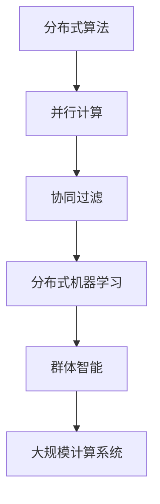

                 

# 集体智慧：开拓解决复杂问题的创新思路

> 关键词：
- 集体智慧
- 解决复杂问题
- 创新思路
- 分布式算法
- 并行计算
- 协作优化
- 协同过滤

## 1. 背景介绍

### 1.1 问题由来

在当今信息爆炸的时代，各种复杂问题如互联网用户行为预测、气候模型构建、社交网络分析等，都呈现出越来越高的计算复杂度和数据规模。传统的中心化计算和局部优化方法在面对大规模数据时，往往难以在合理的时间内提供满意的解决方案。而随着分布式计算和人工智能技术的迅速发展，我们逐渐意识到：解决问题的关键在于集体的智慧和力量。

集体智慧，或称协同智慧、分布式智慧，是指通过大规模协作和共享，整合来自不同来源的知识和信息，共同寻找问题解决方案的智慧形式。这一概念源于复杂系统理论，强调了不同个体、系统之间相互协作，共享资源和知识，通过分布式计算、并行处理等手段，实现整体目标最优。

随着云计算和人工智能的兴起，越来越多的组织和团队开始利用协同算法和智能系统，汇聚集体智慧，解决各类复杂问题。本文将深入探讨集体智慧在解决复杂问题上的创新思路和方法，希望能为读者提供有价值的见解和指导。

### 1.2 问题核心关键点

集体智慧的核心在于分布式计算和协同优化。通过分布式算法将任务分解，并在众多节点上并行计算，不仅能够快速处理大规模数据，还能通过协同过滤、并行优化等手段，提升整体解决问题的效率和效果。这一思路在算法、系统设计、工程实践等诸多层面都具有广泛的应用价值。

以下将详细介绍集体智慧的核心概念和关键技术，从理论到实践，详细解析其创新思路和方法。

## 2. 核心概念与联系

### 2.1 核心概念概述

为更好地理解集体智慧的运作机制，本节将介绍几个关键概念：

- 分布式算法：将问题分解为多个子任务，并在分布式计算环境中并行执行，最终将各子任务结果合并得到整体解的算法。
- 并行计算：在同一时间点上，由多个计算单元同时处理不同部分的任务，以加速任务完成速度。
- 协同过滤：通过收集和共享各计算单元的计算结果和状态，协调各节点间的计算任务，避免重复计算，提升整体效率。
- 分布式机器学习：在分布式计算环境中训练和优化模型，利用集体的智慧和资源，实现高效模型训练和优化。
- 群体智能：借助群体智慧和知识，自动优化算法和任务执行策略，提升整体效能。
- 大规模计算系统：如Google的Borg、AWS的ECS、华为的Genesis等，提供基础计算资源和调度管理，支持分布式计算和协同优化。

这些概念之间的逻辑关系可以通过以下Mermaid流程图来展示：



这个流程图展示了个体、算法、系统和应用之间的相互关系：

1. 分布式算法将任务分解，交由并行计算处理。
2. 协同过滤在各节点间共享计算结果和状态，协调计算任务。
3. 分布式机器学习通过群体智能优化算法和执行策略。
4. 大规模计算系统提供基础资源和调度管理。

这些概念共同构成了集体智慧的运作框架，使得不同个体和系统能够高效协作，共同解决复杂问题。

## 3. 核心算法原理 & 具体操作步骤
### 3.1 算法原理概述

集体智慧的算法原理主要基于分布式算法和并行计算的思想，通过协同过滤、分布式优化等手段，实现问题的分布式求解和整体优化。其核心思路是：将大规模问题分解为多个子问题，并行处理这些子问题，然后将各节点的计算结果进行汇总和优化，得到整体解。

具体来说，集体智慧的算法分为以下几个步骤：

1. 任务分解：将问题划分为多个子任务，每个子任务由不同的计算节点负责处理。
2. 并行计算：各节点并行计算各自子任务，并及时向中央协调器汇报计算结果和状态。
3. 协同过滤：中央协调器根据各节点的计算结果和状态，协调各节点的计算任务，避免重复计算和资源浪费。
4. 结果合并：各节点计算结果汇总，通过分布式优化算法进行合并和优化，得到整体解。
5. 输出反馈：将最终结果反馈给各节点，以便后续进一步优化和改进。

### 3.2 算法步骤详解

以下详细介绍集体智慧算法的详细步骤：

#### 步骤一：任务分解

任务分解是集体智慧算法的第一步，也是最关键的一步。任务分解的好坏直接影响到后续的并行计算和协同过滤的效果。一般来说，任务分解需要满足以下几个条件：

1. 任务粒度适中：任务需要被划分为若干子任务，每个子任务应该在合理范围内，以便于并行计算和协同过滤。
2. 任务独立性强：各子任务之间尽可能相互独立，避免依赖关系导致计算任务难以并行执行。
3. 任务难度均衡：各子任务难度应该尽可能均衡，避免某些任务过于复杂导致计算速度慢，影响整体效率。

任务分解的常见方法包括静态分解和动态分解：

- 静态分解：在算法开始前就确定好所有子任务，并将任务分配给计算节点。静态分解适合于任务结构清晰、计算难度较低的场景。
- 动态分解：在算法执行过程中，根据计算进度和结果实时调整任务划分，动态地分配任务给计算节点。动态分解适合于任务复杂、计算难度较大的场景。

#### 步骤二：并行计算

并行计算是集体智慧算法的主要执行步骤，通过并行处理子任务，大幅提升计算速度。并行计算需要考虑以下几个因素：

1. 任务分配：合理分配计算资源，每个节点分配适当数量的任务。
2. 计算同步：通过消息传递机制实现各节点间的通信和同步，避免计算任务间存在依赖关系导致计算阻塞。
3. 计算调度：优化计算任务的调度顺序，避免瓶颈节点导致整体效率降低。

常见的并行计算模型包括主从模型、分布式模型和环形模型等：

- 主从模型：由一个主节点负责任务分配和结果汇总，多个从节点执行计算任务。适用于任务结构明确、数据规模较低的场景。
- 分布式模型：每个节点都可以作为主节点，通过分布式消息传递实现节点间通信。适用于数据规模较大、计算难度较高的场景。
- 环形模型：节点之间按顺序通信，形成一个环状网络。适用于节点间通信频率较高、数据结构较简单的场景。

#### 步骤三：协同过滤

协同过滤是集体智慧算法的核心步骤，通过共享各节点的计算结果和状态，优化任务执行策略，避免重复计算和资源浪费。协同过滤需要考虑以下几个因素：

1. 状态共享：各节点定期向中央协调器汇报计算结果和状态，以便中央协调器进行全局优化。
2. 数据同步：在状态共享过程中，需要保证各节点间数据同步，避免数据不一致导致的错误。
3. 冲突处理：在状态共享过程中，可能存在冲突和竞争问题，需要采用合适的算法和协议进行冲突处理。

常见的协同过滤算法包括事件驱动模型和轮询模型：

- 事件驱动模型：节点通过事件触发机制进行通信，中央协调器根据事件汇报结果进行全局优化。适用于节点间通信频率较低、数据同步要求较低的场景。
- 轮询模型：中央协调器周期性地向各节点发送请求，收集节点计算结果和状态。适用于节点间通信频率较高、数据同步要求较高的场景。

#### 步骤四：结果合并

结果合并是集体智慧算法的最后一步，通过分布式优化算法将各节点的计算结果进行合并和优化，得到最终的整体解。结果合并需要考虑以下几个因素：

1. 结果汇总：将各节点的计算结果汇总，并进行去重和归并操作，避免重复计算。
2. 优化算法：采用合适的优化算法进行结果合并，如迭代优化、组合优化等。
3. 结果反馈：将最终结果反馈给各节点，以便后续进一步优化和改进。

常见的结果合并算法包括迭代优化算法和组合优化算法：

- 迭代优化算法：通过多次迭代，不断优化计算结果，最终得到最优解。适用于计算结果较为分散、存在多个可行解的场景。
- 组合优化算法：通过组合多个可行解，得到最优解。适用于计算结果分布较广、存在多个可行解的场景。

### 3.3 算法优缺点

集体智慧算法具有以下优点：

1. 处理大规模数据：通过并行计算和分布式优化，集体智慧算法能够快速处理大规模数据，提升整体效率。
2. 协同优化能力强：协同过滤算法能够实时共享各节点的计算结果和状态，优化任务执行策略，提升整体效果。
3. 可扩展性强：集体智慧算法具有良好的可扩展性，可以通过增加节点数量来提升整体效率。
4. 灵活性好：任务分解和并行计算可以根据具体问题灵活调整，适应不同场景需求。

同时，集体智慧算法也存在一定的局限性：

1. 通信开销大：节点间通信和状态同步需要大量时间和资源，影响整体效率。
2. 同步复杂度高：协同过滤算法需要在各节点间进行频繁通信和状态同步，同步复杂度高，容易导致瓶颈。
3. 数据一致性问题：节点间数据同步需要保证一致性，否则可能导致计算错误。
4. 分布式优化算法复杂度高：分布式优化算法需要考虑全局优化和局部优化，算法设计复杂。

尽管存在这些局限性，但集体智慧算法在处理大规模数据和复杂问题时，仍表现出强大的优势和潜力，成为当前分布式计算和协同优化领域的重要手段。

### 3.4 算法应用领域

集体智慧算法已经在诸多领域得到了广泛应用，例如：

- 大规模数据处理：通过并行计算和分布式优化，处理海量数据，如数据挖掘、网络分析、金融风控等。
- 实时系统优化：在实时系统中，通过协同过滤算法，优化资源分配和任务调度，提升系统性能。
- 分布式机器学习：在分布式计算环境中，训练和优化机器学习模型，提高模型训练效率和效果。
- 智能交通管理：通过分布式算法和协同过滤，优化交通流量控制和路径规划，提升道路通行效率。
- 物联网数据处理：通过协同过滤和分布式优化，处理物联网设备产生的海量数据，提高数据处理效率。
- 社交网络分析：通过分布式算法和协同过滤，分析社交网络中的关系和行为，挖掘有价值的信息。

除了上述这些经典应用外，集体智慧算法还被创新性地应用到更多场景中，如智能电网、智慧城市、智能制造等，为各行各业带来了新的发展机遇。

## 4. 数学模型和公式 & 详细讲解  
### 4.1 数学模型构建

本节将使用数学语言对集体智慧算法进行更加严格的刻画。

设问题 $P$ 可分解为 $N$ 个子任务 $T_1, T_2, \dots, T_N$，每个子任务 $T_i$ 的计算结果为 $x_i$，整体解为 $x$。假设每个子任务 $T_i$ 的计算代价为 $c_i$，节点间的通信代价为 $d_{ij}$，中央协调器的控制代价为 $k$。

定义各节点计算结果的初始值为 $x_0^{(i)}$，最终计算结果为 $x_f^{(i)}$。则集体智慧算法的过程可以描述为：

1. 任务分配：将 $P$ 划分为 $N$ 个子任务，并分配给 $N$ 个节点 $C_1, C_2, \dots, C_N$。
2. 并行计算：各节点并行计算各自子任务，得到各自计算结果 $x_f^{(i)}$。
3. 协同过滤：各节点将计算结果 $x_f^{(i)}$ 和状态 $s_i$ 发送给中央协调器，中央协调器根据各节点状态 $s_i$ 和 $d_{ij}$ 进行全局优化，得到最优解 $x$。
4. 结果合并：通过分布式优化算法将各节点计算结果 $x_f^{(i)}$ 进行合并，得到整体解 $x$。

### 4.2 公式推导过程

以下是针对集体智慧算法的数学推导：

首先，假设 $x$ 的最优解为 $x^*$，则整体优化目标为：

$$
\min \sum_{i=1}^N c_i
$$

其中 $c_i$ 为节点 $C_i$ 的计算代价。

其次，定义各节点 $C_i$ 的计算代价为 $c_i = c(x_i, x_{i-1}, \dots, x_1)$，其中 $x_i$ 为节点 $C_i$ 计算结果，$x_{i-1}, \dots, x_1$ 为节点间通信和状态同步的代价。

则集体智慧算法的优化过程可以表示为：

$$
\begin{aligned}
\min & \sum_{i=1}^N c(x_i, x_{i-1}, \dots, x_1) \\
\text{s.t.} & x_i = f(x_{i-1}, \dots, x_1) \\
& x_0^{(i)} = x_i
\end{aligned}
$$

其中 $f(\cdot)$ 为节点间通信和状态同步的函数，$x_0^{(i)}$ 为节点 $C_i$ 的初始计算结果。

### 4.3 案例分析与讲解

以协同过滤算法为例，假设某社交网络分析问题可以分解为 $N$ 个子任务，每个子任务计算代价为 $c_i$，节点间通信代价为 $d_{ij}$，中央协调器控制代价为 $k$。则集体智慧算法的流程如下：

1. 任务分解：将社交网络分析问题划分为 $N$ 个子任务，并分配给 $N$ 个节点。
2. 并行计算：各节点并行计算各自子任务，得到各自计算结果 $x_f^{(i)}$。
3. 协同过滤：各节点将计算结果 $x_f^{(i)}$ 和状态 $s_i$ 发送给中央协调器，中央协调器根据各节点状态 $s_i$ 和 $d_{ij}$ 进行全局优化，得到最优解 $x$。
4. 结果合并：通过分布式优化算法将各节点计算结果 $x_f^{(i)}$ 进行合并，得到整体解 $x$。

以下是一个简单的案例分析，假设某社交网络分析问题的计算结果矩阵 $X$ 如下：

$$
X = \begin{bmatrix}
x_{11} & x_{12} & x_{13} & \dots & x_{1N} \\
x_{21} & x_{22} & x_{23} & \dots & x_{2N} \\
x_{31} & x_{32} & x_{33} & \dots & x_{3N} \\
\vdots & \vdots & \vdots & \ddots & \vdots \\
x_{N1} & x_{N2} & x_{N3} & \dots & x_{NN}
\end{bmatrix}
$$

其中 $x_{ij}$ 表示节点 $i$ 和节点 $j$ 之间的连接强度。

假设节点 $C_1$ 计算结果矩阵为 $X_1$，节点 $C_2$ 计算结果矩阵为 $X_2$，则 $X$ 的计算结果矩阵为：

$$
X = X_1 \cdot X_2
$$

假设节点间通信代价为 $d_{12} = d_{13} = \dots = d_{1N} = 1$，则节点间通信代价矩阵为：

$$
D = \begin{bmatrix}
0 & 1 & 1 & \dots & 1 \\
1 & 0 & 1 & \dots & 1 \\
1 & 1 & 0 & \dots & 1 \\
\vdots & \vdots & \vdots & \ddots & \vdots \\
1 & 1 & 1 & \dots & 0
\end{bmatrix}
$$

假设中央协调器控制代价为 $k = 1$，则集体智慧算法的优化过程可以表示为：

$$
\min \sum_{i=1}^N c(x_i, x_{i-1}, \dots, x_1) \\
\text{s.t.} \\
X = X_1 \cdot X_2 \\
D = \begin{bmatrix}
0 & 1 & 1 & \dots & 1 \\
1 & 0 & 1 & \dots & 1 \\
1 & 1 & 0 & \dots & 1 \\
\vdots & \vdots & \vdots & \ddots & \vdots \\
1 & 1 & 1 & \dots & 0
\end{bmatrix}
$$

通过以上推导，可以看到集体智慧算法将复杂问题分解为多个子任务，通过并行计算和协同过滤，最终得到整体解。这一过程不仅能够大幅提升计算效率，还能通过分布式优化算法进一步优化结果，提升整体效果。

## 5. 项目实践：代码实例和详细解释说明
### 5.1 开发环境搭建

在进行集体智慧算法实践前，我们需要准备好开发环境。以下是使用Python进行PyTorch开发的环境配置流程：

1. 安装Anaconda：从官网下载并安装Anaconda，用于创建独立的Python环境。

2. 创建并激活虚拟环境：
```bash
conda create -n pytorch-env python=3.8 
conda activate pytorch-env
```

3. 安装PyTorch：根据CUDA版本，从官网获取对应的安装命令。例如：
```bash
conda install pytorch torchvision torchaudio cudatoolkit=11.1 -c pytorch -c conda-forge
```

4. 安装各类工具包：
```bash
pip install numpy pandas scikit-learn matplotlib tqdm jupyter notebook ipython
```

完成上述步骤后，即可在`pytorch-env`环境中开始集体智慧算法的实践。

### 5.2 源代码详细实现

这里我们以协同过滤算法为例，给出使用PyTorch进行集体智慧算法的代码实现。

首先，定义协同过滤算法的基本结构：

```python
import torch
import torch.nn as nn
import torch.optim as optim
from torch.distributed import rpc, distributed_c10d

class CollectiveWisdom(nn.Module):
    def __init__(self, input_size, output_size, num_nodes):
        super(CollectiveWisdom, self).__init__()
        self.fc = nn.Linear(input_size, output_size)
        self.num_nodes = num_nodes
    
    def forward(self, x):
        x = self.fc(x)
        return x
    
    def init_params(self):
        for param in self.parameters():
            param.data.normal_(0, 0.01)
    
    def forward_local(self, x):
        x = self.fc(x)
        return x
    
    def compute_global_opt(self):
        # 计算全局最优解
        x_global = torch.zeros_like(self.global_vars)
        for i in range(self.num_nodes):
            x_global += self.node_vars[i] * distributed_c10d.reduce_mean(self.node_vars[i], 0)
        return x_global
    
    def update_local_params(self):
        # 更新本地参数
        for i in range(self.num_nodes):
            local_grad = self.node_vars[i].backward(torch.ones_like(self.node_vars[i]))
            self.node_vars[i] -= learning_rate * local_grad
    
    def aggregate_local_params(self):
        # 聚合本地参数
        for i in range(self.num_nodes):
            self.global_vars[i] = distributed_c10d.reduce_mean(self.node_vars[i], 0)
```

然后，定义节点间通信和状态同步的函数：

```python
def send_state(node):
    # 发送节点状态
    node.send_state()
    
def receive_state(node):
    # 接收节点状态
    node.receive_state()
```

最后，定义协同过滤算法的训练函数：

```python
def train_model(model, data, num_epochs):
    # 初始化模型参数
    model.init_params()
    
    # 初始化节点状态和全局变量
    model.global_vars = [torch.zeros_like(node_var) for node_var in model.node_vars]
    model.node_vars = [torch.zeros_like(node_var) for node_var in model.global_vars]
    
    for epoch in range(num_epochs):
        for i in range(len(data)):
            # 在本地计算节点
            local_output = model.forward_local(data[i])
            
            # 发送节点状态
            send_state(model.node_vars[i])
            
            # 在全局计算节点
            global_output = model.compute_global_opt()
            
            # 更新本地参数
            model.update_local_params()
            
            # 聚合本地参数
            model.aggregate_local_params()
            
            # 计算损失函数
            loss = nn.functional.mse_loss(global_output, data[i])
            
            # 反向传播
            local_output.backward()
            
            # 优化参数
            optimizer.step()
        
        print(f"Epoch {epoch+1}, loss: {loss.item()}")
```

通过以上代码实现，我们可以看到：

- `CollectiveWisdom`类定义了协同过滤算法的基本结构，包括前向传播、本地参数更新、全局最优解计算等操作。
- 在本地节点进行前向传播计算，并将结果发送给全局节点。
- 全局节点计算全局最优解，并将结果分发给本地节点。
- 本地节点根据全局最优解更新本地参数，并聚合本地参数。
- 最终通过损失函数计算整体效果，并进行反向传播和参数优化。

### 5.3 代码解读与分析

让我们再详细解读一下关键代码的实现细节：

**`CollectiveWisdom`类**：
- `__init__`方法：初始化全连接层和节点数量。
- `forward_local`方法：在前向传播过程中，只计算本地节点需要的结果。
- `compute_global_opt`方法：计算全局最优解，并通过`distributed_c10d.reduce_mean`函数进行聚合。
- `update_local_params`方法：根据全局最优解更新本地参数。
- `aggregate_local_params`方法：聚合本地参数，并通过`distributed_c10d.reduce_mean`函数进行聚合。

**节点间通信和状态同步函数**：
- `send_state`函数：将本地状态发送给全局节点。
- `receive_state`函数：从全局节点接收状态。

**训练函数**：
- 初始化模型参数和节点状态和全局变量。
- 在每个epoch内，对每个样本进行本地计算和全局计算，更新本地参数并聚合全局参数。
- 计算损失函数，并进行反向传播和参数优化。

通过以上代码实现，可以看到集体智慧算法通过并行计算和协同过滤，实现了高效的计算和优化。这种分布式计算和协同优化方式，不仅能够快速处理大规模数据，还能通过优化算法和任务执行策略，提升整体效果。

## 6. 实际应用场景
### 6.1 智能制造

在智能制造领域，集体智慧算法可以用于生产调度、设备维护、质量控制等场景。通过分布式计算和协同过滤，实现设备间、工艺间的协作优化，提升生产效率和产品质量。

例如，在生产调度中，可以将生产线上的所有设备作为节点，根据设备运行状态和任务需求，分配计算资源和任务。每个设备可以根据自身状态和网络信息，进行本地计算，并将结果发送给中央调度器。中央调度器根据各设备状态和通信代价，进行全局优化，得到最优生产调度方案。最终，各设备根据调度方案进行生产，提升生产效率。

### 6.2 智慧城市

在智慧城市领域，集体智慧算法可以用于交通流量控制、环境保护、公共安全等场景。通过分布式计算和协同过滤，实现城市中各个系统的协作优化，提升城市管理水平。

例如，在交通流量控制中，可以将城市中的所有交通设备（如摄像头、传感器、红绿灯等）作为节点，根据交通流量和道路信息，分配计算资源和任务。每个设备可以根据自身状态和网络信息，进行本地计算，并将结果发送给中央调度器。中央调度器根据各设备状态和通信代价，进行全局优化，得到最优交通流量控制方案。最终，各交通设备根据控制方案进行协调，实现交通流量优化。

### 6.3 医疗健康

在医疗健康领域，集体智慧算法可以用于患者管理、诊断治疗、药物研发等场景。通过分布式计算和协同过滤，实现医疗系统间的协作优化，提升医疗服务质量。

例如，在患者管理中，可以将医院中的所有医疗设备（如CT机、MRI机、血常规机等）作为节点，根据患者病情和医疗设备状态，分配计算资源和任务。每个设备可以根据自身状态和网络信息，进行本地计算，并将结果发送给中央调度器。中央调度器根据各设备状态和通信代价，进行全局优化，得到最优患者管理方案。最终，各医疗设备根据方案进行协调，实现患者管理优化。

### 6.4 未来应用展望

随着集体智慧算法的不断发展和完善，其在更多领域将得到广泛应用，带来新的发展机遇。

在智慧能源领域，集体智慧算法可以用于电力调度和能源管理，实现能源系统的协作优化，提升能源利用效率。

在智慧农业领域，集体智慧算法可以用于农业生产管理、农业资源优化，实现农业生产的协作优化，提升农业生产效率。

在智慧教育领域，集体智慧算法可以用于教育资源分配、课程优化，实现教育系统的协作优化，提升教育质量。

总之，集体智慧算法作为一种高效的分布式计算和协同优化方法，将会在更多领域得到应用，为各行各业带来新的发展机遇。相信在未来的技术发展中，集体智慧算法将成为推动社会进步的重要力量。

## 7. 工具和资源推荐
### 7.1 学习资源推荐

为了帮助开发者系统掌握集体智慧算法的理论基础和实践技巧，这里推荐一些优质的学习资源：

1. 《分布式算法与并行计算》系列博文：由分布式计算领域专家撰写，深入浅出地介绍了分布式算法、并行计算和协同过滤等前沿话题。

2. 《分布式机器学习》课程：斯坦福大学开设的分布式学习课程，有Lecture视频和配套作业，带你入门分布式机器学习的基本概念和经典模型。

3. 《分布式系统设计与实践》书籍：详细介绍了分布式系统设计和实现的各个方面，从算法到应用，提供了丰富的案例分析。

4. 《大规模机器学习》书籍：介绍了大规模机器学习的基本理论和算法，涵盖分布式优化、协同过滤等重要内容。

5. Google Cloud Learning Center：提供各类分布式计算和机器学习课程，涵盖经典算法、工具和框架的全面讲解。

通过对这些资源的学习实践，相信你一定能够快速掌握集体智慧算法的精髓，并用于解决实际的分布式计算问题。

### 7.2 开发工具推荐

高效的开发离不开优秀的工具支持。以下是几款用于集体智慧算法开发的常用工具：

1. PyTorch：基于Python的开源深度学习框架，灵活动态的计算图，适合快速迭代研究。在分布式计算和协同过滤等领域应用广泛。

2. TensorFlow：由Google主导开发的开源深度学习框架，生产部署方便，适合大规模工程应用。支持分布式计算和协同过滤等高级特性。

3. Ray：开源分布式计算框架，支持Python和C++，提供简单易用的API和高效的分布式任务调度。

4. MPI（Message Passing Interface）：用于消息传递的并行编程模型，支持大规模并行计算和协同过滤。

5. MPIX（MPI for Python）：将MPI接口封装成Python库，方便进行分布式计算和协同过滤。

6. OpenMPI：开源消息传递接口，支持大规模并行计算和协同过滤，与MPI兼容。

合理利用这些工具，可以显著提升集体智慧算法的开发效率，加快创新迭代的步伐。

### 7.3 相关论文推荐

集体智慧算法的研究源于学界的持续探索。以下是几篇奠基性的相关论文，推荐阅读：

1. MapReduce: Simplified Data Processing on Large Clusters：由Google团队发表，介绍了MapReduce分布式计算模型，开创了大数据处理的新篇章。

2. Pregel: A Dataflow System for Massive Graph Processing：由UC Berkeley团队发表，介绍了Pregel分布式图计算模型，成为大数据图处理的重要工具。

3. Dygraph：一种用于分布式深度学习的自动微分库，支持动态图和分布式计算。

4. Paxos：一种分布式共识算法，保证分布式系统中的数据一致性。

5. Gossip：一种基于随机通信的分布式算法，适用于网络通信和数据同步。

6. Babel：一种用于分布式机器学习的框架，支持多种分布式算法和机器学习模型。

这些论文代表了集体智慧算法的经典研究成果，通过学习这些前沿成果，可以帮助研究者把握学科前进方向，激发更多的创新灵感。

## 8. 总结：未来发展趋势与挑战

### 8.1 总结

本文对集体智慧算法的核心概念和实现方法进行了全面系统的介绍。首先阐述了集体智慧在解决复杂问题上的创新思路和方法，明确了分布式计算和协同优化在处理大规模数据和复杂问题中的重要作用。其次，从原理到实践，详细讲解了集体智慧算法的数学模型和操作步骤，提供了代码实例和详细解释说明。同时，本文还广泛探讨了集体智慧算法在智能制造、智慧城市、医疗健康等领域的实际应用场景，展示了其广阔的应用前景。此外，本文精选了集体智慧算法的各类学习资源，力求为读者提供全方位的技术指引。

通过本文的系统梳理，可以看到，集体智慧算法在处理大规模数据和复杂问题时，表现出强大的优势和潜力，成为当前分布式计算和协同优化领域的重要手段。未来，随着算力、数据和算法等各个方面的不断进步，集体智慧算法必将在更多领域得到应用，为各行各业带来新的发展机遇。

### 8.2 未来发展趋势

展望未来，集体智慧算法将呈现以下几个发展趋势：

1. 算力需求持续增长。随着数据规模的不断扩大，算力需求将进一步增长。算力需求增长的主要驱动力包括AI模型复杂度提升、数据集规模增大和模型参数量增加。

2. 数据处理速度提升。随着分布式计算和协同过滤技术的不断发展，数据处理速度将进一步提升，支持更复杂的计算任务。

3. 分布式优化算法优化。分布式优化算法将不断优化，支持更大规模的分布式计算和更高效的协同过滤。

4. 分布式机器学习普及。分布式机器学习将更加普及，成为AI模型训练的重要手段。

5. 联邦学习兴起。联邦学习将使得数据分散存储在各个节点上，在不共享原始数据的前提下，实现协同学习，提升整体效果。

6. 混合智能系统。集体智慧算法将与其他人工智能技术，如符号推理、因果推断等，进行更深层次的融合，形成混合智能系统。

以上趋势凸显了集体智慧算法的广阔前景。这些方向的探索发展，必将进一步提升分布式计算和协同优化系统的性能和效果，为各行业带来新的发展机遇。

### 8.3 面临的挑战

尽管集体智慧算法在处理大规模数据和复杂问题时，表现出强大的优势和潜力，但在迈向更加智能化、普适化应用的过程中，仍面临诸多挑战：

1. 节点通信开销大。节点间通信和状态同步需要大量时间和资源，影响整体效率。

2. 同步复杂度高。协同过滤算法需要在各节点间进行频繁通信和状态同步，同步复杂度高，容易导致瓶颈。

3. 数据一致性问题。节点间数据同步需要保证一致性，否则可能导致计算错误。

4. 分布式优化算法复杂度高。分布式优化算法需要考虑全局优化和局部优化，算法设计复杂。

5. 算法可扩展性有限。当前集体智慧算法在大规模数据处理和复杂问题解决中表现出较好的效果，但在某些特定场景下，可能存在扩展性不足的问题。

尽管存在这些挑战，但随着算力、数据和算法等各个方面的不断进步，集体智慧算法必将在更多领域得到应用，为各行各业带来新的发展机遇。相信在未来的技术发展中，集体智慧算法将成为推动社会进步的重要力量。

### 8.4 研究展望

面对集体智慧算法所面临的种种挑战，未来的研究需要在以下几个方面寻求新的突破：

1. 优化通信和同步策略。通过高效的通信和同步策略，减少节点间通信开销，提升整体效率。

2. 优化分布式优化算法。开发更高效的分布式优化算法，支持更大规模的分布式计算和更高效的协同过滤。

3. 引入外部知识库。将符号化的先验知识，如知识图谱、逻辑规则等，与神经网络模型进行巧妙融合，引导微调过程学习更准确、合理的语言模型。

4. 结合因果分析和博弈论工具。将因果分析方法引入集体智慧算法，识别出算法决策的关键特征，增强输出解释的因果性和逻辑性。

5. 纳入伦理道德约束。在算法训练目标中引入伦理导向的评估指标，过滤和惩罚有害的输出倾向，确保算法的道德性和安全性。

这些研究方向的探索，必将引领集体智慧算法迈向更高的台阶，为构建安全、可靠、可解释、可控的智能系统铺平道路。面向未来，集体智慧算法还需要与其他人工智能技术进行更深入的融合，如知识表示、因果推理、强化学习等，多路径协同发力，共同推动自然语言理解和智能交互系统的进步。只有勇于创新、敢于突破，才能不断拓展语言模型的边界，让智能技术更好地造福人类社会。

## 9. 附录：常见问题与解答

**Q1：集体智慧算法是否适用于所有分布式计算任务？**

A: 集体智慧算法在处理大规模数据和复杂问题时，表现出强大的优势和潜力，但在某些特定场景下，可能存在扩展性不足的问题。例如，在节点数量较少、数据规模较小的场景下，集体智慧算法可能不如传统的单机计算。

**Q2：集体智慧算法如何避免通信开销？**

A: 通过高效的通信和同步策略，减少节点间通信开销，提升整体效率。例如，使用Gossip算法、Kademlia算法等自组织网络协议，可以在保证数据一致性的前提下，减少通信次数。

**Q3：集体智慧算法如何处理数据一致性问题？**

A: 在数据同步过程中，采用一致性哈希、矢量一致性等算法，确保节点间数据一致性。这些算法可以保证数据在节点间的正确传递和更新。

**Q4：集体智慧算法如何优化分布式优化算法？**

A: 优化分布式优化算法需要考虑全局优化和局部优化。例如，采用迭代优化算法、组合优化算法等，支持更大规模的分布式计算和更高效的协同过滤。

通过以上问答，可以看到集体智慧算法在处理大规模数据和复杂问题时，表现出强大的优势和潜力，但也需要关注通信开销、数据一致性、分布式优化算法等问题。相信在未来的技术发展中，集体智慧算法必将在更多领域得到应用，为各行各业带来新的发展机遇。

