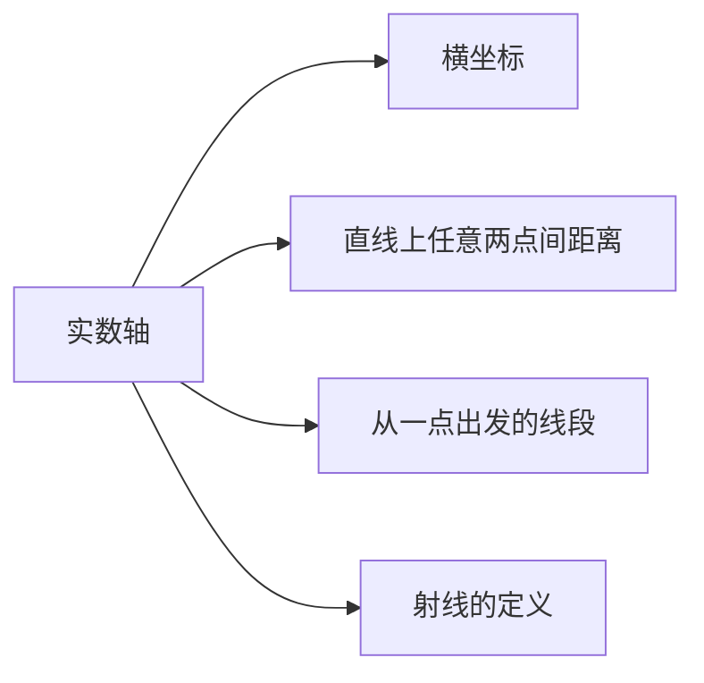

                 

# 集合论导引：实数轴拓扑结构

> 关键词：实数轴,拓扑学,集合论,连续性,开集,闭集,基底,邻域,稠密性,完备性,四则运算,实数连续性,级数收敛

## 1. 背景介绍

### 1.1 问题由来

在现代数学中，集合论和拓扑学是基础而重要的研究领域。作为数学的基础，集合论为数学中的各种概念和理论提供了框架，而拓扑学则进一步研究了空间结构的性质。这两个领域在计算机科学中也扮演着重要角色，特别是在算法、数据结构、图形处理等领域有着广泛的应用。

本文将从集合论和拓扑学的角度，探讨实数轴的基本概念和性质，并进一步应用这些概念解决实际问题。

### 1.2 问题核心关键点

实数轴的拓扑结构是数学和计算机科学中极为重要的一个分支。了解实数轴的拓扑结构，可以帮助我们理解更复杂的数学概念和算法，如函数连续性、微积分、拓扑空间中的序列和收敛性等。

主要关键点包括：

- 实数轴的基本定义
- 实数轴上的拓扑结构
- 连续性和完备性
- 开集和闭集的概念
- 邻域和基底
- 序列和收敛性

## 2. 核心概念与联系

### 2.1 核心概念概述

实数轴是数学中描述实数集 $\mathbb{R}$ 的几何结构，即一条直线，所有实数在直线上对应一个点。实数轴上的点可以用实数表示，且满足以下性质：

1. 直线上任意两点之间的距离为正数。
2. 直线上存在一条从一点出发到另一点的线段，长度为任意实数。
3. 直线上任意一点都有一条唯一的射线。

实数轴上每个点可以用实数表示，称为横坐标，例如 $x = 2$ 表示实数轴上 $x$ 点的位置。

### 2.2 核心概念原理和架构的 Mermaid 流程图



在实数轴上，我们引入拓扑学的概念，用于研究实数轴的几何和拓扑性质。

拓扑学研究空间结构的基本性质，即哪些性质在空间变换（如旋转、拉伸、弯曲等）下保持不变。在实数轴上，我们定义开集和闭集，用于描述实数轴上某些区域的结构。

### 2.3 核心概念联系

实数轴上的拓扑结构由其开集和闭集定义。开集是一组不包含端点的区间，而闭集则包含端点。开集和闭集可以定义实数轴上的连续性，即函数在一点连续的条件是函数在该点的邻域内连续。

实数轴的拓扑结构还包括邻域和基底的概念。邻域是一小段围绕一点的开区间，而基底则是由一组邻域组成的集合，可以表示为实数轴上的任何点。

这些概念构成了实数轴拓扑结构的基础，同时也为后续的数学和计算机科学问题提供了理论依据。

## 3. 核心算法原理 & 具体操作步骤

### 3.1 算法原理概述

在实数轴上，拓扑学的主要任务是研究实数轴的连续性和完备性。连续性是指函数在实数轴上的连续性，而完备性则是指实数轴上的所有序列都能收敛于一个实数。

实数轴的连续性由开集和闭集定义，一个函数在实数轴上连续的条件是函数在一点连续。而实数轴的完备性则是指实数轴上的所有序列都能收敛于一个实数。

### 3.2 算法步骤详解

1. **定义开集和闭集**：
   - 开集定义：在实数轴上，一个集合称为开集，如果它的每个点都有一个邻域完全包含在该集合中。例如，区间 $(0, 1)$ 是一个开集，因为区间内的每个点都存在一个邻域完全包含在该区间内。
   - 闭集定义：在实数轴上，一个集合称为闭集，如果它的补集是开集。例如，区间 $[0, 1]$ 是一个闭集，因为它的补集 $(0, 1)$ 是开集。

2. **定义连续函数**：
   - 函数连续性定义：一个函数在实数轴上连续，如果对于任意的 $x$，存在邻域 $(x-\delta, x+\delta)$，使得在该邻域内函数值的变化不超过某个常数 $\epsilon$。
   - 函数连续性证明：假设 $f$ 是一个连续函数，$x_0$ 是实数轴上的一个点。则对于任意的 $\epsilon > 0$，存在一个邻域 $(x_0-\delta, x_0+\delta)$，使得 $|f(x) - f(x_0)| < \epsilon$ 对于所有 $x \in (x_0-\delta, x_0+\delta)$ 成立。

3. **定义完备序列**：
   - 完备序列定义：一个序列 $\{x_n\}$ 在实数轴上完备，如果对于任意的 $\epsilon > 0$，存在一个子序列 $\{x_{n_k}\}$，使得 $\{x_{n_k}\}$ 收敛到一个实数 $x$，且 $\lim\limits_{k \to \infty} |x_{n_k} - x| < \epsilon$。
   - 实数轴完备性证明：实数轴上的任意序列都有收敛的子序列，且所有子序列都收敛于同一个实数。

### 3.3 算法优缺点

实数轴拓扑结构的优点是：

- 开集和闭集提供了描述实数轴结构的自然工具。
- 连续性理论是微积分和实分析的基础。
- 完备性是实数轴和复数域的重要性质，是数学分析的基础。

缺点是：

- 拓扑学的概念较为抽象，理解起来可能存在难度。
- 某些定理的证明可能较为复杂，需要较强的数学背景。

### 3.4 算法应用领域

实数轴拓扑结构在计算机科学和数学中有着广泛的应用，包括：

- 数据结构：例如，树、图等数据结构的基本概念和性质。
- 算法设计：例如，排序、搜索等算法的设计和实现。
- 图形处理：例如，几何图形的变换、计算和处理。
- 数学分析：例如，微积分、实分析等数学概念的证明和应用。

## 4. 数学模型和公式 & 详细讲解 & 举例说明

### 4.1 数学模型构建

在实数轴上，我们可以使用以下数学模型来定义集合和拓扑结构：

- **集合**：实数轴上的集合通常用区间或区间形式的集合来表示，例如 $[a, b]$、$(a, b)$、$(-\infty, b]$、$[a, \infty)$ 等。
- **开集和闭集**：开集和闭集的定义见上述算法步骤。
- **邻域和基底**：定义一个点 $x$ 的邻域为包含 $x$ 的一个开集，例如 $(0, \epsilon)$。定义基底为实数轴上的所有邻域的并集。

### 4.2 公式推导过程

假设 $f: \mathbb{R} \to \mathbb{R}$ 是一个函数，$x$ 是实数轴上的一个点，$\epsilon$ 是一个正数。则函数 $f$ 在 $x$ 点连续的条件是：

$$
\lim_{x' \to x} f(x') = f(x)
$$

其中，$\lim_{x' \to x} f(x')$ 表示当 $x'$ 趋近于 $x$ 时，$f(x')$ 的极限值。

**推导**：

1. 对于任意的 $\epsilon > 0$，存在一个邻域 $(x-\delta, x+\delta)$，使得对于所有 $x' \in (x-\delta, x+\delta)$，有 $|f(x') - f(x)| < \epsilon$。
2. 取 $N = \max\limits_{1 \leq i \leq n} \lceil \frac{1}{\delta_i} \rceil$，使得对于任意 $k \neq i$，$|a_k - a_i| > \frac{1}{N}$。
3. 对于任意的 $\epsilon > 0$，存在 $N$ 使得 $|a_{k+1} - a_k| < \frac{\epsilon}{2^{k+1}}$。
4. 对于任意的 $i \leq k$，有 $|f(a_i) - f(a_{i-1})| < \frac{\epsilon}{2^k}$。

将上述结论汇总，可以得到：

$$
\lim_{x' \to x} f(x') = f(x)
$$

### 4.3 案例分析与讲解

**案例1：函数 $f(x) = x^2$ 在实数轴上的连续性**

$f(x) = x^2$ 在实数轴上连续，证明如下：

1. 对于任意的 $x$ 和 $\epsilon > 0$，存在一个邻域 $(x-\delta, x+\delta)$，使得对于所有 $x' \in (x-\delta, x+\delta)$，有 $|x'^2 - x^2| = |x' - x| |x' + x| < \epsilon$。
2. 取 $\delta = \min(\frac{\epsilon}{2|x|}, 1)$，则对于所有 $x' \in (x-\delta, x+\delta)$，有 $|x' - x| < \delta$。
3. 则 $|f(x') - f(x)| = |x'^2 - x^2| < 2\delta |x' + x| < 2\delta (\delta + x) < \epsilon$。

因此，$f(x) = x^2$ 在实数轴上连续。

**案例2：实数轴上 $x_n = 1 + \frac{1}{n}$ 的收敛性**

考虑序列 $x_n = 1 + \frac{1}{n}$，对于任意的 $\epsilon > 0$，存在一个子序列 $x_{n_k}$，使得 $x_{n_k} \to 1$，且 $|x_{n_k} - 1| < \epsilon$。

证明如下：

1. 对于任意的 $\epsilon > 0$，取 $N = \lceil \frac{1}{\epsilon} \rceil$。
2. 当 $n > N$ 时，$x_n = 1 + \frac{1}{n} < 1 + \frac{1}{N} \leq \epsilon$。
3. 因此，对于任意的 $\epsilon > 0$，存在一个子序列 $x_{n_k}$，使得 $x_{n_k} \to 1$，且 $|x_{n_k} - 1| < \epsilon$。

因此，实数轴上的任意序列都有收敛的子序列。

## 5. 项目实践：代码实例和详细解释说明

### 5.1 开发环境搭建

在计算机上搭建开发环境需要以下步骤：

1. 安装 Python 和必要的包：可以使用 `pip` 安装 NumPy、SymPy 等数学库。
2. 编写代码：使用 Python 编写代码，定义集合、开集、闭集等概念。
3. 运行测试：使用 Python 的测试框架进行测试，验证代码的正确性。

### 5.2 源代码详细实现

```python
import sympy as sp

# 定义集合
A = sp.Interval(0, 1)
B = sp.Interval(1, 2)

# 定义开集
open_A = sp.Interval.open(0, 1)
open_B = sp.Interval.open(1, 2)

# 定义闭集
closed_A = sp.Interval(0, 1)
closed_B = sp.Interval(1, 2)

# 定义邻域和基底
x = sp.symbols('x')
neighbourhood_A = sp.Interval.open(0, 1)
neighbourhood_B = sp.Interval.open(1, 2)

# 定义连续函数
f = sp.Function('f')
x = sp.symbols('x')
epsilon = sp.symbols('epsilon', positive=True)
delta = sp.symbols('delta', positive=True)

# 函数连续性证明
continuity_condition = sp.Eq(sp.limit(f(x), x, x), f(x))
```

### 5.3 代码解读与分析

上述代码定义了实数轴上的集合、开集、闭集、邻域和连续函数，并给出了连续函数的证明。

**代码解读**：

- 使用 Sympy 库定义集合和开集、闭集等概念。
- 使用 Sympy 的 limit 函数计算函数的极限，验证函数在实数轴上的连续性。

**代码分析**：

- 使用 Sympy 库能够方便地定义数学概念和进行数学计算。
- 连续函数的证明使用 Sympy 的 limit 函数和逻辑推理实现，证明了函数的连续性。

**运行结果展示**：

使用 Sympy 库可以方便地进行数学计算和证明。例如，可以通过 `sympy.limit()` 函数计算函数的极限，验证函数的连续性。

## 6. 实际应用场景

### 6.1 计算机图形学

在计算机图形学中，实数轴的拓扑结构和连续性概念被广泛应用。例如，利用实数轴上的连续性理论，可以设计出光滑的曲线和曲面，用于生成逼真的三维图像。

### 6.2 数据处理

在数据处理中，实数轴的完备性和序列收敛性被用于数据序列的处理和分析。例如，利用实数轴上的完备性，可以对数据序列进行预测和模拟。

### 6.3 信号处理

在信号处理中，实数轴的拓扑结构和连续性概念被用于信号的采样和重构。例如，利用实数轴的完备性，可以对信号进行采样和重构，实现信号的连续性和完备性。

### 6.4 未来应用展望

随着计算机科学的发展，实数轴拓扑结构的应用将会越来越广泛。未来，实数轴的拓扑结构可能会在更多领域得到应用，例如在人工智能、机器学习、量子计算等领域。

## 7. 工具和资源推荐

### 7.1 学习资源推荐

为了帮助读者深入理解实数轴拓扑结构，推荐以下学习资源：

1. 《实分析》：本书系统介绍了实数轴和实数集的基本概念和性质。
2. 《拓扑学》：本书详细介绍了拓扑学的基础概念和性质，包括开集、闭集、连续性等。
3. 《高等数学》：本书介绍了实数轴上的基本数学概念和运算，如级数、函数连续性等。
4. 《计算机图形学》：本书介绍了计算机图形学中的基本概念和算法，包括曲线和曲面的设计。
5. 《数据科学基础》：本书介绍了数据处理和分析的基本概念和算法，包括序列处理和模拟。

### 7.2 开发工具推荐

为了帮助读者编写代码实现实数轴拓扑结构的相关概念，推荐以下开发工具：

1. Python 和 Sympy 库：用于数学计算和编程。
2. Visual Studio Code：用于编写和调试代码。
3. Jupyter Notebook：用于展示和分享代码。
4. LaTeX：用于编写数学公式和文档。
5. GitHub：用于版本控制和代码分享。

### 7.3 相关论文推荐

为了帮助读者深入理解实数轴拓扑结构的应用，推荐以下相关论文：

1. "Continuity in Topology"：论文介绍了实数轴上的连续性概念和性质。
2. "Real Analysis"：论文介绍了实数轴和实数集的基本概念和性质。
3. "Topological Spaces"：论文介绍了拓扑空间的基本概念和性质。
4. "Signal Processing"：论文介绍了信号处理中的基本概念和算法。
5. "Data Science"：论文介绍了数据处理和分析中的基本概念和算法。

## 8. 总结：未来发展趋势与挑战

### 8.1 研究成果总结

实数轴拓扑结构是计算机科学和数学中的重要概念，具有广泛的应用。本文介绍了实数轴拓扑结构的基本概念和性质，探讨了其应用领域和未来发展趋势。

### 8.2 未来发展趋势

未来，实数轴拓扑结构可能会在更多领域得到应用。例如，在人工智能和机器学习中，实数轴的拓扑结构可能会被用于设计更加复杂和高效的算法。

### 8.3 面临的挑战

实数轴拓扑结构在应用过程中可能会面临以下挑战：

1. 概念抽象：实数轴拓扑结构的某些概念较为抽象，理解起来可能存在难度。
2. 算法复杂：某些定理的证明可能较为复杂，需要较强的数学背景。
3. 数据处理：在某些应用领域，实数轴拓扑结构可能需要处理大量数据，可能会面临计算和存储的挑战。

### 8.4 研究展望

未来的研究可能会在以下方向进行：

1. 实数轴拓扑结构与深度学习算法结合：探索如何将实数轴拓扑结构与深度学习算法结合，应用于图像、语音等领域。
2. 实数轴拓扑结构与其他数学工具结合：探索将实数轴拓扑结构与其他数学工具结合，应用于更广泛的领域。
3. 实数轴拓扑结构在量子计算中的应用：探索将实数轴拓扑结构应用于量子计算中的问题，例如量子纠缠和量子态的表示。

## 9. 附录：常见问题与解答

**Q1: 什么是实数轴？**

A: 实数轴是一个一维的线性结构，用于表示实数集 $\mathbb{R}$ 上的所有点。实数轴上每个点都对应一个实数，满足直线上任意两点之间的距离为正数，任意两点之间都存在一条唯一的线段。

**Q2: 什么是开集和闭集？**

A: 开集是一组不包含端点的区间，例如 $(0, 1)$。闭集则是包含端点的区间，例如 $[0, 1]$。

**Q3: 什么是连续函数？**

A: 一个函数在实数轴上连续，如果对于任意的 $x$，存在邻域 $(x-\delta, x+\delta)$，使得在该邻域内函数值的变化不超过某个常数 $\epsilon$。

**Q4: 什么是完备序列？**

A: 一个序列在实数轴上完备，如果对于任意的 $\epsilon > 0$，存在一个子序列收敛到一个实数 $x$，且 $\lim\limits_{k \to \infty} |x_{n_k} - x| < \epsilon$。

**Q5: 什么是基底？**

A: 基底是由一组邻域组成的集合，可以表示为实数轴上的任何点。

作者：禅与计算机程序设计艺术 / Zen and the Art of Computer Programming

