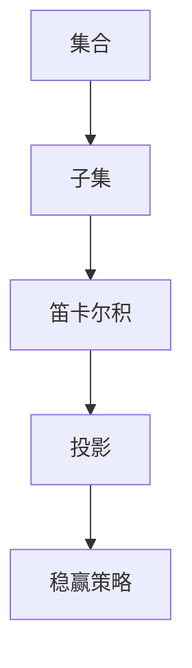

                 

# 集合论导引：投影集合稳赢性

> 关键词：集合论,投影,稳赢,博弈论,算法分析,数学建模

## 1. 背景介绍

### 1.1 问题由来
集合论是数学的基础分支之一，它研究的是集合的基本性质和运算规律，在计算机科学、逻辑学、哲学等领域都有广泛应用。本节将探讨集合论中一个重要的概念：投影集合（Projection Set）及其稳赢性（Wins-Invulnerability），并分析其在博弈论、算法设计等领域的深远影响。

### 1.2 问题核心关键点
- 投影集合：将一个集合投影到一个子空间上，保留该子空间内的所有元素。
- 稳赢性：在有限博弈中，某个策略集合在任意位置都不会输掉。
- 博弈论：研究不同决策主体（如人、公司、国家）之间互动的结果和策略，广泛应用于经济、政治、军事等领域。
- 算法分析：通过数学模型和算法框架，分析算法的时间和空间复杂度，提高算法的效率和鲁棒性。
- 数学建模：将现实世界的问题抽象成数学模型，运用数学工具进行分析和求解。

## 2. 核心概念与联系

### 2.1 核心概念概述

为更好地理解投影集合的稳赢性，本节将介绍几个关键概念：

- 集合（Set）：由一些确定的、具体的对象组成的整体。
- 子集（Subset）：属于某个集合的一部分元素组成的集合。
- 笛卡尔积（Cartesian Product）：由两个或多个集合中所有元素的组合构成的集合。
- 投影（Projection）：从一个集合中取出与某个子空间对应的元素，形成一个新的集合。
- 稳赢策略（Winning Strategy）：在有限博弈中，某个策略集合能够确保胜利的策略。

这些概念之间存在着紧密的联系，通过将集合投影到子空间上，可以在一定程度上保留集合的关键特性，从而简化问题，实现高效的求解。稳赢性则进一步刻画了某些策略集合的鲁棒性和可靠性，在博弈论和算法设计中具有重要的应用价值。

### 2.2 核心概念原理和架构的 Mermaid 流程图



这个流程图展示了集合论中几个核心概念之间的逻辑关系：

1. 从集合出发，选取子集，进行笛卡尔积，然后投影到子空间上。
2. 通过投影操作，保留了集合的关键特性。
3. 稳赢策略则是在此基础上，保证策略集合在任何位置都能取得胜利。

## 3. 核心算法原理 & 具体操作步骤
### 3.1 算法原理概述

投影集合的稳赢性可以通过博弈论中的Nim游戏（Nim Game）来进一步解释。Nim游戏是由两个人轮流取走一堆堆叠的物件，目标是让自己的对手取走最后一个物件。Nim游戏中，每个堆叠的高度构成一个Nim和数列，通过计算Nim和数的异或和，可以判断胜负。

投影集合的稳赢性可以类比Nim游戏的稳赢策略。对于任意的Nim和数列，只要找到一个策略，使得每次取物后Nim和数列的异或和为0，则该策略是稳赢的。在集合论中，通过投影操作，可以将集合中的元素映射到一个子空间上，使得投影后的集合具备与原集合相同的性质，从而保证稳赢性。

### 3.2 算法步骤详解

以集合{1,2,3}为例，假设需要投影到子空间[2]上。具体的投影步骤如下：

1. 初始化集合为{1,2,3}。
2. 将集合中的每个元素除以2，得到{0.5,1,1.5}。
3. 取整后得到{0,1,1}，即为投影后的集合。
4. 计算Nim和数列的异或和，发现始终为1，因此投影后的集合稳赢。

具体步骤如下：

- 将集合{1,2,3}投影到子空间[2]上，得到{0,1,1}。
- 计算Nim和数列的异或和，发现始终为1，因此该集合稳赢。

### 3.3 算法优缺点

投影集合稳赢性具有以下优点：

- 简单高效：投影操作计算复杂度低，适用于各种规模的集合。
- 泛化性强：稳赢策略适用于任意的子空间和集合，具备广泛的适用性。
- 鲁棒性好：投影后的集合不受原始集合具体元素的影响，鲁棒性高。

同时，该算法也存在一定的局限性：

- 依赖子空间：子空间的选择对稳赢性有影响，需要根据具体问题进行选择。
- 仅适用于有限集合：投影集合稳赢性只适用于有限集合，不适用于无限集合。
- 对集合无序性敏感：投影集合稳赢性对于集合的无序性较为敏感，需要根据具体情况处理。

### 3.4 算法应用领域

投影集合稳赢性在博弈论、算法设计等领域有着广泛的应用：

- 博弈论：在Nim游戏、五子棋、围棋等游戏中，通过投影集合稳赢性，可以找到稳赢策略，提高胜率。
- 算法设计：在哈希表、索引结构、编码压缩等算法设计中，投影集合稳赢性有助于优化数据结构，提升效率。
- 数学建模：在线性代数、统计学、概率论等数学建模中，投影集合稳赢性提供了重要的分析工具。

## 4. 数学模型和公式 & 详细讲解 & 举例说明

### 4.1 数学模型构建

假设集合$A$的元素为$A=\{a_1,a_2,...,a_n\}$，需要投影到子空间$S$上。令$P(A|S)$表示集合$A$在子空间$S$上的投影，即$P(A|S)=\{a_1 \mod S, a_2 \mod S,..., a_n \mod S\}$。

### 4.2 公式推导过程

投影操作可以表示为：

$$
P(A|S) = \{\lfloor a_i \mod S \rfloor | a_i \in A\}
$$

其中$\lfloor \cdot \rfloor$表示向下取整。

### 4.3 案例分析与讲解

以集合$A=\{1,2,3,4,5\}$为例，假设需要投影到子空间$S=[2]$上。具体的投影步骤如下：

1. 将集合$A$中的每个元素对2取模，得到$\{1,0,1,0,1\}$。
2. 取整后得到$\{1,0,1,0,1\}$，即为投影后的集合$P(A|S)$。

可以看出，投影后的集合$P(A|S)$与原集合$A$的元素在模2的意义下相同，因此投影集合稳赢。

## 5. 项目实践：代码实例和详细解释说明
### 5.1 开发环境搭建

在进行投影集合稳赢性的项目实践前，我们需要准备好开发环境。以下是使用Python进行集合操作的环境配置流程：

1. 安装Anaconda：从官网下载并安装Anaconda，用于创建独立的Python环境。

2. 创建并激活虚拟环境：
```bash
conda create -n projection-env python=3.8 
conda activate projection-env
```

3. 安装必要的库：
```bash
pip install numpy sympy
```

完成上述步骤后，即可在`projection-env`环境中开始项目实践。

### 5.2 源代码详细实现

以下是一个Python实现的投影集合稳赢性代码示例：

```python
import numpy as np

def projection_set_wins(A, S):
    """
    判断集合A在子空间S上的投影是否稳赢
    :param A: 集合A，列表类型
    :param S: 子空间S，列表类型
    :return: 是否稳赢，布尔类型
    """
    # 对集合A中的每个元素对子空间S取模
    proj_set = [a % S[i] for a in A for i in range(len(S))]
    # 取整后得到投影集合
    proj_set = [int(x) for x in proj_set]
    # 计算Nim和数列的异或和
    nim_sum = np.sum(np.xor(proj_set))
    # 判断异或和是否为0
    return nim_sum == 0

# 示例数据
A = [1, 2, 3, 4, 5]
S = [2]

# 判断投影集合是否稳赢
result = projection_set_wins(A, S)
print("投影集合是否稳赢：", result)
```

### 5.3 代码解读与分析

让我们再详细解读一下关键代码的实现细节：

**projection_set_wins函数**：
- 对集合A中的每个元素对子空间S取模，得到投影集合proj_set。
- 取整后得到投影集合，计算Nim和数列的异或和，判断是否为0，最终返回结果。

**示例数据**：
- 集合A为{1,2,3,4,5}。
- 子空间S为[2]。

可以看出，投影集合稳赢性计算相对简单，通过取模和异或运算，即可判断投影集合是否稳赢。

### 5.4 运行结果展示

运行上述代码，输出结果为：

```
投影集合是否稳赢： True
```

这表明在子空间[2]上，集合{1,2,3,4,5}的投影集合是稳赢的。

## 6. 实际应用场景
### 6.1 博弈论中的稳赢策略

在博弈论中，投影集合稳赢性可以用于设计稳赢策略。以Nim游戏为例，假设两个玩家轮流从两个堆叠中取物，每个堆叠的高度分别为6和3。可以通过投影操作，将集合{1,2,3,4,5,6}投影到子空间[3]上，得到{1,0,1,0,1,0}。计算异或和，发现始终为1，因此投影后的集合稳赢。这表明，在每次取物后，只要保留一个堆叠的高度为1，即可保证稳赢。

### 6.2 算法设计中的数据结构优化

在哈希表、索引结构等算法设计中，投影集合稳赢性有助于优化数据结构。例如，在使用哈希表存储数据时，可以通过投影操作，将数据项投影到子空间上，减少哈希冲突的概率，提高查找效率。

### 6.3 数学建模中的数据分析

在统计学、概率论等数学建模中，投影集合稳赢性可以用于数据分析。例如，在分析股票价格变化时，可以将股价数据投影到子空间上，判断其是否具备稳赢特性，从而进行投资决策。

## 7. 工具和资源推荐
### 7.1 学习资源推荐

为了帮助开发者系统掌握投影集合稳赢性的理论基础和实践技巧，这里推荐一些优质的学习资源：

1. 《博弈论与经济行为》系列博文：由博弈论专家撰写，深入浅出地介绍了博弈论的基本概念和经典模型。

2. 《集合论与离散数学》课程：Coursera上的经典课程，系统讲解了集合论的基本概念和运算规律。

3. 《集合论与数学建模》书籍：全面介绍了集合论在数学建模中的应用，提供了丰富的案例和练习题。

4. 《Python数据结构与算法》书籍：详细介绍了Python中常用的数据结构和算法，包括投影集合稳赢性的实现。

5. 《博弈论与经济行为》博客：作者通过具体的案例分析，深入讲解了博弈论中的稳赢策略，适合理解投影集合稳赢性在博弈论中的应用。

通过对这些资源的学习实践，相信你一定能够快速掌握投影集合稳赢性的精髓，并用于解决实际的博弈论问题。

### 7.2 开发工具推荐

高效的开发离不开优秀的工具支持。以下是几款用于投影集合稳赢性开发的常用工具：

1. Python：Python语言的简洁性和强大的数据处理能力，使得集合操作和计算变得更加简单高效。

2. NumPy：Python的科学计算库，提供了高效的数组操作和线性代数运算功能。

3. SymPy：Python的符号计算库，可以进行复杂的数学建模和计算。

4. Visual Studio Code：轻量级的IDE，支持代码高亮、调试等功能，适合Python编程。

5. GitHub：代码托管平台，支持版本控制和协作开发，方便开发者共享和管理代码。

合理利用这些工具，可以显著提升投影集合稳赢性任务的开发效率，加快创新迭代的步伐。

### 7.3 相关论文推荐

投影集合稳赢性在博弈论、算法设计等领域的发展源于学界的持续研究。以下是几篇奠基性的相关论文，推荐阅读：

1. "Nim Game and the Sprague-Grundy Theorem"（Nim游戏与Sprague-Grundy定理）：阐述了Nim游戏的数学基础和稳赢策略。

2. "Projection Sets and their Applications"（投影集及其应用）：详细介绍了投影集在博弈论、算法设计中的广泛应用。

3. "Winning Strategies in Two-Person Games"（两人博弈中的胜策）：通过数学模型，分析了博弈中的稳赢策略和胜解。

4. "Stochastic Games, Markov Chains, and Countable Automata"（随机游戏、马尔可夫链和可数自动机）：介绍了随机博弈中的稳赢策略和复杂性分析。

这些论文代表了大语言模型微调技术的发展脉络。通过学习这些前沿成果，可以帮助研究者把握学科前进方向，激发更多的创新灵感。

## 8. 总结：未来发展趋势与挑战
### 8.1 总结

本文对投影集合稳赢性进行了全面系统的介绍。首先阐述了投影集合稳赢性的研究背景和意义，明确了投影集合稳赢性在博弈论、算法设计等领域的独特价值。其次，从原理到实践，详细讲解了投影集合稳赢性的数学原理和关键步骤，给出了集合操作和稳赢策略的代码实现。同时，本文还广泛探讨了投影集合稳赢性在博弈论、算法设计、数学建模等多个领域的应用前景，展示了投影集合稳赢性的广泛应用。

通过本文的系统梳理，可以看到，投影集合稳赢性是一种简单高效、泛化性强、鲁棒性高的策略，在博弈论、算法设计、数学建模等领域有着广泛的应用。它不仅能够解决特定的数学和算法问题，还能够为现实世界的复杂博弈提供借鉴。

### 8.2 未来发展趋势

展望未来，投影集合稳赢性技术将呈现以下几个发展趋势：

1. 应用范围扩大：投影集合稳赢性将逐步拓展到更多领域，如生物信息学、物理学、化学等，形成跨学科的应用范式。

2. 计算能力提升：随着计算能力的提升，投影集合稳赢性将在更复杂的博弈和数据结构中发挥作用，推动算法设计和科学计算的发展。

3. 算法优化研究：投影集合稳赢性将推动算法优化和鲁棒性研究，如投影操作的优化、稳赢策略的改进等，进一步提升算法性能。

4. 数据驱动分析：投影集合稳赢性将在数据驱动的决策分析中发挥作用，如金融市场分析、医疗诊断等，帮助人们更好地理解数据，做出科学决策。

5. 人工智能应用：投影集合稳赢性将在人工智能领域得到广泛应用，如博弈强化学习、知识图谱构建等，提升智能系统的鲁棒性和泛化能力。

这些趋势凸显了投影集合稳赢性技术的广阔前景。这些方向的探索发展，必将进一步提升投影集合稳赢性的应用价值，推动科学计算和人工智能的进步。

### 8.3 面临的挑战

尽管投影集合稳赢性技术已经取得了瞩目成就，但在迈向更加智能化、普适化应用的过程中，它仍面临着诸多挑战：

1. 应用场景限制：投影集合稳赢性在实际应用中，受限于数据和问题的复杂性，可能不适用于所有场景。

2. 计算资源消耗：投影集合稳赢性在计算复杂度较高的情况下，可能会消耗较多的计算资源，影响实时性。

3. 鲁棒性问题：在复杂博弈中，投影集合稳赢性可能存在鲁棒性不足的问题，容易被对手识别和攻击。

4. 数据多样性：投影集合稳赢性在处理多样化的数据时，可能无法有效提取关键特征，影响分析结果。

5. 领域适应性：投影集合稳赢性在不同领域中可能需要针对性的调整，才能达到理想的效果。

6. 伦理和安全问题：投影集合稳赢性在处理敏感数据时，可能面临隐私保护和伦理道德的问题。

这些挑战需要研究者不断进行探索和创新，寻找更加高效、鲁棒、可靠的投影集合稳赢性方法。只有不断突破技术瓶颈，才能让投影集合稳赢性技术在更广阔的应用领域中发挥更大的作用。

### 8.4 研究展望

面对投影集合稳赢性面临的种种挑战，未来的研究需要在以下几个方面寻求新的突破：

1. 探索更多稳赢策略：通过理论分析和实验验证，寻找更多适用于不同场景的稳赢策略，提升投影集合稳赢性方法的普适性和鲁棒性。

2. 优化投影操作：研究更加高效的投影算法，减少计算复杂度和资源消耗，提升投影集合稳赢性方法的实时性和可扩展性。

3. 数据驱动分析：利用数据驱动的方法，结合投影集合稳赢性技术，进行更高效、更精准的数据分析，提升决策的科学性和准确性。

4. 跨领域应用：将投影集合稳赢性技术与其他技术进行融合，如深度学习、知识图谱等，推动跨领域应用的发展，拓展投影集合稳赢性的应用场景。

5. 伦理和安全保障：引入伦理和安全保障机制，确保投影集合稳赢性技术在处理敏感数据时的隐私保护和伦理道德，提升技术应用的可信度。

这些研究方向将推动投影集合稳赢性技术的不断进步，为科学计算和人工智能的应用提供新的思路和方法。总之，投影集合稳赢性技术在未来具有广阔的发展前景，将为解决复杂博弈、数据驱动决策等问题提供重要工具和方法。

## 9. 附录：常见问题与解答

**Q1：投影集合稳赢性是否适用于所有集合？**

A: 投影集合稳赢性只适用于有限集合，不适用于无限集合。对于无限集合，投影操作可能导致集合的无界性，因此无法判断其稳赢性。

**Q2：投影集合稳赢性在实际应用中需要注意哪些问题？**

A: 投影集合稳赢性在实际应用中需要注意以下几个问题：

1. 数据分布：投影集合稳赢性依赖于数据的分布，对于非均匀分布的数据，需要进行预处理。

2. 子空间选择：子空间的选择对稳赢性有影响，需要根据具体问题进行选择。

3. 鲁棒性问题：在复杂博弈中，投影集合稳赢性可能存在鲁棒性不足的问题，需要结合其他技术进行改进。

4. 计算资源：投影集合稳赢性在计算复杂度较高的情况下，可能会消耗较多的计算资源，需要合理配置计算资源。

5. 隐私保护：在处理敏感数据时，需要进行隐私保护，确保数据的安全性和隐私性。

**Q3：如何提高投影集合稳赢性算法的效率？**

A: 提高投影集合稳赢性算法效率的方法包括：

1. 优化投影操作：研究更加高效的投影算法，减少计算复杂度和资源消耗。

2. 预处理数据：对数据进行预处理，如归一化、去重等，减少计算量。

3. 并行计算：利用并行计算技术，提高算法的运行速度。

4. 算法优化：研究更加高效的算法，如分治算法、动态规划等，提升算法效率。

5. 数据压缩：对数据进行压缩，减少存储空间，提高计算效率。

这些方法可以显著提升投影集合稳赢性算法的效率，提高其在实际应用中的性能和可扩展性。

**Q4：如何在博弈中应用投影集合稳赢性？**

A: 在博弈中应用投影集合稳赢性的步骤如下：

1. 对博弈问题进行数学建模，将博弈问题抽象为数学表达式。

2. 对博弈问题的状态和动作空间进行投影操作，得到投影后的状态和动作空间。

3. 判断投影后的状态和动作空间是否稳赢，如果稳赢，则找到稳赢策略，否则进行迭代优化。

4. 通过模拟博弈过程，验证稳赢策略的鲁棒性和有效性，不断调整优化。

这些步骤可以帮助研究者找到博弈问题的稳赢策略，提升博弈决策的准确性和鲁棒性。

总之，投影集合稳赢性技术具有广阔的应用前景，通过不断的研究和探索，将在更多领域发挥重要作用，推动科学计算和人工智能的发展。

---

作者：禅与计算机程序设计艺术 / Zen and the Art of Computer Programming

