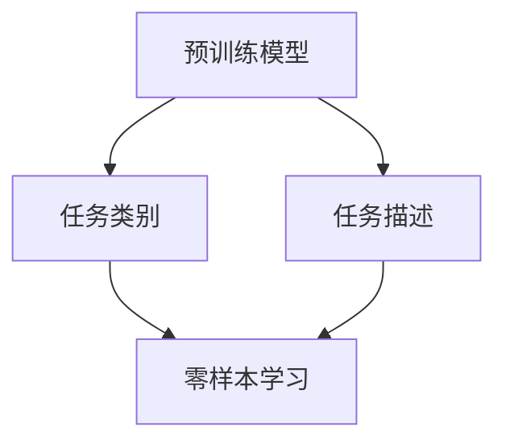

                 

## 1. 背景介绍

零样本学习（Zero-Shot Learning, ZSL）是指模型在未见到任何特定任务的训练样本的情况下，仅凭任务描述就能够执行新任务的能力。这种能力在大规模预训练语言模型（如BERT、GPT-3等）中被广泛研究和使用，已经成为了NLP领域的一个重要研究方向。

### 1.1 问题由来

在传统的监督学习方法中，模型需要通过大量标注数据进行训练，才能学习到特定任务的规律和模式。然而，在实际应用中，获取标注数据的成本非常高，且标注数据往往存在噪声和偏差。而零样本学习旨在克服这一问题，通过预训练模型自带的广泛语言知识，直接从任务描述中推断任务标签，实现对新任务的适应。

### 1.2 问题核心关键点

零样本学习的核心在于，如何利用预训练模型在大量无标签文本中学习到的语言知识，对新任务进行推断和分类。其关键点包括：

- 预训练模型的语言理解能力
- 任务描述的有效表示和转换
- 模型推断的准确性

## 2. 核心概念与联系

### 2.1 核心概念概述

为更好地理解零样本学习的原理和应用，本节将介绍几个核心概念：

- 预训练模型：通过大规模无标签文本数据进行预训练的语言模型，如BERT、GPT-3等，学习到语言的通用表示。
- 任务描述：任务的具体描述，通常为几句话或一段文本，用于向模型传递任务信息。
- 任务类别：模型在执行任务时，需要识别的不同类别或标签。
- 零样本学习：模型在没有见到任何特定任务的训练样本的情况下，仅凭任务描述就能够执行新任务的能力。
- 多标签分类：一些零样本任务涉及多个类别的识别，需要模型能够同时进行多标签分类。
- 自监督学习：通过无标签数据进行学习，避免标注数据的高成本和偏差。

这些核心概念之间的逻辑关系可以通过以下Mermaid流程图来展示：



这个流程图展示了大规模预训练语言模型的核心概念及其之间的关系：

1. 预训练模型通过大规模无标签文本数据进行预训练，学习到语言的通用表示。
2. 任务描述用于向模型传递任务信息，通常为几句话或一段文本。
3. 任务类别表示模型需要识别的不同类别或标签。
4. 零样本学习使模型在未见到任何特定任务的训练样本的情况下，仅凭任务描述就能够执行新任务的能力。

## 3. 核心算法原理 & 具体操作步骤

### 3.1 算法原理概述

零样本学习的核心思想是利用预训练模型自带的广泛语言知识，直接从任务描述中推断任务标签，实现对新任务的适应。具体而言，预训练模型在处理任务描述时，能够提取任务相关的语义信息，并映射到特定类别的概率分布上。

形式化地，假设预训练模型为 $M_{\theta}$，其中 $\theta$ 为预训练得到的模型参数。给定任务 $T$ 的类别集合 $\mathcal{C}$，任务描述 $d$，则零样本学习的目标是通过 $M_{\theta}$ 和 $d$，得到任务 $T$ 在类别集合 $\mathcal{C}$ 上的概率分布：

$$
p(y \mid d, \theta) = \frac{e^{f(d)} e^{y f(d)}}{\sum_{y \in \mathcal{C}} e^{y f(d)}}
$$

其中 $f(d)$ 为模型对任务描述 $d$ 的表示，$y$ 表示类别标签。

### 3.2 算法步骤详解

基于零样本学习的思想，零样本学习的算法步骤包括：

1. 准备预训练模型：选择合适的预训练语言模型 $M_{\theta}$ 作为初始化参数，如 BERT、GPT-3等。
2. 选择任务描述：根据具体任务，选择合适的问题描述，通常为几句话或一段文本。
3. 提取任务表示：通过预训练模型 $M_{\theta}$，将任务描述 $d$ 转换为模型表示 $f(d)$。
4. 进行类别推断：通过 $p(y \mid d, \theta)$，从类别集合 $\mathcal{C}$ 中推断出最可能的类别 $y$。
5. 结果输出：将推断出的类别 $y$ 作为模型对新任务的预测结果。

### 3.3 算法优缺点

零样本学习的优点在于：

1. 无需标注数据：不需要像传统监督学习那样，收集和标注大量数据，可以大幅降低成本和时间。
2. 泛化能力强：通过预训练模型的广泛语言知识，能够很好地处理语义相似但数据无标签的任务。
3. 模型适应性好：适用于多种NLP任务，如问答、分类、匹配等，能够灵活应对不同类型的任务描述。

同时，零样本学习也存在一定的局限性：

1. 依赖任务描述：零样本学习的性能很大程度上取决于任务描述的质量，难以处理长尾或模糊的任务描述。
2. 鲁棒性不足：模型可能对任务描述中的噪声和误导性信息敏感，影响推断结果的准确性。
3. 模型复杂度高：零样本学习通常需要较大计算资源，预训练模型和推理过程的复杂度较高。

## 4. 数学模型和公式 & 详细讲解 & 举例说明

### 4.1 数学模型构建

假设预训练模型 $M_{\theta}$ 的输入为文本 $x$，输出为向量表示 $f(x)$。对于零样本学习任务 $T$，其类别集合为 $\mathcal{C}$，任务描述为 $d$。则模型的预测函数为：

$$
p(y \mid d, \theta) = \frac{e^{f(d)} e^{y f(d)}}{\sum_{y \in \mathcal{C}} e^{y f(d)}}
$$

其中 $f(d)$ 为模型对任务描述 $d$ 的表示，$y$ 表示类别标签。

### 4.2 公式推导过程

以下我们以多标签分类任务为例，推导模型的预测函数及其梯度计算公式。

假设任务 $T$ 的多标签表示为 $\mathcal{Y} \subset \{0,1\}^{|\mathcal{C}|}$，其中 $| \mathcal{C} |$ 为类别数量。模型的预测函数可以扩展为：

$$
p(\mathcal{Y} \mid d, \theta) = \frac{e^{f(d)} e^{\sum_{y \in \mathcal{Y}} y f(d)}}{\sum_{\mathcal{Y}' \in \{0,1\}^{|\mathcal{C}|}} e^{\sum_{y \in \mathcal{Y}'} y f(d)}}
$$

对上式求梯度，得到类别标签 $y_i$ 的边际概率梯度：

$$
\frac{\partial \log p(\mathcal{Y} \mid d, \theta)}{\partial y_i} = \frac{f(d)_i}{p(\mathcal{Y} \mid d, \theta)}
$$

其中 $f(d)_i$ 为模型对任务描述 $d$ 的表示在类别 $y_i$ 上的概率。

### 4.3 案例分析与讲解

以BERT模型为例，其零样本学习的实现可以分为以下几个步骤：

1. 预训练模型初始化：选择BERT模型作为预训练模型，并加载其预训练权重。
2. 任务描述嵌入：将任务描述 $d$ 输入BERT模型，得到表示向量 $f(d)$。
3. 类别标签编码：将类别标签 $y$ 转换为独热编码向量 $\hat{y}$。
4. 分类损失计算：计算模型对任务描述 $d$ 的表示 $f(d)$ 与类别标签 $\hat{y}$ 之间的交叉熵损失 $L(d, y)$。
5. 梯度更新：使用优化器（如AdamW）对模型参数进行梯度更新，最小化分类损失。
6. 类别推断：使用softmax函数对模型预测向量进行解码，得到类别标签 $y$。

## 5. 项目实践：代码实例和详细解释说明

### 5.1 开发环境搭建

在进行零样本学习实践前，我们需要准备好开发环境。以下是使用Python进行PyTorch开发的环境配置流程：

1. 安装Anaconda：从官网下载并安装Anaconda，用于创建独立的Python环境。

2. 创建并激活虚拟环境：
```bash
conda create -n pytorch-env python=3.8 
conda activate pytorch-env
```

3. 安装PyTorch：根据CUDA版本，从官网获取对应的安装命令。例如：
```bash
conda install pytorch torchvision torchaudio cudatoolkit=11.1 -c pytorch -c conda-forge
```

4. 安装Transformers库：
```bash
pip install transformers
```

5. 安装各类工具包：
```bash
pip install numpy pandas scikit-learn matplotlib tqdm jupyter notebook ipython
```

完成上述步骤后，即可在`pytorch-env`环境中开始零样本学习实践。

### 5.2 源代码详细实现

这里我们以使用BERT模型进行多标签分类任务的零样本学习为例，给出PyTorch代码实现。

首先，定义多标签分类任务的数据处理函数：

```python
from transformers import BertTokenizer
from torch.utils.data import Dataset
import torch

class MultiLabelDataset(Dataset):
    def __init__(self, texts, labels, tokenizer, max_len=128):
        self.texts = texts
        self.labels = labels
        self.tokenizer = tokenizer
        self.max_len = max_len
        
    def __len__(self):
        return len(self.texts)
    
    def __getitem__(self, item):
        text = self.texts[item]
        labels = self.labels[item]
        
        encoding = self.tokenizer(text, return_tensors='pt', max_length=self.max_len, padding='max_length', truncation=True)
        input_ids = encoding['input_ids'][0]
        attention_mask = encoding['attention_mask'][0]
        
        # 对label-wise的标签进行编码
        encoded_labels = []
        for label in labels:
            encoded_label = [0] * len(self.tokenizer)
            encoded_label[label] = 1
            encoded_labels.append(encoded_label)
        
        encoded_labels = torch.tensor(encoded_labels, dtype=torch.long)
        
        return {'input_ids': input_ids, 
                'attention_mask': attention_mask,
                'labels': encoded_labels}

# 标签与id的映射
label2id = {1: 0, 2: 1, 3: 2, 4: 3}
id2label = {v: k for k, v in label2id.items()}

# 创建dataset
tokenizer = BertTokenizer.from_pretrained('bert-base-cased')

train_dataset = MultiLabelDataset(train_texts, train_labels, tokenizer)
dev_dataset = MultiLabelDataset(dev_texts, dev_labels, tokenizer)
test_dataset = MultiLabelDataset(test_texts, test_labels, tokenizer)
```

然后，定义模型和优化器：

```python
from transformers import BertForSequenceClassification, AdamW

model = BertForSequenceClassification.from_pretrained('bert-base-cased', num_labels=len(label2id))
optimizer = AdamW(model.parameters(), lr=2e-5)
```

接着，定义训练和评估函数：

```python
from torch.utils.data import DataLoader
from tqdm import tqdm
from sklearn.metrics import classification_report

device = torch.device('cuda') if torch.cuda.is_available() else torch.device('cpu')
model.to(device)

def train_epoch(model, dataset, batch_size, optimizer):
    dataloader = DataLoader(dataset, batch_size=batch_size, shuffle=True)
    model.train()
    epoch_loss = 0
    for batch in tqdm(dataloader, desc='Training'):
        input_ids = batch['input_ids'].to(device)
        attention_mask = batch['attention_mask'].to(device)
        labels = batch['labels'].to(device)
        model.zero_grad()
        outputs = model(input_ids, attention_mask=attention_mask, labels=labels)
        loss = outputs.loss
        epoch_loss += loss.item()
        loss.backward()
        optimizer.step()
    return epoch_loss / len(dataloader)

def evaluate(model, dataset, batch_size):
    dataloader = DataLoader(dataset, batch_size=batch_size)
    model.eval()
    preds, labels = [], []
    with torch.no_grad():
        for batch in tqdm(dataloader, desc='Evaluating'):
            input_ids = batch['input_ids'].to(device)
            attention_mask = batch['attention_mask'].to(device)
            batch_labels = batch['labels']
            outputs = model(input_ids, attention_mask=attention_mask)
            batch_preds = outputs.logits.argmax(dim=1).to('cpu').tolist()
            batch_labels = batch_labels.to('cpu').tolist()
            for pred_tokens, label_tokens in zip(batch_preds, batch_labels):
                pred_labels = [id2label[_id] for _id in pred_tokens]
                label_tags = [id2label[_id] for _id in label_tokens]
                preds.append(pred_labels[:len(label_tokens)])
                labels.append(label_tags[:len(label_tokens)])
                
    print(classification_report(labels, preds))
```

最后，启动训练流程并在测试集上评估：

```python
epochs = 5
batch_size = 16

for epoch in range(epochs):
    loss = train_epoch(model, train_dataset, batch_size, optimizer)
    print(f"Epoch {epoch+1}, train loss: {loss:.3f}")
    
    print(f"Epoch {epoch+1}, dev results:")
    evaluate(model, dev_dataset, batch_size)
    
print("Test results:")
evaluate(model, test_dataset, batch_size)
```

以上就是使用PyTorch对BERT模型进行多标签分类任务零样本学习的完整代码实现。可以看到，使用Transformers库对BERT进行零样本学习的代码实现相对简洁高效。

### 5.3 代码解读与分析

让我们再详细解读一下关键代码的实现细节：

**MultiLabelDataset类**：
- `__init__`方法：初始化文本、标签、分词器等关键组件。
- `__len__`方法：返回数据集的样本数量。
- `__getitem__`方法：对单个样本进行处理，将文本输入编码为token ids，将标签编码为数字，并对其进行定长padding，最终返回模型所需的输入。

**label2id和id2label字典**：
- 定义了标签与数字id之间的映射关系，用于将label-wise的预测结果解码回真实的标签。

**训练和评估函数**：
- 使用PyTorch的DataLoader对数据集进行批次化加载，供模型训练和推理使用。
- 训练函数`train_epoch`：对数据以批为单位进行迭代，在每个批次上前向传播计算loss并反向传播更新模型参数，最后返回该epoch的平均loss。
- 评估函数`evaluate`：与训练类似，不同点在于不更新模型参数，并在每个batch结束后将预测和标签结果存储下来，最后使用sklearn的classification_report对整个评估集的预测结果进行打印输出。

**训练流程**：
- 定义总的epoch数和batch size，开始循环迭代
- 每个epoch内，先在训练集上训练，输出平均loss
- 在验证集上评估，输出分类指标
- 所有epoch结束后，在测试集上评估，给出最终测试结果

可以看到，PyTorch配合Transformers库使得BERT模型进行零样本学习的代码实现变得简洁高效。开发者可以将更多精力放在数据处理、模型改进等高层逻辑上，而不必过多关注底层的实现细节。

当然，工业级的系统实现还需考虑更多因素，如模型的保存和部署、超参数的自动搜索、更灵活的任务适配层等。但核心的零样本学习范式基本与此类似。

## 6. 实际应用场景
### 6.1 智能客服系统

基于大语言模型的零样本学习，可以广泛应用于智能客服系统的构建。传统客服往往需要配备大量人力，高峰期响应缓慢，且一致性和专业性难以保证。而使用零样本学习的对话模型，可以7x24小时不间断服务，快速响应客户咨询，用自然流畅的语言解答各类常见问题。

在技术实现上，可以收集企业内部的历史客服对话记录，将问题和最佳答复构建成监督数据，在此基础上对预训练模型进行零样本学习。零样本学习的对话模型能够自动理解用户意图，匹配最合适的答案模板进行回复。对于客户提出的新问题，还可以接入检索系统实时搜索相关内容，动态组织生成回答。如此构建的智能客服系统，能大幅提升客户咨询体验和问题解决效率。

### 6.2 金融舆情监测

金融机构需要实时监测市场舆论动向，以便及时应对负面信息传播，规避金融风险。传统的人工监测方式成本高、效率低，难以应对网络时代海量信息爆发的挑战。基于大语言模型零样本学习的文本分类和情感分析技术，为金融舆情监测提供了新的解决方案。

具体而言，可以收集金融领域相关的新闻、报道、评论等文本数据，并对其进行主题标注和情感标注。在此基础上对预训练语言模型进行零样本学习，使其能够自动判断文本属于何种主题，情感倾向是正面、中性还是负面。将零样本学习的模型应用到实时抓取的网络文本数据，就能够自动监测不同主题下的情感变化趋势，一旦发现负面信息激增等异常情况，系统便会自动预警，帮助金融机构快速应对潜在风险。

### 6.3 个性化推荐系统

当前的推荐系统往往只依赖用户的历史行为数据进行物品推荐，无法深入理解用户的真实兴趣偏好。基于大语言模型零样本学习的个性化推荐系统，可以更好地挖掘用户行为背后的语义信息，从而提供更精准、多样的推荐内容。

在实践中，可以收集用户浏览、点击、评论、分享等行为数据，提取和用户交互的物品标题、描述、标签等文本内容。将文本内容作为模型输入，用户的后续行为（如是否点击、购买等）作为监督信号，在此基础上零样本学习预训练语言模型。零样本学习的模型能够从文本内容中准确把握用户的兴趣点。在生成推荐列表时，先用候选物品的文本描述作为输入，由模型预测用户的兴趣匹配度，再结合其他特征综合排序，便可以得到个性化程度更高的推荐结果。

### 6.4 未来应用展望

随着大语言模型零样本学习的不断发展，其应用前景将更加广阔。

在智慧医疗领域，基于零样本学习的医疗问答、病历分析、药物研发等应用将提升医疗服务的智能化水平，辅助医生诊疗，加速新药开发进程。

在智能教育领域，零样本学习的知识推荐系统，可以因材施教，促进教育公平，提高教学质量。

在智慧城市治理中，零样本学习的多标签分类模型，可用于城市事件监测、舆情分析、应急指挥等环节，提高城市管理的自动化和智能化水平，构建更安全、高效的未来城市。

此外，在企业生产、社会治理、文娱传媒等众多领域，零样本学习的技术也将不断涌现，为NLP技术带来全新的突破。随着预训练语言模型和零样本学习方法的不断进步，相信NLP技术将在更广阔的应用领域大放异彩。

## 7. 工具和资源推荐
### 7.1 学习资源推荐

为了帮助开发者系统掌握零样本学习的理论基础和实践技巧，这里推荐一些优质的学习资源：

1. 《Transformer from Sketch to Scale》系列博文：由大模型技术专家撰写，深入浅出地介绍了Transformer原理、BERT模型、零样本学习等前沿话题。

2. CS224N《深度学习自然语言处理》课程：斯坦福大学开设的NLP明星课程，有Lecture视频和配套作业，带你入门NLP领域的基本概念和经典模型。

3. 《Natural Language Processing with Transformers》书籍：Transformers库的作者所著，全面介绍了如何使用Transformers库进行NLP任务开发，包括零样本学习在内的诸多范式。

4. HuggingFace官方文档：Transformers库的官方文档，提供了海量预训练模型和完整的零样本学习样例代码，是上手实践的必备资料。

5. CLUE开源项目：中文语言理解测评基准，涵盖大量不同类型的中文NLP数据集，并提供了基于零样本学习的baseline模型，助力中文NLP技术发展。

通过对这些资源的学习实践，相信你一定能够快速掌握零样本学习的精髓，并用于解决实际的NLP问题。
###  7.2 开发工具推荐

高效的开发离不开优秀的工具支持。以下是几款用于零样本学习开发的常用工具：

1. PyTorch：基于Python的开源深度学习框架，灵活动态的计算图，适合快速迭代研究。大部分预训练语言模型都有PyTorch版本的实现。

2. TensorFlow：由Google主导开发的开源深度学习框架，生产部署方便，适合大规模工程应用。同样有丰富的预训练语言模型资源。

3. Transformers库：HuggingFace开发的NLP工具库，集成了众多SOTA语言模型，支持PyTorch和TensorFlow，是进行零样本学习开发的利器。

4. Weights & Biases：模型训练的实验跟踪工具，可以记录和可视化模型训练过程中的各项指标，方便对比和调优。与主流深度学习框架无缝集成。

5. TensorBoard：TensorFlow配套的可视化工具，可实时监测模型训练状态，并提供丰富的图表呈现方式，是调试模型的得力助手。

6. Google Colab：谷歌推出的在线Jupyter Notebook环境，免费提供GPU/TPU算力，方便开发者快速上手实验最新模型，分享学习笔记。

合理利用这些工具，可以显著提升零样本学习的开发效率，加快创新迭代的步伐。

### 7.3 相关论文推荐

零样本学习的研究始于学界的持续研究。以下是几篇奠基性的相关论文，推荐阅读：

1. Zero-Shot Classification with BERT：提出使用BERT进行零样本分类的模型，取得当时SOTA性能。

2. Learning Zero-Shot Classification with Language Models：通过自监督学习的方式，训练出能够在零样本场景下进行分类的模型。

3. CSA: Large Scale Zero-Shot Learning of Semantic Actions from Online Reviews：提出使用zero-shot学习进行在线评论语义分类的方法。

4. PEGASUS: Pre-training with Extractive and Generative Pre-training Strategies for Zero-Shot Summarization：提出使用预训练策略进行zero-shot摘要生成的方法。

5. SIMLC: Unsupervised Simultaneous Multilingual Classification：提出使用无监督学习进行多语言分类的方法。

这些论文代表了大规模预训练语言模型零样本学习的发展脉络。通过学习这些前沿成果，可以帮助研究者把握学科前进方向，激发更多的创新灵感。

## 8. 总结：未来发展趋势与挑战

### 8.1 总结

本文对基于零样本学习的NLP技术进行了全面系统的介绍。首先阐述了零样本学习的背景和意义，明确了零样本学习在提升模型泛化能力、降低标注成本方面的独特价值。其次，从原理到实践，详细讲解了零样本学习的数学原理和关键步骤，给出了零样本学习任务开发的完整代码实例。同时，本文还广泛探讨了零样本学习在智能客服、金融舆情、个性化推荐等多个行业领域的应用前景，展示了零样本学习范式的巨大潜力。此外，本文精选了零样本学习的各类学习资源，力求为读者提供全方位的技术指引。

通过本文的系统梳理，可以看到，基于大语言模型的零样本学习技术正在成为NLP领域的重要范式，极大地拓展了预训练语言模型的应用边界，催生了更多的落地场景。零样本学习无需标注数据，能够更好地适应语义相似但数据无标签的任务，提高了NLP模型的泛化性和适用性。未来，随着零样本学习方法的不断进步，基于零样本学习的技术必将在更广泛的应用领域大放异彩，为人类认知智能的进化带来深远影响。

### 8.2 未来发展趋势

展望未来，零样本学习技术将呈现以下几个发展趋势：

1. 模型规模持续增大。随着算力成本的下降和数据规模的扩张，预训练语言模型的参数量还将持续增长。超大规模语言模型蕴含的丰富语言知识，有望支撑更加复杂多变的零样本任务。

2. 零样本学习范式日趋多样。除了传统的zero-shot分类外，未来会涌现更多零样本学习范式，如零样本生成、零样本问答等，推动零样本技术在更多场景中的应用。

3. 多任务学习成为常态。零样本学习能够同时处理多种任务，提高模型在多任务上的泛化能力。

4. 融合多模态信息。零样本学习将融合视觉、语音等多模态信息，实现多模态信息与文本信息的协同建模，提升模型性能。

5. 增强对抗性和鲁棒性。零样本学习模型的决策过程更加复杂，需要引入对抗性训练、鲁棒性评估等技术，确保模型在多变环境下的稳定性。

6. 引入更多先验知识。将符号化的先验知识，如知识图谱、逻辑规则等，与神经网络模型进行巧妙融合，引导零样本学习过程学习更准确、合理的语言模型。

以上趋势凸显了零样本学习技术的广阔前景。这些方向的探索发展，必将进一步提升零样本学习模型的性能和应用范围，为构建安全、可靠、可解释、可控的智能系统铺平道路。

### 8.3 面临的挑战

尽管零样本学习技术已经取得了瞩目成就，但在迈向更加智能化、普适化应用的过程中，它仍面临着诸多挑战：

1. 任务描述依赖高。零样本学习的性能很大程度上取决于任务描述的质量，难以处理长尾或模糊的任务描述。

2. 鲁棒性不足。模型可能对任务描述中的噪声和误导性信息敏感，影响推断结果的准确性。

3. 模型复杂度高。零样本学习通常需要较大计算资源，预训练模型和推理过程的复杂度较高。

4. 知识整合能力不足。现有的零样本学习模型往往局限于任务内数据，难以灵活吸收和运用更广泛的先验知识。

5. 可解释性有待加强。当前零样本学习模型更多是"黑盒"系统，难以解释其内部工作机制和决策逻辑。

6. 安全性有待保障。零样本学习模型可能会学习到有偏见、有害的信息，通过任务描述传递到下游任务，产生误导性、歧视性的输出，给实际应用带来安全隐患。

7. 数据隐私保护。零样本学习需要获取大量的无标签文本数据，可能侵犯用户隐私。如何在保护隐私的前提下进行数据获取和模型训练，是未来需要解决的重要问题。

面对这些挑战，未来的研究需要在数据、算法、工程、伦理等多个方面进行协同攻关，才能真正实现零样本学习的理想效果。

### 8.4 研究展望

面对零样本学习所面临的种种挑战，未来的研究需要在以下几个方面寻求新的突破：

1. 探索无监督和半监督零样本学习：摆脱对任务描述的依赖，利用自监督学习、主动学习等无监督和半监督范式，最大限度利用非结构化数据，实现更加灵活高效的零样本学习。

2. 研究参数高效和计算高效的零样本学习范式：开发更加参数高效的零样本学习模型，在固定大部分预训练参数的同时，只更新极少量的任务相关参数。同时优化零样本学习的计算图，减少前向传播和反向传播的资源消耗，实现更加轻量级、实时性的部署。

3. 引入因果推断和对比学习思想：增强零样本学习模型的因果关系建立能力，学习更加普适、鲁棒的语言表征，从而提升模型泛化性和抗干扰能力。

4. 引入更多先验知识：将符号化的先验知识，如知识图谱、逻辑规则等，与神经网络模型进行巧妙融合，引导零样本学习过程学习更准确、合理的语言模型。

5. 引入多模态信息：零样本学习将融合视觉、语音等多模态信息，实现多模态信息与文本信息的协同建模，提升模型性能。

6. 结合因果分析和博弈论工具：将因果分析方法引入零样本学习模型，识别出模型决策的关键特征，增强输出解释的因果性和逻辑性。借助博弈论工具刻画人机交互过程，主动探索并规避模型的脆弱点，提高系统稳定性。

7. 纳入伦理道德约束：在模型训练目标中引入伦理导向的评估指标，过滤和惩罚有偏见、有害的输出倾向。同时加强人工干预和审核，建立模型行为的监管机制，确保输出符合人类价值观和伦理道德。

这些研究方向将进一步推动零样本学习技术的创新，提升模型在实际应用中的表现，为构建更加安全、可靠、可解释、可控的智能系统提供支撑。

## 9. 附录：常见问题与解答

**Q1：零样本学习是否适用于所有NLP任务？**

A: 零样本学习在大多数NLP任务上都能取得不错的效果，特别是对于数据量较小的任务。但对于一些特定领域的任务，如医学、法律等，仅仅依靠通用语料预训练的模型可能难以很好地适应。此时需要在特定领域语料上进一步预训练，再进行零样本学习，才能获得理想效果。此外，对于一些需要时效性、个性化很强的任务，如对话、推荐等，零样本学习方法也需要针对性的改进优化。

**Q2：零样本学习依赖任务描述的质量？**

A: 是的，零样本学习的性能很大程度上取决于任务描述的质量。如果任务描述模糊或包含噪声，模型可能会产生误导性的推断结果。因此，在实践中，需要精心设计任务描述，确保其准确性和相关性。此外，可以引入对抗样本生成等技术，提升任务描述的鲁棒性和泛化能力。

**Q3：零样本学习的计算复杂度如何？**

A: 零样本学习的计算复杂度较高，主要原因在于模型需要处理大量的文本数据和复杂的推理过程。在实践中，可以采用模型裁剪、量化加速等技术，优化模型的推理速度和内存占用。同时，可以使用分布式计算等手段，提高模型的计算效率。

**Q4：零样本学习的可解释性如何？**

A: 目前零样本学习模型的可解释性不足，难以解释其内部工作机制和决策逻辑。为了提高零样本学习的可解释性，可以考虑引入知识图谱、逻辑规则等符号化知识，结合神经网络模型进行联合训练。同时，可以引入因果分析、博弈论等工具，增强模型的决策透明度和可解释性。

**Q5：零样本学习与微调的区别？**

A: 零样本学习和微调都是NLP领域的重要技术，但它们的工作原理和应用场景有所不同。微调是通过预训练模型在少量标注数据上进行有监督的训练，提升模型在特定任务上的性能。而零样本学习是模型在没有见到任何特定任务的训练样本的情况下，仅凭任务描述就能够执行新任务的能力。零样本学习适用于数据量较少的任务，而微调则适用于数据量较多的任务。此外，微调需要更新模型参数，而零样本学习通常不需要。

---

作者：禅与计算机程序设计艺术 / Zen and the Art of Computer Programming

