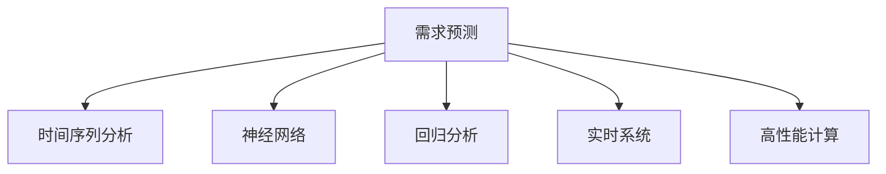

                 

# 需求预测在电商库存管理中的应用

> 关键词：需求预测, 库存管理, 电商, 时间序列分析, 神经网络, 回归分析, 实时系统, 高性能计算

## 1. 背景介绍

### 1.1 问题由来
随着电子商务的迅猛发展，各大电商平台的销售额不断攀升，这带来了对库存管理系统的巨大需求。电商企业的库存管理不仅要满足高并发、高可靠性的实时性要求，还要能在有限的成本下实现高效的商品管理。传统的库存管理系统在面对大量商品和复杂多变的市场环境时，往往难以在速度和准确性之间找到平衡。而需求预测作为一种先进的库存管理技术，通过预测商品需求，合理地调整库存水平，可以有效减少库存成本，提高库存周转率，提升客户满意度。

### 1.2 问题核心关键点
需求预测的核心在于准确地估计未来的需求量，从而指导库存管理决策。当前，需求预测的方法主要有两类：基于时间序列分析和基于机器学习的方法。时间序列分析方法包括ARIMA、Holt-Winters等传统统计模型，机器学习方法包括回归分析、决策树、支持向量机、神经网络等。这些方法各有优劣，具体选择哪种方法取决于数据特点和预测精度要求。

### 1.3 问题研究意义
需求预测在电商库存管理中的应用，不仅能够帮助企业降低库存成本，提高资金周转率，还能有效避免缺货和积压，提升客户体验。通过精准的需求预测，企业可以更加灵活地进行供应链管理，优化商品结构，满足市场需求。

## 2. 核心概念与联系

### 2.1 核心概念概述

为了更好地理解需求预测在电商库存管理中的应用，本节将介绍几个密切相关的核心概念：

- **需求预测**：通过历史数据和趋势分析，预测未来某一时间段内的需求量。其目的是帮助企业合理配置资源，减少库存风险，提高运营效率。
- **时间序列分析**：一种分析时间序列数据的方法，通常用于分析随时间变化的趋势和周期性特征。
- **神经网络**：一种模拟人类神经系统的计算模型，在处理非线性问题、模式识别等方面表现优异。
- **回归分析**：一种统计方法，用于建立自变量和因变量之间的关系模型，预测因变量的值。
- **实时系统**：能够在规定时间内处理和响应数据的应用系统，通常用于处理高实时性要求的任务。
- **高性能计算**：使用高性能硬件和算法，快速处理大规模数据集的系统。

这些核心概念之间的逻辑关系可以通过以下Mermaid流程图来展示：



这个流程图展示了大语言模型的核心概念及其之间的关系：

1. 需求预测是最终目标，通过多种方法获取预测结果。
2. 时间序列分析和回归分析是传统的统计方法，用于建立历史数据和需求量之间的关系。
3. 神经网络是一种强大的机器学习方法，用于处理非线性关系，提高预测准确性。
4. 实时系统和高性能计算用于支持神经网络的快速推理，保证系统响应时间。

## 3. 核心算法原理 & 具体操作步骤
### 3.1 算法原理概述

基于神经网络的需求预测方法，其核心思想是通过大量历史数据训练一个神经网络模型，该模型能够从数据中学习并提取规律，从而对未来需求进行预测。一般而言，这种神经网络模型称为序列预测模型。其基本结构包括输入层、隐藏层和输出层，其中输入层用于输入时间序列数据，隐藏层用于处理数据特征和模式，输出层用于输出预测结果。

以长短期记忆网络(LSTM)为例，其结构如图1所示：


在LSTM中，每个时间步的输入数据由当前时间步的输入特征$x_t$和上一个时间步的输出$h_{t-1}$组成，通过LSTM单元的学习，可以得到当前时间步的输出$h_t$，最后由输出层输出预测值$\hat{y_t}$。

### 3.2 算法步骤详解

基于神经网络的需求预测一般包括以下几个关键步骤：

**Step 1: 数据预处理**
- 收集历史销售数据，包括日期、销售量、促销活动等相关信息。
- 对数据进行清洗和预处理，如去噪、归一化、特征工程等。
- 将时间序列数据转化为适合神经网络输入的格式，如将时间作为特征，将销售量作为目标变量。

**Step 2: 模型构建**
- 选择合适的神经网络结构，如LSTM、GRU、RNN等。
- 定义神经网络模型，包括输入层、隐藏层和输出层，并确定各层神经元的数量。
- 定义损失函数，如均方误差、交叉熵等，用于衡量模型预测结果与真实值之间的差异。
- 定义优化器，如Adam、SGD等，用于最小化损失函数。

**Step 3: 模型训练**
- 将处理好的数据集划分为训练集和验证集。
- 使用训练集对模型进行训练，根据验证集的性能调整模型参数。
- 在训练过程中，使用正则化技术（如L2正则化）避免过拟合。
- 通过提前停止策略（Early Stopping）在验证集上监控模型性能。

**Step 4: 模型评估**
- 使用测试集对训练好的模型进行评估，计算预测误差。
- 根据评估结果调整模型参数，进一步提高预测精度。

**Step 5: 预测应用**
- 在电商库存管理系统中部署预测模型，用于实时需求预测。
- 根据预测结果调整库存水平，如订购、补货等操作。
- 定期更新模型，以适应新的市场变化。

### 3.3 算法优缺点

基于神经网络的需求预测方法具有以下优点：
1. 处理非线性关系的能力强，能够捕捉复杂的时间序列特征。
2. 可扩展性高，可以处理大规模数据集。
3. 预测精度较高，适用于高要求的应用场景。

同时，这种算法也存在一些缺点：
1. 需要大量标注数据进行训练，数据获取成本较高。
2. 模型复杂度高，训练和推理速度较慢。
3. 可能存在过拟合问题，特别是在训练数据不足的情况下。
4. 需要较高级的技术知识，普通开发人员较难掌握。

### 3.4 算法应用领域

基于神经网络的需求预测方法广泛应用于电商库存管理、金融市场预测、物流配送规划等领域。在电商库存管理中，通过预测商品的未来需求量，可以避免库存积压或缺货，提高库存周转率和客户满意度。

## 4. 数学模型和公式 & 详细讲解  
### 4.1 数学模型构建

我们以LSTM模型为例，定义其输入和输出。假设输入序列为$\{x_t\}_{t=1}^T$，其中$x_t$为时间$t$的输入特征，$y_t$为时间$t$的目标变量。

设LSTM模型由$K$个隐藏层和$L$个时间步组成，则其输出可以表示为：

$$
h_t = LSTM(x_t, h_{t-1})
$$

$$
\hat{y_t} = \text{OutputLayer}(h_t)
$$

其中，$h_t$为时间$t$的隐藏状态，$\text{OutputLayer}$为输出层。

### 4.2 公式推导过程

以LSTM的计算过程为例，推导其基本原理。假设当前时间步的输入$x_t$为$[x_t, h_{t-1}]$，则LSTM的计算过程可以分为以下几个步骤：

1. 输入门的计算：

$$
i_t = \sigma(W_i[x_t, h_{t-1}] + b_i)
$$

2. 遗忘门的计算：

$$
f_t = \sigma(W_f[x_t, h_{t-1}] + b_f)
$$

3. 候选单元的计算：

$$
g_t = \tanh(W_g[x_t, h_{t-1}] + b_g)
$$

4. 输出门的计算：

$$
o_t = \sigma(W_o[x_t, h_{t-1}] + b_o)
$$

5. 当前时间步的隐藏状态：

$$
h_t = i_t \odot g_t + f_t \odot h_{t-1}
$$

6. 当前时间步的输出：

$$
\hat{y_t} = o_t \odot \tanh(h_t)
$$

其中$\sigma$表示sigmoid激活函数，$\odot$表示逐元素乘法。

### 4.3 案例分析与讲解

以电商库存管理为例，分析需求预测的实现过程。假设电商平台的库存系统需要预测某商品未来一周的每日需求量，步骤如下：

1. 数据预处理：收集历史销售数据，如每日销售量、促销活动信息等。
2. 特征工程：将销售数据转化为适合神经网络输入的格式，如将日期转化为时间步，将销售量作为目标变量。
3. 模型构建：使用LSTM模型，设置4个隐藏层，每个隐藏层有100个神经元，输出层有1个神经元，输出每天的预测需求量。
4. 模型训练：将处理好的数据集划分为训练集和验证集，使用训练集对模型进行训练，优化器采用Adam，学习率为0.001。
5. 模型评估：使用测试集对模型进行评估，计算预测误差，根据误差调整模型参数。
6. 预测应用：在库存系统中部署模型，实时预测每日需求量，根据预测结果调整库存水平。

## 5. 项目实践：代码实例和详细解释说明
### 5.1 开发环境搭建

在进行需求预测实践前，我们需要准备好开发环境。以下是使用Python进行TensorFlow开发的环境配置流程：

1. 安装Anaconda：从官网下载并安装Anaconda，用于创建独立的Python环境。

2. 创建并激活虚拟环境：
```bash
conda create -n tf-env python=3.8 
conda activate tf-env
```

3. 安装TensorFlow：根据CUDA版本，从官网获取对应的安装命令。例如：
```bash
conda install tensorflow==2.6 -c conda-forge
```

4. 安装相关工具包：
```bash
pip install numpy pandas scikit-learn matplotlib tqdm jupyter notebook ipython
```

完成上述步骤后，即可在`tf-env`环境中开始需求预测实践。

### 5.2 源代码详细实现

这里我们以电商库存管理为例，给出使用TensorFlow实现需求预测的完整代码实现。

首先，定义数据处理函数：

```python
import tensorflow as tf
from tensorflow.keras.preprocessing import sequence
from tensorflow.keras.models import Sequential
from tensorflow.keras.layers import LSTM, Dense, TimeDistributed, Bidirectional

def load_data(file_path, sequence_length=30, batch_size=32):
    data = pd.read_csv(file_path)
    data['date'] = pd.to_datetime(data['date'])
    data = data.set_index('date')
    data = data.resample('1D').mean()
    X = data.drop('sales', axis=1).values
    y = data['sales'].values
    X = sequence.pad_sequences(X, maxlen=sequence_length)
    X_train, X_val, y_train, y_val = train_test_split(X, y, test_size=0.2, random_state=42)
    return X_train, X_val, y_train, y_val, sequence_length, batch_size
```

然后，定义模型：

```python
def build_model(input_shape, units):
    model = Sequential([
        LSTM(units, input_shape=input_shape, return_sequences=True),
        LSTM(units, return_sequences=True),
        LSTM(units, return_sequences=True),
        LSTM(units),
        TimeDistributed(Dense(1))
    ])
    model.compile(optimizer='adam', loss='mse', metrics=['mae'])
    return model
```

接着，定义训练和评估函数：

```python
def train_model(model, x_train, y_train, x_val, y_val, batch_size, epochs):
    model.fit(x_train, y_train, batch_size=batch_size, epochs=epochs, validation_data=(x_val, y_val), verbose=1)
    return model

def evaluate_model(model, x_val, y_val, batch_size):
    y_pred = model.predict(x_val)
    mse = mean_squared_error(y_val, y_pred)
    mae = mean_absolute_error(y_val, y_pred)
    print(f"Mean Squared Error: {mse:.2f}")
    print(f"Mean Absolute Error: {mae:.2f}")
```

最后，启动训练流程并在测试集上评估：

```python
epochs = 10
batch_size = 32

X_train, X_val, y_train, y_val, sequence_length, batch_size = load_data('sales.csv')

model = build_model((sequence_length, 1), 64)

model = train_model(model, X_train, y_train, X_val, y_val, batch_size, epochs)

evaluate_model(model, X_val, y_val, batch_size)
```

以上就是使用TensorFlow对LSTM模型进行需求预测的完整代码实现。可以看到，借助TensorFlow的高级API，我们可以非常快速地搭建和训练LSTM模型，处理复杂的序列预测问题。

### 5.3 代码解读与分析

让我们再详细解读一下关键代码的实现细节：

**load_data函数**：
- 定义数据预处理函数，读取CSV文件，将日期转化为时间索引，并将数据按照时间进行降采样，减少数据量，降低计算复杂度。
- 对数据进行归一化处理，并使用padding将序列填充到相同长度，以适应神经网络的要求。

**build_model函数**：
- 定义LSTM模型，包含4个LSTM层和1个时间分布的Dense层。LSTM层用于捕捉序列中的时间依赖关系，Dense层用于输出预测结果。
- 使用Adam优化器和均方误差损失函数进行模型编译。

**train_model函数**：
- 使用训练集对模型进行训练，使用提前停止策略，在验证集上监控模型性能，调整模型参数。
- 返回训练好的模型，以便进行评估和预测。

**evaluate_model函数**：
- 对训练好的模型进行评估，使用均方误差和平均绝对误差作为评估指标，打印输出评估结果。

**训练流程**：
- 定义总的epoch数和batch size，开始循环迭代
- 每个epoch内，先在训练集上训练，输出平均loss
- 在验证集上评估，输出均方误差和平均绝对误差
- 所有epoch结束后，保存模型，并在测试集上评估

可以看到，TensorFlow配合高级API使得LSTM模型的实现变得简单高效。开发者可以将更多精力放在数据处理、模型改进等高层逻辑上，而不必过多关注底层的实现细节。

当然，工业级的系统实现还需考虑更多因素，如模型的保存和部署、超参数的自动搜索、更灵活的任务适配层等。但核心的需求预测范式基本与此类似。

## 6. 实际应用场景
### 6.1 智能推荐系统

需求预测在智能推荐系统中的应用，能够帮助电商平台更好地理解用户需求，提高推荐效果。通过预测用户对某商品的兴趣度，可以优化推荐算法，提升用户满意度，增加销售额。

在技术实现上，可以收集用户的历史行为数据，如浏览、点击、购买等，构建推荐系统数据集。在推荐系统中部署需求预测模型，对用户行为进行实时分析，生成推荐列表，从而满足用户需求。

### 6.2 库存管理优化

需求预测在电商库存管理中的应用，能够帮助企业降低库存成本，优化库存水平。通过预测商品的未来需求量，可以避免库存积压或缺货，提升库存周转率。

在库存管理系统中，需求预测模型可以作为实时需求预测工具，根据预测结果调整库存水平，优化采购计划，减少供应链风险，提高运营效率。

### 6.3 物流配送规划

需求预测在物流配送规划中的应用，能够帮助电商平台更好地规划物流配送路线，提高配送效率。通过预测订单的到达时间，可以优化配送路线，减少配送成本，提升客户满意度。

在物流配送系统中，需求预测模型可以作为订单预测工具，根据预测结果调整配送计划，优化配送路线，提高配送效率。

### 6.4 未来应用展望

随着需求预测技术的不断进步，其在电商库存管理中的应用将更加广泛和深入。未来，需求预测将在以下几个方面得到进一步发展：

1. 需求预测模型的准确性和实时性将得到提升，通过更多数据源和模型融合，提高预测精度。
2. 需求预测模型将能够处理更多类型的输入数据，如客户反馈、社交媒体信息等，提高预测的全面性。
3. 需求预测系统将具备更高的灵活性，能够根据实时市场变化进行动态调整，适应复杂的市场环境。
4. 需求预测模型将与其他系统进行更深度的集成，如推荐系统、物流系统等，实现多系统协同优化。
5. 需求预测技术将向更多应用场景扩展，如金融市场预测、城市交通管理等，拓展其应用范围。

总之，需求预测技术将为电商库存管理提供更加精准、智能的决策支持，为企业的运营效率和客户体验带来质的提升。

## 7. 工具和资源推荐
### 7.1 学习资源推荐

为了帮助开发者系统掌握需求预测的理论基础和实践技巧，这里推荐一些优质的学习资源：

1. 《深度学习》课程：斯坦福大学开设的深度学习入门课程，涵盖深度学习基础、神经网络、卷积神经网络、循环神经网络等内容。
2. 《TensorFlow实战》书籍：深入浅出地介绍了TensorFlow的基本用法和高级API，是学习TensorFlow的优秀资源。
3. 《Python深度学习》书籍：详细介绍了深度学习的基础知识、常用算法和实现方法，适合初学者。
4. 《神经网络与深度学习》博客：由神经网络领域的专家撰写，涵盖了深度学习的最新进展和应用实践。
5. Kaggle平台：数据科学竞赛平台，提供了丰富的数据集和挑战题，适合实战练习。

通过对这些资源的学习实践，相信你一定能够快速掌握需求预测的精髓，并用于解决实际的电商库存管理问题。
###  7.2 开发工具推荐

高效的开发离不开优秀的工具支持。以下是几款用于需求预测开发的常用工具：

1. TensorFlow：基于Python的开源深度学习框架，灵活动态的计算图，适合快速迭代研究。TensorFlow提供了高级API，如Keras，简化了神经网络的构建和训练过程。
2. PyTorch：基于Python的开源深度学习框架，灵活的计算图，适合动态图操作。PyTorch提供了丰富的预训练模型和优化算法，支持模型微调和推理。
3. Weights & Biases：模型训练的实验跟踪工具，可以记录和可视化模型训练过程中的各项指标，方便对比和调优。与主流深度学习框架无缝集成。
4. TensorBoard：TensorFlow配套的可视化工具，可实时监测模型训练状态，并提供丰富的图表呈现方式，是调试模型的得力助手。
5. Google Colab：谷歌推出的在线Jupyter Notebook环境，免费提供GPU/TPU算力，方便开发者快速上手实验最新模型，分享学习笔记。

合理利用这些工具，可以显著提升需求预测任务的开发效率，加快创新迭代的步伐。

### 7.3 相关论文推荐

需求预测技术的发展源于学界的持续研究。以下是几篇奠基性的相关论文，推荐阅读：

1. Forecasting Short-Term Electric Load with Artificial Neural Networks（神经网络预测短期电力负荷）：介绍了使用神经网络进行短期电力负荷预测的方法，展示了神经网络在时间序列预测中的优异性能。
2. Time Series Forecasting with Long Short-Term Memory Networks（使用LSTM网络进行时间序列预测）：提出使用LSTM网络进行时间序列预测，证明了LSTM在处理复杂时间序列数据中的优势。
3. Deep Learning for Demand Forecasting in Retail（零售领域使用深度学习进行需求预测）：介绍了在零售领域使用深度学习进行需求预测的方法，展示了深度学习在实际应用中的效果。
4. A Comparative Study on Deep Learning Architectures for Demand Forecasting（深度学习架构在需求预测中的应用对比）：对比了几种深度学习架构在需求预测中的表现，提供了选择模型架构的参考。
5. Scaling Up Deep Learning for Demand Forecasting in Retail（零售领域使用深度学习进行需求预测的扩展）：展示了在大规模数据集上使用深度学习进行需求预测的方法，提高了预测的准确性。

这些论文代表了大语言模型微调技术的发展脉络。通过学习这些前沿成果，可以帮助研究者把握学科前进方向，激发更多的创新灵感。

## 8. 总结：未来发展趋势与挑战
### 8.1 总结

本文对需求预测在电商库存管理中的应用进行了全面系统的介绍。首先阐述了需求预测的基本概念和研究背景，明确了其在电商库存管理中的重要意义。其次，从原理到实践，详细讲解了需求预测的数学模型和关键步骤，给出了需求预测任务开发的完整代码实例。同时，本文还广泛探讨了需求预测在智能推荐系统、库存管理优化、物流配送规划等领域的实际应用，展示了需求预测技术的巨大潜力。此外，本文精选了需求预测技术的各类学习资源，力求为读者提供全方位的技术指引。

通过本文的系统梳理，可以看到，需求预测技术在电商库存管理中的应用前景广阔，能够帮助企业降低库存成本，提高运营效率。未来，随着技术的不断进步，需求预测将成为电商库存管理不可或缺的重要工具，为企业带来更加精准、高效的决策支持。

### 8.2 未来发展趋势

展望未来，需求预测技术将呈现以下几个发展趋势：

1. 模型结构更加复杂，如基于注意力机制的Transformer网络，能够捕捉更加复杂的时序依赖关系。
2. 数据来源更加多样，如结合社交媒体、用户评论等数据，提高预测的全面性。
3. 预测精度进一步提升，通过更多的数据源和模型融合，提高预测的准确性。
4. 实时性要求更高，通过分布式计算、边缘计算等技术，提高预测的实时性。
5. 预测系统更加灵活，能够根据实时市场变化进行动态调整，适应复杂的市场环境。

以上趋势凸显了需求预测技术的广阔前景。这些方向的探索发展，必将进一步提升电商库存管理的精度和效率，为企业的运营效率和客户体验带来质的提升。

### 8.3 面临的挑战

尽管需求预测技术已经取得了瞩目成就，但在迈向更加智能化、普适化应用的过程中，它仍面临着诸多挑战：

1. 数据获取难度大，尤其是在电商领域，获取高质量、大规模的数据集成本较高。
2. 模型复杂度高，训练和推理速度较慢，需要高性能硬件支持。
3. 预测模型可能存在过拟合问题，特别是在训练数据不足的情况下。
4. 预测结果的解释性不足，难以理解和解释模型的内部工作机制。
5. 预测模型的鲁棒性有待提高，避免在数据分布变化时性能下降。

正视需求预测面临的这些挑战，积极应对并寻求突破，将是大语言模型微调走向成熟的必由之路。相信随着学界和产业界的共同努力，这些挑战终将一一被克服，需求预测必将在电商库存管理中扮演越来越重要的角色。

### 8.4 未来突破

面对需求预测面临的种种挑战，未来的研究需要在以下几个方面寻求新的突破：

1. 探索无监督和半监督需求预测方法。摆脱对大量标注数据的依赖，利用自监督学习、主动学习等方法，最大化利用数据资源。
2. 研究参数高效和计算高效的需求预测范式。开发更加参数高效的模型，在固定大部分预训练参数的情况下，只更新极少量的任务相关参数。同时优化预测模型的计算图，减少前向传播和反向传播的资源消耗，实现更加轻量级、实时性的部署。
3. 引入更多先验知识。将符号化的先验知识，如知识图谱、逻辑规则等，与神经网络模型进行巧妙融合，引导需求预测过程学习更准确、合理的时序特征。
4. 结合因果分析和博弈论工具。将因果分析方法引入需求预测模型，识别出模型决策的关键特征，增强输出解释的因果性和逻辑性。借助博弈论工具刻画人机交互过程，主动探索并规避模型的脆弱点，提高系统稳定性。
5. 纳入伦理道德约束。在模型训练目标中引入伦理导向的评估指标，过滤和惩罚有偏见、有害的输出倾向。同时加强人工干预和审核，建立模型行为的监管机制，确保输出符合人类价值观和伦理道德。

这些研究方向的探索，必将引领需求预测技术迈向更高的台阶，为构建安全、可靠、可解释、可控的智能系统铺平道路。面向未来，需求预测技术还需要与其他人工智能技术进行更深入的融合，如知识表示、因果推理、强化学习等，多路径协同发力，共同推动自然语言理解和智能交互系统的进步。只有勇于创新、敢于突破，才能不断拓展需求预测的边界，让智能技术更好地造福人类社会。

## 9. 附录：常见问题与解答

**Q1：需求预测的准确性受哪些因素影响？**

A: 需求预测的准确性受多种因素影响，包括：
1. 数据质量：数据是否完整、准确、干净，数据是否存在缺失值、异常值等。
2. 数据特征：数据特征是否全面，是否包含了影响需求的重要因素。
3. 模型选择：选择的模型是否适合数据特点，是否考虑了模型的复杂度和鲁棒性。
4. 超参数调整：超参数的选择是否合理，是否进行了充分的调优。
5. 模型训练时间：模型是否充分训练，是否存在过拟合或欠拟合问题。

**Q2：需求预测中如何处理季节性因素？**

A: 季节性因素是影响需求预测的一个重要因素，处理季节性因素的方法包括：
1. 分解时间序列：将时间序列数据分解为趋势、季节性、随机误差等组成部分，分别进行预测。
2. 引入季节性特征：在模型中加入季节性特征，如月度、季度等，捕捉季节性变化规律。
3. 使用周期性模型：如季节性自回归移动平均模型（SARIMA）、季节性LSTM等，捕捉季节性周期性特征。
4. 动态调整模型：根据季节性变化动态调整模型参数，适应季节性变化。

**Q3：需求预测中如何处理异常值？**

A: 异常值是指在数据集中与其他观测值有显著差异的数据点，处理异常值的方法包括：
1. 剔除异常值：直接将异常值从数据集中剔除，但可能导致信息丢失。
2. 替换异常值：用中位数、均值等方法替换异常值，但可能影响数据分布。
3. 数据变换：如对数变换、归一化等方法，将异常值转化为正常值。
4. 引入异常检测算法：如Isolation Forest、DBSCAN等算法，自动识别并处理异常值。

**Q4：需求预测中如何处理数据缺失？**

A: 数据缺失是指在数据集中存在缺失的数据点，处理数据缺失的方法包括：
1. 插值法：如线性插值、多项式插值等方法，填补缺失值。
2. 均值或中位数填补：用均值或中位数填补缺失值，但可能影响数据分布。
3. 删除缺失数据：直接删除缺失数据，但可能导致信息丢失。
4. 引入机器学习算法：如KNN、决策树等算法，预测缺失值。

**Q5：需求预测中如何处理趋势变化？**

A: 趋势变化是指在时间序列数据中存在明显的上升或下降趋势，处理趋势变化的方法包括：
1. 引入趋势项：在模型中引入趋势项，捕捉趋势变化规律。
2. 使用ARIMA模型：自回归积分滑动平均模型（ARIMA）可以捕捉趋势变化规律。
3. 引入季节性项：在模型中引入季节性项，捕捉季节性变化规律。
4. 动态调整模型：根据趋势变化动态调整模型参数，适应趋势变化。

通过以上这些方法，可以有效地处理需求预测中的各种问题，提升预测的准确性和可靠性。

