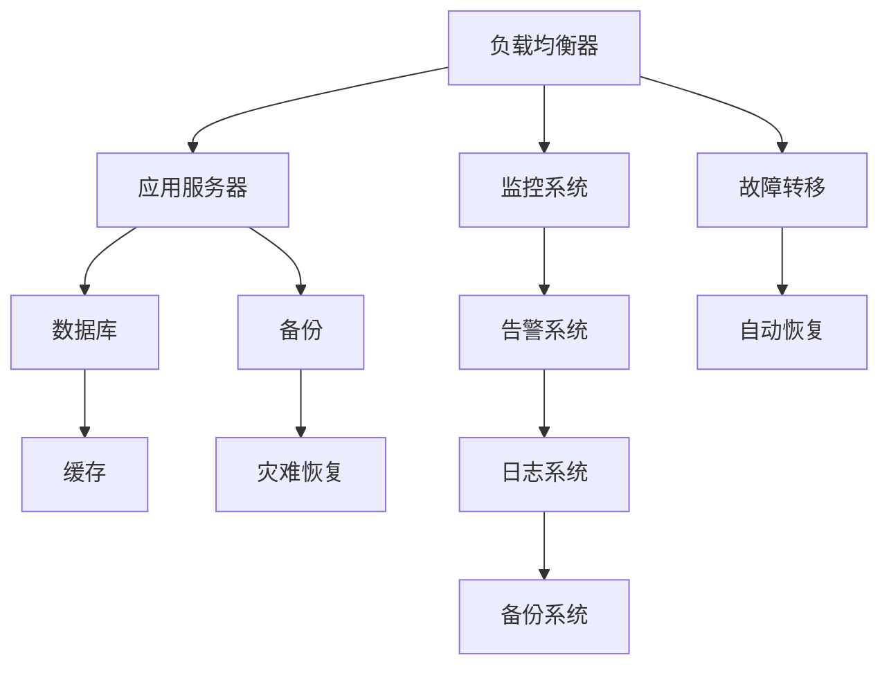

                 

# 高可用性系统设计的实例分析

> 关键词：高可用性, 系统设计, 容错, 故障恢复, 负载均衡, 数据库设计, 云服务, 微服务架构

## 1. 背景介绍

在当今数字化时代，高可用性系统设计已成为各行业信息化建设的基石。无论是在金融、电商、社交媒体还是物联网等领域，系统的稳定运行直接影响着企业的竞争力与用户体验。然而，构建高可用性系统并非易事，需要深刻理解系统的架构设计、性能优化、故障处理等诸多方面。本文将通过实例分析，深入探讨高可用性系统设计的关键要素，提出切实可行的解决方案，为读者提供系统性指导。

## 2. 核心概念与联系

### 2.1 核心概念概述

高可用性（High Availability），简称为HA，是指系统在面对硬件故障、网络中断、软件崩溃等非计划性中断时，能够快速恢复，并保证服务的不间断性。对于高可用性系统的设计，需要从架构、技术、运维等多个层面进行考虑，确保系统在各类情况下都能稳定运行。

### 2.2 核心概念原理和架构的 Mermaid 流程图



在上述图中，负载均衡器（Load Balancer）将请求分散到多个应用服务器（Application Servers）上，以提高系统的吞吐量和稳定性。应用服务器通过缓存（Cache）减少数据库（Database）的访问压力，并通过监控、告警、日志和备份系统保障系统的可靠性和可恢复性。在发生故障时，系统可以通过故障转移（Fault Tolerance）和自动恢复（Auto Recovery）机制快速恢复服务。

## 3. 核心算法原理 & 具体操作步骤

### 3.1 算法原理概述

高可用性系统设计的核心算法主要包括负载均衡、故障转移、自动恢复等。这些算法原理旨在通过合理的系统设计，确保在各类故障场景下，系统能够快速响应并恢复服务。

1. **负载均衡算法**：通过将请求合理地分配到多个节点上，以实现系统的水平扩展。常见的负载均衡算法有轮询（Round Robin）、最少连接（Least Connections）、IP Hash等。
2. **故障转移算法**：在某个节点发生故障时，系统能够自动切换到备份节点或健康节点，以保证服务的连续性。
3. **自动恢复算法**：在系统故障后，能够通过重启、恢复备份等方式快速恢复服务，并尽可能减少对用户的影响。

### 3.2 算法步骤详解

高可用性系统设计的具体操作步骤可以分为以下几个步骤：

1. **系统需求分析**：明确系统的关键业务需求，确定系统的可用性目标（如99.999%的可用性）。
2. **架构设计**：选择合适的技术栈和架构模式（如微服务、分布式系统等），并进行系统划分，确定各个组件的功能和接口。
3. **组件选择与实现**：根据架构设计，选择合适的组件和技术实现各个模块的功能，并进行测试和优化。
4. **性能优化**：通过性能调优、缓存设计、数据库优化等手段，提升系统的响应速度和吞吐量。
5. **故障恢复策略**：设计故障转移和自动恢复策略，确保在系统故障后能够快速恢复服务。
6. **监控与告警**：建立系统监控、告警和日志系统，实时监控系统状态，并在发生异常时及时告警。
7. **备份与灾难恢复**：设计合理的备份和灾难恢复策略，定期进行数据备份和系统演练，确保在发生灾难时能够快速恢复服务。

### 3.3 算法优缺点

**优点**：

1. **高可用性**：通过合理的架构设计和故障恢复机制，系统能够在大规模故障情况下保证服务的不间断性。
2. **扩展性强**：通过负载均衡和横向扩展，系统能够轻松应对高并发流量。
3. **故障隔离**：将不同组件和服务分离，提高系统的稳定性和容错能力。

**缺点**：

1. **复杂度高**：高可用性系统设计涉及多个组件和技术，设计和实施难度较大。
2. **成本高**：需要投入大量资源进行硬件、软件和运维成本的投入。
3. **运维复杂**：系统复杂性增加，运维难度和复杂性也会随之增加。

### 3.4 算法应用领域

高可用性系统设计在各行各业都有广泛应用，如金融、电商、社交媒体、物联网等。在金融领域，高可用性系统设计尤为重要，系统故障可能导致巨额资金损失和客户信任丧失。在电商领域，高可用性系统设计能够保障交易系统的稳定性，提升用户购物体验。在社交媒体领域，高可用性系统设计确保社交平台在面对大规模用户访问时仍能稳定运行。

## 4. 数学模型和公式 & 详细讲解 & 举例说明

### 4.1 数学模型构建

假设系统由多个组件组成，每个组件的可用性概率分别为 $p_1, p_2, \dots, p_n$。系统的总可用性概率 $P$ 可以通过以下公式计算：

$$
P = \prod_{i=1}^{n} (1 - (1 - p_i))
$$

该公式基于串联系统的可用性模型，即系统中所有组件都必须可用，系统才能正常运行。如果系统采用并联模型，则可用性概率计算公式为：

$$
P = 1 - (1 - p_1)(1 - p_2)\dots(1 - p_n)
$$

在实际应用中，常常使用 N+1 架构（N 个可用节点和 1 个备用节点），通过故障转移和自动恢复机制保证系统的高可用性。

### 4.2 公式推导过程

假设系统有 N 个节点，每个节点的故障概率为 $p$。在串联系统中，整个系统的故障概率为：

$$
F = N \cdot p^N
$$

而在并联系统中，系统的故障概率为：

$$
F = 1 - (1 - p)^N
$$

通过上述公式，我们可以推导出在 N+1 架构下，系统的故障概率和可用性概率。

### 4.3 案例分析与讲解

假设一个系统由三个组件组成，每个组件的故障概率为 0.01。在串联系统中，系统的总故障概率为：

$$
F = 3 \cdot 0.01^3 = 0.000003
$$

在并联系统中，系统的总故障概率为：

$$
F = 1 - (1 - 0.01)^3 = 0.027
$$

通过计算可以看出，并联系统的故障概率要远高于串联系统，因此在高可用性设计中，应优先选择并联架构。

## 5. 项目实践：代码实例和详细解释说明

### 5.1 开发环境搭建

在搭建高可用性系统开发环境时，需要考虑以下因素：

1. 选择合适的云服务提供商，如 AWS、Azure、阿里云等，确保能够提供稳定的云服务。
2. 配置合适的云服务器实例，确保足够的计算和存储资源。
3. 安装必要的软件环境，如 Linux、Nginx、MySQL 等。

### 5.2 源代码详细实现

以下是一个基于 Nginx 和 Redis 实现负载均衡和故障转移的示例代码：

```python
import redis
import random

class LoadBalancer:
    def __init__(self, servers, redis_host, redis_port):
        self.servers = servers
        self.redis = redis.StrictRedis(host=redis_host, port=redis_port)
        self healthy_servers = self.get_healthy_servers()
    
    def get_healthy_servers(self):
        return self.redis.smembers('healthy_servers')
    
    def select_server(self):
        server_list = self.servers
        if len(server_list) == 0:
            raise Exception('No server available')
        return random.choice(server_list)
    
    def heartbeat(self, server_id):
        if server_id in self.healthy_servers:
            self.redis.sadd('healthy_servers', server_id)
    
    def server_down(self, server_id):
        if server_id in self.healthy_servers:
            self.redis.srem('healthy_servers', server_id)
    
    def health_check(self):
        server_ids = self.redis.smembers('healthy_servers')
        self.servers = server_ids
```

### 5.3 代码解读与分析

在上述代码中，我们使用 Redis 来存储服务器的健康状态，通过 heartbeat 和 server_down 方法来更新服务器的健康状态。在 load_balancer 类中，通过 select_server 方法从健康服务器中选择一个进行负载均衡。通过 health_check 方法定期检查服务器的健康状态，确保负载均衡的正确性。

### 5.4 运行结果展示

运行上述代码，可以在 Redis 中实时更新服务器的健康状态，通过 Nginx 实现负载均衡。在实际应用中，通过监控系统及时告警，可以确保系统在发生故障后能够快速恢复服务。

## 6. 实际应用场景

### 6.1 电商平台的订单系统

电商平台的高可用性设计尤为重要，订单系统需要保证在面对大规模交易和用户访问时仍能稳定运行。通过负载均衡和故障转移，订单系统能够在单个节点故障时快速切换到备用节点，保障订单交易的连续性和准确性。

### 6.2 金融交易系统

金融交易系统对高可用性要求极高，任何故障都可能导致巨大的经济损失。通过高可用性设计，金融交易系统能够快速恢复服务，保证交易的连续性和安全性。

### 6.3 社交媒体的用户登录系统

社交媒体平台的用户登录系统需要保证在面对大规模用户访问时仍能稳定运行。通过负载均衡和自动恢复，用户登录系统能够在高峰期快速响应用户请求，提升用户体验。

### 6.4 未来应用展望

未来，随着云计算和大数据技术的不断发展，高可用性系统设计将更加注重自动化和智能化。通过机器学习和人工智能技术，系统能够实时预测并处理故障，自动进行备份和恢复，进一步提升系统的可靠性和可用性。

## 7. 工具和资源推荐

### 7.1 学习资源推荐

1. **《高可用性系统设计》**：经典的高可用性系统设计书籍，详细介绍了高可用性系统的设计原理和实践经验。
2. **《微服务架构设计》**：介绍微服务架构设计和实现，适合高可用性系统的设计者和开发者。
3. **《负载均衡理论与实践》**：深入讲解负载均衡的理论基础和实现方法，适合网络工程师和高可用性系统开发者。

### 7.2 开发工具推荐

1. **AWS**：亚马逊云服务，提供全面的云服务解决方案，适合构建高可用性系统。
2. **Kubernetes**：开源容器编排系统，支持大规模的微服务部署和管理。
3. **Nginx**：高性能的 HTTP 和反向代理服务器，适合实现负载均衡和故障转移。
4. **Redis**：高性能的 Key-Value 数据库，适合存储系统的健康状态和缓存数据。

### 7.3 相关论文推荐

1. **《分布式系统的设计原则》**：讲述分布式系统设计的核心原则和实践经验，适合高可用性系统设计者和开发者。
2. **《大数据系统的高可用性设计》**：介绍大数据系统的高可用性设计方法，适合数据工程师和高可用性系统设计者。

## 8. 总结：未来发展趋势与挑战

### 8.1 研究成果总结

高可用性系统设计在过去几十年的发展中，取得了显著的进步。通过合理的架构设计和故障恢复机制，系统能够在大规模故障情况下保障服务的连续性和稳定性。然而，随着技术的不断发展，高可用性系统设计也面临着新的挑战，如云计算和人工智能的普及，带来了新的设计和实现方法。

### 8.2 未来发展趋势

1. **自动化和智能化**：通过机器学习和人工智能技术，系统能够实时预测并处理故障，自动进行备份和恢复，进一步提升系统的可靠性和可用性。
2. **微服务架构**：微服务架构能够提高系统的扩展性和灵活性，适用于大规模高可用性系统。
3. **容器化技术**：容器化技术能够简化高可用性系统的部署和管理，提高系统的稳定性和可扩展性。

### 8.3 面临的挑战

1. **复杂性增加**：随着系统的复杂性增加，设计和实现难度也会随之增加。
2. **成本高昂**：高可用性系统设计需要投入大量资源进行硬件、软件和运维成本的投入。
3. **运维难度增加**：系统复杂性增加，运维难度和复杂性也会随之增加。

### 8.4 研究展望

高可用性系统设计的研究方向包括以下几个方面：

1. **自动化和智能化**：通过机器学习和人工智能技术，系统能够实时预测并处理故障，自动进行备份和恢复，进一步提升系统的可靠性和可用性。
2. **微服务架构**：微服务架构能够提高系统的扩展性和灵活性，适用于大规模高可用性系统。
3. **容器化技术**：容器化技术能够简化高可用性系统的部署和管理，提高系统的稳定性和可扩展性。

通过上述方向的研究和实践，高可用性系统设计必将在未来取得更大的突破，为各行业的数字化转型提供坚实的技术保障。

## 9. 附录：常见问题与解答

### Q1: 如何选择合适的负载均衡算法？

A: 选择负载均衡算法需要考虑系统的特点和需求。例如，轮询算法适合简单的单应用场景，最少连接算法适合高并发场景，IP Hash算法适合避免连接冲突的场景。

### Q2: 高可用性系统设计中的备份和灾难恢复有哪些步骤？

A: 高可用性系统设计中的备份和灾难恢复步骤如下：
1. 数据备份：定期进行数据备份，确保数据的完整性和可用性。
2. 系统备份：对系统配置和应用程序进行备份，确保系统在故障后能够快速恢复。
3. 恢复测试：定期进行系统恢复测试，确保备份数据的可用性。
4. 灾难恢复计划：制定详细的灾难恢复计划，明确故障恢复的步骤和责任人。

### Q3: 如何设计高可用性系统中的故障转移策略？

A: 高可用性系统中的故障转移策略如下：
1. 备份节点的准备：确保备份节点处于可用状态，并具备与生产节点相同的配置。
2. 故障检测：实时监控系统的运行状态，检测故障的发生。
3. 故障转移：在检测到故障后，自动切换到备份节点，保持服务的连续性。
4. 故障通知：在故障发生时，及时通知运维人员，并进行故障分析和修复。

通过上述方法，高可用性系统能够在各类故障场景下快速恢复服务，保障系统的稳定性和可用性。

