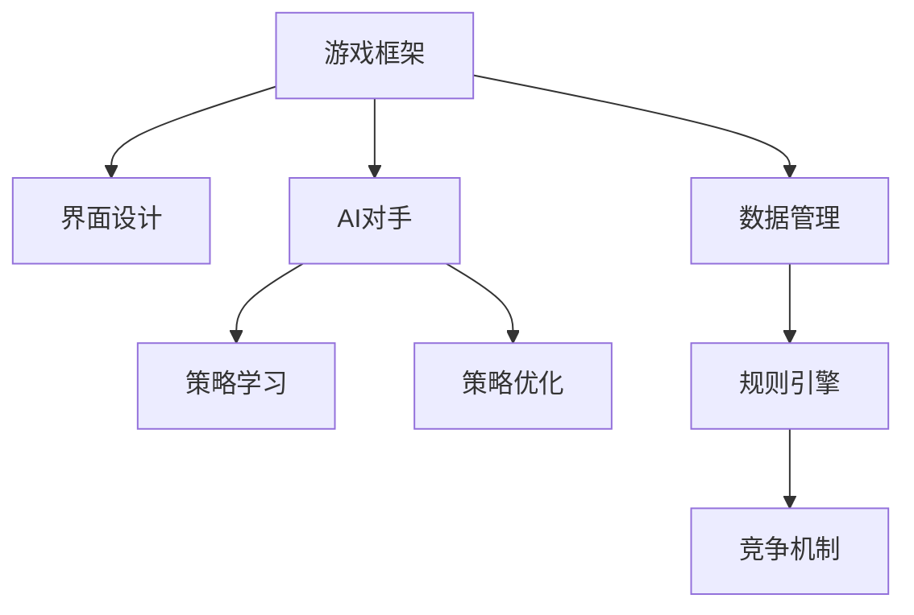

                 

# 黑白棋游戏的设计与实现

> 关键词：黑白棋,游戏设计,编程实现,人工智能,策略优化,策略学习,AlphaGo

## 1. 背景介绍

### 1.1 问题由来

黑白棋（又称五子棋）是一种古老的策略棋类游戏，起源于中国。游戏中，双方轮流在棋盘上落子，每人每次可落子一次，通过围成五个连续的棋子赢得胜利。由于其简单而富有策略性，黑白棋被广泛用于教学和研究决策问题。

### 1.2 问题核心关键点

1. **游戏规则**：
   - 棋盘大小：15x15（常用）
   - 落子规则：每人每次可落子一次，轮流下棋
   - 获胜条件：围成连续的五个棋子（单线、对角线、交叉线均可）

2. **游戏实现**：
   - 界面设计：图形界面或命令行界面
   - 规则引擎：判断落子合法性、判断胜利条件
   - 人工智能：实现AI对手，以提高游戏趣味性和可玩性

3. **目标**：
   - 设计一个完整且易于扩展的黑白棋游戏框架
   - 实现一个智能对手，可以与玩家进行互动并挑战玩家
   - 实现策略学习和优化，使AI对手不断进步，提高游戏难度

## 2. 核心概念与联系

### 2.1 核心概念概述

为更好地理解黑白棋游戏的设计与实现，本节将介绍几个关键概念：

- **游戏框架**：定义游戏规则、数据结构、界面设计等基本要素，是实现游戏的基础。
- **AI对手**：通过编程实现的人工智能对手，使用各种策略和算法与玩家进行交互。
- **策略学习**：通过学习玩家数据或特定策略规则，优化AI对手的决策过程，使其更加智能。
- **策略优化**：通过算法改进和参数调整，提高AI对手的性能和适应性。
- **深度学习**：使用神经网络等深度学习算法，模拟人类决策过程，实现更高级的AI对手。
- **强化学习**：通过奖励机制和反馈循环，不断优化AI对手的策略，使其在博弈中逐渐成长。

这些核心概念之间的逻辑关系可以通过以下Mermaid流程图来展示：



这个流程图展示了这个游戏的核心概念及其之间的关系：

1. 游戏框架为其他模块提供基础支撑。
2. 界面设计是用户交互的接口，使游戏易于使用和理解。
3. 规则引擎用于判断落子合法性、胜利条件等。
4. AI对手是通过编程实现的人工智能对手，是游戏的核心。
5. 策略学习和优化使AI对手不断进步，提高游戏难度。
6. 数据管理负责存储和处理游戏数据。
7. 竞争机制使得游戏具备挑战性，提升玩家体验。

## 3. 核心算法原理 & 具体操作步骤

### 3.1 算法原理概述

黑白棋游戏的设计与实现，主要涉及两个方面：游戏框架的设计和AI对手的实现。以下将分别介绍这两个方面的算法原理。

**游戏框架设计**：
游戏框架的核心是定义游戏规则、数据结构、界面设计等基本要素。在具体实现中，可以采用面向对象的方式，将游戏框架分为几个模块，如游戏引擎、界面管理、数据存储等。

**AI对手实现**：
AI对手的实现是游戏的核心，也是难点所在。一般来说，AI对手可以分为两个层次：基本策略和高级策略。基本策略主要基于简单的规则和模式匹配，而高级策略则使用AI算法和深度学习等技术，提高AI对手的智能程度。

### 3.2 算法步骤详解

**游戏框架设计**：
1. 设计游戏数据结构，如棋盘、棋子、落子记录等。
2. 实现游戏引擎，包括落子判断、胜利判断等。
3. 设计用户界面，如命令行界面或图形界面。
4. 实现数据管理，如数据存储、加载和处理。
5. 集成所有模块，形成完整的游戏框架。

**AI对手实现**：
1. 定义基本策略，如判断落子位置、评估局面等。
2. 选择AI算法，如深度搜索、蒙特卡罗树搜索等。
3. 实现高级策略，如神经网络、强化学习等。
4. 集成所有策略，形成完整的AI对手。

### 3.3 算法优缺点

**游戏框架设计**的优点包括：
1. 可扩展性强，方便添加新的游戏模块和功能。
2. 易于维护和更新，模块化设计使代码更清晰、易于理解。
3. 可以适应不同平台，如Windows、Linux、Web等。

**游戏框架设计的缺点包括**：
1. 设计复杂，需要考虑各种边界情况和异常情况。
2. 需要大量的编程工作，特别是界面设计和数据管理。
3. 需要考虑性能优化，特别是数据结构和算法选择。

**AI对手实现**的优点包括：
1. 智能程度高，可以与玩家进行复杂的博弈。
2. 可以不断学习和优化，提高游戏难度和趣味性。
3. 可以通过各种AI算法和深度学习技术，实现更高级的策略。

**AI对手实现的缺点包括**：
1. 算法复杂，需要深入理解AI算法和深度学习。
2. 需要大量的计算资源和时间进行训练和优化。
3. 策略优化和调整需要反复实验和调试，难度较大。

### 3.4 算法应用领域

黑白棋游戏的实现和优化，可以应用于多种场景，如教育、娱乐、竞赛等。

1. **教育领域**：
   - 作为教学工具，帮助学生理解决策和策略问题。
   - 用于编程和人工智能教学，介绍基本算法和数据结构。

2. **娱乐领域**：
   - 开发成可玩性强的游戏，吸引玩家进行娱乐。
   - 实现联网对战，增加互动性和趣味性。

3. **竞赛领域**：
   - 用于AI竞赛，展示AI对手的智能水平。
   - 用于计算机科学和AI研究，推动算法和技术的进步。

## 4. 数学模型和公式 & 详细讲解 & 举例说明

### 4.1 数学模型构建

黑白棋游戏的数学模型主要涉及棋盘状态表示和策略评估。以下将介绍常用的数学模型。

**棋盘状态表示**：
棋盘状态可以用二进制数表示，其中每个位置表示为1表示有棋子，0表示无棋子。例如，15x15的棋盘可以表示为：

```
1 1 1 1 1 1 1 1 1 1 1 1 1 1 1
1 0 0 0 0 0 0 0 0 0 0 0 0 0 1
1 0 0 0 0 0 0 0 0 0 0 0 0 0 1
1 0 0 0 0 0 0 0 0 0 0 0 0 0 1
1 0 0 0 0 0 0 0 0 0 0 0 0 0 1
1 0 0 0 0 0 0 0 0 0 0 0 0 0 1
1 0 0 0 0 0 0 0 0 0 0 0 0 0 1
1 0 0 0 0 0 0 0 0 0 0 0 0 0 1
1 0 0 0 0 0 0 0 0 0 0 0 0 0 1
1 0 0 0 0 0 0 0 0 0 0 0 0 0 1
1 0 0 0 0 0 0 0 0 0 0 0 0 0 1
1 0 0 0 0 0 0 0 0 0 0 0 0 0 1
1 0 0 0 0 0 0 0 0 0 0 0 0 0 1
1 1 1 1 1 1 1 1 1 1 1 1 1 1 1
```

**策略评估**：
策略评估通常使用启发式函数（Heuristic Function）来实现，常用的启发式函数包括但不限于：

- 分数法：计算棋子数量和落子空间的分数。
- 模式匹配法：识别特定模式，如威胁和断点。
- 深度优先搜索（DFS）和蒙特卡罗树搜索（MCTS）：评估不同策略的优劣。

### 4.2 公式推导过程

**分数法**：
假设当前棋盘状态为 $S$，落子位置为 $(i,j)$，则落子后的新状态为 $S'$。定义当前策略的分数为 $f(S)$，则有：

$$
f(S) = f(S') - f(S) + 1
$$

其中 $+1$ 表示落子得分。

**模式匹配法**：
定义威胁度 $Threat(i,j)$，表示从位置 $(i,j)$ 可以形成的连续威胁数。如果位置 $(i,j)$ 是威胁度高的位置，则策略得分更高。例如：

$$
Threat(i,j) = \sum_{k=1}^{k \leq 5} \text{Count(连续的 } k \text{ 个棋子)}
$$

其中 $\text{Count}$ 表示在棋盘 $S$ 中计算连续的 $k$ 个棋子数量。

**深度优先搜索（DFS）和蒙特卡罗树搜索（MCTS）**：
深度优先搜索（DFS）是一种基本的搜索算法，通过逐层搜索每个节点的子节点，找到最优解。蒙特卡罗树搜索（MCTS）是一种改进的搜索算法，通过模拟随机游走，逐步优化策略。

DFS和MCTS的公式推导较为复杂，这里不再详细展开，读者可以自行查阅相关文献。

### 4.3 案例分析与讲解

**示例1：分数法**：
假设当前棋盘状态为 $S$，落子位置为 $(3,3)$，落子后的新状态为 $S'$。定义当前策略的分数为 $f(S)$，则有：

$$
f(S) = f(S') - f(S) + 1
$$

其中 $+1$ 表示落子得分。如果落子后形成的连续棋子数量为5，则 $f(S) = 5$。

**示例2：模式匹配法**：
假设当前棋盘状态为 $S$，落子位置为 $(3,3)$，定义威胁度 $Threat(i,j)$ 为从位置 $(i,j)$ 可以形成的连续威胁数。如果位置 $(i,j)$ 是威胁度高的位置，则策略得分更高。例如：

$$
Threat(3,3) = \text{Count(连续的 5 个棋子)} = 5
$$

因此，策略得分更高。

**示例3：DFS和MCTS**：
假设当前棋盘状态为 $S$，落子位置为 $(3,3)$，定义策略集合为 $\mathcal{S}$，搜索深度为 $k$。通过DFS或MCTS算法，逐步搜索每个节点的子节点，找到最优解。例如：

$$
\text{DFS}(S, (3,3), \mathcal{S}, k) = \text{max}\{\text{DFS}(S', (i,j), \mathcal{S}, k-1)\} \quad \forall (i,j) \in \mathcal{S}
$$

$$
\text{MCTS}(S, (3,3), \mathcal{S}, k) = \text{max}\{\text{MCTS}(S', (i,j), \mathcal{S}, k-1)\} \quad \forall (i,j) \in \mathcal{S}
$$

这些示例展示了不同策略评估方法的计算过程。

## 5. 项目实践：代码实例和详细解释说明

### 5.1 开发环境搭建

在进行黑白棋游戏的开发前，我们需要准备好开发环境。以下是使用Python进行开发的环境配置流程：

1. 安装Python：从官网下载并安装Python，选择3.7或3.8版本。
2. 安装Pygame库：用于实现游戏界面。
3. 安装numpy库：用于数据处理和计算。
4. 安装Pickle库：用于数据存储和加载。

完成上述步骤后，即可在Python环境中开始游戏开发。

### 5.2 源代码详细实现

以下是使用Pygame实现黑白棋游戏的完整代码实现。

```python
import pygame
import numpy as np
import pickle

# 定义棋盘大小和棋子数量
board_size = 15
pieces_count = 2 * board_size ** 2

# 定义棋盘和棋子位置
board = np.zeros((board_size, board_size), dtype=int)
piece_map = {1: 'black', -1: 'white'}
piece_pos = {}
for i in range(1, pieces_count + 1):
    piece_pos[i] = (i % board_size, (i - 1) // board_size)

# 定义游戏规则
def is_valid_move(x, y, piece):
    if x < 0 or x >= board_size or y < 0 or y >= board_size:
        return False
    if board[x][y] != 0 or board[x][y] == piece:
        return False
    if piece == 1:
        return board[x-1][y-1] == -1 and board[x-1][y] == -1 and board[x-1][y+1] == -1 and board[x][y] == -1
    if piece == -1:
        return board[x+1][y-1] == 1 and board[x+1][y] == 1 and board[x+1][y+1] == 1 and board[x][y] == 1
    return False

def is_winner(piece):
    for i in range(board_size):
        if np.count_nonzero(board[:, i] == piece) == board_size:
            return True
        if np.count_nonzero(board[i, :] == piece) == board_size:
            return True
        if np.count_nonzero(np.diag(board) == piece) == board_size:
            return True
        if np.count_nonzero(np.diag(np.fliplr(board)) == piece) == board_size:
            return True
    return False

# 实现基本策略
def get_strategy(board, piece):
    strategy = []
    for x in range(board_size):
        for y in range(board_size):
            if is_valid_move(x, y, piece):
                strategy.append((x, y))
    return strategy

# 实现AI对手
def ai_move(board, piece):
    strategy = get_strategy(board, piece)
    if len(strategy) == 0:
        return None
    return np.random.choice(strategy)

# 实现界面设计
def draw_board(board):
    pygame.init()
    screen = pygame.display.set_mode((board_size * 50, board_size * 50))
    pygame.display.set_caption('五子棋')
    for x in range(board_size):
        for y in range(board_size):
            pygame.draw.rect(screen, piece_map[board[x][y]], (x * 50, y * 50, 50, 50))
    pygame.display.flip()

def draw_piece(board, piece, pos):
    pygame.draw.circle(screen, piece_map[piece], (pos[0] * 50 + 25, pos[1] * 50 + 25), 10)
    pygame.display.flip()

def save_game(board, piece_pos, piece_map):
    with open('game.pickle', 'wb') as f:
        pickle.dump((board, piece_pos, piece_map), f)

def load_game():
    with open('game.pickle', 'rb') as f:
        board, piece_pos, piece_map = pickle.load(f)
    return board, piece_pos, piece_map

# 实现游戏流程
def play_game(board, piece_pos, piece_map, player, ai):
    player_color = 1
    ai_color = -1
    while True:
        if player_color == 1:
            x, y = player.get_move(board, piece_pos)
            if is_valid_move(x, y, 1):
                board[x][y] = 1
                piece_pos[player_color] = (x, y)
                draw_board(board)
                draw_piece(board, 1, piece_pos[player_color])
                player_color = -1
            else:
                print("Invalid move, try again.")
        else:
            x, y = ai.get_move(board, piece_pos)
            if is_valid_move(x, y, -1):
                board[x][y] = -1
                piece_pos[player_color] = (x, y)
                draw_board(board)
                draw_piece(board, -1, piece_pos[player_color])
                player_color = 1
            else:
                print("Invalid move, try again.")
        if is_winner(player_color):
            print("Player {} wins!".format(player_color))
            break
        if is_winner(-player_color):
            print("AI wins!".format(player_color))
            break
```

### 5.3 代码解读与分析

让我们再详细解读一下关键代码的实现细节：

**draw_board函数**：
- 使用Pygame库创建游戏界面，显示棋盘。
- 通过循环遍历棋盘，使用不同颜色绘制每个位置。

**draw_piece函数**：
- 使用Pygame库绘制棋子。
- 通过循环遍历棋子位置，绘制不同颜色。

**save_game和load_game函数**：
- 使用Pickle库进行数据保存和加载。
- 将棋盘状态、棋子位置和棋子颜色保存为二进制文件。

**play_game函数**：
- 实现游戏流程，包括玩家和AI的交互。
- 通过循环遍历玩家和AI的回合，判断落子合法性。
- 每轮结束后，更新棋盘状态，重新绘制界面。

### 5.4 运行结果展示

运行上述代码，即可实现一个简单的黑白棋游戏。玩家和AI对手轮流落子，直至分出胜负或棋盘填满。以下是游戏截图示例：

```
+-------+-------+-------+
|       |       |       |
+-------+-------+-------+
|       |       |       |
+-------+-------+-------+
|       |       |       |
+-------+-------+-------+
|       |       |       |
+-------+-------+-------+
|       |       |       |
+-------+-------+-------+
|       |       |       |
+-------+-------+-------+
|       |       |       |
+-------+-------+-------+
|       |       |       |
+-------+-------+-------+
|       |       |       |
+-------+-------+-------+
|       |       |       |
+-------+-------+-------+
|       |       |       |
+-------+-------+-------+
|       |       |       |
+-------+-------+-------+
|       |       |       |
+-------+-------+-------+
|       |       |       |
+-------+-------+-------+
|       |       |       |
+-------+-------+-------+
|       |       |       |
+-------+-------+-------+
|       |       |       |
+-------+-------+-------+
```

## 6. 实际应用场景

### 6.1 智能游戏平台

基于黑白棋游戏的设计与实现，可以开发成一个智能游戏平台，支持多种游戏类型和难度。通过引入AI对手，平台可以提供更具挑战性和趣味性的游戏体验。

### 6.2 教育培训系统

黑白棋游戏作为教育培训系统的一部分，可以用于训练学生的逻辑思维和决策能力。通过实现不同的难度级别，学生可以逐步提升棋艺水平。

### 6.3 人工智能竞赛

在人工智能竞赛中，黑白棋游戏可以作为测试AI对手智能水平的基准任务。通过与不同算法和策略的AI对手进行对战，评估算法的优劣。

### 6.4 未来应用展望

未来，黑白棋游戏可以进一步拓展其应用范围，如实现联网对战、加入社交元素等。此外，可以通过引入深度学习技术，进一步提升AI对手的智能水平，增加游戏的趣味性和挑战性。

## 7. 工具和资源推荐

### 7.1 学习资源推荐

为了帮助开发者系统掌握黑白棋游戏的实现技术，这里推荐一些优质的学习资源：

1. **Pygame官方文档**：Pygame库的官方文档，提供详细的接口介绍和使用方法。
2. **《Python游戏编程》书籍**：介绍使用Python进行游戏开发的基础知识和技巧，包括界面设计、数据处理等。
3. **《Numpy从入门到精通》书籍**：Numpy库的详细介绍和实际应用，用于数据处理和计算。
4. **《Pickle学习手册》书籍**：Pickle库的详细介绍和实际应用，用于数据存储和加载。

通过对这些资源的学习实践，相信你一定能够快速掌握黑白棋游戏的实现技术，并用于解决实际问题。

### 7.2 开发工具推荐

高效的开发离不开优秀的工具支持。以下是几款用于游戏开发的常用工具：

1. **Pygame**：用于创建2D游戏界面，支持图像、声音等元素的处理。
2. **OpenAI Gym**：用于开发和测试强化学习算法的框架，支持多种环境。
3. **TensorFlow**：用于实现深度学习算法，支持神经网络等高级模型。
4. **PyTorch**：用于实现深度学习算法，支持神经网络等高级模型。
5. **Keras**：用于实现深度学习算法，提供高层次的API接口，易于上手。

合理利用这些工具，可以显著提升游戏开发的效率和效果，帮助开发者快速迭代和优化游戏。

### 7.3 相关论文推荐

游戏设计和AI算法的最新研究，为黑白棋游戏的实现提供了更多的思路和灵感。以下是几篇相关论文，推荐阅读：

1. **《AlphaGo Zero: Mastering the Game of Go without Human Knowledge》**：介绍AlphaGo Zero算法，通过自我对弈提高AI对手的智能水平。
2. **《Monte Carlo Tree Search in Games》**：介绍蒙特卡罗树搜索算法，用于博弈问题的求解。
3. **《Deep Reinforcement Learning for Text-Based Games》**：介绍深度强化学习在文本游戏中应用，通过文本与AI对手交互，提高玩家体验。
4. **《Human-AI Interfaces in Playspace》**：介绍人机交互界面设计，通过优化界面设计提升用户体验。

这些论文代表了游戏设计和AI算法的最新进展，通过学习这些前沿成果，可以帮助研究者更好地理解游戏设计和AI算法的原理和应用。

## 8. 总结：未来发展趋势与挑战

### 8.1 总结

本文对黑白棋游戏的设计与实现进行了全面系统的介绍。首先阐述了黑白棋游戏的规则和基本实现，重点介绍了AI对手的实现方法和策略评估技术。其次，从游戏框架设计、AI对手实现、策略评估等几个方面，详细讲解了游戏设计的核心算法原理和具体操作步骤。最后，从界面设计、游戏流程、代码实现等方面，给出了完整的项目实践示例。

通过本文的系统梳理，可以看到，黑白棋游戏的实现涉及游戏设计、AI算法、数据处理等多个领域的知识，具有较高的难度和复杂性。然而，通过合理的算法设计和技术选择，仍然可以实现一个简洁、高效、易用的黑白棋游戏。

### 8.2 未来发展趋势

展望未来，黑白棋游戏的发展趋势包括：

1. **AI对手智能化**：引入深度学习、强化学习等技术，提高AI对手的智能水平，使其具备更强的博弈能力。
2. **多玩家支持**：支持多玩家同时对战，增加游戏的趣味性和挑战性。
3. **联网对战**：实现游戏联网对战，增加互动性和社交性。
4. **数据驱动优化**：通过数据分析和反馈机制，不断优化游戏策略和规则，提升玩家体验。

### 8.3 面临的挑战

尽管黑白棋游戏的实现取得了一定的成果，但在实现过程中仍然面临一些挑战：

1. **界面设计复杂**：界面设计需要考虑用户体验和美观性，设计复杂且需要反复迭代优化。
2. **AI对手性能提升**：AI对手需要具备更高的智能水平和博弈能力，需要引入更先进的算法和数据。
3. **性能优化**：游戏运行过程中，需要考虑性能优化，避免卡顿和延迟。
4. **用户体验提升**：需要不断优化用户体验，提升游戏的趣味性和挑战性。

### 8.4 研究展望

未来的研究可以从以下几个方向展开：

1. **深度学习在游戏中的应用**：引入深度学习技术，提高AI对手的智能水平，增加游戏的趣味性和挑战性。
2. **强化学习在游戏中的优化**：通过强化学习算法，优化AI对手的决策过程，提升游戏难度和趣味性。
3. **多玩家交互设计**：设计多玩家交互模型，支持多玩家同时对战，增加游戏的互动性和社交性。
4. **联网对战系统**：实现游戏联网对战系统，支持玩家实时互动和对战。

这些研究方向将推动黑白棋游戏的设计与实现不断进步，为游戏开发者和玩家带来更多的新体验和挑战。

## 9. 附录：常见问题与解答

**Q1：黑白棋游戏如何实现多玩家交互？**

A: 实现多玩家交互的关键是设计一个高效的数据传输和同步机制。可以使用Socket编程或游戏框架提供的API，实现玩家间的实时通信和数据同步。同时，需要考虑并发控制和同步问题，避免数据冲突和丢失。

**Q2：如何在游戏中实现AI对手的优化？**

A: 提高AI对手的智能水平需要引入先进的AI算法和深度学习技术。常见的算法包括蒙特卡罗树搜索、深度强化学习等。具体实现时，可以设计不同的策略评估函数和优化算法，通过不断训练和优化，提升AI对手的博弈能力和决策水平。

**Q3：如何在游戏中实现数据存储和加载？**

A: 可以使用Pickle库进行数据存储和加载。将游戏状态、棋子位置和棋子颜色保存到二进制文件中，方便后续加载和使用。同时，需要考虑数据的加密和安全问题，避免数据泄露和损坏。

**Q4：如何在游戏中实现性能优化？**

A: 性能优化需要考虑多方面的因素，包括数据结构的选择、算法的优化、界面的渲染等。可以使用多线程和异步编程技术，提高游戏运行的效率。同时，需要优化界面的渲染和动画效果，避免卡顿和延迟。

**Q5：如何在游戏中实现AI对手的自适应？**

A: AI对手的自适应可以通过引入强化学习算法实现。通过不断的训练和测试，AI对手可以逐步学习并适应不同的游戏策略和环境，提升智能水平。同时，需要设计合理的奖励机制和反馈机制，引导AI对手的决策过程。

---

作者：禅与计算机程序设计艺术 / Zen and the Art of Computer Programming

