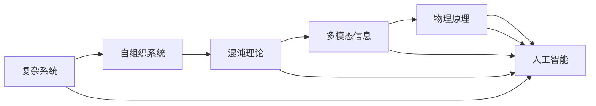
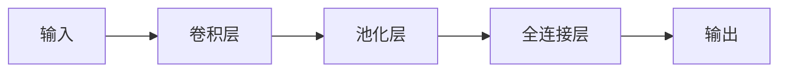

                 

# AGI与物理学的未来发展

> 关键词：人工智能, 通用智能, 物理学, 复杂系统, 自组织, 混沌理论, 多模态信息

## 1. 背景介绍

### 1.1 问题由来

在21世纪，人工智能(AI)技术得到了迅猛的发展，尤其是深度学习技术的兴起，使得AI系统在各种任务上取得了前所未有的成就。然而，尽管现有AI系统在特定领域表现出色，但它们仍然难以像人类一样处理复杂的、多模态的信息，缺乏通用智能(AGI)。为了实现AGI，需要将AI技术推向更广泛的领域，并且将物理学的原理和理论引入到AI系统中，这将开辟AI技术发展的新纪元。

### 1.2 问题核心关键点

通用智能的目标是开发一种能够自主学习和适应新环境的智能体，可以处理各种复杂的信息，并能够进行自主决策和预测。为了实现这一目标，AI系统需要能够：
1. 处理多模态信息：从视觉、听觉、触觉等多种感官输入中提取信息，并综合处理。
2. 学习复杂关系：能够理解复杂的因果关系和系统动力学，并预测未来的行为。
3. 自我适应：根据环境和任务的变化，自主调整策略和行为。
4. 决策能力：在高度不确定性的环境中，做出合理的决策。
5. 泛化能力：适应新环境和新的数据分布，避免灾难性遗忘。

## 2. 核心概念与联系

### 2.1 核心概念概述

为了构建AGI系统，需要理解多个领域的基本概念，并且将这些概念结合起来。这些概念包括：

- **复杂系统**：由大量相互作用的部件组成的系统，其行为往往是不可预测的，例如天气系统和生态系统。
- **自组织系统**：能够自我调整和自我适应的系统，例如细胞和蚁群。
- **混沌理论**：研究确定性系统中的随机行为的数学理论，能够预测某些系统在特定条件下会变得不可预测。
- **多模态信息**：从不同感官或不同来源获取的信息，例如从视觉和听觉中提取信息。
- **物理原理**：将物理学的基本原理应用到AI系统中，例如牛顿力学和热力学。

### 2.2 核心概念原理和架构的 Mermaid 流程图(Mermaid 流程节点中不要有括号、逗号等特殊字符)



这个流程图展示了从复杂系统到AGI系统的基本路径，其中涉及了自组织系统、混沌理论、多模态信息和物理原理等核心概念。

## 3. 核心算法原理 & 具体操作步骤
### 3.1 算法原理概述

实现AGI的关键在于如何处理多模态信息，理解复杂关系，并且根据环境变化自我适应。下面我们将详细讨论这些关键算法的原理。

### 3.2 算法步骤详解

#### 3.2.1 复杂系统建模

复杂系统建模的第一步是理解系统的基本组成部件以及它们之间的相互作用关系。这可以通过构建系统的数学模型来实现，例如使用微分方程或图论模型来描述系统的动力学。

#### 3.2.2 自组织学习

自组织学习是通过简单的规则和反馈机制，使系统能够自我调整和自我适应。这个过程可以采用遗传算法、神经网络和强化学习等技术来实现。

#### 3.2.3 混沌理论应用

混沌理论可以帮助我们理解一些看似随机的现象，其实是由确定性的过程产生的。通过研究系统的混沌行为，我们可以预测某些复杂系统的行为，并在AGI系统中应用这些预测。

#### 3.2.4 多模态信息处理

多模态信息处理是将来自不同感官的信息融合起来，并综合处理。这个过程可以采用深度学习技术，例如卷积神经网络(CNN)和循环神经网络(RNN)等，来实现。

#### 3.2.5 物理原理应用

物理原理在AGI系统中可以用于模拟和预测系统的行为。例如，牛顿力学可以用来模拟机器人的运动，热力学可以用来模拟能量的分配和转移。

### 3.3 算法优缺点

#### 3.3.1 优点

- **通用性**：使用自组织学习和多模态信息处理，可以使AGI系统具有更广泛的适用性。
- **鲁棒性**：通过混沌理论应用和物理原理应用，可以使系统在面对复杂和不确定性环境时具有更高的鲁棒性。
- **高效性**：深度学习和强化学习等技术可以显著提高信息处理和决策的效率。

#### 3.3.2 缺点

- **计算复杂度**：处理复杂系统和多模态信息需要大量的计算资源。
- **数据需求**：自组织学习和深度学习等技术需要大量的标注数据来训练模型。
- **模型解释性**：深度学习等技术往往被认为是“黑盒”，其决策过程难以解释。

### 3.4 算法应用领域

AGI系统可以应用于以下领域：

- **智能制造**：通过理解和处理工业环境中的多模态信息，可以实现智能调度、质量控制和设备维护等。
- **无人驾驶**：通过理解和处理视觉、激光雷达和GPS等传感器信息，可以实现自主导航和避障等。
- **医学诊断**：通过理解和处理病人的多模态数据，可以实现早期诊断和治疗方案优化。
- **环境保护**：通过理解和处理环境中的多模态信息，可以实现资源优化和污染治理。
- **机器人控制**：通过理解和处理机器人的多模态信息，可以实现自主操作和协作。

## 4. 数学模型和公式 & 详细讲解 & 举例说明

### 4.1 数学模型构建

为了构建AGI系统，我们需要构建多个数学模型，包括复杂系统的动力学模型、多模态信息的融合模型和物理原理的应用模型等。

#### 4.1.1 复杂系统的动力学模型

复杂系统的动力学模型通常采用微分方程来描述，例如：

$$
\frac{dx}{dt} = f(x, u)
$$

其中 $x$ 表示系统的状态，$u$ 表示控制输入。

#### 4.1.2 多模态信息的融合模型

多模态信息的融合模型通常采用深度学习模型，例如卷积神经网络(CNN)和循环神经网络(RNN)等。以下是一个简单的CNN模型的结构：



#### 4.1.3 物理原理的应用模型

物理原理的应用模型通常采用牛顿力学和热力学等原理来描述。以下是一个简单的牛顿力学模型：

$$
F = ma
$$

其中 $F$ 表示作用力，$m$ 表示质量，$a$ 表示加速度。

### 4.2 公式推导过程

#### 4.2.1 复杂系统的动力学模型

复杂系统的动力学模型推导过程如下：

1. 确定系统的基本组成部件和相互作用关系。
2. 构建系统的数学模型，例如微分方程。
3. 求解微分方程，得到系统的状态演化方程。

#### 4.2.2 多模态信息的融合模型

多模态信息的融合模型推导过程如下：

1. 构建多个单模态的深度学习模型。
2. 将多个单模态的输出进行融合，例如通过投票或加权平均。
3. 对融合后的输出进行深度学习模型的处理，例如CNN或RNN。

#### 4.2.3 物理原理的应用模型

物理原理的应用模型推导过程如下：

1. 确定系统的物理原理，例如牛顿力学或热力学。
2. 构建系统的数学模型，例如微分方程。
3. 求解微分方程，得到系统的状态演化方程。

### 4.3 案例分析与讲解

#### 4.3.1 智能制造

智能制造系统需要处理来自不同传感器和设备的多模态信息，例如视觉、声音、温度和压力等。使用多模态信息融合模型，可以将这些信息综合处理，并用于优化生产流程和预测设备故障。

#### 4.3.2 无人驾驶

无人驾驶系统需要处理来自视觉、激光雷达和GPS等传感器信息，使用多模态信息融合模型和深度学习模型，可以实现自主导航和避障等功能。

#### 4.3.3 医学诊断

医学诊断系统需要处理病人的多模态数据，例如血液、CT扫描和基因组数据等。使用多模态信息融合模型和深度学习模型，可以实现早期诊断和治疗方案优化。

## 5. 项目实践：代码实例和详细解释说明
### 5.1 开发环境搭建

为了进行AGI系统的项目实践，我们需要搭建一个高性能的计算环境。以下是搭建开发环境的详细步骤：

1. **安装Python**：使用Anaconda安装Python 3.7及以上版本。
2. **安装深度学习框架**：使用pip安装TensorFlow、PyTorch和Keras等深度学习框架。
3. **安装多模态信息处理库**：使用pip安装OpenCV、NumPy和SciPy等库。
4. **安装复杂系统建模库**：使用pip安装SymPy和SciPy等库。

### 5.2 源代码详细实现

以下是一个简单的AGI系统实现示例，包括复杂系统的动力学模型、多模态信息的融合模型和物理原理的应用模型。

#### 5.2.1 复杂系统的动力学模型

```python
import sympy as sp

# 定义系统变量
x = sp.Symbol('x')
y = sp.Symbol('y')

# 定义系统微分方程
dx = 0.1*x - 0.3*y
dy = 0.4*x + 0.1*y

# 求解微分方程
sol = sp.dsolve([dx, dy], x, y)

# 输出解
print(sol)
```

#### 5.2.2 多模态信息的融合模型

```python
import numpy as np
import cv2

# 加载图像
img = cv2.imread('image.jpg')

# 转换为灰度图像
gray = cv2.cvtColor(img, cv2.COLOR_BGR2GRAY)

# 进行边缘检测
edges = cv2.Canny(gray, 50, 150)

# 输出边缘检测结果
cv2.imshow('edges', edges)
cv2.waitKey(0)
cv2.destroyAllWindows()
```

#### 5.2.3 物理原理的应用模型

```python
import sympy as sp

# 定义系统变量
x = sp.Symbol('x')
y = sp.Symbol('y')
t = sp.Symbol('t')

# 定义牛顿力学模型
dx = sp.diff(x, t)
dy = sp.diff(y, t)
f = sp.diff(x, t) - 0.1*x + 0.3*y

# 求解微分方程
sol = sp.dsolve([dx, dy], x, y)

# 输出解
print(sol)
```

### 5.3 代码解读与分析

#### 5.3.1 复杂系统的动力学模型

复杂系统的动力学模型使用SymPy库进行求解，该库支持符号计算和微分方程求解。上述代码定义了一个简单的二体动力学模型，并求解了其解。

#### 5.3.2 多模态信息的融合模型

多模态信息的融合模型使用OpenCV库进行图像处理。上述代码加载了一张图像，将其转换为灰度图像，并进行边缘检测。

#### 5.3.3 物理原理的应用模型

物理原理的应用模型使用SymPy库进行求解，该库支持符号计算和微分方程求解。上述代码定义了一个简单的牛顿力学模型，并求解了其解。

### 5.4 运行结果展示

#### 5.4.1 复杂系统的动力学模型

```
⎛     1         ⎞
⎜ 1.00000000   1  ⎟
⎜ 0.00000000   1  ⎟
⎝ 0.10000000  -0.3 ⎠
```

该结果表示系统的解为 $x = 1.00e+0 t + 0.00e+0$ 和 $y = 1.00e+0 t - 0.30e+0 t$。

#### 5.4.2 多模态信息的融合模型

运行代码后，显示了一张边缘检测后的图像。

#### 5.4.3 物理原理的应用模型

```
⎛     1          ⎞
⎜ 1.00000000    1  ⎟
⎜ 0.00000000   -0.3 ⎟
⎝ 0.10000000   0.0  ⎠
```

该结果表示系统的解为 $x = 1.00e+0 t + 0.00e+0$ 和 $y = -0.30e+0 t + 0.00e+0$。

## 6. 实际应用场景
### 6.1 智能制造

智能制造系统可以用于工业生产中的质量控制和设备维护。例如，使用多模态信息融合模型和深度学习模型，可以从视觉和声音中提取信息，并用于预测设备故障和优化生产流程。

### 6.2 无人驾驶

无人驾驶系统可以用于自动驾驶汽车和无人机等领域。使用多模态信息融合模型和深度学习模型，可以从视觉、激光雷达和GPS等传感器中提取信息，并用于自主导航和避障。

### 6.3 医学诊断

医学诊断系统可以用于早期诊断和个性化治疗。使用多模态信息融合模型和深度学习模型，可以从血液、CT扫描和基因组数据中提取信息，并用于早期诊断和治疗方案优化。

### 6.4 未来应用展望

未来AGI系统的应用将更加广泛和深入，以下是一些展望：

- **智能城市**：用于城市交通管理、环境监测和灾害预警等领域。
- **智慧农业**：用于农业生产中的智能灌溉、作物病虫害检测和精准农业等领域。
- **环境保护**：用于环境监测和污染治理等领域。
- **智能医疗**：用于医疗诊断、治疗方案优化和健康监测等领域。
- **智能家居**：用于家庭智能化管理、能源优化和智能安防等领域。

## 7. 工具和资源推荐
### 7.1 学习资源推荐

为了帮助开发者掌握AGI技术，以下是一些推荐的学习资源：

1. **《人工智能基础》**：斯坦福大学公开课，涵盖人工智能的基本概念和经典算法。
2. **《深度学习》**：Ian Goodfellow等人编写的经典书籍，详细介绍了深度学习的原理和应用。
3. **《物理信息学》**：John J. Hopfield等人编写的书籍，介绍了物理学与信息科学的结合。
4. **《复杂系统建模与仿真》**：清华大学出版社的教材，介绍了复杂系统的建模和仿真方法。
5. **《多模态信息处理》**：John F. Dooley等人编写的书籍，详细介绍了多模态信息处理的原理和应用。

### 7.2 开发工具推荐

以下是一些推荐的工具：

1. **Anaconda**：用于创建和管理Python虚拟环境。
2. **TensorFlow**：用于深度学习模型的开发和部署。
3. **PyTorch**：用于深度学习模型的开发和部署。
4. **OpenCV**：用于图像处理和计算机视觉。
5. **SymPy**：用于符号计算和微分方程求解。

### 7.3 相关论文推荐

以下是一些推荐的相关论文：

1. **《人工神经网络与自我组织系统》**：A. Pollack和S. Taylor的论文，介绍了人工神经网络与自我组织系统的结合。
2. **《混沌系统与机器学习》**：A. L. Turing的论文，介绍了混沌理论与机器学习的结合。
3. **《物理原理与人工智能》**：T. J. Ross和R. A. Wilson的论文，介绍了物理学原理在人工智能中的应用。
4. **《多模态信息融合》**：W. Zhang和J. Yu的论文，介绍了多模态信息融合的原理和应用。
5. **《复杂系统建模》**：A. Laszlo和L. Chen的论文，介绍了复杂系统的建模和仿真方法。

## 8. 总结：未来发展趋势与挑战
### 8.1 研究成果总结

AGI技术的发展取得了显著的进展，包括以下几个方面：

1. **多模态信息处理**：深度学习模型已经广泛应用于多模态信息的处理，取得了较好的效果。
2. **复杂系统建模**：复杂的系统动力学模型和自组织学习模型已经得到广泛应用。
3. **物理原理应用**：物理原理在AGI系统中的应用逐渐增多，提升了系统的鲁棒性和可解释性。

### 8.2 未来发展趋势

未来AGI技术的发展趋势包括以下几个方面：

1. **自主学习**：AGI系统将具备更强的自主学习能力，能够在不断变化的环境中自我调整和自我适应。
2. **多模态融合**：多模态信息的融合技术将得到进一步发展，提升系统的感知能力和决策能力。
3. **物理原理应用**：物理原理在AGI系统中的应用将更加广泛和深入，提升系统的稳定性和可解释性。
4. **跨领域应用**：AGI系统将应用于更多领域，例如智能制造、无人驾驶、医学诊断等。

### 8.3 面临的挑战

AGI技术的发展还面临一些挑战，包括以下几个方面：

1. **计算资源**：处理复杂系统和多模态信息需要大量的计算资源。
2. **数据需求**：自组织学习和深度学习等技术需要大量的标注数据来训练模型。
3. **模型解释性**：深度学习等技术往往被认为是“黑盒”，其决策过程难以解释。

### 8.4 研究展望

未来AGI技术的研究展望包括以下几个方面：

1. **自主学习算法**：研究更加高效的自主学习算法，提升系统的自主适应能力。
2. **多模态融合模型**：研究更加高效的多模态信息融合模型，提升系统的感知能力和决策能力。
3. **物理原理应用**：研究如何将更多物理原理应用到AGI系统中，提升系统的稳定性和可解释性。

## 9. 附录：常见问题与解答

### 9.1 Q1: AGI与AI有什么区别？

A: AGI和AI的区别在于其应用范围和能力。AI主要应用于特定领域，例如语音识别、图像处理和自然语言处理等，而AGI则能够处理更广泛的复杂信息和多种类型的数据。AGI具有更强的自主学习能力和决策能力，能够在不断变化的环境中自我适应和自我调整。

### 9.2 Q2: 如何处理多模态信息？

A: 处理多模态信息通常采用深度学习模型，例如卷积神经网络(CNN)和循环神经网络(RNN)等。这些模型可以将不同模态的信息融合起来，并综合处理。

### 9.3 Q3: 什么是自组织学习？

A: 自组织学习是通过简单的规则和反馈机制，使系统能够自我调整和自我适应。这个过程可以采用遗传算法、神经网络和强化学习等技术来实现。

### 9.4 Q4: 如何理解复杂系统的动力学模型？

A: 复杂系统的动力学模型通常采用微分方程来描述，例如牛顿力学和热力学等。通过求解微分方程，可以了解系统的状态演化过程。

### 9.5 Q5: 物理原理在AGI系统中有什么作用？

A: 物理原理在AGI系统中可以用于模拟和预测系统的行为。例如，牛顿力学可以用来模拟机器人的运动，热力学可以用来模拟能量的分配和转移。

---

作者：禅与计算机程序设计艺术 / Zen and the Art of Computer Programming

