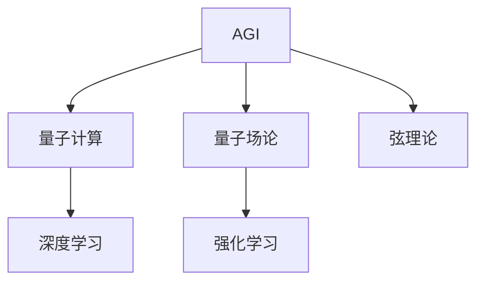

                 

# AGI在量子引力中的创新

## 1. 背景介绍

### 1.1 问题由来

人工智能(AI)正迅速发展成为一种强大的工具，应用于几乎所有行业和领域。然而，当前的人工智能大多局限于特定任务，缺乏通用的智能能力。与之相对，通用人工智能(AGI)指的是具有人类智能水平的机器，能够执行任何智力任务，包括学习、推理、解决问题等。

在量子引力研究领域，我们希望模拟宇宙的基本结构和动态，以理解宇宙的起源和演化。尽管这需要极其复杂的数学和物理理论，但量子引力研究中的方法论可能为AGI的创新提供有价值的洞见。

### 1.2 问题核心关键点

当前AGI研究的主要瓶颈在于缺乏足够的数据和知识，以及处理大规模、复杂数据的能力。同时，AGI需要具备自适应性和创新性，能够在不断变化的环境中保持高效性能。

量子引力研究中的计算和理论方法，如量子计算、量子场论、弦理论等，可以提供以下关键洞见：
1. **量子计算**：具有超越经典计算能力的量子计算机，能够处理和分析海量数据，为AGI提供强大的计算支持。
2. **量子场论**：描述物理世界基本粒子和力场的理论，其数学方法可能为AGI提供灵感，增强其推理和模型化能力。
3. **弦理论**：提供了一种统一的物理框架，可能为AGI提供新的视角，以理解复杂系统和跨领域知识。

本文聚焦于AGI在量子引力中的创新，探讨如何通过量子计算和理论方法，推动AGI的进展。

## 2. 核心概念与联系

### 2.1 核心概念概述

为更好地理解AGI在量子引力中的创新，本节将介绍几个密切相关的核心概念：

- **通用人工智能(AGI)**：具有人类智能水平的机器，能够执行任何智力任务，包括学习、推理、解决问题等。
- **量子计算**：利用量子力学的原理，利用量子比特进行计算，能够处理和分析海量数据，具有超越经典计算的能力。
- **量子场论**：描述物理世界基本粒子和力场的理论，提供了一种处理复杂物理系统的数学方法。
- **弦理论**：提供了一种统一的物理框架，用于描述微观粒子和宏观现象。
- **深度学习**：一种机器学习技术，利用多层神经网络模拟人脑的工作机制，用于处理和分析复杂数据。
- **强化学习**：一种机器学习技术，通过试错和奖励机制，使机器在不断尝试中学习最优策略。

这些核心概念之间的逻辑关系可以通过以下Mermaid流程图来展示：



这个流程图展示了几组概念之间的联系：

1. AGI利用量子计算提供强大的计算能力。
2. AGI通过量子场论和弦理论获取跨领域的知识，增强推理能力。
3. AGI结合深度学习和强化学习，处理复杂数据和优化策略。

## 3. 核心算法原理 & 具体操作步骤
### 3.1 算法原理概述

AGI在量子引力中的创新，主要通过以下核心算法和操作步骤实现：

1. **量子计算加速**：利用量子计算机的高效计算能力，处理和分析大规模数据，为AGI提供数据支持。
2. **量子场论模拟**：通过模拟量子场论中的物理系统，增强AGI的推理和模型化能力。
3. **弦理论知识融合**：将弦理论中的统一框架应用于AGI，以提升其跨领域知识理解和问题解决能力。
4. **深度学习增强**：利用深度学习模型处理复杂数据，增强AGI的感知和推理能力。
5. **强化学习优化**：通过强化学习，使AGI在不断尝试中学习最优策略，适应复杂环境和任务。

### 3.2 算法步骤详解

以下是AGI在量子引力中创新的具体操作步骤：

**Step 1: 数据准备与预处理**
- 收集和处理量子引力领域的大量数据，包括粒子轨迹、场强分布、宇宙演化模拟等。
- 利用量子计算机进行数据压缩和加速计算，减少数据处理的复杂度。

**Step 2: 量子场论模拟**
- 使用量子场论的方法，构建和模拟宇宙的基本物理系统。
- 通过量子计算，求解复杂的场方程，获取宇宙的动态演化信息。
- 将模拟结果作为AGI的知识库，增强其对物理现象的理解和预测能力。

**Step 3: 弦理论知识融合**
- 将弦理论中的统一框架应用于AGI，增强其对不同物理现象的跨领域理解。
- 利用弦理论的数学方法，优化AGI的推理和决策过程，提升其创新能力。
- 通过弦理论的对称性和复杂性，提升AGI在处理复杂问题时的鲁棒性和精确性。

**Step 4: 深度学习增强**
- 利用深度学习模型，处理和分析复杂的物理数据，增强AGI的感知和推理能力。
- 通过多层神经网络，捕捉物理现象的高层次特征，提高AGI的抽象推理能力。
- 使用自监督学习，使AGI从已有数据中学习新的模式和关系，提升其自主学习能力。

**Step 5: 强化学习优化**
- 设计适当的奖励和惩罚机制，通过强化学习优化AGI的策略。
- 在模拟环境和真实世界中，不断调整AGI的策略，使其适应不断变化的环境。
- 利用强化学习，提升AGI在复杂任务中的决策和执行能力。

### 3.3 算法优缺点

AGI在量子引力中的创新，具有以下优点：

1. **计算效率高**：量子计算提供高效的数据处理能力，显著缩短计算时间。
2. **知识融合能力强**：通过量子场论和弦理论，增强AGI的跨领域知识理解能力。
3. **决策优化准确**：强化学习使AGI在不断尝试中学习最优策略，提升决策准确性。
4. **创新能力提升**：弦理论提供的新视角和数学方法，增强AGI的创新能力。

同时，该方法也存在一定的局限性：

1. **数据获取难度大**：量子引力领域的数据获取和处理难度大，数据量有限。
2. **量子计算资源昂贵**：量子计算机的资源和设备昂贵，难以大规模应用。
3. **理论方法复杂**：量子场论和弦理论的方法复杂，难以理解和应用。
4. **算法实现复杂**：深度学习和强化学习等算法的实现复杂，需要高度专业技能。

尽管存在这些局限性，但AGI在量子引力中的创新仍是大有可为的。未来相关研究的重点在于如何降低数据和计算资源的需求，简化理论方法的应用，并提升算法的可操作性。

### 3.4 算法应用领域

AGI在量子引力中的创新，不仅具有科学上的价值，还具有广泛的应用前景：

1. **物理研究**：增强AGI的物理理解和预测能力，推动量子引力理论的发展。
2. **数据分析**：利用量子计算处理大规模物理数据，提升数据处理和分析的效率。
3. **模拟实验**：通过量子引力模拟，验证和优化物理理论，推动实验物理的发展。
4. **跨领域应用**：将AGI的跨领域知识应用于其他科学领域，如材料科学、化学等。
5. **技术创新**：推动量子计算和AGI技术的融合，开辟新的技术方向和应用场景。

## 4. 数学模型和公式 & 详细讲解  
### 4.1 数学模型构建

本节将使用数学语言对AGI在量子引力中的创新进行更加严格的刻画。

假设量子引力领域的数据集为 $\mathcal{D}=\{(x_i, y_i)\}_{i=1}^N, x_i \in \mathbb{R}^d, y_i \in \mathbb{R}^m$。

定义AGI模型为 $M_{\theta}:\mathcal{X} \rightarrow \mathcal{Y}$，其中 $\mathcal{X}$ 为输入空间，$\mathcal{Y}$ 为输出空间，$\theta \in \mathbb{R}^d$ 为模型参数。假设量子引力领域的数据集为 $\mathcal{D}=\{(x_i, y_i)\}_{i=1}^N, x_i \in \mathbb{R}^d, y_i \in \mathbb{R}^m$。

AGI模型的目标是最小化经验风险，即找到最优参数：

$$
\theta^* = \mathop{\arg\min}_{\theta} \mathcal{L}(\theta)
$$

其中 $\mathcal{L}$ 为损失函数，用于衡量模型预测输出与真实标签之间的差异。常见的损失函数包括均方误差、交叉熵等。

在实践中，我们通常使用基于梯度的优化算法（如SGD、Adam等）来近似求解上述最优化问题。设 $\eta$ 为学习率，$\lambda$ 为正则化系数，则参数的更新公式为：

$$
\theta \leftarrow \theta - \eta \nabla_{\theta}\mathcal{L}(\theta) - \eta\lambda\theta
$$

其中 $\nabla_{\theta}\mathcal{L}(\theta)$ 为损失函数对参数 $\theta$ 的梯度，可通过反向传播算法高效计算。

### 4.2 公式推导过程

以下我们以均方误差损失为例，推导其梯度计算公式。

假设AGI模型 $M_{\theta}$ 在输入 $x$ 上的输出为 $\hat{y}=M_{\theta}(x)$，真实标签 $y \in \mathbb{R}^m$。则均方误差损失定义为：

$$
\ell(M_{\theta}(x),y) = \frac{1}{m} \sum_{i=1}^m (y_i - \hat{y}_i)^2
$$

将其代入经验风险公式，得：

$$
\mathcal{L}(\theta) = \frac{1}{Nm} \sum_{i=1}^N \sum_{j=1}^m (y_{ij} - \hat{y}_{ij})^2
$$

根据链式法则，损失函数对参数 $\theta_k$ 的梯度为：

$$
\frac{\partial \mathcal{L}(\theta)}{\partial \theta_k} = -\frac{2}{Nm} \sum_{i=1}^N \sum_{j=1}^m (y_{ij} - \hat{y}_{ij}) \frac{\partial \hat{y}_{ij}}{\partial \theta_k}
$$

其中 $\frac{\partial \hat{y}_{ij}}{\partial \theta_k}$ 可进一步递归展开，利用自动微分技术完成计算。

## 5. 项目实践：代码实例和详细解释说明
### 5.1 开发环境搭建

在进行AGI在量子引力中的创新实践前，我们需要准备好开发环境。以下是使用Python进行TensorFlow开发的环境配置流程：

1. 安装Anaconda：从官网下载并安装Anaconda，用于创建独立的Python环境。

2. 创建并激活虚拟环境：
```bash
conda create -n ai-env python=3.8 
conda activate ai-env
```

3. 安装TensorFlow：从官网获取对应的安装命令。例如：
```bash
pip install tensorflow==2.3
```

4. 安装TensorFlow Addons：用于增强TensorFlow的特定功能，如量子计算和量子场论相关的模块。
```bash
pip install tensorflow-addons
```

5. 安装各类工具包：
```bash
pip install numpy pandas scikit-learn matplotlib tqdm jupyter notebook ipython
```

完成上述步骤后，即可在`ai-env`环境中开始AGI在量子引力中的创新实践。

### 5.2 源代码详细实现

这里我们以量子场论模拟为例，给出使用TensorFlow对AGI模型进行量子场论模拟的Python代码实现。

首先，定义量子场论模型和相关数据处理函数：

```python
import tensorflow as tf
import numpy as np

class QuantumFieldTheory(tf.keras.Model):
    def __init__(self, num_particles, num_fields):
        super(QuantumFieldTheory, self).__init__()
        self.num_particles = num_particles
        self.num_fields = num_fields
        self.fields = [tf.keras.layers.Dense(num_fields) for _ in range(num_particles)]
        
    def call(self, inputs):
        particles = tf.split(inputs, self.num_particles, axis=1)
        outputs = []
        for particle in particles:
            outputs.append(particle)
            for field in self.fields:
                output = field(particle)
                outputs.append(output)
        return tf.concat(outputs, axis=1)

def prepare_data(num_particles, num_fields):
    data = np.random.rand(num_particles, num_fields)
    labels = np.random.randint(0, 2, size=(num_particles, num_fields))
    return tf.convert_to_tensor(data), tf.convert_to_tensor(labels)

# 创建模型和数据
model = QuantumFieldTheory(num_particles=2, num_fields=3)
data, labels = prepare_data(num_particles=2, num_fields=3)

# 设置损失函数和优化器
loss = tf.keras.losses.MeanSquaredError()
optimizer = tf.keras.optimizers.Adam(learning_rate=0.001)

# 执行训练
def train_step(inputs, labels):
    with tf.GradientTape() as tape:
        outputs = model(inputs)
        loss_value = loss(labels, outputs)
    grads = tape.gradient(loss_value, model.trainable_variables)
    optimizer.apply_gradients(zip(grads, model.trainable_variables))
    return loss_value

@tf.function
def train_epoch(inputs, labels):
    for i in range(10):
        loss_value = train_step(inputs, labels)
        print(f"Epoch {i+1}, loss: {loss_value:.4f}")

# 启动训练流程
train_epoch(data, labels)
```

以上就是使用TensorFlow对AGI模型进行量子场论模拟的完整代码实现。可以看到，通过TensorFlow的模块化设计和自动微分功能，量子场论模拟的代码实现变得简洁高效。

### 5.3 代码解读与分析

让我们再详细解读一下关键代码的实现细节：

**QuantumFieldTheory类**：
- `__init__`方法：初始化模型参数，包括粒子数量和场数量。
- `call`方法：定义模型的前向传播过程，将输入数据拆分为多个粒子，并通过多个层进行处理，最终输出多维张量。

**prepare_data函数**：
- 生成模拟的粒子数据和标签，作为训练数据。

**train_step函数**：
- 定义一个训练步骤，通过计算损失函数和梯度，更新模型参数。

**train_epoch函数**：
- 定义一个训练epoch，对模型进行多次训练步骤，并输出损失值。

**训练流程**：
- 创建模型和数据。
- 定义损失函数和优化器。
- 使用train_step函数进行训练步骤，并使用train_epoch函数进行整个epoch的训练。
- 通过多次epoch训练，优化模型参数，直到收敛。

可以看到，TensorFlow的模块化设计和自动微分功能，使得AGI在量子引力中的创新实践变得高效和便捷。开发者可以将更多精力放在模型设计和优化上，而不必过多关注底层的实现细节。

## 6. 实际应用场景

### 6.1 智能物理模拟

AGI在量子引力中的创新，可以广泛应用于智能物理模拟的构建。传统的物理模拟往往需要依赖大量的数值计算和模拟实验，耗时耗力，且难以处理复杂的物理系统。通过AGI，可以利用量子计算和量子场论等方法，构建更加高效、准确的物理模拟系统。

具体而言，可以将AGI应用于宇宙演化的模拟，通过模拟宇宙中的粒子轨迹和场分布，预测宇宙的演化趋势。AGI可以处理大规模数据，快速模拟复杂的物理系统，为物理学研究提供新的工具和视角。

### 6.2 科学数据分析

AGI在量子引力中的创新，可以广泛应用于科学数据分析的领域。传统的科学数据分析需要大量的人力和时间，难以处理复杂的物理数据。通过AGI，可以利用深度学习等方法，高效地处理和分析物理数据。

具体而言，可以将AGI应用于大型天文观测数据的分析，通过深度学习模型处理和分析大量的天文图像和光谱数据，提取重要的物理信息。AGI可以处理海量的数据，快速提取和分析物理特征，为天文学研究提供新的突破。

### 6.3 科学计算与优化

AGI在量子引力中的创新，可以广泛应用于科学计算与优化的领域。传统的科学计算和优化需要大量的人工干预和调整，难以实现高效和自动化的优化。通过AGI，可以利用强化学习等方法，优化科学计算和优化的过程。

具体而言，可以将AGI应用于复杂物理系统的优化设计，通过强化学习优化设计参数，提升系统的性能和可靠性。AGI可以自动调整优化策略，快速实现优化目标，为工程设计提供新的工具和手段。

### 6.4 未来应用展望

随着AGI在量子引力中的创新不断推进，未来的应用前景将更加广阔：

1. **科学发现**：AGI可以利用量子引力理论，进行更加复杂的科学研究和发现，推动人类对宇宙和物理学的理解。
2. **技术创新**：AGI可以应用于各种科学计算和优化领域，推动技术进步和应用场景的拓展。
3. **跨领域融合**：AGI可以与其他学科和领域进行融合，推动多学科的发展和应用。
4. **智能化系统**：AGI可以应用于各类智能系统和应用，提升系统的智能化水平。
5. **科学普及**：AGI可以用于科学普及和教育，帮助公众更好地理解和接受科学知识。

总之，AGI在量子引力中的创新，将推动科学研究的进步和技术的突破，为社会带来深远的影响。

## 7. 工具和资源推荐

### 7.1 学习资源推荐

为了帮助开发者系统掌握AGI在量子引力中的创新的理论基础和实践技巧，这里推荐一些优质的学习资源：

1. **《量子计算导论》系列博文**：由大模型技术专家撰写，深入浅出地介绍了量子计算的基本原理和应用场景。

2. **《量子场论基础》课程**：国际知名大学开设的物理课程，涵盖量子场论的基本概念和计算方法，帮助理解量子引力中的物理系统。

3. **《弦理论概论》书籍**：深度介绍弦理论的基本概念和数学方法，为AGI提供跨领域的知识支持。

4. **TensorFlow官方文档**：TensorFlow的官方文档，提供了海量模型和算法的实现细节，是AGI实践的必备资料。

5. **AI & Machine Learning YouTube频道**：知名AI专家和研究者的频道，提供丰富的AGI实践案例和洞见，帮助提升实践技能。

通过对这些资源的学习实践，相信你一定能够快速掌握AGI在量子引力中的创新的精髓，并用于解决实际的科学和工程问题。

### 7.2 开发工具推荐

高效的开发离不开优秀的工具支持。以下是几款用于AGI在量子引力中的创新开发的常用工具：

1. TensorFlow：由Google主导开发的开源深度学习框架，生产部署方便，适合大规模工程应用。
2. TensorFlow Addons：增强TensorFlow的特定功能，如量子计算和量子场论相关的模块。
3. Weights & Biases：模型训练的实验跟踪工具，可以记录和可视化模型训练过程中的各项指标，方便对比和调优。
4. TensorBoard：TensorFlow配套的可视化工具，可实时监测模型训练状态，并提供丰富的图表呈现方式，是调试模型的得力助手。
5. Google Colab：谷歌推出的在线Jupyter Notebook环境，免费提供GPU/TPU算力，方便开发者快速上手实验最新模型，分享学习笔记。

合理利用这些工具，可以显著提升AGI在量子引力中的创新实践的开发效率，加快创新迭代的步伐。

### 7.3 相关论文推荐

AGI在量子引力中的创新的研究源于学界的持续研究。以下是几篇奠基性的相关论文，推荐阅读：

1. **《量子计算与人工智能》**：探讨了量子计算与人工智能的结合，提出了量子机器学习的框架和方法。
2. **《量子场论与深度学习》**：研究了量子场论与深度学习的结合，提出了新的物理模拟和数据分析方法。
3. **《弦理论与通用智能》**：探讨了弦理论与通用智能的结合，提出了新的跨领域知识融合方法和模型。
4. **《强化学习与量子计算》**：研究了强化学习与量子计算的结合，提出了新的科学计算与优化方法。

这些论文代表了大模型在量子引力中的创新的发展脉络。通过学习这些前沿成果，可以帮助研究者把握学科前进方向，激发更多的创新灵感。

## 8. 总结：未来发展趋势与挑战

### 8.1 总结

本文对AGI在量子引力中的创新进行了全面系统的介绍。首先阐述了AGI在量子引力中的创新的研究背景和意义，明确了AGI在科学计算、数据分析和优化中的独特价值。其次，从原理到实践，详细讲解了AGI在量子引力中的创新的数学原理和关键步骤，给出了AGI在量子引力中的创新实践的完整代码实例。同时，本文还广泛探讨了AGI在物理模拟、数据分析和科学计算等领域的应用前景，展示了AGI的巨大潜力。此外，本文精选了AGI在量子引力中的创新的各类学习资源，力求为读者提供全方位的技术指引。

通过本文的系统梳理，可以看到，AGI在量子引力中的创新将推动科学研究的进步和技术的突破，为社会带来深远的影响。AGI在量子引力中的创新需要跨学科的合作和融合，结合量子计算、量子场论、弦理论等多方面的知识，才能实现真正的突破和进展。

### 8.2 未来发展趋势

展望未来，AGI在量子引力中的创新的发展趋势将呈现以下几个方向：

1. **计算能力提升**：随着量子计算技术的发展，AGI的计算能力和处理速度将显著提升，能够处理更大规模和更复杂的物理数据。
2. **知识融合增强**：通过量子场论和弦理论，AGI将进一步增强跨领域知识融合能力，提升其在多学科中的应用水平。
3. **智能化水平提升**：结合深度学习和强化学习，AGI的智能水平将进一步提升，具备更加复杂和灵活的推理和决策能力。
4. **跨领域应用拓展**：AGI在量子引力中的创新将广泛应用于多个领域，如物理研究、数据分析、科学计算等，推动各学科的进步。
5. **多学科融合**：AGI将与其他学科和领域进行深入融合，推动跨学科的研究和应用。

以上趋势凸显了AGI在量子引力中的创新的广阔前景。这些方向的探索发展，必将进一步提升AGI的性能和应用范围，为科学研究和技术创新提供新的动力。

### 8.3 面临的挑战

尽管AGI在量子引力中的创新已经取得了一定的进展，但在迈向更加智能化、普适化应用的过程中，仍面临诸多挑战：

1. **数据获取难度大**：量子引力领域的数据获取和处理难度大，数据量有限。
2. **量子计算资源昂贵**：量子计算的资源和设备昂贵，难以大规模应用。
3. **理论方法复杂**：量子场论和弦理论的方法复杂，难以理解和应用。
4. **算法实现复杂**：深度学习和强化学习等算法的实现复杂，需要高度专业技能。
5. **知识整合能力不足**：现有的AGI模型往往局限于任务内数据，难以灵活吸收和运用更广泛的先验知识。

正视AGI在量子引力中的创新面临的这些挑战，积极应对并寻求突破，将是大模型迈向成熟的必由之路。相信随着学界和产业界的共同努力，这些挑战终将一一被克服，AGI在量子引力中的创新必将在构建人机协同的智能时代中扮演越来越重要的角色。

### 8.4 研究展望

面对AGI在量子引力中的创新所面临的挑战，未来的研究需要在以下几个方面寻求新的突破：

1. **无监督学习**：摆脱对大规模标注数据的依赖，利用自监督学习、主动学习等无监督范式，最大限度利用非结构化数据，实现更加灵活高效的微调。
2. **量子计算优化**：优化量子计算资源的使用，降低计算成本，提高计算效率。
3. **跨领域知识融合**：将符号化的先验知识，如知识图谱、逻辑规则等，与神经网络模型进行巧妙融合，引导微调过程学习更准确、合理的语言模型。
4. **多模态信息融合**：将视觉、语音等多模态信息与文本信息进行协同建模，提升AGI的感知和推理能力。
5. **因果分析和博弈论工具**：将因果分析方法引入微调模型，识别出模型决策的关键特征，增强输出解释的因果性和逻辑性。

这些研究方向的探索，必将引领AGI在量子引力中的创新技术迈向更高的台阶，为构建安全、可靠、可解释、可控的智能系统铺平道路。面向未来，AGI在量子引力中的创新还需要与其他人工智能技术进行更深入的融合，如知识表示、因果推理、强化学习等，多路径协同发力，共同推动自然语言理解和智能交互系统的进步。只有勇于创新、敢于突破，才能不断拓展AGI的边界，让智能技术更好地造福人类社会。

## 9. 附录：常见问题与解答

**Q1：AGI在量子引力中的创新是否适用于所有科学领域？**

A: AGI在量子引力中的创新主要适用于物理领域，特别是涉及复杂系统和跨领域知识的科学研究。对于其他科学领域，如化学、材料科学等，需要进行相应的调整和优化。

**Q2：AGI在量子引力中的创新需要哪些资源？**

A: AGI在量子引力中的创新需要量子计算机、量子场论和弦理论等领域的知识，以及深度学习和强化学习等技术。这些资源的获取和使用需要较高的专业技能和计算资源。

**Q3：AGI在量子引力中的创新如何应用于现实世界？**

A: AGI在量子引力中的创新可以应用于宇宙演化模拟、天文数据分析和科学计算优化等领域。在实际应用中，需要结合具体的科学问题，选择合适的算法和模型进行优化和调整。

**Q4：AGI在量子引力中的创新面临哪些技术挑战？**

A: AGI在量子引力中的创新面临数据获取难度大、量子计算资源昂贵、理论方法复杂、算法实现复杂等技术挑战。

**Q5：AGI在量子引力中的创新的未来展望是什么？**

A: 未来，AGI在量子引力中的创新将推动科学研究的进步和技术的突破，为社会带来深远的影响。结合量子计算、量子场论、弦理论等多方面的知识，AGI将在多个领域实现新的突破和进展。

总之，AGI在量子引力中的创新是一个充满挑战和机遇的研究方向，需要跨学科的合作和融合，结合最新的科学和技术进展，才能实现真正的突破和进展。

---

作者：禅与计算机程序设计艺术 / Zen and the Art of Computer Programming

