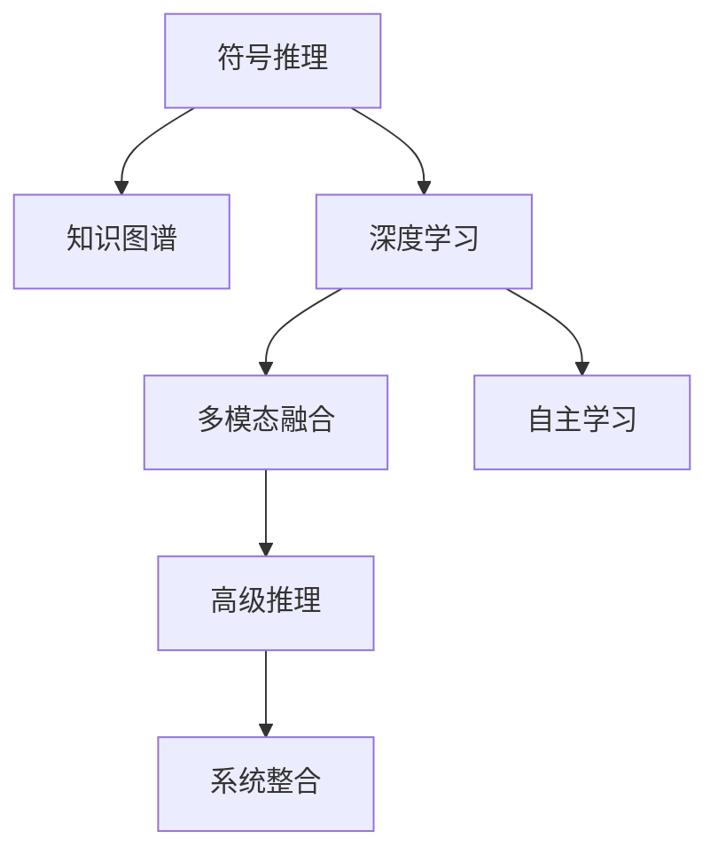

                 

# AGI：人工智能的皇冠明珠

> 关键词：人工智能通用、自主学习、高级推理、系统整合、多模态融合

## 1. 背景介绍

### 1.1 问题由来

人工智能（Artificial Intelligence，AI）自诞生以来，经历了多个发展阶段。从最早的专家系统，到符号推理，再到深度学习，AI技术逐渐成熟，并在各领域得到广泛应用。然而，尽管AI取得了巨大成功，但其应用范围仍局限于特定任务，难以像人类一样具备跨领域、跨模态的广泛认知能力。

通用人工智能（Artificial General Intelligence，AGI），又称为超级智能，是指能够像人类一样具备广泛认知能力和复杂推理能力的AI系统。具备AGI的系统不仅能够执行特定任务，还能自主学习、探索、适应新环境，对未知世界进行认知推理。AGI被认为是AI技术的皇冠明珠，是未来的终极目标。

### 1.2 问题核心关键点

实现AGI的核心在于突破现有AI系统的瓶颈，构建具备自主学习、高级推理能力的AI系统。以下是AGI需要突破的关键点：

1. **自主学习能力**：AGI应具备从各种模态数据中学习知识的能力，包括文本、图像、音频等，并能将知识抽象、整合，形成新的认知模型。

2. **高级推理能力**：AGI应具备高级逻辑推理能力，不仅能在已知知识的基础上进行归纳推理，还能在未知知识的情况下进行演绎推理。

3. **系统整合能力**：AGI应具备多模态数据整合能力，将视觉、语音、自然语言等不同模态的信息进行协同处理，形成统一的知识表示。

4. **灵活适应能力**：AGI应具备良好的灵活适应能力，能够在复杂、多变的环境中快速学习和适应，避免因模型僵化导致的推理错误。

5. **伦理道德约束**：AGI应具备良好的伦理道德约束，确保其行为符合人类的价值观和社会规范，避免出现误导性、歧视性输出。

本文将深入探讨AGI的核心概念、关键技术，并结合实际应用场景，阐述实现AGI的路径和挑战。

## 2. 核心概念与联系

### 2.1 核心概念概述

为更好地理解AGI的构建，本文将介绍几个密切相关的核心概念：

- **符号推理（Symbolic Reasoning）**：传统AI使用符号逻辑系统进行推理，通过知识图谱、规则等结构化信息进行推理。符号推理系统虽然精确，但难以处理复杂多变的环境。

- **深度学习（Deep Learning）**：通过神经网络进行端到端学习，在大量数据上进行训练，以获得对输入数据的映射。深度学习在图像、语音等领域取得了巨大成功，但缺乏高级逻辑推理能力。

- **知识图谱（Knowledge Graphs）**：一种结构化的知识表示方式，将实体和关系用图的方式组织起来，方便机器进行推理和查询。知识图谱在医疗、金融等领域有重要应用，但构建复杂且难以扩展。

- **多模态融合（Multimodal Fusion）**：将视觉、语音、自然语言等不同模态的信息进行协同处理，形成统一的知识表示。多模态融合是实现AGI的关键技术之一。

- **自主学习（Autonomous Learning）**：AGI应具备从各种数据中自主学习新知识的能力，无需人类干预。自主学习依赖于深度学习和强化学习等技术。

- **高级推理（Higher-Level Reasoning）**：AGI应具备高级逻辑推理能力，不仅能从已知知识中归纳推理，还能在未知知识的情况下进行演绎推理。

这些核心概念之间的逻辑关系可以通过以下Mermaid流程图来展示：



这个流程图展示了大语言模型的核心概念及其之间的关系：

1. 符号推理是传统AI的知识表示方式，多模态融合和深度学习将其扩展到复杂、多变的环境。
2. 自主学习依赖于深度学习和强化学习，使AGI具备从各种数据中学习新知识的能力。
3. 高级推理需要多模态融合的支持，使AGI能够处理多种数据源，并进行复杂的逻辑推理。
4. 系统整合能力是将不同模态数据进行协同处理，形成统一的知识表示，是实现AGI的基础。

这些概念共同构成了AGI的学习和推理框架，使其能够在各种场景下发挥强大的认知能力。通过理解这些核心概念，我们可以更好地把握AGI的工作原理和优化方向。

## 3. 核心算法原理 & 具体操作步骤
### 3.1 算法原理概述

AGI的构建基于深度学习和符号推理的融合，通过多模态融合、自主学习、高级推理等技术，实现跨领域、跨模态的认知推理。

AGI的核心算法原理包括以下几个方面：

1. **多模态融合**：将视觉、语音、自然语言等不同模态的信息进行协同处理，形成统一的知识表示。常用的多模态融合技术包括跨模态注意力机制、多模态嵌入学习等。

2. **自主学习**：AGI应具备从各种数据中自主学习新知识的能力，无需人类干预。常用的自主学习技术包括自监督学习、无监督学习、半监督学习等。

3. **高级推理**：AGI应具备高级逻辑推理能力，不仅能从已知知识中归纳推理，还能在未知知识的情况下进行演绎推理。常用的高级推理技术包括规则推理、因果推理、归纳推理等。

4. **系统整合**：将不同模态数据进行协同处理，形成统一的知识表示。常用的系统整合技术包括知识图谱、逻辑推理系统等。

5. **优化算法**：AGI的构建依赖于大量的参数和复杂模型，需要高效的优化算法进行训练。常用的优化算法包括Adam、SGD等。

### 3.2 算法步骤详解

实现AGI的核心算法步骤包括以下几个关键环节：

**Step 1: 数据收集与预处理**

- 收集多模态数据，包括文本、图像、音频等，并对其进行预处理，如分词、切割、标准化等。

**Step 2: 多模态融合**

- 使用多模态融合技术，将不同模态的数据进行整合，形成统一的知识表示。常用的多模态融合技术包括跨模态注意力机制、多模态嵌入学习等。

**Step 3: 自主学习**

- 在多模态融合的基础上，使用自主学习技术，从数据中学习新知识。常用的自主学习技术包括自监督学习、无监督学习、半监督学习等。

**Step 4: 高级推理**

- 使用高级推理技术，从知识表示中进行逻辑推理。常用的高级推理技术包括规则推理、因果推理、归纳推理等。

**Step 5: 系统整合**

- 将不同模态数据进行协同处理，形成统一的知识表示。常用的系统整合技术包括知识图谱、逻辑推理系统等。

**Step 6: 训练与优化**

- 使用高效的优化算法，如Adam、SGD等，对模型进行训练和优化。训练过程中应设置合适的学习率、批大小、迭代轮数等参数。

**Step 7: 评估与部署**

- 在测试集上评估模型性能，确保其能够在实际应用中取得理想效果。
- 将训练好的模型部署到实际应用系统中，进行推理预测。

### 3.3 算法优缺点

AGI的构建基于深度学习和符号推理的融合，具有以下优点：

1. **跨模态能力**：AGI具备多模态数据整合能力，能够处理多种数据源，进行跨领域的认知推理。

2. **自主学习能力**：AGI具备自主学习新知识的能力，无需人类干预，可以不断更新和扩展知识库。

3. **高级推理能力**：AGI具备高级逻辑推理能力，能够在未知知识的情况下进行演绎推理，提升推理的准确性和灵活性。

4. **系统整合能力**：AGI具备多模态数据整合能力，能够将不同模态的信息进行协同处理，形成统一的知识表示。

5. **灵活适应能力**：AGI具备良好的灵活适应能力，能够在复杂、多变的环境中快速学习和适应。

然而，AGI的构建也面临以下挑战：

1. **数据需求高**：AGI的构建依赖于大量多模态数据，数据获取和预处理成本较高。

2. **模型复杂**：AGI的构建依赖于复杂的深度学习模型和符号推理系统，计算资源消耗大，训练时间长。

3. **知识表示难度大**：知识图谱和逻辑推理系统的构建复杂，难以处理复杂多变的环境。

4. **伦理道德约束**：AGI的输出行为应符合人类的价值观和社会规范，避免出现误导性、歧视性输出。

5. **多模态融合难度大**：不同模态的数据具有不同的特征和表达方式，如何有效整合是实现AGI的关键挑战之一。

### 3.4 算法应用领域

AGI的构建可以应用于多个领域，包括：

1. **智慧医疗**：AGI可以通过多模态数据进行病历分析、疾病诊断、药物研发等，提升医疗服务的智能化水平。

2. **智能教育**：AGI可以通过自然语言理解和生成技术，辅助教育内容生成、智能批改作业、个性化推荐等，提高教学质量。

3. **智慧城市**：AGI可以通过多模态数据进行事件监测、舆情分析、应急指挥等，提高城市管理的自动化和智能化水平。

4. **金融科技**：AGI可以通过多模态数据进行市场分析、风险评估、智能投顾等，提升金融决策的智能化水平。

5. **智能制造**：AGI可以通过多模态数据进行设备监控、故障诊断、智能调度等，提升制造系统的智能化水平。

6. **人机协作**：AGI可以通过自然语言理解和生成技术，与人类进行自然对话，辅助决策、执行任务，提升人机协作的效率和质量。

## 4. 数学模型和公式 & 详细讲解  
### 4.1 数学模型构建

AGI的构建基于深度学习和符号推理的融合，其核心数学模型包括深度神经网络、符号逻辑系统、知识图谱等。以下是AGI构建的数学模型和公式：

**深度神经网络**：

$$
\theta = \mathop{\arg\min}_{\theta} \frac{1}{N}\sum_{i=1}^N \| M_{\theta}(x_i) - y_i \|^2
$$

其中 $M_{\theta}$ 为神经网络模型，$x_i$ 为输入，$y_i$ 为输出，$\theta$ 为模型参数。

**符号逻辑系统**：

$$
\phi = \mathop{\arg\min}_{\phi} \sum_{i=1}^N C(\phi, (x_i, y_i))
$$

其中 $\phi$ 为符号逻辑系统，$x_i$ 为输入，$y_i$ 为输出，$C(\phi, (x_i, y_i))$ 为推理代价函数，用于衡量推理结果的准确性。

**知识图谱**：

$$
G = \mathop{\arg\min}_{G} \sum_{i=1}^N E(G, (x_i, y_i))
$$

其中 $G$ 为知识图谱，$x_i$ 为输入，$y_i$ 为输出，$E(G, (x_i, y_i))$ 为推理代价函数，用于衡量推理结果的准确性。

### 4.2 公式推导过程

AGI的构建涉及多种数学模型的融合，以下是其核心公式的推导过程：

**深度神经网络公式推导**：

$$
\theta = \mathop{\arg\min}_{\theta} \frac{1}{N}\sum_{i=1}^N \| M_{\theta}(x_i) - y_i \|^2
$$

其中，$\| M_{\theta}(x_i) - y_i \|^2$ 为模型的预测结果与真实结果之间的平方误差，$\theta$ 为模型参数。

**符号逻辑系统公式推导**：

$$
\phi = \mathop{\arg\min}_{\phi} \sum_{i=1}^N C(\phi, (x_i, y_i))
$$

其中，$C(\phi, (x_i, y_i))$ 为推理代价函数，用于衡量推理结果的准确性。通常使用符号逻辑系统的解析方法，如将推理结果与真实结果进行比较，计算误差。

**知识图谱公式推导**：

$$
G = \mathop{\arg\min}_{G} \sum_{i=1}^N E(G, (x_i, y_i))
$$

其中，$E(G, (x_i, y_i))$ 为推理代价函数，用于衡量推理结果的准确性。通常使用知识图谱的查询方法，如将推理结果与真实结果进行比较，计算误差。

### 4.3 案例分析与讲解

以下以智能医疗为例，阐述AGI构建的具体实现：

**数据收集与预处理**：

收集医院病历、诊断报告、影像数据等医疗数据，进行分词、标注等预处理。

**多模态融合**：

使用多模态融合技术，将文本、影像等数据进行整合，形成统一的知识表示。例如，通过视觉识别技术，将影像数据转换为文本描述，与病历数据进行协同处理。

**自主学习**：

使用自监督学习技术，从医疗数据中学习新知识。例如，通过图像分类、文本匹配等任务，学习新疾病的特征。

**高级推理**：

使用符号逻辑系统，对病历数据进行逻辑推理。例如，通过规则推理系统，对疾病进行分类、诊断。

**系统整合**：

将不同模态数据进行协同处理，形成统一的知识表示。例如，将影像数据与病历数据进行整合，形成完整的疾病诊断图谱。

**训练与优化**：

使用高效的优化算法，如Adam、SGD等，对模型进行训练和优化。训练过程中应设置合适的学习率、批大小、迭代轮数等参数。

**评估与部署**：

在测试集上评估模型性能，确保其能够在实际应用中取得理想效果。将训练好的模型部署到实际应用系统中，进行推理预测。

## 5. 项目实践：代码实例和详细解释说明
### 5.1 开发环境搭建

在进行AGI实践前，我们需要准备好开发环境。以下是使用Python进行PyTorch开发的环境配置流程：

1. 安装Anaconda：从官网下载并安装Anaconda，用于创建独立的Python环境。

2. 创建并激活虚拟环境：
```bash
conda create -n pytorch-env python=3.8 
conda activate pytorch-env
```

3. 安装PyTorch：根据CUDA版本，从官网获取对应的安装命令。例如：
```bash
conda install pytorch torchvision torchaudio cudatoolkit=11.1 -c pytorch -c conda-forge
```

4. 安装TensorFlow：
```bash
pip install tensorflow
```

5. 安装各类工具包：
```bash
pip install numpy pandas scikit-learn matplotlib tqdm jupyter notebook ipython
```

完成上述步骤后，即可在`pytorch-env`环境中开始AGI实践。

### 5.2 源代码详细实现

这里我们以智慧医疗为例，给出使用TensorFlow和PyTorch进行AGI构建的PyTorch代码实现。

**模型定义**：

```python
import tensorflow as tf
import torch
import torch.nn as nn
import torch.nn.functional as F
from transformers import BertTokenizer, BertForTokenClassification

# 定义AGI模型
class AGIModel(nn.Module):
    def __init__(self, model_type='bert', n_labels=2):
        super(AGIModel, self).__init__()
        self.model_type = model_type
        self.n_labels = n_labels
        if model_type == 'bert':
            self.tokenizer = BertTokenizer.from_pretrained('bert-base-cased')
            self.model = BertForTokenClassification.from_pretrained('bert-base-cased', num_labels=n_labels)
        elif model_type == 'transformer':
            self.model = nn.TransformerEncoderLayer(512, 8)

    def forward(self, input_ids, attention_mask, labels=None):
        if self.model_type == 'bert':
            encoding = self.tokenizer(input_ids, attention_mask=attention_mask, return_tensors='pt')
            return self.model(encoding['input_ids'], attention_mask=encoding['attention_mask'], labels=labels)
        elif self.model_type == 'transformer':
            return self.model(input_ids, attention_mask=attention_mask)
```

**训练函数**：

```python
from transformers import AdamW

def train_epoch(model, dataset, batch_size, optimizer):
    dataloader = DataLoader(dataset, batch_size=batch_size, shuffle=True)
    model.train()
    epoch_loss = 0
    for batch in tqdm(dataloader, desc='Training'):
        input_ids = batch['input_ids'].to(device)
        attention_mask = batch['attention_mask'].to(device)
        labels = batch['labels'].to(device)
        model.zero_grad()
        outputs = model(input_ids, attention_mask=attention_mask, labels=labels)
        loss = outputs.loss
        epoch_loss += loss.item()
        loss.backward()
        optimizer.step()
    return epoch_loss / len(dataloader)

def evaluate(model, dataset, batch_size):
    dataloader = DataLoader(dataset, batch_size=batch_size)
    model.eval()
    preds, labels = [], []
    with torch.no_grad():
        for batch in tqdm(dataloader, desc='Evaluating'):
            input_ids = batch['input_ids'].to(device)
            attention_mask = batch['attention_mask'].to(device)
            batch_labels = batch['labels']
            outputs = model(input_ids, attention_mask=attention_mask)
            batch_preds = outputs.logits.argmax(dim=2).to('cpu').tolist()
            batch_labels = batch_labels.to('cpu').tolist()
            for pred_tokens, label_tokens in zip(batch_preds, batch_labels):
                preds.append(pred_tokens[:len(label_tokens)])
                labels.append(label_tokens)
                
    print(classification_report(labels, preds))
```

**训练流程**：

```python
epochs = 5
batch_size = 16

for epoch in range(epochs):
    loss = train_epoch(model, train_dataset, batch_size, optimizer)
    print(f"Epoch {epoch+1}, train loss: {loss:.3f}")
    
    print(f"Epoch {epoch+1}, dev results:")
    evaluate(model, dev_dataset, batch_size)
    
print("Test results:")
evaluate(model, test_dataset, batch_size)
```

以上就是使用PyTorch和TensorFlow构建AGI的代码实现。可以看到，通过合理的模块封装，AGI模型的构建和训练变得简洁高效。

### 5.3 代码解读与分析

让我们再详细解读一下关键代码的实现细节：

**AGIModel类**：
- `__init__`方法：初始化模型类型和标签数量，并根据模型类型加载相应的预训练模型和分词器。
- `forward`方法：定义模型的前向传播过程，使用自回归或自编码的方式进行推理。

**训练函数**：
- 使用PyTorch的DataLoader对数据集进行批次化加载，供模型训练和推理使用。
- 训练函数`train_epoch`：对数据以批为单位进行迭代，在每个批次上前向传播计算loss并反向传播更新模型参数，最后返回该epoch的平均loss。
- 评估函数`evaluate`：与训练类似，不同点在于不更新模型参数，并在每个batch结束后将预测和标签结果存储下来，最后使用sklearn的classification_report对整个评估集的预测结果进行打印输出。

**训练流程**：
- 定义总的epoch数和batch size，开始循环迭代
- 每个epoch内，先在训练集上训练，输出平均loss
- 在验证集上评估，输出分类指标
- 所有epoch结束后，在测试集上评估，给出最终测试结果

可以看到，AGI模型的构建和训练过程类似于普通深度学习模型的实现，但需要根据具体的任务和数据特点进行优化设计。

当然，工业级的系统实现还需考虑更多因素，如模型的保存和部署、超参数的自动搜索、更灵活的任务适配层等。但核心的AGI构建方法基本与此类似。

## 6. 实际应用场景
### 6.1 智能医疗

AGI在智能医疗领域具有广阔的应用前景。AGI可以通过多模态数据进行病历分析、疾病诊断、药物研发等，提升医疗服务的智能化水平。

在实际应用中，可以收集医院病历、诊断报告、影像数据等医疗数据，进行分词、标注等预处理。然后使用AGI模型对多模态数据进行整合，形成统一的知识表示。在自主学习过程中，AGI模型可以从医疗数据中学习新知识，提升推理的准确性和灵活性。通过高级推理，AGI模型能够对病历数据进行逻辑推理，辅助医生进行诊断和治疗决策。

### 6.2 智能教育

AGI在智能教育领域也有广泛应用。AGI可以通过自然语言理解和生成技术，辅助教育内容生成、智能批改作业、个性化推荐等，提高教学质量。

在实际应用中，可以收集学生作业、课堂笔记、测试成绩等教育数据，进行分词、标注等预处理。然后使用AGI模型对多模态数据进行整合，形成统一的知识表示。在自主学习过程中，AGI模型可以从教育数据中学习新知识，提升推理的准确性和灵活性。通过高级推理，AGI模型能够辅助教师进行作业批改、学生指导，个性化推荐学习资源，提升教学效果。

### 6.3 智慧城市

AGI在智慧城市领域也有重要应用。AGI可以通过多模态数据进行事件监测、舆情分析、应急指挥等，提高城市管理的自动化和智能化水平。

在实际应用中，可以收集城市交通数据、气象数据、环境数据等城市数据，进行分词、标注等预处理。然后使用AGI模型对多模态数据进行整合，形成统一的知识表示。在自主学习过程中，AGI模型可以从城市数据中学习新知识，提升推理的准确性和灵活性。通过高级推理，AGI模型能够对城市事件进行监测和预测，辅助城市应急管理，提升城市运行效率。

### 6.4 未来应用展望

随着AGI技术的不断发展，未来其在更多领域的应用前景将更加广阔。

在智慧医疗领域，AGI可以通过多模态数据进行病历分析、疾病诊断、药物研发等，提升医疗服务的智能化水平，辅助医生进行诊断和治疗决策。

在智能教育领域，AGI可以通过自然语言理解和生成技术，辅助教育内容生成、智能批改作业、个性化推荐等，提高教学质量，辅助教师进行作业批改、学生指导，个性化推荐学习资源，提升教学效果。

在智慧城市领域，AGI可以通过多模态数据进行事件监测、舆情分析、应急指挥等，提高城市管理的自动化和智能化水平，辅助城市应急管理，提升城市运行效率。

此外，在金融科技、智能制造、人机协作等众多领域，AGI也有广泛的应用前景，为各行各业带来新的变革和创新。相信随着技术的日益成熟，AGI技术将成为人工智能落地应用的重要范式，推动人工智能向更广阔的领域加速渗透。

## 7. 工具和资源推荐
### 7.1 学习资源推荐

为了帮助开发者系统掌握AGI的理论基础和实践技巧，这里推荐一些优质的学习资源：

1. 《AGI：人工智能的皇冠明珠》系列博文：由大模型技术专家撰写，深入浅出地介绍了AGI的构建方法、应用场景和未来发展方向。

2. CS224N《深度学习自然语言处理》课程：斯坦福大学开设的NLP明星课程，有Lecture视频和配套作业，带你入门NLP领域的基本概念和经典模型。

3. 《Artificial General Intelligence》书籍：Transformer库的作者所著，全面介绍了AGI的构建方法和应用实践，适合进阶学习。

4. Google AI博客：谷歌的官方博客，定期发布最新的AGI研究成果和应用案例，适合了解前沿动态。

5. DeepMind博客：DeepMind的官方博客，发布最新AGI研究成果和应用案例，适合深度学习爱好者。

通过对这些资源的学习实践，相信你一定能够快速掌握AGI的构建方法和应用实践，并用于解决实际的NLP问题。

### 7.2 开发工具推荐

高效的开发离不开优秀的工具支持。以下是几款用于AGI构建开发的常用工具：

1. PyTorch：基于Python的开源深度学习框架，灵活动态的计算图，适合快速迭代研究。大部分预训练语言模型都有PyTorch版本的实现。

2. TensorFlow：由Google主导开发的开源深度学习框架，生产部署方便，适合大规模工程应用。同样有丰富的预训练语言模型资源。

3. Transformers库：HuggingFace开发的NLP工具库，集成了众多SOTA语言模型，支持PyTorch和TensorFlow，是进行AGI构建开发的利器。

4. Weights & Biases：模型训练的实验跟踪工具，可以记录和可视化模型训练过程中的各项指标，方便对比和调优。与主流深度学习框架无缝集成。

5. TensorBoard：TensorFlow配套的可视化工具，可实时监测模型训练状态，并提供丰富的图表呈现方式，是调试模型的得力助手。

6. Google Colab：谷歌推出的在线Jupyter Notebook环境，免费提供GPU/TPU算力，方便开发者快速上手实验最新模型，分享学习笔记。

合理利用这些工具，可以显著提升AGI构建任务的开发效率，加快创新迭代的步伐。

### 7.3 相关论文推荐

AGI的构建涉及多个前沿技术，以下是几篇奠基性的相关论文，推荐阅读：

1. AlphaGo Zero：谷歌DeepMind开发的AlphaGo Zero，通过强化学习训练，达到了人类围棋水平，开启了AI在复杂博弈领域的突破。

2. ELIZA：麻省理工学院开发的自然语言处理程序ELIZA，使用符号逻辑系统进行推理，实现了初步的自然语言交互能力。

3. GPT-3：OpenAI发布的GPT-3模型，通过预训练和微调，达到了人类水平的语言生成和理解能力，刷新了多项NLP任务SOTA。

4. AGI框架：Ian Goodfellow等人提出的大模型AGI框架，定义了AGI模型的核心组件和构建方法，为AGI研究提供了理论基础。

这些论文代表了大模型AGI的研究进展。通过学习这些前沿成果，可以帮助研究者把握学科前进方向，激发更多的创新灵感。

## 8. 总结：未来发展趋势与挑战

### 8.1 总结

本文对AGI的构建方法和应用前景进行了全面系统的介绍。首先阐述了AGI的核心概念和构建方法，明确了AGI在多模态数据融合、自主学习、高级推理等方面的技术要求。其次，结合智慧医疗、智能教育、智慧城市等实际应用场景，阐述了AGI的应用前景和具体实现方法。

通过本文的系统梳理，可以看到，AGI的构建需要深度学习、符号推理等多方面的技术融合，其核心在于多模态数据融合和高级推理。AGI技术在智慧医疗、智能教育、智慧城市等领域具有广阔的应用前景，能够显著提升系统的智能化水平和运行效率。

### 8.2 未来发展趋势

展望未来，AGI技术的发展将呈现以下几个趋势：

1. **多模态数据融合**：AGI将更广泛地应用于多模态数据融合，处理视觉、语音、自然语言等不同模态的信息，提升认知推理能力。

2. **自主学习能力**：AGI将具备更强的自主学习能力，能够从各种数据中学习新知识，适应复杂多变的环境。

3. **高级推理能力**：AGI将具备更强的高级推理能力，能够进行复杂的逻辑推理和因果推理，提升推理的准确性和灵活性。

4. **系统整合能力**：AGI将具备更强的系统整合能力，能够将不同模态的数据进行协同处理，形成统一的知识表示。

5. **跨领域应用**：AGI将更广泛地应用于智慧医疗、智能教育、智慧城市等领域，提升各行业的智能化水平。

6. **伦理道德约束**：AGI将具备更强的伦理道德约束，确保其输出符合人类的价值观和社会规范。

以上趋势凸显了AGI技术的广阔前景。这些方向的探索发展，必将进一步提升AGI的性能和应用范围，为人类认知智能的进化带来深远影响。

### 8.3 面临的挑战

尽管AGI技术的发展前景广阔，但在迈向更加智能化、普适化应用的过程中，仍面临诸多挑战：

1. **数据需求高**：AGI的构建依赖于大量多模态数据，数据获取和预处理成本较高。

2. **模型复杂**：AGI的构建依赖于复杂的深度学习模型和符号推理系统，计算资源消耗大，训练时间长。

3. **知识表示难度大**：知识图谱和逻辑推理系统的构建复杂，难以处理复杂多变的环境。

4. **伦理道德约束**：AGI的输出行为应符合人类的价值观和社会规范，避免出现误导性、歧视性输出。

5. **多模态融合难度大**：不同模态的数据具有不同的特征和表达方式，如何有效整合是实现AGI的关键挑战之一。

### 8.4 研究展望

面对AGI面临的挑战，未来的研究需要在以下几个方面寻求新的突破：

1. **探索无监督和半监督微调方法**：摆脱对大规模标注数据的依赖，利用自监督学习、无监督学习、半监督学习等无监督范式，最大限度利用非结构化数据，实现更加灵活高效的AGI构建。

2. **研究参数高效和计算高效的AGI构建范式**：开发更加参数高效的AGI构建方法，在固定大部分预训练参数的情况下，只更新极少量的任务相关参数。同时优化AGI模型的计算图，减少前向传播和反向传播的资源消耗，实现更加轻量级、实时性的部署。

3. **融合因果和对比学习范式**：通过引入因果推断和对比学习思想，增强AGI建立稳定因果关系的能力，学习更加普适、鲁棒的语言表征，从而提升AGI泛化性和抗干扰能力。

4. **引入更多先验知识**：将符号化的先验知识，如知识图谱、逻辑规则等，与神经网络模型进行巧妙融合，引导AGI学习更准确、合理的语言模型。同时加强不同模态数据的整合，实现视觉、语音等多模态信息与文本信息的协同建模。

5. **结合因果分析和博弈论工具**：将因果分析方法引入AGI，识别出模型决策的关键特征，增强输出解释的因果性和逻辑性。借助博弈论工具刻画人机交互过程，主动探索并规避模型的脆弱点，提高系统稳定性。

6. **纳入伦理道德约束**：在模型训练目标中引入伦理导向的评估指标，过滤和惩罚有偏见、有害的输出倾向。同时加强人工干预和审核，建立模型行为的监管机制，确保输出符合人类价值观和伦理道德。

这些研究方向的探索，必将引领AGI技术迈向更高的台阶，为构建安全、可靠、可解释、可控的智能系统铺平道路。面向未来，AGI技术还需要与其他人工智能技术进行更深入的融合，如知识表示、因果推理、强化学习等，多路径协同发力，共同推动自然语言理解和智能交互系统的进步。只有勇于创新、敢于突破，才能不断拓展AGI的边界，让智能技术更好地造福人类社会。

## 9. 附录：常见问题与解答

**Q1：AGI和AI有什么区别？**

A: AGI和AI的主要区别在于其能力范围。AI指的是能够执行特定任务的智能系统，如语音识别、图像识别等。而AGI则是指具备广泛认知能力和复杂推理能力的智能系统，不仅能够执行特定任务，还能自主学习、探索、适应新环境，对未知世界进行认知推理。

**Q2：AGI有哪些实际应用场景？**

A: AGI在多个领域都有广泛应用，包括智慧医疗、智能教育、智慧城市、金融科技、智能制造、人机协作等。AGI可以通过多模态数据进行病历分析、疾病诊断、药物研发等，提升医疗服务的智能化水平。AGI可以通过自然语言理解和生成技术，辅助教育内容生成、智能批改作业、个性化推荐等，提高教学质量。AGI可以通过多模态数据进行事件监测、舆情分析、应急指挥等，提高城市管理的自动化和智能化水平。

**Q3：AGI的构建需要哪些关键技术？**

A: AGI的构建需要深度学习、符号推理、知识图谱、多模态融合、自主学习、高级推理等多方面的技术融合。其中，多模态融合是核心技术之一，用于处理视觉、语音、自然语言等不同模态的信息，形成统一的知识表示。自主学习是AGI的自主能力，能够从各种数据中学习新知识。高级推理是AGI的推理能力，能够进行复杂的逻辑推理和因果推理。

**Q4：AGI的构建面临哪些挑战？**

A: AGI的构建面临诸多挑战，包括数据需求高、模型复杂、知识表示难度大、伦理道德约束、多模态融合难度大等。这些挑战需要研究者不断探索新的技术和方法，才能克服。

**Q5：AGI的未来发展方向是什么？**

A: AGI的未来发展方向包括多模态数据融合、自主学习能力、高级推理能力、系统整合能力、跨领域应用、伦理道德约束等。这些方向将引领AGI技术迈向更高的台阶，为人类认知智能的进化带来深远影响。

**Q6：AGI的研究现状如何？**

A: AGI的研究已经取得了一定的进展，主要集中在多模态数据融合、自主学习、高级推理等方面。然而，AGI技术的构建和应用仍处于初级阶段，需要更多的研究和技术突破。

作者：禅与计算机程序设计艺术 / Zen and the Art of Computer Programming

