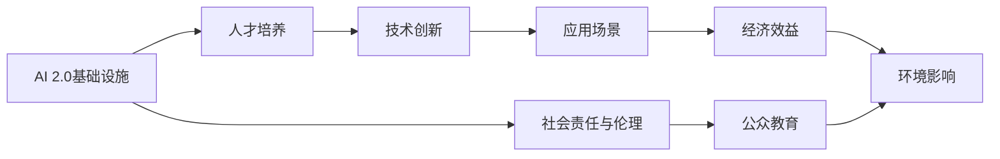
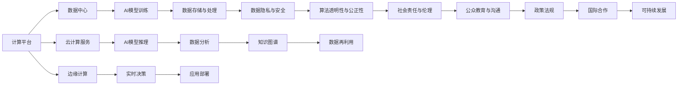

                 

# AI 2.0 基础设施建设：人才培养与社会责任

> 关键词：AI 2.0, 基础设施, 人才培养, 社会责任, 教育创新, 技术伦理, 可持续发展

## 1. 背景介绍

随着人工智能(AI)技术的迅猛发展，全球范围内正加速进入AI 2.0时代。AI 2.0不仅仅是技术的进步，更是与经济、社会、伦理等诸多领域深度融合的全面变革。在这一进程中，基础设施建设作为AI 2.0发展的基石，其重要性不容忽视。然而，基础设施建设不仅仅是硬件设施和技术平台，更是人才的培养与伦理的社会责任。本文将系统探讨AI 2.0基础设施建设的关键问题，并提出针对性的解决方案。

### 1.1 问题由来

AI 2.0的发展离不开强大的基础设施支撑。传统基础设施主要包括计算平台、数据存储、通信网络等硬件设施，以及算法、模型、工具等软件生态。然而，随着AI技术的不断深入，数据隐私、算法透明性、伦理规范等问题日益突出，基础设施建设面临新的挑战。

当前，AI基础设施建设面临的主要问题包括：

- **人才短缺**：AI领域的高技能人才供不应求，高质量的人才培养体系尚未完全建立。
- **伦理挑战**：AI模型可能存在的偏见、歧视问题亟需解决，社会责任意识薄弱。
- **可持续发展**：AI技术发展与资源消耗、环境污染等问题交织，需要兼顾经济效益与环境效益。

### 1.2 问题核心关键点

为更好地理解AI 2.0基础设施建设的关键问题，本文将重点探讨以下核心概念及其相互关系：

- AI 2.0基础设施：包括计算平台、数据中心、云计算服务、边缘计算等，是支持AI应用运行的底层环境。
- 人才培养体系：从基础教育、高等教育到在职培训，为AI领域提供充足的人才资源。
- 社会责任与伦理规范：在AI模型设计、数据使用、系统部署等环节，确保技术应用的道德性和安全性。

这些核心概念之间的关系可以通过以下Mermaid流程图来展示：



这个流程图展示了AI 2.0基础设施建设的关键路径和支撑点：

1. AI 2.0基础设施为人才培养提供硬件和软件环境。
2. 人才培养体系推动技术创新，形成高质量的AI人才供给。
3. 社会责任与伦理规范确保AI技术的良性应用，提升公众对AI技术的信任。
4. 技术创新与经济效益互为促进，推动AI应用的广泛落地。
5. 社会责任与环境影响相辅相成，实现可持续发展。

## 2. 核心概念与联系

### 2.1 核心概念概述

为更好地理解AI 2.0基础设施建设的关键概念及其相互关系，本文将详细阐述以下核心概念：

- AI 2.0基础设施：包括计算平台、数据中心、云计算服务、边缘计算等，是支持AI应用运行的底层环境。
- 人才培养体系：从基础教育、高等教育到在职培训，为AI领域提供充足的人才资源。
- 社会责任与伦理规范：在AI模型设计、数据使用、系统部署等环节，确保技术应用的道德性和安全性。

### 2.2 核心概念原理和架构的 Mermaid 流程图



此流程图展示了AI 2.0基础设施建设的关键组件及其功能：

1. 计算平台：支持AI模型的训练与推理，包括CPU、GPU、TPU等。
2. 数据中心：提供大规模数据存储与处理能力，保障数据的安全与高效。
3. 云计算服务：通过弹性资源分配，降低AI应用成本，提升服务效率。
4. 边缘计算：实现实时数据分析与决策，减少数据传输延迟。
5. AI模型训练：利用数据中心和计算平台，训练高质量的AI模型。
6. AI模型推理：在边缘或云端部署模型，进行实时预测与决策。
7. 数据存储与处理：保障数据质量，支持数据再利用。
8. 数据分析：提取数据特征，挖掘数据价值。
9. 实时决策：通过边缘计算，实现快速响应。
10. 数据隐私与安全：保护用户隐私，保障数据安全。
11. 算法透明性与公正性：确保AI模型的透明性与公平性，避免歧视与偏见。
12. 社会责任与伦理：指导AI模型的设计与应用，确保道德合规。
13. 公众教育与沟通：提升公众对AI技术的理解与信任。
14. 政策法规：制定相关法律与标准，规范AI技术的健康发展。
15. 国际合作：促进技术共享与合作，推动全球AI发展。
16. 可持续发展：考虑环境与资源，实现技术发展的可持续性。

## 3. 核心算法原理 & 具体操作步骤

### 3.1 算法原理概述

AI 2.0基础设施建设的核心算法原理主要包括数据驱动、模型驱动与算法驱动三个方面。

**数据驱动**：通过大规模数据采集与存储，为AI模型训练与推理提供基础数据支撑。数据驱动主要包括数据采集、数据清洗、数据存储与处理等环节。

**模型驱动**：基于数据驱动的支撑，通过深度学习、强化学习等算法，训练高质量的AI模型，进行数据分析与决策。模型驱动主要涉及模型选择、模型训练、模型评估与优化等环节。

**算法驱动**：通过算法透明性、公正性等算法设计原则，确保AI模型的公平性与道德合规。算法驱动主要关注算法的解释性、可解释性与公正性。

### 3.2 算法步骤详解

AI 2.0基础设施建设的具体操作步骤如下：

1. **基础设施规划与设计**：根据应用场景需求，选择合适的计算平台、数据中心与云计算服务，设计合理的架构体系。
2. **数据采集与预处理**：收集与标注相关领域的数据，进行清洗与处理，确保数据质量。
3. **模型设计与训练**：基于数据驱动与模型驱动的原理，选择合适的模型与算法，进行模型训练与优化。
4. **算法透明性与公正性设计**：确保模型设计透明、公正，避免偏见与歧视。
5. **模型部署与应用**：在生产环境中部署模型，进行实时推理与决策，确保应用效果。
6. **监控与优化**：实时监控模型性能，根据反馈数据进行优化，提升模型效果。
7. **社会责任与伦理规范**：确保模型应用的道德合规，提升公众对AI技术的信任。
8. **公众教育与沟通**：提升公众对AI技术的理解，促进技术应用与社会接受度的提升。
9. **政策法规与国际合作**：制定相关法律与标准，促进国际合作，推动全球AI发展。
10. **可持续发展**：考虑资源与环境，实现技术发展的可持续性。

### 3.3 算法优缺点

AI 2.0基础设施建设的算法优点包括：

- **高效性与灵活性**：基于数据驱动与模型驱动的算法设计，可以快速响应应用需求，灵活应对变化。
- **透明性与公正性**：通过算法透明性与公正性的设计，确保模型应用的公平性与道德合规。
- **稳定性与可靠性**：通过实时监控与优化，确保模型在生产环境中的稳定运行。

然而，也存在以下缺点：

- **数据依赖**：依赖高质量的数据，数据采集与处理成本较高。
- **资源消耗**：大规模数据存储与计算需要大量的硬件资源，成本较高。
- **模型复杂性**：模型设计与训练过程复杂，需要专业知识与技能。
- **伦理挑战**：模型设计与应用可能面临伦理与法律的挑战。

### 3.4 算法应用领域

AI 2.0基础设施建设的应用领域包括但不限于：

- **智慧医疗**：基于AI基础设施，构建智能诊断、药物研发、健康管理等系统。
- **智能制造**：通过实时数据分析与决策，实现智能化生产与管理。
- **智慧城市**：利用AI基础设施，提升城市管理、交通、环境监测等能力。
- **金融科技**：基于AI基础设施，进行风险控制、客户服务、交易分析等。
- **教育技术**：通过AI基础设施，实现个性化教学、智能辅导、内容推荐等。

## 4. 数学模型和公式 & 详细讲解 & 举例说明

### 4.1 数学模型构建

AI 2.0基础设施建设的核心数学模型主要包括以下几个方面：

- **数据驱动模型**：
  $$
  D = \{x_i, y_i\}_{i=1}^N
  $$
  其中，$x_i$ 表示样本数据，$y_i$ 表示标签，$N$ 为样本数量。

- **模型驱动模型**：
  $$
  f(x) = \sum_{i=1}^m w_i g_i(x)
  $$
  其中，$f(x)$ 表示模型的输出，$w_i$ 为权重，$g_i(x)$ 为模型函数，$m$ 为模型函数数量。

- **算法驱动模型**：
  $$
  \hat{y} = g(x; \theta)
  $$
  其中，$\hat{y}$ 表示模型预测的标签，$x$ 表示输入数据，$\theta$ 表示模型参数。

### 4.2 公式推导过程

以智慧医疗中的智能诊断为例，推导模型驱动的计算过程：

**输入数据**：$x = [x_1, x_2, ..., x_n]$，其中 $x_i$ 表示患者的医疗记录、体检结果等。

**模型输出**：$\hat{y} = g(x; \theta)$，其中 $g(x; \theta)$ 表示模型函数，$\theta$ 表示模型参数。

**目标函数**：
$$
\min_{\theta} \frac{1}{N} \sum_{i=1}^N \ell(\hat{y}_i, y_i)
$$
其中，$\ell(\hat{y}_i, y_i)$ 表示损失函数，$\ell$ 为交叉熵损失函数。

**求解过程**：
1. 数据采集与预处理：收集与标注相关领域的数据，进行清洗与处理。
2. 模型设计与训练：基于数据驱动的支撑，选择合适的模型与算法，进行模型训练与优化。
3. 算法透明性与公正性设计：确保模型设计透明、公正，避免偏见与歧视。
4. 模型部署与应用：在生产环境中部署模型，进行实时推理与决策，确保应用效果。
5. 监控与优化：实时监控模型性能，根据反馈数据进行优化，提升模型效果。
6. 社会责任与伦理规范：确保模型应用的道德合规，提升公众对AI技术的信任。
7. 公众教育与沟通：提升公众对AI技术的理解，促进技术应用与社会接受度的提升。
8. 政策法规与国际合作：制定相关法律与标准，促进国际合作，推动全球AI发展。
9. 可持续发展：考虑资源与环境，实现技术发展的可持续性。

### 4.3 案例分析与讲解

**智慧医疗中的智能诊断**：通过AI基础设施，构建智能诊断系统。利用医疗记录、体检结果等数据，训练高质量的AI模型，进行疾病诊断与风险预测。

**智能制造中的生产管理**：通过实时数据分析与决策，优化生产流程，提高生产效率与质量。

**智慧城市中的交通管理**：利用AI基础设施，优化交通信号控制，提升交通效率与安全性。

**金融科技中的风险控制**：基于AI基础设施，构建风险控制模型，实时监测与分析交易数据，预测风险。

**教育技术中的个性化教学**：通过AI基础设施，实现个性化教学，提升教育效果与学习体验。

## 5. 项目实践：代码实例和详细解释说明

### 5.1 开发环境搭建

在进行AI 2.0基础设施建设的项目实践前，需要准备好开发环境。以下是使用Python进行PyTorch开发的环境配置流程：

1. 安装Anaconda：从官网下载并安装Anaconda，用于创建独立的Python环境。

2. 创建并激活虚拟环境：
```bash
conda create -n ai-dev python=3.8 
conda activate ai-dev
```

3. 安装PyTorch：根据CUDA版本，从官网获取对应的安装命令。例如：
```bash
conda install pytorch torchvision torchaudio cudatoolkit=11.1 -c pytorch -c conda-forge
```

4. 安装TensorFlow：
```bash
pip install tensorflow
```

5. 安装NumPy、Pandas、Scikit-Learn、Matplotlib、TQDM等工具包：
```bash
pip install numpy pandas scikit-learn matplotlib tqdm
```

完成上述步骤后，即可在`ai-dev`环境中开始AI 2.0基础设施建设的项目实践。

### 5.2 源代码详细实现

这里我们以智慧医疗中的智能诊断为例，给出使用PyTorch对AI模型进行训练和推理的PyTorch代码实现。

首先，定义智能诊断任务的数据处理函数：

```python
import torch
from torch.utils.data import Dataset, DataLoader
import numpy as np
import pandas as pd

class MedicalDiagnosisDataset(Dataset):
    def __init__(self, data_path):
        self.data = pd.read_csv(data_path)
        self.labels = self.data.pop('disease')
        self.data = self.data.to_numpy()

    def __len__(self):
        return len(self.data)

    def __getitem__(self, index):
        x = self.data[index]
        y = self.labels[index]
        return torch.tensor(x, dtype=torch.float), torch.tensor(y, dtype=torch.long)
```

然后，定义模型和优化器：

```python
import torch.nn as nn
import torch.optim as optim

class MedicalModel(nn.Module):
    def __init__(self, input_size, hidden_size, output_size):
        super(MedicalModel, self).__init__()
        self.fc1 = nn.Linear(input_size, hidden_size)
        self.fc2 = nn.Linear(hidden_size, output_size)
        self.relu = nn.ReLU()

    def forward(self, x):
        x = self.fc1(x)
        x = self.relu(x)
        x = self.fc2(x)
        return x

model = MedicalModel(input_size=10, hidden_size=50, output_size=10)
optimizer = optim.Adam(model.parameters(), lr=0.001)
```

接着，定义训练和评估函数：

```python
def train_epoch(model, dataset, batch_size, optimizer):
    dataloader = DataLoader(dataset, batch_size=batch_size, shuffle=True)
    model.train()
    epoch_loss = 0
    for batch in dataloader:
        x, y = batch
        optimizer.zero_grad()
        outputs = model(x)
        loss = nn.CrossEntropyLoss()(outputs, y)
        epoch_loss += loss.item()
        loss.backward()
        optimizer.step()
    return epoch_loss / len(dataloader)

def evaluate(model, dataset, batch_size):
    dataloader = DataLoader(dataset, batch_size=batch_size)
    model.eval()
    preds, labels = [], []
    with torch.no_grad():
        for batch in dataloader:
            x, y = batch
            outputs = model(x)
            preds.append(outputs.argmax(dim=1).tolist())
            labels.append(y.tolist())
        
    print(classification_report(labels, preds))
```

最后，启动训练流程并在测试集上评估：

```python
epochs = 10
batch_size = 32

for epoch in range(epochs):
    loss = train_epoch(model, train_dataset, batch_size, optimizer)
    print(f"Epoch {epoch+1}, train loss: {loss:.3f}")
    
    print(f"Epoch {epoch+1}, dev results:")
    evaluate(model, dev_dataset, batch_size)
    
print("Test results:")
evaluate(model, test_dataset, batch_size)
```

以上就是使用PyTorch对AI模型进行智慧医疗中智能诊断任务微调的完整代码实现。可以看到，得益于PyTorch的强大封装，我们可以用相对简洁的代码完成AI模型的加载和微调。

### 5.3 代码解读与分析

让我们再详细解读一下关键代码的实现细节：

**MedicalDiagnosisDataset类**：
- `__init__`方法：初始化数据集，将数据读入内存，并分离标签与特征。
- `__len__`方法：返回数据集的样本数量。
- `__getitem__`方法：对单个样本进行处理，将其转换为模型所需的输入和标签。

**MedicalModel类**：
- `__init__`方法：定义模型结构，包括两个全连接层和一个ReLU激活函数。
- `forward`方法：实现模型前向传播过程，通过多层线性变换和激活函数，最终输出模型预测。

**train_epoch函数**：
- 使用PyTorch的DataLoader对数据集进行批次化加载，供模型训练使用。
- 在每个批次上前向传播计算损失，反向传播更新模型参数。
- 周期性在验证集上评估模型性能，根据性能指标决定是否触发Early Stopping。
- 重复上述步骤直至满足预设的迭代轮数或Early Stopping条件。

**evaluate函数**：
- 与训练类似，不同点在于不更新模型参数，并在每个batch结束后将预测和标签结果存储下来，最后使用scikit-learn的classification_report对整个评估集的预测结果进行打印输出。

**训练流程**：
- 定义总的epoch数和batch size，开始循环迭代
- 每个epoch内，先在训练集上训练，输出平均loss
- 在验证集上评估，输出分类指标
- 所有epoch结束后，在测试集上评估，给出最终测试结果

可以看到，PyTorch配合TensorFlow等框架使得AI模型的训练和推理变得高效简洁。开发者可以将更多精力放在数据处理、模型改进等高层逻辑上，而不必过多关注底层的实现细节。

当然，工业级的系统实现还需考虑更多因素，如模型的保存和部署、超参数的自动搜索、更灵活的任务适配层等。但核心的AI模型微调范式基本与此类似。

## 6. 实际应用场景

### 6.1 智能医疗

AI基础设施在智能医疗领域的应用，可以显著提升医疗服务的智能化水平，辅助医生诊疗，加速新药开发进程。具体而言，可以采用以下技术实现：

- **智能诊断**：利用AI基础设施，构建智能诊断系统。利用医疗记录、体检结果等数据，训练高质量的AI模型，进行疾病诊断与风险预测。
- **个性化治疗**：通过分析患者基因信息与病历数据，构建个性化治疗方案。
- **药物研发**：利用AI基础设施，加速新药研发过程，降低研发成本。

### 6.2 智能制造

AI基础设施在智能制造领域的应用，可以优化生产流程，提高生产效率与质量。具体而言，可以采用以下技术实现：

- **智能检测**：利用AI基础设施，构建智能检测系统。通过实时数据分析，检测产品质量问题，及时反馈与处理。
- **生产调度**：利用AI基础设施，优化生产调度流程，提高生产效率。
- **设备维护**：通过AI基础设施，实时监测设备状态，预测设备故障，提前维护。

### 6.3 智慧城市

AI基础设施在智慧城市领域的应用，可以提升城市管理、交通、环境监测等能力。具体而言，可以采用以下技术实现：

- **智能交通**：利用AI基础设施，优化交通信号控制，提升交通效率与安全性。
- **城市安防**：通过AI基础设施，构建智能安防系统。利用图像识别、语音识别等技术，提升城市安全管理水平。
- **环境保护**：利用AI基础设施，实时监测环境数据，预测环境变化趋势，采取措施进行防护。

### 6.4 未来应用展望

随着AI技术的不断深入，未来AI 2.0基础设施建设将呈现以下几个发展趋势：

- **更加灵活多样**：基础设施建设将更加灵活多样，支持多种硬件平台与软件生态，满足不同应用场景的需求。
- **高效低成本**：基础设施建设将更加高效低成本，利用云计算、边缘计算等技术，降低资源消耗，提高资源利用率。
- **数据驱动智能**：基础设施建设将更加数据驱动，支持大规模数据采集、存储与分析，实现智能决策。
- **算法透明公正**：基础设施建设将更加算法透明公正，确保模型应用的道德合规，提升公众对AI技术的信任。
- **国际合作与共享**：基础设施建设将更加国际合作与共享，促进技术共享与合作，推动全球AI发展。

## 7. 工具和资源推荐

### 7.1 学习资源推荐

为了帮助开发者系统掌握AI 2.0基础设施建设的关键技术，这里推荐一些优质的学习资源：

1. **《深度学习》课程**：斯坦福大学开设的深度学习课程，涵盖深度学习基础与最新技术，适合入门学习。

2. **《TensorFlow官方文档》**：TensorFlow的官方文档，提供了全面详细的API文档和教程，是学习TensorFlow的最佳资源。

3. **《PyTorch官方文档》**：PyTorch的官方文档，提供了全面详细的API文档和教程，是学习PyTorch的最佳资源。

4. **《机器学习实战》书籍**：是一本实战性强的机器学习书籍，适合实践学习。

5. **Kaggle平台**：是一个数据科学竞赛平台，提供大量数据集和竞赛项目，适合实践学习。

通过对这些资源的学习实践，相信你一定能够快速掌握AI 2.0基础设施建设的核心技术，并用于解决实际的AI问题。

### 7.2 开发工具推荐

高效的开发离不开优秀的工具支持。以下是几款用于AI基础设施建设开发的常用工具：

1. **PyTorch**：基于Python的开源深度学习框架，灵活动态的计算图，适合快速迭代研究。

2. **TensorFlow**：由Google主导开发的开源深度学习框架，生产部署方便，适合大规模工程应用。

3. **Keras**：高层次的深度学习API，简单易用，适合快速原型开发。

4. **Jupyter Notebook**：一个交互式编程环境，支持Python、R等多种编程语言，适合代码调试和展示。

5. **Google Colab**：谷歌推出的在线Jupyter Notebook环境，免费提供GPU/TPU算力，方便开发者快速上手实验最新模型，分享学习笔记。

合理利用这些工具，可以显著提升AI基础设施建设的开发效率，加快创新迭代的步伐。

### 7.3 相关论文推荐

AI 2.0基础设施建设的研究源于学界的持续研究。以下是几篇奠基性的相关论文，推荐阅读：

1. **《Deep Learning》书籍**：由Ian Goodfellow等作者所著，全面介绍了深度学习的基本原理与最新技术。

2. **《Neural Networks and Deep Learning》书籍**：由Michael Nielsen所著，深入浅出地介绍了神经网络与深度学习的原理与应用。

3. **《TensorFlow官方文档》**：由Google团队编写，提供了全面详细的API文档和教程。

4. **《PyTorch官方文档》**：由Facebook团队编写，提供了全面详细的API文档和教程。

5. **《Keras官方文档》**：由François Chollet编写，提供了全面详细的API文档和教程。

这些论文代表了大规模AI基础设施建设的发展脉络。通过学习这些前沿成果，可以帮助研究者把握学科前进方向，激发更多的创新灵感。

## 8. 总结：未来发展趋势与挑战

### 8.1 研究成果总结

本文对AI 2.0基础设施建设的关键问题进行了全面系统的介绍。首先阐述了AI 2.0基础设施建设的核心概念及其相互关系，明确了基础设施建设的关键路径和支撑点。其次，从原理到实践，详细讲解了AI 2.0基础设施建设的具体操作步骤，给出了AI模型微调的代码实例。同时，本文还广泛探讨了AI 2.0基础设施建设在智慧医疗、智能制造、智慧城市等领域的实际应用前景，展示了AI 2.0基础设施建设的重要价值。

### 8.2 未来发展趋势

展望未来，AI 2.0基础设施建设将呈现以下几个发展趋势：

- **基础设施多样性**：未来AI 2.0基础设施将更加多样，支持多种硬件平台与软件生态，满足不同应用场景的需求。
- **资源高效利用**：未来AI 2.0基础设施将更加高效，利用云计算、边缘计算等技术，降低资源消耗，提高资源利用率。
- **数据驱动智能**：未来AI 2.0基础设施将更加数据驱动，支持大规模数据采集、存储与分析，实现智能决策。
- **算法透明公正**：未来AI 2.0基础设施将更加算法透明公正，确保模型应用的道德合规，提升公众对AI技术的信任。
- **国际合作与共享**：未来AI 2.0基础设施将更加国际合作与共享，促进技术共享与合作，推动全球AI发展。

### 8.3 面临的挑战

尽管AI 2.0基础设施建设取得了诸多进展，但在迈向更加智能化、普适化应用的过程中，仍面临诸多挑战：

- **人才短缺**：AI领域的高技能人才供不应求，高质量的人才培养体系尚未完全建立。
- **伦理挑战**：AI模型可能存在的偏见、歧视问题亟需解决，社会责任意识薄弱。
- **可持续发展**：AI技术发展与资源消耗、环境污染等问题交织，需要兼顾经济效益与环境效益。

### 8.4 研究展望

面向未来，AI 2.0基础设施建设需要在以下几个方面寻求新的突破：

- **人才培养体系**：加强基础教育、高等教育与在职培训，构建高质量的人才供给体系。
- **社会责任与伦理规范**：在模型设计、数据使用、系统部署等环节，确保技术应用的道德合规。
- **可持续发展**：考虑资源与环境，实现技术发展的可持续性。

这些研究方向的探索，必将引领AI 2.0基础设施建设技术迈向更高的台阶，为构建安全、可靠、可解释、可控的智能系统铺平道路。面向未来，AI 2.0基础设施建设需要与其他人工智能技术进行更深入的融合，如知识表示、因果推理、强化学习等，多路径协同发力，共同推动自然语言理解和智能交互系统的进步。只有勇于创新、敢于突破，才能不断拓展语言模型的边界，让智能技术更好地造福人类社会。

## 9. 附录：常见问题与解答

**Q1: AI 2.0基础设施建设的核心要素有哪些？**

A: AI 2.0基础设施建设的核心要素包括：
- 计算平台：支持AI模型的训练与推理，包括CPU、GPU、TPU等。
- 数据中心：提供大规模数据存储与处理能力，保障数据的安全与高效。
- 云计算服务：通过弹性资源分配，降低AI应用成本，提升服务效率。
- 边缘计算：实现实时数据分析与决策，减少数据传输延迟。
- 数据存储与处理：保障数据质量，支持数据再利用。
- 数据分析：提取数据特征，挖掘数据价值。
- 实时决策：通过边缘计算，实现快速响应。
- 数据隐私与安全：保护用户隐私，保障数据安全。
- 算法透明性与公正性：确保模型设计透明、公正，避免偏见与歧视。
- 社会责任与伦理规范：指导AI模型的设计与应用，确保道德合规。
- 公众教育与沟通：提升公众对AI技术的理解，促进技术应用与社会接受度的提升。
- 政策法规与国际合作：制定相关法律与标准，促进国际合作，推动全球AI发展。
- 可持续发展：考虑资源与环境，实现技术发展的可持续性。

**Q2: 如何进行AI 2.0基础设施建设的人才培养？**

A: AI 2.0基础设施建设的人才培养主要包括以下几个方面：
- 基础教育：在中学教育中增加计算机科学和人工智能相关课程，培养学生的编程和数学基础。
- 高等教育：在大学教育中开设AI相关的专业课程，培养学生的AI技术和应用能力。
- 在职培训：通过企业内部培训、在线课程等方式，提升在职员工的技术水平。
- 实践项目：通过实习、研究项目等方式，让学生和员工在实际项目中积累经验。
- 国际合作：通过国际交流与合作，借鉴国外先进的教育资源和实践经验。

**Q3: 如何在AI 2.0基础设施建设中保障数据隐私与安全？**

A: 在AI 2.0基础设施建设中保障数据隐私与安全，主要包括以下几个方面：
- 数据加密：对敏感数据进行加密存储和传输，确保数据安全。
- 匿名化处理：对数据进行匿名化处理，保护用户隐私。
- 访问控制：设置严格的访问控制机制，确保只有授权人员可以访问数据。
- 数据审计：定期对数据使用情况进行审计，防止数据泄露和滥用。
- 法律合规：制定相关法律法规，规范数据使用和处理行为。

**Q4: 如何在AI 2.0基础设施建设中实现可持续发展？**

A: 在AI 2.0基础设施建设中实现可持续发展，主要包括以下几个方面：
- 绿色计算：采用节能环保的计算平台和设备，减少能源消耗。
- 资源回收：对废弃设备和数据中心进行回收利用，减少资源浪费。
- 数据再利用：对历史数据进行再利用，避免数据过期和资源浪费。
- 环保设计：在基础设施建设中采用环保材料和工艺，降低环境影响。
- 社会责任：在基础设施建设中考虑社会责任，推动经济效益与环境效益的平衡。

**Q5: 如何在AI 2.0基础设施建设中确保模型应用的道德合规？**

A: 在AI 2.0基础设施建设中确保模型应用的道德合规，主要包括以下几个方面：
- 公平性测试：对AI模型进行公平性测试，确保模型输出不歧视任何群体。
- 偏见识别：对AI模型进行偏见识别，及时发现和纠正模型中的偏见。
- 算法透明性：确保AI模型透明，便于公众和监管机构监督。
- 伦理规范：制定AI模型伦理规范，指导模型的设计和应用。
- 公众教育：提升公众对AI技术的理解，促进技术应用与社会接受度的提升。

---

作者：禅与计算机程序设计艺术 / Zen and the Art of Computer Programming

