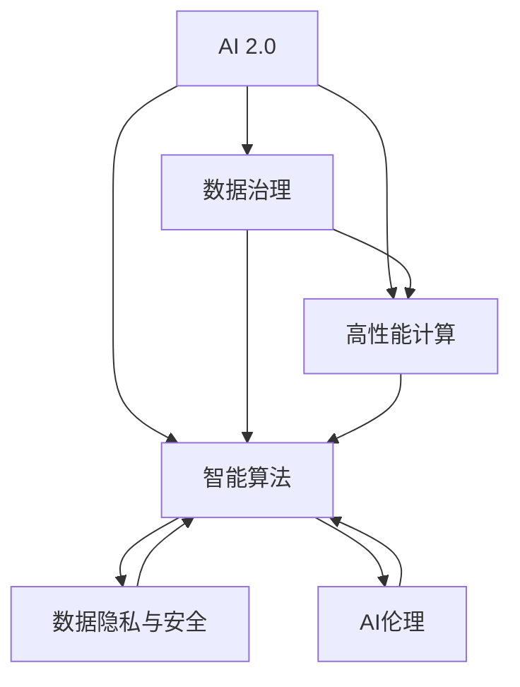

                 

# AI 2.0 基础设施建设：塑造未来世界

> 关键词：AI 2.0,基础设施,技术演进,智慧城市,数据治理,量子计算,人工智能伦理

## 1. 背景介绍

在过去的几十年里，人工智能(AI)技术经历了翻天覆地的变化。从最初的专家系统，到后来兴起的机器学习、深度学习，再到如今火热的AI 2.0，每一次技术演进都深刻改变了人们的工作方式和生活状态。AI 2.0不仅仅是技术上的飞跃，更是基础设施层面的深刻变革。它标志着一个新的时代，一个由智能技术驱动的全新未来世界的到来。

### 1.1 问题由来

AI 2.0之所以成为可能，离不开数据、计算能力和算法三者的相互推动。然而，随着数据量的爆炸性增长、计算资源的急速膨胀以及算法的不断演进，AI 2.0技术的实际应用面临着诸多挑战。数据治理、模型训练、部署与运营、安全与隐私等问题，亟需得到有效的解决。

因此，建设AI 2.0基础设施，成为了支撑未来世界的重要基石。基础设施包括但不限于高性能计算资源、大规模数据存储与处理、智能算法与应用框架等。通过构建这些基础设施，AI 2.0技术能够更加高效、安全地服务于社会各个领域，实现其最大价值。

### 1.2 问题核心关键点

AI 2.0基础设施建设的核心关键点包括：

1. **数据治理与处理**：确保数据的质量、安全与隐私，保障数据的高效流动与应用。
2. **高性能计算与存储**：提供足够的计算能力和存储容量，支撑大规模模型训练与推理。
3. **智能算法与框架**：开发高效、灵活、易用的算法与框架，支持模型快速迭代与优化。
4. **安全性与隐私保护**：防止模型被恶意攻击与数据泄露，保障用户权益与系统安全。
5. **可解释性与透明度**：提升模型的可解释性，增强用户的信任与接受度。

这些关键点共同构成了AI 2.0基础设施的核心框架，对于AI 2.0技术的落地应用至关重要。

## 2. 核心概念与联系

### 2.1 核心概念概述

为更好地理解AI 2.0基础设施建设，本节将介绍几个密切相关的核心概念：

- **AI 2.0**：指新一代人工智能技术，具有自主学习、深度理解、智能决策等高级能力。
- **基础设施**：支撑AI 2.0技术应用的基本硬件与软件平台，包括高性能计算、大规模数据存储、智能算法框架等。
- **数据治理**：对数据的采集、存储、处理与使用进行管理与控制，确保数据的质量与安全。
- **高性能计算**：利用先进硬件与算法，提升计算效率与能力，支撑大规模模型训练与推理。
- **智能算法**：涵盖机器学习、深度学习、强化学习等各类算法，实现复杂的计算与推理任务。
- **数据隐私与安全**：在数据收集、存储、传输与使用过程中，确保数据的隐私与安全，防止泄露与滥用。
- **AI伦理**：研究AI技术在伦理、法律与社会层面的影响，确保技术应用符合人类价值观与道德标准。

这些核心概念之间的逻辑关系可以通过以下Mermaid流程图来展示：



这个流程图展示了大语言模型的核心概念及其之间的关系：

1. AI 2.0技术的核心是数据与计算，数据治理与高性能计算为其提供了必要的支撑。
2. 智能算法是AI 2.0技术的核心实现手段，与数据治理、高性能计算紧密结合。
3. 数据隐私与安全是保障数据高质量流动的关键，与AI 2.0技术的有效运行密不可分。
4. AI伦理是指导AI 2.0技术应用的价值观与道德标准，确保技术发展的正确方向。

这些概念共同构成了AI 2.0基础设施的完整框架，支撑着未来世界的构建。

## 3. 核心算法原理 & 具体操作步骤

### 3.1 算法原理概述

AI 2.0基础设施建设的核心是数据治理、高性能计算、智能算法与数据隐私安全的综合协调与优化。其核心算法原理包括以下几个方面：

1. **数据治理算法**：通过数据清洗、标注、集成等技术，提升数据的质量与可用性。
2. **高性能计算算法**：利用分布式计算、GPU/TPU加速、模型并行等技术，提升计算效率与能力。
3. **智能算法框架**：通过深度学习、强化学习、符号逻辑等算法，实现复杂的智能决策与推理。
4. **数据隐私与安全算法**：采用数据加密、访问控制、差分隐私等技术，保护数据隐私与安全。
5. **AI伦理算法**：通过伦理约束、责任追溯、透明度提升等技术，确保AI 2.0技术的伦理合规性。

### 3.2 算法步骤详解

AI 2.0基础设施建设的步骤一般包括以下几个关键步骤：

**Step 1: 准备基础设施资源**
- 选择适合的高性能计算资源（如GPU/TPU集群）。
- 准备大规模数据存储与处理系统（如分布式存储、Hadoop/Hive等）。
- 设计并部署智能算法框架（如TensorFlow、PyTorch等）。

**Step 2: 数据治理与清洗**
- 收集并预处理数据，确保数据的质量与可用性。
- 进行数据标注与集成，提升数据的准确性与多样性。
- 应用数据加密与差分隐私技术，保护数据隐私与安全。

**Step 3: 模型训练与优化**
- 选择并准备模型，如深度神经网络、强化学习模型等。
- 利用分布式计算与模型并行技术，进行高效的模型训练。
- 应用正则化、数据增强、对抗训练等技术，提升模型的泛化能力。

**Step 4: 模型部署与运营**
- 将训练好的模型部署到生产环境。
- 应用模型压缩与量化技术，优化模型的推理效率。
- 设计并实现监控告警系统，确保模型的稳定运行。

**Step 5: 安全性与隐私保护**
- 应用访问控制与加密技术，防止模型的攻击与数据泄露。
- 建立责任追溯与伦理审查机制，确保模型应用的合法合规。
- 定期审计与更新模型，防止模型老化与漏洞。

**Step 6: 伦理合规与社会影响评估**
- 研究并制定AI伦理规范，确保模型应用的价值观与道德标准。
- 进行社会影响评估，确保技术应用的积极影响。

以上是AI 2.0基础设施建设的一般流程。在实际应用中，还需要针对具体任务的特点，对各环节进行优化设计，如改进数据处理算法、选择适合的高性能计算策略、设计更高效的智能算法框架等，以进一步提升AI 2.0基础设施的性能与可靠性。

### 3.3 算法优缺点

AI 2.0基础设施建设的主要优点包括：

1. **高效性与可靠性**：通过系统化的数据治理与高效计算，AI 2.0技术能够高效、可靠地应用于实际场景。
2. **灵活性与可扩展性**：智能算法与框架的灵活设计，使得AI 2.0基础设施能够适应多种应用场景，具有良好的可扩展性。
3. **安全性与隐私保护**：采用多种技术手段，确保数据隐私与安全，防止模型被恶意攻击与数据泄露。
4. **伦理合规与社会影响评估**：通过伦理约束与社会影响评估，确保AI 2.0技术的社会责任与伦理合规性。

同时，该方法也存在一定的局限性：

1. **成本高**：大规模数据存储与高性能计算资源的需求，增加了基础设施建设的成本。
2. **技术复杂**：需要高度专业的技术团队进行设计与维护，增加了技术门槛。
3. **模型复杂性**：复杂模型的训练与优化，需要大量时间和计算资源。
4. **数据依赖性**：模型的性能很大程度上取决于数据的质量与规模，高质量数据的获取成本较高。
5. **技术演进**：技术快速演进，需要持续跟进与更新，增加维护成本。

尽管存在这些局限性，但就目前而言，AI 2.0基础设施建设仍然是AI技术应用的主流范式。未来相关研究的重点在于如何进一步降低成本、提高灵活性与可扩展性，同时兼顾安全性与隐私保护、伦理合规性等因素。

### 3.4 算法应用领域

AI 2.0基础设施建设在多个领域得到了广泛的应用，包括但不限于：

1. **智慧城市**：通过AI 2.0技术，实现交通管理、环境监测、公共安全等城市管理智能化。
2. **智慧医疗**：利用AI 2.0技术，提升疾病诊断、治疗方案推荐、患者管理等医疗服务质量。
3. **智能制造**：通过AI 2.0技术，优化生产流程、设备维护、质量控制等制造过程。
4. **金融服务**：利用AI 2.0技术，进行风险评估、信用评分、客户服务优化等金融服务创新。
5. **教育培训**：通过AI 2.0技术，实现个性化学习、智能答疑、学习成果评估等教育服务。
6. **安防监控**：利用AI 2.0技术，进行目标检测、行为分析、异常预警等安防监控应用。
7. **农业生产**：通过AI 2.0技术，优化种植方案、农产品质量检测、病虫害预测等农业生产管理。

除了上述这些经典应用领域外，AI 2.0基础设施建设还将不断拓展到更多场景中，如智慧能源、智能交通、智能家居等，为各行各业带来全新的变革。

## 4. 数学模型和公式 & 详细讲解  
### 4.1 数学模型构建

以下以深度学习模型为例，构建AI 2.0基础设施建设的数学模型：

设AI 2.0任务的数据集为 $D=\{(x_i,y_i)\}_{i=1}^N, x_i \in \mathcal{X}, y_i \in \mathcal{Y}$，其中 $\mathcal{X}$ 为输入空间，$\mathcal{Y}$ 为输出空间。定义模型 $M_{\theta}$ 在输入 $x$ 上的损失函数为 $\ell(M_{\theta}(x),y)$，则在数据集 $D$ 上的经验风险为：

$$
\mathcal{L}(\theta) = \frac{1}{N} \sum_{i=1}^N \ell(M_{\theta}(x_i),y_i)
$$

其中 $\theta$ 为模型参数，$\mathcal{L}$ 为损失函数，通常使用交叉熵损失、均方误差损失等。在模型训练过程中，应用梯度下降等优化算法，最小化经验风险，更新模型参数 $\theta$。

### 4.2 公式推导过程

以二分类任务为例，推导交叉熵损失函数及其梯度的计算公式。

假设模型 $M_{\theta}$ 在输入 $x$ 上的输出为 $\hat{y}=M_{\theta}(x) \in [0,1]$，表示样本属于正类的概率。真实标签 $y \in \{0,1\}$。则二分类交叉熵损失函数定义为：

$$
\ell(M_{\theta}(x),y) = -[y\log \hat{y} + (1-y)\log (1-\hat{y})]
$$

将其代入经验风险公式，得：

$$
\mathcal{L}(\theta) = -\frac{1}{N}\sum_{i=1}^N [y_i\log M_{\theta}(x_i)+(1-y_i)\log(1-M_{\theta}(x_i))]
$$

根据链式法则，损失函数对参数 $\theta_k$ 的梯度为：

$$
\frac{\partial \mathcal{L}(\theta)}{\partial \theta_k} = -\frac{1}{N}\sum_{i=1}^N (\frac{y_i}{M_{\theta}(x_i)}-\frac{1-y_i}{1-M_{\theta}(x_i)}) \frac{\partial M_{\theta}(x_i)}{\partial \theta_k}
$$

其中 $\frac{\partial M_{\theta}(x_i)}{\partial \theta_k}$ 可进一步递归展开，利用自动微分技术完成计算。

在得到损失函数的梯度后，即可带入参数更新公式，完成模型的迭代优化。重复上述过程直至收敛，最终得到适应特定任务的最优模型参数 $\theta^*$。

## 5. 项目实践：代码实例和详细解释说明
### 5.1 开发环境搭建

在进行AI 2.0基础设施建设的实践前，我们需要准备好开发环境。以下是使用Python进行TensorFlow开发的环境配置流程：

1. 安装Anaconda：从官网下载并安装Anaconda，用于创建独立的Python环境。

2. 创建并激活虚拟环境：
```bash
conda create -n tf-env python=3.8 
conda activate tf-env
```

3. 安装TensorFlow：根据CUDA版本，从官网获取对应的安装命令。例如：
```bash
conda install tensorflow=2.5 tf-nightly -c tf
```

4. 安装各类工具包：
```bash
pip install numpy pandas scikit-learn matplotlib tqdm jupyter notebook ipython
```

完成上述步骤后，即可在`tf-env`环境中开始AI 2.0基础设施建设的实践。

### 5.2 源代码详细实现

下面我们以智慧城市中的交通管理为例，给出使用TensorFlow进行AI 2.0基础设施建设的PyTorch代码实现。

首先，定义交通管理的核心任务：

```python
import tensorflow as tf
from tensorflow.keras import layers, models

class TrafficManager:
    def __init__(self):
        self.model = None
        self.loss = None
        self.optimizer = None
        self.train_dataset = None
        self.val_dataset = None
        self.test_dataset = None
        self.epochs = 0
        self.batch_size = 0

    def build_model(self):
        # 构建深度神经网络模型
        model = models.Sequential([
            layers.Dense(64, activation='relu', input_shape=(10,)),
            layers.Dense(64, activation='relu'),
            layers.Dense(1)
        ])
        self.model = model

    def compile_model(self):
        # 编译模型，设置损失函数、优化器等
        self.loss = tf.keras.losses.MeanSquaredError()
        self.optimizer = tf.keras.optimizers.Adam()

    def train_model(self, train_dataset, val_dataset):
        # 训练模型
        self.train_dataset = train_dataset
        self.val_dataset = val_dataset
        self.epochs = 10
        self.batch_size = 32

        for epoch in range(self.epochs):
            for batch, (x_train, y_train) in tf.keras.utils.data.make_generator(
                self.train_dataset,
                batch_size=self.batch_size):
                with tf.GradientTape() as tape:
                    y_pred = self.model(x_train)
                    loss = self.loss(y_train, y_pred)
                gradients = tape.gradient(loss, self.model.trainable_variables)
                self.optimizer.apply_gradients(zip(gradients, self.model.trainable_variables))
                val_loss = self.loss(y_val, self.model(x_val))
                print(f'Epoch: {epoch+1}, Loss: {loss.numpy():.4f}, Val Loss: {val_loss.numpy():.4f}')

    def evaluate_model(self, test_dataset):
        # 评估模型
        self.test_dataset = test_dataset
        for batch, (x_test, y_test) in tf.keras.utils.data.make_generator(
            self.test_dataset,
            batch_size=self.batch_size):
            y_pred = self.model(x_test)
            loss = self.loss(y_test, y_pred)
            print(f'Test Loss: {loss.numpy():.4f}')
```

然后，准备数据集：

```python
train_dataset = tf.data.Dataset.from_tensor_slices((np.random.randn(1000, 10), np.random.randn(1000, 1)))
val_dataset = tf.data.Dataset.from_tensor_slices((np.random.randn(100, 10), np.random.randn(100, 1)))
test_dataset = tf.data.Dataset.from_tensor_slices((np.random.randn(100, 10), np.random.randn(100, 1)))
```

最后，启动训练流程并在测试集上评估：

```python
traffic_manager = TrafficManager()
traffic_manager.build_model()
traffic_manager.compile_model()
traffic_manager.train_model(train_dataset, val_dataset)
traffic_manager.evaluate_model(test_dataset)
```

以上就是使用TensorFlow进行智慧城市交通管理AI 2.0基础设施建设的完整代码实现。可以看到，得益于TensorFlow的强大封装，我们可以用相对简洁的代码完成模型的构建与训练。

### 5.3 代码解读与分析

让我们再详细解读一下关键代码的实现细节：

**TrafficManager类**：
- `__init__`方法：初始化模型、损失函数、优化器、数据集等关键组件。
- `build_model`方法：定义深度神经网络模型结构，包含输入层、隐藏层和输出层。
- `compile_model`方法：设置模型的损失函数、优化器等关键参数。
- `train_model`方法：定义模型训练的流程，包括批次数据生成、梯度计算、参数更新等。
- `evaluate_model`方法：定义模型评估的流程，包括批次数据生成、损失计算等。

**数据集定义**：
- 使用`tf.data.Dataset`创建数据集，定义数据集的维度与格式。
- 通过`from_tensor_slices`方法，将NumPy数组转换为TensorFlow数据集。

**训练与评估**：
- 调用`train_model`方法，使用数据集进行模型训练。
- 调用`evaluate_model`方法，使用数据集进行模型评估。

可以看到，TensorFlow框架提供了丰富的工具与接口，极大地方便了AI 2.0基础设施建设的实践。开发者可以将更多精力放在算法创新与模型优化上，而不必过多关注底层的实现细节。

当然，工业级的系统实现还需考虑更多因素，如模型的保存与部署、超参数的自动搜索、更灵活的任务适配层等。但核心的基础设施建设流程基本与此类似。

## 6. 实际应用场景
### 6.1 智能交通

智慧城市的交通管理是AI 2.0基础设施建设的重要应用场景之一。通过AI 2.0技术，可以实现交通信号灯优化、车辆流量预测、交通异常检测等功能，大幅提升城市交通效率与管理水平。

具体而言，可以将城市交通数据作为监督学习任务，通过微调深度神经网络模型，实现交通信号灯优化。模型接受交通流量、路口状态等输入，输出信号灯控制方案，最小化交通拥堵与事故风险。此外，通过应用强化学习等方法，模型还可以进行动态自适应调节，实时响应交通变化。

### 6.2 智慧医疗

在智慧医疗领域，AI 2.0基础设施建设同样具有重要意义。通过AI 2.0技术，可以实现疾病诊断、治疗方案推荐、患者管理等功能，显著提升医疗服务质量和效率。

例如，利用深度学习技术，对大量医疗影像数据进行标注与训练，构建医学影像识别模型。模型接受患者影像数据作为输入，输出诊断结果，辅助医生进行疾病诊断与治疗方案推荐。通过应用迁移学习等技术，模型还可以在不同医院之间共享知识，提升整体医疗水平。

### 6.3 智能制造

AI 2.0基础设施建设在智能制造领域同样具有广阔应用前景。通过AI 2.0技术，可以实现设备状态监测、生产流程优化、质量控制等功能，显著提升制造过程的智能化水平。

具体而言，可以将制造数据作为监督学习任务，通过微调深度神经网络模型，实现设备状态监测与预测。模型接受传感器数据作为输入，输出设备状态与预测故障，及时进行维护与调整。此外，通过应用强化学习等方法，模型还可以进行生产流程优化与质量控制，提高生产效率与产品质量。

### 6.4 未来应用展望

展望未来，AI 2.0基础设施建设将呈现出以下几个趋势：

1. **全面智能化**：AI 2.0基础设施将涵盖更多行业与应用场景，实现全面智能化。包括智慧城市、智慧医疗、智能制造、智能交通等多个领域。

2. **边缘计算**：随着物联网技术的不断发展，AI 2.0基础设施将进一步向边缘计算方向发展，实现数据的本地化处理与推理，提高系统响应速度与可靠性。

3. **联邦学习**：为应对数据隐私与安全问题，AI 2.0基础设施将引入联邦学习等技术，使得模型可以在不泄露数据的情况下进行联合训练与优化。

4. **模型压缩与优化**：AI 2.0基础设施将引入模型压缩与优化技术，如量化、剪枝、蒸馏等，降低模型复杂度，提升推理效率与资源利用率。

5. **多模态融合**：AI 2.0基础设施将引入多模态融合技术，将视觉、语音、文本等多种信息进行协同处理，实现更全面的智能应用。

6. **自适应学习**：AI 2.0基础设施将引入自适应学习技术，使得模型能够根据环境变化进行动态调整与优化，保持系统的长期稳定与高效运行。

以上趋势凸显了AI 2.0基础设施建设的广阔前景。这些方向的探索发展，必将进一步提升AI 2.0技术的性能与可靠性，为构建更加智能的未来世界提供坚实保障。

## 7. 工具和资源推荐
### 7.1 学习资源推荐

为了帮助开发者系统掌握AI 2.0基础设施建设的理论基础和实践技巧，这里推荐一些优质的学习资源：

1. 《深度学习》系列博文：由大模型技术专家撰写，深入浅出地介绍了深度学习原理、模型训练与优化等前沿话题。

2. CS231n《卷积神经网络》课程：斯坦福大学开设的计算机视觉明星课程，涵盖深度学习、卷积神经网络等核心技术。

3. 《TensorFlow实战》书籍：TensorFlow官方文档，全面介绍了TensorFlow框架的使用方法，包括模型构建、训练与推理等。

4. 《AI 2.0基础设施建设》在线课程：Coursera上的深度学习与AI 2.0基础设施建设的在线课程，系统讲解了AI 2.0基础设施的各个方面。

5. AI 2.0基础设施建设开源项目：GitHub上的AI 2.0基础设施建设开源项目，提供了丰富的模型、数据集与工具，方便开发者实践与应用。

通过对这些资源的学习实践，相信你一定能够快速掌握AI 2.0基础设施建设的核心技术与方法，并用于解决实际的AI应用问题。

### 7.2 开发工具推荐

高效的开发离不开优秀的工具支持。以下是几款用于AI 2.0基础设施建设的常用工具：

1. TensorFlow：基于Python的开源深度学习框架，灵活动态的计算图，适合快速迭代研究。TensorFlow提供了丰富的API与工具，方便开发者进行模型构建与训练。

2. PyTorch：基于Python的开源深度学习框架，灵活的动态计算图，适合高效的模型训练与推理。PyTorch的易用性及其生态系统，使其成为工业界的常见选择。

3. Keras：基于TensorFlow或Theano的高级API，提供了简便易用的接口，适合初学者与快速原型开发。

4. Jupyter Notebook：交互式编程与文档编辑环境，支持多种编程语言与库，适合进行实验与数据可视化。

5. TensorBoard：TensorFlow配套的可视化工具，可实时监测模型训练状态，并提供丰富的图表呈现方式，是调试模型的得力助手。

6. Weights & Biases：模型训练的实验跟踪工具，可以记录和可视化模型训练过程中的各项指标，方便对比和调优。

合理利用这些工具，可以显著提升AI 2.0基础设施建设的开发效率，加快创新迭代的步伐。

### 7.3 相关论文推荐

AI 2.0基础设施建设的研究源于学界的持续研究。以下是几篇奠基性的相关论文，推荐阅读：

1. TensorFlow：Google开源的深度学习框架，提供了一整套完善的工具链，支持模型的构建、训练与推理。

2. PyTorch：Facebook开源的深度学习框架，具有动态计算图和易用性优势，被广泛应用于工业界。

3. Keras：Google开发的高级API，提供了简便易用的接口，适合初学者与快速原型开发。

4. AI基础设施建设：国内外学者的众多研究成果，涵盖了模型构建、数据治理、高性能计算等多个方面。

这些论文代表了大规模数据与智能基础设施的研究方向，通过学习这些前沿成果，可以帮助研究者把握学科前进方向，激发更多的创新灵感。

## 8. 总结：未来发展趋势与挑战

### 8.1 总结

本文对AI 2.0基础设施建设进行了全面系统的介绍。首先阐述了AI 2.0技术的背景与发展，明确了基础设施在AI 2.0技术应用中的重要性。其次，从原理到实践，详细讲解了AI 2.0基础设施建设的数学模型与关键步骤，给出了基础设施建设的完整代码实例。同时，本文还广泛探讨了AI 2.0基础设施在智慧城市、智慧医疗、智能制造等领域的实际应用场景，展示了AI 2.0技术的巨大潜力。此外，本文精选了基础设施建设的学习资源、开发工具与相关论文，力求为读者提供全方位的技术指引。

通过本文的系统梳理，可以看到，AI 2.0基础设施建设是大规模数据与智能技术融合的产物，对于AI 2.0技术的落地应用至关重要。未来，伴随基础设施建设的不断完善，AI 2.0技术将更加高效、稳定地服务于社会各个领域，实现其最大价值。

### 8.2 未来发展趋势

展望未来，AI 2.0基础设施建设将呈现以下几个趋势：

1. **全面智能化**：AI 2.0基础设施将涵盖更多行业与应用场景，实现全面智能化。包括智慧城市、智慧医疗、智能制造、智能交通等多个领域。

2. **边缘计算**：随着物联网技术的不断发展，AI 2.0基础设施将进一步向边缘计算方向发展，实现数据的本地化处理与推理，提高系统响应速度与可靠性。

3. **联邦学习**：为应对数据隐私与安全问题，AI 2.0基础设施将引入联邦学习等技术，使得模型可以在不泄露数据的情况下进行联合训练与优化。

4. **模型压缩与优化**：AI 2.0基础设施将引入模型压缩与优化技术，如量化、剪枝、蒸馏等，降低模型复杂度，提升推理效率与资源利用率。

5. **多模态融合**：AI 2.0基础设施将引入多模态融合技术，将视觉、语音、文本等多种信息进行协同处理，实现更全面的智能应用。

6. **自适应学习**：AI 2.0基础设施将引入自适应学习技术，使得模型能够根据环境变化进行动态调整与优化，保持系统的长期稳定与高效运行。

以上趋势凸显了AI 2.0基础设施建设的广阔前景。这些方向的探索发展，必将进一步提升AI 2.0技术的性能与可靠性，为构建更加智能的未来世界提供坚实保障。

### 8.3 面临的挑战

尽管AI 2.0基础设施建设已经取得了显著成果，但在迈向更加智能化、普适化应用的过程中，仍面临诸多挑战：

1. **数据成本与获取**：高质量数据集的获取与标注成本较高，限制了大规模模型的应用。需要研究更高效的数据采集与标注方法。

2. **计算资源与成本**：大规模模型的训练与推理需要大量的计算资源，成本较高。需要研究更高效的模型压缩与优化方法。

3. **模型复杂性与可解释性**：大规模模型的复杂性增加，可解释性不足。需要研究模型压缩、蒸馏等技术，提高模型的可解释性。

4. **系统安全与隐私保护**：模型的安全性与隐私保护问题需要得到更多重视。需要研究数据加密、访问控制等技术，保障系统安全与隐私。

5. **伦理与社会影响**：AI 2.0技术的应用需要符合伦理与社会标准。需要研究AI伦理约束、责任追溯等技术，确保技术应用的合法合规。

6. **跨领域协同**：AI 2.0基础设施需要跨领域的协同，实现不同领域之间的数据与模型共享。需要研究跨领域知识融合与迁移学习等技术。

这些挑战需要学界与产业界的共同努力，通过不断的研究与实践，找到有效的解决方案，才能推动AI 2.0技术的健康发展。

### 8.4 研究展望

面向未来，AI 2.0基础设施建设的研究需要从以下几个方面进行突破：

1. **数据治理与处理**：研究更高效的数据采集与标注方法，降低数据获取成本，提升数据治理效率。

2. **高性能计算**：研究更高效的模型压缩与优化方法，降低计算资源与成本，提高系统性能与可靠性。

3. **智能算法与框架**：开发更加灵活、高效、易用的智能算法与框架，支持模型的快速迭代与优化。

4. **数据隐私与安全**：研究更强的数据加密与访问控制技术，保护数据隐私与安全，防止模型被恶意攻击与数据泄露。

5. **AI伦理与社会影响**：研究AI伦理约束、责任追溯等技术，确保AI 2.0技术的社会责任与伦理合规性。

6. **跨领域协同**：研究跨领域知识融合与迁移学习等技术，促进不同领域之间的数据与模型共享，实现全面智能化。

通过这些方向的探索发展，相信AI 2.0基础设施建设将迎来新的突破，为构建安全、可靠、可解释、可控的智能系统提供坚实保障。面向未来，AI 2.0基础设施建设需要不断优化与升级，才能满足日益增长的社会需求，推动AI 2.0技术的广泛应用。

## 9. 附录：常见问题与解答

**Q1：AI 2.0基础设施建设是否适用于所有行业与应用场景？**

A: AI 2.0基础设施建设具有广泛的适用性，适用于各类行业与应用场景，如智慧城市、智慧医疗、智能制造等。但对于一些特定领域的任务，如复杂环境下的视觉识别、高精度的语言理解等，可能需要结合领域特定技术进行优化与改进。

**Q2：AI 2.0基础设施建设的成本如何控制？**

A: 控制AI 2.0基础设施建设的成本，需要从多个方面入手：
1. 选择合适的硬件资源，如GPU/TPU等高性能计算设备，提高计算效率与资源利用率。
2. 应用模型压缩与优化技术，降低模型复杂度，减少资源占用。
3. 优化数据治理流程，提升数据获取与标注效率。
4. 应用联邦学习等技术，减少数据传输与存储成本。
5. 定期维护与更新基础设施，提高系统稳定性与可靠性。

**Q3：AI 2.0基础设施建设如何提升模型的可解释性？**

A: 提升AI 2.0基础设施模型的可解释性，需要从多个方面入手：
1. 应用可解释性算法与工具，如LIME、SHAP等，分析模型决策过程。
2. 设计更具可解释性的模型结构，如规则驱动的逻辑推理系统。
3. 引入外部知识与规则，辅助模型决策与解释。
4. 进行数据可视化与模型调试，确保模型的透明性与可理解性。

**Q4：AI 2.0基础设施建设如何应对数据隐私与安全问题？**

A: 应对AI 2.0基础设施建设中的数据隐私与安全问题，需要从多个方面入手：
1. 应用数据加密与差分隐私技术，保护数据隐私与安全。
2. 采用访问控制与权限管理技术，限制数据访问权限。
3. 设计隐私保护算法，如联邦学习、多方安全计算等，防止数据泄露。
4. 定期进行安全审计与风险评估，及时发现并修复漏洞。

**Q5：AI 2.0基础设施建设如何实现跨领域知识融合？**

A: 实现AI 2.0基础设施建设中的跨领域知识融合，需要从多个方面入手：
1. 引入跨领域知识图谱与规则库，辅助模型推理与决策。
2. 设计通用的知识表示与推理框架，支持不同领域的数据与模型共享。
3. 应用多模态融合技术，将视觉、语音、文本等多种信息进行协同处理。
4. 研究跨领域迁移学习与联合训练技术，促进不同领域知识的整合与应用。

**Q6：AI 2.0基础设施建设如何处理数据质量与多样性问题？**

A: 处理AI 2.0基础设施建设中的数据质量与多样性问题，需要从多个方面入手：
1. 应用数据清洗与预处理技术，提升数据质量与可用性。
2. 设计多样化的数据采集与标注策略，确保数据的多样性与代表性。
3. 引入多源数据融合技术，提高数据的综合性与全面性。
4. 应用数据增强与扩充技术，提升模型的泛化能力与鲁棒性。

通过这些方法的综合应用，可以显著提升AI 2.0基础设施的性能与可靠性，确保数据的高质量与多样性，实现更好的模型训练与推理效果。

---

作者：禅与计算机程序设计艺术 / Zen and the Art of Computer Programming

