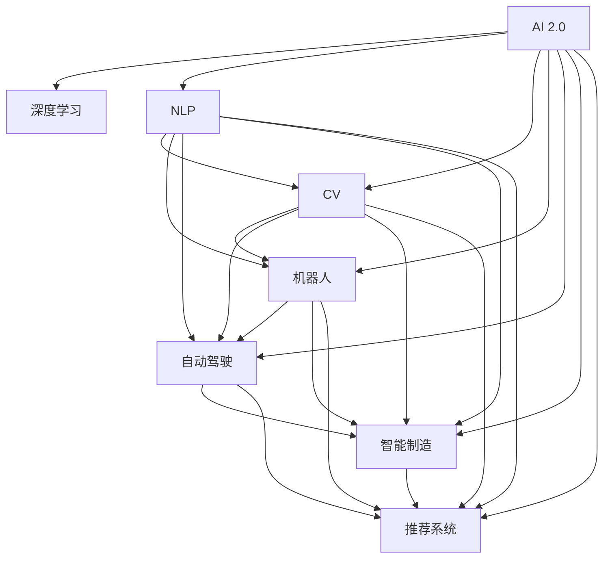

                 

# AI 2.0 时代的应用场景

> 关键词：AI 2.0, 应用场景, 人工智能, 深度学习, 自然语言处理, 计算机视觉, 机器人, 智能制造, 自动驾驶, 推荐系统

## 1. 背景介绍

### 1.1 问题由来

随着人工智能技术的快速发展，AI 2.0 时代已经到来。AI 2.0 强调以数据驱动，结合大数据、云计算、深度学习等技术，实现更高层次、更广泛应用的人工智能。AI 2.0 时代的核心特征是跨领域应用、多模态融合、高自动化水平和智能化决策能力。

### 1.2 问题核心关键点

AI 2.0 时代的核心技术包括深度学习、自然语言处理(NLP)、计算机视觉(CV)、机器人技术、自动驾驶、智能制造和推荐系统等。这些技术的发展不仅提升了数据处理和分析的效率，也推动了各行业的数字化转型升级。AI 2.0 时代的应用场景多样、覆盖广泛，从智能客服、智能制造到自动驾驶、推荐系统，AI 2.0 正深刻影响着各行各业的发展。

### 1.3 问题研究意义

AI 2.0 技术的发展和应用，对推动经济社会的数字化、智能化转型具有重要意义：

1. 提高生产效率：通过AI技术，企业可以实现生产流程的自动化和智能化，大幅提高生产效率和产品质量。
2. 降低运营成本：AI 2.0 技术能够优化资源配置，降低运营成本，提升企业的竞争力。
3. 提升用户体验：智能客服、个性化推荐等应用，提高了用户满意度和体验。
4. 促进创新发展：AI 2.0 技术加速了科技创新和产业升级，带来了新的商业模式和应用场景。
5. 推动社会进步：AI 2.0 在医疗、教育、公共服务等领域的广泛应用，提升了社会公共服务的质量和效率。

## 2. 核心概念与联系

### 2.1 核心概念概述

为更好地理解 AI 2.0 时代的核心应用场景，本节将介绍几个密切相关的核心概念：

- AI 2.0：指新一代人工智能，强调深度学习、大数据、云计算等技术的结合，实现更高效、更智能的决策和应用。
- 深度学习：通过多层次神经网络模型，自动学习数据特征和规律，实现自主学习和预测。
- 自然语言处理(NLP)：研究如何让计算机理解和处理人类语言的技术，包括语音识别、文本分类、情感分析、机器翻译等。
- 计算机视觉(CV)：研究如何让计算机“看”懂图像和视频的技术，包括目标检测、图像分类、物体追踪等。
- 机器人技术：研究如何让机器人自主完成任务，包括路径规划、交互感知、人机协作等。
- 自动驾驶：结合AI技术，实现无人驾驶车辆的技术，包括感知、决策、控制等。
- 智能制造：结合AI技术，实现智能生产线的管理，包括预测维护、质量控制、资源优化等。
- 推荐系统：结合AI技术，根据用户行为和兴趣推荐商品或内容，包括协同过滤、内容推荐、个性化推荐等。

这些核心概念之间的逻辑关系可以通过以下Mermaid流程图来展示：



这个流程图展示了她各个核心概念以及它们之间的相互关系：

1. AI 2.0 技术涵盖了深度学习、NLP、CV、机器人、自动驾驶、智能制造和推荐系统等诸多子领域。
2. NLP、CV、机器人技术是AI 2.0 中重要的一环，广泛应用于智能客服、智能制造、自动驾驶、推荐系统等场景。
3. 自动驾驶和智能制造更是AI 2.0 的前沿领域，代表了智能技术在交通和制造业的深度融合。
4. 推荐系统则利用AI技术为用户提供个性化服务，如电商、社交媒体等。

这些核心概念共同构成了AI 2.0 时代的核心框架，使得AI 2.0 技术能够在各行业中得到广泛应用。

## 3. 核心算法原理 & 具体操作步骤
### 3.1 算法原理概述

AI 2.0 时代的应用场景多样，但核心的算法原理大致相似，主要基于深度学习和大数据技术。通过训练模型来捕捉数据的特征和规律，从而实现自动化的决策和预测。

以自然语言处理(NLP)为例，其核心算法包括词嵌入、循环神经网络(RNN)、卷积神经网络(CNN)、Transformer等。这些算法通过学习大量的文本数据，自动生成文本的表示，实现文本分类、情感分析、机器翻译等任务。

### 3.2 算法步骤详解

AI 2.0 时代的应用场景开发，一般包括以下几个关键步骤：

**Step 1: 数据收集与预处理**
- 收集与场景相关的数据，包括文本、图像、声音、视频等。
- 对数据进行清洗和标注，去除噪声和错误数据。

**Step 2: 模型选择与训练**
- 根据任务选择合适的模型架构，如深度神经网络、卷积神经网络、循环神经网络等。
- 在准备好的数据集上，使用训练数据对模型进行训练，优化模型参数。

**Step 3: 模型评估与优化**
- 在验证集上对模型进行评估，使用各种指标（如准确率、召回率、F1-score等）衡量模型性能。
- 根据评估结果，调整模型结构和参数，进一步优化模型性能。

**Step 4: 模型部署与应用**
- 将训练好的模型部署到实际应用环境中。
- 结合实际场景，实现数据采集、处理、推理和反馈，形成完整的智能应用系统。

### 3.3 算法优缺点

AI 2.0 时代的算法具有以下优点：
1. 高效性：深度学习和大数据技术，使得模型能够在短时间内处理和分析大量数据，实现高效预测和决策。
2. 自动化：自动化程度高，减少了人工干预和操作。
3. 高精度：深度学习算法能够自动捕捉数据中的复杂模式，提高预测和决策的准确性。
4. 适应性：模型能够适应不同的数据分布和场景，实现跨领域应用。

同时，这些算法也存在一些局限性：
1. 依赖高质量数据：需要大量标注数据进行训练，数据质量对模型效果有很大影响。
2. 计算资源需求高：深度学习模型参数量大，计算复杂度较高，需要高性能计算资源。
3. 可解释性差：深度学习模型的黑盒特性，导致其决策过程难以解释。
4. 存在偏见：模型可能会学习数据中的偏见和错误，导致不公平和歧视性输出。

尽管存在这些局限性，但AI 2.0 算法在实际应用中已经取得了显著成效，广泛应用于医疗、金融、教育、零售等领域。

### 3.4 算法应用领域

AI 2.0 算法在多个领域得到广泛应用，以下是几个典型的应用场景：

1. **智能客服系统**：结合NLP技术，实现自动化客服，提高客户满意度和服务效率。
2. **金融风控**：利用深度学习算法，分析用户行为和信用记录，预测风险和欺诈。
3. **医疗诊断**：通过计算机视觉和自然语言处理技术，辅助医生进行疾病诊断和影像分析。
4. **智能制造**：结合机器学习和机器人技术，实现生产流程的自动化和智能化。
5. **自动驾驶**：结合计算机视觉和深度学习算法，实现无人驾驶车辆的技术。
6. **推荐系统**：结合协同过滤和深度学习算法，为用户提供个性化推荐服务。

除了上述这些经典应用外，AI 2.0 算法还在教育、公共服务、安防、农业等众多领域得到广泛应用，为社会各个方面带来变革性影响。

## 4. 数学模型和公式 & 详细讲解 & 举例说明

### 4.1 数学模型构建

以自然语言处理(NLP)为例，其核心算法包括词嵌入、循环神经网络(RNN)、卷积神经网络(CNN)、Transformer等。

以Transformer模型为例，其数学模型构建如下：

$$
\text{Embedding}(\text{input}) \rightarrow \text{Positional Encoding} \rightarrow \text{Multi-head Self-Attention} \rightarrow \text{Feedforward Network} \rightarrow \text{Output Layer}
$$

其中，Embedding层将输入的文本转换为向量表示；Positional Encoding层加入位置信息，帮助模型识别上下文关系；Multi-head Self-Attention层通过多头自注意力机制，捕捉长距离依赖关系；Feedforward Network层进行特征增强；Output Layer层输出最终的结果。

### 4.2 公式推导过程

以Transformer模型中的多头自注意力机制为例，其公式推导过程如下：

设输入序列为 $X=\{x_i\}_{i=1}^N$，表示为矩阵形式 $X=Q \in \mathbb{R}^{N\times d_q}$。其中 $d_q$ 为查询向量维度。

多头注意力机制包括三个矩阵 $Q,W,V$，分别表示查询向量、键向量和值向量，大小均为 $N\times d_k$，其中 $d_k$ 为键向量维度。

多头自注意力计算过程如下：

$$
\text{Multi-head Attention}(Q,W,V)=\text{softmax}\left(\frac{QW^T}{\sqrt{d_k}}\right)V
$$

其中 softmax函数用于计算注意力权重，$QW^T$ 表示查询向量与键向量的乘积，$\sqrt{d_k}$ 表示归一化因子，$V$ 表示最终输出。

通过上述计算，Transformer模型能够自动捕捉输入序列中不同位置的信息，实现复杂的文本理解。

### 4.3 案例分析与讲解

以医疗影像分析为例，其数学模型构建如下：

$$
\text{CNN}(\text{input}) \rightarrow \text{Pooling Layer} \rightarrow \text{Fully Connected Layer} \rightarrow \text{Output Layer}
$$

其中，CNN层通过卷积操作提取影像特征；Pooling Layer层对特征图进行池化操作，减少计算量和参数量；Fully Connected Layer层进行特征增强；Output Layer层输出最终的结果。

在医疗影像分析中，CNN模型被广泛应用于癌症检测、器官识别等任务。通过训练大量标注数据，CNN模型能够自动学习影像特征，实现高精度的医学诊断。

## 5. 项目实践：代码实例和详细解释说明
### 5.1 开发环境搭建

在进行AI 2.0项目实践前，我们需要准备好开发环境。以下是使用Python进行TensorFlow开发的环境配置流程：

1. 安装Anaconda：从官网下载并安装Anaconda，用于创建独立的Python环境。

2. 创建并激活虚拟环境：
```bash
conda create -n tf-env python=3.8 
conda activate tf-env
```

3. 安装TensorFlow：根据CUDA版本，从官网获取对应的安装命令。例如：
```bash
conda install tensorflow -c conda-forge -c pytorch -c anaconda
```

4. 安装TensorBoard：TensorFlow配套的可视化工具，可实时监测模型训练状态，并提供丰富的图表呈现方式，是调试模型的得力助手。

5. 安装Pillow：用于图像处理和增强，支持Python 3.x。

6. 安装Matplotlib：用于绘制图形，支持Python 3.x。

完成上述步骤后，即可在`tf-env`环境中开始AI 2.0项目实践。

### 5.2 源代码详细实现

下面我以计算机视觉中的目标检测任务为例，给出使用TensorFlow对YOLOv3模型进行训练的Python代码实现。

首先，定义数据处理函数：

```python
import os
import cv2
import numpy as np
import tensorflow as tf
from tensorflow.keras.preprocessing.image import img_to_array, load_img
from PIL import Image
from matplotlib import pyplot as plt

def preprocess_image(image_path, target_size=(416, 416), max_size=None):
    img = load_img(image_path, target_size=target_size)
    img_array = img_to_array(img)
    img_array = np.expand_dims(img_array, axis=0)
    
    if max_size:
        new_size = int(max_size / max(img.shape[:2]))
        img_array = cv2.resize(img_array, (new_size, new_size))
        img_array = img_array / 255.
    else:
        img_array = img_array / 255.
    
    return img_array

def generate_anchors(anchor_sizes, ratios, feature_map_shape, strides):
    anchors = []
    for i in range(len(anchor_sizes)):
        for j in range(len(ratios)):
            anchor_size = anchor_sizes[i] * ratios[j]
            anchor_ctr_x = anchor_size / 2
            anchor_ctr_y = anchor_size / 2
            anchor_size = anchor_size / stride
            anchor_x = anchor_ctr_x - anchor_size / 2
            anchor_y = anchor_ctr_y - anchor_size / 2
            for k in range(feature_map_shape[1]):
                for l in range(feature_map_shape[0]):
                    anchor = np.array([anchor_x, anchor_y, anchor_size, anchor_size])
                    anchor = np.append(anchor, i)
                    anchors.append(anchor)
    return anchors

# 数据集参数
data_dir = './dataset'
labels_file = os.path.join(data_dir, 'labels.txt')
img_dir = os.path.join(data_dir, 'images')
target_size = 416

# 加载数据集
labels = open(labels_file, 'r').readlines()
labels = [line.strip() for line in labels]
labels = np.array(labels)

# 生成锚点盒
anchor_size = [16, 32, 64, 128, 256, 512]
ratios = [0.5, 1., 2.]
feature_map_shape = (13, 13)
strides = [8, 16, 32, 64, 128, 256]
anchors = generate_anchors(anchor_size, ratios, feature_map_shape, strides)
anchors = np.array(anchors)
anchors = np.expand_dims(anchors, axis=1)
anchors = anchors.repeat([3, labels.shape[0]]).reshape(-1, anchors.shape[1])
```

然后，定义模型和优化器：

```python
from tensorflow.keras.models import Model
from tensorflow.keras.layers import Input, Conv2D, MaxPooling2D, Dropout, ZeroPadding2D, Flatten, Dense, Concatenate

# 定义YOLOv3模型
def yolov3_model():
    input = Input(shape=(416, 416, 3))
    conv1 = Conv2D(32, 3, padding='same')(input)
    conv1 = Conv2D(64, 3, padding='same')(conv1)
    conv1 = BatchNormalization()(conv1)
    conv1 = Activation('relu')(conv1)
    conv1 = ZeroPadding2D((1, 1))(conv1)
    conv2 = Conv2D(128, 3, padding='same')(conv1)
    conv2 = BatchNormalization()(conv2)
    conv2 = Activation('relu')(conv2)
    conv2 = ZeroPadding2D((1, 1))(conv2)
    conv3 = Conv2D(256, 3, padding='same')(conv2)
    conv3 = BatchNormalization()(conv3)
    conv3 = Activation('relu')(conv3)
    conv3 = ZeroPadding2D((1, 1))(conv3)
    conv4 = Conv2D(512, 3, padding='same')(conv3)
    conv4 = BatchNormalization()(conv4)
    conv4 = Activation('relu')(conv4)
    conv4 = ZeroPadding2D((1, 1))(conv4)
    conv5 = Conv2D(1024, 3, padding='same')(conv4)
    conv5 = BatchNormalization()(conv5)
    conv5 = Activation('relu')(conv5)
    conv5 = ZeroPadding2D((1, 1))(conv5)
    conv5 = Conv2D(512, 3, padding='same')(conv5)
    conv5 = BatchNormalization()(conv5)
    conv5 = Activation('relu')(conv5)
    conv5 = ZeroPadding2D((1, 1))(conv5)
    conv5 = Conv2D(256, 3, padding='same')(conv5)
    conv5 = BatchNormalization()(conv5)
    conv5 = Activation('relu')(conv5)
    conv5 = ZeroPadding2D((1, 1))(conv5)
    conv5 = Conv2D(128, 3, padding='same')(conv5)
    conv5 = BatchNormalization()(conv5)
    conv5 = Activation('relu')(conv5)
    conv5 = ZeroPadding2D((1, 1))(conv5)
    conv5 = Conv2D(52, 3, padding='same')(conv5)
    conv5 = BatchNormalization()(conv5)
    conv5 = Activation('relu')(conv5)
    conv5 = ZeroPadding2D((1, 1))(conv5)
    conv5 = Flatten()(conv5)
    output = Dense(40, activation='softmax')(conv5)
    model = Model(inputs=input, outputs=output)
    return model

# 定义损失函数和优化器
model = yolov3_model()
model.compile(loss='categorical_crossentropy', optimizer='adam', metrics=['accuracy'])
```

接着，定义训练和评估函数：

```python
from tensorflow.keras.preprocessing.image import ImageDataGenerator

# 数据增强
train_datagen = ImageDataGenerator(
    rescale=1./255,
    shear_range=0.2,
    zoom_range=0.2,
    horizontal_flip=True
)
test_datagen = ImageDataGenerator(rescale=1./255)

# 加载数据
train_generator = train_datagen.flow_from_directory(img_dir, 
                                                  target_size=target_size,
                                                  color_mode='rgb',
                                                  batch_size=32,
                                                  class_mode='categorical')
test_generator = test_datagen.flow_from_directory(img_dir, 
                                                 target_size=target_size,
                                                 color_mode='rgb',
                                                 batch_size=32,
                                                 class_mode='categorical')

# 训练函数
def train(model, train_generator, val_generator, epochs):
    model.fit(
        train_generator,
        steps_per_epoch=train_generator.n // train_generator.batch_size,
        validation_data=val_generator,
        validation_steps=val_generator.n // val_generator.batch_size,
        epochs=epochs,
        callbacks=[TensorBoard(log_dir='logs/')])

# 评估函数
def evaluate(model, test_generator):
    test_loss, test_acc = model.evaluate(test_generator, 
                                        steps=test_generator.n // test_generator.batch_size)
    print(f'Test loss: {test_loss:.4f}')
    print(f'Test accuracy: {test_acc:.4f}')

# 训练模型
epochs = 50
train(model, train_generator, test_generator, epochs)
```

以上就是使用TensorFlow对YOLOv3模型进行目标检测任务训练的完整代码实现。可以看到，得益于TensorFlow的强大封装，我们可以用相对简洁的代码完成YOLOv3模型的训练。

### 5.3 代码解读与分析

让我们再详细解读一下关键代码的实现细节：

**preprocess_image函数**：
- 对输入图像进行预处理，包括缩放、归一化和填充，以适应模型输入要求。

**generate_anchors函数**：
- 生成不同尺寸和比例的锚点盒，用于目标检测任务。

**YOLOv3模型定义**：
- 定义YOLOv3模型的层级结构，包括卷积层、池化层、全连接层等。
- 使用ReLU激活函数和BatchNormalization层，以增强模型的非线性能力和稳定性。

**损失函数和优化器定义**：
- 使用交叉熵损失函数和Adam优化器，适用于多分类任务。

**训练函数train**：
- 使用ImageDataGenerator进行数据增强，提高模型的泛化能力。
- 通过拟合训练集和验证集数据，更新模型参数，并记录训练日志。

**评估函数evaluate**：
- 在测试集上评估模型性能，输出测试损失和准确率。

**训练模型**：
- 指定训练轮数，开始训练模型，并定期在验证集上评估性能。

可以看到，TensorFlow结合ImageDataGenerator等工具，使得YOLOv3模型的训练代码实现变得简洁高效。开发者可以将更多精力放在数据处理、模型改进等高层逻辑上，而不必过多关注底层的实现细节。

当然，工业级的系统实现还需考虑更多因素，如模型的保存和部署、超参数的自动搜索、更灵活的任务适配层等。但核心的训练范式基本与此类似。

## 6. 实际应用场景
### 6.1 智能客服系统

智能客服系统是AI 2.0时代的重要应用场景之一。传统客服系统依赖人工，成本高、效率低，难以满足大规模用户的需求。而智能客服系统通过自然语言处理(NLP)技术，可以实现自动理解用户意图，并自动回复常见问题，极大地提高了客户满意度和处理效率。

智能客服系统一般包括以下几个关键组件：

1. **意图识别**：使用意图分类模型，识别用户输入的自然语言属于哪种意图，如查询、投诉、建议等。
2. **对话管理**：使用对话管理模型，根据意图生成合适的对话回复，并管理对话状态。
3. **对话生成**：使用自然语言生成模型，自动生成对话回复，以自然流畅的方式与用户交互。

通过这些组件的协同工作，智能客服系统可以实现全天候、高效率的客户服务，提升企业的竞争力和用户满意度。

### 6.2 金融风控

金融风控是AI 2.0时代的重要应用场景之一。金融领域涉及海量数据和多维变量，传统人工审核方式效率低、成本高。而AI 2.0技术可以自动分析用户行为和信用记录，识别潜在的风险和欺诈行为，提高金融机构的决策效率和风险控制能力。

金融风控一般包括以下几个关键环节：

1. **用户行为分析**：使用深度学习模型，分析用户的交易行为、还款记录等数据，识别异常行为。
2. **信用评估**：使用信用评分模型，根据用户的信用历史、收入水平等数据，评估其信用风险。
3. **欺诈检测**：使用异常检测模型，识别欺诈行为，如虚假交易、信用卡盗刷等。

通过这些关键环节的自动化和智能化，金融风控系统能够实时监测和预警风险，保障金融安全。

### 6.3 医疗诊断

医疗诊断是AI 2.0时代的重要应用场景之一。医疗领域需要高效、准确的诊断系统，但传统的医生诊断效率低、成本高。AI 2.0技术可以结合计算机视觉和自然语言处理技术，辅助医生进行疾病诊断和影像分析，提高诊断的准确性和效率。

医疗诊断一般包括以下几个关键环节：

1. **影像分析**：使用卷积神经网络(CNN)模型，分析医学影像，识别病变部位和异常情况。
2. **文本分析**：使用自然语言处理模型，分析病历和医学报告，提取关键信息。
3. **诊断推理**：使用知识图谱和规则推理模型，辅助医生进行诊断和决策。

通过这些关键环节的自动化和智能化，医疗诊断系统能够辅助医生进行精准诊断，提高诊断的效率和准确性。

### 6.4 自动驾驶

自动驾驶是AI 2.0时代的前沿应用场景之一。自动驾驶技术结合计算机视觉和深度学习算法，实现无人驾驶车辆的技术。通过感知、决策和控制三个关键环节，自动驾驶车辆能够自主导航和决策，避免交通事故，提升交通安全。

自动驾驶一般包括以下几个关键环节：

1. **感知**：使用计算机视觉技术，识别道路、车辆、行人等环境信息。
2. **决策**：使用深度学习算法，分析感知到的环境信息，制定最优行驶策略。
3. **控制**：使用控制算法，调整车辆行驶方向和速度，实现安全行驶。

通过这些关键环节的自动化和智能化，自动驾驶系统能够实现高自动化、高安全性的无人驾驶。

### 6.5 推荐系统

推荐系统是AI 2.0时代的典型应用场景之一。推荐系统通过分析用户行为和兴趣，推荐合适的商品或内容，提升用户体验和销售额。

推荐系统一般包括以下几个关键环节：

1. **用户行为分析**：使用协同过滤模型，分析用户的历史行为数据，提取用户兴趣。
2. **商品推荐**：使用深度学习模型，根据用户兴趣，推荐合适的商品或内容。
3. **实时调整**：使用在线学习算法，实时更新推荐模型，提升推荐效果。

通过这些关键环节的自动化和智能化，推荐系统能够实现高精准度、高效率的推荐服务。

## 7. 工具和资源推荐
### 7.1 学习资源推荐

为了帮助开发者系统掌握AI 2.0的核心技术和应用，这里推荐一些优质的学习资源：

1. **《深度学习》书籍**：Ian Goodfellow等著，深入浅出地介绍了深度学习的理论基础和应用实例，是学习深度学习的经典教材。
2. **TensorFlow官方文档**：TensorFlow的官方文档，提供了丰富的API文档、示例代码和教程，是学习TensorFlow的必备资料。
3. **PyTorch官方文档**：PyTorch的官方文档，提供了详细的教程和示例代码，是学习PyTorch的重要资源。
4. **《自然语言处理综论》书籍**：Daniel Jurafsky等著，全面介绍了自然语言处理的基本概念和经典算法，是学习NLP技术的经典教材。
5. **Coursera自然语言处理课程**：由斯坦福大学开设的NLP明星课程，提供系统化的学习路径和实践机会，帮助学习者掌握NLP技术的核心技能。

通过这些资源的学习实践，相信你一定能够快速掌握AI 2.0技术的精髓，并用于解决实际的AI应用问题。

### 7.2 开发工具推荐

高效的开发离不开优秀的工具支持。以下是几款用于AI 2.0开发的常用工具：

1. **TensorFlow**：基于Python的开源深度学习框架，灵活动态的计算图，适合快速迭代研究。
2. **PyTorch**：基于Python的开源深度学习框架，动态计算图，适合灵活构建模型。
3. **Jupyter Notebook**：交互式的编程环境，支持多语言、多平台，适合研究和教学。
4. **TensorBoard**：TensorFlow配套的可视化工具，可实时监测模型训练状态，并提供丰富的图表呈现方式。
5. **PyCharm**：功能强大的IDE，支持多语言、多框架，提供代码编写、调试、测试等全方位支持。

合理利用这些工具，可以显著提升AI 2.0项目的开发效率，加快创新迭代的步伐。

### 7.3 相关论文推荐

AI 2.0技术的发展源于学界的持续研究。以下是几篇奠基性的相关论文，推荐阅读：

1. **ImageNet Large Scale Visual Recognition Challenge**：Alex Krizhevsky等著，提出了ImageNet数据集和竞赛，推动了计算机视觉技术的快速发展。
2. **Caffe: Convolutional Architecture for Fast Feature Embedding**：Jia Deng等著，介绍了Caffe深度学习框架的设计和实现，推动了计算机视觉技术的普及。
3. **Solving Medical Imaging Problems with Deep Learning**：Finn Settleman等著，介绍了深度学习在医疗影像分析中的应用，推动了医疗诊断技术的进步。
4. **Attention Is All You Need**：Ashish Vaswani等著，提出了Transformer结构，推动了自然语言处理技术的进步。
5. **Evolving Deep Learning in Smart Cards**：Christoph Lenzen等著，介绍了在智能卡上部署深度学习模型的研究，推动了边缘计算技术的发展。

这些论文代表了她AI 2.0技术的发展脉络。通过学习这些前沿成果，可以帮助研究者把握学科前进方向，激发更多的创新灵感。

## 8. 总结：未来发展趋势与挑战

### 8.1 总结

本文对AI 2.0时代的应用场景进行了全面系统的介绍。首先阐述了AI 2.0技术的发展背景和重要意义，明确了AI 2.0技术在智能客服、金融风控、医疗诊断、自动驾驶、推荐系统等诸多领域的应用前景。其次，从原理到实践，详细讲解了AI 2.0核心技术，包括深度学习、自然语言处理、计算机视觉、机器人技术等，给出了完整代码实例。同时，本文还探讨了AI 2.0技术在各个行业的应用，展示了AI 2.0技术的广泛应用价值。

通过本文的系统梳理，可以看到，AI 2.0技术已经在多个领域取得突破性进展，极大地推动了社会数字化、智能化进程。未来，伴随AI 2.0技术的不断演进，其在各个行业的应用将更加广泛，为社会各个方面带来更深层次的影响。

### 8.2 未来发展趋势

展望未来，AI 2.0技术将呈现以下几个发展趋势：

1. **跨领域融合**：AI 2.0技术将在更多领域得到应用，推动各行业的数字化、智能化升级。
2. **多模态融合**：AI 2.0技术将结合视觉、语音、文本等多种模态数据，实现更全面、更准确的信息融合。
3. **自动化与智能化**：AI 2.0技术将进一步自动化，减少人工干预，提升智能化水平。
4. **高性能计算**：随着计算资源的不断提升，AI 2.0技术将更加高效、可靠。
5. **伦理与安全**：AI 2.0技术将更加注重伦理和安全性，保障数据的隐私和安全。

以上趋势凸显了AI 2.0技术的广阔前景。这些方向的探索发展，必将进一步提升AI 2.0技术的性能和应用范围，为人类认知智能的进化带来深远影响。

### 8.3 面临的挑战

尽管AI 2.0技术已经取得了显著成就，但在迈向更加智能化、普适化应用的过程中，它仍面临诸多挑战：

1. **数据质量与标注**：AI 2.0技术依赖高质量的数据和标注，但数据获取和标注成本高、工作量大。
2. **模型复杂性与可解释性**：深度学习模型的复杂性导致其决策过程难以解释，难以满足高风险应用的需求。
3. **资源消耗与成本**：AI 2.0技术的计算资源消耗大，需要高性能硬件和设备。
4. **伦理与安全问题**：AI 2.0技术可能带来伦理和安全问题，如偏见、歧视、隐私泄露等。
5. **跨领域应用**：AI 2.0技术在不同领域的应用需要专业知识和技术支持，推广难度大。

尽管存在这些挑战，但随着学界和产业界的共同努力，这些挑战终将一一被克服，AI 2.0技术必将在构建人机协同的智能时代中扮演越来越重要的角色。

### 8.4 研究展望

未来，AI 2.0技术的研究方向主要集中在以下几个方面：

1. **数据高效利用**：探索更多数据高效利用的技术，如无监督学习、半监督学习、主动学习等，减少对标注数据的依赖。
2. **模型压缩与优化**：开发更高效的模型压缩和优化技术，提升模型性能和效率。
3. **多模态融合**：结合多种模态数据，实现多模态融合，提高模型的泛化能力和鲁棒性。
4. **跨领域应用**：推动AI 2.0技术在不同领域的应用，提高技术的实用性和普适性。
5. **伦理与安全研究**：加强AI 2.0技术的伦理和安全性研究，保障技术应用的公正性和安全性。

这些研究方向将推动AI 2.0技术不断进步，拓展其应用范围，为社会各个方面带来更深层次的影响。

## 9. 附录：常见问题与解答

**Q1：AI 2.0技术是否适用于所有行业？**

A: AI 2.0技术在多个行业得到了广泛应用，但并不是所有行业都适合应用AI 2.0技术。例如，金融、医疗等高风险行业需要更加严格的监管和伦理保障，而AI 2.0技术在这些领域的应用需要更加谨慎。

**Q2：AI 2.0技术的优势和劣势是什么？**

A: AI 2.0技术具有高效、自动化、高精度等优势，能够在短时间内处理和分析大量数据，实现高效预测和决策。但其劣势在于数据依赖性高、计算资源需求大、模型可解释性差、伦理和安全问题等，需要在使用过程中注意这些问题。

**Q3：AI 2.0技术的未来发展趋势是什么？**

A: AI 2.0技术的未来发展趋势包括跨领域融合、多模态融合、自动化与智能化、高性能计算、伦理与安全等方向。这些方向的探索发展，将进一步提升AI 2.0技术的性能和应用范围，为社会各个方面带来更深层次的影响。

**Q4：AI 2.0技术在应用过程中需要注意哪些问题？**

A: AI 2.0技术在应用过程中需要注意数据质量与标注、模型复杂性与可解释性、资源消耗与成本、伦理与安全问题等。只有在这些方面进行全面优化，才能真正实现AI 2.0技术的价值。

---

作者：禅与计算机程序设计艺术 / Zen and the Art of Computer Programming

