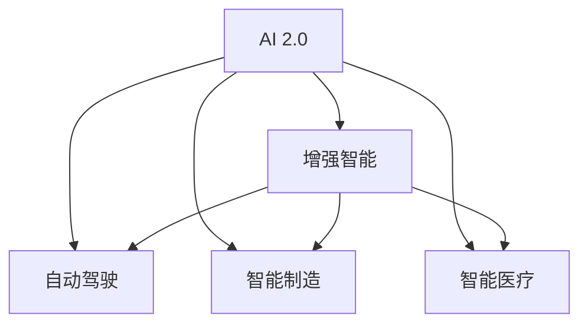

                 

# AI 2.0 时代的未来工作

## 1. 背景介绍

在AI 2.0时代的背景下，人工智能正逐渐成为我们工作生活中不可或缺的一部分。从数据分析、自然语言处理、机器学习到深度学习，这些技术的广泛应用正在塑造着我们的工作方式。本文将探讨AI 2.0时代的未来工作，分析这些技术的发展趋势及其在实际工作中的应用，并提供一些思考与见解。

## 2. 核心概念与联系

### 2.1 核心概念概述

在探讨AI 2.0时代的未来工作时，我们首先要理解几个核心概念：

- **AI 2.0**：相较于AI 1.0（基于规则的人工智能）和AI 3.0（通用人工智能），AI 2.0是指基于深度学习技术的增强型人工智能，它在多个领域展示了强大的应用潜力。
- **增强智能**：指通过机器学习、自然语言处理和计算机视觉等技术，提高人类的决策、分析和创造能力。
- **自动驾驶**：自动驾驶技术是AI 2.0的重要应用之一，它通过传感器、机器学习和决策算法，使车辆能够自主导航。
- **智能制造**：在制造业中应用AI技术，通过预测维护、质量控制和智能调度等手段，提高生产效率和产品质量。
- **智能医疗**：利用AI进行医学影像分析、疾病预测和个性化治疗，提升医疗服务的质量和效率。

这些概念之间存在密切联系，AI 2.0技术的发展为增强智能提供了新的工具和方法，而自动驾驶、智能制造和智能医疗等应用场景则展示了AI技术在实际工作中的广泛应用。

### 2.2 核心概念原理和架构的 Mermaid 流程图



这个流程图展示了AI 2.0与其他核心概念之间的关系。AI 2.0提供了增强智能的工具和方法，而增强智能又通过自动驾驶、智能制造和智能医疗等具体应用场景得以体现。

## 3. 核心算法原理 & 具体操作步骤

### 3.1 算法原理概述

AI 2.0时代的核心算法主要包括深度学习、自然语言处理和计算机视觉等技术。这些算法通过大量数据训练出复杂的模型，使得机器能够在特定任务上实现比人类更高的性能。

- **深度学习**：通过多层神经网络模型，实现对数据的复杂非线性建模，广泛应用于图像识别、语音识别和自然语言处理等领域。
- **自然语言处理**：使机器能够理解、处理和生成人类语言，包括文本分类、机器翻译、情感分析等任务。
- **计算机视觉**：使机器能够理解图像和视频内容，实现目标检测、图像识别和场景理解等任务。

这些算法共同构成了AI 2.0技术的基础，并通过不断迭代和优化，提升了机器在各种任务上的表现。

### 3.2 算法步骤详解

AI 2.0技术的具体操作步骤包括以下几个方面：

1. **数据收集与预处理**：收集并清洗相关领域的数据，使其符合训练模型的要求。
2. **模型选择与构建**：选择合适的深度学习框架和模型结构，构建并训练模型。
3. **模型评估与调优**：使用评估指标和验证集，不断调整模型参数，提升模型性能。
4. **模型部署与应用**：将训练好的模型部署到实际应用场景中，进行实时预测或决策。

以自动驾驶为例，具体步骤如下：

1. **数据收集**：收集汽车传感器数据、地图数据和道路交通数据。
2. **模型选择**：选择适合自动驾驶的深度学习模型，如卷积神经网络（CNN）和递归神经网络（RNN）。
3. **模型训练**：在大量模拟和真实数据上训练模型，学习如何识别道路标志、行人、车辆和其他交通参与者。
4. **模型评估**：在测试集上评估模型性能，使用准确率、召回率和F1分数等指标。
5. **模型部署**：将模型集成到车辆控制系统中，实现自主导航和避障等功能。

### 3.3 算法优缺点

AI 2.0技术在带来诸多便利的同时，也存在一些缺点：

**优点**：

- **高效**：相较于传统算法，深度学习等技术能够处理大规模数据，并实现高性能的模型。
- **泛化能力强**：通过大量数据训练，模型能够在多种情况下表现良好。
- **应用广泛**：AI 2.0技术的应用领域广泛，涵盖自动驾驶、智能制造、智能医疗等多个行业。

**缺点**：

- **数据依赖性高**：模型训练需要大量标注数据，数据获取和标注成本较高。
- **模型复杂度高**：深度学习等技术构建的模型结构复杂，难以解释其内部工作机制。
- **计算资源消耗大**：训练和推理深度学习模型需要高性能计算资源，如GPU和TPU。

### 3.4 算法应用领域

AI 2.0技术在多个领域都有广泛应用，以下是几个典型应用领域：

- **金融科技**：用于风险评估、智能投顾和欺诈检测等。
- **零售业**：实现个性化推荐、库存管理和客户服务自动化。
- **医疗健康**：进行疾病预测、影像分析和手术辅助等。
- **制造业**：进行预测维护、质量控制和智能调度等。
- **交通运输**：实现自动驾驶、路径规划和智能交通管理等。

这些领域的应用展示了AI 2.0技术的强大潜力，并为未来工作的创新和发展提供了新的方向。

## 4. 数学模型和公式 & 详细讲解 & 举例说明

### 4.1 数学模型构建

AI 2.0技术中的数学模型通常包括深度神经网络、卷积神经网络、循环神经网络和长短期记忆网络等。以卷积神经网络（CNN）为例，其数学模型构建如下：

$$
f(x; W, b) = \sigma(W^{[1]}x^{[1]} + b^{[1]})
$$
$$
x^{[2]} = W^{[2]}x^{[1]} + b^{[2]}
$$
$$
y = W^{[3]}x^{[2]} + b^{[3]}
$$

其中，$x$ 表示输入数据，$y$ 表示输出结果，$W$ 和 $b$ 分别表示卷积核和偏置项。$\sigma$ 表示激活函数，如ReLU函数。

### 4.2 公式推导过程

以卷积神经网络为例，其公式推导过程如下：

1. **前向传播**：
$$
f(x; W, b) = \sigma(W^{[1]}x^{[1]} + b^{[1]})
$$
$$
x^{[2]} = W^{[2]}x^{[1]} + b^{[2]}
$$
$$
y = W^{[3]}x^{[2]} + b^{[3]}
$$

2. **损失函数**：
$$
L = \frac{1}{n}\sum_{i=1}^n||y_i - \hat{y}_i||^2
$$

3. **反向传播**：
$$
\frac{\partial L}{\partial W^{[3]}} = \frac{\partial L}{\partial y} \frac{\partial y}{\partial x^{[2]}} \frac{\partial x^{[2]}}{\partial W^{[3]}}
$$
$$
\frac{\partial L}{\partial b^{[3]}} = \frac{\partial L}{\partial y} \frac{\partial y}{\partial x^{[2]}}
$$

4. **参数更新**：
$$
W^{[3]} \leftarrow W^{[3]} - \eta \frac{\partial L}{\partial W^{[3]}}
$$
$$
b^{[3]} \leftarrow b^{[3]} - \eta \frac{\partial L}{\partial b^{[3]}}
$$

通过上述公式，我们可以实现卷积神经网络的训练和推理，使其在图像识别等任务上表现出色。

### 4.3 案例分析与讲解

以智能医疗为例，我们可以使用卷积神经网络进行医学影像分析。具体步骤如下：

1. **数据收集**：收集大量医学影像数据，如X光片、CT扫描和MRI图像。
2. **模型选择**：选择适合医学影像分析的卷积神经网络模型，如U-Net和ResNet。
3. **模型训练**：在标注数据集上训练模型，学习如何识别病变区域和正常区域。
4. **模型评估**：在测试集上评估模型性能，使用准确率、召回率和F1分数等指标。
5. **模型部署**：将训练好的模型部署到临床应用中，辅助医生进行诊断。

## 5. 项目实践：代码实例和详细解释说明

### 5.1 开发环境搭建

在开始项目实践前，我们需要准备好开发环境。以下是使用Python进行TensorFlow开发的Python环境配置流程：

1. 安装Anaconda：从官网下载并安装Anaconda，用于创建独立的Python环境。

2. 创建并激活虚拟环境：
```bash
conda create -n tf-env python=3.8 
conda activate tf-env
```

3. 安装TensorFlow：根据CUDA版本，从官网获取对应的安装命令。例如：
```bash
conda install tensorflow tensorflow-gpu=2.6 -c conda-forge -c pypi
```

4. 安装TensorBoard：
```bash
pip install tensorboard
```

5. 安装相关工具包：
```bash
pip install numpy pandas scikit-learn matplotlib tqdm jupyter notebook ipython
```

完成上述步骤后，即可在`tf-env`环境中开始项目实践。

### 5.2 源代码详细实现

下面我们以智能医疗为例，给出使用TensorFlow对卷积神经网络进行医学影像分析的Python代码实现。

```python
import tensorflow as tf
from tensorflow.keras import layers

# 定义模型
model = tf.keras.Sequential([
    layers.Conv2D(32, (3, 3), activation='relu', input_shape=(256, 256, 3)),
    layers.MaxPooling2D((2, 2)),
    layers.Conv2D(64, (3, 3), activation='relu'),
    layers.MaxPooling2D((2, 2)),
    layers.Conv2D(128, (3, 3), activation='relu'),
    layers.MaxPooling2D((2, 2)),
    layers.Flatten(),
    layers.Dense(64, activation='relu'),
    layers.Dense(1, activation='sigmoid')
])

# 编译模型
model.compile(optimizer='adam', loss='binary_crossentropy', metrics=['accuracy'])

# 训练模型
model.fit(train_dataset, epochs=10, validation_data=val_dataset)

# 评估模型
test_loss, test_acc = model.evaluate(test_dataset)
print(f'Test accuracy: {test_acc:.2f}')
```

### 5.3 代码解读与分析

让我们再详细解读一下关键代码的实现细节：

**卷积神经网络模型定义**：
- 使用`Sequential`模型定义卷积神经网络结构。
- 包括多个卷积层、池化层和全连接层，用于特征提取和分类。
- 最后一层为输出层，使用Sigmoid函数进行二分类预测。

**模型编译**：
- 使用`compile`方法编译模型，指定优化器、损失函数和评估指标。
- 使用Adam优化器和二元交叉熵损失函数。

**模型训练**：
- 使用`fit`方法对模型进行训练，指定训练数据集、验证数据集和训练轮数。
- 在每个epoch结束后，评估模型在验证集上的性能。

**模型评估**：
- 使用`evaluate`方法在测试集上评估模型性能，输出测试集上的准确率。

通过上述代码，我们可以构建并训练一个简单的卷积神经网络，用于医学影像分析。

## 6. 实际应用场景

### 6.4 未来应用展望

AI 2.0技术的未来应用前景广阔，以下是一些未来应用展望：

1. **自动化办公**：通过自然语言处理技术，实现文档自动化分类、摘要生成和语音识别等功能，提升办公效率。
2. **智能客服**：通过对话系统技术，实现自动回答客户咨询，提高客户服务体验。
3. **智能家居**：通过计算机视觉技术，实现环境感知和智能控制，提高居住舒适度。
4. **智慧城市**：通过AI技术，实现交通管理、环境监测和公共安全等功能，提升城市治理水平。
5. **教育领域**：通过智能教学系统，实现个性化教学、作业批改和学情分析等功能，提升教学质量。

AI 2.0技术的应用场景还在不断扩展，未来将有更多行业受益于AI技术带来的效率提升和智能化变革。

## 7. 工具和资源推荐

### 7.1 学习资源推荐

为了帮助开发者系统掌握AI 2.0技术的理论基础和实践技巧，这里推荐一些优质的学习资源：

1. 《深度学习》（Ian Goodfellow著）：经典深度学习教材，详细介绍了深度学习的基本概念和算法。
2. 《自然语言处理综论》（Daniel Jurafsky & James H. Martin著）：全面介绍了自然语言处理的技术和应用。
3. 《计算机视觉：模型、学习与推理》（Jitendra Malik等著）：介绍了计算机视觉的基本概念和算法。
4. 《TensorFlow官方文档》：TensorFlow的官方文档，提供了丰富的API和样例代码。
5. 《PyTorch官方文档》：PyTorch的官方文档，提供了完整的深度学习框架和样例代码。

通过对这些资源的学习实践，相信你一定能够快速掌握AI 2.0技术的精髓，并用于解决实际的AI应用问题。

### 7.2 开发工具推荐

高效的开发离不开优秀的工具支持。以下是几款用于AI 2.0开发的常用工具：

1. TensorFlow：由Google主导开发的深度学习框架，支持分布式训练和部署。
2. PyTorch：由Facebook主导开发的深度学习框架，灵活动态的计算图，适合快速迭代研究。
3. Jupyter Notebook：交互式的Python开发环境，支持代码编写、执行和展示。
4. TensorBoard：TensorFlow配套的可视化工具，可实时监测模型训练状态，并提供丰富的图表呈现方式。
5. Weights & Biases：模型训练的实验跟踪工具，可以记录和可视化模型训练过程中的各项指标，方便对比和调优。

合理利用这些工具，可以显著提升AI 2.0模型的开发效率，加快创新迭代的步伐。

### 7.3 相关论文推荐

AI 2.0技术的发展源于学界的持续研究。以下是几篇奠基性的相关论文，推荐阅读：

1. 《深度学习》（Ian Goodfellow等著）：介绍深度学习的基本概念和算法。
2. 《自然语言处理综论》（Daniel Jurafsky & James H. Martin著）：全面介绍自然语言处理的技术和应用。
3. 《计算机视觉：模型、学习与推理》（Jitendra Malik等著）：介绍计算机视觉的基本概念和算法。
4. 《Transformer: Attention Is All You Need》：Transformer的原始论文，介绍Transformer的结构和训练方法。
5. 《BERT: Pre-training of Deep Bidirectional Transformers for Language Understanding》：BERT模型的原始论文，介绍BERT的预训练和微调方法。

这些论文代表了大规模深度学习技术的发展脉络。通过学习这些前沿成果，可以帮助研究者把握学科前进方向，激发更多的创新灵感。

## 8. 总结：未来发展趋势与挑战

### 8.1 总结

本文对AI 2.0时代的未来工作进行了全面系统的介绍。首先阐述了AI 2.0技术的核心概念和应用场景，明确了其在自动驾驶、智能制造、智能医疗等多个领域的重要性。其次，从原理到实践，详细讲解了AI 2.0技术的数学模型和算法步骤，给出了智能医疗领域的代码实现和详细解读。同时，本文还探讨了AI 2.0技术在实际工作中的应用前景，提供了丰富的学习资源和开发工具推荐。

通过本文的系统梳理，可以看到，AI 2.0技术正在成为各个行业的重要工具，推动智能化的变革。未来，伴随技术的不断进步，AI 2.0技术还将带来更多创新和突破，为各个行业带来新的机遇和挑战。

### 8.2 未来发展趋势

展望未来，AI 2.0技术的发展趋势如下：

1. **多模态融合**：AI 2.0技术将更加注重多模态数据的融合，如视觉、语音、文本等信息的整合，提升智能系统的综合能力。
2. **自适应学习**：未来的AI 2.0系统将具备更强的自适应学习能力，能够根据环境和任务的变化，动态调整模型参数，提升性能。
3. **边缘计算**：随着物联网技术的发展，AI 2.0技术将更多应用于边缘计算环境，实现实时数据处理和决策。
4. **人机协作**：未来的AI 2.0系统将更加注重人机协作，通过自然语言处理技术，实现更加自然和高效的交互。
5. **伦理与安全**：随着AI 2.0技术的广泛应用，伦理和安全问题将受到更多关注，未来AI 2.0系统需要更多地考虑公平、透明和可信性。

### 8.3 面临的挑战

尽管AI 2.0技术已经取得了瞩目成就，但在迈向更加智能化、普适化应用的过程中，它仍面临着诸多挑战：

1. **数据隐私和安全**：大规模数据的应用带来了数据隐私和安全问题，如何保护用户隐私和数据安全，是一个重要的挑战。
2. **模型复杂度**：AI 2.0模型通常具有复杂结构，难以解释其内部工作机制，如何提升模型的可解释性，是一个亟待解决的问题。
3. **资源消耗**：大规模深度学习模型的训练和推理需要高性能计算资源，如何优化模型结构和算法，降低资源消耗，是一个重要研究方向。
4. **公平性与偏置**：AI 2.0模型可能学习到有偏见的数据，导致不公平的输出结果，如何消除模型偏见，提升公平性，是一个重要挑战。

### 8.4 研究展望

未来的AI 2.0研究需要在以下几个方面寻求新的突破：

1. **自适应学习算法**：开发更加灵活和高效的自适应学习算法，使AI 2.0系统能够动态适应环境和任务的变化。
2. **模型压缩与优化**：研究如何通过模型压缩和优化技术，提升AI 2.0模型的计算效率和资源利用率。
3. **多模态融合技术**：研究如何更好地融合多模态数据，提升AI 2.0系统的感知和理解能力。
4. **公平性与伦理**：研究如何在AI 2.0模型中引入公平性约束，消除偏见和歧视，提升系统的可信性和透明度。
5. **交互与协作**：研究如何通过人机协作技术，提升AI 2.0系统的交互体验和效率，实现更加自然的用户交互。

这些研究方向的探索，必将引领AI 2.0技术迈向更高的台阶，为构建安全、可靠、可解释、可控的智能系统铺平道路。面向未来，AI 2.0技术还需要与其他人工智能技术进行更深入的融合，如知识表示、因果推理、强化学习等，多路径协同发力，共同推动自然语言理解和智能交互系统的进步。只有勇于创新、敢于突破，才能不断拓展AI 2.0技术的边界，让智能技术更好地造福人类社会。

## 9. 附录：常见问题与解答

**Q1：如何评估AI 2.0模型在实际应用中的效果？**

A: AI 2.0模型在实际应用中的效果评估可以通过多种指标进行，如准确率、召回率、F1分数、ROC曲线等。在应用场景中，还可以结合业务需求和用户反馈，进行更综合的评估。

**Q2：AI 2.0技术在医疗领域有哪些应用？**

A: AI 2.0技术在医疗领域的应用包括医学影像分析、疾病预测、个性化治疗、药物研发等。通过AI技术，可以实现更精准、高效的医疗服务，提高患者治疗效果。

**Q3：如何提高AI 2.0模型的计算效率？**

A: 提高AI 2.0模型的计算效率可以通过模型压缩、模型优化和计算图优化等方法。例如，使用剪枝、量化和稀疏化技术，减少模型参数和计算量；优化计算图，提高计算效率；采用分布式训练和边缘计算等方法，提升模型的实时性。

**Q4：AI 2.0技术在实际应用中需要注意哪些问题？**

A: 在实际应用中，AI 2.0技术需要注意数据隐私和安全问题、模型复杂度和可解释性问题、计算资源消耗问题以及公平性和偏置问题。需要综合考虑技术、业务和伦理等多个方面，确保AI 2.0技术在实际应用中的安全性、可靠性和公正性。

通过以上对AI 2.0技术的应用、评估、优化和挑战的探讨，我们可以更好地理解AI 2.0技术在未来工作中的作用和前景，同时也需要关注和解决其面临的挑战，推动AI 2.0技术不断发展和完善。

---

作者：禅与计算机程序设计艺术 / Zen and the Art of Computer Programming

