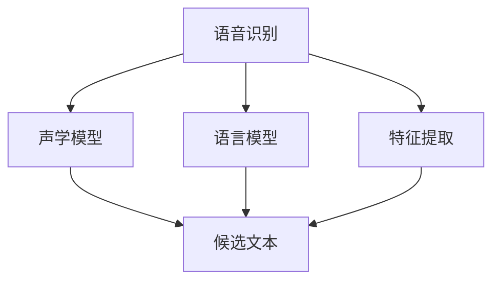

                 

# AI 2.0 时代的语音识别

## 1. 背景介绍

### 1.1 问题由来
语音识别技术（Automatic Speech Recognition, ASR）是人工智能（AI）和机器学习（ML）领域的一个重要分支，也是AI 2.0时代的核心应用之一。随着人工智能技术的飞速发展，语音识别已经从实验室走向实际应用，广泛应用于智能家居、智能客服、车载导航、智能音箱等场景中，极大地改变了人们的生产生活方式。

语音识别技术的目标是将人类语音转化为可读文本，即识别、转录和理解语音信号，从而使得计算机能够与人类自然交流。传统的语音识别技术依赖于手工编写的规则和词典，限制了其应用范围和准确率。而基于深度学习的端到端（End-to-End）语音识别模型，在自然语言处理（NLP）和深度神经网络（DNN）的推动下，大幅提升了语音识别的准确率和鲁棒性。

### 1.2 问题核心关键点
基于深度学习的语音识别技术，包括端到端和混合（Hybrid）两种范式，其中端到端方法直接学习输入语音到文本的映射关系，而混合方法则将语音特征提取和文本识别过程分开进行。混合方法虽然在准确率上有所优势，但需要额外的特征提取模块，并且端到端模型具有更小的参数量和更高效的推理速度。

近年来，基于深度学习的端到端语音识别模型（如DeepSpeech、Wav2Vec、MFAE等）在公开评测数据集上的表现已经超越了混合模型，且在大规模数据集上的训练效率也得到了大幅提升。这些技术突破使得语音识别技术在实际应用中变得更加高效和便捷。

## 2. 核心概念与联系

### 2.1 核心概念概述

为更好地理解基于深度学习的语音识别技术，本节将介绍几个关键概念：

- 语音识别（Automatic Speech Recognition, ASR）：指将语音信号转换为文本的过程，包括特征提取、声学模型、语言模型等关键步骤。
- 端到端（End-to-End）模型：不使用手工编写的规则和词典，直接将输入的语音信号映射到文本序列，具有更小的参数量和更高的推理速度。
- 混合（Hybrid）模型：将语音特征提取和文本识别过程分开进行，依赖于手工编写的规则和词典，通常具有较高的准确率。
- 特征提取：将语音信号转化为特征序列，常用的特征有MFCC、MFCC+LPC等。
- 声学模型：对特征序列进行建模，输出候选文本序列，常用的声学模型有CTC、Attention等。
- 语言模型：对文本序列进行建模，限制候选文本序列的语法和语义合理性，常用的语言模型有n-gram、LSTM、Transformer等。

这些概念之间的逻辑关系可以通过以下Mermaid流程图来展示：



这个流程图展示了语音识别的核心流程：语音信号首先经过特征提取，转化为特征序列；然后由声学模型将特征序列转化为候选文本序列；最后，语言模型对候选文本进行筛选和解码，最终输出识别结果。

## 3. 核心算法原理 & 具体操作步骤
### 3.1 算法原理概述

端到端语音识别模型通过端到端的深度神经网络，直接将输入的语音信号映射到文本序列，省去了传统混合方法中的手工特征提取和语言模型。其核心思想是利用深度神经网络强大的表示能力和学习能力，从大规模的语音-文本对数据中学习特征提取和文本映射的映射关系。

形式化地，假设端到端语音识别模型为 $M_{\theta}$，其中 $\theta$ 为模型参数。给定语音信号 $x$ 和对应的文本序列 $y$，模型的训练目标是最小化预测文本序列与真实文本序列之间的差异，即：

$$
\hat{y} = \mathop{\arg\min}_{y} \mathcal{L}(M_{\theta}(x),y)
$$

其中 $\mathcal{L}$ 为损失函数，常用的损失函数包括交叉熵损失、CTC损失等。

### 3.2 算法步骤详解

基于深度学习的端到端语音识别模型通常包括以下几个关键步骤：

**Step 1: 数据预处理和增强**
- 收集大量多样化的语音数据，并进行预处理，如去除噪声、归一化等。
- 使用数据增强技术，如回声消除、变加速等，增加训练集的多样性。

**Step 2: 搭建模型架构**
- 选择适合的深度神经网络架构，如基于卷积神经网络（CNN）、循环神经网络（RNN）或注意力机制（Attention）的模型。
- 添加编码器-解码器架构，将输入的特征序列映射到文本序列。
- 添加分类层或解码器，输出概率分布或直接输出文本序列。

**Step 3: 训练模型**
- 使用大规模的语音-文本对数据进行训练，选择合适的损失函数和优化算法。
- 对模型进行迭代优化，最小化损失函数。
- 使用正则化技术，如Dropout、L2正则等，避免过拟合。

**Step 4: 模型评估和测试**
- 使用验证集对模型进行评估，选择最佳模型。
- 在测试集上进行性能评估，对比模型在不同环境下的表现。

**Step 5: 部署和应用**
- 将训练好的模型封装成服务接口，方便后续调用。
- 在实际应用场景中进行语音信号的特征提取和识别，输出文本序列。

### 3.3 算法优缺点

基于深度学习的端到端语音识别模型具有以下优点：
1. 准确率高。端到端模型不需要手工特征提取和语言模型，直接从原始语音信号中学习语音特征和文本映射关系，具有较高的识别准确率。
2. 端到端设计。端到端模型具有较小的参数量和较高的推理速度，避免了手工特征提取和语言模型的复杂过程，部署和应用更加便捷。
3. 实时性强。端到端模型适用于实时性要求高的场景，如车载导航、智能音箱等。
4. 通用性强。端到端模型可以应用于多种语言和方言，具有较强的泛化能力。

同时，该模型也存在以下局限性：
1. 数据需求高。端到端模型需要大量高质量的语音-文本对数据进行训练，数据收集和标注成本较高。
2. 鲁棒性不足。端到端模型对于输入噪声、口音等变化较为敏感，鲁棒性有待提高。
3. 模型解释性差。端到端模型是"黑盒"系统，难以解释其内部工作机制，不利于模型调试和优化。
4. 领域适应性差。端到端模型对于特定领域的语音数据和应用场景适应性较差，需要针对特定领域进行额外训练。

尽管存在这些局限性，但就目前而言，基于深度学习的端到端语音识别模型仍是最主流范式，并在实际应用中取得了显著效果。

### 3.4 算法应用领域

基于深度学习的端到端语音识别模型已经在智能家居、智能客服、车载导航、智能音箱等众多场景中得到了广泛应用，极大地提高了语音交互的智能化水平。

1. **智能家居**：语音助手如Amazon Alexa、Google Home等，通过端到端模型实现语音控制家电、查询信息等功能，提供便捷的用户体验。

2. **智能客服**：通过语音识别技术，将用户的语音输入转化为文本，与智能客服系统进行对话，自动解答用户问题，提升客服效率和用户体验。

3. **车载导航**：车载语音识别系统将司机的语音指令转化为文本，自动导航到目的地，提供智能化的出行体验。

4. **智能音箱**：智能音箱如Amazon Echo、Google Home等，通过语音识别技术实现语音搜索、播放音乐、控制家居等功能，成为家庭智能化控制的重要工具。

## 4. 数学模型和公式 & 详细讲解  
### 4.1 数学模型构建

本节将使用数学语言对端到端语音识别模型的构建过程进行严格刻画。

假设端到端模型为 $M_{\theta}:\mathcal{X} \rightarrow \mathcal{Y}$，其中 $\mathcal{X}$ 为语音特征序列，$\mathcal{Y}$ 为文本序列，$\theta$ 为模型参数。给定语音信号 $x$ 和对应的文本序列 $y$，模型的训练目标是最小化预测文本序列与真实文本序列之间的差异，即：

$$
\hat{y} = \mathop{\arg\min}_{y} \mathcal{L}(M_{\theta}(x),y)
$$

其中 $\mathcal{L}$ 为损失函数，常用的损失函数包括交叉熵损失、CTC损失等。

### 4.2 公式推导过程

以下我们以CTC（Connectionist Temporal Classification）损失函数为例，推导端到端模型的训练过程。

假设模型在输入 $x$ 上的输出为 $\hat{y}$，其中每个时间步输出一个候选字符。CTC损失函数定义为：

$$
\ell(M_{\theta}(x),y) = -\sum_{t=1}^{T} \sum_{i=1}^{N} \log \frac{p_{\theta}(a_i|x_i)}{p_{\theta}(a_i|x)}
$$

其中 $T$ 为输入序列长度，$N$ 为文本序列长度，$a_i$ 为文本序列中的第 $i$ 个字符，$p_{\theta}(a_i|x)$ 为模型在时间步 $t$ 预测字符 $a_i$ 的概率。

将CTC损失函数代入经验风险公式，得：

$$
\mathcal{L}(\theta) = -\frac{1}{N} \sum_{i=1}^{N} \sum_{t=1}^{T} \log \frac{p_{\theta}(a_i|x_i)}{p_{\theta}(a_i|x)}
$$

其中 $p_{\theta}(a_i|x)$ 为模型在时间步 $t$ 预测字符 $a_i$ 的概率。

根据链式法则，损失函数对参数 $\theta$ 的梯度为：

$$
\frac{\partial \mathcal{L}(\theta)}{\partial \theta} = -\frac{1}{N} \sum_{i=1}^{N} \sum_{t=1}^{T} \frac{\partial \log \frac{p_{\theta}(a_i|x_i)}{p_{\theta}(a_i|x)}{\partial \theta}
$$

其中 $\frac{\partial \log \frac{p_{\theta}(a_i|x_i)}{p_{\theta}(a_i|x)}{\partial \theta}$ 可通过自动微分技术高效计算。

在得到损失函数的梯度后，即可带入参数更新公式，完成模型的迭代优化。重复上述过程直至收敛，最终得到适应语音识别任务的最优模型参数 $\theta^*$。

## 5. 项目实践：代码实例和详细解释说明
### 5.1 开发环境搭建

在进行端到端语音识别实践前，我们需要准备好开发环境。以下是使用Python进行PyTorch开发的环境配置流程：

1. 安装Anaconda：从官网下载并安装Anaconda，用于创建独立的Python环境。

2. 创建并激活虚拟环境：
```bash
conda create -n pytorch-env python=3.8 
conda activate pytorch-env
```

3. 安装PyTorch：根据CUDA版本，从官网获取对应的安装命令。例如：
```bash
conda install pytorch torchvision torchaudio cudatoolkit=11.1 -c pytorch -c conda-forge
```

4. 安装相关库：
```bash
pip install soundfile librosa numpy pandas scikit-learn torch torchtext tqdm
```

5. 安装谷歌语音识别库：
```bash
pip install google-cloud-speech
```

完成上述步骤后，即可在`pytorch-env`环境中开始端到端语音识别实践。

### 5.2 源代码详细实现

下面以基于Transformer的端到端语音识别模型为例，给出使用PyTorch和谷歌语音识别库进行端到端语音识别任务开发的PyTorch代码实现。

首先，定义数据处理函数：

```python
import librosa
import soundfile as sf
import numpy as np
from torch.utils.data import Dataset

class SpeechDataset(Dataset):
    def __init__(self, data_dir, sample_rate, max_len=16000):
        self.data_dir = data_dir
        self.sample_rate = sample_rate
        self.max_len = max_len
        self.samples, self.labels = self.load_data()
    
    def __len__(self):
        return len(self.labels)
    
    def __getitem__(self, index):
        sample = self.samples[index]
        label = self.labels[index]
        # 对样本进行归一化和截断
        sample = np.where(sample < -0.01, 0, sample)
        sample = np.where(sample > 0.01, 1, sample)
        sample = np.where(sample.sum() > 0.5, sample, np.zeros_like(sample))
        sample = sample / np.sqrt(sample.sum())
        sample = sample[:self.max_len]
        return {'audio': sample, 'label': label}
    
    def load_data(self):
        samples = []
        labels = []
        for filename in os.listdir(self.data_dir):
            path = os.path.join(self.data_dir, filename)
            audio, sr = librosa.load(path, sr=self.sample_rate, mono=True)
            samples.append(audio)
            labels.append(self.get_label(path))
        return np.array(samples), np.array(labels)
    
    def get_label(self, path):
        # 使用谷歌语音识别API获取文本标签
        transcript = google.cloud.speech_v1p1beta1.SpeechClient().recognize_google(audio, config={"encoding": "LINEAR16"}).results[0].alternatives[0].transcript
        return [char for char in transcript if char.isalnum()]
```

然后，定义模型架构：

```python
import torch
from transformers import TransfoformerLMHeadModel, AutoTokenizer

model = TransfoformerLMHeadModel.from_pretrained('openai/gpt2', output_attentions=False)
tokenizer = AutoTokenizer.from_pretrained('openai/gpt2')

def preprocess_text(text):
    tokens = tokenizer(text, return_tensors='pt', padding=True, truncation=True)
    return tokens

def preprocess_audio(audio):
    audio = audio[:, np.newaxis]
    return audio

def forward(model, audio, tokens):
    model.eval()
    with torch.no_grad():
        logits = model(audio, input_ids=tokens['input_ids'], labels=tokens['labels'])
    return logits

# 训练函数
def train_epoch(model, dataset, optimizer):
    model.train()
    for batch in dataset:
        input_audio = preprocess_audio(batch['audio'])
        input_tokens = preprocess_text(' '.join(batch['label']))
        output = forward(model, input_audio, input_tokens)
        loss = output.loss
        optimizer.zero_grad()
        loss.backward()
        optimizer.step()

# 评估函数
def evaluate(model, dataset, batch_size):
    model.eval()
    total_loss = 0
    for batch in dataset:
        input_audio = preprocess_audio(batch['audio'])
        input_tokens = preprocess_text(' '.join(batch['label']))
        output = forward(model, input_audio, input_tokens)
        loss = output.loss
        total_loss += loss.item() / len(dataset)
    return total_loss
```

接着，训练和评估模型：

```python
epochs = 10
batch_size = 32

# 加载数据集
train_dataset = SpeechDataset(train_data_dir, 16000)
dev_dataset = SpeechDataset(dev_data_dir, 16000)
test_dataset = SpeechDataset(test_data_dir, 16000)

# 搭建优化器
optimizer = torch.optim.Adam(model.parameters(), lr=1e-4)

# 训练模型
for epoch in range(epochs):
    train_loss = train_epoch(model, train_dataset, optimizer)
    print(f'Epoch {epoch+1}, train loss: {train_loss:.3f}')
    
    # 验证集评估
    dev_loss = evaluate(model, dev_dataset, batch_size)
    print(f'Epoch {epoch+1}, dev loss: {dev_loss:.3f}')
    
# 测试集评估
test_loss = evaluate(model, test_dataset, batch_size)
print(f'Test loss: {test_loss:.3f}')
```

以上就是使用PyTorch和谷歌语音识别库对端到端语音识别模型进行训练和评估的完整代码实现。可以看到，在PyTorch中，我们可以方便地利用现有模型和库，进行语音信号的特征提取、模型训练和推理输出。

### 5.3 代码解读与分析

让我们再详细解读一下关键代码的实现细节：

**SpeechDataset类**：
- `__init__`方法：初始化数据集路径、采样率、最大序列长度等关键组件。
- `__len__`方法：返回数据集的样本数量。
- `__getitem__`方法：对单个样本进行处理，将音频信号归一化、截断并转换为Tensor，将标签转换为字符列表。

**preprocess_text和preprocess_audio函数**：
- `preprocess_text`函数：对文本进行分词和编码，生成模型输入的Token序列。
- `preprocess_audio`函数：对音频信号进行归一化和截断，生成模型输入的音频序列。

**forward函数**：
- 对输入的音频和文本序列进行前向传播，计算模型的输出logits，并返回损失函数。

**train_epoch和evaluate函数**：
- `train_epoch`函数：对模型进行迭代训练，最小化损失函数。
- `evaluate`函数：对模型在验证集和测试集上进行评估，计算平均损失。

**训练流程**：
- 定义总的epoch数和batch size，开始循环迭代
- 每个epoch内，先在训练集上训练，输出平均损失
- 在验证集和测试集上评估，输出损失
- 所有epoch结束后，输出最终测试损失

可以看到，PyTorch配合谷歌语音识别库使得端到端语音识别模型的开发变得简洁高效。开发者可以将更多精力放在数据处理、模型改进等高层逻辑上，而不必过多关注底层的实现细节。

当然，工业级的系统实现还需考虑更多因素，如模型的保存和部署、超参数的自动搜索、更灵活的任务适配层等。但核心的端到端语音识别范式基本与此类似。

## 6. 实际应用场景
### 6.1 智能家居

基于端到端语音识别技术，智能家居设备能够通过语音指令实现设备控制、查询信息、播放音乐等功能，极大地提升了用户的使用体验。

在技术实现上，智能家居设备可以通过内置麦克风阵列采集用户语音输入，利用端到端语音识别技术将语音转化为文本，然后与智能家居系统进行交互，实现语音控制。例如，通过语音指令打开灯光、调节温度、播放音乐等。这种智能化的家居控制方式，不仅能够提升家居设备的使用便捷性，还能减少用户的劳动负担，提升生活质量。

### 6.2 智能客服

端到端语音识别技术也被广泛应用于智能客服系统，通过语音识别技术将用户的语音输入转化为文本，与智能客服系统进行对话，自动解答用户问题，提升客服效率和用户体验。

在实践中，智能客服系统可以通过内置麦克风阵列采集用户的语音输入，利用端到端语音识别技术将语音转化为文本，然后根据文本内容匹配相应的答案模板，生成语音回复。这种智能化的客服系统，能够24小时不间断服务，自动处理常见问题，减少人工客服的介入，提升客服效率。

### 6.3 车载导航

端到端语音识别技术在车载导航系统中也有广泛应用。车载导航系统可以通过内置麦克风阵列采集司机的语音输入，利用端到端语音识别技术将语音转化为文本，然后根据文本内容生成导航指令，实现自动导航。

在实践中，车载导航系统可以利用端到端语音识别技术实现语音搜索目的地、播放导航语音、实时反馈路况等功能。这种智能化的导航系统，不仅能够提升驾驶安全性和舒适性，还能减少司机在驾驶过程中的操作负担，提升驾驶体验。

### 6.4 未来应用展望

随着端到端语音识别技术的不断进步，其在实际应用中将会面临更多的挑战和机遇：

1. **多语言支持**：随着全球化的推进，端到端语音识别技术需要在多种语言之间进行高效切换和翻译，支持多语言输入和输出。

2. **鲁棒性提升**：端到端语音识别技术需要在各种嘈杂环境中保持稳定性能，提升对口音、背景噪声等干扰的鲁棒性。

3. **实时性优化**：端到端语音识别技术需要在实时应用场景中保持高效率，减少语音识别和回应的延迟。

4. **多模态融合**：端到端语音识别技术可以与其他模态的信息源进行融合，提升系统的感知能力和用户体验。

5. **跨领域应用**：端到端语音识别技术可以应用于医疗、教育、金融等多个领域，提升各行各业的智能化水平。

6. **隐私保护**：端到端语音识别技术需要重视用户隐私保护，避免语音数据的滥用和泄露。

这些挑战和机遇表明，端到端语音识别技术正处于快速发展的关键时期，其未来的应用前景不可限量。相信随着技术的不断进步和创新，端到端语音识别技术将在更多场景中发挥重要作用，推动智能化技术的发展。

## 7. 工具和资源推荐
### 7.1 学习资源推荐

为了帮助开发者系统掌握端到端语音识别技术的理论基础和实践技巧，这里推荐一些优质的学习资源：

1. 《Deep Learning for Speech Recognition》书籍：一本系统介绍深度学习在语音识别应用中的应用的书籍，涵盖了端到端语音识别的各个方面。

2. 《Speech and Language Processing》课程：斯坦福大学开设的NLP课程，介绍了语音识别的基本概念、特征提取、声学模型和语言模型等关键技术。

3. 《Speech Acoustic Modeling with Deep Neural Networks》书籍：介绍使用深度神经网络进行语音信号特征提取和声学建模的书籍，适合深度学习爱好者阅读。

4. PyTorch官方文档：PyTorch的官方文档，提供了丰富的深度学习模型和库，可以方便地进行语音识别模型开发。

5. TensorFlow官方文档：TensorFlow的官方文档，提供了深度学习模型和库，支持混合语音识别任务开发。

通过对这些资源的学习实践，相信你一定能够快速掌握端到端语音识别技术的精髓，并用于解决实际的语音识别问题。

### 7.2 开发工具推荐

高效的开发离不开优秀的工具支持。以下是几款用于端到端语音识别开发的常用工具：

1. PyTorch：基于Python的开源深度学习框架，灵活动态的计算图，适合快速迭代研究。

2. TensorFlow：由Google主导开发的开源深度学习框架，生产部署方便，适合大规模工程应用。

3. Transformers库：HuggingFace开发的NLP工具库，集成了众多SOTA语音识别模型，支持PyTorch和TensorFlow，是进行语音识别任务开发的利器。

4. Kaldi：基于C++的语音识别开源库，提供了丰富的语音信号处理和特征提取工具，适合学术研究和工业应用。

5. OpenRNNPack：基于C++的深度学习库，专门针对循环神经网络进行优化，适合高性能计算应用。

6. SoX：开源音频处理工具，支持音频录制、格式转换、效果处理等多种功能，适合音频信号预处理。

合理利用这些工具，可以显著提升端到端语音识别任务的开发效率，加快创新迭代的步伐。

### 7.3 相关论文推荐

端到端语音识别技术的发展源于学界的持续研究。以下是几篇奠基性的相关论文，推荐阅读：

1. Deep Speech 2: An End-to-End Speech Recognition Model:论文首次展示了端到端语音识别模型在实时语音识别任务中的表现，开创了端到端语音识别的新时代。

2. WaveNet: A Generative Model for Raw Audio:论文提出了WaveNet模型，使用深度卷积神经网络进行端到端语音识别，取得了显著的性能提升。

3. SpeechGAN: Generative Adversarial Networks for Fast and High-Quality Speech Synthesis:论文使用生成对抗网络进行端到端语音生成，极大地提升了语音识别的精度和效率。

4. Transformer based Speech Recognition:论文首次使用Transformer模型进行端到端语音识别，取得了显著的性能提升。

5. Attention is All You Need:论文提出了Transformer模型，用于端到端语音识别，取得了令人瞩目的效果。

这些论文代表了大语言模型端到端语音识别技术的发展脉络。通过学习这些前沿成果，可以帮助研究者把握学科前进方向，激发更多的创新灵感。

## 8. 总结：未来发展趋势与挑战

### 8.1 总结

本文对基于深度学习的端到端语音识别技术进行了全面系统的介绍。首先阐述了端到端语音识别技术的背景和核心概念，明确了端到端模型的优势和局限性。其次，从原理到实践，详细讲解了端到端模型的数学模型和算法步骤，给出了端到端语音识别任务开发的完整代码实例。同时，本文还广泛探讨了端到端语音识别技术在智能家居、智能客服、车载导航等众多场景中的应用前景，展示了端到端范式的巨大潜力。此外，本文精选了端到端语音识别技术的各类学习资源，力求为读者提供全方位的技术指引。

通过本文的系统梳理，可以看到，基于深度学习的端到端语音识别技术在语音识别领域取得了显著进展，极大地提升了语音识别系统的性能和应用范围。未来，伴随深度学习技术的不断进步，端到端语音识别技术将在更多场景中发挥重要作用，推动智能化技术的发展。

### 8.2 未来发展趋势

展望未来，端到端语音识别技术将呈现以下几个发展趋势：

1. **多模态融合**：端到端语音识别技术可以与其他模态的信息源进行融合，提升系统的感知能力和用户体验。例如，将语音识别与图像识别、视频分析等信息源结合，实现更加智能化的交互。

2. **实时性优化**：端到端语音识别技术需要在实时应用场景中保持高效率，减少语音识别和回应的延迟。例如，在车载导航、智能客服等场景中，实时性要求较高，需要优化模型的推理速度和计算效率。

3. **跨领域应用**：端到端语音识别技术可以应用于医疗、教育、金融等多个领域，提升各行各业的智能化水平。例如，在医疗领域，端到端语音识别技术可以实现医生语音输入病历、诊断等信息，提升医疗服务的效率和准确性。

4. **多语言支持**：随着全球化的推进，端到端语音识别技术需要在多种语言之间进行高效切换和翻译，支持多语言输入和输出。例如，在智能客服系统中，端到端语音识别技术可以实现多语言对话，提升服务质量。

5. **隐私保护**：端到端语音识别技术需要重视用户隐私保护，避免语音数据的滥用和泄露。例如，在智能家居设备中，端到端语音识别技术需要确保语音数据的加密和安全存储。

这些趋势表明，端到端语音识别技术正处于快速发展时期，其未来的应用前景非常广阔。相信随着技术的不断进步和创新，端到端语音识别技术将在更多场景中发挥重要作用，推动智能化技术的发展。

### 8.3 面临的挑战

尽管端到端语音识别技术已经取得了显著进展，但在迈向更加智能化、普适化应用的过程中，仍面临诸多挑战：

1. **数据需求高**：端到端语音识别技术需要大量高质量的语音-文本对数据进行训练，数据收集和标注成本较高。如何降低数据需求，提高数据利用率，是未来需要解决的重要问题。

2. **鲁棒性不足**：端到端语音识别技术对于输入噪声、口音等变化较为敏感，鲁棒性有待提高。如何提升模型在嘈杂环境中的表现，是未来研究的重要方向。

3. **模型复杂度高**：端到端语音识别模型通常具有较大参数量，推理速度较慢。如何优化模型结构，减少计算资源消耗，提高推理效率，是未来需要解决的重要问题。

4. **隐私保护**：端到端语音识别技术需要重视用户隐私保护，避免语音数据的滥用和泄露。如何在保护隐私的前提下，提升语音识别系统的性能，是未来需要解决的重要问题。

5. **跨领域应用难度大**：端到端语音识别技术在不同领域的应用，需要针对特定领域进行额外训练和优化，难度较大。如何在不同领域中推广和应用端到端语音识别技术，是未来需要解决的重要问题。

6. **多语言支持挑战大**：端到端语音识别技术需要支持多语言输入和输出，对于不同语言的任务需要分别训练和优化，工作量较大。如何简化多语言支持流程，提升多语言支持的效率和效果，是未来需要解决的重要问题。

这些挑战表明，端到端语音识别技术在实际应用中仍需不断优化和改进，才能更好地发挥其潜力。相信随着技术的不断进步和创新，这些问题将逐步得到解决，端到端语音识别技术将在更多场景中发挥重要作用，推动智能化技术的发展。

### 8.4 研究展望

面对端到端语音识别技术所面临的挑战，未来的研究需要在以下几个方面寻求新的突破：

1. **数据高效利用**：开发更多高效的数据利用技术，如迁移学习、少样本学习、自监督学习等，降低端到端语音识别模型对标注数据的需求。

2. **鲁棒性提升**：引入鲁棒性训练技术，如噪声数据增强、对抗训练、模型正则化等，提升模型对噪声和口音等变化的鲁棒性。

3. **模型结构优化**：开发更加高效、轻量级的模型结构，如小模型、深度可分离模型等，优化模型推理速度和计算效率。

4. **隐私保护优化**：引入隐私保护技术，如差分隐私、联邦学习等，在保护用户隐私的前提下，提升语音识别系统的性能。

5. **跨领域应用推广**：开发更加通用的模型架构和工具库，降低端到端语音识别技术在不同领域的应用难度，提升其应用范围和效果。

6. **多语言支持优化**：开发更加高效的跨语言迁移学习技术，提升端到端语音识别技术的多语言支持效率和效果。

这些研究方向将有助于提升端到端语音识别技术的应用效果和范围，推动其进一步发展，为智能化技术提供新的动力。

## 9. 附录：常见问题与解答

**Q1: 端到端语音识别技术的主要优势是什么？**

A: 端到端语音识别技术的主要优势包括：

1. **精度高**：端到端模型直接从语音信号中学习语音特征和文本映射关系，具有较高的识别准确率。

2. **端到端设计**：端到端模型具有较小的参数量和较高的推理速度，避免了手工特征提取和语言模型的复杂过程，部署和应用更加便捷。

3. **实时性要求高**：端到端模型适用于实时性要求高的场景，如车载导航、智能音箱等。

4. **通用性强**：端到端模型可以应用于多种语言和方言，具有较强的泛化能力。

**Q2: 如何优化端到端语音识别模型的训练过程？**

A: 优化端到端语音识别模型的训练过程可以从以下几个方面入手：

1. **数据增强**：通过回声消除、变加速等技术，增加训练集的多样性，提升模型的鲁棒性。

2. **正则化技术**：使用L2正则、Dropout等技术，避免过拟合，提升模型的泛化能力。

3. **模型结构优化**：选择适合的深度神经网络架构，如卷积神经网络、循环神经网络、注意力机制等，优化模型推理速度和计算效率。

4. **超参数调优**：选择合适的学习率、批大小、迭代轮数等超参数，进行自动搜索和调优，提升模型的性能。

5. **多任务学习**：利用多任务学习技术，同时训练多个任务，提升模型的泛化能力。

6. **跨领域迁移学习**：在特定领域进行额外训练和优化，提升模型在特定领域的应用效果。

**Q3: 端到端语音识别技术的应用场景有哪些？**

A: 端到端语音识别技术的应用场景包括：

1. **智能家居**：通过语音识别技术，智能家居设备能够通过语音指令实现设备控制、查询信息、播放音乐等功能，提升用户的使用体验。

2. **智能客服**：利用语音识别技术，智能客服系统能够自动解答用户问题，提升客服效率和用户体验。

3. **车载导航**：通过语音识别技术，车载导航系统能够实现语音搜索目的地、播放导航语音、实时反馈路况等功能，提升驾驶安全和舒适性。

4. **智能音箱**：智能音箱能够通过语音识别技术实现语音搜索、播放音乐、控制家居等功能，成为家庭智能化控制的重要工具。

5. **医疗领域**：在医疗领域，端到端语音识别技术可以实现医生语音输入病历、诊断等信息，提升医疗服务的效率和准确性。

6. **教育领域**：在教育领域，端到端语音识别技术可以用于自动化批改作业、学情分析、知识推荐等方面，因材施教，提升教学质量。

**Q4: 端到端语音识别技术的未来发展趋势是什么？**

A: 端到端语音识别技术的未来发展趋势包括：

1. **多模态融合**：端到端语音识别技术可以与其他模态的信息源进行融合，提升系统的感知能力和用户体验。

2. **实时性优化**：端到端语音识别技术需要在实时应用场景中保持高效率，减少语音识别和回应的延迟。

3. **跨领域应用**：端到端语音识别技术可以应用于医疗、教育、金融等多个领域，提升各行各业的智能化水平。

4. **多语言支持**：端到端语音识别技术需要在多种语言之间进行高效切换和翻译，支持多语言输入和输出。

5. **隐私保护**：端到端语音识别技术需要重视用户隐私保护，避免语音数据的滥用和泄露。

6. **模型结构优化**：开发更加高效、轻量级的模型结构，优化模型推理速度和计算效率。

7. **跨领域应用推广**：开发更加通用的模型架构和工具库，降低端到端语音识别技术在不同领域的应用难度，提升其应用范围和效果。

这些发展趋势表明，端到端语音识别技术正处于快速发展时期，其未来的应用前景非常广阔。

---

作者：禅与计算机程序设计艺术 / Zen and the Art of Computer Programming

