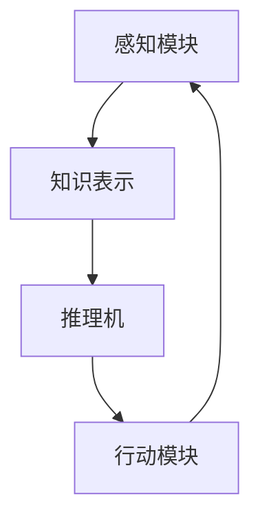

                 

# AI Agent: AI的下一个风口 企业级应用与任务规划

## 1. 背景介绍

在人工智能(AI)领域，我们经历了从基于规则的专家系统到机器学习，再到深度学习的迅猛发展。AI技术已经在诸如语音识别、图像处理、自然语言处理等领域展现出强大的能力，并在商业化应用中取得了显著成果。然而，随着AI技术的发展，我们即将迎来AI的下一个风口——AI Agent，即能够理解、交互、学习并执行复杂任务的AI系统。AI Agent不仅能够替代人工完成重复性、高风险的任务，还能在多场景下持续学习、自我提升，更好地适应不断变化的环境。

本文将深入探讨AI Agent的核心概念、技术原理、应用场景以及未来发展趋势，为AI Agent在企业级应用与任务规划提供全面指导。

## 2. 核心概念与联系

### 2.1 核心概念概述

AI Agent是一种能够自主学习、执行复杂任务的智能体，可以模拟人类的行为逻辑，并在特定任务领域内持续提升能力。AI Agent的核心组件包括：

- **知识表示**：用于描述AI Agent的认知结构，包括事实、规则、知识图谱等。
- **推理机**：负责逻辑推理、推断和决策，基于当前环境和已有知识进行判断和规划。
- **感知模块**：负责对外部环境的感知和信息采集，如视觉、听觉、语言处理等。
- **行动模块**：根据推理结果，执行相应的操作，完成具体任务。

AI Agent的工作原理可以简单表示为：

1. **感知模块**：获取环境信息。
2. **知识表示**：整合已有知识。
3. **推理机**：根据知识与环境信息进行推理。
4. **行动模块**：执行推理结果，更新知识库。
5. **循环迭代**：不断从环境中学习新知识，优化推理过程。

### 2.2 核心概念联系

通过以下Mermaid流程图，可以清晰地看到AI Agent各个组件之间的联系和作用：



- **感知模块**：获取环境信息，为推理提供数据基础。
- **知识表示**：整合已有知识，为推理提供背景信息。
- **推理机**：结合感知模块和知识表示进行推理，生成行动策略。
- **行动模块**：执行行动策略，更新知识库。
- **循环迭代**：不断从环境中学习新知识，优化推理过程。

这些组件共同构成了AI Agent的核心架构，使其能够在特定任务领域内高效地执行任务。

## 3. 核心算法原理 & 具体操作步骤

### 3.1 算法原理概述

AI Agent的核心算法原理包括以下几个方面：

- **感知与提取**：通过传感器和输入设备获取环境信息，使用自然语言处理、图像处理等技术将信息提取为结构化数据。
- **知识表示与推理**：构建知识图谱、逻辑推理规则等，使用图神经网络、符号推理等方法进行知识表示和推理。
- **学习与优化**：通过机器学习、强化学习等技术，使AI Agent在实践中不断学习和优化。

### 3.2 算法步骤详解

AI Agent的构建和训练步骤如下：

1. **数据采集与预处理**：收集相关领域的数据，包括环境信息、任务描述、历史行为等，并进行预处理。
2. **知识表示**：根据领域特点构建知识图谱、逻辑规则等，使用符号表示、图神经网络等方法进行表示。
3. **算法选择**：根据任务特点选择合适的算法，如强化学习、深度强化学习、迁移学习等。
4. **训练与优化**：使用模拟环境或真实环境对AI Agent进行训练，根据任务需求优化模型参数。
5. **部署与应用**：将训练好的AI Agent部署到实际应用场景中，不断迭代优化，提升性能。

### 3.3 算法优缺点

AI Agent的优点包括：

- **自主性**：能够自主学习、适应环境，无需人工干预。
- **灵活性**：可应用于多场景、多任务，具有广泛的应用前景。
- **持续改进**：通过持续学习，不断提升性能。

缺点包括：

- **复杂性**：构建和训练AI Agent需要多学科知识的融合。
- **资源需求高**：需要大量计算资源和数据支持。
- **可解释性不足**：当前AI Agent的决策过程缺乏可解释性。

### 3.4 算法应用领域

AI Agent在多个领域展现了巨大的应用潜力，包括：

- **自动化运维**：在IT运维、自动化测试等领域，AI Agent可以自动监控、故障诊断、任务执行，提升效率和准确性。
- **智能客服**：在客户服务领域，AI Agent可以提供7x24小时的客户服务，解决常见问题，提升客户满意度。
- **智能制造**：在制造业，AI Agent可以进行设备监控、异常检测、故障预测，提高生产效率和设备利用率。
- **金融风控**：在金融领域，AI Agent可以实时监控交易行为，识别风险，提升安全性和合规性。
- **医疗诊断**：在医疗领域，AI Agent可以辅助医生进行诊断，提高诊断准确性和效率。

## 4. 数学模型和公式 & 详细讲解 & 举例说明

### 4.1 数学模型构建

AI Agent的数学模型可以表示为：

- **感知模型**：将输入信息表示为向量 $\vec{x}$，如自然语言文本、图像等。
- **知识表示**：将知识表示为向量 $\vec{k}$，如知识图谱、逻辑规则等。
- **推理模型**：使用逻辑推理或神经网络进行推理，得到推理结果 $\vec{y}$。
- **行动模型**：根据推理结果执行操作，更新知识库。

### 4.2 公式推导过程

以强化学习为例，推导AI Agent的决策过程。假设当前状态为 $s$，采取行动 $a$，获得奖励 $r$，则强化学习的目标函数为：

$$
\max_{\pi} \sum_{t=0}^{\infty} \gamma^t r_t
$$

其中，$\pi$ 为策略函数，$\gamma$ 为折扣因子。

在实际应用中，可以使用深度Q网络（DQN）等模型进行训练。以DQN为例，其更新公式为：

$$
Q(s,a) \leftarrow r + \gamma \max Q(s',a') + \lambda ||Q(s,a) - Q(s,a)||
$$

其中，$Q(s,a)$ 为状态-行动的Q值，$r$ 为即时奖励，$\max Q(s',a')$ 为下一个状态下的最大Q值，$\lambda$ 为更新系数。

### 4.3 案例分析与讲解

以智能制造中的设备监控为例，分析AI Agent的构建和应用。

1. **数据采集**：从设备传感器采集振动、温度、压力等数据。
2. **知识表示**：构建设备故障树、逻辑规则等，使用符号表示。
3. **算法选择**：使用强化学习算法，如深度强化学习，进行模型训练。
4. **训练与优化**：在模拟环境中训练AI Agent，优化策略函数。
5. **部署与应用**：将AI Agent部署到实际设备中，实时监控设备状态，预测故障。

## 5. 项目实践：代码实例和详细解释说明

### 5.1 开发环境搭建

为了进行AI Agent的开发和训练，需要准备以下开发环境：

1. **Python环境**：安装Anaconda或Miniconda，创建虚拟环境。
2. **深度学习框架**：安装TensorFlow、PyTorch、MXNet等深度学习框架。
3. **模型库**：安装TensorFlow、PyTorch、MXNet等深度学习框架的模型库，如TensorFlow的Keras、PyTorch的torchvision等。
4. **数据处理工具**：安装Pandas、Numpy、Scikit-learn等数据处理工具。
5. **可视化工具**：安装Matplotlib、Seaborn等可视化工具。

### 5.2 源代码详细实现

以智能客服AI Agent为例，给出使用TensorFlow构建和训练的源代码实现：

```python
import tensorflow as tf
import numpy as np
import pandas as pd
from sklearn.model_selection import train_test_split
from tensorflow.keras import layers, models

# 数据准备
data = pd.read_csv('call_center_data.csv')
train_data, test_data = train_test_split(data, test_size=0.2, random_state=42)

# 定义模型
model = models.Sequential([
    layers.Dense(64, activation='relu', input_shape=(3,)),
    layers.Dense(32, activation='relu'),
    layers.Dense(1, activation='sigmoid')
])

# 定义损失函数和优化器
loss_fn = tf.keras.losses.BinaryCrossentropy()
optimizer = tf.keras.optimizers.Adam()

# 训练模型
for epoch in range(10):
    for inputs, targets in train_data:
        with tf.GradientTape() as tape:
            predictions = model(inputs)
            loss = loss_fn(targets, predictions)
        gradients = tape.gradient(loss, model.trainable_variables)
        optimizer.apply_gradients(zip(gradients, model.trainable_variables))

# 评估模型
test_loss = loss_fn(test_data)
print('Test loss:', test_loss)
```

### 5.3 代码解读与分析

上述代码实现了使用TensorFlow构建和训练一个简单的二分类模型，用于智能客服AI Agent的训练。具体解读如下：

1. **数据准备**：从CSV文件中读取数据，并进行数据划分。
2. **模型定义**：使用Sequential模型，定义了3层全连接神经网络，包括输入层、隐藏层和输出层。
3. **损失函数和优化器**：定义了二元交叉熵损失函数和Adam优化器。
4. **训练模型**：使用for循环进行模型训练，每次迭代使用梯度下降更新模型参数。
5. **评估模型**：在测试集上计算损失函数，输出测试损失。

## 6. 实际应用场景

### 6.1 自动化运维

在IT运维领域，AI Agent可以用于自动化故障检测、告警处理、任务调度等。例如，在监控系统中，AI Agent可以实时分析系统日志和性能数据，识别异常情况，并自动生成告警信息。

### 6.2 智能客服

在客户服务领域，AI Agent可以用于自动问答、自动转接、情绪识别等。例如，在智能客服系统中，AI Agent可以分析客户输入的文本，自动回答常见问题，并提供情绪判断，实现更加智能和个性化的客户服务。

### 6.3 智能制造

在制造业，AI Agent可以用于设备监控、异常检测、故障预测等。例如，在智能工厂中，AI Agent可以实时分析设备数据，识别异常情况，并自动生成故障报告。

### 6.4 金融风控

在金融领域，AI Agent可以用于实时监控交易行为、识别风险、预测市场趋势等。例如，在股票交易中，AI Agent可以分析市场数据，识别异常交易，并自动生成风险预警。

### 6.5 医疗诊断

在医疗领域，AI Agent可以用于辅助医生进行诊断、药物推荐、健康管理等。例如，在医疗影像分析中，AI Agent可以识别病灶，辅助医生进行诊断，提高诊断准确性和效率。

## 7. 工具和资源推荐

### 7.1 学习资源推荐

1. **《深度学习》书籍**：Ian Goodfellow等所著，全面介绍深度学习的基本原理和应用，是AI Agent学习的必备书籍。
2. **DeepMind官方博客**：DeepMind官方博客，介绍最新的AI研究进展和应用案例，是了解AI Agent前沿动态的好去处。
3. **OpenAI官网**：OpenAI官网，提供开源AI Agent的代码和模型，可以学习具体的实现方法。
4. **MIT OpenCourseWare**：MIT开设的AI课程，包括强化学习、深度学习等内容，适合深入学习AI Agent的理论基础。
5. **Google AI 博客**：Google AI博客，介绍谷歌在AI领域的最新研究成果和应用案例，涵盖AI Agent等多个方向。

### 7.2 开发工具推荐

1. **TensorFlow**：谷歌开发的深度学习框架，支持分布式计算和GPU加速，适合大规模AI Agent的开发。
2. **PyTorch**：Facebook开发的深度学习框架，灵活性和易用性高，适合科研和快速原型开发。
3. **MXNet**：亚马逊开发的深度学习框架，支持多语言和多平台，适合跨领域AI Agent的开发。
4. **Jupyter Notebook**：Jupyter Notebook是一个交互式笔记本，支持Python代码的编写和执行，适合学习和研究AI Agent。

### 7.3 相关论文推荐

1. **《智能体论》**：David Silver等所著，全面介绍智能体的理论基础和算法原理，是AI Agent学习的经典著作。
2. **《强化学习：算法、策略和实践》**：Sutton等所著，介绍强化学习的基本原理和算法实现，是了解AI Agent的核心算法的基础。
3. **《深度学习中的知识图谱与符号推理》**：彭小青等所著，介绍知识图谱和符号推理在AI Agent中的应用，适合深入了解AI Agent的知识表示和推理机制。

## 8. 总结：未来发展趋势与挑战

### 8.1 研究成果总结

AI Agent技术的发展取得了显著进展，已经在多个领域展示了其巨大的应用潜力。通过自主学习和持续改进，AI Agent能够高效地执行复杂任务，提升生产力和效率。

### 8.2 未来发展趋势

未来AI Agent的发展趋势包括：

1. **智能化水平的提升**：AI Agent将不断提升自主学习和决策能力，实现更加复杂和多变的任务。
2. **多模态融合**：AI Agent将融合视觉、听觉、语言等多种模态数据，实现更全面的感知和理解。
3. **跨领域应用**：AI Agent将扩展到更多领域，如自动驾驶、机器人、医疗等，实现更广泛的应用。
4. **可解释性增强**：AI Agent将增强其可解释性，使决策过程更加透明和可理解。
5. **伦理和安全**：AI Agent将关注伦理和安全问题，确保其行为符合人类价值观和法律规定。

### 8.3 面临的挑战

AI Agent的发展也面临诸多挑战：

1. **数据稀缺**：构建AI Agent需要大量数据支持，但在某些领域获取高质量数据存在困难。
2. **算法复杂性**：AI Agent涉及多学科知识，算法实现复杂。
3. **计算资源需求高**：AI Agent需要大量计算资源，带来成本压力。
4. **可解释性不足**：AI Agent的决策过程缺乏可解释性，难以理解和调试。
5. **安全性和伦理**：AI Agent的决策行为可能存在安全隐患和伦理问题。

### 8.4 研究展望

未来AI Agent的研究方向包括：

1. **自监督学习**：通过自监督学习获取更多无标签数据，降低对标注数据的依赖。
2. **迁移学习**：将已有知识迁移应用到新任务，提升AI Agent的学习效率和效果。
3. **多模态融合**：融合视觉、听觉、语言等多种模态数据，提升感知能力和理解力。
4. **跨领域应用**：扩展到更多领域，实现跨领域的智能应用。
5. **可解释性增强**：增强AI Agent的可解释性，确保其决策透明和可理解。

## 9. 附录：常见问题与解答

**Q1: 什么是AI Agent？**

A: AI Agent是一种能够自主学习、执行复杂任务的智能体，具有感知、推理、行动能力，能够根据环境信息做出决策并执行任务。

**Q2: AI Agent的构建和训练需要哪些步骤？**

A: 构建AI Agent需要数据采集、预处理、知识表示、算法选择、训练与优化、部署与应用等多个步骤。

**Q3: 如何提升AI Agent的可解释性？**

A: 可以通过符号推理、因果分析等方法，增强AI Agent的可解释性。同时，可以引入人类专家知识，提供决策依据。

**Q4: AI Agent在哪些领域有应用前景？**

A: AI Agent可以应用于自动化运维、智能客服、智能制造、金融风控、医疗诊断等多个领域，具有广泛的应用前景。

**Q5: 如何缓解AI Agent的计算资源需求？**

A: 可以使用分布式计算、模型压缩、稀疏化存储等方法，优化AI Agent的计算资源使用。

---

作者：禅与计算机程序设计艺术 / Zen and the Art of Computer Programming

