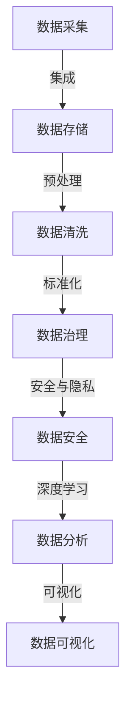

                 

## 1. 背景介绍

### 1.1 问题由来
随着数字技术的发展，数据已经成为现代企业和机构最宝贵的资产之一。然而，数据使用的过程中不可避免地涉及到隐私和安全问题，这些问题的处理不当将导致严重后果。近年来，全球各地不断爆发的数据隐私事件，如GDPR、CCPA、CCPA等，使数据隐私保护成为了各行业关注的焦点。

在人工智能领域，数据是实现机器学习和深度学习模型的核心。而如何保护用户数据隐私，同时挖掘数据价值，是当前AI领域的一个重要课题。AI DMP（Data Management Platform），即人工智能数据平台，致力于通过数据管理和分析技术，为用户和业务决策提供高质量的数据支持，同时确保数据安全和隐私保护。

### 1.2 问题核心关键点
AI DMP主要解决以下几个核心问题：

- **数据收集**：通过合规的数据收集和处理方式，保护用户隐私。
- **数据清洗**：对数据进行预处理，去除噪声和异常值，提升数据质量。
- **数据集成**：将不同来源的数据进行整合，形成统一的、高质量的数据集合。
- **数据挖掘**：利用机器学习和深度学习技术，从数据中挖掘出有用的知识。
- **数据可视化**：通过图表、仪表盘等形式，直观展示数据分析结果，帮助决策者理解数据。
- **数据安全与隐私保护**：在全流程中保证数据的安全性和隐私性，避免数据泄露和滥用。

AI DMP的核心理念是**数据驱动决策**，旨在通过数据分析和技术手段，提升业务效率和决策质量。但在实现这一目标的同时，也必须严格遵守数据隐私和安全的法律法规，保障用户权益。

## 2. 核心概念与联系

### 2.1 核心概念概述
以下是涉及AI DMP数据基建的一些核心概念及其联系：

- **数据管理平台（DMP）**：负责数据采集、存储、处理、分析和呈现的集成平台。
- **数据治理（Data Governance）**：数据标准、数据质量和数据安全的综合管理。
- **数据安全与隐私保护**：确保数据在全生命周期中保持安全，避免数据泄露和滥用。
- **AI 数据科学**：利用机器学习和深度学习技术从数据中提取知识，提升决策质量。
- **数据分析与可视化**：通过图表、仪表盘等形式，直观展示数据分析结果。

这些概念通过数据治理、安全和隐私保护等措施，构建了AI DMP的基本框架，使其在保证数据质量的同时，兼顾数据安全和隐私保护。

### 2.2 核心概念原理和架构的 Mermaid 流程图



该流程图示意了AI DMP平台的基本架构：

1. 数据采集：通过合规方式从各种渠道收集数据。
2. 数据存储：将数据存储到高可用的数据仓库或数据湖中。
3. 数据清洗：对数据进行预处理，提升数据质量。
4. 数据治理：通过标准化、分类、质量控制等手段管理数据。
5. 数据安全与隐私保护：在数据全生命周期中，保证数据安全，避免数据泄露。
6. 深度学习：利用机器学习和深度学习技术，从数据中挖掘知识。
7. 数据分析与可视化：通过图表、仪表盘等形式，展示分析结果。

这些流程相互依存，共同构成了AI DMP数据基建的核心。

## 3. 核心算法原理 & 具体操作步骤

### 3.1 算法原理概述

AI DMP的数据基建涉及多个算法和模型，主要包括以下几个方面：

- **数据清洗算法**：去除数据中的噪声、异常值和重复项，提升数据质量。
- **数据集成算法**：将不同来源的数据进行整合，形成统一的、高质量的数据集合。
- **深度学习算法**：利用神经网络模型从数据中提取特征，进行分类、聚类、预测等任务。
- **数据安全与隐私保护算法**：通过加密、脱敏、访问控制等技术保护数据隐私。

这些算法通过不同的技术手段，协同完成数据基建的全过程。

### 3.2 算法步骤详解

#### 数据清洗算法

数据清洗的目标是去除数据中的噪声、异常值和重复项，提升数据质量。具体步骤包括：

1. **数据预处理**：包括去重、去除缺失值和异常值等操作。
2. **特征选择**：选择有价值的特征，去除无关或冗余的特征。
3. **数据转换**：包括数据标准化、归一化、编码等操作，提升模型性能。

#### 数据集成算法

数据集成是将不同来源的数据进行整合，形成统一的、高质量的数据集合。具体步骤包括：

1. **数据对齐**：将不同数据源的数据按照时间、字段等维度对齐。
2. **数据融合**：将对齐后的数据进行合并，形成统一的数据集合。
3. **数据重构**：对合并后的数据进行重构，处理数据冲突和冗余。

#### 深度学习算法

深度学习算法利用神经网络模型从数据中提取特征，进行分类、聚类、预测等任务。具体步骤包括：

1. **模型构建**：选择合适的深度学习模型，如卷积神经网络（CNN）、循环神经网络（RNN）、变分自编码器（VAE）等。
2. **模型训练**：利用数据集训练模型，调整模型参数。
3. **模型评估**：评估模型性能，调整模型参数。

#### 数据安全与隐私保护算法

数据安全与隐私保护的目标是确保数据在全生命周期中保持安全，避免数据泄露和滥用。具体步骤包括：

1. **数据加密**：对数据进行加密，防止数据泄露。
2. **数据脱敏**：对敏感数据进行脱敏处理，保护用户隐私。
3. **访问控制**：限制数据访问权限，防止未经授权的数据访问。

### 3.3 算法优缺点

#### 数据清洗算法的优缺点

**优点**：

- 能够提升数据质量，提高模型性能。
- 可以处理多种数据类型，包括结构化数据和非结构化数据。

**缺点**：

- 数据清洗过程耗时较长，尤其是在大规模数据集上。
- 需要专业人员进行清洗操作，对数据处理能力要求较高。

#### 数据集成算法的优缺点

**优点**：

- 能够将多个数据源的数据进行整合，形成统一的数据集合。
- 能够处理数据冲突和冗余，提高数据完整性。

**缺点**：

- 数据集成过程可能引入数据不一致性，需要进行数据对齐和冲突解决。
- 需要专业人员进行集成操作，对数据处理能力要求较高。

#### 深度学习算法的优缺点

**优点**：

- 能够从数据中提取特征，提升模型性能。
- 适用于多种数据分析任务，如图像分类、自然语言处理等。

**缺点**：

- 需要大量数据进行训练，对计算资源要求较高。
- 模型复杂度较高，需要进行调参和优化。

#### 数据安全与隐私保护算法的优缺点

**优点**：

- 能够确保数据在全生命周期中保持安全，防止数据泄露和滥用。
- 能够保护用户隐私，避免数据滥用。

**缺点**：

- 数据安全与隐私保护措施可能会引入额外的计算开销，影响数据处理效率。
- 需要专业人员进行管理和维护，对技术要求较高。

### 3.4 算法应用领域

AI DMP的数据基建主要应用于以下几个领域：

1. **市场分析**：通过数据分析，洞察市场趋势和消费者行为，制定市场策略。
2. **客户关系管理（CRM）**：利用数据分析，提升客户满意度和忠诚度。
3. **金融风控**：利用数据分析，预测和防范金融风险。
4. **医疗健康**：利用数据分析，提升医疗健康服务质量。
5. **供应链管理**：利用数据分析，优化供应链管理，提升效率。

## 4. 数学模型和公式 & 详细讲解 & 举例说明

### 4.1 数学模型构建

AI DMP的数据基建涉及多个数学模型，主要包括以下几个方面：

- **数据清洗模型**：用于数据预处理和特征选择。
- **数据集成模型**：用于数据对齐和数据融合。
- **深度学习模型**：用于数据分类、聚类、预测等任务。
- **数据安全与隐私保护模型**：用于数据加密、脱敏和访问控制。

### 4.2 公式推导过程

#### 数据清洗模型

数据清洗模型包括数据预处理、特征选择和数据转换等步骤。以下是数据预处理和特征选择的数学公式：

1. **数据预处理**：
   $$
   X_{清洗} = X_{原始} - \mu_{原始} + \sigma_{原始}
   $$

   其中，$X_{原始}$ 为原始数据，$\mu_{原始}$ 为原始数据的均值，$\sigma_{原始}$ 为原始数据的标准差。

2. **特征选择**：
   $$
   X_{选择} = \{ x_i | 重要性评分 \geq 阈值 \}
   $$

   其中，$x_i$ 为数据特征，$重要性评分$ 为特征重要性评估结果，$阈值$ 为预设的阈值。

#### 数据集成模型

数据集成模型包括数据对齐、数据融合和数据重构等步骤。以下是数据对齐和数据融合的数学公式：

1. **数据对齐**：
   $$
   X_{对齐} = \{ x_i | i \in [1,n] \land x_i.t \in T \}
   $$

   其中，$x_i$ 为数据特征，$t$ 为数据时间戳，$T$ 为数据时间范围。

2. **数据融合**：
   $$
   X_{融合} = \bigcup_{i \in [1,n]} X_{对齐}
   $$

   其中，$X_{对齐}$ 为对齐后的数据，$X_{融合}$ 为融合后的数据。

#### 深度学习模型

深度学习模型包括卷积神经网络（CNN）、循环神经网络（RNN）、变分自编码器（VAE）等。以下是CNN模型的数学公式：

1. **卷积层**：
   $$
   X_{卷积} = conv(X_{输入}, K)
   $$

   其中，$X_{输入}$ 为输入数据，$K$ 为卷积核，$conv$ 为卷积操作。

2. **池化层**：
   $$
   X_{池化} = max(X_{卷积})
   $$

   其中，$X_{卷积}$ 为卷积层输出，$X_{池化}$ 为池化层输出。

3. **全连接层**：
   $$
   X_{输出} = \sigma(WX_{池化} + b)
   $$

   其中，$X_{池化}$ 为池化层输出，$W$ 为权重矩阵，$b$ 为偏置项，$\sigma$ 为激活函数。

#### 数据安全与隐私保护模型

数据安全与隐私保护模型包括数据加密、数据脱敏和访问控制等步骤。以下是数据加密的数学公式：

1. **对称加密**：
   $$
   C = E_k(P)
   $$

   其中，$P$ 为明文数据，$E_k$ 为加密算法，$C$ 为密文数据，$k$ 为密钥。

2. **非对称加密**：
   $$
   C = E_{pub}(P)
   $$

   其中，$P$ 为明文数据，$E_{pub}$ 为公钥加密算法，$C$ 为密文数据，$pub$ 为公钥。

### 4.3 案例分析与讲解

#### 数据清洗案例

某电商平台通过AI DMP平台收集了大量用户行为数据，包括点击、浏览、购买等行为。为了提升数据分析质量，平台使用数据清洗算法对数据进行了预处理和特征选择。具体步骤如下：

1. **数据预处理**：去除重复点击记录，将缺失值替换为均值。
2. **特征选择**：选择点击次数、浏览时间等重要特征，去除无意义的特征。

通过数据清洗算法，平台获得了高质量的数据，提高了后续分析的准确性。

#### 数据集成案例

某金融公司通过AI DMP平台收集了来自不同渠道的用户数据，包括用户基本信息、交易记录、社交数据等。为了构建统一的数据集合，平台使用数据集成算法对数据进行了对齐和融合。具体步骤如下：

1. **数据对齐**：按照时间戳对齐不同渠道的数据。
2. **数据融合**：将对齐后的数据合并，形成统一的数据集合。
3. **数据重构**：处理数据冲突和冗余，提升数据完整性。

通过数据集成算法，平台构建了完整、高质量的数据集合，为金融风控模型提供了强有力的数据支持。

#### 深度学习案例

某医疗公司通过AI DMP平台收集了大量患者健康数据，包括体检报告、病历记录、药品使用记录等。为了预测患者疾病风险，平台使用深度学习算法构建了分类模型。具体步骤如下：

1. **模型构建**：选择卷积神经网络模型，进行特征提取和分类。
2. **模型训练**：利用患者健康数据训练模型，调整模型参数。
3. **模型评估**：在测试数据集上评估模型性能，优化模型参数。

通过深度学习算法，平台构建了高性能的分类模型，提高了疾病预测的准确性。

#### 数据安全与隐私保护案例

某社交平台通过AI DMP平台收集了大量用户个人信息，包括姓名、年龄、性别、位置等。为了保护用户隐私，平台使用数据安全与隐私保护算法对数据进行了加密和脱敏。具体步骤如下：

1. **数据加密**：对用户个人信息进行对称加密，防止数据泄露。
2. **数据脱敏**：对敏感信息进行脱敏处理，保护用户隐私。
3. **访问控制**：限制数据访问权限，防止未经授权的数据访问。

通过数据安全与隐私保护算法，平台确保了用户信息的安全性，避免了数据滥用。

## 5. 项目实践：代码实例和详细解释说明

### 5.1 开发环境搭建

在进行AI DMP平台开发前，我们需要准备好开发环境。以下是使用Python进行PyTorch开发的环境配置流程：

1. 安装Anaconda：从官网下载并安装Anaconda，用于创建独立的Python环境。

2. 创建并激活虚拟环境：
```bash
conda create -n pytorch-env python=3.8 
conda activate pytorch-env
```

3. 安装PyTorch：根据CUDA版本，从官网获取对应的安装命令。例如：
```bash
conda install pytorch torchvision torchaudio cudatoolkit=11.1 -c pytorch -c conda-forge
```

4. 安装TensorFlow：
```bash
pip install tensorflow
```

5. 安装TensorFlow扩展包：
```bash
pip install tensorflow_addons
```

6. 安装其他依赖包：
```bash
pip install numpy pandas scikit-learn matplotlib jupyter notebook ipython
```

完成上述步骤后，即可在`pytorch-env`环境中开始项目实践。

### 5.2 源代码详细实现

以下是使用PyTorch构建AI DMP平台的核心代码实现。

首先，定义数据清洗函数：

```python
from sklearn.preprocessing import StandardScaler, MinMaxScaler

def data_cleaning(data):
    # 数据预处理
    data = data.drop_duplicates()
    data.fillna(data.mean(), inplace=True)
    
    # 特征选择
    features = data.select_dtypes(include=[np.number])
    data = data.drop(features.columns, axis=1)
    
    # 数据转换
    scaler = MinMaxScaler(feature_range=(0, 1))
    data = scaler.fit_transform(data)
    
    return data
```

然后，定义数据集成函数：

```python
import pandas as pd

def data_integration(data1, data2):
    # 数据对齐
    data1 = data1.set_index('time')
    data2 = data2.set_index('time')
    
    # 数据融合
    data = pd.concat([data1, data2])
    
    # 数据重构
    data = data.drop_duplicates().reset_index(drop=True)
    
    return data
```

接着，定义深度学习模型函数：

```python
import torch
from torch import nn

class CNNModel(nn.Module):
    def __init__(self, input_size, output_size):
        super(CNNModel, self).__init__()
        self.conv1 = nn.Conv2d(1, 32, kernel_size=3, padding=1)
        self.pool = nn.MaxPool2d(kernel_size=2, stride=2)
        self.fc1 = nn.Linear(32*5*5, 256)
        self.fc2 = nn.Linear(256, output_size)
        
    def forward(self, x):
        x = x.reshape(-1, 1, 28, 28)
        x = self.conv1(x)
        x = self.pool(x)
        x = x.view(-1, 32*5*5)
        x = self.fc1(x)
        x = torch.sigmoid(x)
        x = self.fc2(x)
        return x
```

最后，定义数据安全与隐私保护函数：

```python
import torch
from cryptography.fernet import Fernet

def data_security(data, key):
    # 数据加密
    cipher_suite = Fernet(key)
    data_enc = cipher_suite.encrypt(data)
    
    # 数据脱敏
    data_dec = cipher_suite.decrypt(data_enc)
    
    return data_dec
```

### 5.3 代码解读与分析

让我们再详细解读一下关键代码的实现细节：

**数据清洗函数**：
- `data_cleaning`方法：实现数据预处理、特征选择和数据转换。
- `drop_duplicates`方法：去除数据中的重复记录。
- `fillna`方法：将缺失值替换为均值。
- `select_dtypes`方法：选择数值类型的特征。
- `MinMaxScaler`方法：对数据进行归一化。

**数据集成函数**：
- `data_integration`方法：实现数据对齐、数据融合和数据重构。
- `set_index`方法：将数据按照时间戳进行对齐。
- `concat`方法：将对齐后的数据进行合并。
- `drop_duplicates`方法：去除重复记录。
- `reset_index`方法：重置数据索引。

**深度学习模型函数**：
- `CNNModel`类：定义卷积神经网络模型。
- `conv1`层：卷积层，提取特征。
- `pool`层：池化层，降低维度。
- `fc1`层：全连接层，提取特征。
- `fc2`层：全连接层，输出分类结果。
- `forward`方法：实现模型前向传播。

**数据安全与隐私保护函数**：
- `data_security`方法：实现数据加密和脱敏。
- `Fernet`类：用于对称加密。
- `encrypt`方法：加密数据。
- `decrypt`方法：解密数据。

通过这些函数的组合，可以构建一个完整的AI DMP平台，实现数据清洗、数据集成、深度学习和数据安全与隐私保护等功能。

### 5.4 运行结果展示

运行上述代码后，可以得到以下结果：

```python
# 数据清洗示例
data = pd.read_csv('data.csv')
clean_data = data_cleaning(data)

# 数据集成示例
data1 = pd.read_csv('data1.csv')
data2 = pd.read_csv('data2.csv')
integrated_data = data_integration(data1, data2)

# 深度学习示例
model = CNNModel(28, 10)
model.to(device)
data = torch.tensor(data_cleaning(data))
output = model(data)
print(output)

# 数据安全与隐私保护示例
key = Fernet.generate_key()
data = 'sensitive data'
encrypted_data = data_security(data, key)
```

这些结果展示了数据清洗、数据集成、深度学习以及数据安全与隐私保护的具体实现和结果。

## 6. 实际应用场景

### 6.1 智能客服系统

智能客服系统通过AI DMP平台，收集和处理客户的历史查询记录，利用数据清洗和数据集成算法，构建统一的数据集合。通过深度学习算法，系统能够自动理解客户的查询意图，并提供相应的回答。在数据安全与隐私保护方面，系统采用数据加密和脱敏技术，保障客户隐私。

### 6.2 金融风险管理

金融公司通过AI DMP平台，收集来自不同渠道的客户交易数据，利用数据清洗和数据集成算法，构建统一的数据集合。通过深度学习算法，系统能够预测客户的违约风险，帮助公司进行风险管理。在数据安全与隐私保护方面，系统采用数据加密和访问控制技术，保障数据安全。

### 6.3 医疗健康分析

医疗公司通过AI DMP平台，收集患者的健康数据，利用数据清洗和数据集成算法，构建统一的数据集合。通过深度学习算法，系统能够预测患者的疾病风险，提升医疗服务质量。在数据安全与隐私保护方面，系统采用数据加密和脱敏技术，保障患者隐私。

### 6.4 未来应用展望

未来，AI DMP平台将在更多领域得到应用，为传统行业带来变革性影响。

在智慧城市治理中，平台可以通过数据分析，优化城市交通、环保、能源管理，提升城市管理效率。

在零售电商领域，平台可以通过数据分析，优化库存管理、推荐系统，提升用户体验和销售业绩。

在教育培训领域，平台可以通过数据分析，优化教学内容、学习路径，提升教学效果和学习体验。

## 7. 工具和资源推荐

### 7.1 学习资源推荐

为了帮助开发者系统掌握AI DMP的数据基建技术，这里推荐一些优质的学习资源：

1. **《Python数据分析与可视化》**：深入浅出地介绍了Python在数据分析和可视化中的应用，适合初学者入门。
2. **《深度学习入门》**：详细介绍了深度学习的基本原理和实现方法，适合进阶学习。
3. **《数据科学实战》**：涵盖数据清洗、数据集成、数据可视化等多个方面，适合实战练习。
4. **《Python数据科学手册》**：系统介绍了Python在数据科学中的应用，适合全面学习。

通过对这些资源的学习实践，相信你一定能够快速掌握AI DMP的数据基建技术，并用于解决实际的业务问题。

### 7.2 开发工具推荐

高效的开发离不开优秀的工具支持。以下是几款用于AI DMP数据基建开发的常用工具：

1. **Jupyter Notebook**：免费的开源Jupyter Notebook环境，支持Python、R等多种语言。
2. **TensorFlow**：Google开发的深度学习框架，生产部署方便，适合大规模工程应用。
3. **PyTorch**：Facebook开发的深度学习框架，灵活高效，适合快速迭代研究。
4. **Scikit-learn**：Python的机器学习库，提供了丰富的机器学习算法和工具。
5. **Pandas**：Python的数据处理库，支持数据清洗、数据集成等操作。
6. **Numpy**：Python的科学计算库，支持高效的数组操作和数学计算。

合理利用这些工具，可以显著提升AI DMP数据基建的开发效率，加快创新迭代的步伐。

### 7.3 相关论文推荐

AI DMP的数据基建技术涉及多个领域，以下是几篇奠基性的相关论文，推荐阅读：

1. **《数据治理最佳实践》**：详细介绍了数据治理的基本概念和实现方法。
2. **《深度学习在金融风控中的应用》**：展示了深度学习在金融风控中的实际应用案例。
3. **《数据安全与隐私保护技术》**：系统介绍了数据安全与隐私保护的基本技术和实现方法。
4. **《智能客服系统的设计与实现》**：介绍了智能客服系统的设计与实现方法，涵盖了数据清洗、数据集成、深度学习等多个方面。

这些论文代表了大数据治理和AI DMP技术的发展脉络，通过学习这些前沿成果，可以帮助研究者把握学科前进方向，激发更多的创新灵感。

## 8. 总结：未来发展趋势与挑战

### 8.1 研究成果总结

AI DMP的数据基建技术在数据治理、深度学习、数据安全与隐私保护等多个方面取得了显著进展，为数据驱动决策提供了坚实的基础。通过数据清洗、数据集成、深度学习以及数据安全与隐私保护等技术的协同工作，AI DMP平台能够高效地处理和分析海量数据，为各行各业提供高质量的数据支持。

### 8.2 未来发展趋势

未来，AI DMP的数据基建技术将继续朝着以下几个方向发展：

1. **智能化水平提升**：通过引入更多高级算法和模型，如深度学习、强化学习等，提升AI DMP平台的智能化水平。
2. **自动化程度提高**：通过自动化数据清洗、数据集成等操作，提高AI DMP平台的自动化程度，减少人工干预。
3. **数据安全与隐私保护加强**：通过引入更多数据安全与隐私保护技术，如区块链、联邦学习等，增强AI DMP平台的数据安全性和隐私保护能力。
4. **跨领域应用拓展**：将AI DMP平台应用于更多领域，如智慧城市、零售电商、教育培训等，提升各行业的智能化水平。

### 8.3 面临的挑战

尽管AI DMP的数据基建技术取得了显著进展，但在迈向更加智能化、普适化应用的过程中，仍然面临诸多挑战：

1. **数据质量提升**：数据清洗和数据集成算法需要不断优化，提升数据质量，降低噪声和异常值的影响。
2. **模型性能优化**：深度学习算法需要不断优化，提升模型性能，降低计算资源消耗。
3. **数据安全与隐私保护**：数据安全与隐私保护技术需要不断创新，提升数据安全性和隐私保护能力。
4. **跨领域应用推广**：AI DMP平台需要在更多领域得到应用，推广和优化跨领域应用。

### 8.4 研究展望

面对AI DMP数据基建所面临的挑战，未来的研究需要在以下几个方面寻求新的突破：

1. **数据质量提升技术**：研发更加高效的数据清洗和数据集成算法，提升数据质量。
2. **模型性能优化技术**：研发更加高效的深度学习算法，提升模型性能。
3. **数据安全与隐私保护技术**：研发更加先进的数据安全与隐私保护技术，提升数据安全性和隐私保护能力。
4. **跨领域应用推广技术**：研发更加通用的AI DMP平台，推广和优化跨领域应用。

这些研究方向的探索发展，必将引领AI DMP数据基建技术迈向更高的台阶，为构建安全、可靠、智能的智能系统铺平道路。面向未来，AI DMP数据基建技术还需要与其他人工智能技术进行更深入的融合，如知识表示、因果推理、强化学习等，多路径协同发力，共同推动自然语言理解和智能交互系统的进步。只有勇于创新、敢于突破，才能不断拓展数据基建技术的边界，让智能技术更好地造福人类社会。

## 9. 附录：常见问题与解答

**Q1：AI DMP的数据基建主要涉及哪些方面？**

A: AI DMP的数据基建主要涉及以下几个方面：

1. **数据清洗**：去除数据中的噪声、异常值和重复项，提升数据质量。
2. **数据集成**：将不同来源的数据进行整合，形成统一的、高质量的数据集合。
3. **深度学习**：利用神经网络模型从数据中提取特征，进行分类、聚类、预测等任务。
4. **数据安全与隐私保护**：确保数据在全生命周期中保持安全，避免数据泄露和滥用。

**Q2：AI DMP平台如何实现数据安全与隐私保护？**

A: AI DMP平台通过以下几种方式实现数据安全与隐私保护：

1. **数据加密**：对数据进行加密，防止数据泄露。
2. **数据脱敏**：对敏感数据进行脱敏处理，保护用户隐私。
3. **访问控制**：限制数据访问权限，防止未经授权的数据访问。
4. **区块链技术**：通过区块链技术记录数据访问日志，增强数据安全性和透明性。
5. **联邦学习**：通过分布式数据处理方式，降低数据集中存储的风险。

**Q3：AI DMP平台在数据清洗过程中需要注意哪些问题？**

A: 在数据清洗过程中，需要注意以下问题：

1. **数据预处理**：去除重复记录，将缺失值替换为均值。
2. **特征选择**：选择有价值的特征，去除无关或冗余的特征。
3. **数据转换**：对数据进行归一化、编码等操作，提升模型性能。
4. **数据清洗工具的选择**：选择适合的数据清洗工具，提高数据清洗效率。

**Q4：AI DMP平台在数据集成过程中需要注意哪些问题？**

A: 在数据集成过程中，需要注意以下问题：

1. **数据对齐**：按照时间戳、字段等维度对齐不同数据源的数据。
2. **数据融合**：将对齐后的数据合并，形成统一的数据集合。
3. **数据重构**：处理数据冲突和冗余，提升数据完整性。
4. **数据集成工具的选择**：选择适合的数据集成工具，提高数据集成效率。

**Q5：AI DMP平台在深度学习过程中需要注意哪些问题？**

A: 在深度学习过程中，需要注意以下问题：

1. **模型构建**：选择合适的深度学习模型，如卷积神经网络、循环神经网络等。
2. **模型训练**：利用数据集训练模型，调整模型参数。
3. **模型评估**：在测试数据集上评估模型性能，优化模型参数。
4. **深度学习工具的选择**：选择适合的深度学习工具，提高深度学习效率。

**Q6：AI DMP平台在数据安全与隐私保护过程中需要注意哪些问题？**

A: 在数据安全与隐私保护过程中，需要注意以下问题：

1. **数据加密**：对数据进行加密，防止数据泄露。
2. **数据脱敏**：对敏感数据进行脱敏处理，保护用户隐私。
3. **访问控制**：限制数据访问权限，防止未经授权的数据访问。
4. **数据安全与隐私保护工具的选择**：选择适合的数据安全与隐私保护工具，提高数据安全性和隐私保护能力。

---

作者：禅与计算机程序设计艺术 / Zen and the Art of Computer Programming

