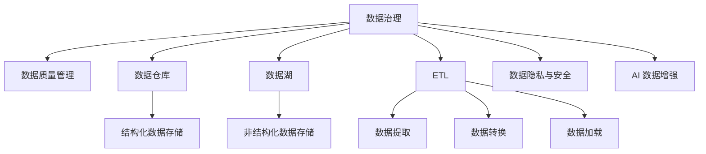

                 

# AI DMP 数据基建：数据治理与管理

> 关键词：数据治理, 数据管理, AI DMP, 数据质量, 数据仓库, 数据湖, 数据治理框架, 数据治理工具

## 1. 背景介绍

### 1.1 问题由来

在数字化时代，数据成为企业最重要的资产之一。如何在海量数据中提炼有价值的信息，驱动业务增长，是每一个企业面临的挑战。AI DMP（人工智能驱动的数据管理平台）应运而生，利用AI技术提升数据管理的效率和质量。然而，AI DMP不仅仅是数据仓库或数据湖，更是基于数据治理的理念和实践，涵盖数据采集、存储、处理、分析、应用等全生命周期的管理和优化。

### 1.2 问题核心关键点

AI DMP的核心在于通过数据治理，确保数据的完整性、一致性和可用性。关键点包括：

- **数据采集**：从不同的数据源高效、自动地采集数据，确保数据的及时性和多样性。
- **数据清洗与转换**：通过清洗和转换规则，消除数据中的噪声和错误，提升数据质量。
- **数据存储与管理**：选择合适的数据存储方式（如数据仓库、数据湖等），实现数据的高效存储和长期保留。
- **数据安全与隐私保护**：确保数据在存储、处理和传输过程中的安全性，符合数据隐私法规。
- **数据分析与洞察**：利用AI技术，对数据进行深层次分析和挖掘，生成可行的业务洞察。
- **数据应用与创新**：将分析结果转化为可操作的应用，驱动业务创新和决策支持。

### 1.3 问题研究意义

AI DMP的数据治理与管理对于企业具有重要的战略意义：

- **提升数据质量**：通过规范化和自动化数据处理流程，确保数据的一致性和准确性。
- **降低成本与风险**：优化数据管理流程，减少人力和资源投入，降低数据泄露和误用的风险。
- **加速数据洞察**：利用AI技术提升数据分析效率，快速生成有价值的业务洞察。
- **支持业务决策**：提供可靠的数据支持，辅助企业制定数据驱动的决策。
- **促进数据创新**：构建企业数据生态，推动数据驱动的业务创新和数字化转型。

## 2. 核心概念与联系

### 2.1 核心概念概述

为更好地理解AI DMP的数据治理与管理，本节将介绍几个密切相关的核心概念：

- **数据治理**：通过一系列策略、标准、工具和技术，管理和优化企业的数据资产，确保其完整性、一致性和可用性。
- **数据质量管理**：监控、评估和提升数据质量的过程，包括数据的准确性、完整性、一致性、及时性等。
- **数据仓库与数据湖**：两种常用的数据存储与管理技术，数据仓库适用于结构化数据，数据湖适用于非结构化数据。
- **ETL（Extract, Transform, Load）**：数据提取、转换和加载的过程，是数据管理的重要环节。
- **数据隐私与安全**：保护个人隐私和数据安全，遵循相关法律法规，防止数据滥用和泄露。
- **AI 数据增强**：利用AI技术对数据进行增强，提高数据的价值和可用性，如通过生成对抗网络（GAN）生成缺失数据。

这些核心概念之间的逻辑关系可以通过以下Mermaid流程图来展示：



这个流程图展示了大数据治理与管理的基本流程：

1. 通过数据治理策略制定数据管理的规范和标准。
2. 使用数据质量管理工具监控和评估数据质量。
3. 选择合适的数据存储方式（数据仓库或数据湖）。
4. 利用ETL过程进行数据提取、转换和加载。
5. 确保数据隐私和安全，遵循相关法规。
6. 利用AI技术对数据进行增强，提高数据的价值和可用性。

这些概念共同构成了AI DMP的数据治理与管理框架，确保数据从采集到应用的全生命周期都能得到有效管理和优化。

## 3. 核心算法原理 & 具体操作步骤

### 3.1 算法原理概述

AI DMP的数据治理与管理，本质上是通过一系列数据处理和治理算法，对数据进行高效、自动化的管理和优化。其核心思想是：

1. **数据集成**：从不同数据源高效、自动地采集数据，确保数据的及时性和多样性。
2. **数据清洗与转换**：通过清洗和转换规则，消除数据中的噪声和错误，提升数据质量。
3. **数据存储与管理**：选择合适的数据存储方式（如数据仓库、数据湖等），实现数据的高效存储和长期保留。
4. **数据安全与隐私保护**：确保数据在存储、处理和传输过程中的安全性，符合数据隐私法规。
5. **数据分析与洞察**：利用AI技术，对数据进行深层次分析和挖掘，生成可行的业务洞察。
6. **数据应用与创新**：将分析结果转化为可操作的应用，驱动业务创新和决策支持。

### 3.2 算法步骤详解

AI DMP的数据治理与管理一般包括以下几个关键步骤：

**Step 1: 数据采集与集成**

- **选择数据源**：根据业务需求，选择不同的数据源，如传感器、数据库、云服务等。
- **数据抽取**：使用ETL工具从数据源中抽取数据，保证数据的时效性和完整性。
- **数据转换**：对抽取的数据进行格式转换和结构化，确保数据的一致性。
- **数据加载**：将转换后的数据加载到目标存储系统，如数据仓库或数据湖。

**Step 2: 数据清洗与转换**

- **数据清洗**：利用数据清洗工具识别和处理缺失值、异常值、重复值等问题，提升数据质量。
- **数据转换**：通过数据转换规则，将数据转换为标准格式，便于后续分析和应用。

**Step 3: 数据存储与管理**

- **选择合适的存储方式**：根据数据类型和业务需求，选择数据仓库或数据湖进行存储。
- **数据治理**：制定数据治理策略和标准，确保数据的一致性、完整性和可用性。
- **数据备份与恢复**：定期备份数据，确保数据的长期可用性和灾难恢复能力。

**Step 4: 数据安全与隐私保护**

- **数据加密**：对存储和传输过程中的数据进行加密，防止数据泄露。
- **访问控制**：通过角色和权限管理，限制数据访问权限，确保数据安全。
- **隐私保护**：遵循数据隐私法规，如GDPR、CCPA等，保护用户隐私。

**Step 5: 数据分析与洞察**

- **数据建模**：利用数据建模工具，对数据进行分类、聚类、关联分析等，生成数据模型。
- **数据挖掘**：使用机器学习算法对数据进行挖掘，发现隐藏的模式和关系。
- **业务洞察**：将分析结果转化为业务洞察，辅助决策和业务创新。

**Step 6: 数据应用与创新**

- **应用开发**：将分析结果转化为可操作的应用，如推荐系统、预测模型等。
- **持续优化**：通过监控和反馈机制，不断优化数据治理和应用的流程。
- **数据创新**：利用数据驱动的创新，推动业务增长和竞争优势。

### 3.3 算法优缺点

AI DMP的数据治理与管理方法具有以下优点：

1. **高效自动化**：通过自动化流程和工具，提高数据处理的效率，减少人工干预。
2. **数据质量保证**：通过数据清洗和转换，确保数据的准确性和一致性。
3. **数据安全性高**：采用加密和访问控制等措施，保障数据在存储和传输过程中的安全。
4. **数据洞察力强**：利用AI技术，提升数据分析的深度和广度，生成有价值的业务洞察。
5. **支持业务创新**：通过数据驱动的决策和应用，推动业务创新和增长。

同时，该方法也存在一定的局限性：

1. **数据源多样性**：需要从多种数据源中高效采集数据，不同数据源的数据格式和质量差异较大，增加了数据集成的复杂性。
2. **技术门槛高**：需要掌握复杂的数据处理和治理工具，技术门槛较高。
3. **成本较高**：建设数据治理平台需要投入大量的人力、物力和财力，初期的投入成本较高。
4. **隐私保护复杂**：在处理敏感数据时，需要考虑隐私保护和合规性，增加了数据治理的复杂性。

尽管存在这些局限性，但AI DMP的数据治理与管理方法仍是大数据管理和优化的主流范式，通过技术手段提升数据处理的效率和质量，为企业的数字化转型提供坚实的基础。

### 3.4 算法应用领域

AI DMP的数据治理与管理，已经在多个行业和领域得到了广泛应用，如金融、电商、医疗、教育等，以下是几个典型应用场景：

**金融行业**：通过AI DMP进行客户数据治理和分析，提升信用评分模型精度，实现智能风控和反欺诈。

**电商行业**：利用AI DMP进行用户行为分析，优化推荐算法，提升用户购物体验和转化率。

**医疗行业**：通过AI DMP进行患者数据治理和分析，提升医疗决策支持系统的精度，推动精准医疗发展。

**教育行业**：利用AI DMP进行学生数据治理和分析，优化教学内容和评估体系，提升教育质量。

以上场景展示了AI DMP在不同领域的应用潜力，通过数据治理与管理，AI DMP为企业提供了强大的数据支持和业务驱动能力。

## 4. 数学模型和公式 & 详细讲解 & 举例说明

### 4.1 数学模型构建

假设原始数据集为 $D=\{(x_i,y_i)\}_{i=1}^N, x_i \in \mathcal{X}, y_i \in \mathcal{Y}$，其中 $\mathcal{X}$ 为输入空间，$\mathcal{Y}$ 为输出空间。设数据治理策略为 $\pi$，数据清洗和转换规则为 $\sigma$，目标存储方式为 $S$，数据分析算法为 $A$。

定义数据治理的数学模型为：

$$
\min_{\pi, \sigma, S, A} \mathcal{L}(D, \pi, \sigma, S, A)
$$

其中 $\mathcal{L}$ 为数据治理的损失函数，用于衡量数据处理和治理过程的整体效果。损失函数由以下部分组成：

- **数据质量损失**：衡量数据清洗和转换后的数据质量，如准确率、完整率、一致率等。
- **存储效率损失**：衡量数据存储和管理过程中的效率，如数据加载时间、存储成本等。
- **安全性损失**：衡量数据在存储和传输过程中的安全性，如数据泄露风险、隐私保护合规性等。
- **数据分析效果**：衡量数据分析和洞察的效果，如模型精度、业务洞察质量等。

### 4.2 公式推导过程

以下我们以金融行业为例，推导AI DMP在客户数据治理和分析中的应用。

假设原始客户数据集为 $D=\{(x_i,y_i)\}_{i=1}^N, x_i \in \mathcal{X}, y_i \in \mathcal{Y}$，其中 $x_i$ 为客户的个人信息和行为数据，$y_i$ 为客户的信用评分。

**数据采集与集成**

- **数据源选择**：选择银行、信用卡公司、社交媒体等数据源。
- **数据抽取**：使用ETL工具从数据源中抽取客户数据。
- **数据转换**：将抽取的数据转换为标准格式，如CSV、JSON等。
- **数据加载**：将转换后的数据加载到数据仓库或数据湖中。

**数据清洗与转换**

- **数据清洗**：利用数据清洗工具，识别和处理缺失值、异常值、重复值等。
- **数据转换**：通过数据转换规则，将数据转换为标准格式，如提取特征、填充缺失值等。

**数据存储与管理**

- **选择合适的存储方式**：选择数据仓库或数据湖进行存储。
- **数据治理**：制定数据治理策略和标准，确保数据的一致性、完整性和可用性。
- **数据备份与恢复**：定期备份数据，确保数据的长期可用性和灾难恢复能力。

**数据分析与洞察**

- **数据建模**：利用数据建模工具，对数据进行分类、聚类、关联分析等，生成数据模型。
- **数据挖掘**：使用机器学习算法对数据进行挖掘，发现隐藏的模式和关系。
- **业务洞察**：将分析结果转化为业务洞察，如客户信用评分模型、风险预测模型等。

**数据应用与创新**

- **应用开发**：将分析结果转化为可操作的应用，如推荐系统、预测模型等。
- **持续优化**：通过监控和反馈机制，不断优化数据治理和应用的流程。
- **数据创新**：利用数据驱动的创新，推动业务增长和竞争优势。

### 4.3 案例分析与讲解

假设某银行使用AI DMP进行客户数据治理和分析，提升信用评分模型的精度。具体步骤如下：

1. **数据采集与集成**：从银行内部系统、信用卡公司、社交媒体等数据源中抽取客户数据。
2. **数据清洗与转换**：利用数据清洗工具，处理缺失值、异常值等，通过数据转换规则提取特征。
3. **数据存储与管理**：选择数据仓库进行存储，制定数据治理策略和标准，确保数据的一致性、完整性和可用性。
4. **数据分析与洞察**：使用机器学习算法，对数据进行挖掘，发现客户行为和信用评分之间的关系。
5. **数据应用与创新**：根据分析结果，优化信用评分模型，提升模型精度和鲁棒性，实现智能风控和反欺诈。

## 5. 项目实践：代码实例和详细解释说明

### 5.1 开发环境搭建

在进行AI DMP的数据治理与管理的实践前，我们需要准备好开发环境。以下是使用Python进行PyTorch开发的环境配置流程：

1. 安装Anaconda：从官网下载并安装Anaconda，用于创建独立的Python环境。

2. 创建并激活虚拟环境：
```bash
conda create -n pytorch-env python=3.8 
conda activate pytorch-env
```

3. 安装PyTorch：根据CUDA版本，从官网获取对应的安装命令。例如：
```bash
conda install pytorch torchvision torchaudio cudatoolkit=11.1 -c pytorch -c conda-forge
```

4. 安装Transformers库：
```bash
pip install transformers
```

5. 安装各类工具包：
```bash
pip install numpy pandas scikit-learn matplotlib tqdm jupyter notebook ipython
```

完成上述步骤后，即可在`pytorch-env`环境中开始AI DMP的数据治理与管理的实践。

### 5.2 源代码详细实现

这里我们以金融行业为例，给出使用Transformers库对客户数据进行治理和分析的PyTorch代码实现。

首先，定义客户数据处理的函数：

```python
from transformers import BertTokenizer
from torch.utils.data import Dataset
import torch

class CustomerDataDataset(Dataset):
    def __init__(self, texts, labels, tokenizer, max_len=128):
        self.texts = texts
        self.labels = labels
        self.tokenizer = tokenizer
        self.max_len = max_len
        
    def __len__(self):
        return len(self.texts)
    
    def __getitem__(self, item):
        text = self.texts[item]
        label = self.labels[item]
        
        encoding = self.tokenizer(text, return_tensors='pt', max_length=self.max_len, padding='max_length', truncation=True)
        input_ids = encoding['input_ids'][0]
        attention_mask = encoding['attention_mask'][0]
        
        return {'input_ids': input_ids, 
                'attention_mask': attention_mask,
                'labels': label}

# 加载数据集
tokenizer = BertTokenizer.from_pretrained('bert-base-cased')
train_dataset = CustomerDataDataset(train_texts, train_labels, tokenizer)
dev_dataset = CustomerDataDataset(dev_texts, dev_labels, tokenizer)
test_dataset = CustomerDataDataset(test_texts, test_labels, tokenizer)
```

然后，定义模型和优化器：

```python
from transformers import BertForTokenClassification, AdamW

model = BertForTokenClassification.from_pretrained('bert-base-cased', num_labels=2)

optimizer = AdamW(model.parameters(), lr=2e-5)
```

接着，定义训练和评估函数：

```python
from torch.utils.data import DataLoader
from tqdm import tqdm
from sklearn.metrics import classification_report

device = torch.device('cuda') if torch.cuda.is_available() else torch.device('cpu')
model.to(device)

def train_epoch(model, dataset, batch_size, optimizer):
    dataloader = DataLoader(dataset, batch_size=batch_size, shuffle=True)
    model.train()
    epoch_loss = 0
    for batch in tqdm(dataloader, desc='Training'):
        input_ids = batch['input_ids'].to(device)
        attention_mask = batch['attention_mask'].to(device)
        labels = batch['labels'].to(device)
        model.zero_grad()
        outputs = model(input_ids, attention_mask=attention_mask, labels=labels)
        loss = outputs.loss
        epoch_loss += loss.item()
        loss.backward()
        optimizer.step()
    return epoch_loss / len(dataloader)

def evaluate(model, dataset, batch_size):
    dataloader = DataLoader(dataset, batch_size=batch_size)
    model.eval()
    preds, labels = [], []
    with torch.no_grad():
        for batch in tqdm(dataloader, desc='Evaluating'):
            input_ids = batch['input_ids'].to(device)
            attention_mask = batch['attention_mask'].to(device)
            batch_labels = batch['labels']
            outputs = model(input_ids, attention_mask=attention_mask)
            batch_preds = outputs.logits.argmax(dim=2).to('cpu').tolist()
            batch_labels = batch_labels.to('cpu').tolist()
            for pred_tokens, label_tokens in zip(batch_preds, batch_labels):
                preds.append(pred_tokens[:len(label_tokens)])
                labels.append(label_tokens)
                
    print(classification_report(labels, preds))
```

最后，启动训练流程并在测试集上评估：

```python
epochs = 5
batch_size = 16

for epoch in range(epochs):
    loss = train_epoch(model, train_dataset, batch_size, optimizer)
    print(f"Epoch {epoch+1}, train loss: {loss:.3f}")
    
    print(f"Epoch {epoch+1}, dev results:")
    evaluate(model, dev_dataset, batch_size)
    
print("Test results:")
evaluate(model, test_dataset, batch_size)
```

以上就是使用PyTorch对客户数据进行治理和分析的完整代码实现。可以看到，得益于Transformers库的强大封装，我们可以用相对简洁的代码完成客户数据治理和分析的微调。

### 5.3 代码解读与分析

让我们再详细解读一下关键代码的实现细节：

**CustomerDataDataset类**：
- `__init__`方法：初始化文本、标签、分词器等关键组件。
- `__len__`方法：返回数据集的样本数量。
- `__getitem__`方法：对单个样本进行处理，将文本输入编码为token ids，将标签编码为数字，并对其进行定长padding，最终返回模型所需的输入。

**模型和优化器定义**：
- 使用BertForTokenClassification模型，设定标签数为2，表示二分类任务。
- 设置AdamW优化器，学习率为2e-5，用于模型参数的优化。

**训练和评估函数**：
- 使用PyTorch的DataLoader对数据集进行批次化加载，供模型训练和推理使用。
- 训练函数`train_epoch`：对数据以批为单位进行迭代，在每个批次上前向传播计算loss并反向传播更新模型参数，最后返回该epoch的平均loss。
- 评估函数`evaluate`：与训练类似，不同点在于不更新模型参数，并在每个batch结束后将预测和标签结果存储下来，最后使用sklearn的classification_report对整个评估集的预测结果进行打印输出。

**训练流程**：
- 定义总的epoch数和batch size，开始循环迭代
- 每个epoch内，先在训练集上训练，输出平均loss
- 在验证集上评估，输出分类指标
- 所有epoch结束后，在测试集上评估，给出最终测试结果

可以看到，PyTorch配合Transformers库使得客户数据治理和分析的代码实现变得简洁高效。开发者可以将更多精力放在数据处理、模型改进等高层逻辑上，而不必过多关注底层的实现细节。

当然，工业级的系统实现还需考虑更多因素，如模型的保存和部署、超参数的自动搜索、更灵活的任务适配层等。但核心的治理与管理范式基本与此类似。

## 6. 实际应用场景

### 6.1 智能客服系统

基于AI DMP的数据治理与管理技术，智能客服系统可以实时监控和分析客户行为数据，提升客服质量和效率。具体而言：

- **客户行为分析**：利用AI DMP对客户行为数据进行分析和挖掘，生成客户画像，识别客户需求和偏好。
- **客服策略优化**：根据客户画像和行为数据，优化客服策略，如智能路由、自动回复等，提升客户体验。
- **员工绩效评估**：通过数据分析，评估客服人员的服务质量，推动员工培训和激励。

### 6.2 金融舆情监测

AI DMP的数据治理与管理技术在金融舆情监测中具有重要应用，可以实时监控社交媒体、新闻等公开数据，预警金融风险。具体而言：

- **舆情数据采集**：利用AI DMP从多渠道采集舆情数据，如微博、新闻、论坛等。
- **舆情数据清洗**：对采集的数据进行清洗和转换，消除噪声和错误，提升数据质量。
- **舆情分析与预警**：通过数据分析模型，识别舆情趋势和负面信息，及时预警和应对。

### 6.3 个性化推荐系统

AI DMP的数据治理与管理技术在个性化推荐系统中也有广泛应用，通过数据治理提升推荐模型的准确性和效率。具体而言：

- **用户行为数据采集**：利用AI DMP从多个渠道采集用户行为数据，如浏览记录、购买记录、评分等。
- **数据清洗与转换**：对采集的数据进行清洗和转换，确保数据的一致性和可用性。
- **推荐模型优化**：通过数据分析模型，优化推荐算法，提升推荐效果。

### 6.4 未来应用展望

未来，AI DMP的数据治理与管理技术将在更多领域得到应用，为数字化转型提供支持。

- **智慧城市治理**：通过数据治理，提升智慧城市管理的智能化水平，如交通监控、环境监测等。
- **医疗健康管理**：利用AI DMP对医疗数据进行治理和管理，提升医疗决策和健康管理的效果。
- **教育培训评估**：通过数据治理，优化教育培训评估体系，提升教学质量和学习效果。

AI DMP的数据治理与管理技术，将成为数字化转型的重要基石，推动各行业从数据驱动向智能驱动的转变。

## 7. 工具和资源推荐
### 7.1 学习资源推荐

为了帮助开发者系统掌握AI DMP的数据治理与管理的理论基础和实践技巧，这里推荐一些优质的学习资源：

1. 《数据治理与管理的实践》系列博文：由大模型技术专家撰写，深入浅出地介绍了数据治理与管理的核心概念和实践方法。

2. 《数据科学入门》课程：Coursera提供的入门级数据科学课程，从基础到进阶，系统学习数据处理和治理技术。

3. 《数据治理与管理的书籍》：系统介绍数据治理与管理的理论和实践，涵盖数据质量管理、数据治理工具等内容。

4. 《数据治理与管理的工具》：详细介绍了常用的数据治理工具和平台，如DataStage、Talend等。

5. 《数据治理与管理的论文》：了解数据治理与管理的最新研究成果，获取前沿技术和实践经验。

通过对这些资源的学习实践，相信你一定能够快速掌握AI DMP的数据治理与管理的精髓，并用于解决实际的业务问题。

### 7.2 开发工具推荐

高效的开发离不开优秀的工具支持。以下是几款用于AI DMP的数据治理与管理的常用工具：

1. PyTorch：基于Python的开源深度学习框架，灵活动态的计算图，适合快速迭代研究。

2. TensorFlow：由Google主导开发的开源深度学习框架，生产部署方便，适合大规模工程应用。

3. Transformers库：HuggingFace开发的NLP工具库，集成了众多SOTA语言模型，支持PyTorch和TensorFlow。

4. Weights & Biases：模型训练的实验跟踪工具，可以记录和可视化模型训练过程中的各项指标，方便对比和调优。

5. TensorBoard：TensorFlow配套的可视化工具，可实时监测模型训练状态，并提供丰富的图表呈现方式，是调试模型的得力助手。

6. Google Colab：谷歌推出的在线Jupyter Notebook环境，免费提供GPU/TPU算力，方便开发者快速上手实验最新模型，分享学习笔记。

合理利用这些工具，可以显著提升AI DMP的数据治理与管理的开发效率，加快创新迭代的步伐。

### 7.3 相关论文推荐

AI DMP的数据治理与管理技术的发展源于学界的持续研究。以下是几篇奠基性的相关论文，推荐阅读：

1. 《数据治理：概念、模型与方法》：系统介绍了数据治理的概念、模型与方法，为数据治理实践提供了理论基础。

2. 《数据质量管理：概念、技术与实践》：详细探讨了数据质量管理的各个方面，包括数据质量评估、数据清洗、数据验证等。

3. 《数据治理框架与工具》：介绍了几种流行的数据治理框架与工具，如数据治理平台、数据质量管理工具等。

4. 《数据治理与人工智能结合的实践》：探讨了数据治理与人工智能结合的方法和应用，如AI驱动的数据质量管理等。

这些论文代表了大数据治理与管理技术的发展脉络。通过学习这些前沿成果，可以帮助研究者把握学科前进方向，激发更多的创新灵感。

## 8. 总结：未来发展趋势与挑战

### 8.1 总结

本文对AI DMP的数据治理与管理技术进行了全面系统的介绍。首先阐述了AI DMP在数据治理与管理中的重要作用，明确了数据治理的规范化和自动化对企业数字化转型的关键性。其次，从原理到实践，详细讲解了AI DMP的数据治理与管理的数学原理和关键步骤，给出了数据治理任务开发的完整代码实例。同时，本文还广泛探讨了数据治理方法在多个行业领域的应用前景，展示了数据治理技术的广泛应用潜力。此外，本文精选了数据治理技术的各类学习资源，力求为读者提供全方位的技术指引。

通过本文的系统梳理，可以看到，AI DMP的数据治理与管理技术已经成为数据处理和优化的重要手段，通过规范化和自动化，确保数据的完整性、一致性和可用性，推动企业数字化转型的进程。未来，伴随数据治理技术的持续演进，将进一步提升数据管理的效率和质量，为企业的数字化转型提供坚实的技术基础。

### 8.2 未来发展趋势

展望未来，AI DMP的数据治理与管理技术将呈现以下几个发展趋势：

1. **数据治理自动化**：通过自动化工具和流程，进一步提升数据治理的效率和准确性，减少人工干预。
2. **数据治理智能化**：利用AI技术，提升数据治理的智能水平，实现自适应数据清洗和转换。
3. **数据治理标准化**：制定和推广数据治理标准，提升数据治理的规范化和标准化水平。
4. **数据治理平台化**：通过数据治理平台，实现数据治理的集中管理和应用，提高数据治理的可操作性。
5. **数据治理云化**：利用云计算技术，实现数据治理的云化部署和管理，提升数据治理的可扩展性和灵活性。
6. **数据治理可视化**：通过数据治理可视化工具，提升数据治理过程的可视化和可操作性，增强数据治理的透明度。

以上趋势凸显了AI DMP的数据治理与管理技术的广阔前景。这些方向的探索发展，必将进一步提升数据管理的效率和质量，为企业的数字化转型提供坚实的技术基础。

### 8.3 面临的挑战

尽管AI DMP的数据治理与管理技术已经取得了显著成就，但在迈向更加智能化、普适化应用的过程中，它仍面临以下挑战：

1. **数据源多样性**：需要从多个数据源高效采集数据，不同数据源的数据格式和质量差异较大，增加了数据集成的复杂性。
2. **数据治理技术复杂**：数据治理涉及数据采集、清洗、转换、存储等多个环节，技术复杂度较高。
3. **数据治理成本高**：建设数据治理平台需要投入大量的人力、物力和财力，初期的投入成本较高。
4. **数据隐私保护**：在处理敏感数据时，需要考虑隐私保护和合规性，增加了数据治理的复杂性。

尽管存在这些挑战，但AI DMP的数据治理与管理技术仍是大数据管理和优化的主流范式，通过技术手段提升数据处理的效率和质量，为企业的数字化转型提供坚实的基础。

### 8.4 研究展望

面对AI DMP数据治理与管理技术所面临的挑战，未来的研究需要在以下几个方面寻求新的突破：

1. **无监督和半监督数据治理**：摆脱对大规模标注数据的依赖，利用自监督学习、主动学习等无监督和半监督范式，最大限度利用非结构化数据，实现更加灵活高效的数据治理。
2. **多模态数据治理**：将符号化的先验知识，如知识图谱、逻辑规则等，与神经网络模型进行巧妙融合，引导数据治理过程学习更准确、合理的语言模型。
3. **数据治理技术结合AI技术**：利用AI技术提升数据治理的智能水平，实现自适应数据清洗和转换。
4. **数据治理工具和平台**：开发更加智能、易用的数据治理工具和平台，提升数据治理的可操作性和效率。

这些研究方向的探索，必将引领AI DMP的数据治理与管理技术迈向更高的台阶，为构建安全、可靠、可解释、可控的智能系统铺平道路。面向未来，AI DMP的数据治理与管理技术还需要与其他人工智能技术进行更深入的融合，如知识表示、因果推理、强化学习等，多路径协同发力，共同推动自然语言理解和智能交互系统的进步。只有勇于创新、敢于突破，才能不断拓展语言模型的边界，让智能技术更好地造福人类社会。

## 9. 附录：常见问题与解答

**Q1：数据治理是否适用于所有行业？**

A: 数据治理在各个行业中都具有重要的应用价值，但对于一些特殊领域，如医疗、金融、法律等，还需要进行定制化治理。例如，医疗领域需要考虑患者隐私和合规性，金融领域需要处理复杂的数据类型，法律领域需要确保数据的准确性和合规性。

**Q2：如何选择合适的数据治理工具？**

A: 选择数据治理工具需要考虑数据源的多样性、数据处理的复杂性、数据治理的需求等。常见的数据治理工具包括Talend、Informatica、Collibra等，具体选择应根据实际需求和预算进行评估。

**Q3：数据治理过程中如何处理数据隐私和安全问题？**

A: 数据治理过程中，处理数据隐私和安全问题需要遵循相关的法律法规，如GDPR、CCPA等。常用的处理措施包括数据匿名化、数据加密、访问控制等。同时，建立数据治理的合规性审查机制，定期进行隐私和安全审计，确保数据的合规性和安全性。

**Q4：数据治理的流程中如何进行数据质量评估？**

A: 数据质量评估是数据治理的重要环节，通常通过数据清洗、数据转换、数据验证等步骤，对数据质量进行评估。常用的评估指标包括准确率、完整率、一致率、一致性等。同时，使用数据治理平台，可视化数据质量评估结果，及时发现和解决数据质量问题。

**Q5：数据治理如何提升业务洞察能力？**

A: 数据治理通过规范化和自动化数据处理流程，确保数据的完整性、一致性和可用性，从而提升数据分析和洞察的效果。通过数据清洗和转换，消除数据中的噪声和错误，提高数据的准确性和一致性。同时，利用数据治理平台，可视化数据分析结果，提升业务洞察力。

总之，AI DMP的数据治理与管理技术已经成为企业数字化转型的重要基石，通过规范化和自动化数据处理流程，确保数据的完整性、一致性和可用性，推动企业的数字化创新和业务增长。未来，伴随数据治理技术的持续演进，将进一步提升数据管理的效率和质量，为企业的数字化转型提供坚实的技术基础。

