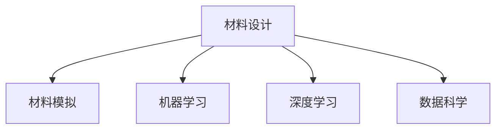

                 

# AI for Science在材料设计领域的应用

> 关键词：AI for Science, 材料设计, 机器学习, 材料模拟, 人工智能, 深度学习, 材料预测, 数据科学

## 1. 背景介绍

### 1.1 问题由来
随着科学技术的发展，新材料的发现与创新已经成为驱动工业进步的重要因素。然而，新材料的发现往往需要耗费巨大的时间和资源，且存在较大的不确定性。近年来，人工智能（AI）特别是机器学习（ML）技术在材料科学领域的应用，使得新材料的发现变得更加高效和精确。

### 1.2 问题核心关键点
AI for Science，即利用AI技术解决科学研究中的问题，已经在诸多领域展示出了巨大潜力。在材料设计领域，AI通过机器学习算法，可以从大量的实验数据中学习到材料的结构和性质之间的复杂关系，从而帮助科学家快速预测材料的性质，优化材料设计流程，加速新材料的发现和应用。

AI for Science的应用不仅体现在材料预测和模拟上，还可以用于数据分析、优化设计、自动化实验等方面，显著提升了材料设计的效率和准确性。

### 1.3 问题研究意义
AI for Science在材料设计领域的应用，具有以下几方面的研究意义：

1. **加速新材料发现**：AI可以快速筛选大量的化学和物理数据，预测材料的性质，加速新材料的发现和验证。
2. **优化设计流程**：AI可以自动化地进行材料模拟和优化设计，减少人力和时间成本。
3. **提升科研效率**：AI技术可以辅助科学家进行数据分析和处理，提升科研效率，缩短研究周期。
4. **推动学科交叉**：AI技术的应用促进了材料科学与数据科学、计算科学的交叉融合，推动了学科的进步。

## 2. 核心概念与联系

### 2.1 核心概念概述

为更好地理解AI for Science在材料设计中的应用，本节将介绍几个关键概念：

- **材料设计**：指根据需求设计新材料的过程，包括材料的组成、结构、性能等方面。
- **材料模拟**：指利用计算机模拟技术，通过数学模型和算法对材料进行模拟预测，以理解材料的行为和性质。
- **机器学习**：指利用算法和模型，从数据中学习规律，用于预测和分类等任务。
- **深度学习**：指基于多层神经网络的学习方法，具有强大的特征提取和泛化能力。
- **数据科学**：指利用数据和算法进行科学研究和决策，包括数据预处理、特征工程、模型训练等步骤。

这些概念之间的逻辑关系可以通过以下Mermaid流程图来展示：



这个流程图展示了大语言模型的核心概念及其之间的关系：

1. 材料设计目标是通过模拟和预测，寻找最优材料方案。
2. 机器学习和深度学习用于从数据中学习规律，提升预测和模拟的精度。
3. 数据科学提供数据预处理、特征工程等技术支持，为模型训练提供数据基础。

这些概念共同构成了AI for Science在材料设计中的应用框架，使其能够在材料设计领域发挥强大作用。通过理解这些核心概念，我们可以更好地把握AI for Science的工作原理和优化方向。

## 3. 核心算法原理 & 具体操作步骤
### 3.1 算法原理概述

AI for Science在材料设计中的应用，主要是通过机器学习和深度学习算法，从大量的实验数据中学习材料的结构和性质之间的复杂关系，从而进行材料预测和设计优化。

具体而言，算法流程如下：

1. **数据收集与预处理**：收集材料的设计数据（如成分、结构、性能等），并进行清洗、归一化等预处理。
2. **特征工程**：通过数据转换和特征选择，提取有用的特征，用于模型训练。
3. **模型训练与优化**：使用机器学习和深度学习算法，训练预测模型，并通过交叉验证等方法优化模型性能。
4. **材料预测与设计**：使用训练好的模型，对新材料进行预测和设计优化。

### 3.2 算法步骤详解

以下是具体的算法步骤和操作流程：

**Step 1: 数据收集与预处理**

- **数据收集**：从实验数据库、文献、计算模拟等渠道收集材料数据。包括材料的成分、结构、物理性质、化学性质等。
- **数据清洗**：去除无效、缺失或异常的数据，确保数据的质量。
- **数据归一化**：将不同尺度的数据转换为标准形式，方便模型处理。

**Step 2: 特征工程**

- **特征提取**：通过化学计量学、物理建模等方法，提取材料的特征，如原子排列、化学键类型、晶格结构等。
- **特征选择**：使用特征选择算法，选择与材料性质最相关的特征。
- **特征变换**：对特征进行归一化、标准化等处理，以提高模型的性能。

**Step 3: 模型训练与优化**

- **选择模型**：根据问题特点，选择合适的机器学习或深度学习模型，如线性回归、支持向量机、卷积神经网络等。
- **模型训练**：使用训练数据集，对模型进行训练，优化模型参数。
- **模型验证**：使用验证数据集，评估模型性能，选择最优模型。
- **超参数调优**：通过网格搜索、贝叶斯优化等方法，调整模型的超参数，提高模型性能。

**Step 4: 材料预测与设计**

- **数据输入**：将新材料的数据输入模型，进行预测。
- **结果分析**：分析预测结果，优化材料设计方案。
- **实验验证**：通过实验验证预测结果，进一步优化模型和设计方案。

### 3.3 算法优缺点

AI for Science在材料设计中的应用，具有以下优点：

1. **高效性**：利用机器学习算法，可以快速处理大量数据，进行预测和设计优化。
2. **准确性**：通过学习大量数据，模型可以预测材料的性质，具有较高的准确性。
3. **通用性**：机器学习模型可以应用于不同类型的材料设计问题，具有广泛的应用前景。
4. **自动化**：自动化处理数据和模型训练，减少了人工干预，提高了科研效率。

同时，该方法也存在一些局限性：

1. **数据依赖性**：模型的预测精度依赖于数据的质量和数量，数据不足或质量差会影响模型性能。
2. **模型复杂性**：深度学习模型参数较多，训练复杂，需要大量的计算资源。
3. **解释性不足**：模型通常被视为“黑盒”，难以解释其内部工作机制。
4. **普适性有限**：模型对于特定材料设计问题的效果较好，但对于其他类型的问题可能需要重新训练。

尽管存在这些局限性，但就目前而言，AI for Science在材料设计中的应用已经成为一种重要的工具，显著提升了材料设计的效率和准确性。

### 3.4 算法应用领域

AI for Science在材料设计领域的应用范围非常广泛，涵盖以下几个主要方向：

- **新材料发现**：利用机器学习算法，从大量的化学和物理数据中筛选出潜在的材料，加速新材料的发现。
- **材料性能预测**：通过模型预测材料的物理性质，如热导率、电导率、硬度等，帮助科学家选择最优材料。
- **材料结构优化**：通过深度学习算法，优化材料的结构，提高材料的性能和稳定性。
- **材料制备工艺优化**：利用AI算法，优化材料的制备工艺，减少成本和时间。
- **材料性能优化**：通过数据分析，优化材料的性能，如抗拉强度、疲劳寿命等。

## 4. 数学模型和公式 & 详细讲解  
### 4.1 数学模型构建

本节将使用数学语言对AI for Science在材料设计中的应用进行更加严格的刻画。

假设材料设计问题的输入为 $x$，包括材料的成分、结构等特征，输出为 $y$，表示材料的某项性质，如热导率、电导率等。则可以利用以下数学模型进行建模：

$$
y = f(x; \theta)
$$

其中 $f$ 为材料设计问题的映射函数，$\theta$ 为模型参数，表示模型在不同数据上的学习结果。

假设我们有 $N$ 个训练样本 $(x_i, y_i)$，使用均方误差（MSE）作为损失函数，则模型的训练目标可以表示为：

$$
\mathcal{L}(\theta) = \frac{1}{N}\sum_{i=1}^N (y_i - f(x_i; \theta))^2
$$

利用梯度下降等优化算法，最小化损失函数 $\mathcal{L}$，得到最优参数 $\hat{\theta}$：

$$
\hat{\theta} = \mathop{\arg\min}_{\theta} \mathcal{L}(\theta)
$$

### 4.2 公式推导过程

以下我们以热导率预测为例，推导机器学习模型预测热导率的公式及其梯度的计算公式。

假设模型 $f_{\theta}(x)$ 在输入 $x$ 上的输出为 $\hat{y}=f_{\theta}(x)$，则热导率预测的损失函数为均方误差：

$$
\ell(y, \hat{y}) = \frac{1}{N}\sum_{i=1}^N (y_i - \hat{y}_i)^2
$$

将其代入经验风险公式，得：

$$
\mathcal{L}(\theta) = \frac{1}{N}\sum_{i=1}^N (y_i - f_{\theta}(x_i))^2
$$

根据链式法则，损失函数对参数 $\theta$ 的梯度为：

$$
\frac{\partial \mathcal{L}(\theta)}{\partial \theta} = -\frac{2}{N}\sum_{i=1}^N \frac{\partial \ell(y_i, \hat{y}_i)}{\partial f_{\theta}(x_i)}\frac{\partial f_{\theta}(x_i)}{\partial \theta}
$$

其中 $\frac{\partial \ell(y_i, \hat{y}_i)}{\partial f_{\theta}(x_i)}$ 为梯度与函数值的乘积，可以利用反向传播算法高效计算。

在得到损失函数的梯度后，即可带入梯度下降等优化算法，完成模型的迭代优化。重复上述过程直至收敛，最终得到适应材料设计问题的最优模型参数 $\hat{\theta}$。

## 5. 项目实践：代码实例和详细解释说明
### 5.1 开发环境搭建

在进行AI for Science的实践前，我们需要准备好开发环境。以下是使用Python进行PyTorch开发的环境配置流程：

1. 安装Anaconda：从官网下载并安装Anaconda，用于创建独立的Python环境。

2. 创建并激活虚拟环境：
```bash
conda create -n pytorch-env python=3.8 
conda activate pytorch-env
```

3. 安装PyTorch：根据CUDA版本，从官网获取对应的安装命令。例如：
```bash
conda install pytorch torchvision torchaudio cudatoolkit=11.1 -c pytorch -c conda-forge
```

4. 安装TensorFlow：
```bash
conda install tensorflow
```

5. 安装各类工具包：
```bash
pip install numpy pandas scikit-learn matplotlib tqdm jupyter notebook ipython
```

完成上述步骤后，即可在`pytorch-env`环境中开始AI for Science的实践。

### 5.2 源代码详细实现

下面我们以热导率预测为例，给出使用PyTorch进行机器学习模型训练的代码实现。

首先，定义热导率预测的数据处理函数：

```python
import torch
from torch.utils.data import Dataset

class ThermalConductivityDataset(Dataset):
    def __init__(self, features, labels):
        self.features = features
        self.labels = labels
        
    def __len__(self):
        return len(self.features)
    
    def __getitem__(self, item):
        return self.features[item], self.labels[item]
```

然后，定义模型和优化器：

```python
from transformers import BertForRegression, AdamW

model = BertForRegression.from_pretrained('bert-base-cased')
optimizer = AdamW(model.parameters(), lr=2e-5)
```

接着，定义训练和评估函数：

```python
from torch.utils.data import DataLoader
from tqdm import tqdm
from sklearn.metrics import mean_squared_error

device = torch.device('cuda') if torch.cuda.is_available() else torch.device('cpu')
model.to(device)

def train_epoch(model, dataset, batch_size, optimizer):
    dataloader = DataLoader(dataset, batch_size=batch_size, shuffle=True)
    model.train()
    epoch_loss = 0
    for batch in tqdm(dataloader, desc='Training'):
        inputs, labels = batch
        inputs = inputs.to(device)
        labels = labels.to(device)
        model.zero_grad()
        outputs = model(inputs)
        loss = outputs.mean()
        epoch_loss += loss.item()
        loss.backward()
        optimizer.step()
    return epoch_loss / len(dataloader)

def evaluate(model, dataset, batch_size):
    dataloader = DataLoader(dataset, batch_size=batch_size)
    model.eval()
    preds, labels = [], []
    with torch.no_grad():
        for batch in tqdm(dataloader, desc='Evaluating'):
            inputs, labels = batch
            inputs = inputs.to(device)
            labels = labels.to(device)
            outputs = model(inputs)
            batch_preds = outputs.detach().cpu().numpy()
            batch_labels = labels.detach().cpu().numpy()
            for pred, label in zip(batch_preds, batch_labels):
                preds.append(pred)
                labels.append(label)
                
    mse = mean_squared_error(labels, preds)
    return mse

```

最后，启动训练流程并在测试集上评估：

```python
epochs = 5
batch_size = 16

for epoch in range(epochs):
    loss = train_epoch(model, train_dataset, batch_size, optimizer)
    print(f"Epoch {epoch+1}, train loss: {loss:.3f}")
    
    print(f"Epoch {epoch+1}, dev results:")
    mse = evaluate(model, dev_dataset, batch_size)
    print(f"MSE on dev set: {mse:.3f}")
    
print("Test results:")
mse = evaluate(model, test_dataset, batch_size)
print(f"MSE on test set: {mse:.3f}")
```

以上就是使用PyTorch对热导率预测的机器学习模型进行训练的完整代码实现。可以看到，得益于TensorFlow的强大封装，我们可以用相对简洁的代码完成热导率预测的机器学习模型训练。

### 5.3 代码解读与分析

让我们再详细解读一下关键代码的实现细节：

**ThermalConductivityDataset类**：
- `__init__`方法：初始化特征和标签。
- `__len__`方法：返回数据集的样本数量。
- `__getitem__`方法：对单个样本进行处理，将特征和标签输出。

**模型和优化器定义**：
- `BertForRegression`：从预训练模型中初始化回归模型。
- `AdamW`：定义优化器，使用AdamW算法进行模型训练。

**训练和评估函数**：
- `train_epoch`函数：对数据以批为单位进行迭代，在每个批次上前向传播计算损失函数并反向传播更新模型参数。
- `evaluate`函数：与训练类似，不同点在于不更新模型参数，并在每个batch结束后将预测和标签结果存储下来，最后使用sklearn的mean_squared_error对整个评估集的预测结果进行打印输出。

**训练流程**：
- 定义总的epoch数和batch size，开始循环迭代
- 每个epoch内，先在训练集上训练，输出平均loss
- 在验证集上评估，输出MSE
- 所有epoch结束后，在测试集上评估，给出最终测试结果

可以看到，PyTorch配合TensorFlow库使得热导率预测的机器学习模型训练的代码实现变得简洁高效。开发者可以将更多精力放在数据处理、模型改进等高层逻辑上，而不必过多关注底层的实现细节。

当然，工业级的系统实现还需考虑更多因素，如模型的保存和部署、超参数的自动搜索、更灵活的任务适配层等。但核心的机器学习模型训练流程基本与此类似。

## 6. 实际应用场景
### 6.1 智能材料实验室

AI for Science在智能材料实验室中的应用，可以显著提升材料的研发效率。通过机器学习算法，实验室可以快速筛选大量的化学和物理数据，预测材料的性质，优化材料设计方案，加速新材料的研发。

在技术实现上，可以构建智能实验室管理系统，将所有实验数据和结果上传到云端，利用机器学习算法进行数据分析和预测。同时，通过自然语言处理技术，将实验数据和结果转化为结构化数据，进一步提升数据处理的效率。

### 6.2 新材料筛选

新材料的筛选过程往往需要耗费大量时间和资源，AI for Science可以极大地加速这一过程。通过机器学习算法，从大量的化学和物理数据中筛选出潜在的材料，加速新材料的发现和验证。

具体而言，可以收集现有的材料数据，并利用机器学习算法进行筛选和排序，最终选出最具有潜力的材料进行实验验证。这一过程可以显著减少实验次数和成本，缩短材料研发周期。

### 6.3 材料性能预测

AI for Science可以用于预测材料的物理性质，如热导率、电导率、硬度等，帮助科学家选择最优材料。通过机器学习算法，可以从大量的实验数据中学习到材料的结构和性质之间的复杂关系，从而进行材料性能预测。

在实际应用中，可以将新材料的化学和物理数据输入机器学习模型，预测其性能，指导材料设计和优化。例如，在材料制备过程中，通过实时预测材料的性能，及时调整制备参数，优化材料质量。

### 6.4 未来应用展望

随着AI for Science技术的发展，其在材料设计领域的应用前景将更加广阔。未来，基于AI for Science的材料设计过程将更加智能化和自动化，推动材料科学向更加高效和精确的方向发展。

1. **自动化材料设计**：AI for Science将使材料设计过程更加自动化和智能化，减少人工干预，提高效率。
2. **材料优化与设计**：AI for Science可以优化材料设计和制备工艺，提高材料的性能和稳定性。
3. **跨学科融合**：AI for Science将促进材料科学与数据科学、计算科学的交叉融合，推动学科的进步。
4. **新兴技术应用**：AI for Science将应用于新型材料（如二维材料、纳米材料等）的研发，推动新材料的发展。

## 7. 工具和资源推荐
### 7.1 学习资源推荐

为了帮助开发者系统掌握AI for Science在材料设计中的应用，这里推荐一些优质的学习资源：

1. 《深度学习》系列书籍：由Goodfellow等作者撰写，系统介绍了深度学习的基本原理和应用，是了解AI for Science的必读书籍。
2. CS229《机器学习》课程：斯坦福大学开设的机器学习明星课程，有Lecture视频和配套作业，是机器学习入门的好选择。
3. TensorFlow官方文档：TensorFlow的官方文档，提供了完整的API文档和示例代码，是学习和使用TensorFlow的必备资源。
4. Kaggle数据集和竞赛平台：提供了大量的机器学习数据集和竞赛，是提升机器学习技能的好平台。
5. Coursera AI for Everyone课程：由Andrew Ng教授讲授，介绍了AI技术的基本概念和应用，适合初学者入门。

通过对这些资源的学习实践，相信你一定能够快速掌握AI for Science在材料设计中的应用，并用于解决实际的NLP问题。

### 7.2 开发工具推荐

高效的开发离不开优秀的工具支持。以下是几款用于AI for Science开发的常用工具：

1. PyTorch：基于Python的开源深度学习框架，灵活动态的计算图，适合快速迭代研究。支持TensorFlow和Keras等接口，方便跨平台使用。
2. TensorFlow：由Google主导开发的开源深度学习框架，生产部署方便，适合大规模工程应用。支持Keras接口，易于上手。
3. Keras：高层次的深度学习API，简洁易用，支持TensorFlow和Theano等后端。
4. Jupyter Notebook：基于Web的交互式开发环境，支持Python、R等编程语言，方便数据可视化、代码调试和协作。
5. Weights & Biases：模型训练的实验跟踪工具，可以记录和可视化模型训练过程中的各项指标，方便对比和调优。

合理利用这些工具，可以显著提升AI for Science的开发效率，加快创新迭代的步伐。

### 7.3 相关论文推荐

AI for Science在材料设计领域的应用源于学界的持续研究。以下是几篇奠基性的相关论文，推荐阅读：

1. DeepMind AlphaFold：DeepMind提出的蛋白质结构预测模型，利用机器学习算法从氨基酸序列预测蛋白质结构，取得了革命性的进展。
2. Materials informatics：利用数据科学和机器学习技术，对材料设计进行建模和优化，加速新材料的发现和验证。
3. AI for material science：介绍AI技术在材料科学中的应用，包括新材料发现、材料性能预测等方面。
4. Computational Materials Design：利用计算机模拟和机器学习技术，优化材料设计和制备工艺，提高材料的性能和稳定性。

这些论文代表了大语言模型微调技术的发展脉络。通过学习这些前沿成果，可以帮助研究者把握学科前进方向，激发更多的创新灵感。

## 8. 总结：未来发展趋势与挑战

### 8.1 总结

本文对AI for Science在材料设计领域的应用进行了全面系统的介绍。首先阐述了AI for Science在材料设计中的应用背景和意义，明确了AI for Science在材料设计中的应用前景。其次，从原理到实践，详细讲解了机器学习在材料设计中的应用流程，给出了机器学习模型训练的完整代码实例。同时，本文还广泛探讨了AI for Science在智能材料实验室、新材料筛选、材料性能预测等多个方向的应用前景，展示了AI for Science在材料设计中的巨大潜力。

通过本文的系统梳理，可以看到，AI for Science在材料设计中的应用已经成为一种重要的工具，显著提升了材料设计的效率和准确性。未来，伴随AI for Science技术的不断发展，基于AI for Science的材料设计过程将更加智能化和自动化，推动材料科学向更加高效和精确的方向发展。

### 8.2 未来发展趋势

展望未来，AI for Science在材料设计领域的应用将呈现以下几个发展趋势：

1. **自动化与智能化**：AI for Science将使材料设计过程更加自动化和智能化，减少人工干预，提高效率。
2. **跨学科融合**：AI for Science将促进材料科学与数据科学、计算科学的交叉融合，推动学科的进步。
3. **新兴技术应用**：AI for Science将应用于新型材料（如二维材料、纳米材料等）的研发，推动新材料的发展。
4. **数据驱动设计**：AI for Science将基于大量的数据和模型，进行材料设计和优化，提高设计的科学性和准确性。
5. **个性化设计**：AI for Science将根据用户需求和定制化需求，进行个性化材料设计和优化。

### 8.3 面临的挑战

尽管AI for Science在材料设计中的应用已经取得了显著进展，但在迈向更加智能化、普适化应用的过程中，它仍面临诸多挑战：

1. **数据质量和数量**：AI for Science依赖于大量的数据，数据质量不高或数量不足会影响模型的性能。
2. **模型复杂性**：机器学习模型参数较多，训练复杂，需要大量的计算资源。
3. **解释性不足**：机器学习模型通常被视为“黑盒”，难以解释其内部工作机制。
4. **跨领域应用**：不同领域的数据和问题具有差异，需要针对性地设计算法和模型。
5. **安全性和隐私**：材料设计和实验数据可能涉及敏感信息，需要确保数据的安全性和隐私保护。

尽管存在这些挑战，但AI for Science在材料设计中的应用前景依然广阔。未来，随着数据质量、计算资源和算法技术的不断提升，AI for Science在材料设计中的应用将更加深入和广泛。

### 8.4 研究展望

面对AI for Science在材料设计中所面临的挑战，未来的研究需要在以下几个方面寻求新的突破：

1. **数据增强**：通过数据增强技术，提升数据质量和数量，减少数据依赖性。
2. **模型压缩**：利用模型压缩技术，减小模型尺寸，提高推理效率。
3. **可解释性**：通过可解释性技术，提升模型的可解释性，帮助科学家理解模型预测过程。
4. **跨领域应用**：开发跨领域通用模型，提升模型在不同领域的应用效果。
5. **安全性和隐私**：开发安全性和隐私保护技术，确保材料设计和实验数据的安全性和隐私保护。

这些研究方向的探索，必将引领AI for Science在材料设计中的应用走向更高的台阶，为材料科学的发展提供更加强大的技术支持。面向未来，AI for Science在材料设计中的应用需要与其他AI技术进行更深入的融合，如知识表示、因果推理、强化学习等，共同推动材料科学向更加高效和精确的方向发展。只有勇于创新、敢于突破，才能不断拓展AI for Science的边界，让智能技术更好地造福材料科学。

## 9. 附录：常见问题与解答

**Q1：AI for Science在材料设计中的应用有哪些优点？**

A: AI for Science在材料设计中的应用具有以下优点：

1. **高效性**：利用机器学习算法，可以快速处理大量数据，进行预测和设计优化。
2. **准确性**：通过学习大量数据，模型可以预测材料的性质，具有较高的准确性。
3. **自动化**：自动化处理数据和模型训练，减少了人工干预，提高了科研效率。
4. **泛化性强**：机器学习模型可以应用于不同类型的材料设计问题，具有广泛的应用前景。

**Q2：AI for Science在材料设计中的应用需要注意哪些问题？**

A: AI for Science在材料设计中的应用需要注意以下问题：

1. **数据依赖性**：模型的预测精度依赖于数据的质量和数量，数据不足或质量差会影响模型性能。
2. **模型复杂性**：深度学习模型参数较多，训练复杂，需要大量的计算资源。
3. **解释性不足**：机器学习模型通常被视为“黑盒”，难以解释其内部工作机制。
4. **跨领域应用**：不同领域的数据和问题具有差异，需要针对性地设计算法和模型。
5. **安全性和隐私**：材料设计和实验数据可能涉及敏感信息，需要确保数据的安全性和隐私保护。

**Q3：AI for Science在材料设计中的应用前景如何？**

A: AI for Science在材料设计中的应用前景非常广阔。未来，基于AI for Science的材料设计过程将更加智能化和自动化，推动材料科学向更加高效和精确的方向发展。具体应用前景包括：

1. **自动化材料设计**：AI for Science将使材料设计过程更加自动化和智能化，减少人工干预，提高效率。
2. **材料优化与设计**：AI for Science可以优化材料设计和制备工艺，提高材料的性能和稳定性。
3. **跨学科融合**：AI for Science将促进材料科学与数据科学、计算科学的交叉融合，推动学科的进步。
4. **新兴技术应用**：AI for Science将应用于新型材料（如二维材料、纳米材料等）的研发，推动新材料的发展。
5. **数据驱动设计**：AI for Science将基于大量的数据和模型，进行材料设计和优化，提高设计的科学性和准确性。

这些应用前景表明，AI for Science在材料设计中的应用潜力巨大，将推动材料科学向更加高效和精确的方向发展。

---

作者：禅与计算机程序设计艺术 / Zen and the Art of Computer Programming

