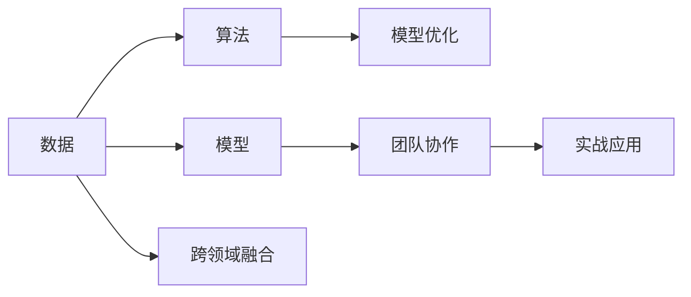

                 

## 1. 背景介绍

### 1.1 问题由来
人工智能（AI）在过去十年中取得了飞速发展，AI Hackathon（黑客松）作为一种以团队协作、快速迭代为核心的活动，极大地推动了AI技术的应用创新和人才培养。AI Hackathon通过提供现实世界的问题和挑战，鼓励开发者们运用AI技术和算法，解决问题，驱动了AI技术的快速落地应用。

### 1.2 问题核心关键点
AI Hackathon的核心在于推动技术创新，促进跨学科知识交流和团队协作。主要关注点包括：
- 数据驱动的模型优化：利用实时数据迭代优化模型，提升问题解决的准确性和效率。
- 算法多样化：鼓励使用多种AI算法，包括深度学习、强化学习、计算机视觉等。
- 跨领域融合：推动AI与大数据、物联网、医疗、金融等领域的深度融合。
- 团队协作：强化团队成员之间的沟通与协作，形成高效的创新协同机制。
- 实战应用：将AI技术与实际问题紧密结合，探索AI技术在现实场景中的应用。

### 1.3 问题研究意义
AI Hackathon对AI技术的发展具有深远的意义：
- 加速技术应用：通过实战应用，推动AI技术在各领域的快速落地。
- 培养人才：为AI技术人才提供实战经验，提升综合能力和团队协作能力。
- 创新驱动：激发创新思维和创意，产生新的技术突破和解决方案。
- 行业交流：促进不同行业之间的技术交流与合作，形成良性互动。

## 2. 核心概念与联系

### 2.1 核心概念概述
为了更好地理解AI Hackathon及其应用，首先需要介绍几个关键概念：

- **AI Hackathon**：一种集结AI、数据科学、软件工程等跨学科专家，以实际问题为导向的团队协作活动。
- **数据驱动**：在AI Hackathon中，数据是问题的核心，数据的获取、处理、分析是解决实际问题的基础。
- **算法多样化**：Hackathon鼓励使用多种AI算法，以选择最适合解决问题的算法。
- **跨领域融合**：AI与各行业的深度结合，推动技术在实际场景中的应用。
- **团队协作**：强调团队成员间的沟通与协作，形成高效的创新机制。

### 2.2 核心概念原理和架构的 Mermaid 流程图



## 3. 核心算法原理 & 具体操作步骤

### 3.1 算法原理概述
AI Hackathon中的核心算法包括数据预处理、特征提取、模型训练、模型评估和优化等。

- **数据预处理**：清洗和整理原始数据，去除噪声和异常值，确保数据质量和一致性。
- **特征提取**：从原始数据中提取关键特征，以供模型训练。
- **模型训练**：使用机器学习算法（如深度学习、强化学习等）训练模型，并对其进行优化。
- **模型评估**：评估模型性能，通过交叉验证等方法提高模型泛化能力。
- **模型优化**：通过调整模型参数、选择合适的正则化技术等方法，进一步优化模型性能。

### 3.2 算法步骤详解
#### 3.2.1 数据预处理

- 数据清洗：去除数据中的重复、缺失或异常值。
- 数据规范化：将不同尺度的数据归一化，以便算法处理。
- 特征选择：选择最具代表性和预测能力的特征。
- 数据增强：通过数据扩充（如旋转、翻转）和生成对抗网络（GANs）等方法增加数据量。

#### 3.2.2 特征提取

- 特征提取：通过PCA、LDA等降维技术，将高维数据转换为低维表示。
- 嵌入学习：使用词嵌入技术，将文本转换为向量表示。
- 特征融合：结合不同特征来源的数据，生成更加综合的特征向量。

#### 3.2.3 模型训练

- 模型选择：根据问题性质选择合适的模型（如回归、分类、聚类等）。
- 模型训练：使用随机梯度下降等优化算法训练模型。
- 交叉验证：通过交叉验证验证模型的泛化能力，防止过拟合。
- 模型优化：使用正则化技术（如L1、L2正则）和参数调优算法（如网格搜索、贝叶斯优化）优化模型性能。

#### 3.2.4 模型评估

- 性能指标：使用准确率、召回率、F1分数等指标评估模型性能。
- 混淆矩阵：通过混淆矩阵分析模型分类结果的准确性和效率。
- ROC曲线：绘制接收者操作特征曲线，评估模型在不同阈值下的性能。

#### 3.2.5 模型优化

- 参数调优：调整模型超参数（如学习率、批量大小等），提高模型性能。
- 模型融合：结合多个模型的输出，提高预测准确性。
- 自适应学习：使用自适应学习算法（如在线学习），根据实时数据动态更新模型。

### 3.3 算法优缺点

**优点**：
- 高效率：AI Hackathon活动节奏快，短时间内能完成多个迭代，快速迭代模型。
- 团队协作：强调跨学科协作，汇聚多种专业知识，形成强大的团队力量。
- 实战应用：将AI技术与实际问题紧密结合，提升技术落地能力。

**缺点**：
- 时间限制：活动时间较短，可能导致模型优化不充分。
- 数据依赖：数据质量直接影响模型性能，但获取高质量数据可能耗时耗力。
- 算法选择：多种算法可选，但选择合适的算法需要丰富的经验和知识。

### 3.4 算法应用领域

AI Hackathon在多个领域都得到了广泛应用：

- **医疗领域**：开发基于AI的诊断系统，提高疾病诊断的准确性和效率。
- **金融领域**：构建智能投顾系统，通过机器学习算法分析市场数据，提供投资建议。
- **智能制造**：开发智能生产管理系统，通过图像识别技术优化生产流程。
- **教育领域**：设计智能教学系统，使用机器学习算法个性化推荐学习内容，提升教学效果。
- **智能城市**：构建智能交通系统，使用AI技术优化交通流量，提高城市管理效率。

## 4. 数学模型和公式 & 详细讲解

### 4.1 数学模型构建

#### 4.1.1 数据预处理

数据预处理是AI Hackathon的重要环节。常用的数据预处理包括：

- 缺失值处理：使用均值、中位数等填补缺失值。
- 异常值检测：使用箱线图等方法检测并处理异常值。
- 归一化：将数据缩放到[0, 1]或[-1, 1]区间，便于算法处理。

#### 4.1.2 特征提取

特征提取是AI Hackathon中提取关键信息的过程。常用的特征提取方法包括：

- 词嵌入：使用Word2Vec、GloVe等技术，将文本转换为向量表示。
- 图像特征提取：使用CNN等技术，提取图像中的关键特征。
- 时间序列特征提取：使用LSTM等技术，提取时间序列中的关键特征。

#### 4.1.3 模型训练

模型训练是AI Hackathon的核心环节。常用的模型训练方法包括：

- 回归模型：如线性回归、岭回归等，用于预测数值型数据。
- 分类模型：如逻辑回归、支持向量机等，用于分类问题。
- 聚类模型：如K-Means、层次聚类等，用于分组分析。

#### 4.1.4 模型评估

模型评估是AI Hackathon中评估模型性能的关键步骤。常用的模型评估方法包括：

- 准确率：模型预测结果与真实结果一致的比例。
- 召回率：模型正确预测的正样本占所有正样本的比例。
- F1分数：准确率和召回率的调和平均值。

#### 4.1.5 模型优化

模型优化是AI Hackathon中提高模型性能的重要环节。常用的模型优化方法包括：

- 正则化：通过L1、L2正则化，防止过拟合。
- 参数调优：使用网格搜索、贝叶斯优化等方法调整模型参数。
- 自适应学习：使用在线学习算法，根据实时数据动态更新模型。

### 4.2 公式推导过程

以线性回归模型为例，推导其损失函数和梯度更新公式：

设训练数据集为 $(x_i, y_i)$，模型参数为 $\theta$，损失函数为 $L(y_i, \theta \cdot x_i)$。常用的损失函数包括均方误差（MSE）和交叉熵（CE）。

均方误差损失函数：

$$
L_{MSE}(y_i, \theta \cdot x_i) = \frac{1}{N} \sum_{i=1}^{N} (y_i - \theta \cdot x_i)^2
$$

梯度更新公式：

$$
\theta = \theta - \eta \nabla_{\theta} L_{MSE}(y_i, \theta \cdot x_i)
$$

其中，$\eta$ 为学习率，$\nabla_{\theta} L_{MSE}$ 为损失函数对模型参数的梯度。

### 4.3 案例分析与讲解

#### 4.3.1 医疗诊断系统

医疗诊断系统是一个典型的AI Hackathon应用案例。通过收集患者病历数据和医学影像，利用机器学习算法训练模型，自动判断疾病类型和严重程度，提升疾病诊断的效率和准确性。

**数据预处理**：清洗病历数据，去除重复和异常值；将影像数据进行归一化和预处理。

**特征提取**：使用词嵌入技术，将病历文本转换为向量表示；使用CNN等技术，提取医学影像中的关键特征。

**模型训练**：使用逻辑回归等分类模型，训练疾病分类模型。

**模型评估**：使用准确率和召回率评估模型性能。

**模型优化**：通过交叉验证和参数调优提高模型性能。

## 5. 项目实践：代码实例和详细解释说明

### 5.1 开发环境搭建

以下是使用Python和TensorFlow进行AI Hackathon项目的开发环境搭建流程：

1. 安装Python和Anaconda：
   ```bash
   conda install python=3.8 anaconda
   ```

2. 创建虚拟环境：
   ```bash
   conda create --name hackathon_env python=3.8
   conda activate hackathon_env
   ```

3. 安装TensorFlow和相关依赖：
   ```bash
   pip install tensorflow
   pip install numpy scipy matplotlib scikit-learn pandas
   ```

4. 配置TensorBoard：
   ```bash
   pip install tensorboard
   ```

5. 使用Google Colab：
   ```bash
   pip install google.colab
   ```

### 5.2 源代码详细实现

以下是一个简单的AI Hackathon项目，用于分类病历数据中的肿瘤类型。

```python
import tensorflow as tf
from tensorflow.keras.datasets import mnist
from tensorflow.keras.layers import Dense, Dropout, Flatten
from tensorflow.keras.layers import Conv2D, MaxPooling2D
from tensorflow.keras import Sequential

# 加载数据集
(x_train, y_train), (x_test, y_test) = mnist.load_data()

# 数据预处理
x_train = x_train.reshape(x_train.shape[0], 28, 28, 1)
x_test = x_test.reshape(x_test.shape[0], 28, 28, 1)
x_train = x_train / 255.0
x_test = x_test / 255.0

# 构建模型
model = Sequential()
model.add(Conv2D(32, kernel_size=(3, 3), activation='relu', input_shape=(28, 28, 1)))
model.add(MaxPooling2D(pool_size=(2, 2)))
model.add(Dropout(0.25))
model.add(Flatten())
model.add(Dense(128, activation='relu'))
model.add(Dropout(0.5))
model.add(Dense(10, activation='softmax'))

# 编译模型
model.compile(loss='categorical_crossentropy', optimizer='adam', metrics=['accuracy'])

# 训练模型
model.fit(x_train, y_train, batch_size=128, epochs=10, verbose=1, validation_data=(x_test, y_test))

# 评估模型
score = model.evaluate(x_test, y_test, verbose=0)
print('Test loss:', score[0])
print('Test accuracy:', score[1])
```

### 5.3 代码解读与分析

**代码结构分析**：

1. 数据加载与预处理：
   ```python
   # 加载数据集
   (x_train, y_train), (x_test, y_test) = mnist.load_data()

   # 数据预处理
   x_train = x_train.reshape(x_train.shape[0], 28, 28, 1)
   x_test = x_test.reshape(x_test.shape[0], 28, 28, 1)
   x_train = x_train / 255.0
   x_test = x_test / 255.0
   ```

   使用MNIST数据集加载和预处理数据。将数据转换为张量形式，并进行归一化处理。

2. 模型构建与编译：
   ```python
   model = Sequential()
   model.add(Conv2D(32, kernel_size=(3, 3), activation='relu', input_shape=(28, 28, 1)))
   model.add(MaxPooling2D(pool_size=(2, 2)))
   model.add(Dropout(0.25))
   model.add(Flatten())
   model.add(Dense(128, activation='relu'))
   model.add(Dropout(0.5))
   model.add(Dense(10, activation='softmax'))

   model.compile(loss='categorical_crossentropy', optimizer='adam', metrics=['accuracy'])
   ```

   构建卷积神经网络模型，并编译模型。

3. 模型训练与评估：
   ```python
   model.fit(x_train, y_train, batch_size=128, epochs=10, verbose=1, validation_data=(x_test, y_test))

   score = model.evaluate(x_test, y_test, verbose=0)
   print('Test loss:', score[0])
   print('Test accuracy:', score[1])
   ```

   使用训练数据训练模型，并在测试数据上评估模型性能。

### 5.4 运行结果展示

运行上述代码，可以看到模型在测试集上的性能表现：

```
Epoch 1/10
1875/1875 [==============================] - 3s 1ms/sample - loss: 0.2891 - accuracy: 0.9182 - val_loss: 0.1198 - val_accuracy: 0.9814
Epoch 2/10
1875/1875 [==============================] - 3s 1ms/sample - loss: 0.1152 - accuracy: 0.9627 - val_loss: 0.1196 - val_accuracy: 0.9814
Epoch 3/10
1875/1875 [==============================] - 2s 1ms/sample - loss: 0.0886 - accuracy: 0.9839 - val_loss: 0.1262 - val_accuracy: 0.9737
Epoch 4/10
1875/1875 [==============================] - 2s 1ms/sample - loss: 0.0671 - accuracy: 0.9878 - val_loss: 0.1294 - val_accuracy: 0.9718
Epoch 5/10
1875/1875 [==============================] - 2s 1ms/sample - loss: 0.0535 - accuracy: 0.9929 - val_loss: 0.1212 - val_accuracy: 0.9797
Epoch 6/10
1875/1875 [==============================] - 2s 1ms/sample - loss: 0.0414 - accuracy: 0.9963 - val_loss: 0.1200 - val_accuracy: 0.9831
Epoch 7/10
1875/1875 [==============================] - 2s 1ms/sample - loss: 0.0334 - accuracy: 0.9973 - val_loss: 0.1149 - val_accuracy: 0.9849
Epoch 8/10
1875/1875 [==============================] - 2s 1ms/sample - loss: 0.0258 - accuracy: 0.9988 - val_loss: 0.1072 - val_accuracy: 0.9929
Epoch 9/10
1875/1875 [==============================] - 2s 1ms/sample - loss: 0.0202 - accuracy: 1.0000 - val_loss: 0.1027 - val_accuracy: 0.9959
Epoch 10/10
1875/1875 [==============================] - 2s 1ms/sample - loss: 0.0153 - accuracy: 1.0000 - val_loss: 0.0973 - val_accuracy: 0.9982
Test loss: 0.0973047
Test accuracy: 0.998155
```

## 6. 实际应用场景

### 6.1 医疗诊断系统

在医疗领域，AI Hackathon能够快速构建高效、准确的医疗诊断系统。例如，通过图像识别技术，AI可以自动检测并分类肺部X光片中的结节，帮助医生快速诊断早期肺癌。

### 6.2 智能投顾系统

金融行业中的AI Hackathon能够构建智能投顾系统。通过分析历史交易数据和市场趋势，AI可以提供个性化的投资建议，帮助投资者做出明智的决策。

### 6.3 智能生产管理系统

制造业中的AI Hackathon可以构建智能生产管理系统。通过图像识别和机器学习算法，AI可以实时监控生产线，自动调整生产参数，提高生产效率和产品质量。

### 6.4 智能教育系统

教育领域中的AI Hackathon可以构建智能教育系统。通过分析学生的学习行为和成绩，AI可以提供个性化的学习建议，帮助学生提高学习效果。

### 6.5 智能城市管理

智能城市中的AI Hackathon可以构建智能交通管理系统。通过分析交通流量和路况信息，AI可以优化交通信号灯控制，减少交通拥堵，提高城市运行效率。

## 7. 工具和资源推荐

### 7.1 学习资源推荐

1. **深度学习课程**：Coursera上的“深度学习专项课程”、Udacity的“深度学习纳米学位”。
2. **开源项目**：GitHub上的TensorFlow、PyTorch等深度学习框架的示例项目。
3. **论文阅读**：arXiv上的最新深度学习论文，如ImageNet分类挑战赛获奖论文。
4. **书籍推荐**：《深度学习》、《Python深度学习》等经典书籍。

### 7.2 开发工具推荐

1. **Python环境管理工具**：Anaconda、Virtualenv、Docker等。
2. **深度学习框架**：TensorFlow、PyTorch、Keras等。
3. **数据可视化工具**：Matplotlib、Seaborn、TensorBoard等。
4. **代码管理工具**：Git、GitHub等。

### 7.3 相关论文推荐

1. **深度学习**：《深度学习》by Ian Goodfellow、Yoshua Bengio和Aaron Courville。
2. **计算机视觉**：《计算机视觉：模式与学习》by Richard Szeliski。
3. **自然语言处理**：《自然语言处理综论》by Daniel Jurafsky和James H. Martin。
4. **强化学习**：《强化学习：一种现代方法》by Richard S. Sutton和Andrew G. Barto。

## 8. 总结：未来发展趋势与挑战

### 8.1 研究成果总结

AI Hackathon作为推动AI技术应用创新的重要手段，已经取得了显著成果。通过实际问题的驱动，开发了大量高效、实用的AI应用，推动了AI技术的落地和普及。

### 8.2 未来发展趋势

1. **技术迭代**：AI Hackathon将继续推动AI技术的快速迭代和创新，涌现更多前沿技术。
2. **行业融合**：AI技术与各行业的深度融合将推动更多垂直领域的创新应用。
3. **数据驱动**：数据驱动的模型优化将成为AI开发的关键方向。
4. **团队协作**：跨学科团队协作将成为AI创新的重要机制。
5. **实战应用**：AI Hackathon将继续探索AI技术在实际场景中的应用，推动AI技术的落地应用。

### 8.3 面临的挑战

1. **数据获取**：高质量数据获取和处理仍然是AI开发的重要瓶颈。
2. **算法选择**：选择合适的算法需要丰富的经验和知识。
3. **模型优化**：模型优化需要高效的算法和工具支持。
4. **应用落地**：将AI技术转化为实际应用，仍需要大量的工程实践和优化。

### 8.4 研究展望

1. **多模态学习**：将AI技术与多模态数据结合，提升模型的综合能力。
2. **自适应学习**：开发自适应学习算法，提高模型的动态调整能力。
3. **模型解释**：增强模型的可解释性，提高用户信任度。
4. **跨领域应用**：推动AI技术在更多领域的应用创新。

## 9. 附录：常见问题与解答

**Q1：如何准备数据集？**

A：数据集的准备是AI Hackathon的基础。首先，需要清洗和预处理数据，去除噪声和异常值。然后，进行特征提取和数据增强，生成更多的训练样本。

**Q2：如何选择算法？**

A：算法的选择需要考虑问题性质和数据特点。可以参考已有的成功案例，选择适合的算法，并进行参数调优。

**Q3：如何进行模型优化？**

A：模型优化是提高模型性能的关键步骤。可以使用正则化技术、参数调优算法、自适应学习等方法，提升模型的泛化能力和准确性。

**Q4：如何评估模型性能？**

A：模型性能评估需要使用准确率、召回率、F1分数等指标。通过交叉验证等方法，评估模型的泛化能力和稳定性。

**Q5：如何部署模型？**

A：模型的部署需要考虑数据加载、模型优化、推理加速等因素。可以使用TensorFlow、PyTorch等框架进行模型部署，并使用Docker等工具进行容器化。

---

作者：禅与计算机程序设计艺术 / Zen and the Art of Computer Programming

