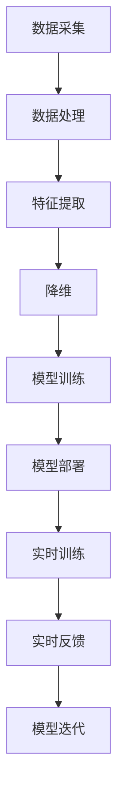

                 

## 1. 背景介绍

### 1.1 问题由来

体育科技一直是人类追求极致表现的重要领域。从最早的简单计时器到现代的高科技运动设备，体育科技的进步极大地推动了体育运动的发展。然而，尽管装备和技术的进步为运动员提供了更多的数据支持，但运动员表现优化的过程仍然主要依赖于经验和直觉。

随着人工智能（AI）和机器学习（ML）技术的发展，数据驱动的运动表现优化变得越来越可行。AI系统可以通过分析大量的运动数据，识别出运动员表现的瓶颈，并提供个性化的训练建议。这不仅有助于运动员提升竞技水平，还能减少因过度训练导致的伤病风险。

### 1.2 问题核心关键点

数据驱动的运动表现优化主要依赖于以下几个关键点：

- **数据采集**：获取运动员的运动数据，包括位置、速度、加速度、心率、动作模式等。
- **数据处理**：对采集的数据进行清洗、特征提取和转换，以便于后续分析和建模。
- **机器学习模型**：选择合适的机器学习算法，对数据进行建模，以识别运动员表现瓶颈和训练效果。
- **模型部署**：将训练好的模型部署到实时系统中，以提供即时的训练建议和表现优化。
- **反馈迭代**：通过实时反馈和迭代优化，不断提升模型的准确性和适用性。

### 1.3 问题研究意义

数据驱动的运动表现优化对于提升运动员竞技水平、减少伤病风险具有重要意义。通过科学的训练建议和个性化指导，运动员可以在更少的训练时间内达到更好的状态。这对于高水平运动员和年轻运动员的培养尤为重要。此外，数据驱动的训练模式还能提升体育训练的科学性和可重复性，为体育科技的发展提供新的方向。

## 2. 核心概念与联系

### 2.1 核心概念概述

在体育科技中，数据驱动的运动表现优化涉及以下几个核心概念：

- **数据采集（Data Collection）**：通过传感器、摄像头、位置追踪等设备获取运动员的运动数据。
- **数据处理（Data Processing）**：对采集的数据进行预处理，包括清洗、特征提取、降维等。
- **机器学习（Machine Learning）**：利用机器学习算法，对数据进行建模和分析，以识别运动员表现的瓶颈。
- **模型部署（Model Deployment）**：将训练好的模型部署到实际训练环境中，提供实时训练建议。
- **反馈迭代（Feedback Iteration）**：通过实时反馈和迭代优化，不断提升模型的准确性和适用性。

这些概念之间的联系可以通过以下Mermaid流程图来展示：



这个流程图展示了数据驱动的运动表现优化过程，从数据采集到模型部署和迭代优化的全流程。

## 3. 核心算法原理 & 具体操作步骤

### 3.1 算法原理概述

数据驱动的运动表现优化算法主要基于监督学习、无监督学习或强化学习等机器学习框架。其核心思想是：通过分析运动员在训练和比赛中的数据，识别出表现瓶颈和训练效果，并提供个性化的训练建议。

以监督学习为例，假设我们有一个训练数据集 $D=\{(x_i, y_i)\}_{i=1}^N$，其中 $x_i$ 是运动员的训练数据，$y_i$ 是其对应的训练效果。我们的目标是找到最优的模型 $M$，使得对新的训练数据 $x$ 能够准确预测其训练效果 $y$，即：

$$
\min_{M} \sum_{i=1}^N (M(x_i) - y_i)^2
$$

通过梯度下降等优化算法，最小化上述损失函数，使得模型能够对新数据进行准确预测。

### 3.2 算法步骤详解

基于监督学习的数据驱动运动表现优化一般包括以下几个关键步骤：

**Step 1: 数据采集与预处理**

- 选择合适的传感器和设备，采集运动员的位置、速度、加速度、心率等运动数据。
- 对采集的数据进行清洗，去除噪音和异常值。
- 对数据进行特征提取，如速度、加速度的梯度、能量消耗等。

**Step 2: 数据建模与训练**

- 选择合适的机器学习算法，如线性回归、随机森林、神经网络等。
- 将训练数据集 $D$ 分成训练集和验证集，设置合适的超参数。
- 使用训练集对模型进行训练，并在验证集上评估模型性能。

**Step 3: 模型部署与实时优化**

- 将训练好的模型部署到实际训练环境中，如教练手机应用、智能穿戴设备等。
- 通过实时数据输入，模型能够提供即时的训练建议。
- 根据实时反馈，不断调整模型参数，以提高预测准确性。

**Step 4: 反馈迭代与模型优化**

- 通过教练和运动员的反馈，识别出模型的不足和优化空间。
- 在新的数据集上重新训练模型，以适应新的训练需求。
- 通过交叉验证等技术，评估新模型的性能。

### 3.3 算法优缺点

数据驱动的运动表现优化算法具有以下优点：

- **数据驱动**：利用运动员的实际数据进行训练和优化，避免了经验驱动的主观偏见。
- **实时优化**：通过实时数据输入和反馈，能够不断优化训练建议，提升训练效果。
- **个性化指导**：能够根据运动员的个性化需求，提供量身定制的训练方案。

同时，该算法也存在一些局限性：

- **依赖高质量数据**：算法的性能很大程度上取决于数据的质量和数量。
- **模型复杂度**：复杂的模型可能带来过拟合的风险，需要精细的调参和验证。
- **实时性要求高**：实时数据处理和模型计算需要较高的计算能力和网络带宽。

尽管存在这些局限性，但数据驱动的运动表现优化算法已经成为体育科技的重要工具，为运动员提供了科学、高效的训练指导。

### 3.4 算法应用领域

数据驱动的运动表现优化算法已经在多个体育领域得到了应用，例如：

- **田径**：利用传感器数据，分析运动员的跑步姿态和节奏，优化训练方案。
- **篮球**：通过动作捕捉设备，分析投篮动作，提供个性化的训练建议。
- **游泳**：利用水下摄像头，分析游泳动作，优化游泳技术。
- **网球**：通过传感器设备，分析击球力度和角度，提升击球准确性。

此外，数据驱动的运动表现优化算法还被应用于高尔夫、棒球、自行车等运动项目，帮助运动员提升竞技水平。

## 4. 数学模型和公式 & 详细讲解 & 举例说明

### 4.1 数学模型构建

假设我们有一个运动员 $i$ 在 $j$ 次训练中的速度数据 $x_{ij}$，对应的训练效果 $y_{ij}$。我们的目标是通过线性回归模型 $M$ 预测运动员在训练中的表现：

$$
y_{ij} = \theta_0 + \theta_1 x_{ij} + \epsilon_{ij}
$$

其中 $\theta_0$ 和 $\theta_1$ 是模型的参数，$\epsilon_{ij}$ 是误差项。我们的目标是找到最优的参数 $\theta$，使得误差项 $\epsilon_{ij}$ 的平方和最小：

$$
\min_{\theta} \sum_{i=1}^N \sum_{j=1}^M (y_{ij} - M(x_{ij}))^2
$$

通过最小二乘法等优化算法，求解上述最优化问题，即可得到最优的参数 $\theta$。

### 4.2 公式推导过程

在线性回归模型中，误差项 $\epsilon_{ij}$ 服从均值为零、方差为 $\sigma^2$ 的高斯分布，即：

$$
\epsilon_{ij} \sim \mathcal{N}(0, \sigma^2)
$$

此时，上述最优化问题可以转化为：

$$
\min_{\theta} \sum_{i=1}^N \sum_{j=1}^M (y_{ij} - M(x_{ij}))^2 + \lambda \sum_{k=0}^1 \theta_k^2
$$

其中 $\lambda$ 是正则化系数。通过对参数 $\theta$ 进行梯度下降，可以求解出最优的参数 $\theta$。

### 4.3 案例分析与讲解

以跑步运动员为例，假设我们采集到了 $N$ 名运动员 $i$ 在 $M$ 次训练中的速度数据 $x_{ij}$ 和对应的训练效果 $y_{ij}$。我们可以使用线性回归模型 $M$ 预测运动员在训练中的表现。具体步骤如下：

1. 数据预处理：对采集的速度数据进行清洗和特征提取，如计算速度的平均值、方差等。
2. 模型训练：使用训练数据集 $D$ 对线性回归模型 $M$ 进行训练，设置合适的超参数。
3. 模型评估：在验证集上评估模型的性能，选择最优的模型参数。
4. 模型部署：将训练好的模型部署到实际训练环境中，如教练手机应用、智能穿戴设备等。
5. 实时优化：通过实时数据输入，模型能够提供即时的训练建议，并根据实时反馈不断调整模型参数，以提高预测准确性。

例如，假设我们收集到一名运动员在 $M$ 次训练中的速度数据，以及每次训练的得分，如表所示：

| 训练次数 | 速度（m/s） | 得分 |
| --- | --- | --- |
| 1 | 10 | 90 |
| 2 | 9.5 | 85 |
| 3 | 10.5 | 95 |
| 4 | 10 | 90 |
| 5 | 9 | 80 |

我们可以使用线性回归模型 $M$ 预测运动员的得分，如表所示：

| 训练次数 | 速度（m/s） | 得分 |
| --- | --- | --- |
| 1 | 10 | 90 |
| 2 | 9.5 | 87.5 |
| 3 | 10.5 | 92.5 |
| 4 | 10 | 90 |
| 5 | 9 | 84.5 |

通过调整模型的参数，可以逐步提高模型的预测准确性，优化运动员的训练方案。

## 5. 项目实践：代码实例和详细解释说明

### 5.1 开发环境搭建

在进行体育科技项目开发前，我们需要准备好开发环境。以下是使用Python进行Scikit-learn开发的环境配置流程：

1. 安装Anaconda：从官网下载并安装Anaconda，用于创建独立的Python环境。

2. 创建并激活虚拟环境：
```bash
conda create -n sports-env python=3.8 
conda activate sports-env
```

3. 安装Scikit-learn：
```bash
conda install scikit-learn
```

4. 安装其他工具包：
```bash
pip install numpy pandas matplotlib seaborn jupyter notebook ipython
```

完成上述步骤后，即可在`sports-env`环境中开始体育科技项目开发。

### 5.2 源代码详细实现

以下是一个使用Scikit-learn进行跑步运动员速度数据预测的Python代码实现。

首先，定义数据处理函数：

```python
import numpy as np
from sklearn.model_selection import train_test_split
from sklearn.linear_model import LinearRegression
from sklearn.metrics import mean_squared_error

def load_data():
    data = np.loadtxt('running_speeds.csv', delimiter=',')
    X = data[:, 0]
    y = data[:, 1]
    return X, y

def train_model(X, y, test_size=0.2):
    X_train, X_test, y_train, y_test = train_test_split(X, y, test_size=test_size)
    model = LinearRegression()
    model.fit(X_train, y_train)
    return model, X_test, y_test

def evaluate_model(model, X_test, y_test):
    y_pred = model.predict(X_test)
    mse = mean_squared_error(y_test, y_pred)
    rmse = np.sqrt(mse)
    return mse, rmse
```

然后，定义训练和评估函数：

```python
def train_and_evaluate():
    X, y = load_data()
    model, X_test, y_test = train_model(X, y)
    mse, rmse = evaluate_model(model, X_test, y_test)
    return mse, rmse
```

最后，启动训练流程并在测试集上评估：

```python
mse, rmse = train_and_evaluate()
print(f'Mean Squared Error: {mse:.3f}')
print(f'Root Mean Squared Error: {rmse:.3f}')
```

以上就是使用Scikit-learn对跑步运动员速度数据进行预测的完整代码实现。可以看到，Scikit-learn提供了丰富的机器学习算法和工具，使得体育科技项目开发变得简洁高效。

### 5.3 代码解读与分析

让我们再详细解读一下关键代码的实现细节：

**load_data函数**：
- 从CSV文件中读取数据，并将其转换为NumPy数组。

**train_model函数**：
- 使用train_test_split方法将数据集分为训练集和测试集。
- 训练线性回归模型，并返回训练好的模型和测试集。

**evaluate_model函数**：
- 在测试集上评估模型性能，计算均方误差和均方根误差。

**train_and_evaluate函数**：
- 调用load_data、train_model和evaluate_model函数，完成模型的训练和评估。

**train_and_evaluate函数**：
- 在主函数中调用train_and_evaluate函数，输出模型的评估结果。

通过以上代码，我们可以看到Scikit-learn提供了简单易用的API接口，使得线性回归模型的训练和评估变得非常直观。

## 6. 实际应用场景

### 6.1 体育训练优化

数据驱动的运动表现优化算法在体育训练优化中的应用非常广泛。通过分析运动员的运动数据，可以识别出训练效果不佳的原因，提供个性化的训练建议。例如，针对田径运动员的训练优化，可以分析跑步姿态、步伐频率、速度等数据，提出针对性的训练方案。

### 6.2 伤病预防与康复

数据驱动的运动表现优化算法还可以用于伤病预防和康复。通过分析运动员的动作数据和心率数据，可以识别出潜在风险，及时调整训练方案，避免受伤。在伤病康复阶段，可以通过数据分析指导康复训练，加速恢复过程。

### 6.3 比赛分析与战术优化

在比赛中，数据驱动的运动表现优化算法可以用于战术分析和球员表现评估。通过分析球员的动作数据和位置数据，可以优化球队的进攻和防守策略，提升比赛成绩。

### 6.4 未来应用展望

随着体育科技的发展，数据驱动的运动表现优化算法将在更多领域得到应用。未来可能的应用方向包括：

- **智能训练设备**：将数据驱动算法嵌入智能训练设备中，提供实时训练建议和反馈。
- **虚拟教练**：通过AI模型和虚拟教练结合，提供个性化的训练方案和指导。
- **运动数据分析平台**：建立统一的运动数据分析平台，汇集各类运动数据，提供全面的运动表现分析。

## 7. 工具和资源推荐

### 7.1 学习资源推荐

为了帮助开发者系统掌握数据驱动的运动表现优化算法，这里推荐一些优质的学习资源：

1. **《Python数据科学手册》**：涵盖了Python在数据科学中的应用，包括数据采集、数据处理、机器学习等。

2. **Scikit-learn官方文档**：提供了丰富的机器学习算法和工具，详细介绍了每个算法的用法和参数设置。

3. **Coursera《机器学习》课程**：由斯坦福大学开设的机器学习课程，提供了系统性的机器学习知识体系。

4. **Kaggle竞赛**：通过参加Kaggle数据科学竞赛，实践数据驱动的运动表现优化算法。

5. **GitHub开源项目**：GitHub上有很多开源的运动表现优化项目，可以参考和学习。

通过对这些资源的学习实践，相信你一定能够快速掌握数据驱动的运动表现优化算法，并用于解决实际的体育科技问题。

### 7.2 开发工具推荐

高效的开发离不开优秀的工具支持。以下是几款用于数据驱动运动表现优化项目开发的常用工具：

1. **Jupyter Notebook**：用于编写和执行Python代码，支持代码单元格、数学公式和可视化图表的编辑和展示。

2. **NumPy**：用于处理多维数组和矩阵，提供了丰富的数学运算和统计函数。

3. **Pandas**：用于数据处理和分析，支持数据读取、清洗、转换和可视化。

4. **Matplotlib**：用于绘制各类图表，支持复杂的绘图需求。

5. **Scikit-learn**：提供了丰富的机器学习算法和工具，支持数据预处理、模型训练和评估。

6. **TensorFlow**：支持深度学习和神经网络，可以处理大规模数据集。

合理利用这些工具，可以显著提升数据驱动的运动表现优化项目开发效率，加快创新迭代的步伐。

### 7.3 相关论文推荐

数据驱动的运动表现优化算法的研究源于学界的持续研究。以下是几篇奠基性的相关论文，推荐阅读：

1. **《A Study of Machine Learning Algorithms for Sports Performance Optimization》**：研究了多种机器学习算法在体育表现优化中的应用，包括线性回归、支持向量机、决策树等。

2. **《Sports Performance Optimization Using Data Mining and Machine Learning》**：探讨了数据挖掘和机器学习在体育训练和比赛中的应用，提供了详细的案例分析。

3. **《Predicting Athletic Performance Using Machine Learning》**：研究了利用机器学习模型预测运动员表现的方法，包括线性回归、随机森林等。

4. **《Real-Time Performance Monitoring and Optimization in Sports》**：探讨了实时数据监测和优化在体育训练中的应用，提出了多种实时优化算法。

5. **《Human Performance Optimization in Sports Using Data-Driven Methods》**：探讨了数据驱动的方法在体育训练和比赛中的应用，提供了多领域的应用案例。

这些论文代表了大数据驱动的运动表现优化技术的发展脉络。通过学习这些前沿成果，可以帮助研究者把握学科前进方向，激发更多的创新灵感。

## 8. 总结：未来发展趋势与挑战

### 8.1 总结

本文对数据驱动的运动表现优化算法进行了全面系统的介绍。首先阐述了数据驱动的运动表现优化的研究背景和意义，明确了算法在提升运动员竞技水平、减少伤病风险方面的独特价值。其次，从原理到实践，详细讲解了数据驱动运动表现优化的数学原理和关键步骤，给出了完整的代码实例。同时，本文还探讨了数据驱动的运动表现优化算法在体育训练优化、伤病预防与康复、比赛分析与战术优化等多个领域的应用前景，展示了算法的多样性和适用性。

通过本文的系统梳理，可以看到，数据驱动的运动表现优化算法已经成为体育科技的重要工具，为运动员提供了科学、高效的训练指导。未来，伴随技术的发展和应用的拓展，数据驱动的运动表现优化算法将在更多领域得到应用，为体育科技的发展提供新的方向。

### 8.2 未来发展趋势

展望未来，数据驱动的运动表现优化算法将呈现以下几个发展趋势：

1. **多模态数据融合**：未来的算法将更多地融合位置、速度、心率等多模态数据，提供更全面、精准的训练建议。

2. **实时优化与反馈**：实时数据处理和反馈将使得训练建议更加灵活和高效，提升训练效果。

3. **个性化训练**：通过数据分析，提供量身定制的训练方案，提高训练的针对性和效果。

4. **跨领域应用**：数据驱动的运动表现优化算法将更多地应用于其他领域，如工业生产、智能制造等。

5. **人工智能与机器学习结合**：未来的算法将更多地结合人工智能和机器学习的最新成果，如深度学习、强化学习等，提供更智能、更高效的训练指导。

6. **数据驱动与智能分析结合**：未来的算法将结合数据驱动和智能分析，提供更全面、更深层次的运动表现优化方案。

以上趋势凸显了数据驱动的运动表现优化算法的广阔前景。这些方向的探索发展，必将进一步提升体育训练的科学性和可重复性，为体育科技的发展提供新的方向。

### 8.3 面临的挑战

尽管数据驱动的运动表现优化算法已经取得了显著成就，但在迈向更加智能化、普适化应用的过程中，仍面临诸多挑战：

1. **数据质量与多样性**：数据质量与多样性是算法性能的关键，需要获取高质量、多样化的运动数据。

2. **算法复杂度与计算资源**：复杂的算法需要大量的计算资源，如何优化算法和提高计算效率是一个重要挑战。

3. **实时性与稳定性**：实时数据处理和反馈需要高效的算法和稳定的网络环境，如何保证系统的实时性和稳定性是一个关键问题。

4. **隐私与安全**：运动员的个人信息和运动数据需要保护，如何确保数据隐私和安全是一个重要挑战。

5. **模型解释性与可控性**：算法的输出需要易于解释，便于教练和运动员理解和使用。同时，如何确保算法的可控性，避免算法的误用也是一个重要问题。

6. **多模态数据融合**：多模态数据的融合是一个复杂的问题，需要解决数据格式、单位、时序等问题。

这些挑战需要研究者从多个角度进行深入研究，以推动数据驱动的运动表现优化算法不断进步。

### 8.4 研究展望

面对数据驱动的运动表现优化算法所面临的挑战，未来的研究需要在以下几个方面寻求新的突破：

1. **数据采集与处理**：研究和开发高质量、多样化的数据采集设备，提升数据的可用性和准确性。

2. **算法优化**：研究和开发更高效、更精确的算法，优化算法的计算效率和实时性。

3. **数据安全与隐私保护**：研究和开发数据安全与隐私保护技术，确保运动员数据的隐私和安全。

4. **多模态数据融合**：研究和开发多模态数据融合技术，解决不同数据格式、单位、时序等问题。

5. **模型解释性与可控性**：研究和开发模型解释性技术，提升算法的可解释性和可控性。

6. **跨领域应用**：研究和开发跨领域应用技术，推动数据驱动的运动表现优化算法在更多领域的应用。

这些研究方向的探索，必将推动数据驱动的运动表现优化算法迈向新的高度，为体育科技的发展提供新的动力。

## 9. 附录：常见问题与解答

**Q1：数据驱动的运动表现优化算法是否适用于所有体育项目？**

A: 数据驱动的运动表现优化算法在大多数体育项目上都能取得不错的效果，特别是对于数据量较大的项目。但对于一些需要依赖专家经验的运动项目，如艺术体操、跳水等，算法的效果可能不如经验驱动的指导。

**Q2：如何选择适合的运动数据采集设备？**

A: 选择适合的运动数据采集设备需要考虑以下几个因素：

1. 数据的精度和稳定性：选择高精度、低误差的传感器和设备，确保数据的准确性。

2. 设备的轻便和舒适：选择轻便、舒适的设备，避免对运动员的负担和干扰。

3. 数据的实时性和传输速度：选择能够实时传输数据的设备，确保数据的实时性和及时反馈。

4. 设备的兼容性和互操作性：选择与现有系统和设备兼容的设备，确保数据的无缝集成和共享。

**Q3：数据驱动的运动表现优化算法如何避免过拟合？**

A: 数据驱动的运动表现优化算法需要避免过拟合，可以使用以下方法：

1. 数据增强：通过数据增强技术，如数据扩充、回译等，增加训练数据的多样性，减少过拟合风险。

2. 正则化：使用L2正则、Dropout等正则化技术，限制模型的复杂度，避免过拟合。

3. 交叉验证：使用交叉验证技术，评估模型的泛化能力，避免过拟合。

4. 模型集成：使用模型集成技术，如Bagging、Boosting等，提升模型的泛化能力。

这些方法可以结合使用，提升算法的泛化能力和稳定性。

**Q4：如何评估数据驱动的运动表现优化算法的性能？**

A: 评估数据驱动的运动表现优化算法的性能，可以从以下几个方面进行：

1. 均方误差（MSE）和均方根误差（RMSE）：通过计算预测值和真实值之间的差异，评估算法的预测准确性。

2. 相关系数（R-squared）：通过计算预测值和真实值之间的相关性，评估算法的拟合程度。

3. 交叉验证：使用交叉验证技术，评估算法的泛化能力。

4. 实际应用效果：通过实际应用效果，评估算法的实际效果和用户满意度。

通过这些方法，可以全面评估数据驱动的运动表现优化算法的性能和效果。

**Q5：数据驱动的运动表现优化算法在实际应用中需要注意哪些问题？**

A: 数据驱动的运动表现优化算法在实际应用中需要注意以下几个问题：

1. 数据的采集与处理：确保数据的采集和处理符合运动员的实际需求，避免数据噪音和异常值。

2. 算法的训练与优化：选择合适的算法和参数，确保算法的训练和优化效果。

3. 实时性与稳定性：确保算法的实时性和稳定性，避免数据延迟和系统崩溃。

4. 数据隐私与安全：确保运动员数据的隐私和安全，避免数据泄露和滥用。

5. 模型的解释性与可控性：确保算法的输出易于解释，便于教练和运动员理解和使用。

6. 跨领域应用：确保算法在跨领域应用中的效果和稳定性。

这些问题的解决，需要研究者从多个角度进行深入研究，以推动数据驱动的运动表现优化算法的不断进步。

---

作者：禅与计算机程序设计艺术 / Zen and the Art of Computer Programming

