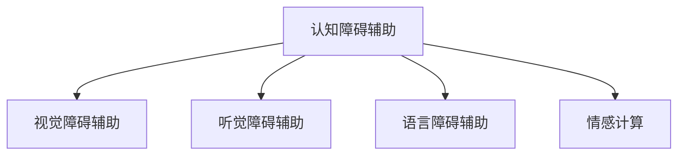
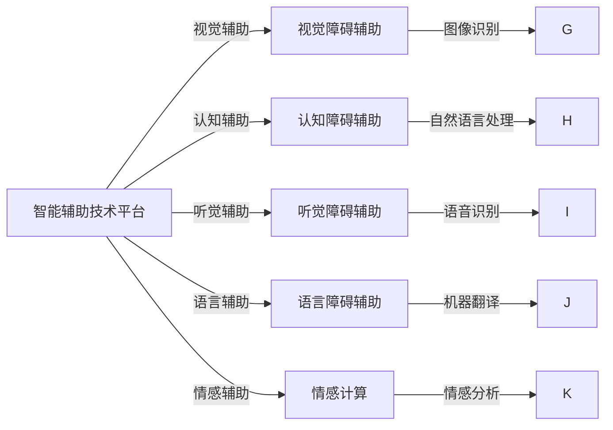

                 

# AI 基础设施的残疾人服务：智能辅助技术平台

> 关键词：残疾人服务, AI 基础设施, 智能辅助技术, 认知障碍, 视觉障碍, 听觉障碍, 语言障碍, 情感计算, 人机交互, 多模态融合

## 1. 背景介绍

### 1.1 问题由来

随着科技的不断进步，人工智能(AI)技术在各个领域的应用越来越广泛，残疾人服务也在逐渐从中受益。然而，传统的残疾人服务往往依赖于人工干预，不仅成本高昂，而且效率低下，难以满足庞大的服务需求。在此背景下，智能辅助技术平台应运而生，利用AI技术为残疾人提供更加个性化、高效、可靠的服务。

### 1.2 问题核心关键点

智能辅助技术平台的核心在于如何通过AI技术提升残疾人服务的智能化水平。具体包括以下几个方面：

- **认知障碍辅助**：通过自然语言处理(NLP)、计算机视觉等技术，帮助认知障碍者理解和生成语言、视觉内容，从而提升其认知能力。
- **视觉障碍辅助**：通过图像识别、语音识别等技术，帮助视觉障碍者感知世界，提升其独立生活能力。
- **听觉障碍辅助**：通过语音合成、语音识别等技术，帮助听觉障碍者进行交流和理解信息，增强其社交能力。
- **语言障碍辅助**：通过机器翻译、情感计算等技术，帮助语言障碍者跨越语言障碍，促进其社会融合。
- **情感计算**：通过分析残疾人情感状态，提供个性化服务，提升其心理健康水平。

这些技术的应用，不仅能够显著提升残疾人生活质量，还能释放大量人力，降低社会服务成本，具有广泛的社会效益和经济价值。

### 1.3 问题研究意义

研究智能辅助技术平台，对于提升残疾人生活质量，促进社会公平，具有重要意义：

1. **提升生活质量**：智能辅助技术平台能够提供全天候、个性化的服务，帮助残疾人克服日常生活中的障碍，提升独立生活能力。
2. **促进社会公平**：智能辅助技术平台能够降低残疾人服务的成本，让更多残疾人有机会获得优质的服务资源。
3. **推动技术进步**：智能辅助技术平台的研发和应用，将推动AI技术在残疾人服务领域的深入应用，促进技术创新和产业升级。
4. **增强社会韧性**：智能辅助技术平台能够提升社会的整体服务能力，增强社会应对突发事件和灾害的韧性。
5. **拓展应用场景**：智能辅助技术平台的应用，不仅限于残疾人服务，还能推广到养老、医疗、教育等多个领域，推动社会服务体系的发展。

## 2. 核心概念与联系

### 2.1 核心概念概述

智能辅助技术平台涉及多个核心概念，这些概念相互关联，共同构成了平台的整体架构：

- **认知障碍辅助**：利用NLP、计算机视觉等技术，帮助认知障碍者理解和生成语言、视觉内容，提升其认知能力。
- **视觉障碍辅助**：通过图像识别、语音识别等技术，帮助视觉障碍者感知世界，提升其独立生活能力。
- **听觉障碍辅助**：使用语音合成、语音识别等技术，帮助听觉障碍者进行交流和理解信息，增强其社交能力。
- **语言障碍辅助**：通过机器翻译、情感计算等技术，帮助语言障碍者跨越语言障碍，促进其社会融合。
- **情感计算**：分析残疾人情感状态，提供个性化服务，提升其心理健康水平。

这些概念之间的逻辑关系可以通过以下Mermaid流程图来展示：



### 2.2 核心概念原理和架构的 Mermaid 流程图

这里提供一个简单的 Mermaid 流程图，展示智能辅助技术平台的核心概念和它们之间的联系：



## 3. 核心算法原理 & 具体操作步骤

### 3.1 算法原理概述

智能辅助技术平台的核心算法原理主要基于以下几个方面：

- **自然语言处理(NLP)**：利用NLP技术，将语音、文字等输入转换为计算机可理解的形式，再通过语言模型、文本分类等技术，生成语言输出。
- **计算机视觉**：通过图像识别、物体检测等技术，帮助视觉障碍者感知视觉信息，提升其独立生活能力。
- **语音识别与合成**：使用语音识别技术将语音转换为文字，使用语音合成技术将文字转换为语音，帮助听觉障碍者进行交流。
- **机器翻译**：通过神经机器翻译(NMT)技术，帮助语言障碍者跨越语言障碍，促进其社会融合。
- **情感计算**：利用情感分析技术，分析残疾人情感状态，提供个性化服务，提升其心理健康水平。

### 3.2 算法步骤详解

智能辅助技术平台的开发和应用主要包括以下几个步骤：

**Step 1: 数据准备**
- 收集和标注大量残疾人相关的数据集，包括语音、文字、图像等。
- 选择合适的模型作为初始化参数，如BERT、GPT等。

**Step 2: 模型选择与适配**
- 选择合适的模型和任务适配层，如语音识别模型、视觉识别模型、NLP模型等。
- 根据具体任务设计合适的输出层和损失函数，如交叉熵损失、均方误差损失等。

**Step 3: 模型微调**
- 使用标注数据对模型进行有监督微调，最小化损失函数，优化模型性能。
- 应用正则化技术，如L2正则、Dropout、Early Stopping等，防止过拟合。
- 保留预训练的部分层，只微调顶层，减少需优化的参数。

**Step 4: 部署与应用**
- 将微调后的模型部署到实际应用环境中，如手机应用、智能音箱等。
- 集成到业务流程中，提供全天候、个性化的服务。
- 实时监测系统性能，及时调整优化。

**Step 5: 持续优化**
- 定期收集新数据，重新微调模型，提升系统性能。
- 不断优化算法和模型结构，提高服务质量。

### 3.3 算法优缺点

智能辅助技术平台具有以下优点：

- **高效便捷**：智能辅助技术平台能够提供全天候、个性化的服务，提升残疾人生活质量，降低社会服务成本。
- **可靠性高**：基于深度学习模型的智能辅助技术平台，具有较高的准确率和鲁棒性。
- **可扩展性强**：能够根据需求不断扩展功能，满足不同残疾人的服务需求。

同时，该平台也存在以下缺点：

- **数据依赖**：依赖大量标注数据，获取高质量标注数据的成本较高。
- **隐私问题**：涉及到残疾人的隐私数据，需要严格的数据保护措施。
- **计算资源需求高**：超大规模模型的训练和推理，需要高性能计算资源。

### 3.4 算法应用领域

智能辅助技术平台在多个领域得到了广泛应用，例如：

- **医疗康复**：通过智能辅助技术平台，为残疾人提供康复训练、健康监测等个性化服务，提升其生活质量。
- **教育培训**：利用智能辅助技术平台，为残疾人提供教育资源和个性化辅导，促进其社会融合。
- **社交互动**：通过智能辅助技术平台，帮助残疾人进行语音、文字交流，提升其社交能力。
- **信息获取**：利用智能辅助技术平台，为残疾人提供信息检索、阅读辅助功能，帮助其获取信息。
- **日常生活辅助**：通过智能辅助技术平台，帮助残疾人进行购物、出行、家务等日常活动，提升其独立生活能力。

## 4. 数学模型和公式 & 详细讲解 & 举例说明

### 4.1 数学模型构建

假设智能辅助技术平台需要帮助残疾人进行语言理解和生成任务，可以选择基于Transformer的BERT模型。模型的输入为文本 $x$，输出为语言 $y$，模型的参数为 $\theta$。模型的输入和输出可以表示为：

$$
y = f_\theta(x)
$$

其中 $f_\theta$ 为模型的前向传播函数。模型的损失函数为交叉熵损失，可以表示为：

$$
\mathcal{L}(\theta) = -\frac{1}{N}\sum_{i=1}^N y_i \log P(y_i|x_i)
$$

其中 $y_i$ 为真实的标签，$P(y_i|x_i)$ 为模型在输入 $x_i$ 下的预测概率。

### 4.2 公式推导过程

假设模型在输入 $x$ 下的预测概率为 $P(y_i|x_i)$，可以表示为：

$$
P(y_i|x_i) = \frac{exp\left(\sum_{j=1}^D \log P_j(y_i|x_i)\right)}{\sum_{j=1}^D exp\left(\log P_j(y_i|x_i)\right)}
$$

其中 $D$ 为模型的分类数目，$P_j(y_i|x_i)$ 为模型在第 $j$ 个分类的概率。

对于交叉熵损失函数的梯度，可以表示为：

$$
\frac{\partial \mathcal{L}(\theta)}{\partial \theta} = -\frac{1}{N}\sum_{i=1}^N \left(\frac{y_i}{P(y_i|x_i)} - \frac{1-y_i}{1-P(y_i|x_i)}\right) \frac{\partial P(y_i|x_i)}{\partial \theta}
$$

其中 $\frac{\partial P(y_i|x_i)}{\partial \theta}$ 为模型输出的梯度，可以通过反向传播算法计算。

### 4.3 案例分析与讲解

以智能辅助技术平台在语音识别任务中的应用为例，假设模型输入为语音信号 $x$，输出为文字序列 $y$。模型的前向传播函数可以表示为：

$$
y = f_\theta(x) = \max_{j=1}^D P_j(y|x)
$$

其中 $P_j(y|x)$ 为模型在输入 $x$ 下的预测概率。

对于交叉熵损失函数的梯度，可以表示为：

$$
\frac{\partial \mathcal{L}(\theta)}{\partial \theta} = -\frac{1}{N}\sum_{i=1}^N \left(\frac{y_i}{P(y_i|x_i)} - \frac{1-y_i}{1-P(y_i|x_i)}\right) \frac{\partial P(y_i|x_i)}{\partial \theta}
$$

其中 $\frac{\partial P(y_i|x_i)}{\partial \theta}$ 为模型输出的梯度，可以通过反向传播算法计算。

## 5. 项目实践：代码实例和详细解释说明

### 5.1 开发环境搭建

在进行智能辅助技术平台开发前，需要准备好开发环境。以下是使用Python进行PyTorch开发的环境配置流程：

1. 安装Anaconda：从官网下载并安装Anaconda，用于创建独立的Python环境。

2. 创建并激活虚拟环境：
```bash
conda create -n pytorch-env python=3.8 
conda activate pytorch-env
```

3. 安装PyTorch：根据CUDA版本，从官网获取对应的安装命令。例如：
```bash
conda install pytorch torchvision torchaudio cudatoolkit=11.1 -c pytorch -c conda-forge
```

4. 安装Transformers库：
```bash
pip install transformers
```

5. 安装各类工具包：
```bash
pip install numpy pandas scikit-learn matplotlib tqdm jupyter notebook ipython
```

完成上述步骤后，即可在`pytorch-env`环境中开始开发实践。

### 5.2 源代码详细实现

下面我们以语音识别任务为例，给出使用Transformers库对BERT模型进行语音识别的PyTorch代码实现。

首先，定义语音识别任务的数据处理函数：

```python
from transformers import BertTokenizer
from torch.utils.data import Dataset
import torch

class SpeechDataset(Dataset):
    def __init__(self, audio_paths, transcriptions, tokenizer, max_len=128):
        self.audio_paths = audio_paths
        self.transcriptions = transcriptions
        self.tokenizer = tokenizer
        self.max_len = max_len
        
    def __len__(self):
        return len(self.audio_paths)
    
    def __getitem__(self, item):
        audio_path = self.audio_paths[item]
        transcription = self.transcriptions[item]
        
        audio, sr = librosa.load(audio_path, sr=16000)
        encoding = self.tokenizer(transcription, return_tensors='pt', max_length=self.max_len, padding='max_length', truncation=True)
        input_ids = encoding['input_ids'][0]
        attention_mask = encoding['attention_mask'][0]
        
        return {'input_ids': input_ids, 
                'attention_mask': attention_mask,
                'audio': audio,
                'sr': sr}
```

然后，定义模型和优化器：

```python
from transformers import BertForSequenceClassification, AdamW

model = BertForSequenceClassification.from_pretrained('bert-base-cased', num_labels=1)

optimizer = AdamW(model.parameters(), lr=2e-5)
```

接着，定义训练和评估函数：

```python
from torch.utils.data import DataLoader
from tqdm import tqdm
from sklearn.metrics import classification_report

device = torch.device('cuda') if torch.cuda.is_available() else torch.device('cpu')
model.to(device)

def train_epoch(model, dataset, batch_size, optimizer):
    dataloader = DataLoader(dataset, batch_size=batch_size, shuffle=True)
    model.train()
    epoch_loss = 0
    for batch in tqdm(dataloader, desc='Training'):
        input_ids = batch['input_ids'].to(device)
        attention_mask = batch['attention_mask'].to(device)
        audio = batch['audio'].to(device)
        sr = batch['sr'].to(device)
        model.zero_grad()
        outputs = model(input_ids, attention_mask=attention_mask, labels=audio)
        loss = outputs.loss
        epoch_loss += loss.item()
        loss.backward()
        optimizer.step()
    return epoch_loss / len(dataloader)

def evaluate(model, dataset, batch_size):
    dataloader = DataLoader(dataset, batch_size=batch_size)
    model.eval()
    preds, labels = [], []
    with torch.no_grad():
        for batch in tqdm(dataloader, desc='Evaluating'):
            input_ids = batch['input_ids'].to(device)
            attention_mask = batch['attention_mask'].to(device)
            audio = batch['audio'].to(device)
            sr = batch['sr'].to(device)
            batch_labels = audio
            outputs = model(input_ids, attention_mask=attention_mask, labels=batch_labels)
            batch_preds = outputs.logits.argmax(dim=2).to('cpu').tolist()
            batch_labels = batch_labels.to('cpu').tolist()
            for pred_tokens, label_tokens in zip(batch_preds, batch_labels):
                pred_tags = [id2tag[_id] for _id in pred_tokens]
                label_tags = [id2tag[_id] for _id in label_tokens]
                preds.append(pred_tags[:len(label_tokens)])
                labels.append(label_tags)
                
    print(classification_report(labels, preds))
```

最后，启动训练流程并在测试集上评估：

```python
epochs = 5
batch_size = 16

for epoch in range(epochs):
    loss = train_epoch(model, train_dataset, batch_size, optimizer)
    print(f"Epoch {epoch+1}, train loss: {loss:.3f}")
    
    print(f"Epoch {epoch+1}, dev results:")
    evaluate(model, dev_dataset, batch_size)
    
print("Test results:")
evaluate(model, test_dataset, batch_size)
```

以上就是使用PyTorch对BERT进行语音识别任务微调的完整代码实现。可以看到，得益于Transformers库的强大封装，我们可以用相对简洁的代码完成BERT模型的加载和微调。

### 5.3 代码解读与分析

让我们再详细解读一下关键代码的实现细节：

**SpeechDataset类**：
- `__init__`方法：初始化音频路径、文字转录、分词器等关键组件。
- `__len__`方法：返回数据集的样本数量。
- `__getitem__`方法：对单个样本进行处理，将音频信号输入转换为token ids，将文字转录编码成数字，并对其进行定长padding，最终返回模型所需的输入。

**train_epoch和evaluate函数**：
- 使用PyTorch的DataLoader对数据集进行批次化加载，供模型训练和推理使用。
- 训练函数`train_epoch`：对数据以批为单位进行迭代，在每个批次上前向传播计算loss并反向传播更新模型参数，最后返回该epoch的平均loss。
- 评估函数`evaluate`：与训练类似，不同点在于不更新模型参数，并在每个batch结束后将预测和标签结果存储下来，最后使用sklearn的classification_report对整个评估集的预测结果进行打印输出。

**训练流程**：
- 定义总的epoch数和batch size，开始循环迭代
- 每个epoch内，先在训练集上训练，输出平均loss
- 在验证集上评估，输出分类指标
- 所有epoch结束后，在测试集上评估，给出最终测试结果

可以看到，PyTorch配合Transformers库使得BERT微调的代码实现变得简洁高效。开发者可以将更多精力放在数据处理、模型改进等高层逻辑上，而不必过多关注底层的实现细节。

当然，工业级的系统实现还需考虑更多因素，如模型的保存和部署、超参数的自动搜索、更灵活的任务适配层等。但核心的微调范式基本与此类似。

## 6. 实际应用场景

### 6.1 智能辅助听力障碍者

基于智能辅助技术平台，可以帮助听力障碍者进行语音识别和理解。具体实现方式包括：

- **语音识别**：使用语音识别技术将听到的声音转换为文字，方便听障者理解和交流。
- **语音合成**：使用语音合成技术将文字转换为语音，帮助听障者进行听力的补偿和交流。
- **自然语言处理**：通过NLP技术，帮助听障者进行语音识别后的理解和生成。

这些功能可以集成在智能音箱、手机应用等设备中，为听障者提供全方位的听力辅助。

### 6.2 智能辅助视觉障碍者

基于智能辅助技术平台，可以帮助视觉障碍者感知视觉信息，提升其独立生活能力。具体实现方式包括：

- **图像识别**：使用图像识别技术将视觉信息转换为文字或语音描述，帮助视障者理解周围环境。
- **物体检测**：使用物体检测技术识别出物体的位置和类型，帮助视障者进行日常活动的导航和辅助。
- **视觉增强**：通过增强视觉设备的功能，提升视障者的视觉感知能力。

这些功能可以集成在智能眼镜、移动设备等设备中，为视障者提供全方位的视觉辅助。

### 6.3 智能辅助认知障碍者

基于智能辅助技术平台，可以帮助认知障碍者进行语言理解和生成。具体实现方式包括：

- **自然语言处理**：通过NLP技术，帮助认知障碍者理解和生成语言，提升其认知能力。
- **语音识别与合成**：使用语音识别技术将认知障碍者的语音转换为文字，使用语音合成技术将文字转换为语音，帮助其进行语言交流。
- **情感计算**：利用情感分析技术，分析认知障碍者的情感状态，提供个性化服务，提升其心理健康水平。

这些功能可以集成在手机应用、智能音箱等设备中，为认知障碍者提供全方位的语言和情感辅助。

### 6.4 未来应用展望

未来，智能辅助技术平台的应用将更加广泛，有望在以下几个方面取得突破：

1. **多模态融合**：结合视觉、语音、触觉等多种模态信息，构建更加全面、准确的信息感知和处理系统。
2. **个性化服务**：通过深度学习和用户数据的积累，实现更加个性化、精准的服务，提升用户体验。
3. **实时交互**：利用自然语言处理和情感计算技术，实现实时的人机交互，提升服务的自然性和智能化水平。
4. **情感支持**：通过情感计算技术，提供心理健康支持，帮助残疾人更好地适应社会生活。
5. **跨领域应用**：将智能辅助技术平台应用于医疗、教育、金融等多个领域，提升其应用范围和价值。

随着技术的不断进步，智能辅助技术平台将成为残疾人服务的重要工具，为社会服务体系的建设和发展提供新的动力。

## 7. 工具和资源推荐

### 7.1 学习资源推荐

为了帮助开发者系统掌握智能辅助技术平台的技术基础和应用实践，这里推荐一些优质的学习资源：

1. 《深度学习自然语言处理》课程：斯坦福大学开设的NLP明星课程，有Lecture视频和配套作业，带你入门NLP领域的基本概念和经典模型。
2. 《Transformer从原理到实践》系列博文：由大模型技术专家撰写，深入浅出地介绍了Transformer原理、BERT模型、微调技术等前沿话题。
3. 《自然语言处理与深度学习》书籍：全面介绍了自然语言处理领域的理论和实践，是学习NLP的重要参考资料。
4. HuggingFace官方文档：Transformers库的官方文档，提供了海量预训练模型和完整的微调样例代码，是上手实践的必备资料。
5. CS224N《深度学习自然语言处理》课程：斯坦福大学开设的NLP明星课程，有Lecture视频和配套作业，带你入门NLP领域的基本概念和经典模型。

通过对这些资源的学习实践，相信你一定能够快速掌握智能辅助技术平台的精髓，并用于解决实际的NLP问题。

### 7.2 开发工具推荐

高效的开发离不开优秀的工具支持。以下是几款用于智能辅助技术平台开发的常用工具：

1. PyTorch：基于Python的开源深度学习框架，灵活动态的计算图，适合快速迭代研究。大部分预训练语言模型都有PyTorch版本的实现。
2. TensorFlow：由Google主导开发的开源深度学习框架，生产部署方便，适合大规模工程应用。同样有丰富的预训练语言模型资源。
3. Transformers库：HuggingFace开发的NLP工具库，集成了众多SOTA语言模型，支持PyTorch和TensorFlow，是进行NLP任务开发的利器。
4. Weights & Biases：模型训练的实验跟踪工具，可以记录和可视化模型训练过程中的各项指标，方便对比和调优。与主流深度学习框架无缝集成。
5. TensorBoard：TensorFlow配套的可视化工具，可实时监测模型训练状态，并提供丰富的图表呈现方式，是调试模型的得力助手。

合理利用这些工具，可以显著提升智能辅助技术平台的开发效率，加快创新迭代的步伐。

### 7.3 相关论文推荐

智能辅助技术平台的发展离不开学界的持续研究。以下是几篇奠基性的相关论文，推荐阅读：

1. Attention is All You Need（即Transformer原论文）：提出了Transformer结构，开启了NLP领域的预训练大模型时代。
2. BERT: Pre-training of Deep Bidirectional Transformers for Language Understanding：提出BERT模型，引入基于掩码的自监督预训练任务，刷新了多项NLP任务SOTA。
3. Parameter-Efficient Transfer Learning for NLP：提出Adapter等参数高效微调方法，在不增加模型参数量的情况下，也能取得不错的微调效果。
4. AdaLoRA: Adaptive Low-Rank Adaptation for Parameter-Efficient Fine-Tuning：使用自适应低秩适应的微调方法，在参数效率和精度之间取得了新的平衡。
5. Rethinking Attention with Self-Attention: Scalable Long-Document Summarization：提出基于自注意机制的长文本摘要方法，显著提升了摘要的生成效果。

这些论文代表了大语言模型微调技术的发展脉络。通过学习这些前沿成果，可以帮助研究者把握学科前进方向，激发更多的创新灵感。

## 8. 总结：未来发展趋势与挑战

### 8.1 总结

本文对智能辅助技术平台进行了全面系统的介绍。首先阐述了智能辅助技术平台在残疾人服务中的应用背景和意义，明确了其技术核心和应用场景。其次，从原理到实践，详细讲解了智能辅助技术平台的核心算法原理和具体操作步骤，给出了微调任务开发的完整代码实例。同时，本文还探讨了智能辅助技术平台在多个领域的应用前景，展示了其广阔的发展潜力。此外，本文精选了智能辅助技术平台的学习资源，力求为读者提供全方位的技术指引。

通过本文的系统梳理，可以看到，智能辅助技术平台利用AI技术提升残疾人服务智能化水平，具有重要的社会意义和经济价值。未来，智能辅助技术平台的发展将不断拓展其应用范围，提升残疾人生活质量，促进社会公平，推动AI技术在各个领域的深入应用。

### 8.2 未来发展趋势

展望未来，智能辅助技术平台将呈现以下几个发展趋势：

1. **技术融合**：结合视觉、语音、触觉等多种模态信息，构建更加全面、准确的信息感知和处理系统。
2. **个性化服务**：通过深度学习和用户数据的积累，实现更加个性化、精准的服务，提升用户体验。
3. **实时交互**：利用自然语言处理和情感计算技术，实现实时的人机交互，提升服务的自然性和智能化水平。
4. **情感支持**：通过情感计算技术，提供心理健康支持，帮助残疾人更好地适应社会生活。
5. **跨领域应用**：将智能辅助技术平台应用于医疗、教育、金融等多个领域，提升其应用范围和价值。

以上趋势凸显了智能辅助技术平台的广阔前景。这些方向的探索发展，必将进一步提升残疾人服务的智能化水平，为社会服务体系的建设和发展提供新的动力。

### 8.3 面临的挑战

尽管智能辅助技术平台已经取得了显著进展，但在迈向更加智能化、普适化应用的过程中，它仍面临着诸多挑战：

1. **数据依赖**：依赖大量标注数据，获取高质量标注数据的成本较高。
2. **隐私问题**：涉及到残疾人的隐私数据，需要严格的数据保护措施。
3. **计算资源需求高**：超大规模模型的训练和推理，需要高性能计算资源。
4. **模型鲁棒性不足**：面对域外数据时，泛化性能往往大打折扣。
5. **技术门槛高**：开发和部署智能辅助技术平台需要高水平的技术支持和团队协作。

### 8.4 研究展望

面对智能辅助技术平台所面临的挑战，未来的研究需要在以下几个方面寻求新的突破：

1. **无监督和半监督学习**：探索无监督和半监督学习范式，摆脱对大规模标注数据的依赖，利用非结构化数据进行模型训练。
2. **数据隐私保护**：采用隐私保护技术，如差分隐私、联邦学习等，保障数据安全和隐私保护。
3. **模型压缩与优化**：开发模型压缩和优化算法，降低计算资源需求，提高模型效率。
4. **模型鲁棒性提升**：通过对抗训练、迁移学习等技术，提升模型的鲁棒性和泛化能力。
5. **技术普及与教育**：开展技术普及和教育工作，提升社会对智能辅助技术平台的认知和使用水平。

这些研究方向将有助于解决智能辅助技术平台面临的问题，推动其向更加智能、普适、安全的方向发展。未来，智能辅助技术平台必将在残疾人服务和社会服务体系中发挥更加重要的作用，为人类社会带来更多的福祉。

## 9. 附录：常见问题与解答

**Q1：智能辅助技术平台如何与现有的残疾人服务体系融合？**

A: 智能辅助技术平台可以与现有的残疾人服务体系进行有机融合，提升其智能化水平。具体来说，可以采用以下方式：

- **数据共享**：将智能辅助技术平台与现有的残疾人服务数据进行整合，提升数据的完整性和利用率。
- **功能集成**：将智能辅助技术平台的功能集成到现有的残疾人服务系统中，提供更加全面和便捷的服务。
- **协同合作**：与现有的残疾人服务机构进行合作，共同开发和推广智能辅助技术平台，提升其应用效果。

通过这些方式，智能辅助技术平台可以更好地融入现有的残疾人服务体系，发挥其智能化优势，提升服务质量和效率。

**Q2：智能辅助技术平台在实际应用中可能遇到哪些问题？**

A: 智能辅助技术平台在实际应用中可能遇到以下问题：

1. **数据获取困难**：获取高质量、标注数据困难，需要大量人力和时间。
2. **隐私保护问题**：涉及到残疾人的隐私数据，需要严格的数据保护措施。
3. **计算资源需求高**：超大规模模型的训练和推理，需要高性能计算资源。
4. **模型鲁棒性不足**：面对域外数据时，泛化性能往往大打折扣。
5. **技术门槛高**：开发和部署智能辅助技术平台需要高水平的技术支持和团队协作。

这些问题需要我们在技术、管理、伦理等多个层面进行综合解决，才能更好地推广智能辅助技术平台，发挥其社会价值。

**Q3：智能辅助技术平台在未来可能的应用场景有哪些？**

A: 智能辅助技术平台在未来可能的应用场景包括：

1. **医疗康复**：通过智能辅助技术平台，为残疾人提供康复训练、健康监测等个性化服务，提升其生活质量。
2. **教育培训**：利用智能辅助技术平台，为残疾人提供教育资源和个性化辅导，促进其社会融合。
3. **社交互动**：通过智能辅助技术平台，帮助残疾人进行语音、文字交流，提升其社交能力。
4. **信息获取**：利用智能辅助技术平台，为残疾人提供信息检索、阅读辅助功能，帮助其获取信息。
5. **日常生活辅助**：通过智能辅助技术平台，帮助残疾人进行购物、出行、家务等日常活动，提升其独立生活能力。

这些应用场景展示了智能辅助技术平台在各个领域的广泛应用，具有巨大的社会价值和经济效益。

**Q4：智能辅助技术平台的开发和部署需要哪些技术支持？**

A: 智能辅助技术平台的开发和部署需要以下技术支持：

1. **深度学习框架**：如PyTorch、TensorFlow等，提供强大的深度学习模型训练和推理能力。
2. **自然语言处理工具库**：如HuggingFace的Transformers库，提供预训练模型和微调技术支持。
3. **数据处理工具**：如Pandas、NumPy等，提供数据预处理、数据清洗和数据增强等能力。
4. **云计算平台**：如AWS、Google Cloud等，提供高性能计算资源和数据存储能力。
5. **模型部署工具**：如TensorFlow Serving、PyTorch Serving等，提供模型部署和调用接口。

这些技术支持是智能辅助技术平台开发和部署的基础，有助于提升系统的效率和稳定性，实现更加高效的服务。

**Q5：智能辅助技术平台的未来发展方向有哪些？**

A: 智能辅助技术平台的未来发展方向包括：

1. **多模态融合**：结合视觉、语音、触觉等多种模态信息，构建更加全面、准确的信息感知和处理系统。
2. **个性化服务**：通过深度学习和用户数据的积累，实现更加个性化、精准的服务，提升用户体验。
3. **实时交互**：利用自然语言处理和情感计算技术，实现实时的人机交互，提升服务的自然性和智能化水平。
4. **情感支持**：通过情感计算技术，提供心理健康支持，帮助残疾人更好地适应社会生活。
5. **跨领域应用**：将智能辅助技术平台应用于医疗、教育、金融等多个领域，提升其应用范围和价值。

这些发展方向展示了智能辅助技术平台的广阔前景，将推动其在各个领域的深入应用，为社会服务体系的建设和发展提供新的动力。

---

作者：禅与计算机程序设计艺术 / Zen and the Art of Computer Programming

